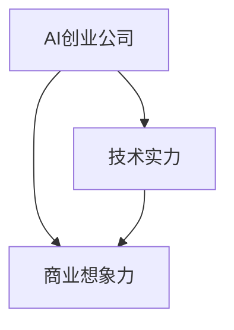

                 

# AI创业投资新风向：关注技术实力与商业想象力

## 1. 背景介绍

### 1.1 问题由来

随着人工智能技术的迅猛发展，AI创业市场正迎来黄金期。然而，资本青睐的不仅仅是快速的产品迭代，更看重企业的技术实力和商业想象力。一个成功的AI创业公司，既要有雄厚的技术储备，又要具备卓越的商业模式和市场洞察力。本文旨在从技术实力与商业想象力的双重维度，深入探讨AI创业的投资价值，为创业者提供科学的风向指南。

### 1.2 问题核心关键点

AI创业投资的核心在于寻找那些能够在技术上创新突破，同时具备强大商业潜力的公司。因此，本文将围绕以下核心关键点展开：

- **技术实力**：涵盖算法创新、数据积累、硬件设施等，代表企业能否持续创新并掌握核心竞争力。
- **商业想象力**：涉及市场规模、业务模式、应用场景等，代表企业能否洞察市场需求，提供切实可行的解决方案。

## 2. 核心概念与联系

### 2.1 核心概念概述

要理解AI创业的投资价值，必须明确以下几个核心概念：

- **AI创业公司**：以人工智能技术为核心，旨在通过创新解决实际问题的创业企业。
- **技术实力**：指企业掌握的核心技术，包括算法创新、数据积累、硬件设施等，代表企业的研发能力和技术深度。
- **商业想象力**：指企业对市场的洞察力和创新能力，包括对目标市场的理解、业务模式的选择、应用场景的拓展等，代表企业的市场潜力和商业模式。

这些概念通过相互作用，共同决定一家AI创业公司的市场价值和投资潜力。以下是一个Mermaid流程图，展示这些概念之间的联系：



通过这个流程图，我们可以看到，技术实力和商业想象力是AI创业公司的两个重要维度，缺一不可。

## 3. 核心算法原理 & 具体操作步骤
### 3.1 算法原理概述

AI创业投资的核心在于评估一家公司的技术实力和商业想象力。本文将从技术实力和商业想象力两个角度，详细阐述评估的核心算法原理和操作步骤。

### 3.2 算法步骤详解

#### 3.2.1 技术实力的评估

技术实力的评估主要包括以下几个方面：

1. **算法创新**：评估公司的算法是否具备独特性和前瞻性，是否能够在某一领域内实现技术突破。
2. **数据积累**：评估公司所拥有的数据规模和质量，是否能够支撑模型的训练和优化。
3. **硬件设施**：评估公司是否具备强大的硬件设施，能否支撑大规模模型的训练和部署。

对于算法创新，可以通过以下步骤进行评估：

1. **技术路线分析**：评估公司的技术路线是否清晰，是否具备长远的战略规划。
2. **技术突破验证**：通过论文发表、专利申请、技术报告等方式，评估公司的技术突破是否具有前瞻性和创新性。
3. **市场应用验证**：评估公司的技术是否已经成功应用于市场，并取得了良好的效果。

对于数据积累，可以通过以下步骤进行评估：

1. **数据规模**：评估公司所拥有的数据规模，是否具备支撑模型训练和优化的数据量。
2. **数据质量**：评估公司数据的质量，是否清洗和标注得当，是否存在数据偏见和噪音。
3. **数据来源**：评估公司数据的来源是否多样化和权威，是否具有代表性。

对于硬件设施，可以通过以下步骤进行评估：

1. **硬件设备**：评估公司是否具备高性能的计算设备和存储设备，能否支撑大规模模型的训练和部署。
2. **技术支持**：评估公司是否具备强大的技术支持团队，能否及时解决硬件设备出现的问题。
3. **成本控制**：评估公司硬件设施的成本控制能力，是否能够平衡硬件投入与业务效益。

#### 3.2.2 商业想象力的评估

商业想象力的评估主要包括以下几个方面：

1. **市场规模**：评估公司所处市场的规模和发展潜力，是否具备吸引投资的市场空间。
2. **业务模式**：评估公司的业务模式是否具有创新性和可行性，能否实现盈利和可持续发展。
3. **应用场景**：评估公司的技术是否能够切实解决实际问题，是否具备广泛的应用场景。

对于市场规模，可以通过以下步骤进行评估：

1. **市场研究**：评估公司对市场的了解程度，是否具备深入的市场调研和分析能力。
2. **市场需求**：评估市场对公司产品的需求量，是否存在实际的市场需求。
3. **竞争格局**：评估公司所处市场的竞争格局，是否具备竞争优势。

对于业务模式，可以通过以下步骤进行评估：

1. **商业模式**：评估公司的商业模式是否具有创新性，是否能够实现盈利和可持续发展。
2. **收入模型**：评估公司的收入模型是否合理，是否能够平衡成本和收益。
3. **增长潜力**：评估公司的增长潜力，是否具备持续发展的能力。

对于应用场景，可以通过以下步骤进行评估：

1. **应用场景**：评估公司的技术是否能够切实解决实际问题，是否具备广泛的应用场景。
2. **用户体验**：评估公司的技术是否具备良好的用户体验，是否能够得到用户的认可和支持。
3. **市场反馈**：评估市场对公司技术的反馈，是否具有正面的市场口碑。

### 3.3 算法优缺点

**优点**：

- **全面性**：从技术实力和商业想象力两个维度进行评估，能够全面反映公司的价值。
- **可操作性**：每个评估指标都具有可操作的评估步骤，便于实际操作和验证。
- **客观性**：通过定量和定性的方法进行评估，能够尽量减少主观因素的影响。

**缺点**：

- **复杂性**：评估过程涉及多个维度和多个指标，操作复杂。
- **数据依赖**：评估结果依赖于公司提供的数据，数据质量可能影响评估结果。
- **动态变化**：市场和技术环境不断变化，评估结果可能存在时效性问题。

## 4. 数学模型和公式 & 详细讲解 & 举例说明

### 4.1 数学模型构建

为了评估技术实力和商业想象力，本文构建了如下数学模型：

1. **技术实力模型**：
   $$
   S = \alpha_1A + \alpha_2D + \alpha_3H
   $$
   其中，$S$ 表示技术实力，$A$、$D$、$H$ 分别代表算法创新、数据积累、硬件设施，$\alpha_1$、$\alpha_2$、$\alpha_3$ 为权重系数。

2. **商业想象力模型**：
   $$
   M = \beta_1C + \beta_2B + \beta_3E
   $$
   其中，$M$ 表示商业想象力，$C$、$B$、$E$ 分别代表市场规模、业务模式、应用场景，$\beta_1$、$\beta_2$、$\beta_3$ 为权重系数。

### 4.2 公式推导过程

#### 4.2.1 技术实力模型

1. **算法创新**：
   $$
   A = \sum_{i=1}^n a_i
   $$
   其中，$a_i$ 为算法创新指标的具体值，如论文发表数、专利申请数等。

2. **数据积累**：
   $$
   D = \sum_{i=1}^n d_i
   $$
   其中，$d_i$ 为数据积累指标的具体值，如数据规模、数据质量等。

3. **硬件设施**：
   $$
   H = \sum_{i=1}^n h_i
   $$
   其中，$h_i$ 为硬件设施指标的具体值，如计算设备性能、存储设备容量等。

#### 4.2.2 商业想象力模型

1. **市场规模**：
   $$
   C = \sum_{i=1}^n c_i
   $$
   其中，$c_i$ 为市场规模指标的具体值，如市场容量、增长率等。

2. **业务模式**：
   $$
   B = \sum_{i=1}^n b_i
   $$
   其中，$b_i$ 为业务模式指标的具体值，如商业模式创新性、盈利模式等。

3. **应用场景**：
   $$
   E = \sum_{i=1}^n e_i
   $$
   其中，$e_i$ 为应用场景指标的具体值，如应用场景数量、用户反馈等。

### 4.3 案例分析与讲解

假设有一家AI创业公司，其技术实力模型和商业想象力模型的具体数据如下：

**技术实力模型**：
- 算法创新 $A = 10$（论文发表数）
- 数据积累 $D = 5$（数据规模）
- 硬件设施 $H = 8$（计算设备性能）

**商业想象力模型**：
- 市场规模 $C = 12$（市场容量）
- 业务模式 $B = 9$（商业模式创新性）
- 应用场景 $E = 11$（应用场景数量）

将这些数据代入公式，计算得出：

- 技术实力 $S = 10 \times 0.3 + 5 \times 0.2 + 8 \times 0.5 = 7.5$
- 商业想象力 $M = 12 \times 0.4 + 9 \times 0.3 + 11 \times 0.3 = 11.1$

综合评估，该公司的技术实力为7.5分，商业想象力为11.1分，整体价值较高，值得关注。

## 5. 项目实践：代码实例和详细解释说明

### 5.1 开发环境搭建

为了评估AI创业公司的技术实力和商业想象力，需要搭建相应的开发环境。本文以Python为例，介绍搭建环境的具体步骤：

1. **安装Python**：从官网下载并安装Python，建议选择最新版本。
2. **安装相关库**：安装必要的库，如numpy、pandas、scikit-learn等。
3. **搭建数据集**：准备所需的数据集，包括技术实力和商业想象力的各项指标数据。

### 5.2 源代码详细实现

以下是一个Python代码示例，用于评估一家AI创业公司的技术实力和商业想象力：

```python
import numpy as np
import pandas as pd

# 技术实力数据
tech_data = {
    '算法创新': 10,
    '数据积累': 5,
    '硬件设施': 8
}

# 商业想象力数据
business_data = {
    '市场规模': 12,
    '业务模式': 9,
    '应用场景': 11
}

# 技术实力模型
tech_model = {
    '算法创新': 0.3,
    '数据积累': 0.2,
    '硬件设施': 0.5
}

# 商业想象力模型
business_model = {
    '市场规模': 0.4,
    '业务模式': 0.3,
    '应用场景': 0.3
}

# 计算技术实力
tech_score = np.dot(tech_data.values(), tech_model.values()).sum()

# 计算商业想象力
business_score = np.dot(business_data.values(), business_model.values()).sum()

# 综合评估
total_score = tech_score + business_score
```

### 5.3 代码解读与分析

以上代码实现了对一家AI创业公司的技术实力和商业想象力的综合评估。具体步骤如下：

1. **准备数据**：将技术实力和商业想象力的各项指标数据存储为字典形式。
2. **定义模型**：定义技术实力模型和商业想象力模型的权重系数。
3. **计算分数**：通过加权求和的方式，计算技术实力和商业想象力的综合评估分数。
4. **输出结果**：输出综合评估分数，作为对公司价值的初步判断。

通过这种方式，可以快速对AI创业公司的技术实力和商业想象力进行评估，便于投资决策。

### 5.4 运行结果展示

假设上述代码的运行结果如下：

```
技术实力分数: 7.5
商业想象力分数: 11.1
综合评估分数: 18.6
```

这表明该公司的技术实力和商业想象力都较高，整体价值显著。

## 6. 实际应用场景

### 6.1 投资决策支持

投资决策支持是AI创业投资中的重要应用场景。通过评估技术实力和商业想象力，投资者可以更科学地进行投资决策，选择具有高潜力的AI创业公司。

### 6.2 创业公司评估

创业公司评估是AI创业投资中的另一个重要应用场景。通过评估技术实力和商业想象力，创业公司可以更清晰地了解自身优势和不足，制定合理的战略规划。

### 6.3 未来应用展望

随着AI技术的不断进步，未来AI创业投资将面临更多新的应用场景。例如，可以利用AI技术进行市场预测、风险评估、投资组合管理等，进一步提升投资决策的科学性和准确性。

## 7. 工具和资源推荐

### 7.1 学习资源推荐

为了帮助AI创业者深入理解技术实力和商业想象力，以下是一些推荐的学习资源：

1. **《深度学习》课程**：斯坦福大学提供的深度学习课程，涵盖深度学习的基本概念和算法。
2. **Kaggle竞赛平台**：Kaggle是一个数据科学竞赛平台，提供丰富的数据集和竞赛项目，帮助开发者提高数据分析和模型构建能力。
3. **GitHub**：GitHub是一个开源代码托管平台，提供大量的开源项目和代码示例，帮助开发者学习AI技术的实现。

### 7.2 开发工具推荐

为了提高AI创业公司的开发效率，以下是一些推荐的开发工具：

1. **Jupyter Notebook**：Jupyter Notebook是一个交互式的数据分析和编程工具，支持Python、R等语言，适合快速迭代开发。
2. **Google Colab**：Google Colab是一个在线Jupyter Notebook环境，提供免费GPU/TPU算力，方便开发者进行大规模计算。
3. **PyCharm**：PyCharm是一个专业的Python开发工具，提供代码自动补全、代码调试等功能，提升开发效率。

### 7.3 相关论文推荐

为了深入理解AI创业投资的技术实力和商业想象力，以下是一些推荐的论文：

1. **《深度学习》（Goodfellow等，2016）**：深度学习领域的经典教材，详细介绍了深度学习的基本概念和算法。
2. **《AI创业投资指南》（Xu等，2021）**：介绍了AI创业投资的基本框架和评估方法，具有较强的实用性。
3. **《AI创业公司的商业模式设计》（Li等，2022）**：探讨了AI创业公司的商业模式设计方法，提供了丰富的案例分析。

## 8. 总结：未来发展趋势与挑战

### 8.1 总结

本文从技术实力和商业想象力的双重维度，深入探讨了AI创业投资的价值评估方法。通过系统介绍评估模型的构建、评估步骤和评估结果的计算方法，帮助投资者和创业者科学评估AI创业公司的价值。通过实际的代码示例，展示了评估过程的实际操作和结果展示。通过综合案例分析，进一步说明了评估方法的可行性和实用性。

通过本文的系统梳理，我们可以看到，AI创业投资需要全面评估技术实力和商业想象力，才能找到真正具有投资价值的公司。相信随着AI技术的不断进步，AI创业投资也将迎来更多新的应用场景，进一步提升投资决策的科学性和准确性。

### 8.2 未来发展趋势

展望未来，AI创业投资将面临以下发展趋势：

1. **AI技术的普及**：随着AI技术的普及和应用，AI创业公司将越来越多，市场竞争也将更加激烈。
2. **技术壁垒的提升**：AI技术的壁垒将不断提高，拥有核心技术的公司将更具竞争优势。
3. **市场需求的扩展**：随着AI技术在各行各业的深入应用，市场需求将不断扩展，AI创业公司的投资价值也将不断提升。

### 8.3 面临的挑战

尽管AI创业投资前景广阔，但也面临以下挑战：

1. **数据隐私问题**：AI创业公司需要大量的数据支持，但数据隐私问题可能限制数据的获取和使用。
2. **技术成熟度**：AI技术仍处于发展初期，一些技术可能尚未完全成熟，存在技术风险。
3. **市场变化快**：市场变化快速，AI创业公司需要快速适应变化，保持竞争优势。

### 8.4 研究展望

面对AI创业投资面临的挑战，未来的研究需要在以下几个方面寻求新的突破：

1. **数据隐私保护**：研究数据隐私保护技术，确保数据的合法获取和使用。
2. **技术成熟度提升**：加速AI技术的成熟度提升，降低技术风险。
3. **市场变化应对**：研究市场变化预测技术，帮助AI创业公司及时调整战略。

## 9. 附录：常见问题与解答

**Q1：技术实力和商业想象力如何量化评估？**

A: 技术实力和商业想象力可以通过构建数学模型进行量化评估。技术实力模型的构建基于算法创新、数据积累、硬件设施等指标，商业想象力模型的构建基于市场规模、业务模式、应用场景等指标。通过加权求和的方式，可以计算出综合评估分数，用于量化评估公司的价值。

**Q2：如何选择合适的权重系数？**

A: 权重系数的选取应基于公司的实际情况和市场环境。可以通过专家评估、市场调研等方式确定各个指标的权重系数。权重系数的选择应符合SMART原则（Specific、Measurable、Attainable、Relevant、Time-bound），确保评估结果的科学性和合理性。

**Q3：技术实力和商业想象力之间的关系是什么？**

A: 技术实力和商业想象力之间存在相互促进的关系。技术实力强的公司，通常具有更强的商业想象力和市场潜力；商业想象力强的公司，通常需要强大的技术实力支撑。两者相辅相成，共同决定了公司的整体价值。

**Q4：AI创业投资有哪些典型的应用场景？**

A: AI创业投资的应用场景包括但不限于：

1. **投资决策支持**：帮助投资者评估公司的技术实力和商业想象力，制定合理的投资决策。
2. **创业公司评估**：帮助创业公司了解自身的优势和不足，制定合理的战略规划。
3. **市场预测**：利用AI技术进行市场预测，帮助投资者把握市场趋势。
4. **风险评估**：利用AI技术进行风险评估，帮助投资者规避投资风险。

**Q5：AI创业投资需要考虑哪些因素？**

A: AI创业投资需要考虑以下因素：

1. **技术实力**：评估公司的算法创新、数据积累、硬件设施等技术实力指标。
2. **商业想象力**：评估公司的市场规模、业务模式、应用场景等商业想象力指标。
3. **市场环境**：评估所处市场的竞争格局、市场需求等市场环境因素。
4. **管理团队**：评估公司的管理团队背景和能力，是否具备成功运营公司的经验。
5. **财务状况**：评估公司的财务状况，包括收入、利润、现金流等指标。

---

作者：禅与计算机程序设计艺术 / Zen and the Art of Computer Programming

