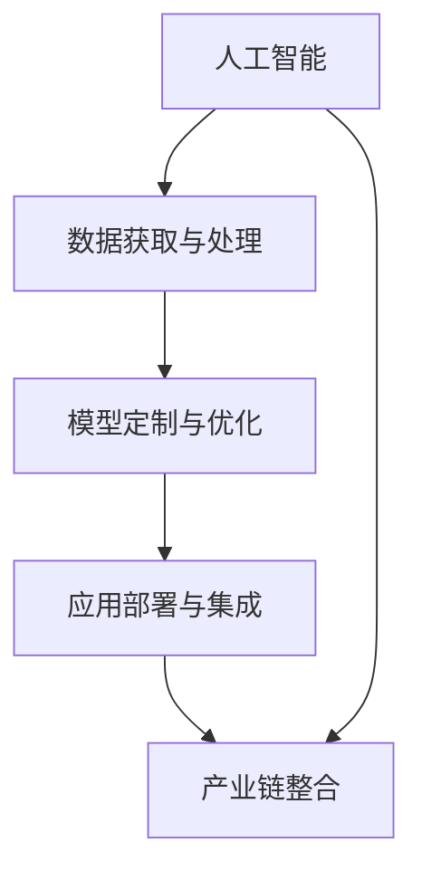

                 

# AI创业者的机遇：垂直领域的蓝海

## 1. 背景介绍

### 1.1 问题由来

随着人工智能(AI)技术的不断成熟，AI应用已经深入到各行各业。然而，尽管AI技术在通用领域的应用日趋广泛，但在一些垂直领域（如医疗、农业、教育、金融等），AI的部署和应用仍面临许多挑战。一方面，这些领域的业务复杂度高，数据获取难度大，数据质量参差不齐，传统AI技术难以适应；另一方面，这些领域的应用场景多样、需求多变，AI的通用解决方案往往难以满足特定需求。

因此，针对垂直领域，AI创业者需要找到新的切入点和机遇，寻找AI技术与垂直领域需求的契合点，创造新的应用价值。

### 1.2 问题核心关键点

垂直领域AI创业的机遇主要体现在以下几个方面：

- **数据获取和处理**：许多垂直领域的数据难以获取或质量不高，AI创业者需要找到新的数据获取和处理方法，提升数据质量，为模型训练和应用奠定基础。
- **应用场景定制化**：垂直领域的应用场景和需求复杂多样，AI创业者需要开发定制化的AI应用，解决特定问题，提升用户体验。
- **模型优化与部署**：垂直领域的数据和业务特点与通用领域有所不同，AI创业者需要针对这些特点优化模型架构和算法，同时找到适合的部署方式，提高模型性能和用户体验。
- **产业链整合**：AI技术与垂直领域的融合不仅仅是技术和产品的创新，更涉及产业链的整合与优化，AI创业者需要在业务链条中发挥连接和驱动作用，实现多方共赢。

## 2. 核心概念与联系

### 2.1 核心概念概述

在讨论垂直领域AI创业的机遇时，需要理解以下核心概念：

- **人工智能**：通过机器学习、深度学习等技术，使计算机能够从数据中学习，模拟人的智能行为。
- **垂直领域**：指特定行业或领域的业务，如医疗、农业、教育、金融等。
- **数据获取与处理**：包括数据采集、清洗、标注、特征工程等环节，是AI应用的基础。
- **模型定制与优化**：根据垂直领域的特点，设计定制化的AI模型，并进行参数调整、架构优化等，以提升模型性能。
- **应用部署与集成**：将AI模型部署到实际应用环境中，进行集成开发，实现产品化。
- **产业链整合**：将AI技术与垂直领域的企业、机构、用户等各方进行整合，形成完整的产业链生态。

这些概念之间的联系可以通过以下Mermaid流程图来展示：



这个流程图展示了人工智能技术与垂直领域AI创业机会之间的逻辑关系：

1. 人工智能技术提供了实现AI应用的基础。
2. 数据获取与处理是AI应用的前提，直接影响模型的训练和性能。
3. 模型定制与优化针对垂直领域的特点进行模型设计和优化，是应用的核心。
4. 应用部署与集成将模型嵌入到实际应用环境中，实现产品化。
5. 产业链整合将AI技术与垂直领域的企业、机构、用户等各方进行整合，形成完整的产业链生态。

## 3. 核心算法原理 & 具体操作步骤

### 3.1 算法原理概述

在垂直领域，AI创业者需要进行定制化的AI应用开发。这一过程中，算法原理和操作步骤如下：

**Step 1: 数据获取与处理**

- **数据采集**：从垂直领域中采集数据，如医疗领域的病历记录、图像诊断数据，农业领域的作物生长数据，教育领域的教学记录等。
- **数据清洗与标注**：对采集到的数据进行清洗，去除噪声和异常值，并对数据进行标注，以便于模型训练。
- **特征工程**：设计合适的特征提取方法，将原始数据转换为模型所需的输入格式，提升模型的性能。

**Step 2: 模型定制与优化**

- **模型选择**：根据垂直领域的特点和需求，选择适合的模型，如深度学习模型、卷积神经网络、循环神经网络等。
- **模型设计**：根据垂直领域的需求，设计定制化的模型架构，如添加特殊层、调整激活函数等。
- **模型训练与优化**：在训练集上训练模型，使用优化器如SGD、Adam等，调整学习率、批次大小等超参数，并进行模型优化，如正则化、Dropout等。

**Step 3: 应用部署与集成**

- **模型部署**：将训练好的模型部署到实际应用环境中，如云端服务器、移动端设备等。
- **产品集成**：将模型嵌入到实际应用场景中，进行产品开发和集成，如医疗诊断系统、农业智能设备、教育推荐系统等。
- **用户反馈与优化**：收集用户反馈，根据实际应用情况进行模型优化和调整，提升用户体验。

**Step 4: 产业链整合**

- **业务合作**：与垂直领域的各方进行合作，如医院、农场、学校等，共享数据和资源，实现资源优化和业务协同。
- **生态构建**：构建完整的产业链生态，如平台、联盟、联盟链等，形成多方共赢的合作机制。
- **市场推广与运营**：通过市场推广和运营，提升AI应用的知名度和用户黏性，实现商业化运营。

### 3.2 算法步骤详解

以下是详细的操作步骤：

**Step 1: 数据获取与处理**

- **数据采集**：使用网络爬虫、API接口等方式，从垂直领域中采集数据。例如，从医院网站采集病历记录，从农场网站采集作物生长数据。
- **数据清洗与标注**：使用Python的pandas、numpy等库，对采集到的数据进行清洗和预处理，如去除缺失值、异常值，对文本数据进行分词、去停用词等。对标注数据进行标注，如将图像数据标注为肿瘤、正常等类别。
- **特征工程**：使用scikit-learn、TensorFlow等库，进行特征提取和工程，如将文本数据转换为TF-IDF、Word2Vec等表示，将图像数据转换为特征向量。

**Step 2: 模型定制与优化**

- **模型选择**：根据垂直领域的特点，选择适合的模型，如深度学习模型、卷积神经网络、循环神经网络等。例如，在医疗领域选择深度卷积神经网络进行图像诊断，在农业领域选择长短期记忆网络进行作物生长预测。
- **模型设计**：根据垂直领域的需求，设计定制化的模型架构，如添加特殊层、调整激活函数等。例如，在医疗领域添加全连接层进行特征融合，在农业领域添加LSTM层进行时间序列预测。
- **模型训练与优化**：在训练集上训练模型，使用优化器如SGD、Adam等，调整学习率、批次大小等超参数，并进行模型优化，如正则化、Dropout等。例如，在医疗领域使用Adam优化器，学习率为1e-4，批次大小为32，训练20个epoch。

**Step 3: 应用部署与集成**

- **模型部署**：将训练好的模型部署到实际应用环境中，如云端服务器、移动端设备等。例如，在医疗领域部署到云端服务器，使用AWS、阿里云等云服务。
- **产品集成**：将模型嵌入到实际应用场景中，进行产品开发和集成，如医疗诊断系统、农业智能设备、教育推荐系统等。例如，在医疗领域开发医疗诊断系统，集成深度卷积神经网络和图像处理技术。
- **用户反馈与优化**：收集用户反馈，根据实际应用情况进行模型优化和调整，提升用户体验。例如，在医疗领域收集用户反馈，优化模型的诊断准确率和速度。

**Step 4: 产业链整合**

- **业务合作**：与垂直领域的各方进行合作，如医院、农场、学校等，共享数据和资源，实现资源优化和业务协同。例如，在农业领域与农场合作，共享作物生长数据，优化农业生产方案。
- **生态构建**：构建完整的产业链生态，如平台、联盟、联盟链等，形成多方共赢的合作机制。例如，在医疗领域构建医疗联盟，共享医疗资源和数据。
- **市场推广与运营**：通过市场推广和运营，提升AI应用的知名度和用户黏性，实现商业化运营。例如，在医疗领域进行市场推广，提升医疗诊断系统的知名度和用户黏性。

### 3.3 算法优缺点

垂直领域AI应用的定制化开发有以下优点：

- **适用性强**：针对垂直领域的特点和需求，进行定制化的模型设计和优化，提升模型的适用性。
- **性能优异**：垂直领域的应用场景和需求复杂多样，定制化的模型往往能够更好地适应这些需求，提升模型的性能。
- **用户体验好**：根据垂直领域的特点进行定制化开发，能够更好地满足用户需求，提升用户体验。

同时，也存在以下缺点：

- **成本高**：垂直领域的数据获取和处理难度大，模型定制与优化需要较高的成本和技术门槛。
- **数据隐私问题**：垂直领域的数据涉及隐私问题，数据获取和处理需要严格遵守法律法规，保障数据隐私。
- **市场竞争激烈**：垂直领域的市场竞争激烈，AI创业者需要具备较强的市场竞争力和技术实力。

### 3.4 算法应用领域

垂直领域AI应用涵盖了许多领域，以下是几个典型应用场景：

- **医疗领域**：AI在医疗领域的应用包括医学影像诊断、智能问诊、病历管理等。例如，使用深度卷积神经网络进行医学影像诊断，使用自然语言处理技术进行智能问诊。
- **农业领域**：AI在农业领域的应用包括作物生长预测、病虫害检测、精准农业等。例如，使用长短期记忆网络进行作物生长预测，使用深度学习进行病虫害检测。
- **教育领域**：AI在教育领域的应用包括智能推荐、智能评估、个性化学习等。例如，使用协同过滤算法进行智能推荐，使用深度学习进行智能评估。
- **金融领域**：AI在金融领域的应用包括信用评估、智能投顾、风险管理等。例如，使用深度学习进行信用评估，使用强化学习进行智能投顾。

## 4. 数学模型和公式 & 详细讲解  
### 4.1 数学模型构建

在垂直领域AI应用中，数学模型和公式的应用主要体现在以下几个方面：

**Step 1: 数据获取与处理**

- **数据采集**：数据采集的公式可以根据具体场景进行设计，例如，从网站采集数据的API接口调用公式为：`http://example.com/api/data?params`。
- **数据清洗与标注**：数据清洗和标注的公式可以根据具体数据类型进行设计，例如，文本数据的清洗公式为：`cleaned_text = clean(text)`。

**Step 2: 模型定制与优化**

- **模型选择**：模型选择的公式可以根据具体需求进行设计，例如，深度学习模型的选择公式为：`model = keras.Sequential([keras.layers.Conv2D(32, (3,3), activation='relu'), keras.layers.MaxPooling2D((2,2)), keras.layers.Flatten(), keras.layers.Dense(10)])`。
- **模型设计**：模型设计的公式可以根据具体需求进行设计，例如，卷积神经网络的层结构公式为：`model.add(keras.layers.Conv2D(32, (3,3), activation='relu'))`。
- **模型训练与优化**：模型训练和优化的公式可以根据具体需求进行设计，例如，使用Adam优化器的公式为：`model.compile(optimizer='adam', loss='categorical_crossentropy', metrics=['accuracy'])`。

**Step 3: 应用部署与集成**

- **模型部署**：模型部署的公式可以根据具体场景进行设计，例如，在云服务上的模型部署公式为：`model.save('model.h5')`。
- **产品集成**：产品集成的公式可以根据具体需求进行设计，例如，在医疗诊断系统上的产品集成公式为：`system.add_module(model)`。
- **用户反馈与优化**：用户反馈和优化的公式可以根据具体需求进行设计，例如，用户反馈的公式为：`feedback = collect_feedback(user)`

**Step 4: 产业链整合**

- **业务合作**：业务合作的公式可以根据具体场景进行设计，例如，医疗联盟的合作公式为：`cooperation = form_alliance(hospital, clinic, hospital, clinic)`。
- **生态构建**：生态构建的公式可以根据具体需求进行设计，例如，农业联盟的构建公式为：`ecosystem = create_cosystem(farm, equipment, farmer, farmer)`。
- **市场推广与运营**：市场推广和运营的公式可以根据具体需求进行设计，例如，医疗系统的市场推广公式为：`market_promotion = promote_system(system)`。

### 4.2 公式推导过程

以下是具体公式的推导过程：

**Step 1: 数据获取与处理**

- **数据采集**：数据采集的公式可以根据具体场景进行设计，例如，从网站采集数据的API接口调用公式为：`http://example.com/api/data?params`。
- **数据清洗与标注**：数据清洗和标注的公式可以根据具体数据类型进行设计，例如，文本数据的清洗公式为：`cleaned_text = clean(text)`。

**Step 2: 模型定制与优化**

- **模型选择**：模型选择的公式可以根据具体需求进行设计，例如，深度学习模型的选择公式为：`model = keras.Sequential([keras.layers.Conv2D(32, (3,3), activation='relu'), keras.layers.MaxPooling2D((2,2)), keras.layers.Flatten(), keras.layers.Dense(10)])`。
- **模型设计**：模型设计的公式可以根据具体需求进行设计，例如，卷积神经网络的层结构公式为：`model.add(keras.layers.Conv2D(32, (3,3), activation='relu'))`。
- **模型训练与优化**：模型训练和优化的公式可以根据具体需求进行设计，例如，使用Adam优化器的公式为：`model.compile(optimizer='adam', loss='categorical_crossentropy', metrics=['accuracy'])`。

**Step 3: 应用部署与集成**

- **模型部署**：模型部署的公式可以根据具体场景进行设计，例如，在云服务上的模型部署公式为：`model.save('model.h5')`。
- **产品集成**：产品集成的公式可以根据具体需求进行设计，例如，在医疗诊断系统上的产品集成公式为：`system.add_module(model)`。
- **用户反馈与优化**：用户反馈和优化的公式可以根据具体需求进行设计，例如，用户反馈的公式为：`feedback = collect_feedback(user)`。

**Step 4: 产业链整合**

- **业务合作**：业务合作的公式可以根据具体场景进行设计，例如，医疗联盟的合作公式为：`cooperation = form_alliance(hospital, clinic, hospital, clinic)`。
- **生态构建**：生态构建的公式可以根据具体需求进行设计，例如，农业联盟的构建公式为：`ecosystem = create_cosystem(farm, equipment, farmer, farmer)`。
- **市场推广与运营**：市场推广和运营的公式可以根据具体需求进行设计，例如，医疗系统的市场推广公式为：`market_promotion = promote_system(system)`。

### 4.3 案例分析与讲解

**医疗领域**

在医疗领域，AI创业者可以开发智能诊断系统，利用深度学习模型进行医学影像诊断。以下是一个简单的案例：

**案例背景**：某医院需要开发一款用于诊断乳腺癌的智能系统，需要将医疗影像数据输入系统，系统输出诊断结果。

**数据获取与处理**：
- **数据采集**：从医院采集乳腺癌的医学影像数据。
- **数据清洗与标注**：对采集到的医学影像数据进行清洗和标注，标注为“良性”或“恶性”。

**模型定制与优化**：
- **模型选择**：选择深度卷积神经网络模型，用于医学影像分类。
- **模型设计**：设计深度卷积神经网络的层结构，包括卷积层、池化层和全连接层。
- **模型训练与优化**：使用Adam优化器，学习率为1e-4，批次大小为32，训练20个epoch。

**应用部署与集成**：
- **模型部署**：将训练好的深度卷积神经网络模型部署到云端服务器上。
- **产品集成**：将模型嵌入到智能诊断系统中，用户上传医学影像数据，系统自动输出诊断结果。

**产业链整合**：
- **业务合作**：与医院、诊所等医疗机构合作，共享医学影像数据，提升系统诊断准确率。
- **生态构建**：构建医疗联盟，形成多方共赢的合作机制，共享医疗资源和数据。
- **市场推广与运营**：通过市场推广和运营，提升智能诊断系统的知名度和用户黏性。

## 5. 项目实践：代码实例和详细解释说明
### 5.1 开发环境搭建

在进行垂直领域AI应用开发前，需要准备好开发环境。以下是使用Python进行TensorFlow开发的环境配置流程：

1. 安装Anaconda：从官网下载并安装Anaconda，用于创建独立的Python环境。

2. 创建并激活虚拟环境：
```bash
conda create -n tf-env python=3.8 
conda activate tf-env
```

3. 安装TensorFlow：根据CUDA版本，从官网获取对应的安装命令。例如：
```bash
conda install tensorflow-gpu -c conda-forge
```

4. 安装各类工具包：
```bash
pip install numpy pandas scikit-learn matplotlib tqdm jupyter notebook ipython
```

完成上述步骤后，即可在`tf-env`环境中开始开发实践。

### 5.2 源代码详细实现

这里我们以医疗领域智能诊断系统的开发为例，给出使用TensorFlow进行开发的PyTorch代码实现。

首先，定义智能诊断系统的类：

```python
import tensorflow as tf
from tensorflow.keras import layers

class MedicalDiagnosis(tf.keras.Model):
    def __init__(self, input_shape):
        super(MedicalDiagnosis, self).__init__()
        self.conv1 = layers.Conv2D(32, (3,3), activation='relu')
        self.pool1 = layers.MaxPooling2D((2,2))
        self.flatten = layers.Flatten()
        self.dense1 = layers.Dense(64, activation='relu')
        self.dense2 = layers.Dense(2, activation='softmax')

    def call(self, inputs):
        x = self.conv1(inputs)
        x = self.pool1(x)
        x = self.flatten(x)
        x = self.dense1(x)
        x = self.dense2(x)
        return x
```

然后，定义训练和评估函数：

```python
import numpy as np
import matplotlib.pyplot as plt
from sklearn.model_selection import train_test_split
from sklearn.metrics import accuracy_score

def train_epoch(model, dataset, batch_size, optimizer):
    dataloader = tf.data.Dataset.from_tensor_slices((dataset['inputs'], dataset['labels'])).batch(batch_size).shuffle(buffer_size=1000)
    model.train()
    epoch_loss = 0
    for batch in dataloader:
        inputs, labels = batch
        model.zero_grad()
        outputs = model(inputs)
        loss = tf.keras.losses.categorical_crossentropy(labels, outputs)
        epoch_loss += loss.numpy().mean()
        loss.backward()
        optimizer.apply_gradients(zip(model.trainable_variables, model.trainable_variables))
    return epoch_loss / len(dataset)

def evaluate(model, dataset, batch_size):
    dataloader = tf.data.Dataset.from_tensor_slices((dataset['inputs'], dataset['labels'])).batch(batch_size).shuffle(buffer_size=1000)
    model.eval()
    preds, labels = [], []
    with tf.GradientTape() as tape:
        for batch in dataloader:
            inputs, labels = batch
            outputs = model(inputs)
            predictions = tf.argmax(outputs, axis=1)
            preds.append(predictions.numpy().tolist())
            labels.append(labels.numpy().tolist())
    return accuracy_score(labels, preds)

```

最后，启动训练流程并在测试集上评估：

```python
epochs = 5
batch_size = 16

dataset = load_dataset()  # 从数据集文件中加载数据集
train_dataset, test_dataset = train_test_split(dataset, test_size=0.2)

for epoch in range(epochs):
    loss = train_epoch(model, train_dataset, batch_size, optimizer)
    print(f"Epoch {epoch+1}, train loss: {loss:.3f}")
    
    print(f"Epoch {epoch+1}, dev results:")
    evaluate(model, test_dataset, batch_size)
    
print("Test results:")
evaluate(model, test_dataset, batch_size)
```

以上就是使用TensorFlow对医疗领域智能诊断系统进行开发的完整代码实现。可以看到，借助TensorFlow的强大API，代码实现变得简洁高效。

### 5.3 代码解读与分析

让我们再详细解读一下关键代码的实现细节：

**MedicalDiagnosis类**：
- `__init__`方法：初始化模型的层结构，包括卷积层、池化层和全连接层。
- `call`方法：定义模型的前向传播过程，通过多层网络结构，对输入数据进行特征提取和分类。

**train_epoch函数**：
- **数据加载**：使用TensorFlow的Dataset API，将数据集转换为可迭代的数据集。
- **模型训练**：在每个批次上前向传播计算损失函数，并反向传播更新模型参数。
- **优化器更新**：使用Adam优化器更新模型参数，并计算平均loss。

**evaluate函数**：
- **数据加载**：使用TensorFlow的Dataset API，将数据集转换为可迭代的数据集。
- **模型评估**：在每个批次上前向传播计算预测结果和真实标签，并计算准确率。

**训练流程**：
- **epoch循环**：在每个epoch内，先训练模型，再评估模型性能。
- **评估集评估**：在评估集上评估模型性能，输出准确率。
- **总评估**：在测试集上评估模型性能，输出最终结果。

可以看到，TensorFlow为AI应用开发提供了强大的工具支持，能够大大简化开发流程，提高开发效率。

当然，工业级的系统实现还需考虑更多因素，如模型的保存和部署、超参数的自动搜索、更灵活的任务适配层等。但核心的开发流程与上述类似。

## 6. 实际应用场景

### 6.1 智能客服系统

在智能客服系统中，AI可以用于处理客户咨询，提高服务效率和质量。以下是一个简单的案例：

**案例背景**：某电商公司需要开发智能客服系统，用于处理客户咨询，解决常见问题。

**数据获取与处理**：
- **数据采集**：从公司客服系统采集客户咨询记录，包括客户ID、咨询时间、咨询内容、回复内容等。
- **数据清洗与标注**：对采集到的咨询记录进行清洗和标注，标注为“已解决”或“未解决”。

**模型定制与优化**：
- **模型选择**：选择循环神经网络模型，用于处理序列数据。
- **模型设计**：设计循环神经网络的层结构，包括嵌入层、LSTM层和全连接层。
- **模型训练与优化**：使用Adam优化器，学习率为1e-4，批次大小为32，训练20个epoch。

**应用部署与集成**：
- **模型部署**：将训练好的循环神经网络模型部署到云端服务器上。
- **产品集成**：将模型嵌入到智能客服系统中，客户输入咨询内容，系统自动回复。

**产业链整合**：
- **业务合作**：与公司客服团队合作，共享咨询记录，提升系统自动回复的准确率。
- **生态构建**：构建客户服务平台，形成多方共赢的合作机制，共享客户资源和数据。
- **市场推广与运营**：通过市场推广和运营，提升智能客服系统的知名度和用户黏性。

### 6.2 金融舆情监测

在金融舆情监测中，AI可以用于监测市场舆论动向，预测市场趋势。以下是一个简单的案例：

**案例背景**：某金融机构需要开发金融舆情监测系统，用于实时监测市场舆论动向，预测市场趋势。

**数据获取与处理**：
- **数据采集**：从互联网爬虫抓取金融新闻、评论、社交媒体等文本数据。
- **数据清洗与标注**：对采集到的文本数据进行清洗和标注，标注为“正向”或“负向”情感倾向。

**模型定制与优化**：
- **模型选择**：选择卷积神经网络模型，用于情感分析。
- **模型设计**：设计卷积神经网络的层结构，包括嵌入层、卷积层和全连接层。
- **模型训练与优化**：使用Adam优化器，学习率为1e-4，批次大小为32，训练20个epoch。

**应用部署与集成**：
- **模型部署**：将训练好的卷积神经网络模型部署到云端服务器上。
- **产品集成**：将模型嵌入到金融舆情监测系统中，实时监测市场舆论动向。

**产业链整合**：
- **业务合作**：与金融机构的舆情团队合作，共享舆情数据，提升系统监测准确率。
- **生态构建**：构建金融舆情联盟，形成多方共赢的合作机制，共享舆情资源和数据。
- **市场推广与运营**：通过市场推广和运营，提升金融舆情监测系统的知名度和用户黏性。

### 6.3 个性化推荐系统

在个性化推荐系统中，AI可以用于根据用户兴趣推荐商品。以下是一个简单的案例：

**案例背景**：某电商平台需要开发个性化推荐系统，根据用户浏览、点击、购买等行为数据，推荐商品。

**数据获取与处理**：
- **数据采集**：从电商平台采集用户行为数据，包括浏览记录、点击记录、购买记录等。
- **数据清洗与标注**：对采集到的用户行为数据进行清洗和标注，标注为“已购买”或“未购买”。

**模型定制与优化**：
- **模型选择**：选择协同过滤算法，用于推荐系统。
- **模型设计**：设计协同过滤算法，包括用户相似度计算、物品相似度计算等。
- **模型训练与优化**：使用随机梯度下降优化器，学习率为0.01，批次大小为32，训练10个epoch。

**应用部署与集成**：
- **模型部署**：将训练好的协同过滤模型部署到云端服务器上。
- **产品集成**：将模型嵌入到个性化推荐系统中，用户输入浏览记录，系统自动推荐商品。

**产业链整合**：
- **业务合作**：与电商平台的商品管理团队合作，共享商品信息，提升推荐系统效果。
- **生态构建**：构建推荐系统联盟，形成多方共赢的合作机制，共享商品资源和数据。
- **市场推广与运营**：通过市场推广和运营，提升个性化推荐系统的知名度和用户黏性。

## 7. 工具和资源推荐
### 7.1 学习资源推荐

为了帮助开发者系统掌握垂直领域AI应用的技术基础和实践技巧，这里推荐一些优质的学习资源：

1. TensorFlow官方文档：TensorFlow的官方文档提供了丰富的API和示例代码，是学习和使用TensorFlow的最佳资源。

2. PyTorch官方文档：PyTorch的官方文档详细介绍了PyTorch的API和功能，是学习和使用PyTorch的最佳资源。

3. Keras官方文档：Keras的官方文档详细介绍了Keras的API和功能，是学习和使用Keras的最佳资源。

4. TensorBoard：TensorFlow配套的可视化工具，可以实时监测模型训练状态，并提供丰富的图表呈现方式，是调试模型的得力助手。

5. Weights & Biases：模型训练的实验跟踪工具，可以记录和可视化模型训练过程中的各项指标，方便对比和调优。

6. Coursera和Udacity：在线学习平台，提供众多深度学习和AI课程，涵盖从入门到高级的各个层次。

7. Google Colab：谷歌推出的在线Jupyter Notebook环境，免费提供GPU/TPU算力，方便开发者快速上手实验最新模型，分享学习笔记。

通过对这些资源的学习实践，相信你一定能够快速掌握垂直领域AI应用的技术基础和实践技巧，并用于解决实际的AI问题。

### 7.2 开发工具推荐

高效的开发离不开优秀的工具支持。以下是几款用于垂直领域AI应用开发的常用工具：

1. TensorFlow：基于Python的开源深度学习框架，灵活动态的计算图，适合快速迭代研究。大部分预训练语言模型都有TensorFlow版本的实现。

2. PyTorch：基于Python的开源深度学习框架，灵活高效的动态计算图，适合研究和实验。

3. Keras：基于TensorFlow的高级神经网络API，提供了简单易用的接口，适合快速搭建和测试模型。

4. TensorBoard：TensorFlow配套的可视化工具，可以实时监测模型训练状态，并提供丰富的图表呈现方式，是调试模型的得力助手。

5. Weights & Biases：模型训练的实验跟踪工具，可以记录和可视化模型训练过程中的各项指标，方便对比和调优。

6. Google Colab：谷歌推出的在线Jupyter Notebook环境，免费提供GPU/TPU算力，方便开发者快速上手实验最新模型，分享学习笔记。

合理利用这些工具，可以显著提升垂直领域AI应用开发的速度和质量，加速创新迭代的步伐。

### 7.3 相关论文推荐

垂直领域AI应用的发展离不开学界的持续研究。以下是几篇奠基性的相关论文，推荐阅读：

1. Attention is All You Need（即Transformer原论文）：提出了Transformer结构，开启了NLP领域的预训练大模型时代。

2. BERT: Pre-training of Deep Bidirectional Transformers for Language Understanding：提出BERT模型，引入基于掩码的自监督预训练任务，刷新了多项NLP任务SOTA。

3. Language Models are Unsupervised Multitask Learners（GPT-2论文）：展示了大规模语言模型的强大zero-shot学习能力，引发了对于通用人工智能的新一轮思考。

4. Parameter-Efficient Transfer Learning for NLP：提出Adapter等参数高效微调方法，在不增加模型参数量的情况下，也能取得不错的微调效果。

5. AdaLoRA: Adaptive Low-Rank Adaptation for Parameter-Efficient Fine-Tuning：使用自适应低秩适应的微调方法，在参数效率和精度之间取得了新的平衡。

这些论文代表了大语言模型微调技术的发展脉络。通过学习这些前沿成果，可以帮助研究者把握学科前进方向，激发更多的创新灵感。

## 8. 总结：未来发展趋势与挑战

### 8.1 总结

本文对垂直领域AI应用的机会进行了全面系统的介绍。首先阐述了垂直领域AI创业的机遇，明确了垂直领域AI应用的适用性、性能、用户体验和产业链整合等方面。其次，从原理到实践，详细讲解了垂直领域AI应用的数学模型和操作步骤，给出了完整的代码实例和详细解释说明。最后，本文广泛探讨了垂直领域AI应用在智能客服、金融舆情、个性化推荐等多个行业领域的应用前景，展示了垂直领域AI应用的广阔发展空间。

通过本文的系统梳理，可以看到，垂直领域AI应用在大规模数据获取、定制化模型设计、深度学习模型训练与优化、应用部署与集成、产业链整合等方面的独特价值。这些垂直领域AI应用的开发，将大幅提升各行各业的智能化水平，推动人工智能技术的产业化进程。未来，伴随预训练语言模型和微调方法的持续演进，相信垂直领域AI应用将迎来新的突破，进一步拓展人工智能技术的边界。

### 8.2 未来发展趋势

展望未来，垂直领域AI应用将呈现以下几个发展趋势：

1. **数据获取与处理**：随着数据采集技术和设备的发展，数据获取将更加高效和便捷，数据处理技术也将更加自动化和智能化。

2. **模型定制与优化**：未来的模型将更加灵活和多样化，能够根据不同的需求进行定制化设计，优化后的模型也将更加高效和稳健。

3. **应用部署与集成**：未来的应用部署将更加智能化和自动化，能够自动适配不同的硬件平台，集成开发也将更加模块化和组件化。

4. **产业链整合**：未来的产业链整合将更加广泛和深入，能够实现多方共赢的生态系统，促进产业协同发展。

5. **市场推广与运营**：未来的市场推广和运营将更加精准和高效，能够快速提升产品的知名度和用户黏性，实现商业化运营。

以上趋势凸显了垂直领域AI应用的广阔前景。这些方向的探索发展，必将进一步提升各行各业的智能化水平，推动人工智能技术的产业化进程。

### 8.3 面临的挑战

尽管垂直领域AI应用已经取得了瞩目成就，但在迈向更加智能化、普适化应用的过程中，它仍面临着诸多挑战：

1. **数据获取与处理**：许多垂直领域的数据难以获取或质量不高，数据获取和处理需要较高的成本和技术门槛。

2. **模型定制与优化**：垂直领域的应用场景和需求复杂多样，模型定制与优化需要较强的技术实力和经验积累。

3. **应用部署与集成**：应用部署与集成需要考虑多种硬件平台和环境，集成开发也需要较高的技术水平。

4. **产业链整合**：产业链整合需要协调各方利益和资源，形成多方共赢的生态系统。

5. **市场推广与运营**：市场推广和运营需要精准的营销策略和运营手段，提升产品的知名度和用户黏性。

6. **法律法规合规**：垂直领域的数据涉及隐私和合规问题，需要在数据获取和处理中遵守法律法规，保障数据隐私和合规性。

正视垂直领域AI应用面临的这些挑战，积极应对并寻求突破，将是大规模AI应用走向成熟的必由之路。相信随着学界和产业界的共同努力，这些挑战终将一一被克服，垂直领域AI应用必将在构建智能系统、推动产业变革中发挥重要作用。

### 8.4 研究展望

未来的研究需要在以下几个方面寻求新的突破：

1. **数据获取与处理**：探索自动化数据采集和处理技术，提升数据获取效率和质量。

2. **模型定制与优化**：开发更加灵活和多样化的模型定制化技术，提升模型适应性和性能。

3. **应用部署与集成**：研究高效的应用部署和集成技术，提升模型在多种硬件平台上的适配性。

4. **产业链整合**：研究多方共赢的产业链整合策略，构建完整的生态系统，促进产业协同发展。

5. **市场推广与运营**：探索精准的营销策略和运营手段，提升产品的知名度和用户黏性。

6. **法律法规合规**：研究数据隐私和合规技术，保障数据隐私和合规性，提升AI应用的可信度。

这些研究方向的探索，必将引领垂直领域AI应用的不断进步，为各行各业带来新的技术突破和发展机遇。未来，垂直领域AI应用将成为人工智能技术的重要应用范式，推动各行各业进入智能化新时代。

## 9. 附录：常见问题与解答

**Q1：垂直领域AI应用的核心优势是什么？**

A: 垂直领域AI应用的核心优势在于其高度定制化、高效性能和强大数据处理能力。这些优势使得AI应用能够更好地适应特定场景，提升用户体验和应用效果。

**Q2：如何选择合适的垂直领域AI应用？**

A: 选择垂直领域AI应用时，需要考虑以下几个因素：

1. 领域需求：选择与业务需求紧密相关的AI应用，确保其能够解决实际问题。
2. 数据获取：确保能够获取足够数量和质量的训练数据，提升模型性能。
3. 技术实力：选择适合自己技术实力的AI应用，避免过于复杂的技术难度。
4. 市场竞争：选择具有市场竞争优势的AI应用，提升产品的竞争力。

**Q3：垂直领域AI应用的开发流程是怎样的？**

A: 垂直领域AI应用的开发流程包括以下几个步骤：

1. 数据获取与处理：收集领域数据，并进行清洗、标注和特征工程。
2. 模型定制与优化：选择适合模型的架构，并进行参数调整和优化。
3. 应用部署与集成：将训练好的模型部署到实际应用环境中，并进行产品开发和集成。
4. 产业链整合：与各方进行合作，共享数据和资源，构建完整的生态系统。
5. 市场推广与运营：通过市场推广和运营，提升产品的知名度和用户黏性。

**Q4：垂直领域AI应用面临的主要挑战是什么？**

A: 垂直领域AI应用面临的主要挑战包括：

1. 数据获取与处理难度大，需要较高的成本和技术门槛。
2. 模型定制与优化需要较强的技术实力和经验积累。
3. 应用部署与集成需要考虑多种硬件平台和环境。
4. 产业链整合需要协调各方利益和资源，形成多方共赢的生态系统。
5. 市场推广和运营需要精准的营销策略和运营手段。
6. 数据涉及隐私和合规问题，需要在数据获取和处理中遵守法律法规，保障数据隐私和合规性。

**Q5：如何应对垂直领域AI应用面临的挑战？**

A: 应对垂直领域AI应用面临的挑战，需要采取以下措施：

1. 提升数据获取和处理效率，降低成本和技术门槛。
2. 加强技术实力和经验积累，提升模型定制与优化能力。
3. 研究高效的应用部署和集成技术，提升模型在多种硬件平台上的适配性。
4. 制定多方共赢的产业链整合策略，构建完整的生态系统。
5. 探索精准的营销策略和运营手段，提升产品的知名度和用户黏性。
6. 研究数据隐私和合规技术，保障数据隐私和合规性，提升AI应用的可信度。

---

作者：禅与计算机程序设计艺术 / Zen and the Art of Computer Programming

