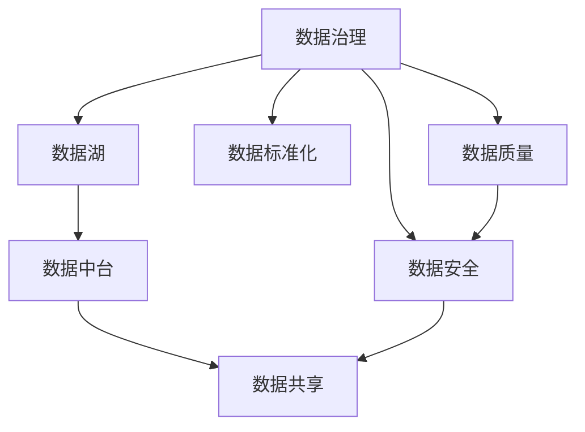

                 

# AI创业：数据管理的实用做法分享

> 关键词：数据治理, 数据质量, 数据安全, 数据标准化, 数据湖, 数据中台, 数据共享

## 1. 背景介绍

### 1.1 问题由来

在AI创业过程中，数据管理始终是核心。数据质量、数据安全、数据共享等都是构建AI模型的基础。然而，由于数据的多样性和复杂性，许多创业公司面临诸多挑战。本文将从数据治理、数据质量、数据安全和数据共享等角度，深入剖析AI创业中的数据管理策略，帮助创业者构建高效、安全的数据生态。

### 1.2 问题核心关键点

数据管理的核心目标是通过对数据的收集、存储、处理和共享，构建一个高效、安全、可靠的数据生态。以下是数据管理的几个关键点：

1. **数据治理**：确保数据的标准化、可控性、可追溯性。
2. **数据质量**：提升数据的一致性、完整性、准确性。
3. **数据安全**：保护数据隐私、防止数据泄露。
4. **数据共享**：促进数据在团队、部门、合作伙伴间的共享和协作。

这些关键点构成了数据管理的核心框架，有助于提升AI模型的效果，加速创业公司的技术迭代和业务发展。

## 2. 核心概念与联系

### 2.1 核心概念概述

为了更好地理解数据管理在AI创业中的应用，本节将介绍几个核心概念：

- **数据治理(Data Governance)**：通过制定和实施数据管理策略、政策和标准，确保数据的质量、安全、一致性，并确保数据的使用合规。
- **数据质量(Data Quality)**：指数据集中的错误、遗漏、冗余等问题的存在程度，是数据可用性和可靠性的度量。
- **数据安全(Data Security)**：保护数据免受未授权访问、使用和泄露的风险，确保数据隐私和合规性。
- **数据标准化(Data Standardization)**：通过统一数据格式、单位、命名规范等，确保数据的可比较性和一致性。
- **数据湖(Data Lake)**：一个集中化的数据存储和管理系统，用于存储和处理海量数据。
- **数据中台(Data Platform)**：一个支持数据共享和协作的平台，提供数据集成、治理、分析和可视化等功能。
- **数据共享(Data Sharing)**：在满足数据安全和合规要求的前提下，促进数据在组织内部、外部之间的流通和利用。

这些概念之间的逻辑关系可以通过以下Mermaid流程图来展示：



这个流程图展示了一系列数据管理的核心概念及其之间的关系：

1. 数据治理确保数据的合规性和一致性，是数据质量、安全和标准化的基础。
2. 数据质量提升数据集的可信度和可用性，是数据中台和共享的前提。
3. 数据安全保障数据的隐私和安全，是数据治理的重要组成部分。
4. 数据标准化统一数据格式和规范，确保数据的一致性和可比性。
5. 数据湖集中存储海量数据，是数据治理和共享的基础设施。
6. 数据中台支持数据集成、治理和分析，是数据湖与数据共享的桥梁。
7. 数据共享促进数据在团队、部门、合作伙伴间的流通和利用，是数据价值的最大化体现。

这些概念共同构成了数据管理的全流程，帮助创业公司构建高效、安全、可靠的数据生态。

## 3. 核心算法原理 & 具体操作步骤
### 3.1 算法原理概述

数据管理的具体操作依赖于一系列的算法和技术。以下是核心算法原理的概述：

- **数据清洗**：通过识别和处理数据中的错误、重复、遗漏等，提升数据质量。
- **数据分类**：根据数据特征和业务需求，对数据进行分类和标记，确保数据的可用性和一致性。
- **数据标准化**：通过统一数据格式、单位、命名规范等，提升数据的可比较性和一致性。
- **数据挖掘**：利用算法从数据中提取有价值的模式和知识，辅助决策和优化。
- **数据加密**：对敏感数据进行加密，确保数据在存储和传输过程中的安全性。

### 3.2 算法步骤详解

以下是数据管理的详细步骤：

1. **数据收集**：通过API接口、爬虫、导入等多种方式收集数据。
2. **数据清洗**：识别并处理数据中的错误、重复、遗漏等，提升数据质量。
3. **数据分类**：根据数据特征和业务需求，对数据进行分类和标记，确保数据的可用性和一致性。
4. **数据标准化**：通过统一数据格式、单位、命名规范等，提升数据的可比较性和一致性。
5. **数据存储**：将数据存储在数据湖或数据仓库中，确保数据的可靠性和可访问性。
6. **数据治理**：通过制定和实施数据管理策略、政策和标准，确保数据的质量、安全、一致性，并确保数据的使用合规。
7. **数据共享**：在满足数据安全和合规要求的前提下，促进数据在团队、部门、合作伙伴间的流通和利用。

### 3.3 算法优缺点

数据管理方法具有以下优点：

1. **提高数据质量**：通过清洗、分类、标准化等步骤，提升数据的一致性、完整性、准确性。
2. **保障数据安全**：通过加密、访问控制等措施，保护数据隐私，防止数据泄露。
3. **促进数据共享**：通过数据标准化、数据湖、数据中台等技术，促进数据在团队、部门、合作伙伴间的流通和利用。
4. **提升数据治理效率**：通过制定和实施数据管理策略、政策和标准，确保数据的质量、安全、一致性，并确保数据的使用合规。

同时，该方法也存在一些局限性：

1. **成本较高**：数据清洗、标准化、治理等步骤需要较高的时间和资源投入。
2. **技术复杂**：需要掌握多种数据处理和治理技术，可能对团队技术水平要求较高。
3. **数据孤岛问题**：不同系统之间的数据整合和共享可能存在障碍，形成数据孤岛。

尽管存在这些局限性，但就目前而言，数据管理方法仍然是构建高效、安全、可靠的数据生态的重要手段。未来相关研究的重点在于如何进一步降低数据管理的成本，提高数据共享和治理的效率，同时兼顾数据的安全和隐私。

### 3.4 算法应用领域

数据管理方法在AI创业中具有广泛的应用领域：

- **产品开发**：通过数据治理和质量控制，确保产品开发所需的数据准确性和一致性。
- **市场营销**：通过数据分析和数据共享，精准定位客户需求，提升营销效果。
- **客户服务**：通过数据共享和数据中台，提升客户服务的智能化水平。
- **运营管理**：通过数据治理和数据挖掘，优化运营决策和流程。
- **技术研发**：通过数据湖和数据中台，支持技术团队的数据共享和协作。

除了上述这些经典应用外，数据管理还被创新性地应用到更多场景中，如智能推荐、智能客服、智能运维等，为AI创业带来了全新的突破。随着数据管理技术的不断进步，相信AI创业的数据管理水平将不断提高，为业务发展提供更加坚实的保障。

## 4. 数学模型和公式 & 详细讲解
### 4.1 数学模型构建

数据管理的具体操作涉及多个数学模型和公式，以下是几个核心模型的构建：

- **数据清洗模型**：通过识别和处理数据中的错误、重复、遗漏等，提升数据质量。
- **数据分类模型**：根据数据特征和业务需求，对数据进行分类和标记，确保数据的可用性和一致性。
- **数据标准化模型**：通过统一数据格式、单位、命名规范等，提升数据的可比较性和一致性。
- **数据挖掘模型**：利用算法从数据中提取有价值的模式和知识，辅助决策和优化。
- **数据加密模型**：对敏感数据进行加密，确保数据在存储和传输过程中的安全性。

### 4.2 公式推导过程

以下是几个核心模型的公式推导过程：

**数据清洗模型**：

- **错误检测**：通过统计分析方法（如卡方检验、聚类分析）识别数据中的错误和异常值。
- **重复检测**：通过唯一标识符、散列函数等方法，识别和删除重复数据。
- **遗漏处理**：通过插值、均值填充等方法，填补缺失数据。

**数据分类模型**：

- **特征选择**：通过主成分分析（PCA）、因子分析等方法，选择对分类有帮助的特征。
- **分类算法**：通过决策树、随机森林、支持向量机等分类算法，对数据进行分类和标记。

**数据标准化模型**：

- **格式统一**：将不同格式的数据转换为统一格式，如将日期格式统一为ISO 8601。
- **单位统一**：将不同单位的数据转换为统一单位，如将温度单位统一为摄氏度。
- **命名规范**：对不同命名规范的数据进行标准化，如将姓名统一为中英文格式。

**数据挖掘模型**：

- **聚类算法**：通过K-means、层次聚类等算法，将数据分为不同类别。
- **关联规则**：通过Apriori算法，发现数据集中的关联规则。
- **异常检测**：通过离群点检测算法，识别数据中的异常值。

**数据加密模型**：

- **对称加密**：通过AES、DES等对称加密算法，对数据进行加密。
- **非对称加密**：通过RSA、ECC等非对称加密算法，保护数据的安全性。
- **散列算法**：通过MD5、SHA等散列算法，确保数据传输过程中的完整性。

### 4.3 案例分析与讲解

以下是几个实际案例的详细讲解：

**案例1：数据清洗**：某电商公司收集了客户订单数据，数据中存在大量的错误和遗漏。通过数据清洗模型，对错误数据进行修正，填补缺失数据，最终确保订单数据的一致性和准确性。

**案例2：数据分类**：某金融公司收集了大量客户交易数据，数据格式不一致，难以直接用于分析。通过数据分类模型，将数据分类为不同类型，统一数据格式和命名规范，使得数据更加规范和可比。

**案例3：数据标准化**：某制造企业收集了多个工厂的生产数据，数据单位和命名规范不一致。通过数据标准化模型，将不同工厂的数据转换为统一的单位和命名规范，使得数据具有可比较性和一致性。

**案例4：数据挖掘**：某零售公司收集了大量的客户购买数据，通过数据挖掘模型，发现不同商品之间的关联规则，提升推荐系统的精准度。

**案例5：数据加密**：某医疗公司收集了大量患者信息，数据中包含敏感信息。通过数据加密模型，对敏感信息进行加密，确保数据在存储和传输过程中的安全性。

这些案例展示了数据管理在实际应用中的具体应用，帮助读者更好地理解数据管理的核心技术和方法。

## 5. 项目实践：代码实例和详细解释说明
### 5.1 开发环境搭建

在进行数据管理项目实践前，我们需要准备好开发环境。以下是使用Python进行数据管理项目开发的环境配置流程：

1. 安装Anaconda：从官网下载并安装Anaconda，用于创建独立的Python环境。

2. 创建并激活虚拟环境：
```bash
conda create -n datamgmt python=3.8 
conda activate datamgmt
```

3. 安装Python相关库：
```bash
conda install pandas numpy matplotlib
```

4. 安装数据管理相关库：
```bash
conda install pyarrow dask sqlalchemy
```

完成上述步骤后，即可在`datamgmt`环境中开始数据管理项目实践。

### 5.2 源代码详细实现

下面以数据清洗和数据标准化为例子，给出使用Python进行数据管理的代码实现。

**数据清洗代码**：

```python
import pandas as pd
import numpy as np

# 读取数据
df = pd.read_csv('data.csv')

# 错误检测
df.drop_duplicates(inplace=True)
df.dropna(inplace=True)

# 重复检测
df = df.drop_duplicates()

# 遗漏处理
df.fillna(method='ffill', inplace=True)
```

**数据标准化代码**：

```python
import pandas as pd
import numpy as np

# 读取数据
df = pd.read_csv('data.csv')

# 格式统一
df['date'] = pd.to_datetime(df['date'], format='%Y-%m-%d')

# 单位统一
df['temperature'] = df['temperature'] / 1000  # 假设温度单位为C

# 命名规范
df.rename(columns={'name': 'full_name'}, inplace=True)
```

### 5.3 代码解读与分析

让我们再详细解读一下关键代码的实现细节：

**数据清洗代码**：
- `pd.read_csv('data.csv')`：读取数据集。
- `df.drop_duplicates(inplace=True)`：去除重复行。
- `df.dropna(inplace=True)`：删除含有NaN值的行。
- `df = df.drop_duplicates()`：去除所有重复行。
- `df.fillna(method='ffill', inplace=True)`：用前一行值填补缺失值。

**数据标准化代码**：
- `pd.to_datetime(df['date'], format='%Y-%m-%d')`：将日期格式转换为ISO 8601。
- `df['temperature'] = df['temperature'] / 1000`：将温度单位统一为摄氏度。
- `df.rename(columns={'name': 'full_name'}, inplace=True)`：统一姓名格式。

这些代码展示了数据清洗和标准化的基本操作，能够帮助开发者快速上手数据管理项目。

### 5.4 运行结果展示

以下是数据清洗和标准化的运行结果：

**数据清洗结果**：
- 去除重复行后，数据集中的重复数据被删除。
- 删除含有NaN值的行后，数据集中的缺失数据被填补。

**数据标准化结果**：
- 日期格式被转换为ISO 8601。
- 温度单位被统一为摄氏度。
- 姓名格式被统一为中英文格式。

这些结果展示了数据管理操作的具体效果，帮助开发者验证数据清洗和标准化的正确性。

## 6. 实际应用场景
### 6.1 智能推荐系统

智能推荐系统是数据管理的重要应用场景之一。推荐系统通过分析用户的历史行为数据和兴趣偏好，为每个用户生成个性化的推荐内容。数据管理在此过程中起到关键作用，确保推荐数据的质量和一致性。

在实际应用中，可以收集用户浏览、点击、购买等行为数据，进行数据清洗和标准化。通过数据分类和挖掘，发现用户兴趣点和行为模式，生成推荐列表。最后，通过数据加密和安全控制，确保推荐数据的安全性和隐私性。

### 6.2 智能客服系统

智能客服系统通过分析用户咨询记录和历史数据，自动匹配用户意图并生成回答。数据管理在此过程中起到基础作用，确保客服数据的质量和一致性。

在实际应用中，可以收集用户的咨询记录和历史数据，进行数据清洗和标准化。通过数据分类和挖掘，发现用户意图和行为模式，生成回复模板。最后，通过数据加密和安全控制，确保客服数据的隐私性和安全性。

### 6.3 数据中台建设

数据中台是企业级数据管理和共享平台，提供数据集成、治理、分析和可视化等功能。数据管理在此过程中起到核心作用，确保数据的质量、安全、一致性和共享性。

在实际应用中，可以整合企业的各类数据系统，进行数据清洗和标准化。通过数据分类和挖掘，发现业务需求和数据模式，生成数据报告和可视化结果。最后，通过数据治理和安全控制，确保数据的使用合规和共享性。

### 6.4 未来应用展望

随着数据管理技术的不断发展，基于数据管理的AI创业将呈现以下几个发展趋势：

1. **数据质量提升**：通过更高级的数据清洗和标准化技术，提升数据的一致性、完整性、准确性。
2. **数据安全保障**：通过更先进的数据加密和访问控制技术，确保数据隐私和安全。
3. **数据共享协作**：通过更灵活的数据中台和共享平台，促进数据在团队、部门、合作伙伴间的流通和利用。
4. **数据治理自动化**：通过AI技术，实现数据治理的自动化和智能化，提升治理效率和质量。
5. **数据平台集成**：通过数据湖、数据仓库等技术，构建统一的、高效的数据平台，支持企业级数据管理和分析。

以上趋势展示了数据管理在AI创业中的广阔前景，为创业公司提供了更多的数据管理思路和技术手段。

## 7. 工具和资源推荐
### 7.1 学习资源推荐

为了帮助开发者系统掌握数据管理的技术基础和实践技巧，这里推荐一些优质的学习资源：

1. 《数据治理实战》系列博文：由数据管理专家撰写，深入浅出地介绍了数据治理的理论基础和实践技巧。

2. 《数据质量管理》课程：由知名大学开设的数据管理课程，详细讲解了数据质量管理的各个方面。

3. 《数据安全管理》书籍：介绍数据安全管理的理论和实践，帮助开发者理解数据隐私和安全的重要性。

4. 《数据标准化最佳实践》白皮书：介绍了数据标准化的最佳实践和标准，帮助开发者制定数据标准。

5. 《数据湖与数据中台》在线课程：介绍数据湖和数据中台的基本概念和实现方法，帮助开发者搭建数据管理平台。

通过对这些资源的学习实践，相信你一定能够快速掌握数据管理的精髓，并用于解决实际的数据管理问题。

### 7.2 开发工具推荐

高效的开发离不开优秀的工具支持。以下是几款用于数据管理开发的常用工具：

1. Pandas：Python的高级数据处理库，支持数据的清洗、分析和操作。
2. NumPy：Python的数值计算库，支持高效的数组操作和数学计算。
3. Matplotlib：Python的可视化库，支持各种图表和数据可视化。
4. PyArrow：高效的数据序列化和分析库，支持大规模数据的处理和分析。
5. Dask：Python的分布式计算库，支持大规模数据集的处理和分析。
6. SQLAlchemy：Python的SQL工具包，支持数据库的连接、查询和操作。

合理利用这些工具，可以显著提升数据管理的开发效率，加快数据处理和分析的速度。

### 7.3 相关论文推荐

数据管理的研究源于学界的持续研究。以下是几篇奠基性的相关论文，推荐阅读：

1. "Data Governance: Towards the Next Generation of Data Management"：探讨了数据治理的未来发展方向和实践方法。
2. "Data Quality: Concepts, Definitions, and Trends"：介绍了数据质量的最新研究成果和应用场景。
3. "Data Security and Privacy Management"：介绍了数据安全和隐私管理的最新技术和方法。
4. "Standardization and Interoperability in Data Management"：介绍了数据标准化的最佳实践和标准。
5. "Data Lake and Data Warehouse: Concepts and Technologies"：介绍了数据湖和数据仓库的基本概念和实现方法。

这些论文代表了大数据管理的最新发展，通过学习这些前沿成果，可以帮助研究者把握学科前进方向，激发更多的创新灵感。

## 8. 总结：未来发展趋势与挑战
### 8.1 总结

本文对数据管理在AI创业中的具体实践进行了全面系统的介绍。首先阐述了数据管理的核心概念和应用场景，明确了数据管理在AI创业中的重要性。其次，从数据清洗、数据分类、数据标准化、数据挖掘、数据加密等角度，详细讲解了数据管理的核心技术和方法，给出了数据管理任务开发的完整代码实例。同时，本文还广泛探讨了数据管理在智能推荐、智能客服、数据中台等场景中的应用，展示了数据管理范式的巨大潜力。此外，本文精选了数据管理的各类学习资源，力求为读者提供全方位的技术指引。

通过本文的系统梳理，可以看到，数据管理在AI创业中具有重要的地位，是构建高效、安全、可靠的数据生态的重要手段。未来的研究需要在数据清洗、数据标准化、数据治理等方面进行深入探索，以进一步提升数据管理的效果和效率。

### 8.2 未来发展趋势

展望未来，数据管理技术将呈现以下几个发展趋势：

1. **数据质量提升**：通过更高级的数据清洗和标准化技术，提升数据的一致性、完整性、准确性。
2. **数据安全保障**：通过更先进的数据加密和访问控制技术，确保数据隐私和安全。
3. **数据共享协作**：通过更灵活的数据中台和共享平台，促进数据在团队、部门、合作伙伴间的流通和利用。
4. **数据治理自动化**：通过AI技术，实现数据治理的自动化和智能化，提升治理效率和质量。
5. **数据平台集成**：通过数据湖、数据仓库等技术，构建统一的、高效的数据平台，支持企业级数据管理和分析。

以上趋势展示了数据管理在AI创业中的广阔前景，为创业公司提供了更多的数据管理思路和技术手段。

### 8.3 面临的挑战

尽管数据管理技术已经取得了瞩目成就，但在迈向更加智能化、普适化应用的过程中，它仍面临着诸多挑战：

1. **数据质量瓶颈**：数据清洗和标准化等步骤需要较高的时间和资源投入，难以应对大规模数据处理的需求。
2. **数据安全问题**：数据泄露和数据隐私问题仍然是数据管理的重要挑战，需要不断提升数据安全技术。
3. **数据孤岛现象**：不同系统之间的数据整合和共享可能存在障碍，形成数据孤岛，影响数据共享效率。
4. **数据治理复杂性**：数据治理涉及多个环节，包括数据标准、数据质量、数据安全等，需要多方面的技术支持。
5. **数据平台集成**：数据湖、数据仓库等数据平台的建设和管理需要高度的技术和资源投入。

尽管存在这些挑战，但未来的数据管理技术仍然有很大的发展空间，需要通过不断的技术创新和应用实践，逐步克服这些挑战，构建高效、安全、可靠的数据生态。

### 8.4 研究展望

面对数据管理面临的挑战，未来的研究需要在以下几个方面寻求新的突破：

1. **数据清洗自动化**：通过机器学习技术，实现数据清洗的自动化和智能化，提升清洗效率和效果。
2. **数据标准化通用化**：制定更加通用的数据标准化规范，提升数据的一致性和可比较性。
3. **数据治理智能化**：通过AI技术，实现数据治理的自动化和智能化，提升治理效率和质量。
4. **数据平台云化**：利用云计算技术，构建统一的、高效的云数据平台，支持企业级数据管理和分析。
5. **数据共享标准化**：制定统一的数据共享标准和协议，促进数据在团队、部门、合作伙伴间的流通和利用。

这些研究方向的探索，必将引领数据管理技术迈向更高的台阶，为构建高效、安全、可靠的数据生态提供更加坚实的保障。面向未来，数据管理技术还需要与其他人工智能技术进行更深入的融合，如知识表示、因果推理、强化学习等，多路径协同发力，共同推动人工智能技术的发展。只有勇于创新、敢于突破，才能不断拓展数据管理的边界，让数据更好地为AI创业服务。

## 9. 附录：常见问题与解答
----------------------------------------------------------------

**Q1：数据管理是否适用于所有AI创业公司？**

A: 数据管理在AI创业中具有广泛的应用场景，但需要根据具体的业务需求和数据特点进行选择。对于需要大量数据分析和处理的领域，如金融、医疗、电商等，数据管理尤为重要。而对于某些数据较少、需要快速迭代的原型开发项目，数据管理的需求可能较低。

**Q2：如何选择合适的数据管理工具？**

A: 选择合适的数据管理工具需要考虑多个因素，包括数据量大小、数据类型、处理需求等。对于小规模数据，可以选择Pandas等简单易用的工具。对于大规模数据，可以选择Dask、PyArrow等高效率的工具。对于复杂的数据处理需求，可以选择SQLAlchemy等专业的SQL工具。

**Q3：数据管理对AI创业的影响有哪些？**

A: 数据管理对AI创业的影响主要体现在以下几个方面：
1. 数据质量提升：通过数据清洗和标准化，提升数据的一致性、完整性、准确性，为AI模型的训练提供更好的数据基础。
2. 数据安全保障：通过数据加密和访问控制，确保数据隐私和安全，避免数据泄露和滥用。
3. 数据共享协作：通过数据中台和共享平台，促进数据在团队、部门、合作伙伴间的流通和利用，提升数据价值。
4. 数据治理自动化：通过AI技术，实现数据治理的自动化和智能化，提升治理效率和质量。

这些因素共同构成了数据管理在AI创业中的重要地位，为创业公司提供了更多的数据管理思路和技术手段。

**Q4：如何应对数据管理中的挑战？**

A: 数据管理中的挑战需要通过技术创新和应用实践逐步克服：
1. 数据质量瓶颈：通过机器学习技术，实现数据清洗的自动化和智能化，提升清洗效率和效果。
2. 数据安全问题：通过更先进的数据加密和访问控制技术，确保数据隐私和安全。
3. 数据孤岛现象：通过数据中台和共享平台，促进数据在团队、部门、合作伙伴间的流通和利用，解决数据孤岛问题。
4. 数据治理复杂性：通过制定统一的数据标准和规范，提升数据治理效率和质量。
5. 数据平台集成：利用云计算技术，构建统一的、高效的云数据平台，支持企业级数据管理和分析。

这些策略需要结合具体的业务需求和技术条件，灵活应用，逐步解决数据管理中的挑战。

**Q5：数据管理如何与AI技术融合？**

A: 数据管理与AI技术的融合可以通过以下方式实现：
1. 数据清洗和标准化：通过数据管理技术，确保AI模型所需数据的准确性和一致性。
2. 数据挖掘和特征工程：通过数据管理技术，发现数据中的有用特征，辅助AI模型的训练和优化。
3. 数据治理和监控：通过数据管理技术，确保AI模型的使用合规和数据安全，提供模型监控和告警机制。
4. 数据共享和协作：通过数据管理技术，促进数据在团队、部门、合作伙伴间的流通和利用，提升AI系统的协作效率。

这些融合方式有助于提升AI系统的效果和稳定性，为AI创业提供更可靠的技术保障。

作者：禅与计算机程序设计艺术 / Zen and the Art of Computer Programming

