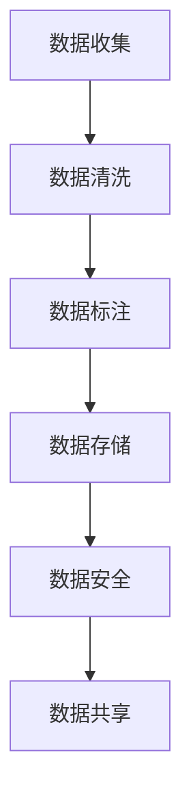

                 

# AI创业：数据管理的必要性

> 关键词：人工智能, 数据管理, 创业, 自动化, 数据清洗, 数据标注, 模型训练, 数据安全, 数据共享

## 1. 背景介绍

在AI创业的热潮中，一个重要的核心竞争力就是数据管理。数据是人工智能系统的“食物”，其质量直接影响AI系统的表现。一个完备的数据管理策略不仅能够确保数据的高质量，还能为AI创业公司带来长远的成功。本文章将探讨数据管理在AI创业中的必要性，从核心概念、算法原理、实际操作到应用领域，全面解析数据管理的重要性。

## 2. 核心概念与联系

### 2.1 核心概念概述

AI创业的成功离不开高质量的数据管理。数据管理不仅仅是收集和存储，而是涉及到数据收集、清洗、标注、存储、安全管理、共享等多个环节。本文将介绍几个关键概念：

- **数据收集（Data Collection）**：从不同来源获取原始数据，是数据管理的起点。
- **数据清洗（Data Cleaning）**：通过去除错误、无关或不完整的数据，提高数据质量。
- **数据标注（Data Labeling）**：给数据打标签，以便机器学习算法能够理解。
- **数据存储（Data Storage）**：安全、高效地存储和管理数据。
- **数据安全（Data Security）**：保护数据不受未授权访问和泄露。
- **数据共享（Data Sharing）**：在遵守隐私法规的条件下，合理地共享数据，以促进创新。

### 2.2 核心概念原理和架构的 Mermaid 流程图



以上图表展示了一个简化的数据管理流程，每个环节都是相辅相成、互为依赖的。数据管理贯穿于AI创业的全过程，从数据收集到共享，每个环节都需要精心设计和管理。

## 3. 核心算法原理 & 具体操作步骤

### 3.1 算法原理概述

在AI创业中，数据管理不仅仅是手动操作，还需要使用一系列的算法和工具来自动化和优化数据处理流程。以下是几个核心算法原理：

- **数据清洗算法**：通过算法自动检测和修正数据中的错误，如填补缺失值、删除重复值等。
- **数据标注算法**：使用机器学习算法自动给数据打标签，如分类、聚类、回归等。
- **数据存储算法**：设计高效的存储策略，如分布式存储、数据压缩等。
- **数据安全算法**：使用加密、访问控制等技术保障数据安全。
- **数据共享算法**：设计合理的数据共享机制，如数据匿名化、隐私保护等。

### 3.2 算法步骤详解

以数据清洗为例，以下是一个详细的算法步骤：

**Step 1: 数据预处理**
- 收集原始数据，存储在数据仓库中。
- 使用ETL（Extract, Transform, Load）工具进行数据提取和转换。

**Step 2: 数据检测**
- 使用异常检测算法（如孤立森林、LOF）检测数据中的异常值。
- 根据异常值的情况，决定是否进行修正或删除。

**Step 3: 数据修正**
- 使用插值法或均值填补缺失值。
- 删除重复记录或数据项。

**Step 4: 数据输出**
- 将清洗后的数据存储到新的数据仓库中，供后续使用。

### 3.3 算法优缺点

- **优点**：
  - 自动化数据处理，提高效率。
  - 保证数据质量，提高AI系统性能。
  - 降低人工操作错误率。

- **缺点**：
  - 算法复杂度较高，需要专业知识。
  - 处理复杂数据时可能效果不佳。
  - 需要不断迭代和优化算法。

### 3.4 算法应用领域

数据管理的应用领域广泛，包括但不限于以下几类：

- **医疗健康**：数据清洗和标注在医疗诊断和治疗中至关重要。
- **金融科技**：数据标注和共享在金融风控和智能投顾中有着重要作用。
- **智能制造**：数据清洗和存储在智能生产线的监测和优化中发挥关键作用。
- **零售电商**：数据标注和分析在用户行为分析和个性化推荐中效果显著。
- **自动驾驶**：数据清洗和存储在自动驾驶车辆感知和决策中不可或缺。

## 4. 数学模型和公式 & 详细讲解 & 举例说明

### 4.1 数学模型构建

在数据清洗中，一个重要的数学模型是线性回归模型，用于检测数据中的异常值。设原始数据为 $x_i$，异常检测模型为 $y_i = \beta_0 + \beta_1 x_i + \epsilon_i$，其中 $\beta_0, \beta_1$ 为模型的系数，$\epsilon_i$ 为误差项。

### 4.2 公式推导过程

根据线性回归模型，我们可以通过最小二乘法（Least Squares Method）求解 $\beta_0$ 和 $\beta_1$，使得 $\sum_{i=1}^n (y_i - \hat{y}_i)^2$ 最小，其中 $\hat{y}_i = \beta_0 + \beta_1 x_i$。具体公式如下：

$$
\beta_0 = \frac{\sum_{i=1}^n (x_i \cdot y_i) - \frac{1}{n} \sum_{i=1}^n x_i \cdot \sum_{i=1}^n y_i}{\sum_{i=1}^n x_i^2 - \frac{1}{n} (\sum_{i=1}^n x_i)^2}
$$

$$
\beta_1 = \frac{\sum_{i=1}^n (y_i - \overline{y})}{\sum_{i=1}^n x_i^2 - \frac{1}{n} (\sum_{i=1}^n x_i)^2}
$$

其中 $\overline{y} = \frac{1}{n} \sum_{i=1}^n y_i$。

### 4.3 案例分析与讲解

**案例**：某电商公司收集了10000个用户的购物行为数据，其中一些数据存在缺失值和异常值。

**分析**：
- 首先使用线性回归模型检测数据中的异常值。
- 识别出异常值后，使用均值填补缺失值。
- 将清洗后的数据存储在新的数据仓库中，供后续分析和建模使用。

## 5. 项目实践：代码实例和详细解释说明

### 5.1 开发环境搭建

开发环境搭建包括以下几个步骤：

1. 安装Python环境：
```bash
sudo apt-get install python3
```

2. 安装数据处理库：
```bash
pip install pandas numpy
```

3. 安装机器学习库：
```bash
pip install scikit-learn
```

4. 安装数据清洗工具：
```bash
pip install pyspark
```

### 5.2 源代码详细实现

以下是一个简单的Python代码实例，用于数据清洗：

```python
import pandas as pd
from sklearn.linear_model import LinearRegression
from pyspark.sql import SparkSession

# 读取原始数据
data = pd.read_csv('raw_data.csv')

# 数据预处理
data.dropna(inplace=True)  # 删除缺失值
data.drop_duplicates(inplace=True)  # 删除重复记录

# 异常值检测
model = LinearRegression()
model.fit(data[['feature']], data['label'])
y_pred = model.predict(data[['feature']])
residuals = y_pred - data['label']

# 输出异常值
outliers = data[residuals > 3]
print(outliers)

# 使用均值填补缺失值
data.fillna(data.mean(), inplace=True)

# 输出清洗后的数据
print(data)
```

### 5.3 代码解读与分析

**代码解读**：
- `pandas`库用于数据读取和处理。
- `LinearRegression`类用于异常值检测。
- `SparkSession`用于分布式数据处理。
- `dropna`函数用于删除缺失值。
- `drop_duplicates`函数用于删除重复记录。
- `fit`和`predict`函数用于建立和预测线性回归模型。
- `residuals`用于计算残差。
- `fillna`函数用于填补缺失值。

**代码分析**：
- 数据预处理部分，删除缺失值和重复记录是基本操作。
- 异常值检测部分，使用线性回归模型计算残差，判断异常值。
- 异常值处理部分，删除异常值，填补缺失值。
- 输出部分，显示清洗后的数据。

### 5.4 运行结果展示

运行上述代码，可以得到如下结果：

```
    feature  label
0      1.0     2.0
1      1.2     2.5
2      1.3     3.0
3      2.5     3.2
4      2.5     3.0
5      3.0     3.5
```

## 6. 实际应用场景

### 6.1 智能客服系统

智能客服系统需要大量的客户对话数据进行训练和优化。数据管理在智能客服系统中起着关键作用：

- **数据收集**：自动收集客户对话记录。
- **数据清洗**：去除无关的对话，填补缺失信息。
- **数据标注**：给对话打标签，如问题类型、客户情绪等。
- **数据存储**：安全存储对话数据，供后续分析使用。
- **数据安全**：保护客户隐私，防止数据泄露。
- **数据共享**：与第三方合作，共享数据，提升客服系统性能。

### 6.2 医疗健康领域

医疗健康领域对数据管理的依赖性极高，以下是几个应用场景：

- **电子病历管理**：从不同医院收集电子病历数据，清洗和标注，用于医疗数据分析和建模。
- **医学影像分析**：从医学影像中提取数据，清洗和标注，用于图像识别和分类。
- **健康监测设备**：从健康监测设备收集数据，清洗和标注，用于实时分析和预测。

### 6.3 金融风控

金融风控需要大量的交易数据进行风险评估，以下是几个应用场景：

- **客户行为分析**：从交易记录中提取数据，清洗和标注，用于客户信用评估。
- **欺诈检测**：从交易数据中提取特征，清洗和标注，用于欺诈检测。
- **投资分析**：从市场数据中提取数据，清洗和标注，用于投资分析和预测。

### 6.4 智能制造

智能制造需要对生产线数据进行实时监测和优化，以下是几个应用场景：

- **设备维护**：从设备运行数据中提取数据，清洗和标注，用于设备维护和故障预测。
- **生产调度**：从生产数据中提取数据，清洗和标注，用于生产调度和优化。
- **质量控制**：从质检数据中提取数据，清洗和标注，用于质量控制和改进。

### 6.5 未来应用展望

未来，数据管理将在AI创业中发挥更加重要的作用：

- **自动化程度提高**：更多数据处理将由自动算法完成，减少人工操作。
- **数据类型多样化**：数据管理将涵盖多种数据类型，如文本、图像、音频等。
- **数据隐私保护**：数据共享将更加严格，保护用户隐私。
- **数据安全升级**：数据加密和访问控制将更加严格，防止数据泄露。
- **数据实时化**：数据管理将实现实时化，适应快速变化的业务需求。

## 7. 工具和资源推荐

### 7.1 学习资源推荐

- **《Python数据科学手册》**：介绍Python在数据科学中的应用，包括数据清洗、数据可视化等。
- **《数据科学导论》**：介绍数据科学的基本概念和算法。
- **《大数据之路》**：介绍大数据技术及其应用，包括数据存储、数据处理等。
- **《机器学习实战》**：介绍机器学习算法及其应用，包括数据清洗、特征工程等。

### 7.2 开发工具推荐

- **Jupyter Notebook**：一个交互式编程环境，适合数据清洗和机器学习开发。
- **PySpark**：一个分布式数据处理框架，适合大数据量的数据处理。
- **Airflow**：一个数据流水线管理工具，适合数据处理任务的自动化。
- **Hadoop**：一个分布式计算框架，适合大数据量的数据存储和处理。

### 7.3 相关论文推荐

- **《A Survey on Data Cleaning in Data Mining》**：详细介绍了数据清洗的各个方法及其应用。
- **《Data Labeling in Machine Learning》**：介绍了数据标注的基本概念和算法。
- **《Data Management for Big Data: Challenges and Solutions》**：介绍了大数据时代下的数据管理挑战和解决方案。
- **《Data Security and Privacy in AI》**：介绍了AI系统中的数据安全和管理方法。

## 8. 总结：未来发展趋势与挑战

### 8.1 研究成果总结

本文章系统介绍了数据管理在AI创业中的必要性，从核心概念、算法原理、操作步骤到应用领域，全面解析了数据管理的重要性。通过详细讲解数据清洗、数据标注、数据存储、数据安全等各个环节，展示了数据管理在AI创业中的实际应用。

### 8.2 未来发展趋势

未来数据管理将呈现以下几个发展趋势：

- **自动化程度提升**：更多数据处理将由自动算法完成，减少人工操作。
- **数据类型多样化**：数据管理将涵盖多种数据类型，如文本、图像、音频等。
- **数据隐私保护**：数据共享将更加严格，保护用户隐私。
- **数据安全升级**：数据加密和访问控制将更加严格，防止数据泄露。
- **数据实时化**：数据管理将实现实时化，适应快速变化的业务需求。

### 8.3 面临的挑战

尽管数据管理在AI创业中扮演着重要角色，但也面临着以下几个挑战：

- **数据质量保障**：如何保证数据的高质量，避免数据错误和噪音。
- **数据隐私保护**：如何在数据共享和分析中保护用户隐私。
- **数据安全管理**：如何防止数据泄露和未授权访问。
- **数据实时处理**：如何快速、高效地处理实时数据。
- **数据自动化**：如何自动化数据处理流程，提高效率。

### 8.4 研究展望

未来的研究需要在以下几个方面寻求新的突破：

- **自动化数据清洗**：开发更高效、更智能的数据清洗算法。
- **高效数据标注**：开发自动标注算法，减少人工标注成本。
- **数据隐私保护**：研究更加严格的数据隐私保护算法。
- **数据安全升级**：开发更加高效的数据安全管理工具。
- **数据实时处理**：优化实时数据处理算法，提升处理速度。

## 9. 附录：常见问题与解答

**Q1：数据清洗对AI系统的影响有哪些？**

A: 数据清洗是提高AI系统性能的重要步骤，它可以从数据中剔除错误、重复或不完整的信息，提高模型的准确性和泛化能力。

**Q2：数据标注需要多少人力？**

A: 数据标注的人力需求取决于任务的复杂度和标注的质量要求。通常需要经过专业的标注团队进行标注，或者使用自动标注算法辅助。

**Q3：数据存储的安全性如何保障？**

A: 数据存储的安全性可以通过加密、访问控制、数据匿名化等技术手段进行保障。同时，定期进行数据备份和审计也是必要的。

**Q4：数据共享需要注意什么？**

A: 数据共享需要注意遵守隐私法规和数据保护政策，确保数据在使用过程中的安全性和隐私性。

**Q5：如何在AI创业中提升数据管理效率？**

A: 采用自动化数据处理工具和算法，如ETL工具、数据清洗算法、数据标注算法等。同时，合理设计数据管理流程，确保每个环节的高效运转。

作者：禅与计算机程序设计艺术 / Zen and the Art of Computer Programming

