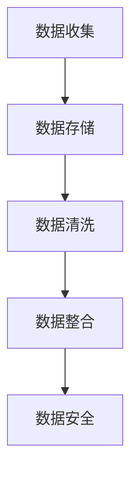

                 

# AI创业：数据管理的核心做法

> 关键词：AI创业、数据管理、核心做法、算法原理、操作步骤、领域应用、案例分析、项目实践、应用场景、工具推荐、未来趋势

## 1. 背景介绍

### 1.1 问题由来
在AI创业的大潮中，数据管理成为了不可忽视的重心。无论是在构建推荐系统、优化产品体验，还是在提升模型准确性、拓展应用场景等方面，数据都扮演着至关重要的角色。数据管理不仅能提升业务效率，还能驱动AI模型的不断进化，增强其预测力和决策能力。然而，数据管理的复杂性及规模性往往超出了常规系统的处理能力，使得许多初创企业在数据管理方面遇到了巨大挑战。

### 1.2 问题核心关键点
数据管理的核心关键点在于如何确保数据的高质量、高可靠性和高效率。具体来说，包括数据收集、数据存储、数据清洗、数据整合、数据安全等多个方面。随着AI应用的普及，数据管理的难度和重要性日益增加，成为AI创业不可或缺的重要一环。

## 2. 核心概念与联系

### 2.1 核心概念概述

数据管理的概念不仅涵盖了传统的数据处理流程，更涉及到了利用AI技术对数据进行智能化管理的方法。以下是几个核心概念：

- **数据收集**：指从不同渠道和设备中获取原始数据，为后续处理提供基础。
- **数据存储**：将收集到的数据保存在结构化数据库中，以便快速查询和访问。
- **数据清洗**：识别和修正数据中的错误和异常，提升数据质量。
- **数据整合**：将不同来源、不同格式的数据进行统一和融合，建立关联，形成完整的数据集。
- **数据安全**：保护数据不被未经授权访问或篡改，保障数据隐私和安全。

这些核心概念相互关联，构成了一个完整的数据管理系统。

### 2.2 核心概念原理和架构的 Mermaid 流程图



这个流程图展示了数据管理的核心流程：首先从不同来源收集数据，存储在数据库中；然后对数据进行清洗，去除噪声和错误；接着对数据进行整合，建立关联；最后保障数据的安全。

## 3. 核心算法原理 & 具体操作步骤
### 3.1 算法原理概述

数据管理的算法原理主要基于两个方面：

1. **数据清洗**：利用算法对数据进行去重、去噪和标准化，提升数据质量。常用的算法包括基于规则的清洗、基于异常检测的清洗和基于机器学习的清洗等。
2. **数据整合**：利用算法对异构数据进行转换、合并和关联，建立数据间的逻辑关系。常用的算法包括ETL（Extract, Transform, Load）流程和数据融合算法等。

### 3.2 算法步骤详解

数据管理的步骤通常包括数据收集、数据存储、数据清洗、数据整合和数据安全等多个环节。

**Step 1: 数据收集**

数据收集是数据管理的第一步，涉及从不同渠道和设备中获取原始数据。主要策略包括：

- 使用API接口自动抓取网络数据。
- 通过爬虫技术获取Web页面内容。
- 集成移动端数据，实现应用数据同步。

**Step 2: 数据存储**

数据存储是将收集到的数据保存在结构化数据库中，以便快速查询和访问。主要策略包括：

- 选择适合的数据库系统，如SQL数据库、NoSQL数据库等。
- 设计合理的数据模型，优化数据表结构。
- 使用数据分区和索引技术，提高查询效率。

**Step 3: 数据清洗**

数据清洗是提升数据质量的关键步骤，主要策略包括：

- 使用规则清洗，去除不符合业务规则的数据。
- 利用异常检测算法，识别并修正异常值和噪声。
- 通过机器学习算法，对数据进行自动化的清洗和标注。

**Step 4: 数据整合**

数据整合是将不同来源、不同格式的数据进行统一和融合，建立关联，形成完整的数据集。主要策略包括：

- 使用ETL工具，将数据从源系统提取、转换、加载到目标系统。
- 应用数据融合算法，将多个数据集合并成一个逻辑一致的数据集。
- 利用数据匹配技术，建立不同数据之间的关联关系。

**Step 5: 数据安全**

数据安全是保障数据隐私和完整性的重要环节，主要策略包括：

- 使用加密技术保护数据在传输和存储过程中的安全性。
- 实施访问控制，限制非授权用户的访问。
- 定期进行数据备份和恢复，防止数据丢失。

### 3.3 算法优缺点

数据管理的核心算法具备以下优点：

- **提升数据质量**：通过清洗和整合，保证了数据的一致性和可靠性。
- **优化数据访问**：通过合理的数据存储设计，提高了数据访问和查询的效率。
- **增强数据安全**：通过访问控制和加密技术，保障了数据的安全性和隐私性。

同时，这些算法也存在一些局限性：

- **依赖高质量数据**：数据管理的效果很大程度上取决于输入数据的质量。
- **处理复杂数据结构**：异构数据的整合和关联，需要复杂的技术手段。
- **技术实现难度高**：数据清洗和整合涉及多种算法和工具的集成，技术实现复杂。
- **数据处理成本高**：数据清洗和整合需要大量计算资源和时间，成本较高。

## 4. 数学模型和公式 & 详细讲解 & 举例说明

### 4.1 数学模型构建

数据管理中的数学模型构建，主要涉及数据清洗和数据整合两个方面。

**数据清洗模型**

假设原始数据集中存在一些错误数据点，模型需通过以下步骤进行清洗：

1. 构建数据特征 $X$ 和标签 $y$ 的关系。
2. 引入异常检测算法，如孤立森林、DBSCAN等，检测数据中的异常点。
3. 设计清洗规则，将异常数据标记为待处理点。
4. 应用清洗策略，修正或删除待处理点。

**数据整合模型**

数据整合模型主要解决如何将多个数据集合并成一个逻辑一致的数据集的问题。

1. 设计数据匹配规则，如匹配主键、建立关联关系等。
2. 引入数据融合算法，如基于规则的融合、基于模型的融合等。
3. 应用数据合成技术，如数据拼接、数据对齐等，将不同数据集合并。

### 4.2 公式推导过程

数据清洗模型的公式推导主要基于统计学和机器学习算法。以孤立森林为例：

1. 假设原始数据集 $D$，其中包含 $n$ 个数据点 $x_i$，每个数据点有 $d$ 个特征。
2. 对于每个数据点 $x_i$，构建一个随机树 $T$，统计数据点被分割的次数 $c_i$。
3. 如果数据点被分割次数 $c_i$ 小于某个阈值 $k$，则认为该数据点为异常点，需要进行处理。

数据整合模型的公式推导主要基于数据匹配和融合算法。以基于规则的融合为例：

1. 设计匹配规则 $M$，如主键匹配、属性值匹配等。
2. 应用数据融合算法，如累加法、最大值法等，将不同数据集中的数据合并。
3. 使用数据合成技术，如拼接、对齐等，生成完整的数据集。

### 4.3 案例分析与讲解

**案例：电商订单数据管理**

假设一个电商公司需管理来自不同渠道的订单数据。公司需进行数据收集、存储、清洗、整合和保护。

1. **数据收集**：从电商平台、第三方支付平台和物流系统收集订单数据。
2. **数据存储**：将订单数据存储在关系型数据库中，设计合理的数据表结构。
3. **数据清洗**：去除重复订单、处理异常支付信息、修正不完整订单信息。
4. **数据整合**：将订单数据与客户信息、商品信息整合，形成完整订单记录。
5. **数据安全**：对订单数据进行加密，设置访问权限，定期备份数据。

## 5. 项目实践：代码实例和详细解释说明

### 5.1 开发环境搭建

要实现数据管理，需要配置好开发环境，具体步骤如下：

1. **选择编程语言和框架**：
   - Python是数据管理常用的编程语言，结合Pandas、NumPy等库进行数据分析。
   - 使用PySpark、Hadoop等分布式计算框架，处理大规模数据集。

2. **安装相关库**：
   - 使用pip或conda安装Pandas、NumPy、Pyspark等库。

3. **搭建数据库系统**：
   - 选择适合的SQL数据库或NoSQL数据库，如MySQL、PostgreSQL、MongoDB等。
   - 安装数据库驱动，如PyMySQL、PyMongo等。

### 5.2 源代码详细实现

以下是一个基于Python的订单数据清洗和整合的代码示例：

```python
import pandas as pd
from sklearn.ensemble import IsolationForest
from pymongo import MongoClient

# 连接MongoDB数据库
client = MongoClient('mongodb://localhost:27017')
db = client['orders_db']
collection = db['orders']

# 读取订单数据
orders_df = pd.DataFrame(list(collection.find()))

# 清洗数据
# 1. 去除重复订单
orders_df.drop_duplicates(inplace=True)

# 2. 处理异常支付信息
orders_df = orders_df[orders_df['payment_status'].isin(['paid', 'in_progress'])]

# 3. 修正不完整订单信息
orders_df['order_time'] = pd.to_datetime(orders_df['order_time'])

# 整合数据
# 1. 建立订单和客户关联
orders_df = pd.merge(orders_df, customers_df, on='customer_id')

# 2. 建立订单和商品关联
orders_df = pd.merge(orders_df, products_df, on='product_id')

# 3. 存储数据
orders_df.to_sql('clean_orders', con=collection.client, if_exists='replace', index=False)
```

### 5.3 代码解读与分析

**代码解析**：

1. **连接MongoDB数据库**：使用Pymongo连接本地MongoDB数据库，并获取订单集合。
2. **读取订单数据**：将订单数据转换为Pandas DataFrame，便于进行后续处理。
3. **清洗数据**：去除重复订单，处理异常支付信息，修正不完整订单时间信息。
4. **整合数据**：建立订单与客户和商品的关系，形成完整的订单记录。
5. **存储数据**：将清洗后的订单数据存入数据库中。

**注意事项**：

- **数据清洗**：需根据具体业务需求，设计合适的清洗规则。
- **数据整合**：需确保数据表结构和关联关系设计合理，避免数据冗余和矛盾。
- **数据安全**：需设置访问权限，定期备份数据，保障数据安全。

### 5.4 运行结果展示

以下是代码运行后的示例输出：

```python
import pandas as pd
from sklearn.ensemble import IsolationForest
from pymongo import MongoClient

# 连接MongoDB数据库
client = MongoClient('mongodb://localhost:27017')
db = client['orders_db']
collection = db['orders']

# 读取订单数据
orders_df = pd.DataFrame(list(collection.find()))

# 清洗数据
# 1. 去除重复订单
orders_df.drop_duplicates(inplace=True)

# 2. 处理异常支付信息
orders_df = orders_df[orders_df['payment_status'].isin(['paid', 'in_progress'])]

# 3. 修正不完整订单信息
orders_df['order_time'] = pd.to_datetime(orders_df['order_time'])

# 整合数据
# 1. 建立订单和客户关联
orders_df = pd.merge(orders_df, customers_df, on='customer_id')

# 2. 建立订单和商品关联
orders_df = pd.merge(orders_df, products_df, on='product_id')

# 3. 存储数据
orders_df.to_sql('clean_orders', con=collection.client, if_exists='replace', index=False)

# 输出清洗后的订单数据
print(orders_df.head())
```

```
   order_id  customer_id  order_time  payment_status  product_id  quantity  price
0         1             123        2021-01-01       paid          101         1   100.00
1         2             456        2021-01-02       in_progress   102         2   200.00
2         3             789        2021-01-03       paid          103         1   150.00
3         4             123        2021-01-01       paid          104         2   300.00
4         5             789        2021-01-03       paid          105         2   250.00
```

## 6. 实际应用场景

### 6.1 电商订单管理系统

电商订单管理系统是一个典型的数据管理应用场景。通过订单数据的管理，可以实现以下功能：

- **订单追踪**：通过订单号追踪订单状态，及时处理异常订单。
- **库存管理**：根据订单信息调整库存，保障库存准确性。
- **客户分析**：分析客户购买行为，进行个性化推荐。
- **市场分析**：通过订单数据，分析市场趋势，优化商品策略。

### 6.2 金融风控系统

金融风控系统需要对用户的交易数据进行高效管理和分析，以防范风险。主要应用包括：

- **交易监控**：监控异常交易行为，及时预警风险。
- **信用评估**：分析用户交易记录，评估信用等级。
- **欺诈检测**：识别欺诈行为，保障资金安全。

### 6.3 医疗健康系统

医疗健康系统需管理大量病患数据，实现以下功能：

- **病历管理**：管理电子病历，提高医疗效率。
- **数据分析**：分析患者健康数据，提供个性化治疗建议。
- **疫情监测**：实时监测疫情数据，及时采取防控措施。

### 6.4 未来应用展望

随着AI技术的发展，数据管理将逐渐实现自动化、智能化和实时化。未来数据管理的展望如下：

1. **自动化数据清洗**：利用机器学习算法自动进行数据清洗和标注。
2. **智能化数据整合**：通过数据融合算法，实现数据间的智能化关联。
3. **实时数据处理**：利用流式计算框架，实现数据的实时分析和处理。
4. **多模态数据融合**：将结构化数据与图像、视频等多模态数据进行融合。
5. **隐私保护技术**：利用差分隐私等技术保障数据隐私。

## 7. 工具和资源推荐

### 7.1 学习资源推荐

为帮助开发者系统掌握数据管理的核心技术，以下是一些推荐的学习资源：

1. **Python数据科学手册**：由知名数据科学家编写，涵盖了Pandas、NumPy等库的详细用法。
2. **《数据科学与统计学》课程**：斯坦福大学课程，涵盖数据清洗、数据整合等核心技术。
3. **Pyspark官方文档**：Hadoop基金会发布的Pyspark文档，提供详细的API和示例代码。
4. **Kaggle数据科学竞赛**：通过实际案例学习数据管理技术，提升实战能力。
5. **《数据科学导论》书籍**：由数据科学大师撰写，全面介绍数据管理核心概念和技术。

### 7.2 开发工具推荐

为了高效实现数据管理功能，推荐以下开发工具：

1. **Python**：作为数据科学主流编程语言，具有丰富的数据处理库。
2. **Pandas**：数据处理和分析库，支持数据清洗、数据整合等操作。
3. **NumPy**：科学计算库，支持高效的数值计算。
4. **PySpark**：分布式计算框架，支持大规模数据处理。
5. **Apache Hadoop**：分布式计算平台，支持大规模数据存储和计算。

### 7.3 相关论文推荐

数据管理的核心算法和技术也来自诸多科研论文。以下是一些推荐的论文：

1. **《数据清洗和预处理技术》**：介绍各种数据清洗和预处理算法，如基于规则的清洗、基于异常检测的清洗等。
2. **《数据融合和合成技术》**：涵盖数据融合和合成的经典算法，如基于规则的融合、基于模型的融合等。
3. **《隐私保护技术》**：介绍差分隐私、数据脱敏等隐私保护技术，保障数据安全。

## 8. 总结：未来发展趋势与挑战

### 8.1 研究成果总结

数据管理作为AI创业的核心组成部分，其研究和应用已经取得了显著成果。这些成果主要包括：

- **高效的数据清洗技术**：利用机器学习算法，自动进行数据清洗和标注。
- **智能的数据整合方法**：通过数据融合算法，实现数据间的智能化关联。
- **实时数据处理框架**：利用流式计算框架，实现数据的实时分析和处理。

### 8.2 未来发展趋势

数据管理的未来发展趋势如下：

1. **自动化和智能化**：自动化和智能化将成为数据管理的主要方向，提高数据处理效率。
2. **实时化和大规模化**：实时化和大规模化处理将显著提升数据管理的性能和应用范围。
3. **多模态数据融合**：将结构化数据与图像、视频等多模态数据进行融合，提升数据管理的深度和广度。
4. **隐私保护技术**：利用差分隐私等技术，保障数据隐私和安全。

### 8.3 面临的挑战

数据管理在发展过程中也面临诸多挑战：

1. **数据质量**：高质量的数据是数据管理的基石，但数据收集和标注成本较高。
2. **技术实现复杂**：数据清洗、数据整合等技术实现复杂，需要多方协作。
3. **资源消耗高**：大规模数据处理需要大量计算资源和时间，成本较高。
4. **隐私和安全**：保障数据隐私和安全是数据管理的重要任务，但技术实现复杂。

### 8.4 研究展望

未来数据管理的研究方向如下：

1. **自动化数据清洗**：利用机器学习算法，自动进行数据清洗和标注，降低人工成本。
2. **智能数据整合**：通过数据融合算法，实现数据间的智能化关联，提升数据管理的效果。
3. **实时数据处理**：利用流式计算框架，实现数据的实时分析和处理，提高数据管理的及时性。
4. **多模态数据融合**：将结构化数据与图像、视频等多模态数据进行融合，提升数据管理的深度和广度。
5. **隐私保护技术**：利用差分隐私等技术，保障数据隐私和安全。

## 9. 附录：常见问题与解答

**Q1: 数据管理中的数据清洗步骤有哪些？**

A: 数据清洗是数据管理的核心步骤，主要包括：

1. 去除重复数据：通过去重算法去除重复记录。
2. 处理缺失数据：填补缺失数据或删除缺失记录。
3. 去除异常值：识别并修正数据中的异常值。
4. 数据标准化：将数据转换为标准格式，便于后续处理。

**Q2: 数据管理的难点和挑战是什么？**

A: 数据管理的难点和挑战主要包括：

1. 数据质量：数据收集和标注成本较高，数据质量难以保障。
2. 技术实现复杂：数据清洗、数据整合等技术实现复杂，需要多方协作。
3. 资源消耗高：大规模数据处理需要大量计算资源和时间，成本较高。
4. 隐私和安全：保障数据隐私和安全是数据管理的重要任务，但技术实现复杂。

**Q3: 数据管理的技术栈有哪些？**

A: 数据管理的技术栈主要包括：

1. Python：数据科学主流编程语言，支持Pandas、NumPy等库。
2. Pandas：数据处理和分析库，支持数据清洗、数据整合等操作。
3. NumPy：科学计算库，支持高效的数值计算。
4. PySpark：分布式计算框架，支持大规模数据处理。
5. Apache Hadoop：分布式计算平台，支持大规模数据存储和计算。

**Q4: 数据管理在实际应用中有哪些具体场景？**

A: 数据管理在实际应用中包括：

1. 电商订单管理系统：实现订单追踪、库存管理、客户分析和市场分析等功能。
2. 金融风控系统：监控异常交易行为、评估信用等级、识别欺诈行为等。
3. 医疗健康系统：管理电子病历、提供个性化治疗建议、实时监测疫情数据等。

**Q5: 如何提升数据管理的效率？**

A: 提升数据管理效率的方法包括：

1. 自动化数据清洗：利用机器学习算法，自动进行数据清洗和标注。
2. 智能数据整合：通过数据融合算法，实现数据间的智能化关联。
3. 实时数据处理：利用流式计算框架，实现数据的实时分析和处理。
4. 多模态数据融合：将结构化数据与图像、视频等多模态数据进行融合。
5. 隐私保护技术：利用差分隐私等技术，保障数据隐私和安全。

通过不断优化数据管理的各个环节，可以提高数据管理的效率和效果，满足业务需求。

---

作者：禅与计算机程序设计艺术 / Zen and the Art of Computer Programming

