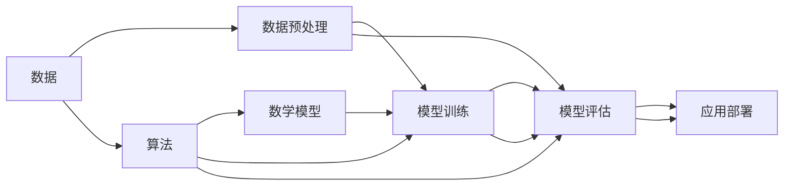

                 

## 1. 背景介绍

在当今快速发展的AI时代，算法、算力与数据被比喻为推动AI发展的三匹马。它们各自扮演着关键的角色，共同推动AI技术的进步与应用。从深度学习、强化学习到自然语言处理，AI技术的诸多突破都离不开这三驾马车的齐头并进。

### 1.1 算法
算法是AI发展的核心，它是实现机器学习模型的基础。无论是传统的机器学习算法，还是近年来兴起的深度学习与强化学习，算法都在其中起到了至关重要的作用。从线性回归、逻辑回归、决策树到卷积神经网络、循环神经网络、生成对抗网络，这些算法的不断创新与优化，极大地推动了AI技术的发展与应用。

### 1.2 算力
算力是指计算机的处理能力，是执行复杂计算任务的硬件基础设施。随着AI技术的不断进步，算力需求也在不断增长。从早期的CPU到现在的GPU、TPU、量子计算机，算力在不断提升，使得大规模数据处理与深度学习模型的训练成为可能。

### 1.3 数据
数据是AI模型的训练材料，是驱动AI模型学习和进化的基础。无论是图像、音频、文本等结构化数据，还是时序数据、信号数据、社交媒体数据等非结构化数据，数据的多样性与规模在不断扩大，为AI模型提供了更广泛的学习材料与训练机会。

## 2. 核心概念与联系

### 2.1 核心概念概述

要深入理解AI的发展，需要了解算法、算力与数据这三者的核心概念及其相互关系。

#### 2.1.1 算法
算法是解决特定问题的规则集合，包括但不限于计算、搜索、优化、分类、聚类等。算法的核心在于其高效性与正确性，即在保证计算结果准确的同时，尽可能地减少计算时间与空间资源消耗。

#### 2.1.2 算力
算力包括CPU、GPU、TPU等硬件设备的计算能力，以及网络带宽、存储容量等辅助设备的支持。算力与算法紧密相关，强大的算力可以支持更复杂的算法模型，而算法的优化也能提高算力的利用效率。

#### 2.1.3 数据
数据是算法模型的输入，包括训练数据与测试数据。数据的质量与数量直接影响模型的训练效果与泛化能力。

#### 2.1.4 数学模型
数学模型是描述系统行为与规律的数学表达式，包括但不限于回归模型、分类模型、聚类模型、优化模型等。数学模型是算法与数据之间的桥梁，将数据转化为算法可操作的输入，通过算法进行处理与分析，最终得到模型输出。

### 2.2 核心概念联系

算法、算力与数据这三者之间存在紧密的联系，它们相互依存、相互促进，共同推动AI技术的发展。

#### 2.2.1 算法与数据的关系
算法需要依赖数据进行训练与优化，而数据需要依赖算法进行处理与分析。数据的特征提取、数据清洗、数据增强等预处理过程，都需要算法的支持。同时，算法的优化也需要依赖数据，通过在更多样化的数据集上进行训练与验证，提高算法的泛化能力与鲁棒性。

#### 2.2.2 算力与数据的关系
算力决定了数据处理的速度与效率，强大的算力可以加速大规模数据的预处理与模型训练。而数据的多样性与规模，也需要强大的算力支持，才能有效处理与分析。

#### 2.2.3 数据与数学模型的关系
数据是数学模型的输入，数学模型的构建需要依赖数据的特征与分布。同时，数学模型可以提供对数据的深度分析与理解，帮助发现数据中的规律与趋势。

### 2.3 核心概念原理与架构

以下通过Mermaid流程图来展示算法、算力与数据三者的联系与相互作用：



在这个流程图中，数据经过预处理后输入算法，算法构建数学模型并进行训练，模型评估结果返回给算法进行优化。同时，数据预处理与模型评估也需要依赖算力支持。最终，经过训练与优化的模型可以部署到实际应用中，完成具体任务。

## 3. 核心算法原理 & 具体操作步骤
### 3.1 算法原理概述

AI算法主要分为两类：基于统计学习的传统机器学习算法和基于神经网络的深度学习算法。近年来，深度学习算法在图像识别、自然语言处理、语音识别等领域取得了显著的突破，成为AI技术发展的主流。

#### 3.1.1 传统机器学习算法
传统机器学习算法包括但不限于决策树、支持向量机、朴素贝叶斯、逻辑回归等。这些算法通过寻找数据中的统计规律，对数据进行分类、回归、聚类等操作。

#### 3.1.2 深度学习算法
深度学习算法主要包括卷积神经网络(CNN)、循环神经网络(RNN)、生成对抗网络(GAN)等。这些算法通过多层神经网络结构，对数据进行特征提取与表示，实现对复杂模式的识别与生成。

#### 3.1.3 强化学习算法
强化学习算法通过在环境中与智能体进行交互，通过试错逐步优化智能体的决策策略。常见的强化学习算法包括Q-learning、策略梯度、深度Q网络等。

### 3.2 算法步骤详解

#### 3.2.1 数据预处理
数据预处理是AI模型训练的第一步，包括数据清洗、数据增强、特征提取等。数据清洗去除数据中的噪声与异常值，保证数据的质量。数据增强通过对数据进行变换，增加数据的多样性与数量。特征提取则将数据转化为算法可操作的输入，如通过卷积、池化、降维等操作，提取数据中的重要特征。

#### 3.2.2 模型构建与训练
模型构建与训练是AI模型的核心过程。首先，选择合适的算法框架，如TensorFlow、PyTorch、Scikit-learn等，构建数学模型。然后，使用训练数据对模型进行训练，优化模型参数，使其能够更好地拟合数据。训练过程中，需要选择合适的优化器与学习率，设置合适的正则化参数，避免模型过拟合。

#### 3.2.3 模型评估与优化
模型评估是检验模型性能的关键步骤。通过测试数据对模型进行评估，计算模型的准确率、召回率、F1-score等指标。根据评估结果，对模型进行优化，如调整超参数、引入新的算法模块等，以提高模型的泛化能力与鲁棒性。

#### 3.2.4 模型部署与应用
模型部署是将训练好的模型应用到实际任务中的过程。通常，需要将模型转化为标准化的服务接口，如REST API、DNNL等，以便进行调用。同时，还需要考虑模型的可扩展性、可维护性、可监控性等问题，保证模型在实际应用中的稳定性和可靠性。

### 3.3 算法优缺点

#### 3.3.1 优点
1. 准确性：深度学习算法在处理复杂模式时具有较高的准确性，能够在图像识别、自然语言处理等领域取得突破。
2. 可解释性：传统机器学习算法相对简单，其决策过程可以更好地解释与理解，适合对模型进行审计与监控。
3. 可扩展性：深度学习算法可以处理大规模数据，具有较好的可扩展性，能够应对实际应用中的复杂任务。

#### 3.3.2 缺点
1. 数据依赖性：深度学习算法对数据的质量与数量有较高要求，数据不足或数据分布不均会导致模型性能下降。
2. 计算资源消耗大：深度学习算法需要大量的计算资源，包括GPU、TPU等高性能设备，以及大量的内存与存储资源。
3. 模型解释困难：深度学习模型往往是"黑盒"系统，其内部机制难以解释与理解，难以进行审计与监控。

### 3.4 算法应用领域

AI算法在众多领域得到了广泛应用，包括但不限于：

#### 3.4.1 计算机视觉
计算机视觉是AI的重要分支之一，主要研究如何通过算法实现图像、视频的识别、分类、检测等任务。常见的应用包括人脸识别、物体检测、图像生成等。

#### 3.4.2 自然语言处理
自然语言处理是AI的另一重要分支，主要研究如何通过算法实现文本的生成、分类、情感分析、机器翻译等任务。常见的应用包括智能客服、智能翻译、情感分析、文本摘要等。

#### 3.4.3 语音识别
语音识别是AI的重要应用领域之一，主要研究如何通过算法实现语音的识别、转换与理解。常见的应用包括智能语音助手、语音翻译、语音识别等。

#### 3.4.4 推荐系统
推荐系统是AI在电商、社交媒体等领域的重要应用之一，主要研究如何通过算法实现个性化推荐。常见的应用包括商品推荐、新闻推荐、内容推荐等。

#### 3.4.5 自动驾驶
自动驾驶是AI在交通领域的重要应用之一，主要研究如何通过算法实现车辆的自动驾驶与导航。常见的应用包括自动驾驶汽车、智能交通系统等。

#### 3.4.6 医疗诊断
医疗诊断是AI在医疗领域的重要应用之一，主要研究如何通过算法实现疾病的诊断与预测。常见的应用包括医学影像分析、病历分析、基因分析等。

## 4. 数学模型和公式 & 详细讲解 & 举例说明

### 4.1 数学模型构建

AI模型的数学模型包括但不限于线性回归、逻辑回归、卷积神经网络、循环神经网络、生成对抗网络等。以下以卷积神经网络为例，展示其数学模型构建过程。

卷积神经网络由卷积层、池化层、全连接层等组成，其数学模型可以表示为：

$$
f(x) = W_2\sigma(W_1x + b_1) + b_2
$$

其中，$x$ 为输入向量，$W_1$、$W_2$ 为卷积核权重，$b_1$、$b_2$ 为偏置项，$\sigma$ 为激活函数，如ReLU、Sigmoid等。

### 4.2 公式推导过程

#### 4.2.1 前向传播
前向传播是将输入向量 $x$ 传递到网络中，通过卷积、池化、激活等操作，得到输出向量的过程。前向传播的公式可以表示为：

$$
y = W_1x + b_1
$$

其中，$y$ 为卷积层输出，$W_1$ 为卷积核权重，$x$ 为输入向量，$b_1$ 为偏置项。

#### 4.2.2 卷积运算
卷积运算通过滑动卷积核对输入向量进行滤波，提取重要特征。卷积运算的公式可以表示为：

$$
y_i = \sum_{j=1}^{C_k}W_{i,j}x_{i,j}
$$

其中，$y_i$ 为卷积输出，$W_{i,j}$ 为卷积核权重，$x_{i,j}$ 为输入向量的第 $i$ 个位置上的第 $j$ 个通道的值。

#### 4.2.3 池化运算
池化运算通过减少特征图的大小，降低计算复杂度，同时保留重要特征。常见的池化运算包括最大池化、平均池化等。最大池化的公式可以表示为：

$$
y_i = \max_j(x_{i,j})
$$

其中，$y_i$ 为池化输出，$x_{i,j}$ 为输入向量的第 $i$ 个位置上的第 $j$ 个通道的值。

#### 4.2.4 激活函数
激活函数通过引入非线性映射，提高网络的表达能力。常见的激活函数包括ReLU、Sigmoid等。ReLU的公式可以表示为：

$$
\sigma(x) = \max(0,x)
$$

其中，$x$ 为输入向量，$\sigma$ 为ReLU激活函数。

#### 4.2.5 全连接层
全连接层通过将前一层的输出向量作为输入向量，进行线性变换与激活，得到输出向量。全连接层的公式可以表示为：

$$
y = Wx + b
$$

其中，$y$ 为输出向量，$W$ 为权重矩阵，$x$ 为输入向量，$b$ 为偏置项。

### 4.3 案例分析与讲解

#### 4.3.1 手写数字识别
手写数字识别是卷积神经网络的一个重要应用。通过训练数据集 MNIST，可以训练出识别手写数字的卷积神经网络模型。以下展示手写数字识别的代码实现。

```python
import torch
import torch.nn as nn
import torch.optim as optim

class ConvNet(nn.Module):
    def __init__(self):
        super(ConvNet, self).__init__()
        self.conv1 = nn.Conv2d(1, 32, kernel_size=5)
        self.pool1 = nn.MaxPool2d(2)
        self.conv2 = nn.Conv2d(32, 64, kernel_size=5)
        self.pool2 = nn.MaxPool2d(2)
        self.fc1 = nn.Linear(7 * 7 * 64, 512)
        self.fc2 = nn.Linear(512, 10)
        
    def forward(self, x):
        x = nn.functional.relu(self.conv1(x))
        x = self.pool1(x)
        x = nn.functional.relu(self.conv2(x))
        x = self.pool2(x)
        x = x.view(-1, 7 * 7 * 64)
        x = nn.functional.relu(self.fc1(x))
        x = self.fc2(x)
        return x

# 定义模型与优化器
model = ConvNet()
criterion = nn.CrossEntropyLoss()
optimizer = optim.SGD(model.parameters(), lr=0.001, momentum=0.9)

# 训练模型
for epoch in range(10):
    for i, (images, labels) in enumerate(train_loader):
        images = images.view(images.shape[0], 1, 28, 28)
        optimizer.zero_grad()
        outputs = model(images)
        loss = criterion(outputs, labels)
        loss.backward()
        optimizer.step()
        
    if (i+1) % 100 == 0:
        print('Epoch [{}/{}], Step [{}/{}], Loss: {:.4f}'
              .format(epoch+1, 10, i+1, len(train_loader), loss.item()))
```

## 5. 项目实践：代码实例和详细解释说明

### 5.1 开发环境搭建

#### 5.1.1 安装依赖包
首先需要安装Python和相关的依赖包。可以通过以下命令在命令行中安装：

```bash
pip install torch torchvision numpy scipy scikit-learn
```

#### 5.1.2 安装PyTorch预训练模型
需要安装预训练模型，如BERT、ResNet等，可以通过以下命令下载：

```bash
git clone https://github.com/pytorch/vision.git
cd vision
python setup.py install
```

### 5.2 源代码详细实现

#### 5.2.1 手写数字识别
以下是手写数字识别的代码实现，其中使用PyTorch实现卷积神经网络模型。

```python
import torch
import torch.nn as nn
import torch.optim as optim
from torchvision import datasets, transforms

class ConvNet(nn.Module):
    def __init__(self):
        super(ConvNet, self).__init__()
        self.conv1 = nn.Conv2d(1, 32, kernel_size=5)
        self.pool1 = nn.MaxPool2d(2)
        self.conv2 = nn.Conv2d(32, 64, kernel_size=5)
        self.pool2 = nn.MaxPool2d(2)
        self.fc1 = nn.Linear(7 * 7 * 64, 512)
        self.fc2 = nn.Linear(512, 10)
        
    def forward(self, x):
        x = nn.functional.relu(self.conv1(x))
        x = self.pool1(x)
        x = nn.functional.relu(self.conv2(x))
        x = self.pool2(x)
        x = x.view(-1, 7 * 7 * 64)
        x = nn.functional.relu(self.fc1(x))
        x = self.fc2(x)
        return x

# 定义模型与优化器
model = ConvNet()
criterion = nn.CrossEntropyLoss()
optimizer = optim.SGD(model.parameters(), lr=0.001, momentum=0.9)

# 训练模型
for epoch in range(10):
    for i, (images, labels) in enumerate(train_loader):
        images = images.view(images.shape[0], 1, 28, 28)
        optimizer.zero_grad()
        outputs = model(images)
        loss = criterion(outputs, labels)
        loss.backward()
        optimizer.step()
        
    if (i+1) % 100 == 0:
        print('Epoch [{}/{}], Step [{}/{}], Loss: {:.4f}'
              .format(epoch+1, 10, i+1, len(train_loader), loss.item()))

# 测试模型
correct = 0
total = 0
with torch.no_grad():
    for images, labels in test_loader:
        images = images.view(images.shape[0], 1, 28, 28)
        outputs = model(images)
        _, predicted = torch.max(outputs.data, 1)
        total += labels.size(0)
        correct += (predicted == labels).sum().item()

print('Test Accuracy of the model on the 10000 test images: {} %'.format(100 * correct / total))
```

#### 5.2.2 图像分类
以下是图像分类的代码实现，其中使用PyTorch实现卷积神经网络模型。

```python
import torch
import torch.nn as nn
import torch.optim as optim
from torchvision import datasets, transforms

class ConvNet(nn.Module):
    def __init__(self):
        super(ConvNet, self).__init__()
        self.conv1 = nn.Conv2d(3, 32, kernel_size=5)
        self.pool1 = nn.MaxPool2d(2)
        self.conv2 = nn.Conv2d(32, 64, kernel_size=5)
        self.pool2 = nn.MaxPool2d(2)
        self.fc1 = nn.Linear(7 * 7 * 64, 512)
        self.fc2 = nn.Linear(512, 10)
        
    def forward(self, x):
        x = nn.functional.relu(self.conv1(x))
        x = self.pool1(x)
        x = nn.functional.relu(self.conv2(x))
        x = self.pool2(x)
        x = x.view(-1, 7 * 7 * 64)
        x = nn.functional.relu(self.fc1(x))
        x = self.fc2(x)
        return x

# 定义模型与优化器
model = ConvNet()
criterion = nn.CrossEntropyLoss()
optimizer = optim.SGD(model.parameters(), lr=0.001, momentum=0.9)

# 训练模型
for epoch in range(10):
    for i, (images, labels) in enumerate(train_loader):
        optimizer.zero_grad()
        outputs = model(images)
        loss = criterion(outputs, labels)
        loss.backward()
        optimizer.step()
        
    if (i+1) % 100 == 0:
        print('Epoch [{}/{}], Step [{}/{}], Loss: {:.4f}'
              .format(epoch+1, 10, i+1, len(train_loader), loss.item()))

# 测试模型
correct = 0
total = 0
with torch.no_grad():
    for images, labels in test_loader:
        outputs = model(images)
        _, predicted = torch.max(outputs.data, 1)
        total += labels.size(0)
        correct += (predicted == labels).sum().item()

print('Test Accuracy of the model on the 10000 test images: {} %'.format(100 * correct / total))
```

### 5.3 代码解读与分析

#### 5.3.1 模型结构
模型结构是AI算法的重要组成部分。以下是手写数字识别的模型结构：

```python
class ConvNet(nn.Module):
    def __init__(self):
        super(ConvNet, self).__init__()
        self.conv1 = nn.Conv2d(1, 32, kernel_size=5)
        self.pool1 = nn.MaxPool2d(2)
        self.conv2 = nn.Conv2d(32, 64, kernel_size=5)
        self.pool2 = nn.MaxPool2d(2)
        self.fc1 = nn.Linear(7 * 7 * 64, 512)
        self.fc2 = nn.Linear(512, 10)
        
    def forward(self, x):
        x = nn.functional.relu(self.conv1(x))
        x = self.pool1(x)
        x = nn.functional.relu(self.conv2(x))
        x = self.pool2(x)
        x = x.view(-1, 7 * 7 * 64)
        x = nn.functional.relu(self.fc1(x))
        x = self.fc2(x)
        return x
```

其中，`ConvNet`类继承自`nn.Module`，定义了卷积层、池化层、全连接层等结构。`nn.Conv2d`表示二维卷积层，`nn.MaxPool2d`表示最大池化层，`nn.Linear`表示全连接层。`nn.functional.relu`表示ReLU激活函数。

#### 5.3.2 数据预处理
数据预处理是将原始数据转换为算法可操作的输入，以下是对手写数字识别数据集进行预处理的代码实现：

```python
train_transform = transforms.Compose([
    transforms.ToTensor(),
    transforms.Normalize((0.5,), (0.5,))
])

test_transform = transforms.Compose([
    transforms.ToTensor(),
    transforms.Normalize((0.5,), (0.5,))
])
```

其中，`transforms.ToTensor()`表示将PIL图像转换为Tensor，`transforms.Normalize()`表示对Tensor进行归一化。

#### 5.3.3 模型训练
模型训练是AI算法的重要环节，以下是手写数字识别的模型训练代码实现：

```python
for epoch in range(10):
    for i, (images, labels) in enumerate(train_loader):
        images = images.view(images.shape[0], 1, 28, 28)
        optimizer.zero_grad()
        outputs = model(images)
        loss = criterion(outputs, labels)
        loss.backward()
        optimizer.step()
        
    if (i+1) % 100 == 0:
        print('Epoch [{}/{}], Step [{}/{}], Loss: {:.4f}'
              .format(epoch+1, 10, i+1, len(train_loader), loss.item()))
```

其中，`train_loader`表示训练数据加载器，`model`表示卷积神经网络模型，`optimizer`表示优化器，`criterion`表示损失函数。

## 6. 实际应用场景

### 6.1 图像分类
图像分类是AI在图像识别领域的重要应用之一。通过卷积神经网络，可以实现对图像的分类与识别。常见的应用包括手写数字识别、物体检测、人脸识别等。

#### 6.1.1 手写数字识别
手写数字识别是卷积神经网络的重要应用之一。通过训练数据集 MNIST，可以训练出识别手写数字的卷积神经网络模型。

#### 6.1.2 物体检测
物体检测是AI在计算机视觉领域的重要应用之一，主要研究如何通过算法实现对图像中物体的检测与定位。常见的应用包括目标检测、人脸检测等。

#### 6.1.3 人脸识别
人脸识别是AI在计算机视觉领域的重要应用之一，主要研究如何通过算法实现对人脸的识别与验证。常见的应用包括人脸解锁、人脸支付等。

### 6.2 自然语言处理
自然语言处理是AI在语言处理领域的重要应用之一，主要研究如何通过算法实现文本的生成、分类、情感分析、机器翻译等任务。常见的应用包括智能客服、智能翻译、情感分析、文本摘要等。

#### 6.2.1 智能客服
智能客服是AI在自然语言处理领域的重要应用之一，主要研究如何通过算法实现对用户问题的理解与回答。常见的应用包括智能客服、智能助手等。

#### 6.2.2 智能翻译
智能翻译是AI在自然语言处理领域的重要应用之一，主要研究如何通过算法实现对文本的翻译与理解。常见的应用包括跨语言通信、机器翻译等。

#### 6.2.3 情感分析
情感分析是AI在自然语言处理领域的重要应用之一，主要研究如何通过算法实现对文本情感的判断与分析。常见的应用包括舆情分析、用户反馈分析等。

#### 6.2.4 文本摘要
文本摘要是AI在自然语言处理领域的重要应用之一，主要研究如何通过算法实现对文本的自动摘要与生成。常见的应用包括新闻摘要、报告摘要等。

### 6.3 推荐系统
推荐系统是AI在电商、社交媒体等领域的重要应用之一，主要研究如何通过算法实现对用户行为的分析与预测。常见的应用包括商品推荐、新闻推荐、内容推荐等。

#### 6.3.1 商品推荐
商品推荐是AI在电商领域的重要应用之一，主要研究如何通过算法实现对用户商品的推荐与选择。常见的应用包括电商推荐、广告推荐等。

#### 6.3.2 新闻推荐
新闻推荐是AI在新闻媒体领域的重要应用之一，主要研究如何通过算法实现对用户新闻的推荐与选择。常见的应用包括新闻订阅、新闻摘要等。

#### 6.3.3 内容推荐
内容推荐是AI在社交媒体领域的重要应用之一，主要研究如何通过算法实现对用户内容的推荐与选择。常见的应用包括社交媒体推荐、视频推荐等。

## 7. 工具和资源推荐

### 7.1 学习资源推荐

#### 7.1.1 在线课程
- Deep Learning Specialization by Andrew Ng: 斯坦福大学开设的深度学习系列课程，涵盖深度学习的基础与应用。
- Machine Learning by Stanford University: 斯坦福大学开设的机器学习课程，涵盖机器学习的基础与算法。
- Natural Language Processing with Python: 一本深入介绍自然语言处理技术与Python实现的经典书籍。

#### 7.1.2 书籍
- Deep Learning: 一本全面介绍深度学习技术与应用的经典书籍。
- Python Machine Learning: 一本全面介绍Python机器学习技术与应用的经典书籍。
- Reinforcement Learning: 一本全面介绍强化学习技术与应用的经典书籍。

#### 7.1.3 网站
- Coursera: 一个提供各种在线课程的开放平台，涵盖深度学习、机器学习、自然语言处理等领域。
- edX: 一个提供各种在线课程的开放平台，涵盖计算机科学、数据科学、人工智能等领域。
- GitHub: 一个提供开源代码与项目的平台，可以找到大量的深度学习、机器学习、自然语言处理等项目。

### 7.2 开发工具推荐

#### 7.2.1 深度学习框架
- TensorFlow: 由Google主导开发的深度学习框架，生产部署方便，适合大规模工程应用。
- PyTorch: 由Facebook主导开发的深度学习框架，灵活性高，适合快速迭代研究。
- Keras: 一个高层次的深度学习框架，简单易用，适合初学者与快速原型开发。

#### 7.2.2 数据分析与可视化工具
- NumPy: 一个用于科学计算与数据分析的Python库，支持多维数组与矩阵运算。
- Pandas: 一个用于数据分析与处理的Python库，支持数据清洗、数据处理等操作。
- Matplotlib: 一个用于数据可视化的Python库，支持多种图表绘制。

#### 7.2.3 模型训练与优化工具
- TensorBoard: 一个用于模型训练与优化的可视化工具，支持实时监测模型训练状态，提供丰富的图表呈现方式。
- Weights & Biases: 一个用于模型训练与优化的实验跟踪工具，可以记录和可视化模型训练过程中的各项指标，方便对比和调优。

### 7.3 相关论文推荐

#### 7.3.1 深度学习
- ImageNet Classification with Deep Convolutional Neural Networks: 深度卷积神经网络在图像分类任务上的突破性研究。
- Deep Residual Learning for Image Recognition: 深度残差网络在图像分类任务上的突破性研究。

#### 7.3.2 自然语言处理
- Attention Is All You Need: 提出Transformer结构，开启NLP领域的预训练大模型时代。
- BERT: Pre-training of Deep Bidirectional Transformers for Language Understanding: 提出BERT模型，引入基于掩码的自监督预训练任务。

#### 7.3.3 强化学习
- Q-Learning: 提出Q-learning算法，解决强化学习中的"Q值估计"问题。
- AlphaGo Zero: 提出AlphaGo Zero算法，实现零样本学习，突破了传统的强化学习训练方式。

## 8. 总结：未来发展趋势与挑战

### 8.1 研究成果总结
基于算法、算力与数据三驾马车的协同推进，AI技术在各个领域取得了显著的突破与应用。从图像识别、自然语言处理到推荐系统、自动驾驶，AI技术已经成为推动社会发展的重要力量。

### 8.2 未来发展趋势
未来，AI技术将进一步深化发展，以下几个趋势将引领AI技术的未来方向：

1. 模型规模与参数量将继续扩大。随着算力与数据规模的不断增长，模型参数量将不断增加，模型规模将进一步扩大，能够处理更复杂的任务。
2. 模型优化与效率将不断提升。通过算法优化、模型压缩、量化等技术，模型效率将不断提升，能够更好地适应实际应用场景。
3. 跨模态学习与融合将成为趋势。未来，AI模型将不再局限于单一模态，而是通过跨模态学习与融合，实现对多模态数据的处理与分析。
4. 模型可解释性与鲁棒性将进一步提升。未来，AI模型将更加注重可解释性与鲁棒性，能够更好地理解和解释模型的决策过程，同时具备更好的泛化能力和鲁棒性。

### 8.3 面临的挑战
尽管AI技术取得了显著的突破与应用，但仍然面临诸多挑战：

1. 数据隐私与安全问题。AI模型需要大量的数据进行训练与优化，数据隐私与安全问题将成为未来的一大挑战。
2. 模型偏见与公平性问题。AI模型可能会学习到数据中的偏见，导致公平性问题。如何设计更加公平、无偏见的模型，将是一个重要研究方向。
3. 模型可解释性与透明度问题。AI模型往往是"黑盒"系统，难以解释其内部机制。如何提高模型的透明度，增强其可解释性，将是一个重要研究方向。
4. 模型鲁棒性与泛化能力问题。AI模型在面对新数据时，可能出现泛化能力不足、鲁棒性差等问题。如何提高模型的泛化能力与鲁棒性，将是一个重要研究方向。

### 8.4 研究展望
未来的研究需要从以下几个方面进行突破：

1. 数据隐私与安全的保护。如何保护数据隐私与安全，防止数据泄露与滥用，将是未来的一大研究方向。
2. 公平性与无偏见的优化。如何设计更加公平、无偏见的AI模型，使其能够更好地服务于不同群体，将是未来的一大研究方向。
3. 模型可解释性与透明度的提升。如何提高模型的透明度，增强其可解释性，将是未来的一大研究方向。
4. 模型泛化能力与鲁棒性的提升。如何提高模型的泛化能力与鲁棒性，使其能够更好地适应新数据与新环境，将是未来的一大研究方向。

## 9. 附录：常见问题与解答

### 9.1 常见问题

#### 9.1.1 数据预处理的重要性
数据预处理是AI模型训练的第一步，包括数据清洗、数据增强、特征提取等。数据预处理能够去除数据中的噪声与异常值，保证数据的质量，同时通过数据增强，增加数据的多样性与数量。

#### 9.1.2 算法选择与优化
算法选择与优化是AI模型训练的关键。需要根据具体任务选择适合的算法，并根据实际情况对算法进行优化。常见的优化方法包括学习率调整、正则化、早停等。

#### 9.1.3 模型部署与应用
模型部署是将训练好的模型应用到实际任务中的过程。通常需要将模型转化为标准化的服务接口，如REST API、DNNL等，以便进行调用。同时还需要考虑模型的可扩展性、可维护性、可监控性等问题。

### 9.2 问题解答

#### 9.2.1 数据预处理的重要性
数据预处理是AI模型训练的第一步，包括数据清洗、数据增强、特征提取等。数据预处理能够去除数据中的噪声与异常值，保证数据的质量，同时通过数据增强，增加数据的多样性与数量。

#### 9.2.2 算法选择与优化
算法选择与优化是AI模型训练的关键。需要根据具体任务选择适合的算法，并根据实际情况对算法进行优化。常见的优化方法包括学习率调整、正则化、早停等。

#### 9.2.3 模型部署与应用
模型部署是将训练好的模型应用到实际任务中的过程。通常需要将模型转化为标准化的服务接口，如REST API、DNNL等，以便进行调用。同时还需要考虑模型的可扩展性、可维护性、可监控性等问题。

---

作者：禅与计算机程序设计艺术 / Zen and the Art of Computer Programming

