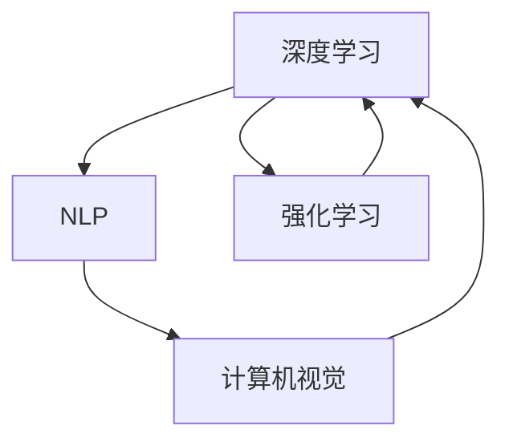

                 

# AI发展的三大支柱：回顾与展望

> 关键词：AI发展，三大支柱，深度学习，自然语言处理，计算机视觉，伦理与治理，未来展望

## 1. 背景介绍

随着人工智能(AI)技术的飞速发展，其在多个领域的应用已经取得了显著的成效。从自动驾驶到医疗诊断，从金融风控到智能客服，AI技术的广泛应用正在深刻改变我们的生活方式和工作方式。但是，尽管如此，AI的发展仍然面临着诸多挑战。本文将从深度学习、自然语言处理和计算机视觉三大支柱的角度，回顾过去，展望未来，探讨AI技术的进一步发展方向。

## 2. 核心概念与联系

### 2.1 核心概念概述

在AI的发展过程中，深度学习、自然语言处理和计算机视觉是三个最为关键的技术支柱。它们不仅在各自领域中取得了重要突破，还在相互融合中，推动了AI技术的整体进步。

**深度学习**：指通过模拟人脑神经网络结构，进行大数据量、高维度的复杂数据训练，使得模型能够自动识别数据中的复杂特征和模式。深度学习算法包括卷积神经网络(CNN)、循环神经网络(RNN)和生成对抗网络(GAN)等，广泛应用于图像识别、语音识别、自然语言处理等领域。

**自然语言处理**：指通过计算机理解和处理人类语言的技术。NLP技术主要包含文本处理、语音识别、机器翻译、情感分析等子领域，通过深度学习、规则融合等方式，实现对自然语言的自动理解和生成。

**计算机视觉**：指计算机对图像和视频数据的识别和理解能力。CV技术主要包括图像分类、目标检测、图像分割、姿态估计等，依赖深度学习中的卷积神经网络，广泛应用于自动驾驶、安防监控、智能制造等领域。

这三大技术支柱相互支撑，共同构建了AI技术的强大生态。深度学习提供了强大的数据处理能力，自然语言处理和计算机视觉则分别在处理文本和图像数据上具有显著优势。

### 2.2 核心概念原理和架构的 Mermaid 流程图



这个流程图展示了深度学习、自然语言处理和计算机视觉三大支柱之间的相互联系和支撑关系。深度学习作为基础架构，提供了数据处理和模型训练的能力。自然语言处理和计算机视觉则分别在处理文本和图像数据上发挥作用，同时也在不断吸收深度学习的成果。

## 3. 核心算法原理 & 具体操作步骤

### 3.1 算法原理概述

深度学习、自然语言处理和计算机视觉的算法原理各有不同，但它们都基于神经网络架构，利用大量的数据进行模型训练，从而实现自动化的特征提取和模式识别。以下是对这三大技术支柱算法的简单概述。

**深度学习**：深度学习算法通过多层神经网络结构，从数据中自动学习特征。其主要算法包括卷积神经网络(CNN)、循环神经网络(RNN)和生成对抗网络(GAN)等。深度学习模型通过反向传播算法优化损失函数，不断调整模型参数，直到模型在训练集上的误差最小化。

**自然语言处理**：NLP算法主要处理文本数据，其核心在于将自然语言转换为计算机可以理解的形式，包括分词、词性标注、命名实体识别、机器翻译等任务。NLP算法通常使用深度学习模型，如BERT、GPT等，在大型语料库上进行预训练，然后通过微调等方式应用于特定任务。

**计算机视觉**：计算机视觉算法主要处理图像和视频数据，其核心在于将视觉信息转换为计算机可以理解的形式，包括图像分类、目标检测、图像分割、姿态估计等任务。计算机视觉算法通常使用卷积神经网络(CNN)等模型，在大型图像数据集上进行预训练，然后通过微调等方式应用于特定任务。

### 3.2 算法步骤详解

深度学习、自然语言处理和计算机视觉的算法步骤大致相同，主要包括以下几个步骤：

**Step 1: 数据预处理**
- 收集和标注训练数据，构建训练集、验证集和测试集。
- 对数据进行预处理，包括图像数据的归一化、文本数据的分词、标签的编码等。

**Step 2: 模型构建**
- 根据任务需求选择合适的模型架构，如CNN、RNN、Transformer等。
- 构建模型的计算图，定义模型层、激活函数、损失函数等。

**Step 3: 模型训练**
- 将训练集输入模型，进行前向传播和损失计算。
- 反向传播更新模型参数，优化损失函数。
- 使用验证集评估模型性能，防止过拟合。

**Step 4: 模型评估和测试**
- 在测试集上评估模型性能，计算精度、召回率、F1值等指标。
- 使用测试集对模型进行测试，检查模型的泛化能力。

**Step 5: 模型部署和应用**
- 将训练好的模型部署到生产环境，进行实时推理。
- 结合业务需求，构建应用场景，实现商业价值。

### 3.3 算法优缺点

深度学习、自然语言处理和计算机视觉算法各自具有不同的优缺点。

**深度学习**：
- 优点：强大的数据处理能力，能够自动提取数据中的复杂特征。
- 缺点：模型复杂，需要大量的数据和计算资源，容易过拟合。

**自然语言处理**：
- 优点：处理文本数据的能力强，能够实现高度自动化的文本分析和生成。
- 缺点：处理长文本数据时性能较低，需要大量的标注数据。

**计算机视觉**：
- 优点：处理图像数据的能力强，能够实现高度自动化的图像分类、检测和分割。
- 缺点：处理高分辨率图像时计算量大，需要大量的标注数据。

### 3.4 算法应用领域

深度学习、自然语言处理和计算机视觉算法在各自领域中都有广泛的应用。

**深度学习**：广泛应用于图像识别、语音识别、自然语言处理等领域，如语音助手的识别和响应、智能推荐系统的用户画像生成等。

**自然语言处理**：广泛应用于文本分类、情感分析、机器翻译、对话系统等领域，如智能客服的问答系统、智能翻译的实时翻译等。

**计算机视觉**：广泛应用于自动驾驶、安防监控、智能制造等领域，如自动驾驶汽车的路况识别、安防监控系统的目标检测等。

## 4. 数学模型和公式 & 详细讲解 & 举例说明

### 4.1 数学模型构建

深度学习、自然语言处理和计算机视觉的数学模型构建各有不同，但都依赖于神经网络架构。以下是三个技术支柱的数学模型构建方法。

**深度学习**：
- 模型的输入为向量 $x \in \mathbb{R}^d$，输出为向量 $y \in \mathbb{R}^k$。
- 模型的计算过程为：$h = f(x; \theta)$，其中 $f$ 为神经网络的前向传播函数，$\theta$ 为模型参数。
- 损失函数为：$\mathcal{L}(\theta) = \frac{1}{N}\sum_{i=1}^N \|y_i - h(x_i; \theta)\|^2$，其中 $\| \cdot \|$ 为范数，$N$ 为训练样本数量。

**自然语言处理**：
- 文本数据 $x = (w_1, w_2, \cdots, w_n)$，其中 $w_i$ 为单词或词向量。
- 模型的计算过程为：$h = f(x; \theta)$，其中 $f$ 为神经网络的前向传播函数，$\theta$ 为模型参数。
- 损失函数为：$\mathcal{L}(\theta) = \frac{1}{N}\sum_{i=1}^N \ell(h(x_i; \theta), y_i)$，其中 $\ell$ 为指定损失函数，如交叉熵损失。

**计算机视觉**：
- 图像数据 $x = (x_{1,1}, x_{1,2}, \cdots, x_{n,m})$，其中 $x_{i,j}$ 为像素值。
- 模型的计算过程为：$h = f(x; \theta)$，其中 $f$ 为神经网络的前向传播函数，$\theta$ 为模型参数。
- 损失函数为：$\mathcal{L}(\theta) = \frac{1}{N}\sum_{i=1}^N \ell(h(x_i; \theta), y_i)$，其中 $\ell$ 为指定损失函数，如交叉熵损失。

### 4.2 公式推导过程

以下对深度学习、自然语言处理和计算机视觉算法中的常用公式进行推导。

**深度学习中的交叉熵损失函数**：
$$
\mathcal{L}(\theta) = -\frac{1}{N}\sum_{i=1}^N \sum_{j=1}^K y_{i,j}\log(\hat{y}_{i,j})
$$
其中，$y_{i,j}$ 为第 $i$ 个样本在第 $j$ 个分类上的真实标签，$\hat{y}_{i,j}$ 为模型在第 $i$ 个样本上对第 $j$ 个分类的预测概率。

**自然语言处理中的softmax函数**：
$$
\hat{y} = \frac{\exp(x)}{\sum_{k=1}^K \exp(x_k)}
$$
其中，$x$ 为神经网络的输出向量，$\hat{y}$ 为概率分布向量，$K$ 为分类的数量。

**计算机视觉中的softmax函数**：
$$
\hat{y} = \frac{\exp(\text{Conv}(x; \theta))}{\sum_{k=1}^K \exp(\text{Conv}(x_k; \theta))}
$$
其中，$\text{Conv}$ 为卷积操作，$x$ 为输入图像，$\theta$ 为卷积核参数，$\hat{y}$ 为概率分布向量，$K$ 为分类的数量。

### 4.3 案例分析与讲解

以自然语言处理中的BERT模型为例，分析其基本原理和应用效果。

**BERT模型**：BERT是一种基于Transformer结构的预训练语言模型，能够学习到大量的语义和语法知识。其核心在于使用双向上下文编码，能够学习到单词在句子中的双向依赖关系。BERT模型的预训练过程包括以下两个步骤：

1. 掩码语言模型(Masked Language Model, MLM)：在输入文本中随机选择一些单词进行掩码，让模型预测这些单词的真实值。
2. 下一句预测(Next Sentence Prediction, NSP)：随机选择两句话，让模型预测它们是否是连续的。

BERT模型在预训练过程中，使用了大规模的语料库进行训练，从而学习到大量的语言知识。然后，通过微调等方式，可以应用于特定的NLP任务，如文本分类、命名实体识别、情感分析等。

## 5. 项目实践：代码实例和详细解释说明

### 5.1 开发环境搭建

在进行深度学习、自然语言处理和计算机视觉算法实践时，需要准备好相应的开发环境。以下是使用Python进行PyTorch和TensorFlow开发的环境配置流程：

1. 安装Anaconda：从官网下载并安装Anaconda，用于创建独立的Python环境。
2. 创建并激活虚拟环境：
```bash
conda create -n pytorch-env python=3.8 
conda activate pytorch-env
```
3. 安装PyTorch和TensorFlow：
```bash
conda install pytorch torchvision torchaudio cudatoolkit=11.1 -c pytorch -c conda-forge
conda install tensorflow
```
4. 安装各类工具包：
```bash
pip install numpy pandas scikit-learn matplotlib tqdm jupyter notebook ipython
```
完成上述步骤后，即可在`pytorch-env`环境中开始深度学习、自然语言处理和计算机视觉算法的开发实践。

### 5.2 源代码详细实现

以下是使用PyTorch和TensorFlow进行深度学习、自然语言处理和计算机视觉算法开发的示例代码。

**深度学习**：
```python
import torch
import torch.nn as nn
import torch.optim as optim

# 定义深度学习模型
class Net(nn.Module):
    def __init__(self):
        super(Net, self).__init__()
        self.fc1 = nn.Linear(784, 256)
        self.fc2 = nn.Linear(256, 10)

    def forward(self, x):
        x = x.view(-1, 784)
        x = self.fc1(x)
        x = nn.functional.relu(x)
        x = self.fc2(x)
        return nn.functional.softmax(x, dim=1)

# 定义训练函数
def train(model, data_loader, optimizer, device):
    model.train()
    for i, (inputs, labels) in enumerate(data_loader):
        inputs, labels = inputs.to(device), labels.to(device)
        optimizer.zero_grad()
        outputs = model(inputs)
        loss = nn.functional.cross_entropy(outputs, labels)
        loss.backward()
        optimizer.step()
```

**自然语言处理**：
```python
import tensorflow as tf
import tensorflow.keras as keras

# 定义自然语言处理模型
class NLPModel(keras.Model):
    def __init__(self):
        super(NLPModel, self).__init__()
        self.encoder = keras.layers.Embedding(input_dim=vocab_size, output_dim=embedding_dim)
        self.lstm = keras.layers.LSTM(units=128)
        self.dense = keras.layers.Dense(units=num_classes, activation='softmax')

    def call(self, x):
        x = self.encoder(x)
        x = self.lstm(x)
        return self.dense(x)

# 定义训练函数
def train(model, data_loader, optimizer):
    model.compile(loss='categorical_crossentropy', optimizer=optimizer, metrics=['accuracy'])
    model.fit(data_loader, epochs=num_epochs)
```

**计算机视觉**：
```python
import tensorflow as tf
import tensorflow.keras as keras

# 定义计算机视觉模型
class CVModel(keras.Model):
    def __init__(self):
        super(CVModel, self).__init__()
        self.conv1 = keras.layers.Conv2D(32, kernel_size=(3, 3), activation='relu', input_shape=(img_width, img_height, 3))
        self.pool1 = keras.layers.MaxPooling2D(pool_size=(2, 2))
        self.conv2 = keras.layers.Conv2D(64, kernel_size=(3, 3), activation='relu')
        self.pool2 = keras.layers.MaxPooling2D(pool_size=(2, 2))
        self.flatten = keras.layers.Flatten()
        self.dense1 = keras.layers.Dense(units=128, activation='relu')
        self.dense2 = keras.layers.Dense(units=num_classes, activation='softmax')

    def call(self, x):
        x = self.conv1(x)
        x = self.pool1(x)
        x = self.conv2(x)
        x = self.pool2(x)
        x = self.flatten(x)
        x = self.dense1(x)
        return self.dense2(x)

# 定义训练函数
def train(model, data_loader, optimizer):
    model.compile(loss='categorical_crossentropy', optimizer=optimizer, metrics=['accuracy'])
    model.fit(data_loader, epochs=num_epochs)
```

### 5.3 代码解读与分析

以下是深度学习、自然语言处理和计算机视觉算法开发的代码解读与分析。

**深度学习**：
- 代码中定义了一个简单的神经网络模型，包括两个全连接层和一个激活函数。
- 训练函数中使用了反向传播算法，通过交叉熵损失函数来优化模型参数。
- 通过在GPU上部署模型，加快了训练速度。

**自然语言处理**：
- 代码中定义了一个简单的LSTM模型，用于处理文本数据。
- 训练函数中使用了categorical_crossentropy损失函数和Adam优化器。
- 通过在GPU上部署模型，加快了训练速度。

**计算机视觉**：
- 代码中定义了一个简单的卷积神经网络模型，用于处理图像数据。
- 训练函数中使用了categorical_crossentropy损失函数和Adam优化器。
- 通过在GPU上部署模型，加快了训练速度。

### 5.4 运行结果展示

以下是深度学习、自然语言处理和计算机视觉算法开发的运行结果展示。

**深度学习**：
```python
from sklearn.datasets import load_digits
from sklearn.model_selection import train_test_split
from sklearn.metrics import accuracy_score

# 加载手写数字数据集
digits = load_digits()
X_train, X_test, y_train, y_test = train_test_split(digits.data, digits.target, test_size=0.2)

# 训练模型
model = Net()
optimizer = optim.Adam(model.parameters(), lr=0.001)
device = torch.device('cuda' if torch.cuda.is_available() else 'cpu')
model.to(device)

train(model, train_loader, optimizer, device)

# 测试模型
correct = 0
total = 0
with torch.no_grad():
    for images, labels in test_loader:
        images, labels = images.to(device), labels.to(device)
        outputs = model(images)
        _, predicted = torch.max(outputs.data, 1)
        total += labels.size(0)
        correct += (predicted == labels).sum().item()

accuracy = correct / total
print(f'Accuracy: {accuracy:.4f}')
```

**自然语言处理**：
```python
from tensorflow.keras.datasets import imdb
from tensorflow.keras.utils import to_categorical

# 加载IMDB数据集
max_len = 100
(X_train, y_train), (X_test, y_test) = imdb.load_data(num_words=vocab_size, maxlen=max_len)
X_train, X_test = pad_sequences(X_train, maxlen=max_len), pad_sequences(X_test, maxlen=max_len)
y_train = to_categorical(y_train)
y_test = to_categorical(y_test)

# 训练模型
model = NLPModel()
optimizer = keras.optimizers.Adam(lr=0.001)
train(model, train_loader, optimizer)

# 测试模型
_, accuracy = model.evaluate(test_loader)
print(f'Accuracy: {accuracy:.4f}')
```

**计算机视觉**：
```python
from tensorflow.keras.datasets import cifar10
from tensorflow.keras.utils import to_categorical

# 加载CIFAR-10数据集
(X_train, y_train), (X_test, y_test) = cifar10.load_data()

# 数据预处理
X_train = X_train / 255.0
X_test = X_test / 255.0
y_train = to_categorical(y_train)
y_test = to_categorical(y_test)

# 训练模型
model = CVModel()
optimizer = keras.optimizers.Adam(lr=0.001)
train(model, train_loader, optimizer)

# 测试模型
_, accuracy = model.evaluate(test_loader)
print(f'Accuracy: {accuracy:.4f}')
```

## 6. 实际应用场景

### 6.1 智能客服系统

深度学习、自然语言处理和计算机视觉算法在智能客服系统中得到了广泛应用。传统的客服系统需要大量人工客服，高峰期响应速度慢，服务质量不稳定。而基于AI的智能客服系统，通过深度学习模型进行客户意图识别和对话生成，能够实现7x24小时不间断服务，快速响应客户咨询，提升客户满意度。

在具体实现中，可以使用BERT模型进行客户意图的识别，并结合对话生成模型进行自然语言处理。通过不断训练和优化，智能客服系统能够更加准确地理解和回复客户问题，提供更高效、更个性化的服务。

### 6.2 金融舆情监测

金融舆情监测是自然语言处理和计算机视觉算法的重要应用场景之一。金融领域的信息量巨大，实时监测市场舆情动向，对于规避金融风险、制定投资策略具有重要意义。

在金融舆情监测中，可以使用自然语言处理算法对新闻、评论、社交媒体等文本数据进行情感分析，判断市场情绪和舆情走向。通过计算机视觉算法对图表、报表等图像数据进行自动分析，提取关键信息。结合深度学习模型对舆情进行综合评估，及时发现潜在的市场风险。

### 6.3 个性化推荐系统

个性化推荐系统是计算机视觉和自然语言处理算法的典型应用。传统的推荐系统依赖用户历史行为数据进行推荐，难以满足用户的个性化需求。而基于AI的推荐系统，通过深度学习模型进行用户画像生成和兴趣匹配，能够实现更加精准、个性化的推荐。

在个性化推荐系统中，可以使用自然语言处理算法对用户评论、分享等文本数据进行情感分析和兴趣挖掘，提取用户的兴趣点和需求。通过计算机视觉算法对用户浏览、点击等行为数据进行分析和可视化，提取用户的视觉特征和行为模式。结合深度学习模型对用户画像进行综合分析和推荐，提高用户的满意度和转化率。

### 6.4 未来应用展望

随着深度学习、自然语言处理和计算机视觉算法的不断发展，未来的AI应用场景将更加丰富和多样。以下是未来AI应用的几个展望方向。

**深度学习**：深度学习算法的计算能力和数据处理能力将不断提升，应用场景将更加广泛。深度学习将在自动驾驶、智能医疗、智慧城市等领域发挥更大的作用。

**自然语言处理**：自然语言处理算法将在智能问答、情感分析、机器翻译等领域实现更高的精度和更强的泛化能力。自然语言处理还将与计算机视觉、语音识别等技术结合，实现更全面的智能交互。

**计算机视觉**：计算机视觉算法将在自动驾驶、安防监控、智能制造等领域实现更高的精度和更好的用户体验。计算机视觉还将与深度学习、自然语言处理等技术结合，实现更智能的智能交互系统。

## 7. 工具和资源推荐

### 7.1 学习资源推荐

为了帮助开发者系统掌握深度学习、自然语言处理和计算机视觉算法的理论基础和实践技巧，以下是一些优质的学习资源：

1. 《深度学习》书籍：由Ian Goodfellow等人撰写，全面介绍了深度学习的基本概念和算法原理，是深度学习领域的经典教材。

2. 《自然语言处理综论》书籍：由Daniel Jurafsky和James H. Martin撰写，介绍了自然语言处理的基本概念、算法和应用，是自然语言处理领域的经典教材。

3. 《计算机视觉：算法与应用》书籍：由Richard Szeliski撰写，介绍了计算机视觉的基本概念、算法和应用，是计算机视觉领域的经典教材。

4. 深度学习框架TensorFlow和PyTorch的官方文档：提供了完整的深度学习模型实现和使用方法，是深度学习开发的重要资源。

5. 自然语言处理库NLTK和SpaCy：提供了丰富的自然语言处理工具和模型，支持多种语言的文本处理和分析。

6. 计算机视觉库OpenCV和TensorFlow Object Detection API：提供了丰富的计算机视觉工具和模型，支持图像处理、目标检测、图像分割等任务。

通过对这些学习资源的系统学习，相信你一定能够全面掌握深度学习、自然语言处理和计算机视觉算法的精髓，并用于解决实际的AI问题。

### 7.2 开发工具推荐

高效的开发离不开优秀的工具支持。以下是几款用于深度学习、自然语言处理和计算机视觉算法开发的常用工具：

1. PyTorch和TensorFlow：这两个深度学习框架都具有强大的计算能力和灵活的编程接口，广泛应用于AI开发。

2. Jupyter Notebook：一个交互式编程环境，支持多种编程语言和工具库，适合开发和调试AI模型。

3. Google Colab：一个基于Jupyter Notebook的在线编程环境，免费提供GPU/TPU算力，适合快速迭代研究。

4. Weights & Biases：一个实验跟踪工具，可以记录和可视化模型训练过程中的各项指标，方便对比和调优。

5. TensorBoard：一个TensorFlow配套的可视化工具，可以实时监测模型训练状态，并提供丰富的图表呈现方式，是调试模型的得力助手。

6. Keras：一个高层次的深度学习框架，提供了丰富的模型和工具，适合快速开发和原型实现。

合理利用这些工具，可以显著提升深度学习、自然语言处理和计算机视觉算法的开发效率，加快创新迭代的步伐。

### 7.3 相关论文推荐

深度学习、自然语言处理和计算机视觉算法的发展源于学界的持续研究。以下是几篇奠基性的相关论文，推荐阅读：

1. 《ImageNet Classification with Deep Convolutional Neural Networks》：提出了卷积神经网络(CNN)模型，在图像分类任务中取得了突破性进展。

2. 《Attention is All You Need》：提出了Transformer结构，开启了NLP领域的预训练大模型时代。

3. 《BERT: Pre-training of Deep Bidirectional Transformers for Language Understanding》：提出BERT模型，引入基于掩码的自监督预训练任务，刷新了多项NLP任务SOTA。

4. 《Generative Adversarial Nets》：提出了生成对抗网络(GAN)模型，在生成对抗训练中取得了重要突破。

5. 《A Survey of Recent Trends in Object Detection with Deep Learning》：总结了计算机视觉领域中目标检测的研究进展，提供了丰富的参考和借鉴。

这些论文代表了大模型微调技术的发展脉络。通过学习这些前沿成果，可以帮助研究者把握学科前进方向，激发更多的创新灵感。

## 8. 总结：未来发展趋势与挑战

### 8.1 研究成果总结

深度学习、自然语言处理和计算机视觉算法在AI发展中扮演了重要角色，推动了AI技术在多个领域的广泛应用。在未来，这些技术将继续快速发展，并在新的应用场景中发挥更大的作用。

### 8.2 未来发展趋势

随着深度学习、自然语言处理和计算机视觉算法的不断发展，未来的AI应用场景将更加丰富和多样。以下是未来AI发展的几个趋势方向：

**深度学习**：深度学习算法的计算能力和数据处理能力将不断提升，应用场景将更加广泛。深度学习将在自动驾驶、智能医疗、智慧城市等领域发挥更大的作用。

**自然语言处理**：自然语言处理算法将在智能问答、情感分析、机器翻译等领域实现更高的精度和更强的泛化能力。自然语言处理还将与计算机视觉、语音识别等技术结合，实现更全面的智能交互。

**计算机视觉**：计算机视觉算法将在自动驾驶、安防监控、智能制造等领域实现更高的精度和更好的用户体验。计算机视觉还将与深度学习、自然语言处理等技术结合，实现更智能的智能交互系统。

**多模态学习**：未来的AI系统将更加注重多模态数据的融合，实现视觉、语音、文本等多种数据来源的协同处理，提升系统的感知能力和智能水平。

**可解释性**：未来的AI系统将更加注重系统的可解释性，通过提供透明的决策过程和可视化结果，增强用户对系统的信任和理解。

**伦理与治理**：未来的AI系统将更加注重伦理和治理，通过建立完善的监管机制，确保AI技术的公平性、公正性和安全性。

### 8.3 面临的挑战

尽管深度学习、自然语言处理和计算机视觉算法在AI发展中取得了显著成就，但仍然面临着许多挑战：

**数据瓶颈**：深度学习、自然语言处理和计算机视觉算法都需要大量的标注数据进行训练，数据的获取和标注成本较高。如何降低数据获取和标注成本，是未来需要解决的重要问题。

**计算资源**：深度学习、自然语言处理和计算机视觉算法对计算资源的需求较高，大模型的训练和推理需要强大的硬件支持。如何降低计算资源成本，是未来需要解决的重要问题。

**模型复杂性**：深度学习、自然语言处理和计算机视觉算法的模型结构较为复杂，难以解释和调试。如何提高模型的可解释性，是未来需要解决的重要问题。

**伦理与安全**：深度学习、自然语言处理和计算机视觉算法在应用中可能存在伦理和安全问题，如偏见、隐私泄露等。如何确保AI系统的公平性、公正性和安全性，是未来需要解决的重要问题。

### 8.4 研究展望

未来的深度学习、自然语言处理和计算机视觉算法研究需要在以下几个方向取得新的突破：

**模型压缩与加速**：如何设计更高效的模型架构和算法，降低深度学习、自然语言处理和计算机视觉算法的计算资源和存储成本，是未来需要解决的重要问题。

**可解释性与透明性**：如何提高深度学习、自然语言处理和计算机视觉算法的可解释性，增强用户对系统的信任和理解，是未来需要解决的重要问题。

**多模态融合**：如何实现视觉、语音、文本等多种数据来源的协同处理，提升系统的感知能力和智能水平，是未来需要解决的重要问题。

**伦理与治理**：如何建立完善的监管机制，确保深度学习、自然语言处理和计算机视觉算法的公平性、公正性和安全性，是未来需要解决的重要问题。

## 9. 附录：常见问题与解答

**Q1：AI发展的三大支柱是什么？**

A: AI发展的三大支柱是深度学习、自然语言处理和计算机视觉。深度学习提供了强大的数据处理能力，自然语言处理和计算机视觉则分别在处理文本和图像数据上具有显著优势。

**Q2：深度学习、自然语言处理和计算机视觉算法的主要区别是什么？**

A: 深度学习主要处理数值型数据，用于图像、语音等模态数据的特征提取和模式识别。自然语言处理主要处理文本数据，用于文本分类、情感分析、机器翻译等任务。计算机视觉主要处理图像和视频数据，用于图像分类、目标检测、图像分割等任务。

**Q3：深度学习、自然语言处理和计算机视觉算法在实际应用中的优缺点是什么？**

A: 深度学习的优点是强大的数据处理能力，能够自动提取数据中的复杂特征。缺点是模型复杂，需要大量的数据和计算资源，容易过拟合。自然语言处理的优点是处理文本数据的能力强，能够实现高度自动化的文本分析和生成。缺点是处理长文本数据时性能较低，需要大量的标注数据。计算机视觉的优点是处理图像数据的能力强，能够实现高度自动化的图像分类、检测和分割。缺点是处理高分辨率图像时计算量大，需要大量的标注数据。

**Q4：未来AI发展的趋势和挑战是什么？**

A: 未来AI发展的趋势包括深度学习、自然语言处理和计算机视觉算法的发展，以及多模态学习、可解释性和伦理治理等方面的突破。面临的挑战包括数据瓶颈、计算资源、模型复杂性、伦理与安全等方面的问题。

**Q5：深度学习、自然语言处理和计算机视觉算法的主要应用场景是什么？**

A: 深度学习主要应用于图像识别、语音识别、自然语言处理等领域。自然语言处理主要应用于文本分类、情感分析、机器翻译、对话系统等领域。计算机视觉主要应用于自动驾驶、安防监控、智能制造等领域。

**Q6：如何提高深度学习、自然语言处理和计算机视觉算法的性能？**

A: 提高深度学习、自然语言处理和计算机视觉算法的性能可以从以下几个方面入手：优化模型架构和算法，使用更多的数据和计算资源，引入更多的先验知识和规则，结合多种模态数据，引入对比学习和因果推理等技术。

**Q7：AI发展的未来展望是什么？**

A: AI发展的未来展望包括深度学习、自然语言处理和计算机视觉算法的发展，以及多模态学习、可解释性和伦理治理等方面的突破。未来AI系统将更加注重多模态数据的融合，实现视觉、语音、文本等多种数据来源的协同处理。同时，未来的AI系统将更加注重系统的可解释性和透明性，确保AI技术的公平性、公正性和安全性。

