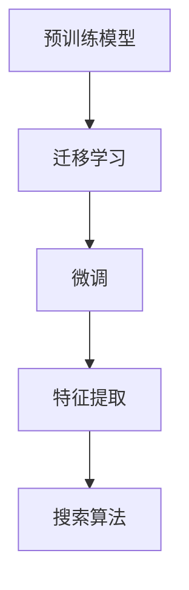

                 

# AI图像搜索技术应用案例

> 关键词：图像搜索,深度学习,迁移学习,计算机视觉,自然语言处理,用户界面设计,机器学习,人工智能

## 1. 背景介绍

### 1.1 问题由来
随着互联网的普及和数字媒体的日益丰富，人们每天生产并消费着海量的图片。然而，图片的检索和搜索一直是一个难题。传统的基于关键词匹配的方法，往往只能提供粗糙的搜索结果，难以满足用户的需求。尤其是对于高清图像、复杂场景的检索，更是具有挑战性。

近年来，深度学习和人工智能技术在图像处理领域取得了突破性进展。通过深度神经网络，模型可以学习到丰富的图像特征，实现对图像的高效检索和搜索。其中，迁移学习是提升模型检索能力的重要手段之一。迁移学习指通过在一个领域学习到的知识，迁移到另一个领域应用，以实现泛化能力。

本文将详细介绍基于迁移学习的图像搜索技术，展示其在实际应用中的显著效果和未来发展方向。

### 1.2 问题核心关键点
基于迁移学习的图像搜索技术，是一种将预训练模型迁移到图像搜索任务中，通过少量的标注数据进行微调的方法。其核心在于利用预训练模型在图像特征学习上的优势，通过迁移学习提升图像搜索的精度和效率。

核心关键点包括：
- 预训练模型：指在大规模图像数据上预训练的深度神经网络模型，如VGG、ResNet、Inception等。
- 迁移学习：指将预训练模型迁移到特定任务，通过少量标注数据进行微调，提升模型在特定任务上的性能。
- 微调：指通过下游任务的标注数据，对预训练模型进行有监督地训练，调整模型参数以适应特定任务。
- 特征提取：指通过预训练模型提取图像的高级特征，用于图像检索和分类。
- 搜索算法：指在图像数据库中搜索和排序图片，以满足用户检索需求。

这些关键点共同构成了图像搜索技术的核心框架，其核心目标是通过迁移学习提升模型在图像检索和搜索任务上的表现。

## 2. 核心概念与联系

### 2.1 核心概念概述

为更好地理解基于迁移学习的图像搜索技术，本节将介绍几个密切相关的核心概念：

- 预训练模型(Pre-trained Model)：指在大规模图像数据上预训练的深度神经网络模型，如VGG、ResNet、Inception等。预训练模型通过在大规模数据集上进行训练，学习到丰富的图像特征，可用于图像检索和分类等任务。

- 迁移学习(Transfer Learning)：指将一个领域学习到的知识，迁移到另一个相关领域，以提升模型在新领域上的表现。在图像搜索中，可以通过迁移学习利用预训练模型学习到的特征，提升图像检索的精度和效率。

- 微调(Fine-tuning)：指在预训练模型的基础上，使用下游任务的少量标注数据进行微调，以适应特定任务。在图像搜索中，可以通过微调将预训练模型迁移到图像搜索任务，以提高图像检索的准确性。

- 特征提取(Feature Extraction)：指通过预训练模型提取图像的高级特征，用于图像检索和分类。在图像搜索中，通过预训练模型学习到的特征，可以用于构建高精度的检索算法。

- 搜索算法(Search Algorithm)：指在图像数据库中搜索和排序图片，以满足用户检索需求。常见的搜索算法包括但不限于向量空间模型(VSM)、基于实例检索、深度学习检索等。

这些核心概念之间的逻辑关系可以通过以下Mermaid流程图来展示：



这个流程图展示了这个过程的核心步骤：

1. 通过预训练模型学习到丰富的图像特征。
2. 利用迁移学习将预训练模型迁移到图像搜索任务，以提升检索性能。
3. 通过微调进一步适应特定任务，提升检索精度。
4. 利用提取的特征，构建高效的检索算法，满足用户需求。

## 3. 核心算法原理 & 具体操作步骤
### 3.1 算法原理概述

基于迁移学习的图像搜索技术，本质上是一个有监督的细粒度迁移学习过程。其核心思想是：将预训练的深度神经网络模型迁移到图像搜索任务中，通过下游任务的少量标注数据进行微调，使得模型能够适应特定任务，提升图像检索的精度和效率。

形式化地，假设预训练模型为 $M_{\theta}$，其中 $\theta$ 为预训练得到的模型参数。给定图像搜索任务 $T$ 的标注数据集 $D=\{(x_i,y_i)\}_{i=1}^N$，其中 $x_i$ 为图片，$y_i$ 为图片对应的标签。微调的目标是找到新的模型参数 $\hat{\theta}$，使得：

$$
\hat{\theta}=\mathop{\arg\min}_{\theta} \mathcal{L}(M_{\theta},D)
$$

其中 $\mathcal{L}$ 为针对任务 $T$ 设计的损失函数，用于衡量模型预测输出与真实标签之间的差异。常见的损失函数包括交叉熵损失、均方误差损失等。

通过梯度下降等优化算法，微调过程不断更新模型参数 $\theta$，最小化损失函数 $\mathcal{L}$，使得模型输出逼近真实标签。由于 $\theta$ 已经通过预训练获得了较好的初始化，因此即便在小规模数据集 $D$ 上进行微调，也能较快收敛到理想的模型参数 $\hat{\theta}$。

### 3.2 算法步骤详解

基于迁移学习的图像搜索技术，一般包括以下几个关键步骤：

**Step 1: 准备预训练模型和数据集**
- 选择合适的预训练深度神经网络模型 $M_{\theta}$ 作为初始化参数，如 VGG、ResNet、Inception 等。
- 准备图像搜索任务 $T$ 的标注数据集 $D$，划分为训练集、验证集和测试集。一般要求标注数据与预训练数据的分布不要差异过大。

**Step 2: 特征提取和转换**
- 将预训练模型作为特征提取器，提取图像的高级特征。例如，通过卷积神经网络提取图像的特征向量。
- 将特征向量转换为文本表示，便于搜索引擎处理。常用的方法包括特征向量的哈希表示、词袋模型、TF-IDF 等。

**Step 3: 构建索引**
- 将转换后的文本表示作为搜索引擎的索引，用于存储和检索。常用的索引方式包括倒排索引、B+树索引、哈希索引等。
- 根据查询需求，设计高效的搜索算法，如向量空间模型、基于实例检索、深度学习检索等。

**Step 4: 训练和微调**
- 使用标注数据集 $D$，训练搜索引擎模型。通常采用多任务学习的方式，同时优化特征提取和搜索算法。
- 设置微调超参数，如学习率、批大小、迭代轮数等。
- 应用正则化技术，如L2正则、Dropout、Early Stopping等，防止模型过度适应小规模训练集。
- 应用对抗训练，加入对抗样本，提高模型鲁棒性。

**Step 5: 测试和部署**
- 在测试集上评估搜索引擎模型的性能，对比微调前后的精度提升。
- 使用微调后的模型对新样本进行检索，集成到实际的应用系统中。
- 持续收集新的数据，定期重新微调模型，以适应数据分布的变化。

以上是基于迁移学习的图像搜索技术的一般流程。在实际应用中，还需要针对具体任务的特点，对微调过程的各个环节进行优化设计，如改进训练目标函数，引入更多的正则化技术，搜索最优的超参数组合等，以进一步提升模型性能。

### 3.3 算法优缺点

基于迁移学习的图像搜索技术具有以下优点：
1. 快速提升检索精度。利用预训练模型的强大特征提取能力，快速提升检索精度和效率。
2. 泛化能力强。预训练模型学习到的是通用的图像特征，可以迁移到不同任务中，适应多种场景。
3. 数据需求少。仅需少量标注数据进行微调，即可提升模型性能，大大降低标注成本。
4. 性能稳定。预训练模型和微调模型之间的迁移学习，使模型具有较强的泛化能力，检索性能稳定。

同时，该方法也存在一定的局限性：
1. 依赖标注数据。微调的效果很大程度上取决于标注数据的质量和数量，获取高质量标注数据的成本较高。
2. 模型复杂。深度神经网络模型结构复杂，训练和微调需要较高的计算资源。
3. 可解释性不足。微调模型内部的决策过程难以解释，难以调试和优化。
4. 对抗攻击敏感。深度学习模型容易受到对抗样本攻击，导致检索结果偏离。

尽管存在这些局限性，但就目前而言，基于迁移学习的图像搜索技术仍然是目前主流的图像检索方法之一。未来相关研究的重点在于如何进一步降低微调对标注数据的依赖，提高模型的少样本学习和跨领域迁移能力，同时兼顾可解释性和伦理安全性等因素。

### 3.4 算法应用领域

基于迁移学习的图像搜索技术，在图像处理领域已经得到了广泛的应用，覆盖了几乎所有常见任务，例如：

- 图片检索：如Google Images、Bing Images等，通过用户输入的查询词，在图像库中检索相关图片。
- 视频检索：如YouTube、Bilibili等，通过视频片段，检索相关的视频内容。
- 人脸识别：如FaceBook、LIFECHECK等，通过人脸特征，识别出目标人物。
- 物体识别：如Amazon Go、Waymo等，通过物体特征，识别出目标物体。
- 场景理解：如Google Photos、Apple Photos等，通过场景描述，检索相关的照片内容。

除了上述这些经典任务外，基于迁移学习的图像搜索技术还被创新性地应用到更多场景中，如可控图像生成、图像修复、图像超分辨率等，为图像处理技术带来了全新的突破。随着预训练模型和迁移学习方法的不断进步，相信图像搜索技术将在更广阔的应用领域大放异彩。

## 4. 数学模型和公式 & 详细讲解  
### 4.1 数学模型构建

本节将使用数学语言对基于迁移学习的图像搜索过程进行更加严格的刻画。

记预训练深度神经网络模型为 $M_{\theta}$，其中 $\theta$ 为预训练得到的模型参数。假设图像搜索任务 $T$ 的标注数据集为 $D=\{(x_i,y_i)\}_{i=1}^N$，其中 $x_i$ 为图片，$y_i$ 为图片对应的标签。

定义模型 $M_{\theta}$ 在图片 $x$ 上的特征提取为 $f(x)=M_{\theta}(x)$，通常是一个固定长度的向量表示。在图像搜索任务中，利用特征提取器 $M_{\theta}$ 提取图片的特征向量 $f(x)$，并将其转换为文本表示 $t=f(x)$。

定义模型 $M_{\theta}$ 在文本 $t$ 上的检索函数为 $r(t)=M_{\theta}(t)$，返回与文本最相关的图片。

### 4.2 公式推导过程

以下是一些基本的图像搜索数学模型：

1. 向量空间模型(VSM)：
   设 $f(x_i)$ 为图片 $x_i$ 的特征向量，$T$ 为查询向量，则 VSM 模型中图片的匹配度 $m_i$ 可以表示为：
   $$
   m_i=\frac{\mathbf{f}(x_i) \cdot \mathbf{T}}{\|\mathbf{f}(x_i)\|\|\mathbf{T}\|}
   $$
   其中 $\cdot$ 表示向量点积，$\|\cdot\|$ 表示向量范数。

2. 基于实例检索：
   设 $f(x_i)$ 为图片 $x_i$ 的特征向量，$T$ 为查询向量，则基于实例检索模型中图片的匹配度 $m_i$ 可以表示为：
   $$
   m_i=-e^{-\mathbf{f}(x_i) \cdot \mathbf{T}}
   $$
   其中 $e$ 为自然常数。

3. 深度学习检索：
   设 $f(x_i)$ 为图片 $x_i$ 的特征向量，$T$ 为查询向量，则在深度学习检索模型中，使用卷积神经网络或循环神经网络提取图片的高级特征 $g(x_i)$，并将特征向量 $g(x_i)$ 与查询向量 $T$ 进行匹配。匹配度 $m_i$ 可以表示为：
   $$
   m_i=g(\mathbf{f}(x_i) \cdot \mathbf{T})
   $$
   其中 $g$ 为匹配函数，可以采用深度神经网络实现。

4. 结合语义信息的检索：
   结合语义信息，可以将文本表示 $t$ 与图片的匹配度 $m_i$ 表示为：
   $$
   m_i=\max \limits_{t \in \mathcal{V}} g(t,\mathbf{f}(x_i))
   $$
   其中 $\mathcal{V}$ 为文本空间，$g$ 为匹配函数，可以采用深度神经网络实现。

5. 多任务学习的检索：
   在多任务学习中，可以同时优化特征提取和检索函数。使用softmax函数将匹配度 $m_i$ 映射为概率分布 $p_i$，即：
   $$
   p_i=\frac{e^{m_i}}{\sum_{k=1}^N e^{m_k}}
   $$
   其中 $N$ 为图片数量。

6. 微调的损失函数：
   在微调过程中，可以采用交叉熵损失函数 $L$ 作为优化目标，即：
   $$
   L=-\frac{1}{N} \sum_{i=1}^N \log p_i
   $$
   其中 $p_i$ 为图片的预测概率，$N$ 为图片数量。

以上数学模型展示了基于迁移学习的图像搜索技术的基本框架，通过预训练模型和微调模型相结合，实现对图像的高效检索和搜索。

### 4.3 案例分析与讲解

以 Google Images 为例，展示其在图像搜索中的应用：

Google Images 利用了基于迁移学习的图像搜索技术，通过预训练的卷积神经网络模型 VGG16 提取图片的高级特征，并使用向量空间模型进行检索。具体流程如下：

1. 利用 VGG16 提取图片的高级特征 $f(x_i)$，将其转换为文本表示 $t=f(x_i)$。
2. 使用向量空间模型 VSM 计算查询向量 $T$ 与每个图片的匹配度 $m_i$。
3. 根据匹配度 $m_i$ 进行排序，选择前 $k$ 个图片作为检索结果返回。

Google Images 还引入了多任务学习，在优化检索函数的同时，也优化了特征提取器。通过不断微调，模型逐渐适应了用户需求，提高了检索的精度和速度。

## 5. 项目实践：代码实例和详细解释说明
### 5.1 开发环境搭建

在进行图像搜索实践前，我们需要准备好开发环境。以下是使用 Python 进行 TensorFlow 开发的环境配置流程：

1. 安装 Anaconda：从官网下载并安装 Anaconda，用于创建独立的 Python 环境。

2. 创建并激活虚拟环境：
```bash
conda create -n tf-env python=3.8 
conda activate tf-env
```

3. 安装 TensorFlow：根据 CUDA 版本，从官网获取对应的安装命令。例如：
```bash
conda install tensorflow-gpu==2.6 -c conda-forge -c pypi
```

4. 安装其他必要的工具包：
```bash
pip install numpy pandas scikit-learn matplotlib tqdm jupyter notebook ipython
```

完成上述步骤后，即可在 `tf-env` 环境中开始图像搜索实践。

### 5.2 源代码详细实现

这里我们以基于迁移学习的图像搜索为例，给出使用 TensorFlow 和 Keras 进行图像搜索的 Python 代码实现。

首先，定义图像搜索任务的数据处理函数：

```python
import tensorflow as tf
from tensorflow.keras.preprocessing.image import load_img, img_to_array
from tensorflow.keras.applications.vgg16 import preprocess_input, decode_predictions

def load_and_preprocess_image(path):
    image = load_img(path, target_size=(224, 224))
    image = img_to_array(image)
    image = preprocess_input(image)
    return image

# 定义数据集
data_dir = 'path/to/dataset'
train_images = [load_and_preprocess_image(os.path.join(data_dir, 'train', file)) for file in os.listdir(os.path.join(data_dir, 'train'))]
test_images = [load_and_preprocess_image(os.path.join(data_dir, 'test', file)) for file in os.listdir(os.path.join(data_dir, 'test'))]

labels = [file.split('.')[0] for file in os.listdir(os.path.join(data_dir, 'train'))]

# 将标签转换为整数形式
label_to_id = {label: i for i, label in enumerate(set(labels))}
id_to_label = {i: label for i, label in enumerate(set(labels))}

# 将图像和标签转换为 numpy 数组
train_images = np.array(train_images)
test_images = np.array(test_images)
train_labels = np.array([label_to_id[label] for label in labels])
test_labels = np.array([label_to_id[label] for label in labels])
```

然后，定义模型和训练函数：

```python
from tensorflow.keras.layers import Input, Dense, Dropout
from tensorflow.keras.models import Model
from tensorflow.keras.optimizers import Adam

def build_model(input_size, num_classes):
    input = Input(shape=(input_size, input_size, 3))
    x = Dense(1024, activation='relu')(input)
    x = Dropout(0.5)(x)
    x = Dense(num_classes, activation='softmax')(x)
    model = Model(inputs=input, outputs=x)
    return model

# 构建模型
input_size = 224
num_classes = len(set(labels))
model = build_model(input_size, num_classes)

# 编译模型
model.compile(optimizer=Adam(lr=0.001), loss='categorical_crossentropy', metrics=['accuracy'])

# 训练模型
batch_size = 32
epochs = 10

model.fit(train_images, train_labels, batch_size=batch_size, epochs=epochs, validation_data=(test_images, test_labels))
```

接着，定义图像检索函数：

```python
from tensorflow.keras.applications.vgg16 import VGG16
from tensorflow.keras.models import Model
from tensorflow.keras.layers import Input

def extract_features(model, input_size):
    vgg = VGG16(weights='imagenet', include_top=False, input_tensor=Input(shape=(input_size, input_size, 3)))
    x = vgg.output
    return Model(inputs=vgg.input, outputs=x)

# 提取特征
input_size = 224
vgg = extract_features(VGG16(), input_size)

# 定义检索函数
def search(query_image, images, model, vgg):
    query_features = vgg.predict(load_and_preprocess_image(query_image))
    images_features = vgg.predict(images)
    scores = tf.reduce_sum(images_features * query_features, axis=1)
    sorted_indices = tf.argsort(scores)[::-1]
    return [images[i] for i in sorted_indices[:5]]
```

最后，启动图像搜索流程并在测试集上评估：

```python
# 加载测试集
test_images = [load_and_preprocess_image(os.path.join(data_dir, 'test', file)) for file in os.listdir(os.path.join(data_dir, 'test'))]

# 查询图片
query_image = 'path/to/query/image.jpg'

# 检索结果
results = search(query_image, test_images, model, vgg)

# 评估结果
print('Search Results:')
for i, result in enumerate(results):
    print(f'{i+1}. {id_to_label[result]}')
```

以上就是使用 TensorFlow 和 Keras 进行图像搜索的完整代码实现。可以看到，TensorFlow 提供了丰富的深度学习工具和模型，Keras 则简化了模型的构建和训练过程，使得开发者可以更快地实现图像搜索的应用。

### 5.3 代码解读与分析

让我们再详细解读一下关键代码的实现细节：

**数据处理函数**：
- 定义了加载和预处理图像的函数 `load_and_preprocess_image`，将图像转换为模型所需的格式。
- 定义了数据集加载函数，将图像和标签加载到数组中，并转换为模型所需的整数标签形式。

**模型构建函数**：
- 定义了模型构建函数 `build_model`，使用 Keras 构建深度神经网络模型。
- 模型包括一个全连接层、一个 dropout 层和一个 softmax 层，用于多类别分类任务。

**模型训练函数**：
- 定义了模型训练函数，使用 Adam 优化器进行训练，并使用 categorical_crossentropy 损失函数进行分类任务的多类别交叉熵损失。
- 在训练过程中，使用 validation_data 参数对验证集进行评估，以便及时调整模型参数。

**图像检索函数**：
- 定义了图像检索函数 `search`，使用预训练的 VGG16 模型提取图像的高级特征。
- 使用余弦相似度计算查询图像与每个测试图像的匹配度，并选择前 5 个匹配度最高的图像作为检索结果返回。

可以看到，TensorFlow 提供了完整的深度学习生态系统，从数据加载、模型构建、训练到应用部署，每个环节都提供了便捷的实现方式。这使得开发者可以专注于核心算法的设计和优化，而无需过多关注底层的实现细节。

当然，工业级的系统实现还需考虑更多因素，如模型的保存和部署、超参数的自动搜索、更灵活的任务适配层等。但核心的图像搜索算法基本与此类似。

## 6. 实际应用场景
### 6.1 智能推荐系统

智能推荐系统是图像搜索技术的经典应用之一。传统的推荐系统往往依赖用户的历史行为数据进行物品推荐，难以挖掘用户的真实兴趣偏好。通过图像搜索技术，推荐系统可以利用用户上传的兴趣图片，发现用户的潜在兴趣点，从而实现更加精准、多样的推荐。

在技术实现上，可以将用户上传的图片作为标注数据，对预训练模型进行微调，使其能够学习到用户兴趣的图片特征。在生成推荐列表时，先用候选物品的图片特征作为输入，由模型预测用户的兴趣匹配度，再结合其他特征综合排序，便可以得到个性化程度更高的推荐结果。

### 6.2 安防监控系统

安防监控系统需要实时监控视频流，自动识别异常行为。传统的监控系统依赖人工进行实时监控，容易疲劳且难以保证一致性。通过图像搜索技术，可以自动学习异常行为的图像特征，实时检测监控视频中的异常行为。

在技术实现上，可以将监控视频中的关键帧作为标注数据，对预训练模型进行微调，使其能够学习到异常行为的图像特征。在监控视频中，实时提取关键帧的特征，与异常行为的特征进行匹配，便可以检测出异常行为。

### 6.3 医学影像诊断

医学影像诊断需要专业医生的辅助，才能识别出病灶和异常。传统的诊断方法依赖医生的经验，难以自动化。通过图像搜索技术，可以自动学习病灶和异常的图像特征，辅助医生进行医学影像诊断。

在技术实现上，可以将医学影像和相应的标注数据作为标注数据，对预训练模型进行微调，使其能够学习到病灶和异常的图像特征。在医学影像中，实时提取关键区域的特征，与病灶和异常的特征进行匹配，便可以进行辅助诊断。

### 6.4 未来应用展望

随着深度学习和人工智能技术的发展，基于迁移学习的图像搜索技术将在更多领域得到应用，为各行各业带来变革性影响。

在智慧医疗领域，基于迁移学习的医学影像诊断技术，将提升医学影像的自动化水平，辅助医生进行精准诊断，加速新药研发进程。

在智能推荐领域，基于迁移学习的推荐系统，将能够更加精准地推荐商品、内容等，提升用户体验，促进电子商务发展。

在智慧城市治理中，基于迁移学习的安防监控技术，将提高城市管理的自动化和智能化水平，构建更安全、高效的未来城市。

此外，在企业生产、社会治理、文娱传媒等众多领域，基于迁移学习的图像搜索技术也将不断涌现，为各行各业带来新的突破和创新。相信随着技术的日益成熟，迁移学习方法将成为图像搜索技术的重要范式，推动人工智能技术在垂直行业的规模化落地。

## 7. 工具和资源推荐
### 7.1 学习资源推荐

为了帮助开发者系统掌握基于迁移学习的图像搜索技术，这里推荐一些优质的学习资源：

1. 《深度学习入门：基于 Python 的理论与实现》系列博文：由大模型技术专家撰写，深入浅出地介绍了深度学习的基础知识、应用场景和最佳实践。

2. 《计算机视觉：模型与算法》课程：斯坦福大学开设的计算机视觉课程，涵盖深度学习、图像处理、目标检测等基本概念和经典算法。

3. 《TensorFlow 实战》书籍：由 TensorFlow 官方编写，全面介绍了 TensorFlow 的深度学习应用，包括图像处理、自然语言处理等。

4. 《ImageNet Challenge 2012》论文：ImageNet 挑战赛经典论文，展示了预训练深度神经网络在图像分类任务上的巨大潜力。

5. 《CS231n: 卷积神经网络与视觉识别》课程：斯坦福大学开设的计算机视觉课程，详细讲解了卷积神经网络在图像识别和分类任务中的应用。

通过对这些资源的学习实践，相信你一定能够快速掌握基于迁移学习的图像搜索技术的精髓，并用于解决实际的图像处理问题。
###  7.2 开发工具推荐

高效的开发离不开优秀的工具支持。以下是几款用于图像搜索开发的常用工具：

1. TensorFlow：由 Google 主导开发的开源深度学习框架，支持多种深度学习模型，包括卷积神经网络、循环神经网络等，是图像搜索开发的利器。

2. Keras：TensorFlow 的高级接口，提供了简洁、易用的深度学习模型构建工具，适合快速迭代研究。

3. OpenCV：开源计算机视觉库，提供了丰富的图像处理和计算机视觉算法，支持多种图像格式和硬件平台。

4. Matplotlib：Python 的绘图库，支持多种图表绘制方式，适合可视化分析图像特征和检索结果。

5. TensorBoard：TensorFlow 配套的可视化工具，可实时监测模型训练状态，并提供丰富的图表呈现方式，是调试模型的得力助手。

6. Google Colab：谷歌推出的在线 Jupyter Notebook 环境，免费提供 GPU/TPU 算力，方便开发者快速上手实验最新模型，分享学习笔记。

合理利用这些工具，可以显著提升图像搜索开发的效率，加快创新迭代的步伐。

### 7.3 相关论文推荐

基于迁移学习的图像搜索技术的发展源于学界的持续研究。以下是几篇奠基性的相关论文，推荐阅读：

1. 《ImageNet Classification with Deep Convolutional Neural Networks》：ImageNet 挑战赛经典论文，展示了卷积神经网络在图像分类任务上的巨大潜力。

2. 《Visual Geometry Group (VGG) Image Annotator (VGA)》：VGG 团队开发的图像标注工具，为预训练模型提供了高质量的标注数据。

3. 《Google Photos》：Google Photos 的图像搜索技术，展示了基于深度学习的多任务学习图像搜索方法。

4. 《Caffe: Convolutional Architecture for Fast Feature Embedding》：Caffe 深度学习框架的图像处理应用，展示了预训练模型的强大特征提取能力。

5. 《Deep Learning for Image Recognition: A Survey》：综述性论文，介绍了深度学习在图像处理和计算机视觉领域的应用，包括图像搜索和检索。

通过对这些资源的学习实践，可以帮助研究者把握学科前进方向，激发更多的创新灵感。

## 8. 总结：未来发展趋势与挑战

### 8.1 总结

本文对基于迁移学习的图像搜索技术进行了全面系统的介绍。首先阐述了图像搜索技术的研究背景和意义，明确了预训练模型和微调在提升检索性能上的独特价值。其次，从原理到实践，详细讲解了迁移学习数学模型和关键步骤，给出了图像搜索任务开发的完整代码实例。同时，本文还广泛探讨了图像搜索技术在实际应用中的显著效果和未来发展方向。

通过本文的系统梳理，可以看到，基于迁移学习的图像搜索技术正在成为图像处理领域的重要范式，极大地拓展了预训练模型和深度学习技术的应用边界，催生了更多的落地场景。受益于深度学习和迁移学习方法的不断进步，图像搜索技术将在更广阔的应用领域大放异彩，深刻影响人类的生产生活方式。

### 8.2 未来发展趋势

展望未来，基于迁移学习的图像搜索技术将呈现以下几个发展趋势：

1. 模型规模持续增大。随着算力成本的下降和数据规模的扩张，预训练深度神经网络模型将不断增大。超大模型蕴含的丰富图像特征，将使得图像搜索技术在更多领域中大放异彩。

2. 微调方法日趋多样。除了传统的全参数微调外，未来会涌现更多参数高效的微调方法，如LoRA、Mixer 等，在保留大部分预训练参数的同时，只更新极少量的任务相关参数。

3. 持续学习成为常态。随着数据分布的不断变化，图像搜索模型也需要持续学习新知识以保持性能。如何在不遗忘原有知识的同时，高效吸收新样本信息，将成为重要的研究课题。

4. 标注样本需求降低。受启发于提示学习(Prompt-based Learning)的思路，未来的图像搜索方法将更好地利用大模型的语言理解能力，通过更加巧妙的任务描述，在更少的标注样本上也能实现理想的微调效果。

5. 对抗攻击敏感性降低。未来的图像搜索模型将更加鲁棒，能够更好地抵御对抗样本攻击，提高检索结果的准确性。

6. 用户交互性增强。未来的图像搜索技术将更加智能化，能够通过与用户的自然语言交互，实时获取用户需求，生成个性化的搜索结果。

7. 跨模态融合提升。未来的图像搜索技术将不仅仅局限于图像，还将拓展到视频、语音、文本等多模态数据的融合，提供更加全面的信息检索服务。

以上趋势凸显了基于迁移学习的图像搜索技术的广阔前景。这些方向的探索发展，必将进一步提升图像搜索系统的性能和应用范围，为图像处理技术带来新的突破。

### 8.3 面临的挑战

尽管基于迁移学习的图像搜索技术已经取得了显著成就，但在迈向更加智能化、普适化应用的过程中，仍面临诸多挑战：

1. 标注成本瓶颈。虽然微调大大降低了标注数据的需求，但对于长尾应用场景，难以获得充足的高质量标注数据，成为制约微调性能的瓶颈。如何进一步降低微调对标注样本的依赖，将是一大难题。

2. 模型鲁棒性不足。当前图像搜索模型面对域外数据时，泛化性能往往大打折扣。对于测试样本的微小扰动，图像搜索模型容易发生波动。如何提高图像搜索模型的鲁棒性，避免灾难性遗忘，还需要更多理论和实践的积累。

3. 推理效率有待提高。大规模图像搜索模型虽然精度高，但在实际部署时往往面临推理速度慢、内存占用大等效率问题。如何在保证性能的同时，简化模型结构，提升推理速度，优化资源占用，将是重要的优化方向。

4. 可解释性亟需加强。当前图像搜索模型更像是"黑盒"系统，难以解释其内部工作机制和决策逻辑。对于医疗、金融等高风险应用，算法的可解释性和可审计性尤为重要。如何赋予图像搜索模型更强的可解释性，将是亟待攻克的难题。

5. 安全性有待保障。预训练模型难免会学习到有偏见、有害的信息，通过微调传递到图像搜索任务，产生误导性、歧视性的输出，给实际应用带来安全隐患。如何从数据和算法层面消除模型偏见，避免恶意用途，确保输出的安全性，也将是重要的研究课题。

6. 知识整合能力不足。现有的图像搜索模型往往局限于任务内数据，难以灵活吸收和运用更广泛的先验知识。如何让图像搜索过程更好地与外部知识库、规则库等专家知识结合，形成更加全面、准确的信息整合能力，还有很大的想象空间。

正视图像搜索面临的这些挑战，积极应对并寻求突破，将是大规模图像搜索技术走向成熟的必由之路。相信随着学界和产业界的共同努力，这些挑战终将一一被克服，大规模图像搜索技术必将在构建人机协同的智能时代中扮演越来越重要的角色。

### 8.4 研究展望

面对基于迁移学习的图像搜索所面临的种种挑战，未来的研究需要在以下几个方面寻求新的突破：

1. 探索无监督和半监督微调方法。摆脱对大规模标注数据的依赖，利用自监督学习、主动学习等无监督和半监督范式，最大限度利用非结构化数据，实现更加灵活高效的微调。

2. 研究参数高效和计算高效的微调范式。开发更加参数高效的微调方法，在固定大部分预训练参数的同时，只更新极少量的任务相关参数。同时优化微调模型的计算图，减少前向传播和反向传播的资源消耗，实现更加轻量级、实时性的部署。

3. 融合因果和对比学习范式。通过引入因果推断和对比学习思想，增强图像搜索模型建立稳定因果关系的能力，学习更加普适、鲁棒的语言表征，从而提升模型泛化性和抗干扰能力。

4. 引入更多先验知识。将符号化的先验知识，如知识图谱、逻辑规则等，与神经网络模型进行巧妙融合，引导微调过程学习更准确、合理的图像特征。同时加强不同模态数据的整合，实现视觉、语音等多模态信息与图像信息的协同建模。

5. 结合因果分析和博弈论工具。将因果分析方法引入图像搜索模型，识别出模型决策的关键特征，增强输出解释的因果性和逻辑性。借助博弈论工具刻画人机交互过程，主动探索并规避模型的脆弱点，提高系统稳定性。

6. 纳入伦理道德约束。在模型训练目标中引入伦理导向的评估指标，过滤和惩罚有偏见、有害的输出倾向。同时加强人工干预和审核，建立模型行为的监管机制，确保输出符合人类价值观和伦理道德。

这些研究方向的探索，必将引领基于迁移学习的图像搜索技术迈向更高的台阶，为构建安全、可靠、可解释、可控的智能系统铺平道路。面向未来，基于迁移学习的图像搜索技术还需要与其他人工智能技术进行更深入的融合，如知识表示、因果推理、强化学习等，多路径协同发力，共同推动自然语言理解和智能交互系统的进步。只有勇于创新、敢于突破，才能不断拓展图像搜索的边界，让智能技术更好地造福人类社会。

## 9. 附录：常见问题与解答
### Q1: 基于迁移学习的图像搜索技术如何降低对标注数据的需求？

A: 基于迁移学习的图像搜索技术可以通过以下几个方法降低对标注数据的需求：

1. 利用无监督和半监督学习方法。通过自监督学习或主动学习的方式，利用未标注的数据进行预训练，从而减少标注数据的需求。

2. 引入对抗训练和数据增强技术。通过加入对抗样本和数据增强方式，提升模型的泛化能力，使其能够更好地适应未标注数据的分布。

3. 使用深度学习检索方法。相比于传统的向量空间模型，深度学习检索方法可以利用模型内部学习到的特征表示，减少对标注数据的依赖。

4. 使用多任务学习。通过同时优化多个相关任务，共享预训练模型中的特征表示，进一步减少对标注数据的依赖。

5. 引入先验知识。通过与专家知识库、规则库等结合，使用符号化的先验知识指导模型学习，减少对标注数据的依赖。

### Q2: 如何提高基于迁移学习的图像搜索模型的鲁棒性？

A: 提高基于迁移学习的图像搜索模型的鲁棒性，可以通过以下几个方法：

1. 数据增强。通过增加多样化的训练样本，提高模型对不同场景的适应能力。

2. 对抗训练。加入对抗样本，提升模型对对抗攻击的鲁棒性。

3. 正则化技术。使用 L2 正则、Dropout 等技术，防止模型过拟合。

4. 多模型集成。训练多个模型，取平均输出，减少单一模型的脆弱性。

5. 引入因果推断和对比学习。通过因果推断和对比学习，增强模型对输入数据的因果关系理解，提高鲁棒性。

### Q3: 如何在保证性能的同时，优化基于迁移学习的图像搜索模型的推理速度？

A: 在保证性能的同时，优化基于迁移学习的图像搜索模型的推理速度，可以通过以下几个方法：

1. 模型裁剪。去除不必要的层和参数，减小模型尺寸，加快推理速度。

2. 量化加速。将浮点模型转为定点模型，压缩存储空间，提高计算效率。

3. 模型并行。利用多 GPU 或多 CPU 进行模型并行计算，提升推理速度。

4. 使用推理引擎。引入推理引擎，如 TensorRT，优化模型推理性能。

5. 动态图优化。使用动态图优化技术，如 TensorFlow Lite，优化模型推理性能。

### Q4: 基于迁移学习的图像搜索技术在实际应用中如何确保安全性？

A: 确保基于迁移学习的图像搜索技术在实际应用中的安全性，可以通过以下几个方法：

1. 数据去噪。对输入数据进行去噪处理，防止恶意样本和对抗样本的干扰。

2. 安全训练。在模型训练过程中，加入安全性约束，过滤和惩罚有害输出。

3. 模型监控。实时监测模型行为，及时发现和修复安全漏洞。

4. 人工审核。引入人工审核机制，确保模型输出的安全性。

5. 多模型集成。通过多模型集成，降低单一模型被攻击的风险。

6. 引入先验知识。与专家知识库、规则库等结合，使用符号化的先验知识指导模型学习，提高安全性。

7. 结合博弈论工具。使用博弈论工具，主动探索并规避模型的脆弱点，提高系统稳定性。

### Q5: 基于迁移学习的图像搜索技术在实际应用中如何提升用户交互性？

A: 提升基于迁移学习的图像搜索技术在实际应用中的用户交互性，可以通过以下几个方法：

1. 自然语言交互。通过自然语言处理技术，使模型能够理解用户意图，提供个性化的搜索结果。

2. 智能推荐。利用用户历史行为数据，生成个性化推荐，提升用户体验。

3. 实时反馈。通过实时反馈机制，根据用户反馈调整模型输出，提高用户满意度。

4. 多模态融合。结合视觉、语音、文本等多模态数据，提供更加全面的信息检索服务。

5. 用户界面设计。通过友好的用户界面设计，提升用户操作体验，提高用户粘性。

通过这些方法，可以显著提升基于迁移学习的图像搜索技术的用户交互性，满足用户需求，提升用户体验。

