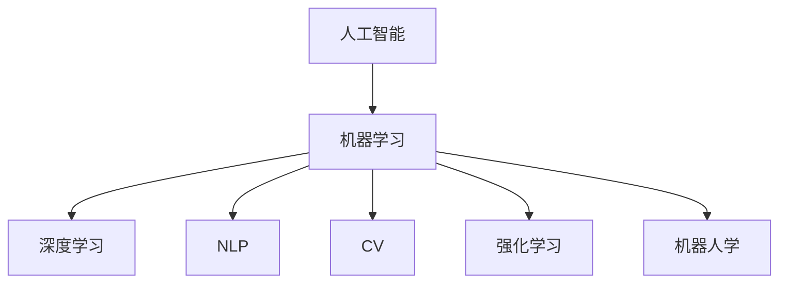

                 

# AI在各领域中的实际应用

## 1. 背景介绍

### 1.1 问题由来

人工智能(AI)技术经过数十年的发展，已经渗透到几乎所有的行业领域。从早期的专家系统，到如今深度学习、自然语言处理(NLP)、计算机视觉(CV)等前沿技术的广泛应用，AI正在深刻改变着人们的生活方式和社会结构。AI的应用不仅限于科技产业，还涉及医疗、金融、教育、制造业等多个领域，成为推动社会进步的重要力量。

本文将从多个角度深入探讨AI在各领域中的实际应用，包括核心概念、算法原理、具体操作步骤、实际案例等，帮助读者全面理解AI技术如何在实际场景中发挥作用。

## 2. 核心概念与联系

### 2.1 核心概念概述

为更好地理解AI在各领域中的实际应用，本节将介绍几个关键的概念：

- 人工智能(Artificial Intelligence, AI)：通过模拟、延伸和扩展人的智能能力，实现机器对复杂环境和任务的自主感知、决策和执行。
- 机器学习(Machine Learning, ML)：让机器通过数据学习和改进性能的算法，是AI实现的关键技术之一。
- 深度学习(Deep Learning, DL)：一种特殊类型的机器学习，通过多层神经网络结构处理和分析数据，具有较强的自适应和泛化能力。
- 自然语言处理(Natural Language Processing, NLP)：研究如何让计算机理解和处理自然语言，包括语言模型、文本分类、情感分析等任务。
- 计算机视觉(Computer Vision, CV)：研究如何让计算机像人一样"看"和"理解"图像和视频数据，包括图像分类、目标检测、语义分割等任务。
- 强化学习(Reinforcement Learning, RL)：让智能体通过与环境交互，从奖励和惩罚中学习最优决策策略，用于游戏、机器人控制等领域。
- 机器人学(Robotics)：结合计算机视觉、运动控制等技术，实现机器人的自主移动、操作和交互。

这些核心概念构成了AI技术的基石，推动着AI技术在不同领域的应用。

### 2.2 核心概念原理和架构的 Mermaid 流程图(Mermaid 流程节点中不要有括号、逗号等特殊字符)



这个流程图展示了AI领域核心概念之间的联系：人工智能通过机器学习、深度学习、自然语言处理、计算机视觉、强化学习和机器人学等技术实现，各技术领域相互补充，共同推进AI技术的进步。

## 3. 核心算法原理 & 具体操作步骤

### 3.1 算法原理概述

AI技术的实际应用基于一系列复杂的算法原理和操作步骤。以下将详细介绍其中的核心算法原理和具体操作步骤：

- 机器学习算法：如线性回归、决策树、随机森林、支持向量机(SVM)、神经网络等。
- 深度学习算法：如卷积神经网络(CNN)、循环神经网络(RNN)、长短时记忆网络(LSTM)、变分自编码器(VAE)等。
- 自然语言处理算法：如词嵌入、语言模型、词向量、命名实体识别(NER)、信息检索、机器翻译等。
- 计算机视觉算法：如特征提取、目标检测、语义分割、图像分类等。
- 强化学习算法：如Q-learning、深度Q网络(DQN)、策略梯度(SPG)、优势演员-批评家(AC)等。

### 3.2 算法步骤详解

以下将详细介绍AI在各个领域中的核心操作步骤：

#### 3.2.1 医疗领域

在医疗领域，AI技术主要应用于疾病诊断、影像分析、患者管理等方面。具体操作步骤如下：

1. 数据收集：收集大量病历、影像、实验室数据等，构建医疗大数据集。
2. 数据预处理：清洗、标准化数据，去除噪声和异常值。
3. 模型选择：选择合适的机器学习或深度学习模型，如卷积神经网络(CNN)用于影像分析，长短期记忆网络(LSTM)用于序列数据分析。
4. 模型训练：使用标注数据训练模型，调整模型超参数，优化模型性能。
5. 模型评估：在测试集上评估模型性能，对比不同模型的效果。
6. 模型部署：将训练好的模型部署到生产环境中，进行实际应用。
7. 持续优化：根据实时反馈数据，定期更新模型，提高模型准确性和鲁棒性。

#### 3.2.2 金融领域

在金融领域，AI技术主要应用于风险管理、投资决策、客户服务等方面。具体操作步骤如下：

1. 数据收集：收集金融市场数据、交易数据、客户行为数据等，构建金融大数据集。
2. 数据预处理：清洗、标准化数据，去除噪声和异常值。
3. 模型选择：选择合适的机器学习或深度学习模型，如随机森林用于风险管理，卷积神经网络(CNN)用于图像识别。
4. 模型训练：使用标注数据训练模型，调整模型超参数，优化模型性能。
5. 模型评估：在测试集上评估模型性能，对比不同模型的效果。
6. 模型部署：将训练好的模型部署到生产环境中，进行实际应用。
7. 持续优化：根据实时反馈数据，定期更新模型，提高模型准确性和鲁棒性。

#### 3.2.3 教育领域

在教育领域，AI技术主要应用于个性化学习、智能辅导、课程推荐等方面。具体操作步骤如下：

1. 数据收集：收集学生的学习数据、行为数据、评估数据等，构建教育大数据集。
2. 数据预处理：清洗、标准化数据，去除噪声和异常值。
3. 模型选择：选择合适的机器学习或深度学习模型，如长短期记忆网络(LSTM)用于预测学生表现，协同过滤算法用于推荐课程。
4. 模型训练：使用标注数据训练模型，调整模型超参数，优化模型性能。
5. 模型评估：在测试集上评估模型性能，对比不同模型的效果。
6. 模型部署：将训练好的模型部署到教育平台中，进行实际应用。
7. 持续优化：根据实时反馈数据，定期更新模型，提高模型准确性和鲁棒性。

#### 3.2.4 零售领域

在零售领域，AI技术主要应用于客户分析、库存管理、推荐系统等方面。具体操作步骤如下：

1. 数据收集：收集客户交易数据、库存数据、促销活动数据等，构建零售大数据集。
2. 数据预处理：清洗、标准化数据，去除噪声和异常值。
3. 模型选择：选择合适的机器学习或深度学习模型，如决策树用于客户分析，协同过滤算法用于推荐系统。
4. 模型训练：使用标注数据训练模型，调整模型超参数，优化模型性能。
5. 模型评估：在测试集上评估模型性能，对比不同模型的效果。
6. 模型部署：将训练好的模型部署到零售平台中，进行实际应用。
7. 持续优化：根据实时反馈数据，定期更新模型，提高模型准确性和鲁棒性。

## 4. 数学模型和公式 & 详细讲解 & 举例说明

### 4.1 数学模型构建

AI技术的数学模型构建通常包括以下几个关键步骤：

1. 数据集构建：收集和预处理数据，构建训练集和测试集。
2. 模型选择：选择合适的算法和模型结构。
3. 损失函数定义：定义模型输出与真实标签之间的差异，如均方误差、交叉熵等。
4. 优化算法选择：选择合适的优化算法，如随机梯度下降(SGD)、Adam等。
5. 模型训练：使用优化算法最小化损失函数，训练模型参数。
6. 模型评估：在测试集上评估模型性能，计算准确率、召回率、F1分数等指标。
7. 模型部署：将训练好的模型部署到实际应用中，进行推理和预测。

### 4.2 公式推导过程

以下将以卷积神经网络(CNN)为例，推导其基本数学模型和公式：

#### CNN的基本结构

卷积神经网络(CNN)是深度学习中广泛应用的一种模型。其基本结构包括卷积层、池化层、全连接层等。以下是CNN的基本数学模型：

$$
\begin{aligned}
&\text{Convolutional Layer}\\
&h^{l+1}_{x,y}=\sum_{x'=-r\ldots r,y'=-r\ldots r}\omega^{l}_{i,j}x_{x'+i,y'+j}+b^{l}_{i,j}\\
&\text{Pooling Layer}\\
&h^{l+1}_{x,y}=\max(h^{l}_{x,y}, h^{l}_{x+1,y}, h^{l}_{x-1,y}, h^{l}_{x,y+1}, h^{l}_{x,y-1})\\
&\text{Fully Connected Layer}\\
&\text{Softmax Layer}
\end{aligned}
$$

其中，$h^{l+1}_{x,y}$表示第$l+1$层的输出，$\omega^{l}_{i,j}$表示第$l$层卷积核的权重，$b^{l}_{i,j}$表示第$l$层卷积核的偏置项，$x_{x'+i,y'+j}$表示第$l$层的输入。

#### CNN的损失函数

在CNN中，常用的损失函数包括均方误差(MSE)和交叉熵(Cross-Entropy)。

均方误差损失函数：

$$
\text{MSE} = \frac{1}{N}\sum_{i=1}^{N}(h_{i}-\hat{h_{i}})^{2}
$$

交叉熵损失函数：

$$
\text{CE} = -\frac{1}{N}\sum_{i=1}^{N}\sum_{j=1}^{C}y_{i,j}\log(h_{i,j})
$$

其中，$N$表示样本数，$C$表示类别数，$h_{i,j}$表示模型对第$i$个样本的第$j$个类别的预测概率，$y_{i,j}$表示第$i$个样本的第$j$个类别的真实标签。

#### CNN的优化算法

在CNN中，常用的优化算法包括随机梯度下降(SGD)、Adam、Adagrad等。

随机梯度下降算法：

$$
\theta_{i+1} = \theta_{i} - \eta\nabla_{\theta}J(\theta)
$$

Adam优化算法：

$$
\begin{aligned}
&m_{t}=\beta_{1}m_{t-1}+(1-\beta_{1})\nabla_{\theta}J(\theta)\\
&v_{t}=\beta_{2}v_{t-1}+(1-\beta_{2})(\nabla_{\theta}J(\theta))^{2}\\
&\theta_{t+1} = \theta_{t} - \frac{\eta}{(1-\beta_{1}^{t})\sqrt{v_{t}+\epsilon}}m_{t}
\end{aligned}
$$

其中，$\theta$表示模型参数，$\nabla_{\theta}J(\theta)$表示损失函数对模型参数的梯度，$m_{t}$和$v_{t}$表示梯度和平方梯度的指数加权平均，$\beta_{1}$和$\beta_{2}$表示指数加权平均的超参数，$\eta$表示学习率，$\epsilon$表示防止除数为零的扰动项。

### 4.3 案例分析与讲解

#### 案例一：医疗影像分类

在医疗影像分类中，使用卷积神经网络(CNN)进行图像分类，常见的网络结构包括AlexNet、VGGNet、ResNet等。

例如，使用AlexNet对医疗影像进行分类，步骤如下：

1. 数据预处理：将医疗影像标准化、归一化、裁剪等预处理。
2. 模型选择：选择AlexNet网络结构。
3. 模型训练：在医疗影像数据集上进行训练，调整超参数。
4. 模型评估：在测试集上评估模型性能，计算准确率、召回率等指标。
5. 模型部署：将训练好的模型部署到医疗影像分类系统中，进行实际应用。

#### 案例二：金融预测

在金融预测中，使用长短期记忆网络(LSTM)进行时间序列预测，常见的网络结构包括LSTM、GRU等。

例如，使用LSTM对股票价格进行预测，步骤如下：

1. 数据预处理：将股票价格数据标准化、归一化、分窗等预处理。
2. 模型选择：选择LSTM网络结构。
3. 模型训练：在股票价格数据集上进行训练，调整超参数。
4. 模型评估：在测试集上评估模型性能，计算MAE、RMSE等指标。
5. 模型部署：将训练好的模型部署到金融预测系统中，进行实际应用。

#### 案例三：教育推荐

在教育推荐中，使用协同过滤算法进行课程推荐，常见的方法包括基于用户的协同过滤、基于项目的协同过滤等。

例如，使用基于用户的协同过滤算法进行课程推荐，步骤如下：

1. 数据预处理：将学生成绩、课程评分数据标准化、归一化等预处理。
2. 模型选择：选择基于用户的协同过滤算法。
3. 模型训练：在学生成绩、课程评分数据集上进行训练，调整超参数。
4. 模型评估：在测试集上评估模型性能，计算推荐准确率等指标。
5. 模型部署：将训练好的模型部署到教育推荐系统中，进行实际应用。

## 5. 项目实践：代码实例和详细解释说明

### 5.1 开发环境搭建

在进行AI项目实践前，我们需要准备好开发环境。以下是使用Python进行TensorFlow开发的环境配置流程：

1. 安装Anaconda：从官网下载并安装Anaconda，用于创建独立的Python环境。

2. 创建并激活虚拟环境：
```bash
conda create -n tensorflow-env python=3.8 
conda activate tensorflow-env
```

3. 安装TensorFlow：根据CUDA版本，从官网获取对应的安装命令。例如：
```bash
conda install tensorflow=2.5 -c conda-forge
```

4. 安装各类工具包：
```bash
pip install numpy pandas scikit-learn matplotlib tqdm jupyter notebook ipython
```

完成上述步骤后，即可在`tensorflow-env`环境中开始AI项目实践。

### 5.2 源代码详细实现

这里我们以基于TensorFlow实现的图像分类项目为例，给出完整的代码实现。

首先，定义图像数据处理函数：

```python
import tensorflow as tf
from tensorflow.keras.preprocessing.image import ImageDataGenerator

def data_generator(train_data_path, test_data_path, batch_size=32):
    train_datagen = ImageDataGenerator(
        rescale=1./255,
        shear_range=0.2,
        zoom_range=0.2,
        horizontal_flip=True
    )

    train_generator = train_datagen.flow_from_directory(
        train_data_path,
        target_size=(224, 224),
        batch_size=batch_size,
        class_mode='categorical'
    )

    test_datagen = ImageDataGenerator(
        rescale=1./255
    )

    test_generator = test_datagen.flow_from_directory(
        test_data_path,
        target_size=(224, 224),
        batch_size=batch_size,
        class_mode='categorical'
    )

    return train_generator, test_generator
```

然后，定义模型和优化器：

```python
from tensorflow.keras.applications.resnet50 import ResNet50
from tensorflow.keras.models import Model
from tensorflow.keras.layers import Dense, GlobalAveragePooling2D

model = ResNet50(include_top=False, weights='imagenet', input_shape=(224, 224, 3))
for layer in model.layers:
    layer.trainable = False

x = GlobalAveragePooling2D()(model.output)
x = Dense(256, activation='relu')(x)
predictions = Dense(2, activation='softmax')(x)

model = Model(inputs=model.input, outputs=predictions)

optimizer = tf.keras.optimizers.Adam(learning_rate=0.001)
```

接着，定义训练和评估函数：

```python
from tensorflow.keras.callbacks import EarlyStopping

def train_model(model, train_generator, test_generator, epochs=10, patience=5):
    history = model.fit(
        train_generator,
        steps_per_epoch=train_generator.n // train_generator.batch_size,
        epochs=epochs,
        validation_data=test_generator,
        validation_steps=test_generator.n // test_generator.batch_size,
        callbacks=[EarlyStopping(patience=patience, restore_best_weights=True)]
    )

    test_loss, test_acc = model.evaluate(test_generator)
    print(f"Test Loss: {test_loss:.4f}")
    print(f"Test Accuracy: {test_acc:.4f}")
    return history, test_loss, test_acc

def evaluate_model(model, test_generator):
    test_loss, test_acc = model.evaluate(test_generator)
    print(f"Test Loss: {test_loss:.4f}")
    print(f"Test Accuracy: {test_acc:.4f}")
    return test_loss, test_acc
```

最后，启动训练流程并在测试集上评估：

```python
train_data_path = '/path/to/train_data'
test_data_path = '/path/to/test_data'

train_generator, test_generator = data_generator(train_data_path, test_data_path)

history, test_loss, test_acc = train_model(model, train_generator, test_generator)

evaluate_model(model, test_generator)
```

以上就是使用TensorFlow对图像分类项目进行开发的完整代码实现。可以看到，TensorFlow提供了丰富的预训练模型和API，使得图像分类等AI项目的开发变得相对简单。

### 5.3 代码解读与分析

让我们再详细解读一下关键代码的实现细节：

**data_generator函数**：
- 定义了图像数据的生成器，包括训练集和测试集。
- 使用ImageDataGenerator对图像进行增强和标准化。
- 使用flow_from_directory方法从指定目录加载图像数据，并转换为tensorflow的张量格式。

**ResNet50模型**：
- 从tensorflow.keras.applications中导入ResNet50模型，并去除顶层全连接层。
- 定义新的顶层全连接层，包含256个神经元和ReLU激活函数。
- 使用GlobalAveragePooling2D将卷积层的输出池化为一个固定长度的特征向量。
- 定义输出层，包含2个神经元和softmax激活函数，用于二分类任务。

**train_model函数**：
- 定义模型训练函数，使用EarlyStopping回调函数防止过拟合。
- 在训练集中进行前向传播和反向传播，计算损失函数。
- 在测试集上评估模型性能，并保存最优模型。

**evaluate_model函数**：
- 在测试集上评估模型性能，输出测试损失和准确率。

通过这些代码实现，我们可以理解TensorFlow对图像分类项目的完整开发流程。

当然，工业级的系统实现还需考虑更多因素，如模型的保存和部署、超参数的自动搜索、更灵活的任务适配层等。但核心的AI项目开发流程基本与此类似。

## 6. 实际应用场景

### 6.1 医疗领域

在医疗领域，AI技术被广泛应用于疾病诊断、影像分析、患者管理等方面。具体应用场景包括：

- 医学影像分类：使用卷积神经网络(CNN)对医学影像进行分类，如肿瘤检测、器官识别等。
- 电子病历分析：使用自然语言处理(NLP)技术对电子病历进行文本分析，提取关键信息，辅助医生诊断。
- 患者管理：使用强化学习(RL)技术优化医疗资源分配，提高患者诊疗效率。

### 6.2 金融领域

在金融领域，AI技术被广泛应用于风险管理、投资决策、客户服务等方面。具体应用场景包括：

- 股票价格预测：使用长短期记忆网络(LSTM)进行股票价格预测，辅助投资决策。
- 信用评分：使用机器学习模型对客户信用进行评分，辅助贷款审批。
- 客户服务：使用自然语言处理(NLP)技术对客户咨询进行智能回答，提升客户满意度。

### 6.3 教育领域

在教育领域，AI技术被广泛应用于个性化学习、智能辅导、课程推荐等方面。具体应用场景包括：

- 个性化学习：使用长短期记忆网络(LSTM)预测学生表现，提供个性化学习建议。
- 智能辅导：使用自然语言处理(NLP)技术对学生提问进行智能回答，辅助学习。
- 课程推荐：使用协同过滤算法推荐适合学生的课程，提升学习效果。

### 6.4 零售领域

在零售领域，AI技术被广泛应用于客户分析、库存管理、推荐系统等方面。具体应用场景包括：

- 客户分析：使用机器学习模型对客户行为进行分析，挖掘客户需求。
- 库存管理：使用优化算法对库存进行动态调整，避免库存积压。
- 推荐系统：使用协同过滤算法推荐商品，提升销售额。

### 6.5 未来应用展望

随着AI技术的不断进步，未来AI技术将在更多领域得到应用，为各行各业带来变革性影响。具体展望如下：

- 医疗领域：AI技术将进一步应用于医学影像、基因组学、药物研发等领域，提升医疗诊断和治疗水平。
- 金融领域：AI技术将应用于高频交易、智能投顾、风险控制等领域，提高金融市场的效率和稳定性。
- 教育领域：AI技术将应用于在线教育、智能辅导、课程推荐等领域，实现个性化教育。
- 零售领域：AI技术将应用于商品推荐、库存管理、供应链优化等领域，提升零售行业的效率和客户满意度。
- 智能家居：AI技术将应用于智能家居、智慧城市等领域，提升人居环境和城市管理水平。

未来，AI技术将在更多领域得到应用，为各行各业带来变革性影响。相信随着技术的不断发展，AI技术必将在社会进步中发挥更大的作用。

## 7. 工具和资源推荐

### 7.1 学习资源推荐

为了帮助开发者系统掌握AI技术的应用，这里推荐一些优质的学习资源：

1. 《深度学习》系列课程：斯坦福大学李飞飞教授开设的深度学习课程，深入浅出地介绍了深度学习的基础和前沿技术。
2. 《TensorFlow实战》书籍：谷歌官方推出的TensorFlow入门书籍，详细介绍了TensorFlow的核心API和应用场景。
3. 《Python数据科学手册》书籍：适合初学者的Python数据科学入门书籍，涵盖数据分析、机器学习、深度学习等多个方面。
4. Coursera、Udacity、edX等在线教育平台：提供多种AI相关课程，从入门到高级，涵盖多个领域。
5. GitHub、Kaggle等开源社区：提供丰富的开源项目和数据集，助力AI项目开发和竞赛。

通过这些资源的学习，相信你一定能够快速掌握AI技术的精髓，并用于解决实际的AI问题。

### 7.2 开发工具推荐

高效的开发离不开优秀的工具支持。以下是几款用于AI项目开发的常用工具：

1. TensorFlow：谷歌开源的深度学习框架，支持大规模分布式训练，适合工业级应用。
2. PyTorch：Facebook开源的深度学习框架，灵活易用，适合研究和实验。
3. Keras：基于TensorFlow和Theano的高层API，易于上手，适合快速原型开发。
4. Jupyter Notebook：开源的交互式开发环境，支持Python、R等多种语言，适合数据科学和AI开发。
5. Google Colab：谷歌提供的免费Jupyter Notebook环境，免费提供GPU和TPU资源，方便实验最新模型，分享学习笔记。

合理利用这些工具，可以显著提升AI项目开发的效率，加快创新迭代的步伐。

### 7.3 相关论文推荐

AI技术的发展离不开学界的持续研究。以下是几篇奠基性的相关论文，推荐阅读：

1. Deep Learning：Ian Goodfellow、Yoshua Bengio和Aaron Courville等合著的深度学习经典教材，涵盖了深度学习的基础和前沿技术。
2. ImageNet Classification with Deep Convolutional Neural Networks：Alex Krizhevsky等人在2012年发表的ImageNet图像分类论文，展示了卷积神经网络(CNN)的强大能力。
3. AlexNet: Deep Learning for Large-Scale Image Recognition：Alex Krizhevsky等人在2012年发表的ImageNet图像分类论文，展示了AlexNet的优秀表现。
4. Google's Inception: Scaling Image Recognition with Deep Convolutional Neural Networks：Christopher Szegedy等人在2014年发表的Inception论文，展示了Inception网络的优秀表现。
5. A Tutorial on Deep Learning：Ian Goodfellow在2016年发表的深度学习综述论文，详细介绍了深度学习的基础和前沿技术。

这些论文代表了大数据、深度学习、计算机视觉等领域的发展脉络，通过学习这些前沿成果，可以帮助研究者把握学科前进方向，激发更多的创新灵感。

## 8. 总结：未来发展趋势与挑战

### 8.1 总结

本文对AI技术在各领域中的实际应用进行了全面系统的介绍。首先阐述了AI技术的核心概念和算法原理，然后详细讲解了AI技术在医疗、金融、教育、零售等领域的实际应用。最后，对AI技术未来的发展趋势和面临的挑战进行了探讨。

通过本文的系统梳理，可以看到，AI技术正在深刻改变各个领域，为各行各业带来变革性影响。未来，随着技术的不断进步，AI技术将在更广泛的应用场景中发挥更大的作用。

### 8.2 未来发展趋势

展望未来，AI技术将呈现以下几个发展趋势：

1. 数据驱动：随着大数据技术的不断发展，数据将成为AI技术进步的重要驱动力，数据驱动的研究范式将更加普遍。
2. 深度强化学习：深度强化学习将结合神经网络和强化学习，实现更加智能的决策和控制。
3. 多模态学习：多模态学习将融合图像、语音、文本等多种模态数据，提升AI系统的感知和理解能力。
4. 联邦学习：联邦学习将通过分布式协同学习，保护数据隐私，提升AI模型的泛化能力。
5. 自动化：自动化将贯穿AI技术的各个环节，从数据收集、模型训练到部署应用，实现全流程的自动化。

这些趋势将推动AI技术的不断进步，带来更多的创新和应用突破。

### 8.3 面临的挑战

尽管AI技术在各个领域中已经取得了显著进展，但仍面临许多挑战：

1. 数据隐私：AI技术需要大量的数据进行训练，但数据隐私和安全性问题仍需解决。
2. 算法透明性：AI算法通常被视为"黑箱"，难以解释其内部机制和决策逻辑。
3. 模型鲁棒性：AI模型在面对异常数据和复杂环境时，鲁棒性仍需提高。
4. 可扩展性：大规模数据和高性能计算对AI技术的可扩展性提出了更高要求。
5. 伦理道德：AI技术的广泛应用引发了伦理道德问题，如歧视、偏见等，需要加强规范和监管。

这些挑战需要学术界和产业界共同努力，推动AI技术朝着更加透明、可控、公正的方向发展。

### 8.4 研究展望

面对AI技术面临的挑战，未来的研究需要在以下几个方面寻求新的突破：

1. 数据隐私保护：开发更加安全的隐私保护算法，保护用户数据隐私。
2. 算法透明性提升：通过解释性AI和可解释性模型，增强AI算法的透明性。
3. 模型鲁棒性增强：开发鲁棒性更强、适应性更广的AI模型，提高AI系统的鲁棒性。
4. 高效算法设计：开发更加高效、可扩展的算法，提升AI技术的可扩展性。
5. 伦理道德规范：建立AI技术的伦理道德规范，确保AI技术的应用符合人类价值观和社会道德。

这些研究方向的探索，将推动AI技术迈向更加智能、安全、公正的未来。

## 9. 附录：常见问题与解答

**Q1：AI在实际应用中如何处理数据隐私问题？**

A: 数据隐私问题在AI应用中是一个重要挑战。以下是几种常见的处理方法：

1. 数据匿名化：通过数据脱敏和混淆，去除敏感信息，保护用户隐私。
2. 数据加密：对数据进行加密处理，防止数据泄露。
3. 联邦学习：在分布式环境中，通过模型协同学习，保护数据隐私。
4. 差分隐私：在模型训练中，加入噪声干扰，保护用户隐私。
5. 隐私计算：采用多方安全计算等技术，在不泄露数据的前提下进行计算。

**Q2：AI系统如何实现透明性？**

A: AI系统的透明性问题，需要从多个方面入手：

1. 模型解释：通过可解释性模型和解释性工具，对AI系统的决策过程进行解释。
2. 数据可视化：对数据和模型进行可视化展示，帮助用户理解模型行为。
3. 代码公开：对AI系统的代码和模型进行公开，便于研究和审核。
4. 用户反馈：通过用户反馈，不断改进AI系统的透明性和可理解性。
5. 伦理审查：建立AI系统的伦理审查机制，确保AI系统的透明性和公正性。

**Q3：AI系统如何提升鲁棒性？**

A: 提升AI系统的鲁棒性，需要从多个方面入手：

1. 数据增强：通过数据增强技术，增加模型对噪声和异常数据的鲁棒性。
2. 正则化：通过L2正则、Dropout等技术，防止模型过拟合，提高模型的泛化能力。
3. 对抗训练：通过对抗样本训练，增强模型对攻击的鲁棒性。
4. 模型压缩：通过模型压缩和稀疏化，减少模型复杂度，提高模型的鲁棒性。
5. 鲁棒性评估：对模型进行鲁棒性评估，发现和修复模型的脆弱点。

通过这些方法，可以有效提升AI系统的鲁棒性，使其在复杂和多变的环境中保持稳定性和可靠性。

**Q4：AI系统如何进行高效扩展？**

A: AI系统的高效扩展，需要从多个方面入手：

1. 分布式计算：通过分布式计算和集群管理，提高AI系统的扩展性。
2. 模型压缩：通过模型压缩和优化，减少模型复杂度，提高模型的计算效率。
3. 硬件优化：通过硬件加速和优化，提升AI系统的计算速度。
4. 自动化部署：通过自动化部署和管理，提高AI系统的部署效率和稳定性。
5. 云平台支持：通过云平台和云服务，提供灵活高效的扩展和部署。

通过这些方法，可以有效提升AI系统的扩展性，适应大规模数据和高性能计算的需求。

**Q5：AI技术如何应对伦理道德问题？**

A: AI技术的伦理道德问题，需要从多个方面入手：

1. 伦理审查：建立AI技术的伦理审查机制，确保AI技术的应用符合伦理道德规范。
2. 数据公正性：确保AI模型在数据采集和使用过程中，不产生歧视和偏见。
3. 透明性：提高AI算法的透明性和可解释性，确保AI系统的公正性和可理解性。
4. 用户控制：赋予用户对AI系统的控制权，确保用户隐私和权益。
5. 伦理培训：对开发者和用户进行伦理培训，提升其对AI技术的理解和应用水平。

通过这些方法，可以有效应对AI技术的伦理道德问题，确保AI技术的应用符合人类价值观和社会道德。

---

作者：禅与计算机程序设计艺术 / Zen and the Art of Computer Programming

