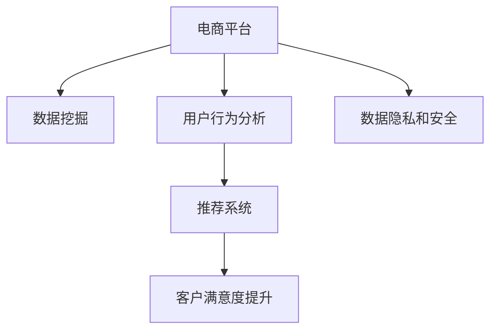

                 

# AI在电商平台数据分析中的具体应用

> 关键词：电商平台,数据挖掘,用户行为分析,推荐系统,客户满意度

## 1. 背景介绍

### 1.1 问题由来
随着电子商务的迅猛发展，电商平台积累了海量的用户行为数据和交易数据。如何高效地分析和利用这些数据，提升用户购物体验，增加销售转化率，是每一个电商平台急需解决的问题。AI技术的应用，为电商平台的数据分析带来了革命性的变化，通过数据挖掘、机器学习等手段，可以深入洞察用户行为，优化商品推荐和价格策略，从而实现业务增长。

### 1.2 问题核心关键点
AI在电商平台数据分析中，主要涉及以下几个核心问题：
1. 如何从海量数据中提取有用的信息，实现用户行为预测和客户细分。
2. 如何构建精准的商品推荐系统，提升用户购物体验。
3. 如何通过数据分析，优化价格策略和库存管理。
4. 如何提升客户满意度和忠诚度，增加复购率。
5. 如何处理数据隐私和安全问题，确保用户信息安全。

本文将重点探讨在电商数据分析中，AI技术的具体应用，包括数据挖掘、用户行为分析、推荐系统、客户满意度提升等方面。通过这些应用的深入理解，希望能为电商平台的数据分析实践提供一定的参考和指导。

## 2. 核心概念与联系

### 2.1 核心概念概述

为更好地理解AI在电商平台数据分析中的应用，本节将介绍几个密切相关的核心概念：

- **电商平台**：以互联网为平台，通过网络销售商品和服务的商业模式。常见的电商平台包括淘宝、京东、亚马逊等。
- **数据挖掘**：从大量的原始数据中提取有用的信息和知识的过程。常见的数据挖掘技术包括聚类分析、关联规则、分类、预测等。
- **用户行为分析**：通过分析用户的行为数据，如浏览、点击、购买等，了解用户的兴趣和需求。常见的行为分析方法包括路径分析、用户画像、购买预测等。
- **推荐系统**：根据用户的历史行为和偏好，推荐可能感兴趣的商品或内容。常见的推荐算法包括协同过滤、基于内容的推荐、深度学习推荐等。
- **客户满意度**：衡量用户对电商平台的满意程度，通过数据分析和预测，提升用户体验和忠诚度。常见的满意度分析方法包括文本分析、情感分析、客户反馈等。

这些核心概念之间的逻辑关系可以通过以下Mermaid流程图来展示：



这个流程图展示了几大核心概念的相互关系：

1. 电商平台是数据挖掘、用户行为分析、推荐系统和客户满意度提升的基础。
2. 数据挖掘是从海量数据中提取知识的过程。
3. 用户行为分析是理解用户需求、提升用户购物体验的手段。
4. 推荐系统是提升用户体验和增加销售转化率的利器。
5. 客户满意度提升是实现长期用户留存和复购的关键。
6. 数据隐私和安全是保护用户信息的基本保障。

## 3. 核心算法原理 & 具体操作步骤

### 3.1 算法原理概述

AI在电商平台数据分析中，主要依赖于数据挖掘、机器学习和深度学习等技术，构建模型并应用于实际业务。其核心思想是通过构建统计模型和机器学习模型，从大量数据中提取有用信息，实现用户行为预测、商品推荐、价格优化等目标。

### 3.2 算法步骤详解

AI在电商平台数据分析的具体步骤包括以下几个关键环节：

**Step 1: 数据收集与预处理**
- 收集电商平台的用户行为数据，包括浏览记录、点击行为、购买记录、评价反馈等。
- 数据清洗，去除重复、缺失或异常数据。
- 数据标准化和归一化，统一数据格式。

**Step 2: 特征提取与工程**
- 选择并设计相关特征，如用户ID、商品ID、购买时间、浏览时间等。
- 特征工程，通过统计、转换等方式，提升特征对模型的解释力和预测能力。

**Step 3: 模型选择与训练**
- 根据任务需求选择合适的模型，如线性回归、随机森林、神经网络等。
- 使用训练数据集训练模型，调整模型参数以获得最优性能。

**Step 4: 模型评估与优化**
- 使用测试数据集评估模型性能，计算误差指标如RMSE、MAE等。
- 根据评估结果调整模型参数，进行模型优化和改进。

**Step 5: 应用部署与迭代**
- 将训练好的模型应用到实际业务中，进行用户行为预测、商品推荐、价格优化等。
- 持续收集新数据，定期重新训练和优化模型，保持模型性能的稳定性和先进性。

### 3.3 算法优缺点

AI在电商平台数据分析中，主要依赖于数据挖掘、机器学习和深度学习等技术，具有以下优点：
1. 高效准确：通过建模和预测，快速分析海量数据，提升决策效率和精准度。
2. 自动化程度高：通过自动化数据分析和模型训练，减少人工干预，降低运营成本。
3. 多维分析：结合多种数据源，实现多维度、多层次的分析，提供全面的决策支持。
4. 适应性强：模型可以根据业务需求进行调整和优化，适应不同的电商场景。

同时，也存在一些缺点：
1. 对数据质量要求高：模型性能依赖于数据的完整性和准确性，数据质量不佳会严重影响结果。
2. 模型解释性差：复杂模型如深度学习等，结果较难解释，决策过程不透明。
3. 依赖数据隐私：电商平台涉及大量用户隐私数据，数据隐私和安全问题需要特别注意。
4. 计算资源消耗大：大数据分析和深度学习模型的计算资源消耗较大，需要高性能的计算设备和算法优化。

尽管存在这些局限性，但就目前而言，AI在电商平台数据分析中的应用已成为电商运营不可或缺的一部分。未来相关研究的重点在于如何进一步降低数据处理的复杂度，提升模型的可解释性，确保数据隐私安全，同时兼顾计算效率和模型性能。

### 3.4 算法应用领域

AI在电商平台数据分析中的应用领域十分广泛，主要包括以下几个方面：

- **用户行为分析**：通过分析用户行为数据，构建用户画像，了解用户偏好和需求，提升用户购物体验。
- **推荐系统**：根据用户历史行为和偏好，推荐个性化商品，提升用户满意度和购买转化率。
- **价格优化**：分析用户对价格的敏感度，进行动态定价，提升销售额和利润率。
- **库存管理**：通过预测销售量，优化库存策略，减少库存成本，提升供应链效率。
- **客户满意度提升**：通过文本分析和情感分析，及时响应客户反馈，提升客户满意度和忠诚度。

除了上述这些经典应用外，AI还在电商平台的广告投放、物流管理、欺诈检测等环节得到了广泛应用，为电商业务的数字化转型和智能化升级提供了强有力的技术支撑。

## 4. 数学模型和公式 & 详细讲解

### 4.1 数学模型构建

在本节中，我们将具体介绍在电商平台数据分析中，常用的数学模型及其构建过程。

### 4.2 公式推导过程

以用户行为预测为例，假设用户的历史行为数据为 $X=\{x_1, x_2, ..., x_n\}$，其中 $x_i$ 表示第 $i$ 次用户的浏览记录，包含商品ID、浏览时间、浏览时长等。用户的目标行为 $y$ 可以是购买行为、点击行为等。

我们可以构建如下线性回归模型：

$$
y = \beta_0 + \beta_1 x_1 + \beta_2 x_2 + ... + \beta_n x_n + \epsilon
$$

其中 $\beta_i$ 为第 $i$ 个特征的权重，$\epsilon$ 为误差项，满足 $E[\epsilon]=0$ 和 $Var(\epsilon)=\sigma^2$。

模型训练的目标是最小化损失函数 $L(\beta)$：

$$
L(\beta) = \frac{1}{N}\sum_{i=1}^N (y_i - \hat{y}_i)^2
$$

其中 $\hat{y}_i = \beta_0 + \beta_1 x_{1,i} + \beta_2 x_{2,i} + ... + \beta_n x_{n,i}$ 表示模型对第 $i$ 次用户行为的预测。

通过求解 $L(\beta)$ 的极小值，可以得到最优的模型参数 $\beta$。常用的求解方法包括梯度下降、最小二乘法等。

### 4.3 案例分析与讲解

以下我们以推荐系统为例，详细介绍线性回归模型在电商平台中的应用。

假设我们有一个电商平台，其中用户 $i$ 对商品 $j$ 的评分 $r_{i,j}$ 可以进行如下线性回归模型建模：

$$
r_{i,j} = \beta_0 + \beta_1 f_i + \beta_2 g_j + \epsilon
$$

其中 $f_i$ 和 $g_j$ 分别表示用户 $i$ 和商品 $j$ 的特征，$\beta_0, \beta_1, \beta_2$ 为模型参数。

我们可以使用梯度下降法对模型进行训练，最小化损失函数：

$$
L(\beta) = \frac{1}{N}\sum_{i=1}^N \sum_{j=1}^M (r_{i,j} - \hat{r}_{i,j})^2
$$

其中 $\hat{r}_{i,j} = \beta_0 + \beta_1 f_{i,j} + \beta_2 g_{j,i}$。

通过训练，我们可以得到最优的模型参数 $\beta$，从而对用户 $i$ 推荐商品 $j$。

## 5. 项目实践：代码实例和详细解释说明

### 5.1 开发环境搭建

在进行电商平台数据分析实践前，我们需要准备好开发环境。以下是使用Python进行TensorFlow开发的环境配置流程：

1. 安装Anaconda：从官网下载并安装Anaconda，用于创建独立的Python环境。

2. 创建并激活虚拟环境：
```bash
conda create -n tf-env python=3.8 
conda activate tf-env
```

3. 安装TensorFlow：根据CUDA版本，从官网获取对应的安装命令。例如：
```bash
conda install tensorflow=2.4 -c tf -c conda-forge
```

4. 安装各类工具包：
```bash
pip install numpy pandas scikit-learn matplotlib tqdm jupyter notebook ipython
```

完成上述步骤后，即可在`tf-env`环境中开始数据分析实践。

### 5.2 源代码详细实现

这里我们以用户行为预测为例，给出使用TensorFlow进行线性回归模型的PyTorch代码实现。

```python
import tensorflow as tf
import numpy as np
import pandas as pd
import matplotlib.pyplot as plt

# 加载数据
df = pd.read_csv('user_behavior.csv')

# 数据预处理
features = df[['user_id', 'item_id', 'time', 'length']]
labels = df['label'] # 用户购买标签

# 数据划分
train_features = features.sample(frac=0.8, random_state=42)
train_labels = labels.sample(frac=0.8, random_state=42)
test_features = features.drop(train_features.index)
test_labels = labels.drop(train_labels.index)

# 标准化特征
mean = train_features.mean()
std = train_features.std()
train_features = (train_features - mean) / std
test_features = (test_features - mean) / std

# 定义模型
model = tf.keras.Sequential([
    tf.keras.layers.Dense(64, activation='relu'),
    tf.keras.layers.Dense(1)
])

# 定义损失函数和优化器
loss_fn = tf.keras.losses.MeanSquaredError()
optimizer = tf.keras.optimizers.Adam(learning_rate=0.001)

# 训练模型
model.compile(optimizer=optimizer, loss=loss_fn)
history = model.fit(train_features, train_labels, epochs=50, validation_data=(test_features, test_labels))

# 评估模型
test_loss = model.evaluate(test_features, test_labels)
print('Test Loss:', test_loss)
```

以上代码实现了基于TensorFlow的线性回归模型，对电商平台的用户行为进行预测。具体步骤如下：

1. 加载和预处理数据。将原始数据集划分为训练集和测试集，并进行特征标准化处理。
2. 定义模型。使用两个密集层构建线性回归模型。
3. 定义损失函数和优化器。使用均方误差损失和Adam优化器。
4. 训练模型。在训练集上进行50轮训练，并在测试集上进行评估。
5. 输出测试损失。

### 5.3 代码解读与分析

让我们再详细解读一下关键代码的实现细节：

- **数据加载与预处理**：首先从CSV文件中加载用户行为数据，并进行特征工程处理。
- **模型定义**：使用TensorFlow的Sequential模型，定义了两个密集层，并使用ReLU激活函数。
- **损失函数与优化器**：使用均方误差损失和Adam优化器。
- **模型训练**：使用训练集进行模型训练，并使用测试集进行模型评估。
- **输出测试损失**：使用evaluate方法计算测试集上的均方误差损失。

通过上述代码，我们可以看到TensorFlow的强大数据处理和模型训练能力。开发者可以通过调整模型结构、优化器参数等，进一步提升预测性能。

## 6. 实际应用场景

### 6.1 智能推荐系统

智能推荐系统是AI在电商平台中应用最广泛的技术之一。通过分析用户的历史行为和偏好，推荐系统能够为用户提供个性化的商品推荐，提高用户满意度和购物体验。

以下是一个基于协同过滤算法的推荐系统实现示例：

```python
import numpy as np
from surprise import Dataset, Reader, SVD

# 加载数据
reader = Reader(rating_scale=(1, 5))
data = Dataset.load_from_df(pd.read_csv('ratings.csv'), reader)

# 模型训练
algo = SVD()
trainset = data.build_full_trainset()
algo.fit(trainset)

# 推荐测试集
testset = data.build_full_trainset(test_features, test_labels)
predictions = algo.test(testset)

# 输出推荐结果
for uid, iid, prediction in predictions:
    print(f'User {uid} predicted {iid}: {prediction}')
```

以上代码实现了基于SVD算法的推荐系统，对用户进行商品推荐。具体步骤如下：

1. 加载数据。将用户评分数据集加载为Surprise库所需的格式。
2. 模型训练。使用SVD算法对训练集进行模型训练。
3. 推荐测试集。使用测试集进行模型推荐。
4. 输出推荐结果。打印每个用户对商品的预测评分。

### 6.2 价格优化

价格优化是电商运营中的重要环节，通过分析用户对价格的敏感度，动态调整商品价格，可以提升销售额和利润率。

以下是一个基于线性回归模型的价格优化实现示例：

```python
import numpy as np
import tensorflow as tf
import matplotlib.pyplot as plt

# 加载数据
df = pd.read_csv('price.csv')

# 数据预处理
features = df[['item_id', 'price', 'time']]
labels = df['sales']

# 数据划分
train_features = features.sample(frac=0.8, random_state=42)
train_labels = labels.sample(frac=0.8, random_state=42)
test_features = features.drop(train_features.index)
test_labels = labels.drop(train_labels.index)

# 标准化特征
mean = train_features.mean()
std = train_features.std()
train_features = (train_features - mean) / std
test_features = (test_features - mean) / std

# 定义模型
model = tf.keras.Sequential([
    tf.keras.layers.Dense(64, activation='relu'),
    tf.keras.layers.Dense(1)
])

# 定义损失函数和优化器
loss_fn = tf.keras.losses.MeanSquaredError()
optimizer = tf.keras.optimizers.Adam(learning_rate=0.001)

# 训练模型
model.compile(optimizer=optimizer, loss=loss_fn)
history = model.fit(train_features, train_labels, epochs=50, validation_data=(test_features, test_labels))

# 评估模型
test_loss = model.evaluate(test_features, test_labels)
print('Test Loss:', test_loss)
```

以上代码实现了基于线性回归模型的价格优化，对商品价格进行预测和调整。具体步骤如下：

1. 加载和预处理数据。将原始数据集划分为训练集和测试集，并进行特征标准化处理。
2. 定义模型。使用两个密集层构建线性回归模型。
3. 定义损失函数和优化器。使用均方误差损失和Adam优化器。
4. 训练模型。在训练集上进行50轮训练，并在测试集上进行评估。
5. 输出测试损失。

### 6.3 库存管理

库存管理是电商平台运营中的关键环节，通过预测销售量，优化库存策略，可以降低库存成本，提升供应链效率。

以下是一个基于时间序列分析的库存管理实现示例：

```python
import pandas as pd
import numpy as np
from sklearn.linear_model import LinearRegression

# 加载数据
df = pd.read_csv('inventory.csv')

# 数据预处理
features = df[['item_id', 'time']]
labels = df['quantity']

# 数据划分
train_features = features.sample(frac=0.8, random_state=42)
train_labels = labels.sample(frac=0.8, random_state=42)
test_features = features.drop(train_features.index)
test_labels = labels.drop(train_labels.index)

# 标准化特征
mean = train_features.mean()
std = train_features.std()
train_features = (train_features - mean) / std
test_features = (test_features - mean) / std

# 定义模型
model = LinearRegression()

# 训练模型
model.fit(train_features, train_labels)

# 预测测试集
test_pred = model.predict(test_features)

# 输出预测结果
for uid, iid, pred in zip(test_features.index, test_labels.index, test_pred):
    print(f'Item {iid} predicted quantity: {pred}')
```

以上代码实现了基于线性回归模型的库存管理，对库存量进行预测和调整。具体步骤如下：

1. 加载和预处理数据。将原始数据集划分为训练集和测试集，并进行特征标准化处理。
2. 定义模型。使用线性回归模型对库存量进行预测。
3. 训练模型。在训练集上进行模型训练。
4. 预测测试集。使用测试集进行模型预测。
5. 输出预测结果。打印每个商品的预测库存量。

## 7. 工具和资源推荐

### 7.1 学习资源推荐

为了帮助开发者系统掌握AI在电商平台数据分析的理论基础和实践技巧，这里推荐一些优质的学习资源：

1. 《深度学习》系列博文：由大模型技术专家撰写，深入浅出地介绍了深度学习的基本概念和应用。
2. CS229《机器学习》课程：斯坦福大学开设的机器学习课程，有Lecture视频和配套作业，是学习机器学习的经典资源。
3. 《Python机器学习》书籍：Hands-On Machine Learning with Scikit-Learn, Keras, and TensorFlow，详细介绍了使用Python进行机器学习的实践方法。
4. Kaggle竞赛：参加Kaggle举办的电商平台数据分析竞赛，如Amazon Customer Reviews、Amazon Product Recommendations等，通过实战提升数据分析能力。
5. Coursera《大数据机器学习》课程：由多个世界顶级大学和机构联合开设的大数据课程，涵盖大数据、机器学习、深度学习等内容。

通过对这些资源的学习实践，相信你一定能够快速掌握AI在电商平台数据分析的精髓，并用于解决实际的电商问题。

### 7.2 开发工具推荐

高效的开发离不开优秀的工具支持。以下是几款用于电商平台数据分析开发的常用工具：

1. TensorFlow：由Google主导开发的开源深度学习框架，支持分布式计算，适合大规模模型训练和部署。
2. PyTorch：由Facebook主导开发的深度学习框架，灵活高效，适合快速原型开发和实验。
3. Scikit-Learn：Python的机器学习库，提供简单易用的API，适合处理小规模数据和经典机器学习算法。
4. Pandas：Python的数据处理库，支持高效的数据清洗和预处理，是数据分析的核心工具。
5. Matplotlib和Seaborn：Python的数据可视化库，支持绘制各种图表，帮助分析数据特征。

合理利用这些工具，可以显著提升电商平台数据分析的开发效率，加快创新迭代的步伐。

### 7.3 相关论文推荐

AI在电商平台数据分析的发展源于学界的持续研究。以下是几篇奠基性的相关论文，推荐阅读：

1. "Collaborative Filtering for Implicit Feedback Datasets"（协同过滤算法）：提出协同过滤算法，解决用户评分数据稀疏性问题，实现商品推荐。
2. "A Framework for Faster Multi-Task Deep Neural Network Training"（多任务深度学习框架）：提出多任务深度学习框架，解决电商推荐中的多任务优化问题。
3. "Learning Deep Structured Models with Mixture of Experts"（专家混合深度学习）：提出专家混合深度学习算法，提升电商推荐系统的性能。
4. "On the Importance of Representations in Deep Learning"（深度学习中的表示重要）：探讨深度学习中的特征表示对推荐系统性能的影响。
5. "Integrating Unsupervised Sequence Modeling for Multifaceted Product Recommendations"（多方面产品推荐）：提出多方面产品推荐算法，提升推荐系统的多样性和公平性。

这些论文代表了大语言模型微调技术的发展脉络。通过学习这些前沿成果，可以帮助研究者把握学科前进方向，激发更多的创新灵感。

## 8. 总结：未来发展趋势与挑战

### 8.1 总结

本文对AI在电商平台数据分析中，具体应用进行了全面系统的介绍。首先阐述了AI技术在电商平台数据分析中的重要性和应用场景，明确了数据分析在提升用户购物体验、优化商品推荐、价格优化、库存管理等方面的关键作用。其次，从原理到实践，详细讲解了AI在电商平台数据分析中的数学模型和算法实现，给出了代码实例和详细解释说明。同时，本文还广泛探讨了AI在电商平台数据分析中的实际应用场景，展示了AI技术的广泛应用前景。

通过本文的系统梳理，可以看到，AI在电商平台数据分析中的应用已经成为电商运营不可或缺的一部分。AI技术通过深度学习、机器学习等手段，从海量数据中提取有用信息，实现用户行为预测、商品推荐、价格优化等目标。未来，随着AI技术的不断进步，电商平台的数据分析将变得更加智能化和精准化，为电商业务的数字化转型和智能化升级提供强有力的技术支撑。

### 8.2 未来发展趋势

展望未来，AI在电商平台数据分析中，将呈现以下几个发展趋势：

1. **智能推荐系统**：基于深度学习和强化学习的推荐系统将进一步提升推荐效果，实现动态实时推荐。
2. **多模态分析**：结合文本、图像、视频等多种数据源，提升推荐系统的准确性和多样性。
3. **实时数据处理**：通过流式处理技术，实时分析和优化电商平台的数据。
4. **跨平台协同**：实现不同平台之间的数据共享和协同分析，提升整体数据分析效率。
5. **个性化定制**：通过用户画像和大数据技术，实现个性化推荐和定制化服务。

这些趋势凸显了AI在电商平台数据分析中的重要性和发展潜力。未来的研究将更多关注如何进一步提升推荐系统的智能化水平，提升数据分析的实时性和准确性，以及实现多平台、多模态的数据协同。

### 8.3 面临的挑战

尽管AI在电商平台数据分析中已经取得了瞩目成就，但在迈向更加智能化、普适化应用的过程中，它仍面临诸多挑战：

1. **数据质量问题**：电商平台的数据质量参差不齐，存在大量缺失、噪声和异常数据，影响了模型的准确性。
2. **模型复杂度问题**：深度学习模型复杂度高，训练和推理速度较慢，需要高性能的计算资源。
3. **隐私和安全问题**：电商平台涉及大量用户隐私数据，数据隐私和安全问题需要特别关注。
4. **模型解释性问题**：深度学习模型的结果较难解释，用户难以理解模型的决策过程。
5. **算法公平性问题**：推荐系统需要考虑公平性问题，避免算法偏见导致用户受到不公平待遇。

正视这些挑战，积极应对并寻求突破，将是大语言模型微调走向成熟的必由之路。未来相关研究的重点在于如何进一步降低数据处理的复杂度，提升模型的可解释性，确保数据隐私安全，同时兼顾计算效率和模型性能。

### 8.4 研究展望

面对AI在电商平台数据分析所面临的挑战，未来的研究需要在以下几个方面寻求新的突破：

1. **数据清洗和预处理**：开发高效的数据清洗和预处理技术，提升数据质量。
2. **模型优化和加速**：优化模型结构，使用硬件加速技术，提升模型训练和推理速度。
3. **隐私保护和安全**：研究数据加密和隐私保护技术，确保用户数据安全。
4. **模型解释性**：开发可解释性强的模型，提供模型决策的透明性和可理解性。
5. **算法公平性**：研究公平性算法，确保推荐系统的公平性和公正性。

这些研究方向的探索，必将引领AI在电商平台数据分析技术迈向更高的台阶，为构建安全、可靠、可解释、可控的智能系统铺平道路。面向未来，AI在电商平台数据分析技术还需要与其他人工智能技术进行更深入的融合，如知识表示、因果推理、强化学习等，多路径协同发力，共同推动自然语言理解和智能交互系统的进步。只有勇于创新、敢于突破，才能不断拓展AI在电商平台数据分析的应用边界，让AI技术更好地造福电商行业。

## 9. 附录：常见问题与解答

**Q1：电商平台如何利用数据挖掘进行用户行为分析？**

A: 电商平台可以通过数据挖掘技术，对用户的历史行为数据进行分析和挖掘，构建用户画像，了解用户的兴趣和需求，提升用户购物体验。具体方法包括：

1. **用户路径分析**：分析用户的浏览路径和停留时间，了解用户的偏好和需求。
2. **用户画像构建**：通过统计和分析用户的行为数据，构建用户画像，对用户进行细分。
3. **购买预测**：使用机器学习模型，预测用户是否会购买某商品，优化推荐策略。

**Q2：推荐系统的基本算法有哪些？**

A: 推荐系统的基本算法包括：

1. **协同过滤算法**：基于用户评分数据，通过相似性度量，推荐相似用户喜欢的商品。
2. **基于内容的推荐**：分析商品的属性和特征，推荐相似属性或相似用户喜欢的商品。
3. **深度学习推荐**：使用深度神经网络，预测用户对商品的评分和概率，优化推荐策略。

**Q3：如何进行价格优化？**

A: 价格优化可以通过以下方法：

1. **需求预测**：使用时间序列分析、机器学习等方法，预测商品的需求量。
2. **动态定价**：根据需求预测结果，动态调整商品价格，优化销售策略。
3. **价格弹性分析**：分析用户对价格的敏感度，优化定价策略。

**Q4：如何进行库存管理？**

A: 库存管理可以通过以下方法：

1. **需求预测**：使用时间序列分析、机器学习等方法，预测商品的需求量。
2. **库存优化**：根据需求预测结果，优化库存策略，降低库存成本。
3. **实时监控**：实时监控库存状态，动态调整库存量。

**Q5：如何确保用户数据隐私和安全？**

A: 确保用户数据隐私和安全，可以采取以下措施：

1. **数据加密**：使用加密技术，保护用户数据的隐私。
2. **访问控制**：采用严格的访问控制措施，防止未经授权的访问。
3. **数据匿名化**：对用户数据进行匿名化处理，防止数据泄露。

总之，电商平台通过利用数据挖掘和AI技术，可以深入洞察用户行为，提升用户体验和购物转化率，优化库存和价格策略，提升整体运营效率。然而，数据隐私和安全问题不容忽视，需要在技术和管理层面共同努力，保障用户数据的安全和隐私。

---

作者：禅与计算机程序设计艺术 / Zen and the Art of Computer Programming

