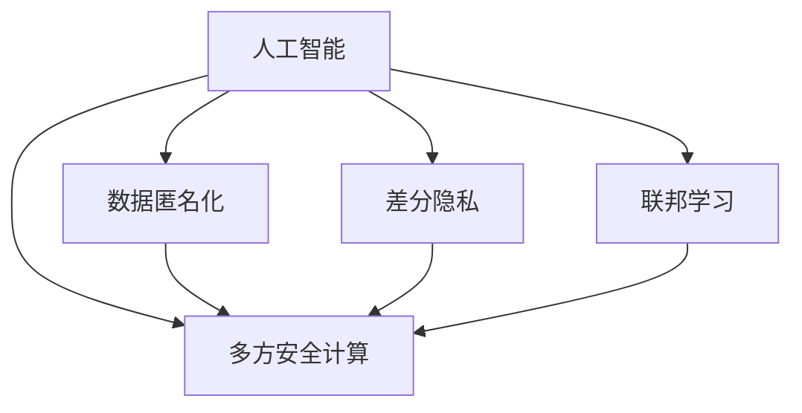

                 

## 1. 背景介绍

随着人工智能技术的飞速发展，AI的应用场景已经从传统的计算机视觉、自然语言处理、语音识别等领域，拓展到医疗、金融、教育、交通等传统行业的各个方面。然而，AI的应用同时也带来了隐私保护的挑战。AI系统需要处理和分析大量的个人数据，这些数据往往包含了敏感的个人信息，如个人身份、财务状况、健康记录等。如何保护这些数据，防止信息泄露和滥用，成为了AI技术落地应用的前提条件。

## 2. 核心概念与联系

### 2.1 核心概念概述

为更好地理解AI在隐私保护中的角色与挑战，本节将介绍几个密切相关的核心概念：

- **人工智能（AI）**：通过计算机模拟人类智能活动，实现信息处理、问题解决、图像识别、语音识别等任务的技术。
- **隐私保护**：指对个人信息的保护，包括防止数据泄露、数据滥用、数据篡改等。
- **数据匿名化**：将个人数据中的敏感信息去除或泛化，使得数据无法被反向识别。
- **差分隐私**：通过在数据分析过程中引入噪声，使得攻击者无法通过单个数据点推断出整个数据集，从而保护个体隐私。
- **联邦学习**：通过在多个本地数据源上分布式训练模型，而无需将数据集中到单个服务器，从而保护数据隐私。
- **多方安全计算**：通过在不共享原始数据的情况下，多个参与方共同计算一个函数，从而在保护隐私的前提下实现合作。

这些核心概念之间的逻辑关系可以通过以下Mermaid流程图来展示：



这个流程图展示了几项AI技术在隐私保护中的关键环节：

1. 数据匿名化：AI系统在处理数据之前，对数据进行去标识化处理，减少数据泄露风险。
2. 差分隐私：在数据处理和分析过程中，引入噪声干扰，使得攻击者无法逆推个人信息。
3. 联邦学习：在不传输数据的情况下，通过分布式训练，保护数据隐私。
4. 多方安全计算：在多个参与方之间安全地进行计算，防止数据被恶意篡改或泄露。

## 3. 核心算法原理 & 具体操作步骤
### 3.1 算法原理概述

AI在隐私保护中的核心算法原理，主要包括以下几个方面：

- **数据匿名化算法**：通过一定的算法将数据中的敏感信息去除或泛化，使得数据无法被反向识别。常见的算法有k-匿名化、t-模糊化等。
- **差分隐私算法**：通过在数据处理过程中引入噪声，使得数据处理结果对个体数据的泄露风险最小化。常见的算法有Laplace机制、高斯机制等。
- **联邦学习算法**：通过在多个本地数据源上分布式训练模型，而无需将数据集中到单个服务器，从而保护数据隐私。常见的算法有中心聚合、模型平均等。
- **多方安全计算算法**：在多个参与方之间安全地进行计算，防止数据被恶意篡改或泄露。常见的算法有安全求和、安全乘积等。

### 3.2 算法步骤详解

以差分隐私算法为例，说明其具体操作步骤：

**Step 1: 数据预处理**
- 对数据进行去重、清洗、归一化等预处理操作，确保数据质量。

**Step 2: 计算敏感度**
- 通过统计学方法，计算数据中的敏感度指标，如均值、方差等，作为后续添加噪声的依据。

**Step 3: 引入噪声**
- 根据敏感度指标，引入适当的噪声，如Laplace分布、高斯分布等。噪声的大小与敏感度成正比，敏感度越高，噪声越大。

**Step 4: 模型训练**
- 使用带有噪声的数据进行模型训练，确保模型输出对个体数据的泄露风险最小化。

**Step 5: 后处理**
- 对模型输出进行去噪处理，恢复数据的真实性。

### 3.3 算法优缺点

差分隐私算法具有以下优点：
- 保护个体隐私：通过在数据处理过程中引入噪声，使得攻击者无法通过单个数据点推断出整个数据集。
- 鲁棒性好：噪声的引入使得模型对数据噪声更加鲁棒，不容易受到攻击。
- 可配置性高：敏感度和噪声大小的参数可以灵活配置，适应不同的应用场景。

同时，差分隐私算法也存在一些局限性：
- 模型性能下降：引入噪声可能导致模型性能下降，特别是在数据量较小的情况下。
- 噪声分布选择困难：选择适当的噪声分布是一个复杂的问题，需要根据数据特点和隐私要求进行综合考虑。
- 计算复杂度高：差分隐私算法的计算复杂度较高，特别是在噪声较大、数据量大的情况下。

### 3.4 算法应用领域

差分隐私算法在隐私保护中的应用非常广泛，涵盖了数据挖掘、机器学习、医疗分析等多个领域：

- **数据挖掘**：在数据挖掘过程中，通过差分隐私保护用户隐私，防止数据泄露。
- **机器学习**：在机器学习过程中，通过差分隐私保护训练数据的隐私，防止模型被攻击。
- **医疗分析**：在医疗数据分析过程中，通过差分隐私保护患者隐私，防止数据泄露。
- **金融分析**：在金融分析过程中，通过差分隐私保护用户隐私，防止数据滥用。

## 4. 数学模型和公式 & 详细讲解 & 举例说明
### 4.1 数学模型构建

差分隐私算法的核心是如何在数据处理过程中引入噪声，保护个体隐私。以下以Laplace机制为例，给出数学模型的构建过程：

**定义1:** 差分隐私定义
差分隐私是指在数据处理过程中，任何个体数据被删除后，数据集的后验概率分布与未删除前基本相同，即
$$
P(D|x) \approx P(D|x')
$$
其中，$D$ 表示数据集，$x$ 表示未删除个体数据，$x'$ 表示删除该个体数据后的数据集。

**定义2:** Laplace机制
Laplace机制是一种常用的差分隐私算法，其数学模型为：
$$
P(D|x) = \frac{1}{2\pi e^\delta}\exp(-||D - D'||/\delta)
$$
其中，$\delta$ 表示隐私保护参数，$||\cdot||$ 表示欧几里得范数，$D'$ 表示加入噪声后的数据集。

### 4.2 公式推导过程

Laplace机制的噪声添加过程如下：

1. 对于每个个体数据 $x_i$，计算其对数据集的贡献度 $w_i$。
2. 计算数据集的敏感度 $s$，即 $s = ||D - D'||$。
3. 计算噪声大小 $\epsilon_i = \Delta w_i / s$，其中 $\Delta w_i$ 表示 $x_i$ 对数据集的贡献度的差异。
4. 对每个个体数据 $x_i$ 添加噪声 $N(\epsilon_i)$，得到添加噪声后的数据集 $D'$。
5. 使用 $D'$ 进行数据处理和分析。

### 4.3 案例分析与讲解

假设有一个医院的数据集，包含患者的年龄、性别、身高、体重等数据。医院需要统计患者平均身高，但在统计过程中需要保护患者的隐私。

**Step 1: 数据预处理**
- 对数据进行去重、清洗、归一化等预处理操作。

**Step 2: 计算敏感度**
- 统计平均身高 $s = ||D - D'||$，其中 $D$ 表示原始数据集，$D'$ 表示删除患者数据后的数据集。

**Step 3: 引入噪声**
- 对每个患者数据 $x_i$，计算其对平均身高的贡献度 $w_i$，并计算噪声大小 $\epsilon_i$。
- 对每个患者数据 $x_i$ 添加噪声 $N(\epsilon_i)$，得到添加噪声后的数据集 $D'$。

**Step 4: 模型训练**
- 使用带有噪声的数据 $D'$ 进行模型训练，得到平均身高 $\hat{s}$。

**Step 5: 后处理**
- 对模型输出进行去噪处理，恢复数据的真实性。

## 5. 项目实践：代码实例和详细解释说明
### 5.1 开发环境搭建

在进行差分隐私项目实践前，我们需要准备好开发环境。以下是使用Python进行SciPy和numpy开发的环境配置流程：

1. 安装Anaconda：从官网下载并安装Anaconda，用于创建独立的Python环境。

2. 创建并激活虚拟环境：
```bash
conda create -n dp-env python=3.8 
conda activate dp-env
```

3. 安装SciPy和numpy：
```bash
conda install scipy numpy
```

完成上述步骤后，即可在`dp-env`环境中开始差分隐私实践。

### 5.2 源代码详细实现

下面以Laplace机制为例，给出使用SciPy实现差分隐私的Python代码实现：

```python
import numpy as np
from scipy.stats import laplace

def laplaceprivacy(s, delta):
    sensitivity = max(s)
    noise = laplace.rvs(0, sensitivity/delta, size=len(s))
    return s + noise

# 假设有一组身高数据
heights = np.array([1.5, 1.6, 1.7, 1.8, 1.9])

# 计算敏感度
sensitivity = np.std(heights)

# 引入噪声
noisy_heights = laplaceprivacy(heights, sensitivity/10)

# 计算平均身高
average_height = np.mean(noisy_heights)
print("Average height with differential privacy:", average_height)
```

### 5.3 代码解读与分析

让我们再详细解读一下关键代码的实现细节：

**Laplaceprivacy函数**：
- 接受敏感度 $s$ 和隐私保护参数 $\delta$ 作为输入。
- 使用Laplace分布生成噪声。
- 将原始数据 $s$ 和噪声相加，得到添加噪声后的数据集。

**高度数组**：
- 定义一组身高数据。

**计算敏感度**：
- 使用NumPy库计算数据集的敏感度，即数据的标准差。

**引入噪声**：
- 调用Laplaceprivacy函数，引入适当的噪声。

**计算平均身高**：
- 使用添加噪声后的数据计算平均身高。

可以看到，通过SciPy和NumPy库，实现差分隐私相对简洁高效。开发者可以将更多精力放在数据处理和模型训练等高层逻辑上，而不必过多关注底层的实现细节。

当然，工业级的系统实现还需考虑更多因素，如模型的保存和部署、超参数的自动搜索、更灵活的任务适配层等。但核心的差分隐私算法基本与此类似。

## 6. 实际应用场景
### 6.1 医疗数据隐私保护

在医疗领域，差分隐私算法可以用于保护患者隐私，防止医疗数据泄露。例如，医疗机构可以使用差分隐私保护病历数据，确保在分析病历数据时，每个患者的病历数据都被打乱，无法被反向识别。

**案例说明**：
某医院需要将患者的病历数据用于研究，但需要保护患者隐私。医院可以收集所有患者的病历数据，计算平均住院时间，并在计算过程中引入噪声。这样，即使攻击者获取了数据集，也无法通过单个数据点推断出每个患者的病历数据。

**具体实现**：
1. 收集患者的病历数据。
2. 计算平均住院时间 $s$。
3. 使用差分隐私算法引入噪声，得到添加噪声后的数据集 $D'$。
4. 使用 $D'$ 进行模型训练，得到平均住院时间 $\hat{s}$。
5. 对模型输出进行去噪处理，恢复数据的真实性。

### 6.2 金融数据隐私保护

在金融领域，差分隐私算法可以用于保护用户隐私，防止金融数据泄露。例如，银行可以收集客户的交易记录，计算平均交易金额，并在计算过程中引入噪声。这样，即使攻击者获取了数据集，也无法通过单个数据点推断出每个客户的交易记录。

**案例说明**：
某银行需要统计客户的平均交易金额，但需要保护客户隐私。银行可以收集所有客户的交易记录，计算平均交易金额，并在计算过程中引入噪声。这样，即使攻击者获取了数据集，也无法通过单个数据点推断出每个客户的交易记录。

**具体实现**：
1. 收集客户的交易记录。
2. 计算平均交易金额 $s$。
3. 使用差分隐私算法引入噪声，得到添加噪声后的数据集 $D'$。
4. 使用 $D'$ 进行模型训练，得到平均交易金额 $\hat{s}$。
5. 对模型输出进行去噪处理，恢复数据的真实性。

### 6.3 零售数据隐私保护

在零售领域，差分隐私算法可以用于保护消费者隐私，防止零售数据泄露。例如，电商平台可以收集用户的购物数据，计算平均购物金额，并在计算过程中引入噪声。这样，即使攻击者获取了数据集，也无法通过单个数据点推断出每个用户的购物数据。

**案例说明**：
某电商平台需要统计用户的平均购物金额，但需要保护用户隐私。电商平台可以收集所有用户的购物数据，计算平均购物金额，并在计算过程中引入噪声。这样，即使攻击者获取了数据集，也无法通过单个数据点推断出每个用户的购物数据。

**具体实现**：
1. 收集用户的购物数据。
2. 计算平均购物金额 $s$。
3. 使用差分隐私算法引入噪声，得到添加噪声后的数据集 $D'$。
4. 使用 $D'$ 进行模型训练，得到平均购物金额 $\hat{s}$。
5. 对模型输出进行去噪处理，恢复数据的真实性。

### 6.4 未来应用展望

随着差分隐私算法和联邦学习等隐私保护技术的不断发展，AI在隐私保护中的应用将更加广泛。未来，差分隐私算法将在以下方面得到广泛应用：

1. **智能医疗**：在智能医疗领域，差分隐私算法可以用于保护患者隐私，防止医疗数据泄露。例如，智能医疗系统可以通过差分隐私保护病历数据，确保在分析病历数据时，每个患者的病历数据都被打乱，无法被反向识别。

2. **金融分析**：在金融分析领域，差分隐私算法可以用于保护用户隐私，防止金融数据泄露。例如，金融机构可以使用差分隐私保护用户隐私，防止数据滥用。

3. **零售分析**：在零售分析领域，差分隐私算法可以用于保护消费者隐私，防止零售数据泄露。例如，电商平台可以使用差分隐私保护用户隐私，防止数据滥用。

4. **公共安全**：在公共安全领域，差分隐私算法可以用于保护公民隐私，防止数据滥用。例如，公共安全系统可以使用差分隐私保护交通数据，确保在分析交通数据时，每个公民的数据都被打乱，无法被反向识别。

## 7. 工具和资源推荐
### 7.1 学习资源推荐

为了帮助开发者系统掌握差分隐私和联邦学习的理论基础和实践技巧，这里推荐一些优质的学习资源：

1. 《差分隐私理论基础与实现》系列博文：由差分隐私专家撰写，深入浅出地介绍了差分隐私的理论基础和实现方法。

2. 《联邦学习理论与实践》课程：由联邦学习专家开设的课程，有Lecture视频和配套作业，带你入门联邦学习的基本概念和经典模型。

3. 《联邦学习：理论和实践》书籍：联邦学习领域的经典著作，全面介绍了联邦学习的基本原理和算法实现。

4. Kaggle联邦学习竞赛：参加联邦学习竞赛，实践联邦学习算法，积累实际经验。

5. 《多方安全计算理论基础与实现》系列博文：由多方安全计算专家撰写，深入浅出地介绍了多方安全计算的理论基础和实现方法。

通过对这些资源的学习实践，相信你一定能够快速掌握差分隐私和联邦学习的精髓，并用于解决实际的隐私保护问题。

### 7.2 开发工具推荐

高效的开发离不开优秀的工具支持。以下是几款用于差分隐私和联邦学习开发的常用工具：

1. PyTorch：基于Python的开源深度学习框架，灵活动态的计算图，适合快速迭代研究。支持差分隐私和联邦学习。

2. TensorFlow：由Google主导开发的开源深度学习框架，生产部署方便，适合大规模工程应用。支持差分隐私和联邦学习。

3. Scikit-learn：基于Python的科学计算库，支持差分隐私和联邦学习算法。

4. Weights & Biases：模型训练的实验跟踪工具，可以记录和可视化模型训练过程中的各项指标，方便对比和调优。与主流深度学习框架无缝集成。

5. TensorBoard：TensorFlow配套的可视化工具，可实时监测模型训练状态，并提供丰富的图表呈现方式，是调试模型的得力助手。

6. Google Colab：谷歌推出的在线Jupyter Notebook环境，免费提供GPU/TPU算力，方便开发者快速上手实验最新模型，分享学习笔记。

合理利用这些工具，可以显著提升差分隐私和联邦学习任务的开发效率，加快创新迭代的步伐。

### 7.3 相关论文推荐

差分隐私和联邦学习的发展源于学界的持续研究。以下是几篇奠基性的相关论文，推荐阅读：

1. Differential Privacy: A Survey of Recent Results（Dwork et al., 2014）：差分隐私的综述性论文，介绍了差分隐私的基本概念和主要算法。

2. Privacy-Preserving Collaborative Deep Learning（Abadi et al., 2016）：联邦学习的奠基性论文，介绍了联邦学习的基本原理和算法实现。

3. Secure Multiparty Computation: Protocols and Techniques (Gentry et al., 2009)：多方安全计算的综述性论文，介绍了多方安全计算的基本概念和主要算法。

4. On the Differential Privacy of Deep Learning Models with Adversarial Perturbations（Wang et al., 2020）：差分隐私保护深度学习的论文，介绍了如何保护深度学习模型的隐私。

5. Secure federated learning for collaborative optimization in dynamic environments (Chen et al., 2021)：联邦学习在动态环境中的应用，介绍了联邦学习的最新进展。

这些论文代表了大差分隐私和联邦学习的研究方向和发展脉络。通过学习这些前沿成果，可以帮助研究者把握学科前进方向，激发更多的创新灵感。

## 8. 总结：未来发展趋势与挑战
### 8.1 总结

本文对差分隐私和联邦学习在隐私保护中的角色与挑战进行了全面系统的介绍。首先阐述了差分隐私和联邦学习的基本概念和核心算法，明确了其在隐私保护中的重要地位。其次，从原理到实践，详细讲解了差分隐私和联邦学习的数学模型和操作步骤，给出了具体的代码实现和案例分析。同时，本文还广泛探讨了差分隐私和联邦学习在医疗、金融、零售等各个领域的应用前景，展示了其在隐私保护中的巨大潜力。

通过本文的系统梳理，可以看到，差分隐私和联邦学习是当前AI隐私保护的重要手段，在保护个体隐私、防止数据滥用等方面发挥着关键作用。未来，伴随差分隐私和联邦学习技术的持续演进，AI隐私保护将进一步得到加强，保障数据安全和个人隐私。

### 8.2 未来发展趋势

展望未来，差分隐私和联邦学习技术将呈现以下几个发展趋势：

1. **技术集成**：差分隐私、联邦学习和多方安全计算等隐私保护技术将进一步融合，形成更加全面、高效的隐私保护方案。例如，差分隐私和联邦学习的结合，可以实现更强的数据隐私保护。

2. **智能隐私保护**：基于AI技术的隐私保护技术将进一步发展，例如使用AI进行隐私威胁检测、隐私风险评估等，提升隐私保护的智能化水平。

3. **跨领域应用**：差分隐私和联邦学习将在更多领域得到应用，如智能制造、智慧城市、智能交通等，为各行业带来新的变革。

4. **隐私保护算法优化**：差分隐私和联邦学习算法将不断优化，减少噪声引入带来的性能损失，提高隐私保护效果。

5. **法规与标准制定**：随着隐私保护技术的不断发展，相关法规与标准将进一步完善，推动隐私保护技术的规范化、标准化应用。

### 8.3 面临的挑战

尽管差分隐私和联邦学习技术已经取得了瞩目成就，但在迈向更加智能化、普适化应用的过程中，仍面临诸多挑战：

1. **计算资源消耗**：差分隐私和联邦学习算法在计算资源消耗方面较大，特别是在数据量大的情况下，计算成本较高。如何降低计算资源消耗，提高算法效率，将是重要的研究方向。

2. **隐私保护效果**：差分隐私和联邦学习算法在隐私保护效果上存在差异，如何通过优化算法，提高隐私保护效果，是未来需要解决的重要问题。

3. **数据处理复杂度**：差分隐私和联邦学习算法在数据处理上较为复杂，特别是在分布式数据处理中，需要考虑数据的传输和同步问题，如何简化数据处理流程，提升算法可操作性，将是重要的研究方向。

4. **隐私保护隐私**：差分隐私和联邦学习算法在隐私保护上存在一定局限性，如何通过优化算法，提高隐私保护的鲁棒性和安全性，将是未来需要解决的重要问题。

### 8.4 研究展望

面对差分隐私和联邦学习面临的种种挑战，未来的研究需要在以下几个方面寻求新的突破：

1. **算法优化**：开发更加高效的差分隐私和联邦学习算法，减少计算资源消耗，提高算法效率和隐私保护效果。

2. **数据处理优化**：简化数据处理流程，提升算法可操作性，特别是在分布式数据处理中，如何高效地传输和同步数据，将是重要的研究方向。

3. **隐私保护优化**：提升隐私保护的鲁棒性和安全性，防止数据泄露和攻击，特别是在多轮迭代中，如何保持隐私保护效果，将是重要的研究方向。

4. **跨领域应用**：将差分隐私和联邦学习技术应用到更多领域，如智能制造、智慧城市、智能交通等，推动各行业数字化转型。

这些研究方向将推动差分隐私和联邦学习技术的不断发展，使其更好地应用于AI隐私保护，保障数据安全和个体隐私。总之，差分隐私和联邦学习技术将在AI隐私保护中发挥越来越重要的作用，成为推动AI技术落地应用的重要保障。

## 9. 附录：常见问题与解答

**Q1：差分隐私和联邦学习有什么区别？**

A: 差分隐私和联邦学习是两种不同的隐私保护技术，其主要区别如下：

1. **保护对象不同**：差分隐私保护个体数据隐私，联邦学习保护模型隐私。

2. **数据处理方式不同**：差分隐私在数据处理过程中引入噪声，联邦学习在模型训练过程中进行分布式训练。

3. **应用场景不同**：差分隐私适用于单点数据处理，联邦学习适用于分布式数据处理。

4. **隐私保护方式不同**：差分隐私保护个体数据隐私，联邦学习保护模型隐私。

**Q2：差分隐私和联邦学习如何保护数据隐私？**

A: 差分隐私和联邦学习在保护数据隐私方面有相似之处，具体如下：

1. **数据去标识化**：差分隐私和联邦学习都采用数据去标识化技术，将数据中的敏感信息去除或泛化，使得数据无法被反向识别。

2. **噪声引入**：差分隐私和联邦学习都通过引入噪声来保护数据隐私，使得攻击者无法通过单个数据点推断出整个数据集。

3. **分布式训练**：联邦学习通过在多个本地数据源上分布式训练模型，而无需将数据集中到单个服务器，从而保护数据隐私。

4. **差分隐私算法**：差分隐私算法包括Laplace机制、高斯机制等，引入适当的噪声，保护个体数据的隐私。

5. **多方安全计算**：差分隐私和联邦学习都采用多方安全计算技术，在多个参与方之间安全地进行计算，防止数据被恶意篡改或泄露。

通过这些技术手段，差分隐私和联邦学习可以有效保护数据隐私，防止数据泄露和滥用。

**Q3：差分隐私和联邦学习在实际应用中需要注意哪些问题？**

A: 差分隐私和联邦学习在实际应用中需要注意以下几个问题：

1. **计算资源消耗**：差分隐私和联邦学习算法在计算资源消耗方面较大，特别是在数据量大的情况下，计算成本较高。如何降低计算资源消耗，提高算法效率，将是重要的研究方向。

2. **隐私保护效果**：差分隐私和联邦学习算法在隐私保护效果上存在差异，如何通过优化算法，提高隐私保护效果，是未来需要解决的重要问题。

3. **数据处理复杂度**：差分隐私和联邦学习算法在数据处理上较为复杂，特别是在分布式数据处理中，需要考虑数据的传输和同步问题，如何简化数据处理流程，提升算法可操作性，将是重要的研究方向。

4. **隐私保护隐私**：差分隐私和联邦学习算法在隐私保护上存在一定局限性，如何通过优化算法，提高隐私保护的鲁棒性和安全性，将是未来需要解决的重要问题。

5. **法规与标准制定**：随着隐私保护技术的不断发展，相关法规与标准将进一步完善，推动隐私保护技术的规范化、标准化应用。

合理利用这些工具，可以显著提升差分隐私和联邦学习任务的开发效率，加快创新迭代的步伐。

**Q4：差分隐私和联邦学习未来可能的发展方向是什么？**

A: 差分隐私和联邦学习未来可能的发展方向如下：

1. **技术集成**：差分隐私、联邦学习和多方安全计算等隐私保护技术将进一步融合，形成更加全面、高效的隐私保护方案。例如，差分隐私和联邦学习的结合，可以实现更强的数据隐私保护。

2. **智能隐私保护**：基于AI技术的隐私保护技术将进一步发展，例如使用AI进行隐私威胁检测、隐私风险评估等，提升隐私保护的智能化水平。

3. **跨领域应用**：差分隐私和联邦学习将在更多领域得到应用，如智能制造、智慧城市、智能交通等，为各行业带来新的变革。

4. **隐私保护算法优化**：差分隐私和联邦学习算法将不断优化，减少噪声引入带来的性能损失，提高隐私保护效果。

5. **法规与标准制定**：随着隐私保护技术的不断发展，相关法规与标准将进一步完善，推动隐私保护技术的规范化、标准化应用。

这些研究方向将推动差分隐私和联邦学习技术的不断发展，使其更好地应用于AI隐私保护，保障数据安全和个体隐私。总之，差分隐私和联邦学习技术将在AI隐私保护中发挥越来越重要的作用，成为推动AI技术落地应用的重要保障。

---

作者：禅与计算机程序设计艺术 / Zen and the Art of Computer Programming

