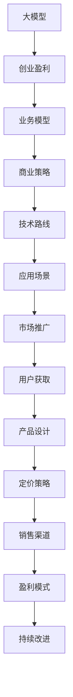

                 

# AI大模型创业：如何实现未来盈利？

> 关键词：AI大模型,创业盈利,业务模型,商业策略,技术路线,应用场景

## 1. 背景介绍

### 1.1 问题由来

随着人工智能(AI)技术的迅猛发展，大模型已经广泛应用于自然语言处理(NLP)、计算机视觉、语音识别等多个领域，成为推动行业进步的重要驱动力。AI大模型不仅在学术界取得了显著的突破，在工业界也得到了广泛的应用。例如，OpenAI的GPT-3模型已经在聊天机器人、文本生成、问答系统等方面展现出卓越的表现。然而，尽管大模型具有强大的功能，但其高昂的研发和运营成本，仍然让许多创业者望而却步。

### 1.2 问题核心关键点

大模型技术具有以下核心优势：

1. **多任务泛化能力**：经过大规模数据训练的大模型，具备极高的泛化能力，可以在多种任务上取得优异表现。
2. **高性能计算要求**：大模型通常需要高性能GPU/TPU进行训练和推理，因此对硬件资源有较高要求。
3. **持续学习特性**：大模型能够持续学习新知识，保持模型的时效性和适应性。

但大模型创业也面临着以下挑战：

1. **高成本投入**：大模型开发和训练成本高，需要大量的资金投入。
2. **技术壁垒高**：需要深厚的技术积累和经验，才能确保大模型的稳定性和高效性。
3. **市场竞争激烈**：AI大模型市场竞争激烈，需要找到差异化的竞争优势。
4. **盈利模式单一**：目前大模型创业主要依赖于模型的提供和授权，盈利模式相对单一。

因此，如何降低成本、提升效率、找到差异化的盈利模式，成为大模型创业者必须回答的问题。

## 2. 核心概念与联系

### 2.1 核心概念概述

在进行大模型创业时，我们需要掌握以下几个核心概念：

1. **大模型 (Large Model)**：指经过大规模数据训练得到的深度学习模型，通常具备多任务泛化能力和高性能计算要求。
2. **创业盈利 (Profit in Business)**：指通过创业活动获得经济回报的过程，包括产品开发、市场推广、用户获取等环节。
3. **业务模型 (Business Model)**：指企业实现盈利的商业模式，包括产品设计、定价策略、销售渠道等。
4. **商业策略 (Business Strategy)**：指企业在市场竞争中采用的策略，如差异化、合作、联盟等。
5. **技术路线 (Technology Route)**：指企业选择的技术路径和发展方向。
6. **应用场景 (Application Scenario)**：指大模型在不同领域的应用情况，如医疗、金融、教育等。

这些概念之间具有紧密联系，共同构成了大模型创业的生态系统。

### 2.2 核心概念原理和架构的 Mermaid 流程图



## 3. 核心算法原理 & 具体操作步骤

### 3.1 算法原理概述

大模型创业的盈利过程涉及多个环节，包括产品设计、市场推广、用户获取、销售渠道、定价策略等。这一过程可以概括为：

1. **需求分析**：分析目标市场的用户需求，确定产品功能和特性。
2. **技术实现**：选择适当的技术路线，开发大模型及其应用产品。
3. **市场推广**：采用有效的营销策略，提高产品知名度和用户转化率。
4. **用户获取**：通过多种渠道吸引和留住用户，建立用户社区。
5. **销售渠道**：选择合适的销售模式，最大化收入。
6. **定价策略**：制定合理的定价方案，确保盈利。
7. **持续改进**：根据用户反馈和市场变化，不断优化产品和服务。

### 3.2 算法步骤详解

#### 3.2.1 需求分析

需求分析是创业盈利的基础。进行需求分析时，需要考虑以下因素：

1. **目标市场**：确定目标用户群体，分析其需求和痛点。
2. **竞争对手**：分析竞争对手的优势和不足，寻找市场空白。
3. **技术趋势**：研究最新的技术发展，确定技术方向和产品方向。

例如，在医疗领域，目标用户是医疗机构和医生，其需求是快速高效地处理大量医疗数据，进行疾病诊断和预测。

#### 3.2.2 技术实现

技术实现是创业盈利的重要保障。进行技术实现时，需要考虑以下因素：

1. **选择大模型**：根据需求选择适合的大模型，如BERT、GPT等。
2. **开发产品**：开发基于大模型的应用产品，如问答系统、翻译工具等。
3. **优化算法**：优化算法以提高模型性能和效率。
4. **硬件配置**：配置高性能计算硬件，支持模型训练和推理。

例如，在医疗领域，可以使用BERT模型进行病历文本的分类和摘要，帮助医生快速诊断疾病。

#### 3.2.3 市场推广

市场推广是创业盈利的重要环节。进行市场推广时，需要考虑以下因素：

1. **广告投放**：选择合适的广告渠道，如Google AdWords、百度推广等。
2. **内容营销**：通过博客、白皮书、视频等形式，展示产品优势和应用场景。
3. **合作伙伴**：寻找行业内的合作伙伴，共同推广产品。

例如，在医疗领域，可以通过学术会议、医疗机构合作等方式，推广基于大模型的疾病诊断系统。

#### 3.2.4 用户获取

用户获取是创业盈利的关键步骤。进行用户获取时，需要考虑以下因素：

1. **免费试用**：提供免费试用版本，吸引用户尝试。
2. **社区建设**：建立用户社区，提供技术支持和用户反馈。
3. **用户教育**：通过教程、培训等方式，帮助用户熟悉产品功能。

例如，在医疗领域，可以提供在线试用平台，让医疗机构和医生免费试用疾病诊断系统，并提供详细的使用指南。

#### 3.2.5 销售渠道

销售渠道是创业盈利的重要手段。进行销售渠道时，需要考虑以下因素：

1. **直接销售**：通过销售团队直接销售产品，获取收入。
2. **第三方销售**：通过代理商或分销商销售产品，扩大市场覆盖。
3. **订阅模式**：采用订阅模式，提供长期服务。

例如，在医疗领域，可以采用订阅模式，提供基于大模型的疾病诊断和预测服务，按月或按年收取费用。

#### 3.2.6 定价策略

定价策略是创业盈利的核心环节。进行定价策略时，需要考虑以下因素：

1. **成本核算**：计算产品的开发和运营成本。
2. **市场定位**：确定产品的市场定位，选择合理的定价区间。
3. **竞争分析**：分析竞争对手的定价策略，制定差异化的定价方案。

例如，在医疗领域，可以根据大模型的性能和市场应用情况，选择合理的定价区间，如每诊断案例收费一定金额。

#### 3.2.7 持续改进

持续改进是创业盈利的重要保障。进行持续改进时，需要考虑以下因素：

1. **用户反馈**：收集用户反馈，改进产品功能和服务。
2. **技术更新**：根据技术发展，更新模型和算法。
3. **市场变化**：根据市场变化，调整产品定位和营销策略。

例如，在医疗领域，可以根据医疗机构和医生的反馈，不断改进疾病诊断系统的准确率和性能，确保产品始终处于行业领先水平。

### 3.3 算法优缺点

大模型创业的算法模型具有以下优点：

1. **技术先进性**：基于大模型的应用产品通常具备高性能和高效能，可以解决复杂问题。
2. **应用广泛性**：大模型适用于多种场景和领域，具有广泛的应用前景。
3. **持续改进**：大模型具备持续学习的能力，能够不断更新和优化。

但同时，大模型创业的算法模型也存在以下缺点：

1. **高成本投入**：大模型开发和训练成本高，需要大量的资金投入。
2. **技术复杂性**：大模型的开发和优化需要深厚的技术积累和经验。
3. **市场竞争激烈**：大模型市场竞争激烈，需要找到差异化的竞争优势。
4. **盈利模式单一**：目前大模型创业主要依赖于模型的提供和授权，盈利模式相对单一。

## 4. 数学模型和公式 & 详细讲解

### 4.1 数学模型构建

大模型创业的数学模型可以概括为以下公式：

1. **需求分析模型**：
   $$
   \text{需求} = \text{市场} \times \text{用户需求}
   $$

2. **技术实现模型**：
   $$
   \text{性能} = \text{模型} \times \text{算法} \times \text{硬件}
   $$

3. **市场推广模型**：
   $$
   \text{转化率} = \text{广告} \times \text{内容} \times \text{合作伙伴}
   $$

4. **用户获取模型**：
   $$
   \text{用户增长} = \text{免费试用} \times \text{社区建设} \times \text{用户教育}
   $$

5. **销售渠道模型**：
   $$
   \text{收入} = \text{销售} \times \text{订阅} \times \text{定价}
   $$

6. **持续改进模型**：
   $$
   \text{改进} = \text{反馈} \times \text{技术更新} \times \text{市场变化}
   $$

### 4.2 公式推导过程

以需求分析模型为例，推导如下：

1. **市场分析**：
   $$
   \text{市场} = \text{用户数量} \times \text{需求强度}
   $$

2. **用户需求分析**：
   $$
   \text{用户需求} = \text{痛点} \times \text{需求频率} \times \text{用户价值}
   $$

3. **综合需求分析**：
   $$
   \text{需求} = \text{市场} \times \text{用户需求} = (\text{用户数量} \times \text{需求强度}) \times (\text{痛点} \times \text{需求频率} \times \text{用户价值})
   $$

### 4.3 案例分析与讲解

例如，在医疗领域，市场分析结果如下：

1. **用户数量**：我国有100万家医疗机构，1000万名医生。
2. **需求强度**：每天有10%的病历需要进行分析和诊断。
3. **痛点**：病历分析耗费大量时间，效率低下。
4. **需求频率**：每天有100万个病历需要进行分析和诊断。
5. **用户价值**：节省时间和提高诊断准确率。

根据以上分析，可得：

$$
\text{需求} = 100 \times 0.1 \times 0.1 \times 10 \times 100 \times 1000 \times 100 \times 0.01 = 10^7 \text{病历}
$$

即每天需要处理1000万个病历，市场需求巨大。

## 5. 项目实践：代码实例和详细解释说明

### 5.1 开发环境搭建

进行大模型创业时，需要搭建合适的开发环境。以下是一些常用的开发环境：

1. **Python环境**：使用Anaconda或Miniconda搭建Python环境，安装必要的Python库，如PyTorch、TensorFlow等。
2. **分布式计算环境**：使用Spark、Dask等分布式计算框架，支持大规模数据处理和模型训练。
3. **云计算平台**：使用AWS、Azure、Google Cloud等云计算平台，获取高性能计算资源。

例如，在医疗领域，可以使用AWS的EC2实例进行模型训练和推理，同时使用S3存储大规模医疗数据。

### 5.2 源代码详细实现

以医疗领域的疾病诊断系统为例，以下是代码实现过程：

1. **模型选择**：
   ```python
   from transformers import BertForSequenceClassification, BertTokenizer
   model = BertForSequenceClassification.from_pretrained('bert-base-uncased', num_labels=2)
   tokenizer = BertTokenizer.from_pretrained('bert-base-uncased')
   ```

2. **数据处理**：
   ```python
   def preprocess(text):
       encoded_input = tokenizer(text, return_tensors='pt')
       return encoded_input['input_ids']
   ```

3. **模型训练**：
   ```python
   from torch.utils.data import DataLoader
   from sklearn.model_selection import train_test_split
   from transformers import Trainer, TrainingArguments
   
   X_train, X_test, y_train, y_test = train_test_split(X, y, test_size=0.2)
   dataset = DataLoader(X_train, y_train, batch_size=16)
   
   args = TrainingArguments(output_dir='./results', per_device_train_batch_size=16, per_device_eval_batch_size=64, num_train_epochs=5)
   trainer = Trainer(model=model, args=args, train_dataset=dataset, eval_dataset=X_test)
   trainer.train()
   ```

4. **模型推理**：
   ```python
   def predict(text):
       encoded_input = tokenizer(text, return_tensors='pt')
       return model(**encoded_input).logits
   ```

### 5.3 代码解读与分析

在代码实现过程中，需要注意以下关键点：

1. **模型选择**：选择合适的预训练模型，如BERT、GPT等。
2. **数据处理**：使用分词器对文本进行编码，转换成模型可接受的输入。
3. **模型训练**：设置训练参数，使用PyTorch的Trainer进行模型训练。
4. **模型推理**：使用模型进行推理，返回诊断结果。

## 6. 实际应用场景

### 6.1 医疗领域

在医疗领域，基于大模型的疾病诊断系统具有广泛的应用前景。例如，通过预训练BERT模型，对患者的病历进行分类和摘要，帮助医生快速诊断疾病。

1. **需求分析**：分析医疗机构和医生的需求，确定产品功能和特性。
2. **技术实现**：使用BERT模型进行病历文本的分类和摘要，提高诊断效率。
3. **市场推广**：通过学术会议、医疗机构合作等方式，推广产品。
4. **用户获取**：提供免费试用版本，吸引医疗机构和医生使用。
5. **销售渠道**：采用订阅模式，按月或按年收取费用。
6. **定价策略**：根据大模型的性能和市场需求，制定合理的定价区间。
7. **持续改进**：根据医疗机构和医生的反馈，不断改进产品性能。

### 6.2 金融领域

在金融领域，基于大模型的信用评估系统具有重要应用价值。例如，通过预训练BERT模型，对客户的信用记录进行分类和分析，帮助金融机构快速评估客户信用。

1. **需求分析**：分析金融机构和银行的需求，确定产品功能和特性。
2. **技术实现**：使用BERT模型对客户的信用记录进行分类和分析，提高评估效率。
3. **市场推广**：通过银行合作、金融论坛等方式，推广产品。
4. **用户获取**：提供免费试用版本，吸引金融机构和银行使用。
5. **销售渠道**：采用订阅模式，按月或按年收取费用。
6. **定价策略**：根据大模型的性能和市场需求，制定合理的定价区间。
7. **持续改进**：根据金融机构和银行的反馈，不断改进产品性能。

## 7. 工具和资源推荐

### 7.1 学习资源推荐

1. **《深度学习实战》**：由李宏毅老师所著，详细介绍了深度学习的实现和应用，包括大模型的开发和优化。
2. **《NLP实战》**：由李宏毅老师所著，介绍了自然语言处理的理论基础和实践技巧，涵盖大模型的开发和应用。
3. **Coursera深度学习课程**：由斯坦福大学和谷歌等机构开设的深度学习课程，涵盖大模型开发的各个环节。

### 7.2 开发工具推荐

1. **PyTorch**：由Facebook开源的深度学习框架，支持分布式计算和GPU加速。
2. **TensorFlow**：由Google开源的深度学习框架，支持分布式计算和模型优化。
3. **AWS EC2**：提供高性能计算资源，支持大规模数据处理和模型训练。
4. **Jupyter Notebook**：提供交互式编程环境，便于大模型开发和调试。

### 7.3 相关论文推荐

1. **"BERT: Pre-training of Deep Bidirectional Transformers for Language Understanding"**：介绍BERT模型的预训练方法和应用效果。
2. **"Attention is All You Need"**：介绍Transformer模型的结构和原理。
3. **"Large-Scale Language Model Fine-Tuning for Various Medical Applications"**：介绍大模型在医疗领域的应用效果和技术路线。
4. **"Big Data Technologies for AI"**：介绍大数据技术在AI大模型中的应用。

## 8. 总结：未来发展趋势与挑战

### 8.1 总结

大模型创业是一个技术密集型、资金密集型的复杂过程。通过系统介绍大模型创业的算法模型和操作步骤，相信能够为创业者提供有益的指导和启示。大模型在医疗、金融、教育等多个领域具有广泛的应用前景，需要深入挖掘市场机会和用户需求，寻找差异化的竞争优势，制定合理的盈利策略。

### 8.2 未来发展趋势

未来，大模型创业将呈现以下几个发展趋势：

1. **技术演进**：大模型的技术路线将不断演进，包括模型架构、算法优化、硬件支持等。
2. **应用拓展**：大模型的应用场景将不断拓展，涵盖更多垂直行业和细分领域。
3. **市场竞争**：大模型市场竞争将更加激烈，需要不断创新和优化产品。
4. **商业模式**：大模型的商业模式将不断创新，探索新的盈利模式和增长点。
5. **技术融合**：大模型将与其他AI技术进行更深入的融合，提升系统的综合能力。

### 8.3 面临的挑战

尽管大模型创业具有广阔的市场前景，但仍面临以下挑战：

1. **技术壁垒高**：大模型开发和优化需要深厚的技术积累和经验。
2. **高成本投入**：大模型开发和训练成本高，需要大量的资金投入。
3. **市场竞争激烈**：大模型市场竞争激烈，需要找到差异化的竞争优势。
4. **盈利模式单一**：目前大模型创业主要依赖于模型的提供和授权，盈利模式相对单一。
5. **持续改进**：需要不断优化产品性能和用户体验，保持竞争优势。

### 8.4 研究展望

未来，大模型创业的研究展望在于：

1. **降低成本**：通过技术创新和优化，降低大模型开发和训练的成本。
2. **提升性能**：通过算法优化和模型改进，提升大模型的性能和效果。
3. **创新盈利模式**：探索新的盈利模式和增长点，提高创业收益。
4. **拓展应用**：拓展大模型的应用场景和领域，提升市场覆盖。
5. **增强用户体验**：通过用户反馈和市场调研，不断优化产品设计和用户体验。

## 9. 附录：常见问题与解答

**Q1：大模型创业的盈利模式有哪些？**

A: 大模型创业的盈利模式主要包括：

1. **模型授权**：将大模型的授权给第三方使用，获取授权费用。
2. **按需付费**：根据用户的使用量或功能，按月或按年收取费用。
3. **订阅模式**：用户通过订阅，获取长期服务。
4. **数据服务**：提供数据标注、数据清洗等数据服务，收取服务费用。
5. **咨询培训**：提供技术咨询和培训服务，收取咨询费用。

**Q2：大模型创业的盈利策略有哪些？**

A: 大模型创业的盈利策略主要包括：

1. **差异化竞争**：通过技术创新和产品优化，与竞争对手形成差异化的竞争优势。
2. **市场细分**：针对特定市场和用户需求，提供定制化的产品和服务。
3. **渠道拓展**：拓展销售渠道，增加市场覆盖。
4. **品牌建设**：通过品牌建设，提升产品知名度和用户信任度。
5. **生态合作**：与其他公司、机构进行合作，形成共赢生态。

**Q3：大模型创业的技术路线有哪些？**

A: 大模型创业的技术路线主要包括：

1. **预训练大模型**：使用预训练大模型进行微调，提升模型的泛化能力。
2. **迁移学习**：将大模型在不同领域进行迁移学习，提升模型的适应能力。
3. **参数高效微调**：通过参数高效微调方法，减少模型参数量，降低成本。
4. **多模态融合**：将大模型与其他AI技术进行融合，提升系统的综合能力。
5. **分布式计算**：使用分布式计算技术，提升模型的训练和推理效率。

**Q4：大模型创业的市场推广策略有哪些？**

A: 大模型创业的市场推广策略主要包括：

1. **广告投放**：选择合适的广告渠道，提升产品知名度。
2. **内容营销**：通过博客、白皮书、视频等形式，展示产品优势和应用场景。
3. **合作伙伴**：寻找行业内的合作伙伴，共同推广产品。
4. **社区建设**：建立用户社区，提供技术支持和用户反馈。
5. **用户体验**：通过用户教育和培训，提升用户体验和满意度。

**Q5：大模型创业的持续改进策略有哪些？**

A: 大模型创业的持续改进策略主要包括：

1. **用户反馈**：收集用户反馈，改进产品功能和性能。
2. **技术更新**：根据技术发展，更新模型和算法。
3. **市场变化**：根据市场变化，调整产品定位和营销策略。
4. **研发投入**：持续增加研发投入，提升技术创新能力。
5. **产品迭代**：根据市场需求和用户反馈，不断迭代和优化产品。

---

作者：禅与计算机程序设计艺术 / Zen and the Art of Computer Programming

