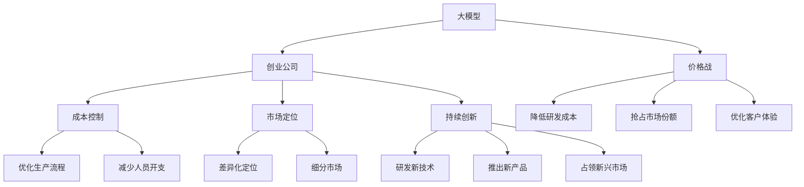

                 

# AI大模型创业：如何应对未来价格战？

在人工智能大模型快速发展的今天，从研究实验室走向创业市场已是大势所趋。然而，随着越来越多的公司加入这场AI大模型创业的热潮，市场的竞争日益激烈，价格战也随之而来。如何在这场激烈的市场竞争中，找到属于自己的路，是每个创业公司都必须认真思考的问题。本文将从大模型创业的各个环节入手，探讨如何应对未来可能的AI价格战，以期帮助创业公司成功突围，实现可持续发展。

## 1. 背景介绍

### 1.1 问题由来
随着人工智能技术的飞速发展，越来越多的创业公司开始转向大模型的开发和应用。这些大模型通常基于深度学习，能够处理大规模的自然语言数据，在文本分类、情感分析、对话系统、智能推荐等多个领域展现了显著的性能优势。然而，随着市场的逐步饱和，大模型的竞争也在不断加剧，价格战已悄然打响。

### 1.2 问题核心关键点
大模型价格战的背后，是创业公司如何平衡研发成本和市场收益的博弈。面对竞争激烈的AI市场，如何保持创新和降低成本，成为每个公司必须面对的问题。同时，价格战也可能引发一系列问题，如劣质竞争、市场规范缺失等，需要创业公司提前预防和应对。

## 2. 核心概念与联系

### 2.1 核心概念概述

为更好地理解AI大模型创业及其应对价格战的策略，本节将介绍几个密切相关的核心概念：

- 大模型（Large Model）：基于深度学习的超大规模模型，通常具有几十亿甚至上百亿个参数。能够处理和生成复杂文本，广泛应用于自然语言处理领域。
- 创业公司（Startup）：新成立的、致力于技术创新和商业化的人工智能公司。
- 价格战（Price War）：指竞争对手之间通过降价来争夺市场份额的行为。
- 成本控制（Cost Control）：指创业公司为降低经营成本而采取的各种措施。
- 市场定位（Market Positioning）：指创业公司根据自身优势，确定在市场中的位置，选择相应的市场策略。
- 持续创新（Sustained Innovation）：指创业公司持续投入研发，推出具有市场竞争力的新产品或服务。

这些核心概念之间的逻辑关系可以通过以下Mermaid流程图来展示：



这个流程图展示了大模型创业的主要环节及其应对价格战的策略：

1. 大模型作为创业公司的核心资产，提供技术支持。
2. 价格战会触发多个环节，如降低研发成本、抢占市场份额等。
3. 成本控制和市场定位有助于创业公司应对价格战，优化资源配置。
4. 持续创新是创业公司保持竞争力的关键，需要不断投入研发。

## 3. 核心算法原理 & 具体操作步骤

### 3.1 算法原理概述

AI大模型创业应对价格战的策略，本质上是通过优化成本、提升产品竞争力来保持市场份额。其核心思想是：在降低成本的同时，确保产品或服务的质量，进而抢占更多的市场份额，获得更高的收益。

具体来说，可以通过以下几个关键步骤来实现这一目标：

1. **成本优化**：通过优化生产流程、减少人员开支等措施，降低大模型的开发和维护成本。
2. **市场定位**：根据自身优势和市场需求，选择差异化的市场策略，避免直接陷入价格战。
3. **持续创新**：持续投入研发，推出具有市场竞争力的新产品或服务，保持产品优势。

### 3.2 算法步骤详解

基于上述思想，AI大模型创业应对价格战的具体操作步骤可以分为以下几个步骤：

**Step 1: 成本优化**
- **优化生产流程**：通过自动化、标准化、精益生产等手段，减少人力和时间成本，提升生产效率。
- **减少人员开支**：通过合理的人员配置和任务分工，避免资源浪费，降低人力资源成本。

**Step 2: 市场定位**
- **差异化定位**：根据自身的技术优势和市场需求，选择差异化的市场策略，避免直接与竞争对手的价格战。
- **细分市场**：瞄准特定的用户群体或垂直领域，提供定制化的产品或服务，满足特定需求。

**Step 3: 持续创新**
- **研发新技术**：持续投入研发，探索新的技术方向和应用场景，保持技术领先优势。
- **推出新产品**：根据市场需求和趋势，推出具有创新性和市场竞争力的新产品或服务，提升市场占有率。
- **占领新兴市场**：关注新兴技术领域和市场趋势，及时调整策略，抢占先机。

### 3.3 算法优缺点

**优点**：
1. **提升效率**：通过优化生产流程和人员配置，可以显著提升大模型的开发和维护效率。
2. **降低成本**：通过优化成本结构，可以降低研发和运营成本，提高公司盈利能力。
3. **增强竞争力**：通过持续创新，可以推出具有市场竞争力的新产品，提升市场份额。

**缺点**：
1. **风险高**：持续投入研发和市场开拓需要大量的资金和时间，风险较高。
2. **资源有限**：需要合理分配资源，避免过度投入某一环节，导致其他环节的资源短缺。
3. **市场变化快**：AI市场变化迅速，需要及时调整策略，保持灵活性。

### 3.4 算法应用领域

AI大模型创业应对价格战的策略，不仅适用于大模型开发和应用领域，还可以扩展到其他科技创业的多个环节。例如：

- **医疗健康**：通过优化生产流程和资源配置，降低医疗设备的研发和运营成本，提升产品竞争力。
- **智能家居**：通过差异化定位和持续创新，推出具有市场竞争力的智能家居产品，抢占市场份额。
- **自动驾驶**：通过优化生产流程和持续研发，提升自动驾驶技术的性能和可靠性，满足市场需求。
- **机器人**：通过降低生产成本和推出新产品，提升机器人的市场竞争力和用户满意度。

## 4. 数学模型和公式 & 详细讲解  
### 4.1 数学模型构建

为了更好地理解AI大模型创业及其应对价格战的策略，我们假设一个创业公司开发大模型所需的花费为 $C(x)$，市场接受的价格为 $P(x)$，公司每年的收入为 $R(x)$，利润为 $\Pi(x)$。则有：

$$
R(x) = P(x) \cdot x
$$

$$
\Pi(x) = R(x) - C(x)
$$

其中 $x$ 为公司投入的人力和时间资源。目标是最优化 $\Pi(x)$。

### 4.2 公式推导过程

为了求 $\Pi(x)$ 的最大值，我们需要对 $C(x)$ 和 $R(x)$ 进行分析。不失一般性，假设 $C(x)$ 和 $R(x)$ 都是关于 $x$ 的单调递增函数。则有：

$$
\frac{d\Pi(x)}{dx} = \frac{dR(x)}{dx} - \frac{dC(x)}{dx} = P(x) - C'(x)
$$

令 $\frac{d\Pi(x)}{dx} = 0$，得到：

$$
P(x) = C'(x)
$$

即当市场接受的价格等于公司研发成本的边际增长率时，公司的利润最大化。

### 4.3 案例分析与讲解

以下是一个简单的案例分析：

假设一家创业公司开发大模型需要投入1000个工程师工作一个月，成本为 $C(x) = 1000 \cdot x$。当公司投入1个月时，大模型的研发成本为 $C(1) = 1000$。市场接受的价格为 $P(x) = 1000x$。则公司每月的收入为 $R(x) = P(x) \cdot x = 1000x^2$，利润为 $\Pi(x) = R(x) - C(x) = 1000x^2 - 1000x$。

当 $x=1$ 时，即投入一个月，公司的利润为 $\Pi(1) = 1000 \cdot 1 - 1000 = 0$。此时公司处于盈亏平衡点。当 $x>1$ 时，即投入超过一个月，公司的利润将开始上升。如果市场接受的价格低于 $C'(x)$，公司将继续增加投入，直到达到最优投入 $x^*$。

## 5. 项目实践：代码实例和详细解释说明
### 5.1 开发环境搭建

在进行AI大模型创业和应对价格战的实践前，我们需要准备好开发环境。以下是使用Python进行PyTorch开发的环境配置流程：

1. 安装Anaconda：从官网下载并安装Anaconda，用于创建独立的Python环境。

2. 创建并激活虚拟环境：
```bash
conda create -n pytorch-env python=3.8 
conda activate pytorch-env
```

3. 安装PyTorch：根据CUDA版本，从官网获取对应的安装命令。例如：
```bash
conda install pytorch torchvision torchaudio cudatoolkit=11.1 -c pytorch -c conda-forge
```

4. 安装Transformers库：
```bash
pip install transformers
```

5. 安装各类工具包：
```bash
pip install numpy pandas scikit-learn matplotlib tqdm jupyter notebook ipython
```

完成上述步骤后，即可在`pytorch-env`环境中开始项目实践。

### 5.2 源代码详细实现

这里我们以开发一款基于大模型的智能客服系统为例，给出完整的代码实现。

首先，定义智能客服系统的数据处理函数：

```python
from transformers import BertTokenizer
from torch.utils.data import Dataset
import torch

class CustomerSupportDataset(Dataset):
    def __init__(self, texts, labels, tokenizer, max_len=128):
        self.texts = texts
        self.labels = labels
        self.tokenizer = tokenizer
        self.max_len = max_len
        
    def __len__(self):
        return len(self.texts)
    
    def __getitem__(self, item):
        text = self.texts[item]
        label = self.labels[item]
        
        encoding = self.tokenizer(text, return_tensors='pt', max_length=self.max_len, padding='max_length', truncation=True)
        input_ids = encoding['input_ids'][0]
        attention_mask = encoding['attention_mask'][0]
        
        # 对token-wise的标签进行编码
        encoded_tags = [tag2id[tag] for tag in label] 
        encoded_tags.extend([tag2id['O']] * (self.max_len - len(encoded_tags)))
        labels = torch.tensor(encoded_tags, dtype=torch.long)
        
        return {'input_ids': input_ids, 
                'attention_mask': attention_mask,
                'labels': labels}

# 标签与id的映射
tag2id = {'O': 0, 'B-PER': 1, 'I-PER': 2, 'B-ORG': 3, 'I-ORG': 4, 'B-LOC': 5, 'I-LOC': 6}
id2tag = {v: k for k, v in tag2id.items()}

# 创建dataset
tokenizer = BertTokenizer.from_pretrained('bert-base-cased')

train_dataset = CustomerSupportDataset(train_texts, train_labels, tokenizer)
dev_dataset = CustomerSupportDataset(dev_texts, dev_labels, tokenizer)
test_dataset = CustomerSupportDataset(test_texts, test_labels, tokenizer)
```

然后，定义模型和优化器：

```python
from transformers import BertForTokenClassification, AdamW

model = BertForTokenClassification.from_pretrained('bert-base-cased', num_labels=len(tag2id))

optimizer = AdamW(model.parameters(), lr=2e-5)
```

接着，定义训练和评估函数：

```python
from torch.utils.data import DataLoader
from tqdm import tqdm
from sklearn.metrics import classification_report

device = torch.device('cuda') if torch.cuda.is_available() else torch.device('cpu')
model.to(device)

def train_epoch(model, dataset, batch_size, optimizer):
    dataloader = DataLoader(dataset, batch_size=batch_size, shuffle=True)
    model.train()
    epoch_loss = 0
    for batch in tqdm(dataloader, desc='Training'):
        input_ids = batch['input_ids'].to(device)
        attention_mask = batch['attention_mask'].to(device)
        labels = batch['labels'].to(device)
        model.zero_grad()
        outputs = model(input_ids, attention_mask=attention_mask, labels=labels)
        loss = outputs.loss
        epoch_loss += loss.item()
        loss.backward()
        optimizer.step()
    return epoch_loss / len(dataloader)

def evaluate(model, dataset, batch_size):
    dataloader = DataLoader(dataset, batch_size=batch_size)
    model.eval()
    preds, labels = [], []
    with torch.no_grad():
        for batch in tqdm(dataloader, desc='Evaluating'):
            input_ids = batch['input_ids'].to(device)
            attention_mask = batch['attention_mask'].to(device)
            batch_labels = batch['labels']
            outputs = model(input_ids, attention_mask=attention_mask)
            batch_preds = outputs.logits.argmax(dim=2).to('cpu').tolist()
            batch_labels = batch_labels.to('cpu').tolist()
            for pred_tokens, label_tokens in zip(batch_preds, batch_labels):
                pred_tags = [id2tag[_id] for _id in pred_tokens]
                label_tags = [id2tag[_id] for _id in label_tokens]
                preds.append(pred_tags[:len(label_tags)])
                labels.append(label_tags)
                
    print(classification_report(labels, preds))
```

最后，启动训练流程并在测试集上评估：

```python
epochs = 5
batch_size = 16

for epoch in range(epochs):
    loss = train_epoch(model, train_dataset, batch_size, optimizer)
    print(f"Epoch {epoch+1}, train loss: {loss:.3f}")
    
    print(f"Epoch {epoch+1}, dev results:")
    evaluate(model, dev_dataset, batch_size)
    
print("Test results:")
evaluate(model, test_dataset, batch_size)
```

以上就是使用PyTorch对BERT进行智能客服系统微调的完整代码实现。可以看到，得益于Transformers库的强大封装，我们可以用相对简洁的代码完成BERT模型的加载和微调。

### 5.3 代码解读与分析

让我们再详细解读一下关键代码的实现细节：

**CustomerSupportDataset类**：
- `__init__`方法：初始化文本、标签、分词器等关键组件。
- `__len__`方法：返回数据集的样本数量。
- `__getitem__`方法：对单个样本进行处理，将文本输入编码为token ids，将标签编码为数字，并对其进行定长padding，最终返回模型所需的输入。

**tag2id和id2tag字典**：
- 定义了标签与数字id之间的映射关系，用于将token-wise的预测结果解码回真实的标签。

**训练和评估函数**：
- 使用PyTorch的DataLoader对数据集进行批次化加载，供模型训练和推理使用。
- 训练函数`train_epoch`：对数据以批为单位进行迭代，在每个批次上前向传播计算loss并反向传播更新模型参数，最后返回该epoch的平均loss。
- 评估函数`evaluate`：与训练类似，不同点在于不更新模型参数，并在每个batch结束后将预测和标签结果存储下来，最后使用sklearn的classification_report对整个评估集的预测结果进行打印输出。

**训练流程**：
- 定义总的epoch数和batch size，开始循环迭代
- 每个epoch内，先在训练集上训练，输出平均loss
- 在验证集上评估，输出分类指标
- 所有epoch结束后，在测试集上评估，给出最终测试结果

可以看到，PyTorch配合Transformers库使得BERT微调的代码实现变得简洁高效。开发者可以将更多精力放在数据处理、模型改进等高层逻辑上，而不必过多关注底层的实现细节。

## 6. 实际应用场景

### 6.1 智能客服系统

基于大语言模型微调的对话技术，可以广泛应用于智能客服系统的构建。传统客服往往需要配备大量人力，高峰期响应缓慢，且一致性和专业性难以保证。而使用微调后的对话模型，可以7x24小时不间断服务，快速响应客户咨询，用自然流畅的语言解答各类常见问题。

在技术实现上，可以收集企业内部的历史客服对话记录，将问题和最佳答复构建成监督数据，在此基础上对预训练对话模型进行微调。微调后的对话模型能够自动理解用户意图，匹配最合适的答案模板进行回复。对于客户提出的新问题，还可以接入检索系统实时搜索相关内容，动态组织生成回答。如此构建的智能客服系统，能大幅提升客户咨询体验和问题解决效率。

### 6.2 金融舆情监测

金融机构需要实时监测市场舆论动向，以便及时应对负面信息传播，规避金融风险。传统的人工监测方式成本高、效率低，难以应对网络时代海量信息爆发的挑战。基于大语言模型微调的文本分类和情感分析技术，为金融舆情监测提供了新的解决方案。

具体而言，可以收集金融领域相关的新闻、报道、评论等文本数据，并对其进行主题标注和情感标注。在此基础上对预训练语言模型进行微调，使其能够自动判断文本属于何种主题，情感倾向是正面、中性还是负面。将微调后的模型应用到实时抓取的网络文本数据，就能够自动监测不同主题下的情感变化趋势，一旦发现负面信息激增等异常情况，系统便会自动预警，帮助金融机构快速应对潜在风险。

### 6.3 个性化推荐系统

当前的推荐系统往往只依赖用户的历史行为数据进行物品推荐，无法深入理解用户的真实兴趣偏好。基于大语言模型微调技术，个性化推荐系统可以更好地挖掘用户行为背后的语义信息，从而提供更精准、多样的推荐内容。

在实践中，可以收集用户浏览、点击、评论、分享等行为数据，提取和用户交互的物品标题、描述、标签等文本内容。将文本内容作为模型输入，用户的后续行为（如是否点击、购买等）作为监督信号，在此基础上微调预训练语言模型。微调后的模型能够从文本内容中准确把握用户的兴趣点。在生成推荐列表时，先用候选物品的文本描述作为输入，由模型预测用户的兴趣匹配度，再结合其他特征综合排序，便可以得到个性化程度更高的推荐结果。

### 6.4 未来应用展望

随着大语言模型和微调方法的不断发展，基于微调范式将在更多领域得到应用，为传统行业带来变革性影响。

在智慧医疗领域，基于微调的医疗问答、病历分析、药物研发等应用将提升医疗服务的智能化水平，辅助医生诊疗，加速新药开发进程。

在智能教育领域，微调技术可应用于作业批改、学情分析、知识推荐等方面，因材施教，促进教育公平，提高教学质量。

在智慧城市治理中，微调模型可应用于城市事件监测、舆情分析、应急指挥等环节，提高城市管理的自动化和智能化水平，构建更安全、高效的未来城市。

此外，在企业生产、社会治理、文娱传媒等众多领域，基于大模型微调的人工智能应用也将不断涌现，为NLP技术带来全新的突破。随着预训练语言模型和微调方法的持续演进，相信NLP技术将在更广阔的应用领域大放异彩。

## 7. 工具和资源推荐
### 7.1 学习资源推荐

为了帮助开发者系统掌握大语言模型微调的理论基础和实践技巧，这里推荐一些优质的学习资源：

1. 《Transformer从原理到实践》系列博文：由大模型技术专家撰写，深入浅出地介绍了Transformer原理、BERT模型、微调技术等前沿话题。

2. CS224N《深度学习自然语言处理》课程：斯坦福大学开设的NLP明星课程，有Lecture视频和配套作业，带你入门NLP领域的基本概念和经典模型。

3. 《Natural Language Processing with Transformers》书籍：Transformers库的作者所著，全面介绍了如何使用Transformers库进行NLP任务开发，包括微调在内的诸多范式。

4. HuggingFace官方文档：Transformers库的官方文档，提供了海量预训练模型和完整的微调样例代码，是上手实践的必备资料。

5. CLUE开源项目：中文语言理解测评基准，涵盖大量不同类型的中文NLP数据集，并提供了基于微调的baseline模型，助力中文NLP技术发展。

通过对这些资源的学习实践，相信你一定能够快速掌握大语言模型微调的精髓，并用于解决实际的NLP问题。
###  7.2 开发工具推荐

高效的开发离不开优秀的工具支持。以下是几款用于大语言模型微调开发的常用工具：

1. PyTorch：基于Python的开源深度学习框架，灵活动态的计算图，适合快速迭代研究。大部分预训练语言模型都有PyTorch版本的实现。

2. TensorFlow：由Google主导开发的开源深度学习框架，生产部署方便，适合大规模工程应用。同样有丰富的预训练语言模型资源。

3. Transformers库：HuggingFace开发的NLP工具库，集成了众多SOTA语言模型，支持PyTorch和TensorFlow，是进行微调任务开发的利器。

4. Weights & Biases：模型训练的实验跟踪工具，可以记录和可视化模型训练过程中的各项指标，方便对比和调优。与主流深度学习框架无缝集成。

5. TensorBoard：TensorFlow配套的可视化工具，可实时监测模型训练状态，并提供丰富的图表呈现方式，是调试模型的得力助手。

6. Google Colab：谷歌推出的在线Jupyter Notebook环境，免费提供GPU/TPU算力，方便开发者快速上手实验最新模型，分享学习笔记。

合理利用这些工具，可以显著提升大语言模型微调任务的开发效率，加快创新迭代的步伐。

### 7.3 相关论文推荐

大语言模型和微调技术的发展源于学界的持续研究。以下是几篇奠基性的相关论文，推荐阅读：

1. Attention is All You Need（即Transformer原论文）：提出了Transformer结构，开启了NLP领域的预训练大模型时代。

2. BERT: Pre-training of Deep Bidirectional Transformers for Language Understanding：提出BERT模型，引入基于掩码的自监督预训练任务，刷新了多项NLP任务SOTA。

3. Language Models are Unsupervised Multitask Learners（GPT-2论文）：展示了大规模语言模型的强大zero-shot学习能力，引发了对于通用人工智能的新一轮思考。

4. Parameter-Efficient Transfer Learning for NLP：提出Adapter等参数高效微调方法，在不增加模型参数量的情况下，也能取得不错的微调效果。

5. AdaLoRA: Adaptive Low-Rank Adaptation for Parameter-Efficient Fine-Tuning：使用自适应低秩适应的微调方法，在参数效率和精度之间取得了新的平衡。

6. Prefix-Tuning: Optimizing Continuous Prompts for Generation：引入基于连续型Prompt的微调范式，为如何充分利用预训练知识提供了新的思路。

这些论文代表了大语言模型微调技术的发展脉络。通过学习这些前沿成果，可以帮助研究者把握学科前进方向，激发更多的创新灵感。

## 8. 总结：未来发展趋势与挑战

### 8.1 总结

本文对AI大模型创业及其应对价格战的策略进行了全面系统的介绍。首先阐述了AI大模型创业的背景和意义，明确了微调在拓展预训练模型应用、提升下游任务性能方面的独特价值。其次，从原理到实践，详细讲解了微调数学模型和操作步骤，给出了微调任务开发的完整代码实例。同时，本文还广泛探讨了微调方法在多个行业领域的应用前景，展示了微调范式的巨大潜力。此外，本文精选了微调技术的各类学习资源，力求为读者提供全方位的技术指引。

通过本文的系统梳理，可以看到，AI大模型创业及其应对价格战的策略具有重要实践意义。这些策略不仅适用于大模型开发和应用领域，还可以扩展到其他科技创业的多个环节。面向未来，持续创新、成本控制和市场定位是创业公司必须认真考虑的问题，只有这些方面齐头并进，才能真正在激烈的市场竞争中脱颖而出。

### 8.2 未来发展趋势

展望未来，AI大模型创业应对价格战的策略将呈现以下几个发展趋势：

1. 模型规模持续增大。随着算力成本的下降和数据规模的扩张，预训练语言模型的参数量还将持续增长。超大规模语言模型蕴含的丰富语言知识，有望支撑更加复杂多变的下游任务微调。

2. 微调方法日趋多样。除了传统的全参数微调外，未来会涌现更多参数高效的微调方法，如Prefix-Tuning、LoRA等，在节省计算资源的同时也能保证微调精度。

3. 持续学习成为常态。随着数据分布的不断变化，微调模型也需要持续学习新知识以保持性能。如何在不遗忘原有知识的同时，高效吸收新样本信息，将成为重要的研究课题。

4. 标注样本需求降低。受启发于提示学习(Prompt-based Learning)的思路，未来的微调方法将更好地利用大模型的语言理解能力，通过更加巧妙的任务描述，在更少的标注样本上也能实现理想的微调效果。

5. 资源优化更加高效。随着硬件设备的快速发展，AI大模型微调将更注重资源优化，如模型剪枝、量化加速等，提升大模型微调的效率和可扩展性。

6. 更加灵活和可控。未来的微调方法将更加注重灵活性和可控性，通过引入因果推断、博弈论等方法，提升系统的稳定性和鲁棒性。

以上趋势凸显了AI大模型微调技术的广阔前景。这些方向的探索发展，必将进一步提升大模型微调的性能和应用范围，为人工智能技术落地应用提供新的突破。

### 8.3 面临的挑战

尽管AI大模型微调技术已经取得了瞩目成就，但在迈向更加智能化、普适化应用的过程中，它仍面临着诸多挑战：

1. 标注成本瓶颈。虽然微调大大降低了标注数据的需求，但对于长尾应用场景，难以获得充足的高质量标注数据，成为制约微调性能的瓶颈。如何进一步降低微调对标注样本的依赖，将是一大难题。

2. 模型鲁棒性不足。当目标任务与预训练数据的分布差异较大时，微调的性能提升有限。对于测试样本的微小扰动，微调模型的预测也容易发生波动。如何提高微调模型的鲁棒性，避免灾难性遗忘，还需要更多理论和实践的积累。

3. 推理效率有待提高。大规模语言模型虽然精度高，但在实际部署时往往面临推理速度慢、内存占用大等效率问题。如何在保证性能的同时，简化模型结构，提升推理速度，优化资源占用，将是重要的优化方向。

4. 可解释性亟需加强。当前微调模型更像是"黑盒"系统，难以解释其内部工作机制和决策逻辑。对于医疗、金融等高风险应用，算法的可解释性和可审计性尤为重要。如何赋予微调模型更强的可解释性，将是亟待攻克的难题。

5. 安全性有待保障。预训练语言模型难免会学习到有偏见、有害的信息，通过微调传递到下游任务，产生误导性、歧视性的输出，给实际应用带来安全隐患。如何从数据和算法层面消除模型偏见，避免恶意用途，确保输出的安全性，也将是重要的研究课题。

6. 知识整合能力不足。现有的微调模型往往局限于任务内数据，难以灵活吸收和运用更广泛的先验知识。如何让微调过程更好地与外部知识库、规则库等专家知识结合，形成更加全面、准确的信息整合能力，还有很大的想象空间。

正视微调面临的这些挑战，积极应对并寻求突破，将是大语言模型微调走向成熟的必由之路。相信随着学界和产业界的共同努力，这些挑战终将一一被克服，AI大模型微调必将在构建人机协同的智能时代中扮演越来越重要的角色。

### 8.4 研究展望

面对大语言模型微调所面临的种种挑战，未来的研究需要在以下几个方面寻求新的突破：

1. 探索无监督和半监督微调方法。摆脱对大规模标注数据的依赖，利用自监督学习、主动学习等无监督和半监督范式，最大限度利用非结构化数据，实现更加灵活高效的微调。

2. 研究参数高效和计算高效的微调范式。开发更加参数高效的微调方法，在固定大部分预训练参数的同时，只更新极少量的任务相关参数。同时优化微调模型的计算图，减少前向传播和反向传播的资源消耗，实现更加轻量级、实时性的部署。

3. 融合因果和对比学习范式。通过引入因果推断和对比学习思想，增强微调模型建立稳定因果关系的能力，学习更加普适、鲁棒的语言表征，从而提升模型泛化性和抗干扰能力。

4. 引入更多先验知识。将符号化的先验知识，如知识图谱、逻辑规则等，与神经网络模型进行巧妙融合，引导微调过程学习更准确、合理的语言模型。同时加强不同模态数据的整合，实现视觉、语音等多模态信息与文本信息的协同建模。

5. 结合因果分析和博弈论工具。将因果分析方法引入微调模型，识别出模型决策的关键特征，增强输出解释的因果性和逻辑性。借助博弈论工具刻画人机交互过程，主动探索并规避模型的脆弱点，提高系统稳定性。

6. 纳入伦理道德约束。在模型训练目标中引入伦理导向的评估指标，过滤和惩罚有偏见、有害的输出倾向。同时加强人工干预和审核，建立模型行为的监管机制，确保输出符合人类价值观和伦理道德。

这些研究方向的探索，必将引领大语言模型微调技术迈向更高的台阶，为构建安全、可靠、可解释、可控的智能系统铺平道路。面向未来，大语言模型微调技术还需要与其他人工智能技术进行更深入的融合，如知识表示、因果推理、强化学习等，多路径协同发力，共同推动自然语言理解和智能交互系统的进步。只有勇于创新、敢于突破，才能不断拓展语言模型的边界，让智能技术更好地造福人类社会。

## 9. 附录：常见问题与解答

**Q1：AI大模型创业是否适用于所有行业？**

A: AI大模型创业不仅适用于高科技领域，如金融、医疗、智能制造等，同样可以应用于传统行业，如零售、物流、教育等。AI大模型的优势在于其强大的通用性，可以适应多种行业需求，提供智能化的解决方案。

**Q2：AI大模型创业面临的主要风险是什么？**

A: AI大模型创业的主要风险包括：
1. **市场风险**：新进入者众多，市场竞争激烈，容易陷入价格战。
2. **技术风险**：大模型和微调技术不断迭代，需要持续投入研发以保持技术领先。
3. **资源风险**：大模型开发和运营需要大量资金和时间，资源配置不当可能导致项目失败。
4. **伦理风险**：大模型可能学习到有偏见或有害的信息，输出影响用户和社会。

**Q3：AI大模型创业如何构建差异化的市场定位？**

A: 构建差异化的市场定位需要考虑以下几个方面：
1. **目标市场**：明确目标市场，了解客户需求和痛点。
2. **核心技术**：强调技术优势和创新点，如算法精度、处理速度等。
3. **应用场景**：展示大模型在不同场景下的应用效果和用户反馈。
4. **商业模式**：设计合理的商业模式，如SaaS、API服务等，降低客户使用门槛。
5. **品牌形象**：通过市场营销和品牌建设，树立公司品牌形象，增强市场认知度。

通过上述几个方面的综合考量，创业公司可以构建独特的市场定位，提升市场竞争力。

**Q4：AI大模型创业如何应对价格战？**

A: 应对价格战需要采取以下策略：
1. **差异化定位**：根据自身技术优势和市场需求，选择差异化的市场策略，避免直接与竞争对手的价格战。
2. **成本控制**：通过优化生产流程、减少人员开支等措施，降低研发和运营成本。
3. **持续创新**：持续投入研发，推出具有市场竞争力的新产品或服务，提升市场份额。
4. **品牌建设**：通过市场营销和品牌建设，增强品牌认知度和忠诚度，提升客户粘性。
5. **市场合作**：与行业内其他公司建立合作关系，共同开拓市场，实现资源共享。

这些策略可以帮助创业公司有效应对价格战，保持竞争优势。

**Q5：AI大模型创业如何提升用户满意度？**

A: 提升用户满意度需要从以下几个方面入手：
1. **用户体验**：提供简洁、易用的用户界面，增强用户使用体验。
2. **技术支持**：提供优质的技术支持和服务，解决用户在使用过程中遇到的问题。
3. **个性化推荐**：利用大模型分析用户行为，提供个性化推荐，提升用户满意度。
4. **用户反馈**：建立用户反馈机制，及时收集用户意见，优化产品和服务。
5. **社区建设**：建立用户社区，促进用户间的交流和分享，提升用户粘性和忠诚度。

通过以上措施，可以有效提升用户满意度，增强用户粘性和忠诚度。

---

作者：禅与计算机程序设计艺术 / Zen and the Art of Computer Programming

