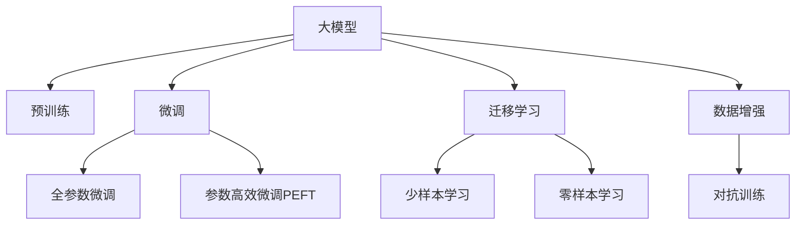

                 

## 1. 背景介绍

### 1.1 问题由来

随着人工智能技术的迅速发展，大模型（AI models）在各个领域的应用越来越广泛，从自然语言处理到计算机视觉，从自动驾驶到医疗诊断，AI大模型正在改变我们的生活方式。然而，这些模型的构建和训练需要海量数据，这对数据收集和处理提出了极大的挑战。

### 1.2 问题核心关键点

在AI大模型的创业中，数据挑战是首要考虑的问题。这些挑战包括：

- **数据获取难度**：获取高质量、多样化的数据集是构建高质量AI模型的基础，但实际操作中，数据获取往往需要耗费大量的时间和成本。
- **数据隐私保护**：在数据收集和存储过程中，如何保护用户隐私和数据安全是重要的伦理问题。
- **数据标注成本**：标注数据需要人工标注，成本高昂且耗时，特别是在自然语言处理、计算机视觉等领域。
- **数据质量控制**：标注数据的质量直接影响模型的训练效果，如何保证数据标注的准确性和一致性是关键问题。

## 2. 核心概念与联系

### 2.1 核心概念概述

为了更好地应对这些数据挑战，我们需要理解以下核心概念及其联系：

- **大模型**：以Transformer、BERT等深度学习模型为代表的大规模预训练语言模型。这些模型通过在大规模无标签文本语料上进行预训练，学习到通用的语言表示，具备强大的语言理解和生成能力。

- **预训练与微调**：预训练是指在大规模无标签文本语料上，通过自监督学习任务训练通用语言模型的过程。微调则是在预训练模型的基础上，使用下游任务的少量标注数据，通过有监督学习优化模型在特定任务上的性能。

- **迁移学习**：指将一个领域学习到的知识，迁移应用到另一个不同但相关的领域的学习范式。大模型的预训练-微调过程即是一种典型的迁移学习方式。

- **数据增强**：通过数据增强技术，如回译、近义替换等，扩充训练集，提高模型的泛化能力。

- **对抗训练**：在训练过程中引入对抗样本，提高模型的鲁棒性。

- **少样本学习与零样本学习**：在只有少量标注样本或没有标注样本的情况下，模型也能进行学习，减少对标注数据的依赖。

### 2.2 核心概念原理和架构的 Mermaid 流程图



这个流程图展示了大模型与预训练、微调等核心概念之间的关系，以及如何通过数据增强和对抗训练等技术提升模型的性能。

## 3. 核心算法原理 & 具体操作步骤

### 3.1 算法原理概述

在AI大模型的微调过程中，核心算法原理可以概括为以下几步：

1. **数据准备**：收集并处理下游任务的标注数据集，划分为训练集、验证集和测试集。
2. **模型初始化**：选择预训练语言模型，初始化模型参数。
3. **微调参数更新**：通过有监督的训练更新模型参数，最小化损失函数。
4. **性能评估**：在验证集和测试集上评估模型性能，调整参数。
5. **模型部署**：将训练好的模型部署到实际应用中。

### 3.2 算法步骤详解

#### 3.2.1 数据准备

1. **数据收集**：从互联网、公司内部系统、公开数据集等渠道收集数据，确保数据来源的多样性和代表性。
2. **数据清洗**：处理数据缺失、噪声、重复等问题，确保数据质量。
3. **数据标注**：对数据进行标注，生成训练样本和标签。标注过程应采用多种方式，如人工标注、机器学习等。

#### 3.2.2 模型初始化

1. **选择合适的预训练模型**：根据任务类型，选择适合的预训练语言模型，如BERT、GPT等。
2. **加载模型**：使用TensorFlow、PyTorch等深度学习框架加载预训练模型。

#### 3.2.3 微调参数更新

1. **设置超参数**：包括学习率、批大小、迭代轮数等。
2. **定义损失函数**：根据任务类型，选择合适的损失函数，如交叉熵损失、均方误差损失等。
3. **训练模型**：使用优化器（如Adam、SGD等）更新模型参数，最小化损失函数。

#### 3.2.4 性能评估

1. **验证集评估**：在验证集上评估模型性能，调整超参数。
2. **测试集评估**：在测试集上评估模型性能，输出最终结果。

#### 3.2.5 模型部署

1. **模型保存**：将训练好的模型保存到文件或数据库中。
2. **模型部署**：将模型集成到实际应用系统中，如网站、手机应用等。

### 3.3 算法优缺点

#### 3.3.1 优点

- **泛化能力强**：预训练模型学习到了通用的语言表示，具有较强的泛化能力。
- **数据依赖小**：在微调过程中，数据需求量相对较小，可以大幅减少数据标注成本。
- **训练速度快**：预训练模型的参数量较大，但微调过程只需更新少量参数，训练速度较快。

#### 3.3.2 缺点

- **模型偏见**：预训练模型的偏见可能通过微调传递到下游任务，造成负面影响。
- **过拟合风险**：微调过程中，数据量不足可能导致模型过拟合。
- **成本高昂**：预训练模型的训练需要大量计算资源，成本较高。

## 4. 数学模型和公式 & 详细讲解 & 举例说明

### 4.1 数学模型构建

在微调过程中，数学模型构建涉及以下关键步骤：

1. **输入表示**：将输入数据转换为模型可以处理的格式，如将文本转换为token ids。
2. **模型定义**：定义微调后的模型结构，通常为预训练模型顶层加上任务相关的输出层。
3. **损失函数定义**：根据任务类型，定义损失函数。
4. **优化目标**：最小化损失函数，更新模型参数。

### 4.2 公式推导过程

以二分类任务为例，公式推导过程如下：

1. **输入表示**：将输入文本转换为token ids，作为模型的输入。
2. **模型定义**：定义微调后的模型结构，包括预训练模型和任务相关的输出层。
3. **损失函数定义**：定义二分类交叉熵损失函数：

   $$
   \ell(M_{\theta}(x),y) = -[y\log \hat{y} + (1-y)\log (1-\hat{y})]
   $$

4. **优化目标**：最小化损失函数，更新模型参数：

   $$
   \theta \leftarrow \theta - \eta \nabla_{\theta}\mathcal{L}(\theta) - \eta\lambda\theta
   $$

其中，$M_{\theta}$为微调后的模型，$\theta$为模型参数，$\eta$为学习率，$\nabla_{\theta}\mathcal{L}(\theta)$为损失函数对参数$\theta$的梯度，$\lambda$为正则化系数。

### 4.3 案例分析与讲解

以情感分析任务为例，使用BERT模型进行微调：

1. **数据准备**：收集情感标注数据集，划分为训练集、验证集和测试集。
2. **模型初始化**：加载BERT模型，选择情感分析任务所需的输出层和损失函数。
3. **微调参数更新**：设置学习率为2e-5，使用AdamW优化器更新模型参数，最小化交叉熵损失。
4. **性能评估**：在验证集上评估模型性能，调整学习率。
5. **测试集评估**：在测试集上评估模型性能，输出情感分类结果。

## 5. 项目实践：代码实例和详细解释说明

### 5.1 开发环境搭建

1. **安装Python**：从官网下载并安装Python，安装Anaconda或Miniconda。
2. **创建虚拟环境**：使用conda创建虚拟环境，确保各个项目之间独立运行。
3. **安装深度学习框架**：使用conda安装TensorFlow、PyTorch等深度学习框架。
4. **安装数据处理库**：安装Pandas、NumPy、Scikit-learn等数据处理库。

### 5.2 源代码详细实现

以下是一个基于BERT模型的情感分析任务的微调代码实现：

```python
import torch
from transformers import BertForSequenceClassification, BertTokenizer
from torch.utils.data import DataLoader, Dataset
from torch.nn import CrossEntropyLoss
from sklearn.metrics import accuracy_score, precision_recall_fscore_support

class SentimentDataset(Dataset):
    def __init__(self, texts, labels, tokenizer, max_len):
        self.texts = texts
        self.labels = labels
        self.tokenizer = tokenizer
        self.max_len = max_len
    
    def __len__(self):
        return len(self.texts)
    
    def __getitem__(self, item):
        text = self.texts[item]
        label = self.labels[item]
        
        encoding = self.tokenizer(text, max_length=self.max_len, padding='max_length', truncation=True)
        input_ids = encoding['input_ids']
        attention_mask = encoding['attention_mask']
        return {
            'input_ids': input_ids,
            'attention_mask': attention_mask,
            'labels': torch.tensor([label], dtype=torch.long)
        }

tokenizer = BertTokenizer.from_pretrained('bert-base-cased')
train_dataset = SentimentDataset(train_texts, train_labels, tokenizer, max_len=128)
val_dataset = SentimentDataset(val_texts, val_labels, tokenizer, max_len=128)
test_dataset = SentimentDataset(test_texts, test_labels, tokenizer, max_len=128)

device = torch.device('cuda' if torch.cuda.is_available() else 'cpu')

model = BertForSequenceClassification.from_pretrained('bert-base-cased', num_labels=2)
model.to(device)
optimizer = torch.optim.AdamW(model.parameters(), lr=2e-5)
criterion = CrossEntropyLoss()

for epoch in range(3):
    model.train()
    loss_total = 0
    for batch in DataLoader(train_dataset, batch_size=16):
        input_ids = batch['input_ids'].to(device)
        attention_mask = batch['attention_mask'].to(device)
        labels = batch['labels'].to(device)
        
        outputs = model(input_ids, attention_mask=attention_mask)
        logits = outputs.logits
        loss = criterion(logits, labels)
        loss_total += loss.item()
        optimizer.zero_grad()
        loss.backward()
        optimizer.step()
        
    print(f'Epoch {epoch+1}, loss: {loss_total/len(train_dataset)}')

    model.eval()
    val_loss = 0
    correct = 0
    with torch.no_grad():
        for batch in DataLoader(val_dataset, batch_size=16):
            input_ids = batch['input_ids'].to(device)
            attention_mask = batch['attention_mask'].to(device)
            labels = batch['labels'].to(device)
            
            outputs = model(input_ids, attention_mask=attention_mask)
            logits = outputs.logits
            loss = criterion(logits, labels)
            val_loss += loss.item()
            predictions = torch.argmax(logits, dim=1)
            correct += (predictions == labels).sum().item()
            
    val_loss /= len(val_dataset)
    accuracy = correct / len(val_dataset)
    print(f'Epoch {epoch+1}, val loss: {val_loss:.4f}, val accuracy: {accuracy:.2f}')
```

### 5.3 代码解读与分析

**SentimentDataset类**：
- `__init__`方法：初始化数据集，包括文本、标签和分词器。
- `__len__`方法：返回数据集长度。
- `__getitem__`方法：处理单个样本，将文本输入转换为token ids，并进行padding。

**BertForSequenceClassification类**：
- `__init__`方法：初始化模型，包括输出层和损失函数。
- `to`方法：将模型迁移到指定设备（CPU或GPU）。

**训练与评估代码**：
- 使用PyTorch的DataLoader对数据集进行批次化加载。
- 在每个批次上，前向传播计算损失函数，反向传播更新模型参数。
- 在验证集上评估模型性能，调整学习率。

## 6. 实际应用场景

### 6.1 智能客服系统

智能客服系统可以通过微调大模型，构建高效、智能的客户服务解决方案。系统可以自动理解用户意图，生成自然流畅的回答，提升客户体验和满意度。

### 6.2 金融舆情监测

金融舆情监测系统可以通过微调大模型，实时监测市场舆情，识别风险，为金融机构提供预警服务。系统可以自动分析新闻、评论等文本内容，评估情感倾向，发现潜在风险。

### 6.3 个性化推荐系统

个性化推荐系统可以通过微调大模型，根据用户行为和偏好，生成个性化推荐内容。系统可以自动理解用户兴趣，推荐更符合用户需求的商品或内容。

### 6.4 未来应用展望

未来，大模型微调技术将在更多领域得到应用，为传统行业带来变革性影响。例如：

- 智慧医疗：微调大模型，用于辅助诊断、药物研发等，提升医疗服务的智能化水平。
- 智能教育：微调大模型，用于智能作业批改、知识推荐等，因材施教，促进教育公平。
- 智慧城市治理：微调大模型，用于城市事件监测、舆情分析等，提高城市管理的自动化和智能化水平。

## 7. 工具和资源推荐

### 7.1 学习资源推荐

- 《深度学习基础》书籍：介绍深度学习的基本概念和算法，适合入门学习。
- Coursera《深度学习专项课程》：斯坦福大学开设的深度学习课程，涵盖从基础到高级的深度学习知识。
- CS224N《深度学习自然语言处理》课程：斯坦福大学开设的NLP明星课程，涵盖NLP领域的基本概念和经典模型。
- 《自然语言处理综述》书籍：全面介绍NLP领域的最新进展和研究热点，适合深入学习。

### 7.2 开发工具推荐

- PyTorch：基于Python的开源深度学习框架，灵活易用，适合快速迭代研究。
- TensorFlow：由Google主导开发的深度学习框架，生产部署方便，适合大规模工程应用。
- Transformers库：HuggingFace开发的NLP工具库，集成了众多SOTA语言模型，支持PyTorch和TensorFlow，是微调任务开发的利器。
- Weights & Biases：模型训练的实验跟踪工具，可以记录和可视化模型训练过程中的各项指标，方便对比和调优。
- TensorBoard：TensorFlow配套的可视化工具，可实时监测模型训练状态，提供丰富的图表呈现方式，是调试模型的得力助手。

### 7.3 相关论文推荐

- Attention is All You Need：Transformer结构，标志着预训练大模型的崛起。
- BERT: Pre-training of Deep Bidirectional Transformers for Language Understanding：BERT模型的提出，刷新了多项NLP任务SOTA。
- Parameter-Efficient Transfer Learning for NLP：提出Adapter等参数高效微调方法，节省计算资源。

## 8. 总结：未来发展趋势与挑战

### 8.1 研究成果总结

大模型微调技术已经广泛应用于NLP领域，取得了一系列重要成果。未来，该技术将在更多领域得到应用，为传统行业带来变革性影响。

### 8.2 未来发展趋势

1. **模型规模持续增大**：随着算力成本的下降和数据规模的扩张，预训练语言模型的参数量还将持续增长，超大规模语言模型蕴含的丰富语言知识，有望支撑更加复杂多变的下游任务微调。
2. **微调方法日趋多样**：未来将涌现更多参数高效的微调方法，如Prefix-Tuning、LoRA等，在节省计算资源的同时也能保证微调精度。
3. **持续学习成为常态**：随着数据分布的不断变化，微调模型也需要持续学习新知识以保持性能。如何在不遗忘原有知识的同时，高效吸收新样本信息，将是重要的研究课题。
4. **少样本学习与零样本学习**：未来的微调方法将更好地利用大模型的语言理解能力，通过更加巧妙的任务描述，在更少的标注样本上也能实现理想的微调效果。
5. **多模态微调崛起**：将符号化的先验知识，如知识图谱、逻辑规则等，与神经网络模型进行巧妙融合，引导微调过程学习更准确、合理的语言模型。同时加强不同模态数据的整合，实现视觉、语音等多模态信息与文本信息的协同建模。

### 8.3 面临的挑战

1. **数据获取难度**：获取高质量、多样化的数据集是构建高质量AI模型的基础，但实际操作中，数据获取往往需要耗费大量的时间和成本。
2. **数据隐私保护**：在数据收集和存储过程中，如何保护用户隐私和数据安全是重要的伦理问题。
3. **数据标注成本**：标注数据需要人工标注，成本高昂且耗时，特别是在自然语言处理、计算机视觉等领域。
4. **数据质量控制**：标注数据的质量直接影响模型的训练效果，如何保证数据标注的准确性和一致性是关键问题。

### 8.4 研究展望

1. **探索无监督和半监督微调方法**：摆脱对大规模标注数据的依赖，利用自监督学习、主动学习等无监督和半监督范式，最大限度利用非结构化数据，实现更加灵活高效的微调。
2. **研究参数高效和计算高效的微调范式**：开发更加参数高效的微调方法，在固定大部分预训练参数的同时，只更新极少量的任务相关参数。同时优化微调模型的计算图，减少前向传播和反向传播的资源消耗，实现更加轻量级、实时性的部署。
3. **引入因果分析和博弈论工具**：将因果分析方法引入微调模型，识别出模型决策的关键特征，增强输出解释的因果性和逻辑性。借助博弈论工具刻画人机交互过程，主动探索并规避模型的脆弱点，提高系统稳定性。
4. **纳入伦理道德约束**：在模型训练目标中引入伦理导向的评估指标，过滤和惩罚有偏见、有害的输出倾向。同时加强人工干预和审核，建立模型行为的监管机制，确保输出符合人类价值观和伦理道德。

## 9. 附录：常见问题与解答

**Q1：大模型微调是否适用于所有NLP任务？**

A: 大模型微调在大多数NLP任务上都能取得不错的效果，特别是对于数据量较小的任务。但对于一些特定领域的任务，如医学、法律等，仅仅依靠通用语料预训练的模型可能难以很好地适应。此时需要在特定领域语料上进一步预训练，再进行微调，才能获得理想效果。此外，对于一些需要时效性、个性化很强的任务，如对话、推荐等，微调方法也需要针对性的改进优化。

**Q2：微调过程中如何选择合适的学习率？**

A: 微调的学习率一般要比预训练时小1-2个数量级，如果使用过大的学习率，容易破坏预训练权重，导致过拟合。一般建议从1e-5开始调参，逐步减小学习率，直至收敛。也可以使用warmup策略，在开始阶段使用较小的学习率，再逐渐过渡到预设值。需要注意的是，不同的优化器(如AdamW、Adafactor等)以及不同的学习率调度策略，可能需要设置不同的学习率阈值。

**Q3：采用大模型微调时会面临哪些资源瓶颈？**

A: 目前主流的预训练大模型动辄以亿计的参数规模，对算力、内存、存储都提出了很高的要求。GPU/TPU等高性能设备是必不可少的，但即便如此，超大批次的训练和推理也可能遇到显存不足的问题。因此需要采用一些资源优化技术，如梯度积累、混合精度训练、模型并行等，来突破硬件瓶颈。同时，模型的存储和读取也可能占用大量时间和空间，需要采用模型压缩、稀疏化存储等方法进行优化。

**Q4：如何缓解微调过程中的过拟合问题？**

A: 过拟合是微调面临的主要挑战，尤其是在标注数据不足的情况下。常见的缓解策略包括：
1. 数据增强：通过回译、近义替换等方式扩充训练集
2. 正则化：使用L2正则、Dropout、Early Stopping等避免过拟合
3. 对抗训练：引入对抗样本，提高模型鲁棒性
4. 参数高效微调：只调整少量参数(如Adapter、Prefix等)，减小过拟合风险
5. 多模型集成：训练多个微调模型，取平均输出，抑制过拟合

这些策略往往需要根据具体任务和数据特点进行灵活组合。只有在数据、模型、训练、推理等各环节进行全面优化，才能最大限度地发挥大模型微调的威力。

**Q5：微调模型在落地部署时需要注意哪些问题？**

A: 将微调模型转化为实际应用，还需要考虑以下因素：
1. 模型裁剪：去除不必要的层和参数，减小模型尺寸，加快推理速度
2. 量化加速：将浮点模型转为定点模型，压缩存储空间，提高计算效率
3. 服务化封装：将模型封装为标准化服务接口，便于集成调用
4. 弹性伸缩：根据请求流量动态调整资源配置，平衡服务质量和成本
5. 监控告警：实时采集系统指标，设置异常告警阈值，确保服务稳定性
6. 安全防护：采用访问鉴权、数据脱敏等措施，保障数据和模型安全

大模型微调为NLP应用开启了广阔的想象空间，但如何将强大的性能转化为稳定、高效、安全的业务价值，还需要工程实践的不断打磨。唯有从数据、算法、工程、业务等多个维度协同发力，才能真正实现人工智能技术在垂直行业的规模化落地。总之，微调需要开发者根据具体任务，不断迭代和优化模型、数据和算法，方能得到理想的效果。

---

作者：禅与计算机程序设计艺术 / Zen and the Art of Computer Programming

