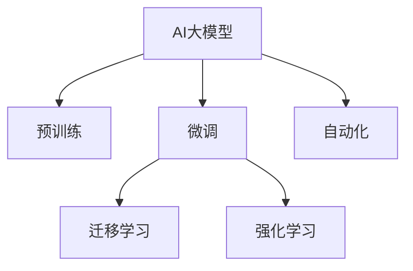

                 

# AI大模型创业：如何打造未来爆款应用？

> 关键词：AI大模型,创业,应用开发,自然语言处理(NLP),计算机视觉(CV),强化学习(Reinforcement Learning),自动化,创业案例

## 1. 背景介绍

### 1.1 问题由来

随着人工智能(AI)技术的迅猛发展，AI大模型正成为创业和技术创新的核心驱动力。AI大模型通过预训练获得广泛的知识和能力，可以在多个领域内进行快速微调，生成新的创新应用，驱动新兴产业的崛起。然而，如何高效地构建和管理AI大模型，打造有竞争力的应用，并成功商业模式化，仍然是一个复杂且充满挑战的问题。

### 1.2 问题核心关键点

当前AI大模型创业中，核心关键点包括：

- **数据获取与标注**：大模型需要海量高质量数据进行预训练和微调，数据获取和标注成本高且耗时。
- **模型选择与优化**：选择合适的预训练模型，并进行高效的参数调整和优化，以提升模型性能。
- **应用开发与部署**：将大模型封装成易于使用、性能优异的应用，并实现高效的部署和集成。
- **业务变现与商业模式**：基于AI大模型构建具有市场竞争力的产品和服务，形成可行的商业模式。

### 1.3 问题研究意义

研究如何高效构建和管理AI大模型，打造未来爆款应用，对于推动AI技术的普及和产业化，加速新兴产业的发展，具有重要意义：

1. **降低技术门槛**：通过合理的模型选择和应用开发，使得AI大模型变得易于使用，降低了技术门槛，促进了技术在各行业的应用。
2. **提升应用效果**：通过对大模型的微调和优化，提升应用在特定场景下的效果，满足用户需求。
3. **推动产业升级**：基于大模型开发的高效、智能应用，推动各行业的数字化转型和产业升级。
4. **加速商业变现**：通过形成合理的商业模式，将AI技术商业化，实现技术与经济的良性循环。

## 2. 核心概念与联系

### 2.1 核心概念概述

为更好地理解AI大模型在创业中的构建和管理，本节将介绍几个密切相关的核心概念：

- **AI大模型(AI Large Models)**：以深度神经网络为代表，通过大规模数据进行预训练，具备广泛知识的大规模模型。
- **预训练(Pre-training)**：在大规模无标签数据上进行自监督学习，获得通用知识表示。
- **微调(Fine-tuning)**：在预训练模型的基础上，使用少量标注数据进行有监督学习，适应特定任务。
- **迁移学习(Transfer Learning)**：利用预训练模型在不同任务间的迁移能力，提升新任务效果。
- **强化学习(Reinforcement Learning)**：通过与环境交互，不断优化模型行为，实现智能决策。
- **自动化(Automation)**：将AI大模型嵌入自动化流程中，实现自动化应用。

这些概念之间的逻辑关系可以通过以下Mermaid流程图来展示：



### 2.2 核心概念原理和架构

AI大模型的核心原理基于神经网络结构，通过多层非线性变换，学习数据的复杂表示。预训练阶段，模型在大规模无标签数据上自监督学习，学习到数据的通用表示。微调阶段，在预训练模型的基础上，使用少量标注数据进行有监督学习，优化模型在特定任务上的表现。迁移学习利用预训练模型的迁移能力，在不同任务间进行知识迁移。强化学习通过与环境交互，不断优化模型行为，实现智能决策。自动化则将AI大模型嵌入自动化流程中，实现高效、可控的应用。

## 3. 核心算法原理 & 具体操作步骤
### 3.1 算法原理概述

AI大模型的构建和管理，主要涉及预训练、微调、迁移学习等核心算法。其核心思想是：通过大规模数据预训练，学习到通用知识表示，然后在特定任务上微调，提升模型在特定任务上的表现，并实现知识迁移和智能决策。

### 3.2 算法步骤详解

AI大模型的构建和管理步骤如下：

**Step 1: 准备数据和标注**
- 收集大规模无标签数据，进行预训练。
- 收集特定任务的高质量标注数据，进行微调。

**Step 2: 选择预训练模型**
- 根据任务类型选择合适的预训练模型，如BERT、GPT等。

**Step 3: 进行预训练**
- 在无标签数据上进行预训练，获得通用知识表示。

**Step 4: 进行微调**
- 在标注数据上进行有监督学习，优化模型在特定任务上的表现。
- 使用迁移学习，利用预训练模型的迁移能力，提升新任务效果。

**Step 5: 进行强化学习**
- 在实际环境中进行强化学习，不断优化模型行为，实现智能决策。

**Step 6: 实现自动化**
- 将AI大模型嵌入自动化流程中，实现高效、可控的应用。

### 3.3 算法优缺点

AI大模型构建和管理的主要优点包括：

- **通用性**：预训练模型在多个任务上具有通用性，通过微调和迁移学习，可以适应多种应用场景。
- **可扩展性**：通过添加新的任务和数据，不断扩展AI大模型的能力。
- **自动化**：AI大模型嵌入自动化流程中，能够实现高效、可控的应用。

同时，AI大模型的构建和管理也存在一些缺点：

- **数据需求高**：构建和微调AI大模型需要大量高质量数据，数据获取和标注成本高。
- **计算资源消耗大**：大规模模型的训练和推理需要大量的计算资源。
- **可解释性不足**：AI大模型的决策过程难以解释，缺乏透明性。

### 3.4 算法应用领域

AI大模型在多个领域得到了广泛应用，包括但不限于：

- **自然语言处理(NLP)**：文本分类、情感分析、机器翻译、问答系统等。
- **计算机视觉(CV)**：图像识别、目标检测、图像生成、视频分析等。
- **强化学习**：游戏AI、机器人控制、自动驾驶等。
- **自动化**：智能客服、自动化生产线、自动化设计等。

## 4. 数学模型和公式 & 详细讲解 & 举例说明

### 4.1 数学模型构建

AI大模型的核心数学模型包括：

- **预训练模型**：如BERT、GPT等，通过自监督学习任务进行训练。
- **微调模型**：在预训练模型的基础上，添加任务相关的输出层和损失函数，使用标注数据进行训练。

以BERT模型为例，其预训练目标函数为：

$$
\mathcal{L}_{pre} = -\frac{1}{N}\sum_{i=1}^N \log \sigma(\text{MLP}(h_i))
$$

其中，$h_i$ 表示输入的上下文向量，$\sigma$ 为sigmoid函数，$\text{MLP}$ 为多层次感知机。

### 4.2 公式推导过程

以BERT模型为例，其预训练过程可以表示为：

1. 对输入的句子 $x$ 进行分词和嵌入。
2. 对输入的词嵌入向量进行遮掩，保留部分词向量。
3. 对遮掩后的词向量进行多层变换，得到上下文向量 $h_i$。
4. 将上下文向量输入多层次感知机，得到预测向量 $\text{MLP}(h_i)$。
5. 计算预测向量与真实标签的交叉熵损失，得到预训练目标函数 $\mathcal{L}_{pre}$。

### 4.3 案例分析与讲解

以情感分析任务为例，其微调模型可以表示为：

1. 对输入的句子 $x$ 进行分词和嵌入。
2. 对输入的词嵌入向量进行遮掩，保留部分词向量。
3. 对遮掩后的词向量进行多层变换，得到上下文向量 $h_i$。
4. 将上下文向量输入到全连接层，得到预测向量 $\text{FC}(h_i)$。
5. 将预测向量与真实标签进行交叉熵损失计算，得到微调目标函数 $\mathcal{L}_{fin}$。

## 5. 项目实践：代码实例和详细解释说明

### 5.1 开发环境搭建

在进行AI大模型的构建和管理实践前，我们需要准备好开发环境。以下是使用Python进行PyTorch开发的环境配置流程：

1. 安装Anaconda：从官网下载并安装Anaconda，用于创建独立的Python环境。

2. 创建并激活虚拟环境：
```bash
conda create -n pytorch-env python=3.8 
conda activate pytorch-env
```

3. 安装PyTorch：根据CUDA版本，从官网获取对应的安装命令。例如：
```bash
conda install pytorch torchvision torchaudio cudatoolkit=11.1 -c pytorch -c conda-forge
```

4. 安装Transformers库：
```bash
pip install transformers
```

5. 安装各类工具包：
```bash
pip install numpy pandas scikit-learn matplotlib tqdm jupyter notebook ipython
```

完成上述步骤后，即可在`pytorch-env`环境中开始AI大模型的构建和管理实践。

### 5.2 源代码详细实现

下面我们以情感分析任务为例，给出使用Transformers库对BERT模型进行微调的PyTorch代码实现。

首先，定义情感分析任务的数据处理函数：

```python
from transformers import BertTokenizer
from torch.utils.data import Dataset
import torch

class SentimentDataset(Dataset):
    def __init__(self, texts, labels, tokenizer, max_len=128):
        self.texts = texts
        self.labels = labels
        self.tokenizer = tokenizer
        self.max_len = max_len
        
    def __len__(self):
        return len(self.texts)
    
    def __getitem__(self, item):
        text = self.texts[item]
        label = self.labels[item]
        
        encoding = self.tokenizer(text, return_tensors='pt', max_length=self.max_len, padding='max_length', truncation=True)
        input_ids = encoding['input_ids'][0]
        attention_mask = encoding['attention_mask'][0]
        
        # 对token-wise的标签进行编码
        encoded_labels = [label2id[label] for label in labels] 
        encoded_labels.extend([label2id['O']] * (self.max_len - len(encoded_labels)))
        labels = torch.tensor(encoded_labels, dtype=torch.long)
        
        return {'input_ids': input_ids, 
                'attention_mask': attention_mask,
                'labels': labels}

# 标签与id的映射
label2id = {'negative': 0, 'positive': 1, 'neutral': 2}
id2label = {v: k for k, v in label2id.items()}

# 创建dataset
tokenizer = BertTokenizer.from_pretrained('bert-base-cased')

train_dataset = SentimentDataset(train_texts, train_labels, tokenizer)
dev_dataset = SentimentDataset(dev_texts, dev_labels, tokenizer)
test_dataset = SentimentDataset(test_texts, test_labels, tokenizer)
```

然后，定义模型和优化器：

```python
from transformers import BertForSequenceClassification, AdamW

model = BertForSequenceClassification.from_pretrained('bert-base-cased', num_labels=len(label2id))

optimizer = AdamW(model.parameters(), lr=2e-5)
```

接着，定义训练和评估函数：

```python
from torch.utils.data import DataLoader
from tqdm import tqdm
from sklearn.metrics import classification_report

device = torch.device('cuda') if torch.cuda.is_available() else torch.device('cpu')
model.to(device)

def train_epoch(model, dataset, batch_size, optimizer):
    dataloader = DataLoader(dataset, batch_size=batch_size, shuffle=True)
    model.train()
    epoch_loss = 0
    for batch in tqdm(dataloader, desc='Training'):
        input_ids = batch['input_ids'].to(device)
        attention_mask = batch['attention_mask'].to(device)
        labels = batch['labels'].to(device)
        model.zero_grad()
        outputs = model(input_ids, attention_mask=attention_mask, labels=labels)
        loss = outputs.loss
        epoch_loss += loss.item()
        loss.backward()
        optimizer.step()
    return epoch_loss / len(dataloader)

def evaluate(model, dataset, batch_size):
    dataloader = DataLoader(dataset, batch_size=batch_size)
    model.eval()
    preds, labels = [], []
    with torch.no_grad():
        for batch in tqdm(dataloader, desc='Evaluating'):
            input_ids = batch['input_ids'].to(device)
            attention_mask = batch['attention_mask'].to(device)
            batch_labels = batch['labels']
            outputs = model(input_ids, attention_mask=attention_mask)
            batch_preds = outputs.logits.argmax(dim=1).to('cpu').tolist()
            batch_labels = batch_labels.to('cpu').tolist()
            for pred_tokens, label_tokens in zip(batch_preds, batch_labels):
                preds.append(pred_tokens)
                labels.append(label_tokens)
                
    print(classification_report(labels, preds))
```

最后，启动训练流程并在测试集上评估：

```python
epochs = 5
batch_size = 16

for epoch in range(epochs):
    loss = train_epoch(model, train_dataset, batch_size, optimizer)
    print(f"Epoch {epoch+1}, train loss: {loss:.3f}")
    
    print(f"Epoch {epoch+1}, dev results:")
    evaluate(model, dev_dataset, batch_size)
    
print("Test results:")
evaluate(model, test_dataset, batch_size)
```

以上就是使用PyTorch对BERT进行情感分析任务微调的完整代码实现。可以看到，得益于Transformers库的强大封装，我们可以用相对简洁的代码完成BERT模型的加载和微调。

### 5.3 代码解读与分析

让我们再详细解读一下关键代码的实现细节：

**SentimentDataset类**：
- `__init__`方法：初始化文本、标签、分词器等关键组件。
- `__len__`方法：返回数据集的样本数量。
- `__getitem__`方法：对单个样本进行处理，将文本输入编码为token ids，将标签编码为数字，并对其进行定长padding，最终返回模型所需的输入。

**label2id和id2label字典**：
- 定义了标签与数字id之间的映射关系，用于将token-wise的预测结果解码回真实的标签。

**训练和评估函数**：
- 使用PyTorch的DataLoader对数据集进行批次化加载，供模型训练和推理使用。
- 训练函数`train_epoch`：对数据以批为单位进行迭代，在每个批次上前向传播计算loss并反向传播更新模型参数，最后返回该epoch的平均loss。
- 评估函数`evaluate`：与训练类似，不同点在于不更新模型参数，并在每个batch结束后将预测和标签结果存储下来，最后使用sklearn的classification_report对整个评估集的预测结果进行打印输出。

**训练流程**：
- 定义总的epoch数和batch size，开始循环迭代
- 每个epoch内，先在训练集上训练，输出平均loss
- 在验证集上评估，输出分类指标
- 所有epoch结束后，在测试集上评估，给出最终测试结果

可以看到，PyTorch配合Transformers库使得BERT微调的代码实现变得简洁高效。开发者可以将更多精力放在数据处理、模型改进等高层逻辑上，而不必过多关注底层的实现细节。

当然，工业级的系统实现还需考虑更多因素，如模型的保存和部署、超参数的自动搜索、更灵活的任务适配层等。但核心的微调范式基本与此类似。

## 6. 实际应用场景
### 6.1 智能客服系统

基于AI大模型微调的对话技术，可以广泛应用于智能客服系统的构建。传统客服往往需要配备大量人力，高峰期响应缓慢，且一致性和专业性难以保证。而使用微调后的对话模型，可以7x24小时不间断服务，快速响应客户咨询，用自然流畅的语言解答各类常见问题。

在技术实现上，可以收集企业内部的历史客服对话记录，将问题和最佳答复构建成监督数据，在此基础上对预训练对话模型进行微调。微调后的对话模型能够自动理解用户意图，匹配最合适的答案模板进行回复。对于客户提出的新问题，还可以接入检索系统实时搜索相关内容，动态组织生成回答。如此构建的智能客服系统，能大幅提升客户咨询体验和问题解决效率。

### 6.2 金融舆情监测

金融机构需要实时监测市场舆论动向，以便及时应对负面信息传播，规避金融风险。传统的人工监测方式成本高、效率低，难以应对网络时代海量信息爆发的挑战。基于AI大模型微调的文本分类和情感分析技术，为金融舆情监测提供了新的解决方案。

具体而言，可以收集金融领域相关的新闻、报道、评论等文本数据，并对其进行主题标注和情感标注。在此基础上对预训练语言模型进行微调，使其能够自动判断文本属于何种主题，情感倾向是正面、中性还是负面。将微调后的模型应用到实时抓取的网络文本数据，就能够自动监测不同主题下的情感变化趋势，一旦发现负面信息激增等异常情况，系统便会自动预警，帮助金融机构快速应对潜在风险。

### 6.3 个性化推荐系统

当前的推荐系统往往只依赖用户的历史行为数据进行物品推荐，无法深入理解用户的真实兴趣偏好。基于AI大模型微调技术，个性化推荐系统可以更好地挖掘用户行为背后的语义信息，从而提供更精准、多样的推荐内容。

在实践中，可以收集用户浏览、点击、评论、分享等行为数据，提取和用户交互的物品标题、描述、标签等文本内容。将文本内容作为模型输入，用户的后续行为（如是否点击、购买等）作为监督信号，在此基础上微调预训练语言模型。微调后的模型能够从文本内容中准确把握用户的兴趣点。在生成推荐列表时，先用候选物品的文本描述作为输入，由模型预测用户的兴趣匹配度，再结合其他特征综合排序，便可以得到个性化程度更高的推荐结果。

### 6.4 未来应用展望

随着AI大模型和微调方法的不断发展，基于微调范式将在更多领域得到应用，为传统行业带来变革性影响。

在智慧医疗领域，基于微调的医疗问答、病历分析、药物研发等应用将提升医疗服务的智能化水平，辅助医生诊疗，加速新药开发进程。

在智能教育领域，微调技术可应用于作业批改、学情分析、知识推荐等方面，因材施教，促进教育公平，提高教学质量。

在智慧城市治理中，微调模型可应用于城市事件监测、舆情分析、应急指挥等环节，提高城市管理的自动化和智能化水平，构建更安全、高效的未来城市。

此外，在企业生产、社会治理、文娱传媒等众多领域，基于大模型微调的人工智能应用也将不断涌现，为NLP技术带来全新的突破。相信随着预训练语言模型和微调方法的持续演进，NLP技术将在更广阔的应用领域大放异彩。

## 7. 工具和资源推荐
### 7.1 学习资源推荐

为了帮助开发者系统掌握AI大模型微调的理论基础和实践技巧，这里推荐一些优质的学习资源：

1. 《Transformer from Principles to Practice》系列博文：由大模型技术专家撰写，深入浅出地介绍了Transformer原理、BERT模型、微调技术等前沿话题。

2. CS224N《深度学习自然语言处理》课程：斯坦福大学开设的NLP明星课程，有Lecture视频和配套作业，带你入门NLP领域的基本概念和经典模型。

3. 《Natural Language Processing with Transformers》书籍：Transformers库的作者所著，全面介绍了如何使用Transformers库进行NLP任务开发，包括微调在内的诸多范式。

4. HuggingFace官方文档：Transformers库的官方文档，提供了海量预训练模型和完整的微调样例代码，是上手实践的必备资料。

5. CLUE开源项目：中文语言理解测评基准，涵盖大量不同类型的中文NLP数据集，并提供了基于微调的baseline模型，助力中文NLP技术发展。

通过对这些资源的学习实践，相信你一定能够快速掌握AI大模型微调的精髓，并用于解决实际的NLP问题。
###  7.2 开发工具推荐

高效的开发离不开优秀的工具支持。以下是几款用于AI大模型微调开发的常用工具：

1. PyTorch：基于Python的开源深度学习框架，灵活动态的计算图，适合快速迭代研究。大部分预训练语言模型都有PyTorch版本的实现。

2. TensorFlow：由Google主导开发的开源深度学习框架，生产部署方便，适合大规模工程应用。同样有丰富的预训练语言模型资源。

3. Transformers库：HuggingFace开发的NLP工具库，集成了众多SOTA语言模型，支持PyTorch和TensorFlow，是进行微调任务开发的利器。

4. Weights & Biases：模型训练的实验跟踪工具，可以记录和可视化模型训练过程中的各项指标，方便对比和调优。与主流深度学习框架无缝集成。

5. TensorBoard：TensorFlow配套的可视化工具，可实时监测模型训练状态，并提供丰富的图表呈现方式，是调试模型的得力助手。

6. Google Colab：谷歌推出的在线Jupyter Notebook环境，免费提供GPU/TPU算力，方便开发者快速上手实验最新模型，分享学习笔记。

合理利用这些工具，可以显著提升AI大模型微调任务的开发效率，加快创新迭代的步伐。

### 7.3 相关论文推荐

AI大模型和微调技术的发展源于学界的持续研究。以下是几篇奠基性的相关论文，推荐阅读：

1. Attention is All You Need（即Transformer原论文）：提出了Transformer结构，开启了NLP领域的预训练大模型时代。

2. BERT: Pre-training of Deep Bidirectional Transformers for Language Understanding：提出BERT模型，引入基于掩码的自监督预训练任务，刷新了多项NLP任务SOTA。

3. Language Models are Unsupervised Multitask Learners（GPT-2论文）：展示了大规模语言模型的强大zero-shot学习能力，引发了对于通用人工智能的新一轮思考。

4. Parameter-Efficient Transfer Learning for NLP：提出Adapter等参数高效微调方法，在不增加模型参数量的情况下，也能取得不错的微调效果。

5. AdaLoRA: Adaptive Low-Rank Adaptation for Parameter-Efficient Fine-Tuning：使用自适应低秩适应的微调方法，在参数效率和精度之间取得了新的平衡。

6. Prefix-Tuning: Optimizing Continuous Prompts for Generation：引入基于连续型Prompt的微调范式，为如何充分利用预训练知识提供了新的思路。

这些论文代表了大模型微调技术的发展脉络。通过学习这些前沿成果，可以帮助研究者把握学科前进方向，激发更多的创新灵感。

## 8. 总结：未来发展趋势与挑战

### 8.1 总结

本文对AI大模型在创业中的应用进行了全面系统的介绍。首先阐述了AI大模型在创业中的构建和管理方法，明确了微调在拓展预训练模型应用、提升下游任务性能方面的独特价值。其次，从原理到实践，详细讲解了微调的数学原理和关键步骤，给出了微调任务开发的完整代码实例。同时，本文还广泛探讨了微调方法在智能客服、金融舆情、个性化推荐等多个行业领域的应用前景，展示了微调范式的巨大潜力。此外，本文精选了微调技术的各类学习资源，力求为读者提供全方位的技术指引。

通过本文的系统梳理，可以看到，AI大模型微调在创业和技术创新中扮演着越来越重要的角色。其高效构建和管理方法，使得AI大模型能够更好地应用于各行业，为传统行业带来数字化转型和智能化升级。未来，随着AI技术的进一步发展，AI大模型微调将在更多领域得到应用，为社会带来深远影响。

### 8.2 未来发展趋势

展望未来，AI大模型微调技术将呈现以下几个发展趋势：

1. **多模态融合**：AI大模型将不仅限于文本数据，还将融合图像、语音、视频等多种模态数据，实现更全面的智能决策。
2. **实时自动化**：AI大模型将被嵌入实时自动化流程中，实现更高效、智能的应用。
3. **联邦学习**：通过分布式训练和边缘计算，提高模型训练和推理效率，降低计算资源消耗。
4. **模型压缩和优化**：通过模型压缩、剪枝等技术，优化模型结构，提高推理速度和资源利用率。
5. **自监督学习**：利用大规模无标签数据进行自监督学习，减少对标注数据的依赖。
6. **模型解释和可控性**：提高模型的可解释性和可控性，确保模型行为透明、可控。

以上趋势凸显了AI大模型微调技术的广阔前景。这些方向的探索发展，必将进一步提升AI大模型的性能和应用范围，为构建安全、可靠、可解释、可控的智能系统铺平道路。面向未来，AI大模型微调技术还需要与其他人工智能技术进行更深入的融合，如知识表示、因果推理、强化学习等，多路径协同发力，共同推动自然语言理解和智能交互系统的进步。

### 8.3 面临的挑战

尽管AI大模型微调技术已经取得了瞩目成就，但在迈向更加智能化、普适化应用的过程中，它仍面临着诸多挑战：

1. **数据质量**：大规模无标签数据的质量和代表性直接影响模型的性能。
2. **计算资源**：构建和训练大模型需要大量的计算资源，成本较高。
3. **模型鲁棒性**：模型在不同数据分布上的鲁棒性不足，容易产生过拟合和泛化性能下降。
4. **隐私和伦理**：大规模模型训练和推理可能涉及用户隐私和伦理问题。
5. **技术门槛**：AI大模型的构建和管理需要较高的技术门槛，中小企业难以承担。

### 8.4 研究展望

面对AI大模型微调所面临的挑战，未来的研究需要在以下几个方面寻求新的突破：

1. **数据增强和数据清洗**：提高数据的质量和代表性，减少数据噪声。
2. **模型压缩和优化**：通过模型压缩、剪枝等技术，优化模型结构，提高推理速度和资源利用率。
3. **迁移学习**：通过迁移学习，提高模型的跨领域适应能力。
4. **多任务学习**：同时学习多个任务，提高模型的泛化能力和应用范围。
5. **联邦学习**：通过分布式训练和边缘计算，提高模型训练和推理效率，降低计算资源消耗。
6. **隐私保护**：通过差分隐私、数据匿名化等技术，保护用户隐私和数据安全。

这些研究方向的探索，必将引领AI大模型微调技术迈向更高的台阶，为构建安全、可靠、可解释、可控的智能系统铺平道路。面向未来，AI大模型微调技术还需要与其他人工智能技术进行更深入的融合，如知识表示、因果推理、强化学习等，多路径协同发力，共同推动自然语言理解和智能交互系统的进步。只有勇于创新、敢于突破，才能不断拓展AI大模型的边界，让智能技术更好地造福人类社会。

## 9. 附录：常见问题与解答

**Q1：AI大模型在创业中面临的主要挑战有哪些？**

A: AI大模型在创业中面临的主要挑战包括：
1. 数据需求高：构建和微调AI大模型需要大量高质量数据，数据获取和标注成本高。
2. 计算资源消耗大：大规模模型的训练和推理需要大量的计算资源。
3. 模型鲁棒性不足：模型在不同数据分布上的鲁棒性不足，容易产生过拟合和泛化性能下降。
4. 隐私和伦理：大规模模型训练和推理可能涉及用户隐私和伦理问题。
5. 技术门槛：AI大模型的构建和管理需要较高的技术门槛，中小企业难以承担。

**Q2：如何选择合适的AI大模型？**

A: 选择合适的AI大模型需要考虑以下因素：
1. 任务类型：不同的任务需要不同的模型，如文本分类、情感分析、机器翻译等。
2. 数据规模：大规模模型通常需要大量的标注数据进行微调，数据规模决定了模型的性能。
3. 计算资源：模型的规模和计算资源消耗成正比，需要根据计算资源的可用性进行选择。
4. 性能需求：不同应用场景对模型的性能要求不同，需要根据具体需求进行选择。
5. 开源社区：开源社区提供了丰富的预训练模型资源，可以帮助快速构建AI大模型。

**Q3：如何进行AI大模型的微调？**

A: AI大模型的微调步骤如下：
1. 收集标注数据：根据任务类型和数据规模，收集足够的标注数据。
2. 选择合适的预训练模型：根据任务类型和数据规模，选择合适的预训练模型。
3. 进行微调：使用标注数据对预训练模型进行微调，优化模型在特定任务上的表现。
4. 评估和优化：使用验证集和测试集评估微调模型的性能，根据评估结果进行优化。
5. 部署和应用：将微调模型部署到实际应用中，进行持续优化和迭代。

**Q4：AI大模型的应用场景有哪些？**

A: AI大模型在多个领域得到了广泛应用，包括但不限于：
1. 自然语言处理（NLP）：文本分类、情感分析、机器翻译、问答系统等。
2. 计算机视觉（CV）：图像识别、目标检测、图像生成、视频分析等。
3. 强化学习：游戏AI、机器人控制、自动驾驶等。
4. 自动化：智能客服、自动化生产线、自动化设计等。

---

作者：禅与计算机程序设计艺术 / Zen and the Art of Computer Programming

