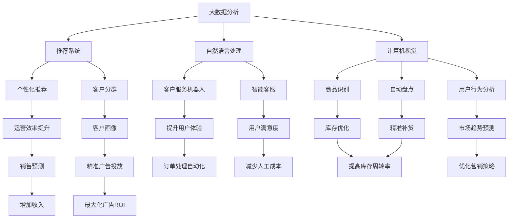

                 

# AI如何提升电商平台的运营效率

在当下这个数字化时代，电商行业面临着激烈的市场竞争和消费者期望的不断提升。如何通过人工智能技术优化运营流程，提升用户体验和业务效率，成为电商平台运营的关键课题。本文将从多个角度，深入探讨AI如何助力电商平台实现更高运营效率。

## 1. 背景介绍

### 1.1 行业现状
当前，全球电商市场竞争激烈，各大平台纷纷投入巨资进行技术研发，以求在竞争中占据有利地位。电商平台的成功不仅取决于产品和服务，还依赖于高效、精准的运营策略和数据驱动的决策支持。AI技术的引入，为电商平台带来了巨大的运营效率提升潜力。

### 1.2 关键问题
虽然AI技术在电商领域的应用已经取得了显著进展，但依然面临一些关键问题：
- 如何高效处理和分析大规模用户数据？
- 如何根据用户行为预测和个性化推荐？
- 如何自动化运营流程，减少人工干预？
- 如何在保证数据隐私的前提下，优化广告投放？

### 1.3 核心价值
AI技术在电商平台的价值主要体现在以下几个方面：
- 提升用户体验：通过智能推荐和个性化服务，增强用户粘性。
- 优化库存管理：精确预测需求，提高库存周转率。
- 增强营销效果：利用数据驱动的营销策略，最大化广告ROI。
- 提升运营效率：自动化处理订单、客户服务、物流等日常运营任务，降低人工成本。

## 2. 核心概念与联系

### 2.1 核心概念概述

为了更好地理解AI在电商平台运营中的应用，本节将介绍几个关键概念及其相互之间的联系：

- **机器学习(Machine Learning, ML)**：一种使计算机通过数据学习、预测和决策的技术。在电商平台上，机器学习可以用于需求预测、个性化推荐、客户分群等。
- **深度学习(Deep Learning, DL)**：一种基于多层神经网络的机器学习技术，适用于大规模复杂数据处理和模式识别。在电商平台上，深度学习可以用于图像识别、语音识别、自然语言处理等。
- **自然语言处理(Natural Language Processing, NLP)**：使计算机能够理解和处理人类语言的技术。在电商平台上，NLP可以用于客户服务机器人、智能客服、情感分析等。
- **计算机视觉(Computer Vision)**：使计算机能够理解和解释图像和视频的技术。在电商平台上，计算机视觉可以用于商品识别、自动盘点、用户行为分析等。
- **强化学习(Reinforcement Learning, RL)**：一种通过与环境交互，优化决策策略的学习方法。在电商平台上，强化学习可以用于动态定价、自动补货等。
- **推荐系统(Recommendation System)**：通过分析用户行为数据，推荐相关商品和服务的技术。在电商平台上，推荐系统可以显著提升用户购买转化率。
- **大数据分析(Big Data Analysis)**：处理和分析海量数据，挖掘隐藏的知识和规律。在电商平台上，大数据分析可以用于客户画像、市场趋势预测等。

这些核心概念之间存在密切的联系，共同构成了电商平台的AI技术体系。通过这些技术的协同作用，电商平台能够实现从用户数据到业务决策的闭环管理。

### 2.2 核心概念原理和架构的 Mermaid 流程图



这个流程图展示了大数据分析在电商平台中的核心应用路径，以及各环节如何相互协作，共同提升运营效率。

## 3. 核心算法原理 & 具体操作步骤

### 3.1 算法原理概述

AI在电商平台中的核心算法原理主要基于以下几个方向：

- **机器学习和深度学习**：利用历史数据和特征工程，建立模型预测用户行为，生成个性化推荐。
- **自然语言处理**：通过文本分析技术，理解用户查询和评论，提供更精准的客户服务。
- **计算机视觉**：通过图像识别和处理技术，实现商品分类、库存管理等自动化操作。
- **强化学习**：通过模拟电商平台的环境，优化定价策略、补货计划等运营决策。
- **推荐系统**：利用协同过滤、内容推荐等算法，根据用户行为和商品属性，推荐相关商品。

### 3.2 算法步骤详解

一个典型的AI驱动的电商平台运营流程包括以下关键步骤：

**Step 1: 数据收集与预处理**
- 收集电商平台的用户行为数据、交易数据、商品信息、广告点击数据等。
- 对数据进行清洗、去重、归一化等预处理操作，保证数据质量和可用性。

**Step 2: 特征工程**
- 从原始数据中提取有意义的特征，如用户购买历史、浏览记录、评分评论等。
- 设计特征编码器，将非结构化数据转换为数值化特征，便于模型处理。

**Step 3: 模型训练与评估**
- 选择合适的机器学习模型，如随机森林、梯度提升树、深度神经网络等。
- 利用历史数据训练模型，并在验证集上进行交叉验证，调整模型参数，提高模型泛化能力。
- 在测试集上评估模型性能，如准确率、召回率、F1分数等指标。

**Step 4: 模型部署与应用**
- 将训练好的模型部署到生产环境中，集成到电商平台的用户推荐系统、搜索系统、广告投放系统等模块。
- 持续监控模型性能，根据反馈数据定期更新模型参数，优化推荐效果。

### 3.3 算法优缺点

**优点：**
- 提升运营效率：自动化处理订单、客服、库存等日常运营任务，降低人工成本。
- 优化用户体验：通过个性化推荐和智能客服，增强用户满意度和粘性。
- 精准营销：利用用户行为数据，制定更有针对性的广告策略，提高广告ROI。
- 预测需求：通过需求预测模型，优化库存管理，减少库存积压和缺货情况。

**缺点：**
- 数据隐私：收集和处理用户数据时需要严格遵守数据隐私法规，如GDPR、CCPA等。
- 模型复杂性：深度学习模型和推荐系统需要大量的计算资源和数据支持，部署成本较高。
- 性能波动：模型的性能可能受到数据质量、特征选择、超参数调整等因素影响，需要不断优化。
- 算法黑盒：复杂的AI模型往往难以解释其决策过程，导致用户体验和信任度不足。

### 3.4 算法应用领域

AI技术在电商平台中的应用领域广泛，主要包括以下几个方面：

**个性化推荐系统**：通过用户历史行为数据，推荐相关商品，提升用户购买转化率。

**智能客服**：通过自然语言处理技术，实现自动化的客户服务，提高客户满意度。

**库存管理系统**：利用预测模型，优化商品补货计划，减少库存成本。

**广告投放系统**：基于用户行为数据，制定精准的广告投放策略，提高广告效果。

**订单处理系统**：自动化处理订单生成、配送、退货等流程，提升运营效率。

**供应链管理**：通过数据驱动的决策支持，优化供应链各个环节，提升整体运营效率。

## 4. 数学模型和公式 & 详细讲解 & 举例说明

### 4.1 数学模型构建

在电商平台的AI应用中，常见的数学模型包括：

- 线性回归模型：用于需求预测和销售趋势分析。
- 随机森林模型：用于客户分群和个性化推荐。
- 深度神经网络：用于图像识别、文本分类等任务。
- 协同过滤推荐算法：用于基于用户-商品交互数据的推荐。

### 4.2 公式推导过程

以线性回归模型为例，推导其核心公式和计算过程：

设 $y$ 为电商平台的销售额，$x$ 为相关影响因素，如季节、促销活动、用户行为等。线性回归模型可以表示为：

$$
y = \theta_0 + \theta_1x_1 + \theta_2x_2 + \cdots + \theta_nx_n + \epsilon
$$

其中 $\theta_i$ 为回归系数，$\epsilon$ 为误差项。根据最小二乘法，求解 $\theta$ 的过程如下：

1. 计算样本均值 $\bar{x}_i$ 和 $\bar{y}$。
2. 计算样本协方差矩阵 $S = \frac{1}{n}\sum_{i=1}^n(x_i-\bar{x})(x_i-\bar{x})'$。
3. 计算回归系数 $\theta = (S^{-1})\sum_{i=1}^n(x_i-\bar{x})y_i$。

### 4.3 案例分析与讲解

以推荐系统为例，分析其核心算法和应用场景：

**协同过滤推荐算法**：基于用户-商品交互数据，推荐用户可能感兴趣的商品。该算法分为基于用户的协同过滤和基于物品的协同过滤两种方法。

- 基于用户的协同过滤：计算用户之间的相似度，根据相似用户的历史行为推荐商品。
- 基于物品的协同过滤：计算物品之间的相似度，根据相似物品的用户行为推荐商品。

协同过滤推荐算法在电商平台的实际应用中，可以有效解决冷启动问题，即新商品或新用户的推荐难题。

## 5. 项目实践：代码实例和详细解释说明

### 5.1 开发环境搭建

在进行AI驱动的电商平台运营优化实践前，我们需要准备好开发环境。以下是使用Python进行TensorFlow和Keras开发的环境配置流程：

1. 安装Anaconda：从官网下载并安装Anaconda，用于创建独立的Python环境。

2. 创建并激活虚拟环境：
```bash
conda create -n tf-env python=3.8 
conda activate tf-env
```

3. 安装TensorFlow：根据CUDA版本，从官网获取对应的安装命令。例如：
```bash
conda install tensorflow -c tf
```

4. 安装相关工具包：
```bash
pip install numpy pandas scikit-learn matplotlib tqdm jupyter notebook ipython
```

完成上述步骤后，即可在`tf-env`环境中开始实践。

### 5.2 源代码详细实现

以下是一个简单的电商推荐系统的实现，使用了TensorFlow和Keras库：

```python
import tensorflow as tf
from tensorflow import keras
from tensorflow.keras.layers import Input, Dense, Embedding, dot
from tensorflow.keras.models import Model
from sklearn.model_selection import train_test_split

# 读取数据
train_data = pd.read_csv('train.csv')
test_data = pd.read_csv('test.csv')

# 数据预处理
user_ids = train_data['user_id'].unique()
item_ids = train_data['item_id'].unique()

# 构建用户-商品交互矩阵
train_matrix = np.zeros((len(train_data), len(item_ids)))
for i, row in train_data.iterrows():
    user_id = user_ids.index(row['user_id'])
    item_id = item_ids.index(row['item_id'])
    train_matrix[user_id, item_id] = row['rating']

# 用户嵌入层
user_input = Input(shape=(1,), name='user')
user_embedding = Embedding(len(user_ids), 16)(user_input)

# 商品嵌入层
item_input = Input(shape=(1,), name='item')
item_embedding = Embedding(len(item_ids), 16)(item_input)

# 预测层
dot_product = dot([user_embedding, item_embedding], axes=(2, 1))
prediction = Dense(1, activation='sigmoid')(dot_product)

# 构建模型
model = keras.Model(inputs=[user_input, item_input], outputs=prediction)

# 编译模型
model.compile(optimizer='adam', loss='binary_crossentropy', metrics=['accuracy'])

# 训练模型
model.fit([train_matrix[:, user_ids], train_matrix[:, item_ids]], train_data['rating'], epochs=10, batch_size=32)

# 评估模型
test_matrix = np.zeros((len(test_data), len(item_ids)))
for i, row in test_data.iterrows():
    user_id = user_ids.index(row['user_id'])
    item_id = item_ids.index(row['item_id'])
    test_matrix[user_id, item_id] = row['rating']

predictions = model.predict([test_matrix[:, user_ids], test_matrix[:, item_ids]])
```

### 5.3 代码解读与分析

让我们再详细解读一下关键代码的实现细节：

**数据预处理**：
- 读取电商平台的用户行为数据，并进行去重、归一化等预处理操作。
- 构建用户-商品交互矩阵，作为模型的输入数据。

**模型构建**：
- 定义用户嵌入层和商品嵌入层，分别将用户ID和商品ID映射到高维空间。
- 利用点积计算用户-商品交互矩阵的嵌入表示，并通过一个全连接层输出预测结果。

**模型编译与训练**：
- 编译模型，设置优化器、损失函数和评估指标。
- 训练模型，使用交叉验证调整超参数，提高模型泛化能力。

**模型评估与预测**：
- 在测试集上评估模型性能，计算准确率和召回率。
- 使用训练好的模型对新用户和商品进行推荐。

## 6. 实际应用场景

### 6.1 智能客服系统

基于AI技术的智能客服系统，可以大大提升电商平台的客户服务效率。传统客服往往需要配备大量人力，高峰期响应缓慢，且一致性和专业性难以保证。通过智能客服系统，电商平台可以实现7x24小时不间断服务，快速响应客户咨询，用自然流畅的语言解答各类常见问题。

### 6.2 个性化推荐系统

个性化推荐系统是电商平台的核心功能之一，通过用户历史行为数据，推荐用户可能感兴趣的商品，提升用户购买转化率。传统的推荐系统主要基于协同过滤、内容推荐等算法，利用用户行为数据和商品属性进行推荐。近年来，深度学习技术的应用，进一步提升了推荐系统的精度和多样性。

### 6.3 库存管理系统

库存管理是电商平台运营中重要的一环，通过需求预测模型，可以优化商品补货计划，减少库存成本。常用的需求预测方法包括时间序列分析、回归模型、深度学习等。通过实时监测销售数据，预测未来需求，电商平台可以及时调整库存水平，避免缺货或积压情况。

### 6.4 广告投放系统

广告投放系统是电商平台的重要营收来源，通过用户行为数据，制定精准的广告投放策略，提高广告效果。常用的广告投放策略包括CPC（按点击付费）、CPM（按展示付费）、CPCP（按千次展示付费）等。AI技术可以基于用户画像和行为数据，优化广告投放策略，提高广告ROI。

### 6.5 订单处理系统

订单处理系统是电商平台的基本功能之一，通过自动化处理订单生成、配送、退货等流程，提升运营效率。常用的自动化工具包括RPA（机器人流程自动化）、机器学习等。通过实时监测订单状态，预测配送时间，电商平台可以优化配送路线，提高配送效率。

## 7. 工具和资源推荐

### 7.1 学习资源推荐

为了帮助开发者系统掌握AI技术在电商平台中的应用，这里推荐一些优质的学习资源：

1. TensorFlow官方文档：提供详细的使用指南和API文档，帮助你快速上手TensorFlow和Keras。

2. Keras官方文档：提供基于TensorFlow的高层次API，简化深度学习模型的构建和训练。

3. Google Cloud AI平台：提供丰富的AI开发工具和模型，支持大规模深度学习训练。

4. Coursera的《机器学习基础》课程：由斯坦福大学教授Andrew Ng主讲，涵盖机器学习核心概念和应用。

5. Udacity的《深度学习专项》课程：提供系统的深度学习学习路径，覆盖TensorFlow、Keras等主流工具。

通过对这些资源的学习实践，相信你一定能够快速掌握AI技术在电商平台中的应用，并用于解决实际的运营问题。

### 7.2 开发工具推荐

高效的开发离不开优秀的工具支持。以下是几款用于AI驱动的电商平台运营优化的常用工具：

1. TensorFlow：基于Python的开源深度学习框架，灵活动态的计算图，适合快速迭代研究。

2. Keras：提供高层次的API，方便构建深度学习模型，支持TensorFlow、Theano等后端。

3. H2O.ai：提供易于使用的机器学习库，支持多种数据类型和算法。

4. Tableau：数据可视化工具，帮助电商平台实时监测和分析数据。

5. Apache Kafka：分布式流处理平台，支持高吞吐量的大数据流处理。

6. Apache Spark：大数据处理框架，支持分布式数据处理和分析。

合理利用这些工具，可以显著提升AI驱动的电商平台运营优化任务的开发效率，加快创新迭代的步伐。

### 7.3 相关论文推荐

AI技术在电商平台的应用源于学界的持续研究。以下是几篇奠基性的相关论文，推荐阅读：

1. *An Introduction to Statistical Learning* by Gareth James et al.：介绍了统计学习的核心概念和应用，是机器学习的经典教材。

2. *Deep Learning* by Ian Goodfellow et al.：详细讲解了深度学习的核心原理和应用，是深度学习的权威著作。

3. *Natural Language Processing in Action* by Steve Bird et al.：涵盖自然语言处理的理论基础和实用技巧，是NLP领域的经典教材。

4. *Reinforcement Learning: An Introduction* by Richard Sutton et al.：介绍了强化学习的基本概念和算法，是强化学习的入门教材。

5. *Recommendation Systems: Algorithms, Models and Techniques* by David Evans et al.：系统讲解了推荐系统的工作原理和优化方法，是推荐系统的经典教材。

这些论文代表了大语言模型微调技术的发展脉络。通过学习这些前沿成果，可以帮助研究者把握学科前进方向，激发更多的创新灵感。

## 8. 总结：未来发展趋势与挑战

### 8.1 总结

本文对AI技术在电商平台中的应用进行了全面系统的介绍。首先阐述了电商平台的背景、关键问题和核心价值，明确了AI技术在提升运营效率方面的独特优势。其次，从原理到实践，详细讲解了AI技术在个性化推荐、智能客服、库存管理、广告投放等方面的应用，给出了完整的代码实现和解释说明。同时，本文还探讨了AI在电商平台中的未来发展趋势和面临的挑战，提供了详细的研究展望。

通过本文的系统梳理，可以看到，AI技术在电商平台中的应用已经取得了显著进展，但仍然面临数据隐私、模型复杂性、性能波动等诸多挑战。未来需要在数据隐私保护、模型优化、算法透明性等方面进行持续改进，才能实现更高效、更精准、更安全的电商平台运营。

### 8.2 未来发展趋势

展望未来，AI在电商平台中的应用将呈现以下几个发展趋势：

1. 智能客服系统的普及：基于AI技术的智能客服系统将逐步替代人工客服，提升客户服务效率和质量。

2. 深度学习在推荐系统中的应用：深度学习技术将进一步提升推荐系统的精度和多样性，为电商平台带来更高的用户转化率。

3. 大数据分析的深入应用：通过大数据分析技术，电商平台将能够深入理解用户需求和市场趋势，制定更有效的运营策略。

4. 强化学习在库存管理中的应用：强化学习技术将能够优化库存管理，减少库存积压和缺货情况。

5. 个性化广告的精准投放：AI技术将基于用户画像和行为数据，制定精准的广告投放策略，提高广告效果。

6. 自动化流程的全面覆盖：AI技术将自动化处理订单生成、配送、退货等日常运营任务，降低人工成本，提升运营效率。

以上趋势凸显了AI技术在电商平台中的广阔前景。这些方向的探索发展，必将进一步提升电商平台的运营效率，为消费者带来更好的购物体验。

### 8.3 面临的挑战

尽管AI技术在电商平台中的应用已经取得了显著进展，但在迈向更加智能化、普适化应用的过程中，它仍面临诸多挑战：

1. 数据隐私：收集和处理用户数据时需要严格遵守数据隐私法规，如GDPR、CCPA等。

2. 模型复杂性：深度学习模型和推荐系统需要大量的计算资源和数据支持，部署成本较高。

3. 性能波动：模型的性能可能受到数据质量、特征选择、超参数调整等因素影响，需要不断优化。

4. 算法黑盒：复杂的AI模型往往难以解释其决策过程，导致用户体验和信任度不足。

5. 用户隐私：智能客服和个性化推荐等应用可能侵犯用户隐私，引发道德和法律风险。

6. 数据质量：电商平台的数据质量可能存在偏差和不完整，影响AI模型的训练效果。

7. 模型迁移性：当前的AI模型在不同电商平台上的迁移效果有限，需要更多的通用化设计。

以上挑战凸显了AI技术在电商平台中的复杂性和局限性。未来需要在数据隐私保护、模型优化、算法透明性等方面进行持续改进，才能实现更高效、更精准、更安全的电商平台运营。

### 8.4 研究展望

面对AI技术在电商平台中的应用所面临的诸多挑战，未来的研究需要在以下几个方面寻求新的突破：

1. 数据隐私保护：研究如何在大数据应用中保护用户隐私，确保数据使用的合法合规。

2. 模型优化：开发更高效的模型结构和算法，提高模型的计算效率和泛化能力。

3. 算法透明性：研究如何增强AI模型的可解释性，提升用户信任度。

4. 用户隐私保护：研究如何在智能客服和个性化推荐等应用中保护用户隐私，避免道德和法律风险。

5. 模型迁移性：研究如何设计更加通用化的模型，增强在不同电商平台上的迁移效果。

6. 数据质量提升：研究如何提高电商平台的数据质量，确保AI模型的训练效果。

通过这些研究方向，相信AI技术在电商平台中的应用将迎来新的突破，为消费者带来更好的购物体验，为电商平台带来更高的运营效率。

## 9. 附录：常见问题与解答

**Q1：AI技术在电商平台中的应用主要有哪些？**

A: AI技术在电商平台中的应用主要包括以下几个方面：
1. 个性化推荐系统：通过用户历史行为数据，推荐用户可能感兴趣的商品，提升用户购买转化率。
2. 智能客服：通过自然语言处理技术，实现自动化的客户服务，提高客户满意度。
3. 库存管理系统：通过需求预测模型，优化商品补货计划，减少库存成本。
4. 广告投放系统：基于用户行为数据，制定精准的广告投放策略，提高广告效果。
5. 订单处理系统：通过自动化处理订单生成、配送、退货等流程，提升运营效率。

**Q2：AI在电商平台中如何处理用户数据？**

A: AI在电商平台中处理用户数据主要包括以下几个步骤：
1. 数据收集：收集用户浏览、购买、评价等行为数据，构建用户画像。
2. 数据清洗：对数据进行去重、去噪、归一化等预处理操作。
3. 特征提取：从原始数据中提取有意义的特征，如用户购买历史、浏览记录、评分评论等。
4. 模型训练：利用历史数据训练AI模型，预测用户行为和推荐商品。
5. 模型评估：在验证集上评估模型性能，根据评估结果调整模型参数，优化推荐效果。

**Q3：AI在电商平台中的应用有哪些优势？**

A: AI在电商平台中的应用主要有以下优势：
1. 提升用户体验：通过个性化推荐和智能客服，增强用户满意度和粘性。
2. 优化运营效率：自动化处理订单、客服、库存等日常运营任务，降低人工成本。
3. 精准营销：利用用户行为数据，制定更有针对性的广告策略，提高广告ROI。
4. 预测需求：通过需求预测模型，优化库存管理，减少库存积压和缺货情况。

**Q4：AI技术在电商平台中如何确保数据隐私？**

A: AI技术在电商平台中确保数据隐私主要包括以下几个方面：
1. 数据匿名化：在处理用户数据时，去除个人身份信息，确保数据匿名化。
2. 数据加密：对敏感数据进行加密处理，防止数据泄露。
3. 数据访问控制：设置严格的访问权限，确保只有授权人员能够访问用户数据。
4. 隐私政策：制定明确的隐私政策，确保用户知情并同意数据使用。

**Q5：AI在电商平台中的未来发展方向是什么？**

A: AI在电商平台中的未来发展方向主要包括以下几个方面：
1. 智能客服系统的普及：基于AI技术的智能客服系统将逐步替代人工客服，提升客户服务效率和质量。
2. 深度学习在推荐系统中的应用：深度学习技术将进一步提升推荐系统的精度和多样性。
3. 大数据分析的深入应用：通过大数据分析技术，电商平台将能够深入理解用户需求和市场趋势，制定更有效的运营策略。
4. 强化学习在库存管理中的应用：强化学习技术将能够优化库存管理，减少库存积压和缺货情况。
5. 个性化广告的精准投放：AI技术将基于用户画像和行为数据，制定精准的广告投放策略，提高广告效果。
6. 自动化流程的全面覆盖：AI技术将自动化处理订单生成、配送、退货等日常运营任务，降低人工成本，提升运营效率。

通过这些研究方向，相信AI技术在电商平台中的应用将迎来新的突破，为消费者带来更好的购物体验，为电商平台带来更高的运营效率。

