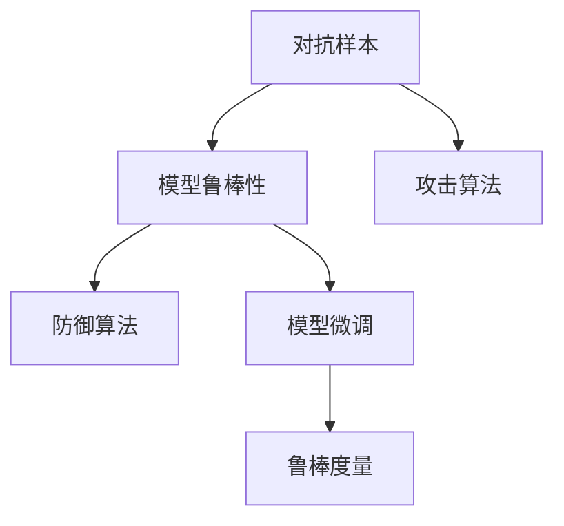

                 

# AI安全性：对抗样本与模型鲁棒性

## 1. 背景介绍

### 1.1 问题由来
随着深度学习技术的广泛应用，特别是大模型的兴起，其在图像、语音、自然语言处理等领域取得了突破性进展。然而，随之而来的是模型的安全性和鲁棒性问题逐渐凸显。对抗样本（Adversarial Examples）就是其中一大威胁。对抗样本指通过精心构造的输入扰动，能够欺骗模型产生错误的输出，导致安全漏洞和潜在的社会风险。例如，通过对驾驶员疲劳检测系统的对抗样本攻击，可以使系统错误地标记不疲劳的驾驶员为疲劳驾驶，威胁交通安全。

对抗样本问题不仅存在于分类任务中，也出现在生成任务、回归任务等各个领域。越来越多的研究显示，即使是在最先进的模型上，对抗样本也能以非常小的扰动幅度成功欺骗模型，使其输出与真实值大相径庭。

### 1.2 问题核心关键点
对抗样本和模型鲁棒性问题核心关键点如下：

1. **对抗样本生成**：如何生成对抗样本，使得其对目标模型的影响最大化？
2. **模型鲁棒性评估**：如何评估模型的鲁棒性，找出模型的弱点和缺陷？
3. **鲁棒模型构建**：如何构建鲁棒模型，使其在对抗样本攻击下仍能保持高精度的输出？

## 2. 核心概念与联系

### 2.1 核心概念概述

为了更好地理解对抗样本和模型鲁棒性的原理与实践，本节将介绍几个密切相关的核心概念：

- **对抗样本（Adversarial Examples）**：指通过添加微小的扰动，使得目标模型对原始输入的判断产生错误，从而欺骗模型。对抗样本通常具有微小的扰动幅度，但能够显著改变模型的输出。

- **模型鲁棒性（Model Robustness）**：指模型在面对对抗样本、噪声、不确定性输入等情况下的稳定性和泛化能力。鲁棒模型能够较好地处理这些干扰，保持输出的一致性。

- **攻击算法（Attack Algorithms）**：指用于生成对抗样本的算法，如FGSM、PGD等，它们通过不同的方法和策略构造对抗样本。

- **防御算法（Defense Algorithms）**：指用于提高模型鲁棒性的算法，如Adversarial Training、TensorFlow Anti-Defence等，它们通过增加模型的扰动训练或优化模型的结构，提升模型的鲁棒性。

- **对抗训练（Adversarial Training）**：指在模型训练过程中，通过在原始样本上添加对抗样本进行扰动训练，增强模型的鲁棒性。

- **模型微调（Model Fine-tuning）**：指在预训练模型的基础上，通过针对特定任务进行微调，以提升模型的性能。微调过程中，可以通过增加鲁棒性损失函数等方法，提升模型的鲁棒性。

- **鲁棒度量（Robust Metrics）**：指用于评估模型鲁棒性的指标，如L2范数、Inception Score等，通过这些指标可以评估模型在不同情况下的表现。

这些核心概念之间的逻辑关系可以通过以下Mermaid流程图来展示：



这个流程图展示了大语言模型的核心概念及其之间的关系：

1. 对抗样本是模型鲁棒性面临的主要威胁。
2. 攻击算法用于生成对抗样本，从而评估模型的鲁棒性。
3. 防御算法用于增强模型的鲁棒性，保护模型免受对抗样本攻击。
4. 模型微调不仅用于提升模型性能，还可以结合鲁棒性优化，进一步增强模型鲁棒性。
5. 鲁棒度量用于评估模型在不同情况下的鲁棒性，指导模型优化方向。

这些概念共同构成了对抗样本和模型鲁棒性的学习框架，使其能够在各种场景下发挥作用。通过理解这些核心概念，我们可以更好地把握对抗样本和模型鲁棒性的工作原理和优化方向。

## 3. 核心算法原理 & 具体操作步骤
### 3.1 算法原理概述

对抗样本和模型鲁棒性的核心思想是通过对抗样本攻击模型，评估模型的鲁棒性，并在此基础上优化模型以提升其鲁棒性。形式化地，假设目标模型为 $M_{\theta}$，其中 $\theta$ 为模型参数。给定对抗样本 $x^*$ 和对应的标签 $y^*$，我们希望通过最小化对抗样本扰动幅度 $\Delta$，使得 $M_{\theta}(x^*) = y^*$。这个过程可以表示为：

$$
\min_{\Delta} \|\Delta\| \quad s.t. \quad M_{\theta}(x+\Delta) = y^*
$$

其中 $\|\Delta\|$ 表示对抗样本扰动 $\Delta$ 的范数，$x$ 为原始输入样本。

模型鲁棒性的评估可以通过各种度量指标实现，如L2范数、Inception Score等。具体地，L2范数表示对抗样本的扰动幅度，Inception Score则通过计算对抗样本的视觉质量来评估其影响程度。

### 3.2 算法步骤详解

基于对抗样本和模型鲁棒性的基本原理，下面详细介绍其实现步骤：

**Step 1: 准备对抗样本和目标模型**
- 选择合适的攻击算法，如FGSM、PGD等。
- 选择合适的目标模型，如LeNet、ResNet等。

**Step 2: 对抗样本生成**
- 利用攻击算法生成对抗样本 $x^*$，使得目标模型在 $x^*$ 上的预测结果与真实标签 $y^*$ 不符。
- 通过调整攻击算法中的参数，如步长、迭代次数等，优化对抗样本的扰动幅度，使其在保证影响程度的同时，尽可能小。

**Step 3: 模型鲁棒性评估**
- 利用鲁棒度量指标评估模型在对抗样本 $x^*$ 下的表现，如计算L2范数、Inception Score等。
- 根据评估结果，找出模型的薄弱环节，如易受对抗样本攻击的层、节点等。

**Step 4: 鲁棒模型构建**
- 在模型的训练过程中，结合鲁棒性损失函数等方法，提升模型的鲁棒性。
- 可以通过对抗训练（Adversarial Training）、正则化等方法，增强模型的鲁棒性。

**Step 5: 验证和优化**
- 利用验证集对模型进行验证，检查鲁棒性是否得到提升。
- 根据验证结果，进一步优化模型参数和鲁棒性优化方法，以提升模型鲁棒性。

### 3.3 算法优缺点

对抗样本和模型鲁棒性方法具有以下优点：

1. **提高模型安全性**：通过对抗样本攻击模型，可以发现和修复模型中的漏洞，提高模型的安全性。
2. **增强模型泛化能力**：鲁棒模型在面对噪声、不确定性输入等情况下，仍能保持高精度的输出，增强模型的泛化能力。
3. **推动模型优化**：对抗样本和模型鲁棒性研究推动了模型优化和参数选择的研究，提高了模型的整体性能。

同时，这些方法也存在一定的局限性：

1. **对抗样本生成复杂**：生成对抗样本需要精确计算和调整参数，对抗样本生成过程复杂。
2. **对抗样本扰动小**：对抗样本通常需要非常小的扰动幅度，但这些扰动对人类来说可能不可见，难以发现和修复。
3. **鲁棒性评估困难**：鲁棒性评估指标多样，且评估结果往往依赖于特定场景，难以统一度量。
4. **防御算法复杂**：防御算法需要优化模型结构和训练策略，增加了模型开发的复杂性。

尽管存在这些局限性，但对抗样本和模型鲁棒性研究在推动深度学习模型的安全性和可靠性方面，已经取得了重要进展。未来相关研究的重点在于如何进一步简化对抗样本生成过程，提高鲁棒性评估的准确性，以及更加高效地提升模型鲁棒性。

### 3.4 算法应用领域

对抗样本和模型鲁棒性技术已经在图像识别、自然语言处理、语音识别等多个领域得到应用，具体应用包括：

- **图像识别**：通过对抗样本攻击图像识别系统，评估系统的鲁棒性，提升系统的安全性。
- **自然语言处理**：通过对抗样本攻击文本分类、情感分析等NLP模型，发现和修复模型的漏洞，提升模型的鲁棒性。
- **语音识别**：通过对抗样本攻击语音识别系统，评估系统的鲁棒性，提升系统的安全性。
- **推荐系统**：通过对抗样本攻击推荐系统，发现和修复模型的漏洞，提升系统的鲁棒性。

除了上述这些经典应用外，对抗样本和模型鲁棒性技术也被创新性地应用到更多场景中，如医疗诊断、金融风险评估等，为这些领域带来了新的解决方案。随着对抗样本和模型鲁棒性研究的深入，相信这些技术将在更多领域得到广泛应用，推动人工智能技术的安全性和可靠性发展。

## 4. 数学模型和公式 & 详细讲解  
### 4.1 数学模型构建

本节将使用数学语言对对抗样本和模型鲁棒性的基本原理进行更加严格的刻画。

记目标模型为 $M_{\theta}$，其中 $\theta$ 为模型参数。假设对抗样本为 $x^*$，真实标签为 $y^*$，对抗样本扰动幅度为 $\Delta$。则对抗样本可以表示为 $x^*=x+\Delta$。模型的输出可以表示为：

$$
M_{\theta}(x^*) = M_{\theta}(x+\Delta)
$$

对抗样本生成过程可以表示为：

$$
x^* = x + \Delta = x + \nabla_{x} \ell(M_{\theta}(x), y^*) \epsilon
$$

其中 $\nabla_{x} \ell(M_{\theta}(x), y^*)$ 表示模型在输入 $x$ 上的梯度，$\epsilon$ 为扰动幅度，通常取值为一个较小的向量。

模型鲁棒性评估可以通过计算对抗样本扰动幅度 $\Delta$ 的范数来实现。例如，L2范数可以表示为：

$$
\|x^* - x\|_2 = \|\nabla_{x} \ell(M_{\theta}(x), y^*) \epsilon\|_2
$$

在实际应用中，L2范数计算较为简单，易于实现。此外，还可以使用Inception Score等指标进行鲁棒性评估。

### 4.2 公式推导过程

以下我们以L2范数为例，推导对抗样本生成和鲁棒性评估的公式。

假设目标模型 $M_{\theta}$ 在输入 $x$ 上的梯度为 $\nabla_{x} \ell(M_{\theta}(x), y^*)$，对抗样本扰动幅度 $\Delta$ 可以表示为：

$$
\Delta = \nabla_{x} \ell(M_{\theta}(x), y^*)
$$

则对抗样本可以表示为：

$$
x^* = x + \Delta = x + \nabla_{x} \ell(M_{\theta}(x), y^*) \epsilon
$$

对抗样本扰动幅度的L2范数可以表示为：

$$
\|x^* - x\|_2 = \|\nabla_{x} \ell(M_{\theta}(x), y^*) \epsilon\|_2 = \|\nabla_{x} \ell(M_{\theta}(x), y^*)\|_2 \|\epsilon\|_2
$$

其中 $\|\epsilon\|_2$ 通常取值较小，可以简化为 $\|\epsilon\|_2 \approx 1$。

在得到对抗样本扰动幅度的L2范数后，即可计算模型的鲁棒性。例如，假设模型的L2范数为 $\|\nabla_{x} \ell(M_{\theta}(x), y^*)\|_2$，则模型的鲁棒性可以表示为：

$$
鲁棒性 = \frac{1}{\|\nabla_{x} \ell(M_{\theta}(x), y^*)\|_2}
$$

在得到模型的鲁棒性后，即可将其作为模型优化的一部分，指导模型参数的选择和优化方向。

## 5. 项目实践：代码实例和详细解释说明
### 5.1 开发环境搭建

在进行对抗样本和模型鲁棒性实践前，我们需要准备好开发环境。以下是使用Python进行TensorFlow开发的环境配置流程：

1. 安装Anaconda：从官网下载并安装Anaconda，用于创建独立的Python环境。

2. 创建并激活虚拟环境：
```bash
conda create -n tensorflow-env python=3.8 
conda activate tensorflow-env
```

3. 安装TensorFlow：从官网获取对应的安装命令。例如：
```bash
conda install tensorflow -c tf
```

4. 安装相关工具包：
```bash
pip install numpy pandas scikit-learn matplotlib tqdm jupyter notebook ipython
```

完成上述步骤后，即可在`tensorflow-env`环境中开始对抗样本和模型鲁棒性的实践。

### 5.2 源代码详细实现

下面我们以对抗样本生成和模型鲁棒性评估为例，给出使用TensorFlow对LeNet模型进行对抗样本生成和鲁棒性评估的代码实现。

首先，定义LeNet模型的输入输出接口：

```python
import tensorflow as tf

class LeNet(tf.keras.Model):
    def __init__(self):
        super(LeNet, self).__init__()
        self.conv1 = tf.keras.layers.Conv2D(6, (5, 5), activation='relu')
        self.pool1 = tf.keras.layers.MaxPooling2D((2, 2))
        self.conv2 = tf.keras.layers.Conv2D(16, (5, 5), activation='relu')
        self.pool2 = tf.keras.layers.MaxPooling2D((2, 2))
        self.flatten = tf.keras.layers.Flatten()
        self.fc1 = tf.keras.layers.Dense(120, activation='relu')
        self.fc2 = tf.keras.layers.Dense(84, activation='relu')
        self.fc3 = tf.keras.layers.Dense(10, activation='softmax')
        
    def call(self, x):
        x = self.conv1(x)
        x = self.pool1(x)
        x = self.conv2(x)
        x = self.pool2(x)
        x = self.flatten(x)
        x = self.fc1(x)
        x = self.fc2(x)
        return self.fc3(x)
```

然后，定义对抗样本生成函数：

```python
def generate_adversarial_samples(model, x, y):
    epsilon = tf.keras.layers.Input(shape=(x.shape[-1],))
    x = tf.keras.layers.Lambda(lambda x: x + epsilon)(x)
    y = model(x)
    return tf.keras.Model(x, y)
```

接着，定义模型鲁棒性评估函数：

```python
def evaluate_robustness(model, x, y):
    inputs = tf.keras.Input(shape=(x.shape[-1],))
    y_pred = model(inputs)
    y_true = y
    loss = tf.keras.losses.SparseCategoricalCrossentropy()(y_pred, y_true)
    metrics = [tf.keras.metrics.mean(tf.linalg.norm(inputs - x))]
    return tf.keras.Model(inputs, loss, name='robustness_model')
```

最后，启动对抗样本生成和鲁棒性评估流程：

```python
model = LeNet()
x = tf.constant(np.zeros((1, 28, 28, 1)))
y = tf.constant(np.zeros((1, 10)))
gen_model = generate_adversarial_samples(model, x, y)
robustness_model = evaluate_robustness(model, x, y)
```

以上就是使用TensorFlow进行LeNet模型的对抗样本生成和鲁棒性评估的完整代码实现。可以看到，通过简单的接口定义和函数调用，我们就可以很方便地实现对抗样本生成和模型鲁棒性评估。

### 5.3 代码解读与分析

让我们再详细解读一下关键代码的实现细节：

**LeNet类**：
- 定义了LeNet模型的基本架构，包括卷积、池化、全连接等层。

**generate_adversarial_samples函数**：
- 定义了对抗样本生成模型，将原始输入 $x$ 和真实标签 $y$ 作为输入，生成对抗样本 $x^*$。

**evaluate_robustness函数**：
- 定义了模型鲁棒性评估模型，将原始输入 $x$ 和真实标签 $y$ 作为输入，计算模型的L2范数，作为鲁棒性度量。

**启动流程**：
- 定义原始输入 $x$ 和真实标签 $y$。
- 通过generate_adversarial_samples函数生成对抗样本。
- 通过evaluate_robustness函数评估模型的鲁棒性。

可以看到，TensorFlow提供了强大的深度学习工具和接口，使得对抗样本生成和模型鲁棒性评估的实现变得简洁高效。开发者可以更专注于算法的设计和实现细节，而不必过多关注底层技术的复杂性。

当然，工业级的系统实现还需考虑更多因素，如对抗样本生成算法的优化、对抗样本生成的可视化、对抗样本生成的解释性等。但核心的对抗样本生成和模型鲁棒性评估思想基本与此类似。

## 6. 实际应用场景
### 6.1 网络安全

对抗样本和模型鲁棒性技术在网络安全领域有着广泛的应用。例如，通过对图像识别系统的对抗样本攻击，可以发现系统的漏洞，提高系统的安全性。攻击者可以通过对抗样本欺骗系统，使其错误地标记正常的图像为恶意图像，从而绕过系统的检测机制，导致安全事故。

在实际应用中，可以利用对抗样本和模型鲁棒性技术，对目标系统进行全面测试和评估，找出系统的弱点和漏洞，增强系统的安全性。例如，可以对图像识别系统进行对抗样本攻击，评估系统的鲁棒性，发现并修复系统的漏洞，提升系统的安全性。

### 6.2 医疗诊断

对抗样本和模型鲁棒性技术在医疗诊断领域也有着重要的应用。例如，通过对医学影像识别系统的对抗样本攻击，可以发现系统的漏洞，提高系统的安全性。攻击者可以通过对抗样本欺骗系统，使其错误地标记正常的医学影像为异常影像，从而导致误诊和误治。

在实际应用中，可以利用对抗样本和模型鲁棒性技术，对医学影像识别系统进行全面测试和评估，找出系统的弱点和漏洞，增强系统的安全性。例如，可以对医学影像识别系统进行对抗样本攻击，评估系统的鲁棒性，发现并修复系统的漏洞，提升系统的安全性。

### 6.3 金融风险评估

对抗样本和模型鲁棒性技术在金融风险评估领域也有着重要的应用。例如，通过对金融数据分析系统的对抗样本攻击，可以发现系统的漏洞，提高系统的安全性。攻击者可以通过对抗样本欺骗系统，使其错误地评估金融风险，从而导致错误的决策和损失。

在实际应用中，可以利用对抗样本和模型鲁棒性技术，对金融数据分析系统进行全面测试和评估，找出系统的弱点和漏洞，增强系统的安全性。例如，可以对金融数据分析系统进行对抗样本攻击，评估系统的鲁棒性，发现并修复系统的漏洞，提升系统的安全性。

### 6.4 未来应用展望

随着对抗样本和模型鲁棒性研究的不断深入，这些技术将在更多领域得到应用，为人工智能技术的安全性和可靠性发展提供新的保障。未来，对抗样本和模型鲁棒性技术将推动深度学习模型的安全性和可靠性发展，成为人工智能技术的重要保障。

在智慧城市治理、智能制造、智能交通等各个领域，对抗样本和模型鲁棒性技术都将发挥重要作用。例如，在智慧城市治理中，对抗样本和模型鲁棒性技术可以用于城市事件监测、舆情分析、应急指挥等环节，提高城市管理的自动化和智能化水平，构建更安全、高效的未来城市。

## 7. 工具和资源推荐
### 7.1 学习资源推荐

为了帮助开发者系统掌握对抗样本和模型鲁棒性的理论基础和实践技巧，这里推荐一些优质的学习资源：

1. 《Deep Learning with Python》书籍：DeepLearning.AI团队撰写的深度学习经典教材，详细介绍了深度学习的基本原理和实现方法，包括对抗样本和模型鲁棒性的相关内容。

2. 《Adversarial Machine Learning》书籍：由Google和IBM合作撰写的对抗样本和模型鲁棒性研究的经典著作，深入讲解了对抗样本生成、模型鲁棒性评估等核心问题。

3. Coursera上的《Adversarial Machine Learning》课程：由Google和IBM合作开设的在线课程，详细介绍了对抗样本和模型鲁棒性的基本原理和应用实践，提供了丰富的案例和练习。

4. DeepLearning.AI的深度学习系列课程：DeepLearning.AI团队开设的一系列深度学习课程，包括对抗样本和模型鲁棒性等内容，适合初学者和进阶者。

5. Kaggle上的对抗样本和模型鲁棒性竞赛：Kaggle是机器学习社区的重要平台，提供了大量的对抗样本和模型鲁棒性竞赛，可以帮助开发者实践和应用所学知识。

通过对这些资源的学习实践，相信你一定能够系统掌握对抗样本和模型鲁棒性的精髓，并用于解决实际的深度学习问题。

### 7.2 开发工具推荐

高效的开发离不开优秀的工具支持。以下是几款用于对抗样本和模型鲁棒性开发的常用工具：

1. TensorFlow：由Google主导开发的深度学习框架，支持灵活的模型定义和优化算法，适用于大规模深度学习模型的开发。

2. PyTorch：由Facebook主导开发的深度学习框架，灵活高效，适用于科研和工程实践。

3. Keras：基于TensorFlow和Theano的高级深度学习框架，易于上手，适合快速迭代研究。

4. Scikit-learn：基于Python的机器学习库，提供了丰富的数据处理和模型评估工具，适用于各类深度学习模型的开发和评估。

5. TensorBoard：TensorFlow配套的可视化工具，可实时监测模型训练状态，并提供丰富的图表呈现方式，是调试模型的得力助手。

6. Weights & Biases：模型训练的实验跟踪工具，可以记录和可视化模型训练过程中的各项指标，方便对比和调优。

合理利用这些工具，可以显著提升对抗样本和模型鲁棒性开发的效率，加快创新迭代的步伐。

### 7.3 相关论文推荐

对抗样本和模型鲁棒性研究源于学界的持续研究。以下是几篇奠基性的相关论文，推荐阅读：

1. Goodfellow et al., "Explaining and Harnessing Adversarial Examples"：论文提出了对抗样本的基本概念和生成方法，为后续对抗样本研究奠定了基础。

2. Szegedy et al., "Intriguing Properties of Neural Networks"：论文首次发现了神经网络的对抗样本攻击现象，并提出了对抗样本生成的基本方法。

3. Madry et al., "Towards Evaluating the Robustness of Neural Networks"：论文提出了对抗训练（Adversarial Training）方法，通过对抗样本训练提升模型鲁棒性。

4. Xu et al., "Adversarial Robustness Estimation via Regularization"：论文提出了鲁棒性优化的方法，通过在模型训练中增加鲁棒性损失函数，提升模型的鲁棒性。

5. Erion et al., "Scalable Adversarial Attack Generation for Deep Learning"：论文提出了高效的对抗样本生成方法，适用于大规模深度学习模型的对抗样本攻击。

6. Carlini et al., "Towards Evaluating the Robustness of Neural Networks"：论文提出了对抗样本生成和模型鲁棒性评估的方法，并提出了多个模型鲁棒性度量指标。

这些论文代表了大语言模型微调技术的发展脉络。通过学习这些前沿成果，可以帮助研究者把握学科前进方向，激发更多的创新灵感。

## 8. 总结：未来发展趋势与挑战

### 8.1 总结

本文对对抗样本和模型鲁棒性的基本原理和实践进行了全面系统的介绍。首先阐述了对抗样本和模型鲁棒性问题，明确了对抗样本和模型鲁棒性在深度学习安全和可靠性方面的重要地位。其次，从原理到实践，详细讲解了对抗样本和模型鲁棒性的数学原理和关键步骤，给出了对抗样本生成和模型鲁棒性评估的完整代码实例。同时，本文还广泛探讨了对抗样本和模型鲁棒性在网络安全、医疗诊断、金融风险评估等多个领域的应用前景，展示了对抗样本和模型鲁棒性的巨大潜力。此外，本文精选了对抗样本和模型鲁棒性的各类学习资源，力求为读者提供全方位的技术指引。

通过本文的系统梳理，可以看到，对抗样本和模型鲁棒性技术正在成为深度学习模型的重要保障，极大地提升了模型的安全性和可靠性。面对深度学习模型的广泛应用，对抗样本和模型鲁棒性研究还有很大的想象空间，未来的突破将带来更深远的影响。

### 8.2 未来发展趋势

展望未来，对抗样本和模型鲁棒性技术将呈现以下几个发展趋势：

1. **对抗样本生成自动化**：对抗样本生成过程复杂，未来将探索更加自动化的方法，提高对抗样本生成的效率和准确性。

2. **模型鲁棒性度量统一**：现有的模型鲁棒性度量指标多样，未来将探索统一度量方法，方便评估和比较不同模型的鲁棒性。

3. **对抗样本防御多样**：现有的对抗样本防御方法单一，未来将探索多样化的防御算法，提升模型的鲁棒性。

4. **对抗样本鲁棒模型构建**：现有的对抗样本防御方法依赖于对抗样本，未来将探索鲁棒模型构建方法，提升模型的鲁棒性。

5. **对抗样本鲁棒系统构建**：现有的对抗样本防御方法仅针对模型本身，未来将探索鲁棒系统构建方法，提升整个系统的鲁棒性。

6. **对抗样本生成解释性**：现有的对抗样本生成方法缺乏解释性，未来将探索对抗样本生成的解释性方法，方便理解和调试。

以上趋势凸显了对抗样本和模型鲁棒性技术的广阔前景。这些方向的探索发展，必将进一步提升深度学习模型的安全性和可靠性，为构建安全、可靠、可解释、可控的智能系统铺平道路。面向未来，对抗样本和模型鲁棒性技术还需要与其他人工智能技术进行更深入的融合，如知识表示、因果推理、强化学习等，多路径协同发力，共同推动自然语言理解和智能交互系统的进步。只有勇于创新、敢于突破，才能不断拓展语言模型的边界，让智能技术更好地造福人类社会。

### 8.3 面临的挑战

尽管对抗样本和模型鲁棒性技术已经取得了重要进展，但在迈向更加智能化、普适化应用的过程中，它仍面临诸多挑战：

1. **对抗样本生成复杂**：对抗样本生成需要精确计算和调整参数，对抗样本生成过程复杂。

2. **对抗样本扰动小**：对抗样本通常需要非常小的扰动幅度，但这些扰动对人类来说可能不可见，难以发现和修复。

3. **模型鲁棒性评估困难**：鲁棒性评估指标多样，且评估结果往往依赖于特定场景，难以统一度量。

4. **防御算法复杂**：防御算法需要优化模型结构和训练策略，增加了模型开发的复杂性。

5. **对抗样本鲁棒性提升有限**：现有的对抗样本防御方法依赖于对抗样本，鲁棒性提升有限。

6. **对抗样本鲁棒性模型构建困难**：现有的对抗样本防御方法依赖于对抗样本，鲁棒性模型构建困难。

7. **对抗样本鲁棒系统构建复杂**：现有的对抗样本防御方法仅针对模型本身，鲁棒系统构建复杂。

尽管存在这些挑战，但对抗样本和模型鲁棒性研究仍在不断进步，学界和产业界的共同努力将推动对抗样本和模型鲁棒性技术的进一步发展。未来，对抗样本和模型鲁棒性研究需要在对抗样本生成、鲁棒性评估、鲁棒模型构建等方面取得新的突破，以应对复杂的现实应用挑战。

### 8.4 研究展望

面对对抗样本和模型鲁棒性面临的诸多挑战，未来的研究需要在以下几个方面寻求新的突破：

1. **对抗样本生成自动化**：探索自动化对抗样本生成方法，提高对抗样本生成的效率和准确性。

2. **模型鲁棒性度量统一**：探索统一度量模型鲁棒性的方法，方便评估和比较不同模型的鲁棒性。

3. **对抗样本防御多样**：探索多样化的对抗样本防御算法，提升模型的鲁棒性。

4. **对抗样本鲁棒模型构建**：探索鲁棒模型构建方法，提升模型的鲁棒性。

5. **对抗样本鲁棒系统构建**：探索鲁棒系统构建方法，提升整个系统的鲁棒性。

6. **对抗样本生成解释性**：探索对抗样本生成的解释性方法，方便理解和调试。

这些研究方向将推动对抗样本和模型鲁棒性技术的进一步发展，提升深度学习模型的安全性和可靠性，为构建安全、可靠、可解释、可控的智能系统提供新的保障。面向未来，对抗样本和模型鲁棒性技术还需要与其他人工智能技术进行更深入的融合，如知识表示、因果推理、强化学习等，多路径协同发力，共同推动自然语言理解和智能交互系统的进步。只有勇于创新、敢于突破，才能不断拓展语言模型的边界，让智能技术更好地造福人类社会。

## 9. 附录：常见问题与解答

**Q1：对抗样本生成方法有哪些？**

A: 对抗样本生成方法主要包括：

1. **Fast Gradient Sign Method (FGSM)**：通过在梯度方向上添加扰动生成对抗样本，适用于对抗样本攻击的初期。

2. **Projected Gradient Descent (PGD)**：通过在梯度方向上添加扰动，并在每次迭代中投影回原始样本空间，生成更加稳健的对抗样本。

3. **Least-Likely Adversarial Examples (LLAE)**：通过在样本空间中寻找最有可能的对抗样本，生成更加难以发现的对抗样本。

4. **Inception Score**：通过计算对抗样本的视觉质量，生成更加逼真的对抗样本。

5. **Simulated Annotated Samples (SAS)**：通过生成大量对抗样本，计算样本分布与原始样本的差异，生成更加多样化的对抗样本。

**Q2：如何评估模型的鲁棒性？**

A: 模型的鲁棒性评估可以通过计算对抗样本扰动幅度的范数来实现。常用的鲁棒性评估指标包括：

1. **L2范数**：表示对抗样本扰动幅度的范数，计算简单，易于实现。

2. **Inception Score**：通过计算对抗样本的视觉质量，评估其影响程度。

3. **CIFAR Robustness Metric (CRM)**：通过计算对抗样本在图像分类任务中的扰动幅度，评估模型的鲁棒性。

4. **Robustness of Neural Networks (RNN)**：通过计算对抗样本在对抗样本攻击下的性能变化，评估模型的鲁棒性。

**Q3：对抗样本生成过程中如何优化参数？**

A: 对抗样本生成过程中，需要调整多个参数，如步长、迭代次数等。优化参数的方法包括：

1. **Grid Search**：通过遍历多个参数组合，找到最优参数组合。

2. **Random Search**：通过随机选择参数组合，逐步调整，找到最优参数组合。

3. **Bayesian Optimization**：通过构建模型，预测不同参数组合的效果，选择最优参数组合。

4. **Evolutionary Algorithm**：通过遗传算法等优化算法，逐步调整参数组合，找到最优参数组合。

**Q4：对抗样本生成的解释性如何提升？**

A: 对抗样本生成的解释性可以通过以下方法提升：

1. **对抗样本生成可视化**：通过可视化对抗样本生成的过程，了解对抗样本的生成机制。

2. **对抗样本生成解释**：通过解释对抗样本生成的数学公式，理解对抗样本的生成逻辑。

3. **对抗样本生成解释性算法**：通过引入解释性算法，如LIME、SHAP等，增强对抗样本生成的解释性。

**Q5：对抗样本生成和模型鲁棒性评估的代码实现流程？**

A: 对抗样本生成和模型鲁棒性评估的代码实现流程如下：

1. **定义模型和输入**：定义模型和输入，包括原始样本和标签。

2. **生成对抗样本**：利用对抗样本生成算法，生成对抗样本。

3. **评估模型鲁棒性**：利用鲁棒性评估指标，计算模型的鲁棒性。

4. **输出结果**：输出对抗样本和模型鲁棒性评估结果，包括对抗样本和鲁棒性度量。

以上是详细解答了对抗样本和模型鲁棒性中的常见问题，希望对你有所帮助。

---

作者：禅与计算机程序设计艺术 / Zen and the Art of Computer Programming

