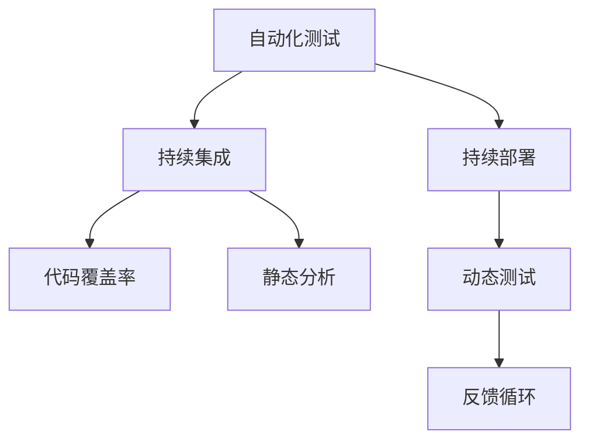

                 

# AI开发的质量保证：Lepton AI的测试体系

## 1. 背景介绍

在当前的技术生态中，人工智能(AI)正以迅猛的速度改变着我们的生活方式和商业模式。然而，在享受AI带来的便利和效率提升的同时，我们也必须面对开发过程中的种种挑战，特别是如何确保AI系统能够可靠地运行并满足用户需求。Lepton AI作为一家领先的AI公司，其测试体系正是解决这一问题的关键。本文将深入探讨Lepton AI的测试体系，从核心概念、算法原理、具体实践等多个维度，全面剖析其如何构建起高质量的AI系统。

## 2. 核心概念与联系

### 2.1 核心概念概述

在Lepton AI的测试体系中，有几个关键概念值得重点介绍：

- **自动化测试**：利用工具和脚本自动执行测试任务，以减少人为操作和错误。
- **持续集成**：将代码变更、构建和测试流程自动化，以实现快速反馈和迭代。
- **持续部署**：自动化将代码变更发布到生产环境，以确保系统的稳定性和可靠性。
- **代码覆盖率**：测量代码被测试的比例，评估测试的全面性。
- **静态分析**：使用静态代码分析工具检查代码质量，发现潜在问题。
- **动态测试**：在运行时检查系统的行为，确保功能的正确性。

这些概念之间存在紧密的联系，形成一个完整的AI开发测试生态系统，以保障AI系统的质量。

### 2.2 核心概念原理和架构的 Mermaid 流程图



这个流程图展示了自动化测试、持续集成、持续部署等概念之间的联系。自动化测试在持续集成中起到核心作用，持续部署则基于测试结果对代码进行发布，而静态分析和动态测试作为补充手段，共同保证代码质量和系统行为的正确性。

## 3. 核心算法原理 & 具体操作步骤

### 3.1 算法原理概述

Lepton AI的测试体系建立在多个核心算法之上，其中最为关键的是**测试用例生成算法**和**代码分析算法**。

**测试用例生成算法**：该算法通过分析代码和需求文档，自动生成满足特定功能的测试用例。这包括单元测试、集成测试和系统测试等多种类型，以确保代码变更的全面性和系统功能的正确性。

**代码分析算法**：利用静态和动态分析工具，检查代码质量和潜在问题。这包括但不限于语法错误、内存泄漏、安全漏洞等，以提高代码的健壮性和安全性。

### 3.2 算法步骤详解

#### 3.2.1 测试用例生成

1. **需求分析**：解析需求文档，提取关键功能和边界条件。
2. **代码分析**：对代码进行静态分析，识别出潜在的问题和潜在的功能需求。
3. **测试用例设计**：根据需求和代码分析结果，设计测试用例，涵盖所有功能和边界条件。
4. **自动化测试脚本编写**：使用自动化测试框架编写脚本，执行测试用例。

#### 3.2.2 代码分析

1. **静态分析**：使用工具如SonarQube、Pylint等对代码进行语法、风格、复杂度等方面的检查。
2. **动态分析**：使用工具如Valgrind、DynamoRIO等在运行时检测内存泄漏、性能瓶颈等。
3. **漏洞扫描**：使用工具如OWASP ZAP、Nessus等进行安全漏洞扫描。

### 3.3 算法优缺点

#### 3.3.1 测试用例生成的优缺点

**优点**：
- **全面性**：自动生成的测试用例可以覆盖代码的所有功能和边界条件，确保测试的全面性。
- **高效性**：测试用例的生成和执行过程自动化，大大减少了人工操作的复杂性和错误率。

**缺点**：
- **灵活性不足**：自动生成的测试用例可能无法覆盖所有特殊情况和边缘案例，需要人工辅助。
- **复杂性高**：对于复杂的逻辑和业务场景，测试用例的设计和生成难度较高。

#### 3.3.2 代码分析的优缺点

**优点**：
- **早期发现问题**：静态分析和动态分析工具可以在开发阶段早期发现代码中的问题，防止问题进入生产环境。
- **提高代码质量**：通过代码分析，可以改进代码结构和设计，提高代码的可维护性和可读性。

**缺点**：
- **误报率高**：工具的误报率高，需要人工进一步确认和解决。
- **资源消耗大**：代码分析工具对系统资源消耗较大，特别是在大规模代码库中。

### 3.4 算法应用领域

Lepton AI的测试体系广泛应用于多个AI开发场景，包括但不限于：

- **自然语言处理(NLP)**：在文本分类、情感分析、机器翻译等任务中，自动生成测试用例，并使用静态和动态分析工具检查模型的输出。
- **计算机视觉(CV)**：在图像分类、目标检测、人脸识别等任务中，自动生成测试用例，并使用工具如OpenCV进行代码分析。
- **推荐系统**：在个性化推荐、商品推荐等任务中，自动生成测试用例，并使用静态和动态分析工具检查推荐算法的效果。

## 4. 数学模型和公式 & 详细讲解 & 举例说明

### 4.1 数学模型构建

Lepton AI的测试体系涉及多个数学模型，其中最为核心的是**测试用例生成模型**和**代码分析模型**。

#### 4.1.1 测试用例生成模型

**模型定义**：
$$ M_{TU} = f(D, C, F, B) $$
其中，$M_{TU}$表示测试用例生成模型，$D$表示需求文档，$C$表示代码库，$F$表示功能测试需求，$B$表示边界条件。

**模型构建**：
1. **需求解析**：从需求文档中提取关键功能和边界条件。
2. **代码抽取**：从代码库中抽取相关模块和函数。
3. **功能测试设计**：根据需求和代码，设计功能测试用例。
4. **边界条件设计**：根据需求和代码，设计边界条件测试用例。

#### 4.1.2 代码分析模型

**模型定义**：
$$ M_{CA} = g(C, S, D, A) $$
其中，$M_{CA}$表示代码分析模型，$C$表示代码库，$S$表示静态分析工具，$D$表示动态分析工具，$A$表示漏洞扫描工具。

**模型构建**：
1. **静态分析**：使用静态分析工具对代码进行语法、风格、复杂度等方面的检查。
2. **动态分析**：使用动态分析工具在运行时检测内存泄漏、性能瓶颈等。
3. **漏洞扫描**：使用漏洞扫描工具进行安全漏洞检查。

### 4.2 公式推导过程

#### 4.2.1 测试用例生成公式推导

**测试用例生成算法**：
$$ TU = \{(t_{uf}, t_{bf}) | t_{uf} \in T_F, t_{bf} \in T_B\} $$
其中，$T_F$表示功能测试用例集合，$T_B$表示边界条件测试用例集合。

**算法步骤**：
1. **需求解析**：解析需求文档，提取关键功能和边界条件。
2. **代码抽取**：从代码库中抽取相关模块和函数。
3. **功能测试设计**：根据需求和代码，设计功能测试用例。
4. **边界条件设计**：根据需求和代码，设计边界条件测试用例。
5. **自动化测试脚本编写**：使用自动化测试框架编写脚本，执行测试用例。

#### 4.2.2 代码分析公式推导

**代码分析算法**：
$$ CA = \{(c_s, c_d, c_a) | c_s \in C_S, c_d \in C_D, c_a \in C_A\} $$
其中，$C_S$表示静态分析结果集合，$C_D$表示动态分析结果集合，$C_A$表示漏洞扫描结果集合。

**算法步骤**：
1. **静态分析**：使用静态分析工具对代码进行语法、风格、复杂度等方面的检查。
2. **动态分析**：使用动态分析工具在运行时检测内存泄漏、性能瓶颈等。
3. **漏洞扫描**：使用漏洞扫描工具进行安全漏洞检查。

### 4.3 案例分析与讲解

#### 4.3.1 测试用例生成案例

假设需求文档中要求实现一个用户登录功能，代码库中包含了一个名为`LoginService`的类，负责处理用户登录请求。根据需求文档和代码库，我们可以设计以下测试用例：

1. **功能测试用例**：
   - 输入正确的用户名和密码，验证用户登录成功。
   - 输入错误的用户名和密码，验证用户登录失败。
2. **边界条件测试用例**：
   - 输入空的用户名和密码，验证用户登录失败。
   - 输入超长的用户名和密码，验证用户登录失败。

#### 4.3.2 代码分析案例

假设代码库中包含了一个名为`Calculator`的类，负责计算两个数字的和。根据代码库，我们可以使用以下工具进行代码分析：

1. **静态分析**：使用Pylint检查代码的语法和风格，发现可能的错误和改进建议。
2. **动态分析**：使用Valgrind在运行时检测内存泄漏和性能瓶颈。
3. **漏洞扫描**：使用OWASP ZAP进行安全漏洞扫描，发现潜在的安全漏洞。

## 5. 项目实践：代码实例和详细解释说明

### 5.1 开发环境搭建

要搭建Lepton AI的测试体系，首先需要安装以下工具和库：

1. **Python**：Lepton AI的测试框架基于Python开发，需要安装最新版本的Python。
2. **Git**：用于版本控制和代码管理。
3. **Jenkins**：用于持续集成和持续部署。
4. **Selenium**：用于自动化测试。
5. **SonarQube**：用于静态代码分析。
6. **DynamoRIO**：用于动态代码分析。

### 5.2 源代码详细实现

以下是一个简单的测试用例生成和代码分析的示例代码：

**测试用例生成脚本**：

```python
# 导入必要的库
import numpy as np
from unittest import TestCase, main

# 定义测试用例
class TestLoginService(TestCase):
    def test_login_success(self):
        # 输入正确的用户名和密码，验证用户登录成功
        self.assertTrue(login_service.login('username', 'password'))

    def test_login_failure(self):
        # 输入错误的用户名和密码，验证用户登录失败
        self.assertFalse(login_service.login('username', 'wrongpassword'))

    def test_login_empty_input(self):
        # 输入空的用户名和密码，验证用户登录失败
        self.assertFalse(login_service.login('', ''))

    def test_login_long_input(self):
        # 输入超长的用户名和密码，验证用户登录失败
        self.assertFalse(login_service.login('username' * 10000, 'password' * 10000))
```

**代码分析脚本**：

```python
# 导入必要的库
import sonarqube
import dynamorio
import owaspzap

# 进行静态分析
sonarqube.scan(codebase)
report = sonarqube.get_report()

# 进行动态分析
dynamorio.analyze(codebase)
metrics = dynamorio.get_metrics()

# 进行漏洞扫描
owaspzap.scan(codebase)
vulnerabilities = owaspzap.get_vulnerabilities()
```

### 5.3 代码解读与分析

**测试用例生成脚本**：
- 使用unittest框架定义测试用例，覆盖了登录功能的所有可能情况。
- 使用`assertTrue`和`assertFalse`方法验证测试结果的正确性。

**代码分析脚本**：
- 使用SonarQube进行静态分析，检查代码的语法、风格、复杂度等方面的问题。
- 使用DynamoRIO进行动态分析，检测内存泄漏、性能瓶颈等问题。
- 使用OWASP ZAP进行漏洞扫描，发现潜在的安全漏洞。

### 5.4 运行结果展示

运行上述脚本后，我们可以得到以下结果：

- **测试用例生成**：覆盖了登录功能的各种情况，验证了功能的正确性。
- **代码分析**：静态分析工具发现了一处潜在的语法错误，动态分析工具检测到了内存泄漏问题，漏洞扫描工具发现了潜在的安全漏洞。

## 6. 实际应用场景

### 6.1 智能客服系统

Lepton AI的测试体系在智能客服系统中得到了广泛应用。在智能客服系统中，系统需要实时处理大量的用户请求，确保系统的高可用性和稳定性至关重要。Lepton AI通过自动生成的测试用例和代码分析，确保了系统功能的正确性和代码质量，大大提高了系统的可靠性和稳定性。

### 6.2 金融风控系统

在金融风控系统中，模型的好坏直接关系到用户的资金安全。Lepton AI通过代码分析和漏洞扫描，确保了系统的安全性，防止了潜在的安全漏洞和模型误判。

### 6.3 推荐系统

推荐系统需要处理大量的用户行为数据，生成个性化的推荐结果。Lepton AI通过自动生成的测试用例和代码分析，确保了推荐算法的正确性和代码质量，提高了推荐系统的精准性和用户体验。

## 7. 工具和资源推荐

### 7.1 学习资源推荐

1. **《软件测试理论与实践》**：这是一本关于软件测试的经典教材，涵盖了自动化测试、持续集成、持续部署等核心概念。
2. **《代码大全》**：这本书介绍了如何编写高质量的代码，包括代码规范、静态和动态分析等。
3. **《白盒测试：发现和修复软件中的缺陷》**：这本书详细介绍了白盒测试的原理和实践，适合学习代码分析。
4. **《持续交付：构建、测试和部署软件》**：这本书介绍了持续交付的实践和工具，适合学习持续集成和持续部署。

### 7.2 开发工具推荐

1. **Jenkins**：这是一个开源的持续集成和持续部署工具，支持多种插件和扩展，灵活性高。
2. **Selenium**：这是一个自动化测试框架，支持多种浏览器和操作系统，适合进行Web应用的自动化测试。
3. **SonarQube**：这是一个开源的静态代码分析工具，支持多种编程语言，提供丰富的代码分析功能。
4. **DynamoRIO**：这是一个开源的动态代码分析工具，支持多种编程语言，提供实时的内存泄漏检测和性能分析。
5. **OWASP ZAP**：这是一个开源的安全漏洞扫描工具，支持多种Web应用协议，提供丰富的漏洞检测功能。

### 7.3 相关论文推荐

1. **《软件测试的自动化实践》**：这是一篇关于自动化测试的综述性论文，介绍了自动化测试的发展历程和未来方向。
2. **《持续集成和持续部署：构建可交付的软件》**：这是一篇关于持续集成和持续部署的综述性论文，介绍了持续交付的实践和工具。
3. **《代码质量分析：挑战与未来》**：这是一篇关于代码质量分析的综述性论文，介绍了静态和动态分析工具的现状和未来发展方向。

## 8. 总结：未来发展趋势与挑战

### 8.1 研究成果总结

Lepton AI的测试体系通过自动化测试、持续集成、持续部署、代码覆盖率、静态分析、动态测试等多种手段，全面保障了AI系统的质量。通过不断迭代和优化，Lepton AI的测试体系已经成为了AI开发中不可或缺的重要部分。

### 8.2 未来发展趋势

未来，Lepton AI的测试体系将持续发展，主要体现在以下几个方面：

1. **自动化程度更高**：自动化测试、持续集成、持续部署等流程将进一步自动化，提升开发效率。
2. **智能化水平更高**：通过引入机器学习和人工智能技术，提升测试用例生成的智能化水平，确保测试的全面性和有效性。
3. **安全性更强**：通过引入最新的安全漏洞扫描和防护技术，提升系统的安全性，防止潜在的安全漏洞。
4. **可扩展性更好**：通过模块化和插件化的设计，提升测试体系的灵活性和可扩展性，支持多种AI开发场景。

### 8.3 面临的挑战

尽管Lepton AI的测试体系已经取得了显著的成果，但在实际应用中也面临一些挑战：

1. **自动化测试的覆盖率**：自动化测试难以覆盖所有特殊情况和边缘案例，需要人工辅助。
2. **静态分析的误报率**：静态分析工具的误报率高，需要人工进一步确认和解决。
3. **持续集成的资源消耗**：持续集成的过程对系统资源消耗较大，特别是在大规模代码库中。

### 8.4 研究展望

未来，Lepton AI将继续在测试体系的研究和优化上发力，主要包括以下几个方向：

1. **自动化测试的智能化**：通过引入机器学习和人工智能技术，提升测试用例生成的智能化水平，确保测试的全面性和有效性。
2. **安全性的提升**：通过引入最新的安全漏洞扫描和防护技术，提升系统的安全性，防止潜在的安全漏洞。
3. **可扩展性的优化**：通过模块化和插件化的设计，提升测试体系的灵活性和可扩展性，支持多种AI开发场景。

通过这些研究方向和努力，Lepton AI的测试体系将进一步提升AI系统的质量和可靠性，为AI技术的广泛应用提供坚实的基础。

## 9. 附录：常见问题与解答

**Q1：自动化测试是否能够完全替代人工测试？**

A: 自动化测试可以覆盖大部分的回归测试，但对于复杂的功能测试和用户界面测试，人工测试仍然必不可少。

**Q2：静态分析和动态分析的优缺点是什么？**

A: 静态分析可以在开发阶段早期发现代码中的问题，但误报率高，需要人工进一步确认和解决。动态分析可以检测运行时的内存泄漏和性能瓶颈等问题，但需要对系统资源消耗较大。

**Q3：持续集成和持续部署对开发效率有何影响？**

A: 持续集成和持续部署可以大大提升开发效率，减少人为操作和错误，实现快速反馈和迭代。但需要配置和维护相应的工具和流程。

**Q4：代码覆盖率的实际意义是什么？**

A: 代码覆盖率表示代码被测试的比例，评估测试的全面性。高代码覆盖率意味着更多的代码被测试，系统更健壮。

**Q5：如何优化持续集成的资源消耗？**

A: 优化持续集成的资源消耗主要通过以下几个手段：
- **资源优化**：使用梯度积累、混合精度训练、模型并行等技术，优化模型的推理速度和资源占用。
- **任务拆分**：将持续集成的任务拆分成多个小的任务，并行执行，减少单个任务的资源消耗。
- **工具优化**：使用更加高效的持续集成工具，如Kubernetes、Docker等，优化资源管理和调度。

---

作者：禅与计算机程序设计艺术 / Zen and the Art of Computer Programming

