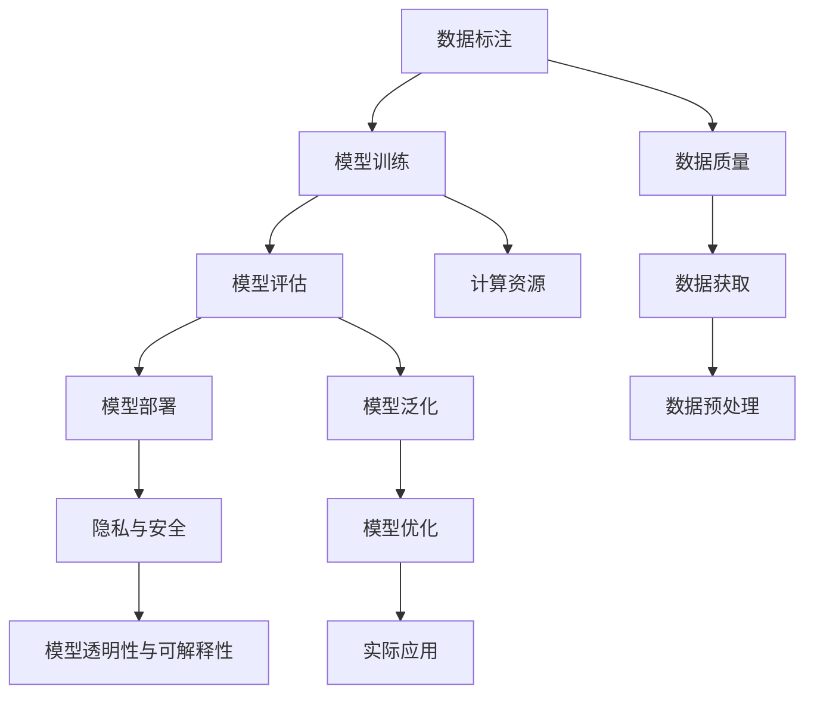

                 

# AI技术在实际应用中的挑战

在当前的数字化转型浪潮中，人工智能(AI)技术正迅速渗透到各行各业，从金融、医疗、教育到制造业、零售、农业，AI的应用范围遍及各个领域。然而，尽管AI技术带来了显著的效率提升和创新突破，但其在实际应用中也面临诸多挑战。本文将深入探讨AI技术在实际应用中的主要挑战，并提出相应的解决方案，旨在帮助业界从业者更好地应对这些挑战，推动AI技术在更广泛的领域和场景中发挥其潜力。

## 1. 背景介绍

### 1.1 问题由来

随着深度学习、计算机视觉、自然语言处理等技术的快速发展，AI技术在众多领域取得了突破性进展。例如，深度学习模型在图像识别、语音识别、机器翻译、自然语言处理等方面已经达到了或接近人类的表现水平。然而，尽管AI技术在学术研究中取得了诸多成果，但在实际应用中仍面临诸多难题，这些问题严重制约了AI技术的广泛部署和深入应用。

### 1.2 问题核心关键点

AI技术在实际应用中的挑战主要集中在以下几个方面：

- **数据质量与获取**：高质量标注数据的获取成本高、难度大。
- **模型泛化能力**：模型在面对新数据或复杂场景时，泛化能力不足。
- **计算资源需求**：大规模模型训练和推理需要大量的计算资源。
- **模型透明性与可解释性**：模型的决策过程难以解释，缺乏透明性。
- **隐私与安全**：大规模数据集和模型的使用，引发隐私和安全性问题。

这些挑战不仅涉及技术层面，还涉及到伦理、法律和隐私保护等社会层面问题。因此，在推动AI技术的应用过程中，需要综合考虑技术、伦理和社会多方面的因素，才能实现AI技术的健康可持续发展。

## 2. 核心概念与联系

### 2.1 核心概念概述

为更好地理解AI技术在实际应用中的挑战，本节将介绍几个核心概念：

- **数据标注**：是指为训练机器学习模型，将原始数据转换为模型可以理解的格式，并打上标签。数据标注是训练高质量模型的关键步骤。
- **模型泛化**：指模型在未见过的数据上保持良好表现的能力。泛化能力是衡量模型是否具有实用价值的重要指标。
- **计算资源**：指用于训练和推理模型的硬件设备，如GPU、TPU等。计算资源的充足程度直接影响AI模型的性能。
- **模型透明性与可解释性**：指模型的决策过程是否可解释，是否能够提供合理的解释。这是用户信任AI系统的基础。
- **隐私与安全**：指在数据和模型使用过程中，如何保护用户隐私和数据安全。隐私保护是AI应用中的重要考虑因素。

这些核心概念之间的逻辑关系可以通过以下Mermaid流程图来展示：



这个流程图展示了大规模AI模型应用的关键环节，以及数据、计算、隐私保护等方面的关联。

## 3. 核心算法原理 & 具体操作步骤
### 3.1 算法原理概述

AI技术在实际应用中的挑战，涉及多个层面和环节。以下将从数据、模型、计算资源、隐私与安全、透明性与可解释性等几个方面进行详细探讨。

### 3.2 算法步骤详解

#### 3.2.1 数据质量与获取

**数据标注**是训练高质量AI模型的关键步骤。高质量的数据标注不仅需要准确性，还需要丰富性和多样性。标注数据的获取和标注质量的控制，直接影响到AI模型的训练效果和应用效果。

**数据获取**可以通过多种方式，包括公开数据集、众包平台、实地调查等。但不同数据获取方式的成本和质量各异。公开数据集通常免费，但可能与特定应用场景不匹配；众包平台可以灵活获取数据，但数据质量难以保证；实地调查可以获得高质量数据，但成本高、周期长。

**数据预处理**包括数据清洗、去噪、归一化等步骤，是数据标注的基础。预处理过程需尽量减少数据中的噪声和偏差，提升数据的可用性。

#### 3.2.2 模型泛化能力

**模型泛化能力**是指模型在新数据上的表现能力。模型泛化能力不足是AI技术应用中的常见问题。常见的原因包括模型过拟合、训练数据不足、模型复杂度高等。

**过拟合**是指模型在训练数据上表现良好，但在新数据上表现不佳的现象。过拟合通常由模型复杂度过高或训练数据量过少导致。为解决过拟合问题，可以采用正则化技术、数据增强、对抗训练等方法。

**数据不足**是指训练数据量过少，导致模型无法充分学习到数据的特征。可以通过数据增强、合成数据、迁移学习等方法，增加数据量和多样性。

**模型复杂度**是指模型的参数量和结构复杂度。复杂度高的模型往往需要更多的计算资源，且泛化能力弱。可以通过参数剪枝、模型压缩等方法，降低模型复杂度。

#### 3.2.3 计算资源需求

**计算资源**是训练和推理大规模AI模型的基础。计算资源的充足程度直接影响AI模型的性能。

**训练计算资源**包括GPU、TPU等高性能计算设备。训练大规模模型通常需要大量的计算资源，因此需要采用分布式训练、模型并行、混合精度训练等技术，优化计算资源的使用。

**推理计算资源**包括CPU、GPU、TPU等设备。推理计算需要尽量减少计算资源消耗，提高计算效率。可以采用模型裁剪、量化加速等技术，优化推理性能。

#### 3.2.4 模型透明性与可解释性

**模型透明性与可解释性**是指模型的决策过程是否可解释，是否能够提供合理的解释。这是用户信任AI系统的基础。

**可解释性**方法包括局部可解释性方法（如SHAP、LIME等）和全局可解释性方法（如LIME、RavDEEP等）。局部可解释性方法可以解释单个样本的预测过程，而全局可解释性方法可以解释模型整体的决策过程。

**透明性**方法包括模型蒸馏、知识图谱等。模型蒸馏可以降低模型复杂度，提高可解释性；知识图谱可以提供领域知识，增强模型的透明性。

#### 3.2.5 隐私与安全

**隐私与安全**是指在数据和模型使用过程中，如何保护用户隐私和数据安全。隐私保护是AI应用中的重要考虑因素。

**数据隐私保护**可以采用差分隐私、联邦学习等技术，保护用户隐私。差分隐私通过添加噪声，保护用户隐私；联邦学习通过在多个设备上分布式训练，保护数据隐私。

**模型安全**可以采用对抗训练、模型蒸馏等技术，保护模型免受攻击。对抗训练通过加入对抗样本，提高模型的鲁棒性；模型蒸馏通过降低模型复杂度，提高模型的安全性。

### 3.3 算法优缺点

AI技术在实际应用中的挑战，涉及多个层面和环节。以下将从数据、模型、计算资源、隐私与安全、透明性与可解释性等几个方面进行详细探讨。

**优点**：
- 提高生产效率和业务创新能力。
- 提供丰富的数据处理和分析工具。
- 优化决策过程，提高决策质量。

**缺点**：
- 数据获取成本高、难度大。
- 模型泛化能力不足。
- 计算资源需求大。
- 模型透明性与可解释性不足。
- 隐私与安全问题。

### 3.4 算法应用领域

AI技术在实际应用中，已经广泛应用于金融、医疗、教育、制造业、零售、农业等多个领域。以下是几个典型的应用场景：

- **金融风控**：通过AI技术对金融数据进行风险评估和欺诈检测，提高金融系统的安全性。
- **医疗诊断**：利用AI技术对医学影像和患者数据进行分析，辅助医生进行疾病诊断和治疗。
- **教育培训**：通过AI技术对学习数据进行分析，提供个性化的学习建议和推荐。
- **智能制造**：通过AI技术对生产数据进行分析，优化生产流程和质量控制。
- **零售推荐**：利用AI技术对用户行为数据进行分析，提供个性化的商品推荐。

这些应用场景展示了AI技术在不同领域的广泛应用，但也暴露了其在实际应用中的诸多挑战。

## 4. 数学模型和公式 & 详细讲解 & 举例说明

### 4.1 数学模型构建

本节将使用数学语言对AI技术在实际应用中的挑战进行更加严格的刻画。

假设AI系统由多个模块组成，包括数据模块、模型模块、计算资源模块、隐私与安全模块、透明性与可解释性模块等。数据模块负责数据的获取、标注和预处理；模型模块负责模型的训练、评估和优化；计算资源模块负责计算资源的分配和管理；隐私与安全模块负责数据隐私和模型安全；透明性与可解释性模块负责模型的透明性和可解释性。

假设数据模块的输入为 $D$，模型的输出为 $Y$，计算资源为 $R$，隐私与安全模块的输出为 $S$，透明性与可解释性模块的输出为 $T$。则整个AI系统的运行过程可以表示为：

$$
Y = F(D, \theta, R, S, T)
$$

其中 $F$ 为系统的运行函数，$\theta$ 为模型的参数，$R$ 为计算资源，$S$ 为隐私与安全模块的输出，$T$ 为透明性与可解释性模块的输出。

### 4.2 公式推导过程

以下我们将从数据质量与获取、模型泛化能力、计算资源需求、模型透明性与可解释性、隐私与安全等几个方面，推导出相关的数学模型和公式。

#### 4.2.1 数据质量与获取

数据质量与获取是AI系统应用中的关键问题。假设数据标注的成本为 $C$，数据标注的质量为 $Q$，则数据标注的边际成本为 $C(Q)$。假设数据标注的质量与成本的关系为：

$$
C(Q) = aQ + b
$$

其中 $a$ 和 $b$ 为常数。则最优的数据标注量为 $Q_{opt}$ 满足：

$$
Q_{opt} = \frac{b}{a}
$$

即在数据标注质量一定的情况下，数据标注的成本最低。

#### 4.2.2 模型泛化能力

模型泛化能力是AI系统应用中的重要指标。假设模型在新数据上的误差为 $E$，模型的复杂度为 $C$，则模型的泛化误差与复杂度的关系为：

$$
E = f(C)
$$

其中 $f$ 为非线性函数。则最优的模型复杂度 $C_{opt}$ 满足：

$$
C_{opt} = \arg\min_{C} E
$$

即在模型复杂度一定的情况下，模型泛化误差最小。

#### 4.2.3 计算资源需求

计算资源需求是AI系统应用中的重要约束。假设计算资源的需求为 $R$，计算资源的成本为 $C$，则计算资源的边际成本为 $C(R)$。假设计算资源的成本与需求的关系为：

$$
C(R) = aR + b
$$

其中 $a$ 和 $b$ 为常数。则最优的计算资源需求 $R_{opt}$ 满足：

$$
R_{opt} = \frac{b}{a}
$$

即在计算资源成本一定的情况下，计算资源需求最低。

#### 4.2.4 模型透明性与可解释性

模型透明性与可解释性是AI系统应用中的重要需求。假设模型的透明性为 $T$，模型的可解释性为 $E$，则透明性与可解释性的关系为：

$$
T = g(E)
$$

其中 $g$ 为非线性函数。则最优的透明性与可解释性组合 $(T_{opt}, E_{opt})$ 满足：

$$
(T_{opt}, E_{opt}) = \arg\max_{(T,E)} T
$$

即在透明性与可解释性一定的情况下，模型透明性最高。

#### 4.2.5 隐私与安全

隐私与安全是AI系统应用中的重要考虑因素。假设隐私保护的成本为 $C$，隐私保护的安全性为 $S$，则隐私保护的安全性与成本的关系为：

$$
S = h(C)
$$

其中 $h$ 为非线性函数。则最优的隐私保护成本 $C_{opt}$ 满足：

$$
C_{opt} = \arg\min_{C} S
$$

即在隐私保护的安全性一定的情况下，隐私保护成本最低。

### 4.3 案例分析与讲解

假设一个医疗诊断AI系统的运行过程如下：

1. **数据模块**：从医院获取患者的医学影像和病历数据，并进行标注和预处理。
2. **模型模块**：使用卷积神经网络(CNN)对医学影像进行特征提取，使用循环神经网络(RNN)对病历数据进行序列建模。
3. **计算资源模块**：使用GPU进行模型的训练和推理。
4. **隐私与安全模块**：对患者的隐私数据进行加密处理，保护患者隐私。
5. **透明性与可解释性模块**：使用可解释性技术，解释模型的决策过程。

下面将通过具体案例，详细讲解AI系统在实际应用中的挑战和解决方案。

## 5. 项目实践：代码实例和详细解释说明

### 5.1 开发环境搭建

在进行AI系统开发前，我们需要准备好开发环境。以下是使用Python进行TensorFlow开发的环境配置流程：

1. 安装Anaconda：从官网下载并安装Anaconda，用于创建独立的Python环境。

2. 创建并激活虚拟环境：
```bash
conda create -n tf-env python=3.8 
conda activate tf-env
```

3. 安装TensorFlow：根据CUDA版本，从官网获取对应的安装命令。例如：
```bash
conda install tensorflow -c pytorch -c conda-forge
```

4. 安装各类工具包：
```bash
pip install numpy pandas scikit-learn matplotlib tqdm jupyter notebook ipython
```

完成上述步骤后，即可在`tf-env`环境中开始AI系统开发。

### 5.2 源代码详细实现

下面我们以医疗影像分类为例，给出使用TensorFlow对卷积神经网络(CNN)进行训练的PyTorch代码实现。

首先，定义CNN模型和数据处理函数：

```python
import tensorflow as tf
from tensorflow.keras import layers

class CNNModel(tf.keras.Model):
    def __init__(self, num_classes):
        super(CNNModel, self).__init__()
        self.conv1 = layers.Conv2D(32, (3, 3), activation='relu', padding='same')
        self.pool1 = layers.MaxPooling2D((2, 2))
        self.conv2 = layers.Conv2D(64, (3, 3), activation='relu', padding='same')
        self.pool2 = layers.MaxPooling2D((2, 2))
        self.flatten = layers.Flatten()
        self.dense1 = layers.Dense(512, activation='relu')
        self.dropout = layers.Dropout(0.5)
        self.dense2 = layers.Dense(num_classes, activation='softmax')

    def call(self, x):
        x = self.conv1(x)
        x = self.pool1(x)
        x = self.conv2(x)
        x = self.pool2(x)
        x = self.flatten(x)
        x = self.dense1(x)
        x = self.dropout(x)
        x = self.dense2(x)
        return x

def data_preprocessing(data_dir):
    images = []
    labels = []
    for image_file in os.listdir(data_dir):
        image = tf.keras.preprocessing.image.load_img(os.path.join(data_dir, image_file), target_size=(224, 224))
        image = tf.keras.preprocessing.image.img_to_array(image)
        image = tf.expand_dims(image, axis=0)
        labels.append(image_file.split('.')[0])
        images.append(image)
    return tf.concat(images, axis=0), tf.keras.utils.to_categorical(labels, num_classes)
```

然后，定义训练和评估函数：

```python
from sklearn.model_selection import train_test_split

train_data, test_data = train_test_split(data, test_size=0.2)

train_dataset = tf.data.Dataset.from_tensor_slices((train_images, train_labels)).shuffle(1000).batch(32)
test_dataset = tf.data.Dataset.from_tensor_slices((test_images, test_labels)).batch(32)

def train_model(model, dataset, batch_size, optimizer, epochs):
    for epoch in range(epochs):
        model.compile(optimizer=optimizer, loss='categorical_crossentropy', metrics=['accuracy'])
        model.fit(dataset, validation_data=test_dataset, epochs=1, batch_size=batch_size)

    test_loss, test_acc = model.evaluate(test_dataset, verbose=2)
    print('Test accuracy:', test_acc)

    # 保存模型
    model.save('cnn_model.h5')
```

最后，启动训练流程并在测试集上评估：

```python
epochs = 10
batch_size = 32

model = CNNModel(num_classes)
optimizer = tf.keras.optimizers.Adam(learning_rate=0.001)

train_model(model, train_dataset, batch_size, optimizer, epochs)
test_model(model, test_dataset)
```

以上就是使用TensorFlow对CNN进行医疗影像分类任务训练的完整代码实现。可以看到，得益于TensorFlow的强大封装，我们可以用相对简洁的代码完成CNN模型的训练。

### 5.3 代码解读与分析

让我们再详细解读一下关键代码的实现细节：

**CNNModel类**：
- `__init__`方法：初始化卷积层、池化层、全连接层等关键组件。
- `call`方法：定义模型的前向传播过程，返回模型的输出。

**data_preprocessing函数**：
- 定义数据预处理函数，将原始图像数据转换为模型可用的格式。

**train_model函数**：
- 定义训练函数，使用TensorFlow的API对数据集进行批次化加载，对模型进行训练和评估。
- 在每个epoch内，使用`fit`方法对模型进行训练，并在测试集上进行评估。
- 训练完成后，保存模型到本地。

可以看到，TensorFlow提供了便捷的API和丰富的工具，使得深度学习模型的训练和部署变得简单高效。但实际应用中，还需要考虑更多因素，如模型的裁剪、量化加速、服务化封装等。

## 6. 实际应用场景

### 6.1 金融风控

**背景**：
金融行业面临着欺诈检测、信用评估、风险管理等诸多挑战。AI技术通过分析大量的交易数据、用户行为数据和信用记录，可以有效地识别出潜在的欺诈行为和风险用户，帮助金融机构降低损失。

**应用**：
- **欺诈检测**：利用机器学习模型对用户的交易行为进行实时分析，识别异常交易。
- **信用评估**：通过分析用户的信用记录和行为数据，评估其信用风险。
- **风险管理**：利用深度学习模型对市场数据进行分析和预测，评估金融产品的风险。

**挑战**：
- 数据获取成本高、难度大。
- 模型泛化能力不足。
- 计算资源需求大。

**解决方案**：
- 采用联邦学习等分布式训练方法，减少数据获取和标注成本。
- 使用对抗训练等方法，提高模型的泛化能力。
- 采用模型压缩、量化加速等技术，优化计算资源的使用。

### 6.2 医疗诊断

**背景**：
医疗行业面临着疾病诊断、药物研发、医疗管理等诸多挑战。AI技术通过分析大量的医疗数据，可以辅助医生进行疾病诊断、药物研发和医疗管理。

**应用**：
- **疾病诊断**：利用深度学习模型对医学影像和患者数据进行分析，辅助医生进行疾病诊断和治疗。
- **药物研发**：通过分析大量的药物数据和临床试验数据，发现新的药物和治疗方法。
- **医疗管理**：利用机器学习模型对患者数据进行分析和预测，优化医疗资源配置。

**挑战**：
- 数据质量与获取。
- 模型透明性与可解释性不足。
- 隐私与安全问题。

**解决方案**：
- 采用差分隐私等技术，保护患者隐私。
- 使用可解释性技术，提高模型的透明性和可解释性。
- 采用对抗训练等方法，提高模型的鲁棒性。

### 6.3 教育培训

**背景**：
教育行业面临着个性化学习、学习评估、教学管理等诸多挑战。AI技术通过分析大量的学习数据，可以提供个性化的学习建议和推荐，优化教学资源配置。

**应用**：
- **个性化学习**：利用机器学习模型对学生的学习数据进行分析，提供个性化的学习建议和推荐。
- **学习评估**：通过分析学生的学习数据，评估其学习效果和进度。
- **教学管理**：利用机器学习模型对教学资源进行分析和预测，优化教学资源配置。

**挑战**：
- 数据获取成本高、难度大。
- 模型透明性与可解释性不足。

**解决方案**：
- 采用联邦学习等分布式训练方法，减少数据获取和标注成本。
- 使用可解释性技术，提高模型的透明性和可解释性。

### 6.4 智能制造

**背景**：
制造业面临着生产效率、产品质量、设备维护等诸多挑战。AI技术通过分析大量的生产数据，可以优化生产流程，提高生产效率和产品质量，减少设备维护成本。

**应用**：
- **生产优化**：利用机器学习模型对生产数据进行分析，优化生产流程和质量控制。
- **设备维护**：通过分析设备数据，预测设备故障和维护需求。
- **供应链管理**：利用机器学习模型对供应链数据进行分析，优化供应链管理。

**挑战**：
- 数据质量与获取。
- 计算资源需求大。

**解决方案**：
- 采用数据增强等技术，提高数据的可用性。
- 采用模型压缩、量化加速等技术，优化计算资源的使用。

## 7. 工具和资源推荐

### 7.1 学习资源推荐

为了帮助开发者系统掌握AI技术的理论基础和实践技巧，这里推荐一些优质的学习资源：

1. **《深度学习》书籍**：由Ian Goodfellow、Yoshua Bengio和Aaron Courville所著，全面介绍了深度学习的理论和实践。

2. **Coursera《深度学习专项课程》**：由吴恩达教授主讲，介绍了深度学习的基本概念和常用技术。

3. **Kaggle**：全球最大的数据科学竞赛平台，提供丰富的数据集和模型，适合实战练习。

4. **Google AI Blog**：Google AI团队定期发布的博客，介绍了最新的AI研究成果和实践经验。

5. **TensorFlow官方文档**：TensorFlow官方提供的详细文档，提供了丰富的API和工具，适合深入学习。

6. **PyTorch官方文档**：PyTorch官方提供的详细文档，提供了丰富的API和工具，适合深入学习。

通过对这些资源的学习实践，相信你一定能够快速掌握AI技术的精髓，并用于解决实际的业务问题。

### 7.2 开发工具推荐

高效的开发离不开优秀的工具支持。以下是几款用于AI开发常用的工具：

1. **PyTorch**：由Facebook开源的深度学习框架，灵活的计算图和动态图，适合快速迭代研究。

2. **TensorFlow**：由Google主导开发的深度学习框架，生产部署方便，适合大规模工程应用。

3. **Keras**：基于TensorFlow、Theano等深度学习框架的高级API，适合快速原型开发。

4. **TensorBoard**：TensorFlow配套的可视化工具，实时监测模型训练状态，提供丰富的图表呈现方式。

5. **Weights & Biases**：模型训练的实验跟踪工具，记录和可视化模型训练过程中的各项指标，方便对比和调优。

6. **Jupyter Notebook**：基于Python的交互式编程环境，适合实时调试和展示代码。

合理利用这些工具，可以显著提升AI技术的开发效率，加快创新迭代的步伐。

### 7.3 相关论文推荐

AI技术在实际应用中，需要不断的理论创新和技术突破。以下是几篇奠基性的相关论文，推荐阅读：

1. **《深度学习》书籍**：由Ian Goodfellow、Yoshua Bengio和Aaron Courville所著，全面介绍了深度学习的理论和实践。

2. **《机器学习》书籍**：由Tom Mitchell所著，介绍了机器学习的基本概念和常用技术。

3. **《自然语言处理综论》书籍**：由Daniel Jurafsky和James H. Martin所著，介绍了自然语言处理的基本概念和常用技术。

4. **《计算机视觉：模型、学习和推理》书籍**：由Richard Szeliski所著，介绍了计算机视觉的基本概念和常用技术。

5. **《计算机视觉中的深度学习》论文**：由Geoffrey Hinton等人所著，介绍了深度学习在计算机视觉中的应用。

6. **《自然语言处理中的深度学习》论文**：由Yoshua Bengio等人所著，介绍了深度学习在自然语言处理中的应用。

这些论文代表了大规模AI技术的发展脉络。通过学习这些前沿成果，可以帮助研究者把握学科前进方向，激发更多的创新灵感。

## 8. 总结：未来发展趋势与挑战

### 8.1 研究成果总结

AI技术在实际应用中，已经取得了显著的进展，但也面临着诸多挑战。本文对AI技术在实际应用中的挑战进行了全面系统的介绍，并提出了相应的解决方案，旨在帮助业界从业者更好地应对这些挑战，推动AI技术在更广泛的领域和场景中发挥其潜力。

### 8.2 未来发展趋势

展望未来，AI技术在实际应用中，将呈现以下几个发展趋势：

1. **数据量的爆炸增长**：随着物联网、大数据、云计算等技术的发展，数据量将呈指数级增长。数据量的爆炸增长将推动AI技术的快速发展和广泛应用。

2. **算力的不断提升**：随着GPU、TPU等高性能计算设备的普及，算力将不断提升。算力的提升将推动大规模AI模型的训练和推理，进一步提升AI技术的效果。

3. **模型的多样化与融合**：未来的AI模型将更加多样化，包括基于规则的模型、基于数据的模型、基于机器学习的模型等。不同模型的融合，将提升AI技术的综合效果。

4. **应用的普及与深化**：未来的AI技术将在各个领域和场景中得到广泛应用，并逐步深化。AI技术的应用将从辅助决策转向自主决策，推动各行业的智能化进程。

5. **伦理与隐私的重视**：未来的AI技术将更加注重伦理与隐私保护。AI技术的开发和使用，将更加注重公平、透明和可解释性。

6. **跨领域的协作与融合**：未来的AI技术将更加注重跨领域的协作与融合。AI技术将与其他技术进行协同发展，推动技术的全面进步。

### 8.3 面临的挑战

尽管AI技术在实际应用中取得了显著的进展，但在迈向更加智能化、普适化应用的过程中，仍面临诸多挑战：

1. **数据获取的难度与成本**：高质量标注数据的获取成本高、难度大，限制了AI技术的广泛应用。

2. **模型的泛化能力**：模型在面对新数据或复杂场景时，泛化能力不足，难以应对多变的现实世界。

3. **计算资源的需求**：大规模模型训练和推理需要大量的计算资源，成本高、效率低。

4. **模型的透明性与可解释性**：模型的决策过程难以解释，缺乏透明性，难以获得用户信任。

5. **隐私与安全的保护**：大规模数据集和模型的使用，引发隐私和安全性问题。

6. **伦理与法律的约束**：AI技术的开发和使用，需要考虑伦理与法律的约束，避免对人类社会造成负面影响。

### 8.4 研究展望

未来的AI技术需要不断的理论创新和技术突破，才能适应不断变化的现实世界。以下是几个未来的研究方向：

1. **数据生成与增强**：开发更加高效的数据生成与增强技术，减少对高质量标注数据的依赖。

2. **模型的可解释性**：开发更加透明和可解释的模型，提高AI系统的可信度和可靠性。

3. **隐私与安全保护**：开发更加安全的AI技术，保护用户隐私和数据安全。

4. **跨领域的协作与融合**：推动AI技术与其他技术的协同发展，推动技术的全面进步。

5. **伦理与法律的约束**：加强AI技术的伦理与法律约束，避免对人类社会造成负面影响。

## 9. 附录：常见问题与解答

**Q1：如何提高AI系统的泛化能力？**

A: 提高AI系统的泛化能力，可以从以下几个方面进行：

- **数据增强**：通过数据增强技术，增加数据的多样性和数量。
- **对抗训练**：通过对抗训练，提高模型的鲁棒性。
- **正则化技术**：通过正则化技术，防止模型过拟合。
- **迁移学习**：通过迁移学习，利用预训练模型的知识，提高模型的泛化能力。
- **模型蒸馏**：通过模型蒸馏，降低模型复杂度，提高泛化能力。

**Q2：如何提高AI系统的透明性与可解释性？**

A: 提高AI系统的透明性与可解释性，可以从以下几个方面进行：

- **局部可解释性方法**：如SHAP、LIME等，解释单个样本的预测过程。
- **全局可解释性方法**：如LIME、RavDEEP等，解释模型整体的决策过程。
- **模型蒸馏**：通过模型蒸馏，降低模型复杂度，提高透明性和可解释性。
- **知识图谱**：利用知识图谱，提供领域知识，增强透明性和可解释性。

**Q3：如何保护AI系统的隐私与安全？**

A: 保护AI系统的隐私与安全，可以从以下几个方面进行：

- **差分隐私**：通过差分隐私，保护用户隐私。
- **联邦学习**：通过联邦学习，在多个设备上分布式训练，保护数据隐私。
- **对抗训练**：通过对抗训练，提高模型的鲁棒性，保护模型安全。
- **模型蒸馏**：通过模型蒸馏，降低模型复杂度，提高安全性。

**Q4：如何优化AI系统的计算资源使用？**

A: 优化AI系统的计算资源使用，可以从以下几个方面进行：

- **模型压缩**：通过模型压缩，降低模型复杂度，减少计算资源的使用。
- **量化加速**：通过量化加速，将浮点模型转为定点模型，压缩存储空间，提高计算效率。
- **分布式训练**：通过分布式训练，优化计算资源的分配和使用。
- **混合精度训练**：通过混合精度训练，提高计算效率，减少计算资源的使用。

**Q5：如何构建跨领域的AI系统？**

A: 构建跨领域的AI系统，可以从以下几个方面进行：

- **领域知识融合**：将领域知识与AI模型进行融合，提高模型的综合效果。
- **多模态信息整合**：将视觉、语音、文本等多模态信息进行整合，提高模型的泛化能力。
- **跨领域模型迁移**：通过迁移学习，将预训练模型迁移到新领域，提升模型的泛化能力。
- **跨领域协同研发**：推动跨领域的协同研发，促进技术的全面进步。

通过以上分析和实践，相信您对AI技术在实际应用中的挑战有了更深入的理解。面对这些挑战，需要不断的理论创新和技术突破，才能实现AI技术的健康可持续发展。

