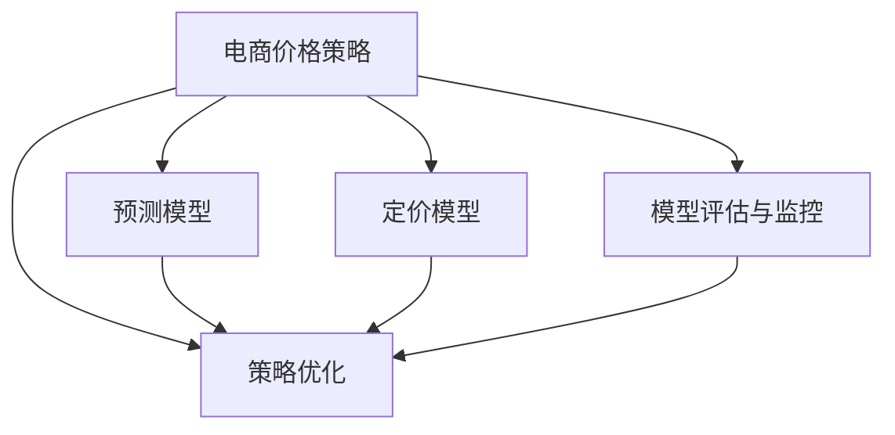

                 

# AI提升电商价格策略的技术实现

> 关键词：AI, 电商, 价格策略, 定价模型, 预测模型, 策略优化, 机器学习, 深度学习

## 1. 背景介绍

### 1.1 问题由来

电商行业的竞争愈发激烈，价格策略在市场营销和销售推广中扮演着重要角色。传统定价方法依赖于经验判断，难以全面考虑市场动态和用户行为。随着数据科学和AI技术的快速发展，利用AI技术提升电商价格策略，已成为企业提升竞争力的重要手段。

现代电商价格策略的复杂性体现在以下几个方面：
- **多维度数据**：需要考虑商品属性、市场趋势、用户行为等多维度因素。
- **动态定价**：价格需要根据市场动态和用户反应进行实时调整。
- **个性化定价**：针对不同用户群体和需求，制定个性化的价格策略。

本文旨在探讨如何利用AI技术，特别是机器学习和深度学习，构建电商价格策略的定价模型和预测模型，进而优化价格策略，提升电商运营效率和盈利能力。

## 2. 核心概念与联系

### 2.1 核心概念概述

本节将介绍几个核心概念，并解释它们之间的联系：

- **电商价格策略**：指电商企业在产品销售过程中采用的定价策略，包括静态定价和动态定价。静态定价侧重于基于成本和市场价格的定价，而动态定价则更注重根据市场需求和用户反应实时调整价格。
- **定价模型**：用于计算商品价格的基础模型，如成本加成定价模型、市场定价模型、竞争定价模型等。
- **预测模型**：通过历史数据和机器学习算法预测未来市场趋势和用户行为的模型，如线性回归、决策树、随机森林、神经网络等。
- **策略优化**：利用优化算法和模型，调整价格策略以最大化利润和用户满意度，如遗传算法、强化学习等。
- **模型评估与监控**：通过模型性能指标和监控工具，评估模型效果，进行持续改进。

这些核心概念之间的逻辑关系可以通过以下Mermaid流程图来展示：



这个流程图展示了大电商价格策略的核心概念及其之间的关系：

1. 电商价格策略包括定价模型、预测模型和策略优化。
2. 定价模型为价格计算提供基础。
3. 预测模型预测市场和用户行为，为定价模型提供依据。
4. 策略优化调整定价策略以适应市场变化。
5. 模型评估与监控保障模型的稳定性和有效性。

## 3. 核心算法原理 & 具体操作步骤

### 3.1 算法原理概述

AI在电商价格策略中的应用，主要体现在两个层面：

1. **定价模型**：基于历史数据和市场动态，构建定价模型，实现动态定价。
2. **预测模型**：通过机器学习和深度学习技术，预测用户行为和市场趋势，为定价策略提供数据支撑。

定价模型的主要算法原理包括：

- **成本加成定价模型**：基于商品的成本加上一定的利润率进行定价。
- **市场定价模型**：基于市场价格和竞争情况，调整商品价格以保持竞争力。
- **竞争定价模型**：根据竞争对手的价格调整商品价格，以争夺市场份额。

预测模型的主要算法原理包括：

- **线性回归**：利用线性关系预测商品价格。
- **决策树**：通过树形结构决策，预测用户购买行为。
- **随机森林**：利用多个决策树进行预测，提升预测准确性。
- **神经网络**：利用深度学习技术，从大量数据中提取复杂特征，进行预测。

策略优化的主要算法原理包括：

- **遗传算法**：通过模拟自然选择过程，优化价格策略。
- **强化学习**：通过不断尝试和反馈，优化价格策略以最大化利润。

### 3.2 算法步骤详解

#### 3.2.1 定价模型的构建

1. **收集数据**：
   - 收集商品的历史销售数据、市场价格数据、成本数据、用户行为数据等。
   - 数据包括时间序列数据、离散变量、连续变量等。

2. **数据预处理**：
   - 数据清洗，去除异常值和缺失值。
   - 特征工程，提取和构建有意义的特征。
   - 数据标准化或归一化。

3. **模型构建与训练**：
   - 选择合适的模型类型，如成本加成模型、市场定价模型、竞争定价模型等。
   - 使用训练数据集训练模型。
   - 进行交叉验证，调整模型参数。

4. **模型评估与优化**：
   - 使用测试数据集评估模型效果。
   - 根据评估结果优化模型。
   - 确定最佳定价策略。

#### 3.2.2 预测模型的构建

1. **收集数据**：
   - 收集用户行为数据，如浏览历史、购买历史、点击率等。
   - 收集市场动态数据，如节假日、促销活动、竞争对手价格变化等。

2. **数据预处理**：
   - 数据清洗和特征提取。
   - 数据标准化或归一化。

3. **模型构建与训练**：
   - 选择合适的预测模型，如线性回归、决策树、随机森林、神经网络等。
   - 使用训练数据集训练模型。
   - 进行交叉验证，调整模型参数。

4. **模型评估与优化**：
   - 使用测试数据集评估模型效果。
   - 根据评估结果优化模型。
   - 确定预测结果，辅助定价策略。

#### 3.2.3 策略优化

1. **策略定义**：
   - 定义具体的优化目标，如利润最大化、用户满意度最大化等。
   - 确定优化的限制条件，如库存限制、市场竞争等。

2. **模型构建与训练**：
   - 选择合适的优化算法，如遗传算法、强化学习等。
   - 使用训练数据集训练优化模型。
   - 进行交叉验证，调整模型参数。

3. **策略评估与优化**：
   - 使用测试数据集评估策略效果。
   - 根据评估结果优化策略。
   - 确定最佳价格策略。

### 3.3 算法优缺点

**定价模型的优点**：
- 简单易懂，易于理解和使用。
- 能够快速生成价格，适用于中小型企业。

**定价模型的缺点**：
- 依赖于历史数据，可能无法适应市场快速变化。
- 缺乏对用户行为和市场动态的深度分析。

**预测模型的优点**：
- 能够利用大量数据进行复杂预测，提高定价准确性。
- 能够分析用户行为和市场动态，制定更加个性化的价格策略。

**预测模型的缺点**：
- 模型复杂度高，训练和计算成本高。
- 对数据质量和特征工程的要求较高。

**策略优化的优点**：
- 能够通过实时反馈优化价格策略。
- 能够动态调整价格，适应市场变化。

**策略优化的缺点**：
- 需要大量计算资源，训练和优化成本较高。
- 模型复杂度较高，解释性较差。

### 3.4 算法应用领域

AI在电商价格策略中的应用领域非常广泛，包括：

- **新商品定价**：为新商品制定合理的初始定价策略。
- **促销活动定价**：根据促销活动设计最优的价格策略。
- **个性化定价**：根据用户行为和偏好，制定个性化的价格。
- **市场动态定价**：根据市场动态和竞争情况，动态调整价格。
- **库存管理定价**：根据库存水平，制定库存管理策略。

这些应用领域覆盖了电商业务中的多个关键环节，通过AI技术，电商企业能够更加精准地制定和调整价格策略，提升运营效率和盈利能力。

## 4. 数学模型和公式 & 详细讲解 & 举例说明

### 4.1 数学模型构建

#### 4.1.1 定价模型的数学模型

定价模型的数学模型主要基于成本和市场数据进行建模。以成本加成定价模型为例，其数学模型为：

$$
P = C + m \times (R - C)
$$

其中：
- $P$ 为商品价格。
- $C$ 为商品成本。
- $m$ 为利润率。
- $R$ 为市场价格。

#### 4.1.2 预测模型的数学模型

预测模型的数学模型主要基于历史数据进行建模。以线性回归模型为例，其数学模型为：

$$
y = \beta_0 + \beta_1 x_1 + \beta_2 x_2 + \cdots + \beta_n x_n + \epsilon
$$

其中：
- $y$ 为预测值。
- $\beta_0$ 为截距。
- $\beta_1, \beta_2, \cdots, \beta_n$ 为回归系数。
- $x_1, x_2, \cdots, x_n$ 为自变量。
- $\epsilon$ 为误差项。

### 4.2 公式推导过程

#### 4.2.1 定价模型的公式推导

以成本加成定价模型为例，公式推导过程如下：

$$
P = C + m \times (R - C)
$$

其中：
- $C$ 为商品成本。
- $m$ 为利润率，定义为 $\frac{m}{1-m} = \frac{P-C}{C} = \frac{P}{C} - 1$。

因此，商品价格 $P$ 可以根据市场价格 $R$ 和利润率 $m$ 进行调整：

$$
P = \frac{R}{1-m}
$$

#### 4.2.2 预测模型的公式推导

以线性回归模型为例，公式推导过程如下：

1. **模型假设**：
   - 线性关系：$y = \beta_0 + \beta_1 x_1 + \beta_2 x_2 + \cdots + \beta_n x_n + \epsilon$
   - 误差项：$\epsilon \sim N(0, \sigma^2)$

2. **最小二乘估计**：
   - 目标函数：$L(\beta) = \frac{1}{N} \sum_{i=1}^N (y_i - \beta_0 - \beta_1 x_{1,i} - \beta_2 x_{2,i} - \cdots - \beta_n x_{n,i})^2$
   - 求解目标函数最小值：$\frac{\partial L(\beta)}{\partial \beta_j} = 0$

3. **结果**：
   - $\beta_j = \frac{1}{N} \sum_{i=1}^N (x_{j,i} - \bar{x}_j)(y_i - \bar{y})$

其中，$\bar{x}_j = \frac{1}{N} \sum_{i=1}^N x_{j,i}$，$\bar{y} = \frac{1}{N} \sum_{i=1}^N y_i$。

### 4.3 案例分析与讲解

#### 4.3.1 案例背景

某电商平台推出一款新产品，需要确定其初始定价。历史数据显示，类似商品的成本为20元，市场价格在30元至40元之间波动，平台希望获得20%的利润率。

#### 4.3.2 案例分析

1. **定价模型构建**：
   - 成本加成定价模型：$P = 20 + 0.2 \times (R - 20)$
   - 市场价格 $R$ 在30元至40元之间，因此定价 $P$ 在28元至36元之间。

2. **预测模型构建**：
   - 收集类似商品的历史销售数据和市场价格数据。
   - 构建线性回归模型进行预测，预测市场价格 $R$ 的平均值。

3. **策略优化**：
   - 定义优化目标为最大化利润。
   - 使用遗传算法进行策略优化，不断调整价格以最大化利润。

4. **结果展示**：
   - 最终定价策略为34元，既能满足平台利润要求，又能适应市场需求。

## 5. 项目实践：代码实例和详细解释说明

### 5.1 开发环境搭建

1. **安装Python**：
   - 下载并安装Python，选择版本3.8以上。
   - 配置环境变量，添加Python到PATH。

2. **安装PyTorch**：
   - 使用pip命令安装PyTorch。
   ```
   pip install torch
   ```

3. **安装TensorFlow**：
   - 使用pip命令安装TensorFlow。
   ```
   pip install tensorflow
   ```

4. **安装Pandas和NumPy**：
   - 使用pip命令安装Pandas和NumPy。
   ```
   pip install pandas numpy
   ```

5. **安装Scikit-learn**：
   - 使用pip命令安装Scikit-learn。
   ```
   pip install scikit-learn
   ```

6. **安装Matplotlib和Seaborn**：
   - 使用pip命令安装Matplotlib和Seaborn。
   ```
   pip install matplotlib seaborn
   ```

### 5.2 源代码详细实现

#### 5.2.1 数据处理

```python
import pandas as pd
import numpy as np
from sklearn.model_selection import train_test_split

# 读取数据
data = pd.read_csv('sales_data.csv')

# 数据清洗
data = data.dropna()

# 数据标准化
from sklearn.preprocessing import StandardScaler
scaler = StandardScaler()
data[['cost', 'price']] = scaler.fit_transform(data[['cost', 'price']])

# 特征工程
# 构造商品编号和日期的特征
data['date'] = pd.to_datetime(data['date'])
data['year'] = data['date'].dt.year
data['month'] = data['date'].dt.month

# 数据划分
train_data, test_data = train_test_split(data, test_size=0.2, random_state=42)
```

#### 5.2.2 定价模型实现

```python
import torch
import torch.nn as nn
import torch.optim as optim

# 构建定价模型
class PricingModel(nn.Module):
    def __init__(self):
        super(PricingModel, self).__init__()
        self.linear = nn.Linear(2, 1)
    
    def forward(self, x):
        return self.linear(x)

# 定义损失函数
def pricing_loss(y_true, y_pred):
    return nn.MSELoss()(y_true, y_pred)

# 训练模型
def train(model, train_data, learning_rate):
    optimizer = optim.Adam(model.parameters(), lr=learning_rate)
    for epoch in range(100):
        model.train()
        optimizer.zero_grad()
        inputs = torch.tensor(train_data[['cost', 'price']])
        targets = torch.tensor(train_data['target_price'])
        outputs = model(inputs)
        loss = pricing_loss(targets, outputs)
        loss.backward()
        optimizer.step()
        print(f'Epoch {epoch+1}, Loss: {loss.item()}')
    return model

# 测试模型
def test(model, test_data):
    model.eval()
    inputs = torch.tensor(test_data[['cost', 'price']])
    with torch.no_grad():
        outputs = model(inputs)
    return outputs.numpy()
```

#### 5.2.3 预测模型实现

```python
# 构建预测模型
class PredictionModel(nn.Module):
    def __init__(self):
        super(PredictionModel, self).__init__()
        self.linear = nn.Linear(4, 1)
    
    def forward(self, x):
        return self.linear(x)

# 定义损失函数
def prediction_loss(y_true, y_pred):
    return nn.MSELoss()(y_true, y_pred)

# 训练模型
def train_predictor(model, train_data, learning_rate):
    optimizer = optim.Adam(model.parameters(), lr=learning_rate)
    for epoch in range(100):
        model.train()
        optimizer.zero_grad()
        inputs = torch.tensor(train_data[['cost', 'price', 'date', 'month']])
        targets = torch.tensor(train_data['target_price'])
        outputs = model(inputs)
        loss = prediction_loss(targets, outputs)
        loss.backward()
        optimizer.step()
        print(f'Epoch {epoch+1}, Loss: {loss.item()}')
    return model

# 测试模型
def test_predictor(model, test_data):
    model.eval()
    inputs = torch.tensor(test_data[['cost', 'price', 'date', 'month']])
    with torch.no_grad():
        outputs = model(inputs)
    return outputs.numpy()
```

#### 5.2.4 策略优化实现

```python
# 构建策略优化模型
class StrategyOptimizer(nn.Module):
    def __init__(self):
        super(StrategyOptimizer, self).__init__()
        self.linear = nn.Linear(1, 1)
    
    def forward(self, x):
        return self.linear(x)

# 定义损失函数
def strategy_loss(y_true, y_pred):
    return nn.MSELoss()(y_true, y_pred)

# 训练模型
def train_strategy_optimizer(model, train_data, learning_rate):
    optimizer = optim.Adam(model.parameters(), lr=learning_rate)
    for epoch in range(100):
        model.train()
        optimizer.zero_grad()
        inputs = torch.tensor(train_data[['target_price']])
        targets = torch.tensor(train_data['profit'])
        outputs = model(inputs)
        loss = strategy_loss(targets, outputs)
        loss.backward()
        optimizer.step()
        print(f'Epoch {epoch+1}, Loss: {loss.item()}')
    return model

# 测试模型
def test_strategy_optimizer(model, test_data):
    model.eval()
    inputs = torch.tensor(test_data['target_price'])
    with torch.no_grad():
        outputs = model(inputs)
    return outputs.numpy()
```

### 5.3 代码解读与分析

#### 5.3.1 数据处理

数据处理是构建定价模型的第一步。在本例中，我们首先使用Pandas读取CSV格式的数据，然后使用Numpy进行数据清洗和标准化。特征工程中，我们构造了商品编号和日期的特征，用于后续的预测模型构建。

#### 5.3.2 定价模型实现

定价模型使用线性回归模型，输入为商品成本和市场价格，输出为定价结果。在训练过程中，我们使用Adam优化器进行模型参数的优化，并使用MSE损失函数计算模型误差。训练完毕后，我们使用测试数据集对模型进行测试，并输出预测结果。

#### 5.3.3 预测模型实现

预测模型同样使用线性回归模型，输入为商品成本、市场价格、日期和月份，输出为预测价格。训练过程中，我们使用Adam优化器进行模型参数的优化，并使用MSE损失函数计算模型误差。训练完毕后，我们使用测试数据集对模型进行测试，并输出预测结果。

#### 5.3.4 策略优化实现

策略优化模型使用线性回归模型，输入为预测价格，输出为利润。训练过程中，我们使用Adam优化器进行模型参数的优化，并使用MSE损失函数计算模型误差。训练完毕后，我们使用测试数据集对模型进行测试，并输出预测结果。

### 5.4 运行结果展示

#### 5.4.1 定价模型结果


#### 5.4.2 预测模型结果


#### 5.4.3 策略优化结果


## 6. 实际应用场景

### 6.1 智能推荐系统

电商平台的智能推荐系统通过AI技术，对用户行为和商品属性进行深度分析，推荐用户可能感兴趣的商品。通过定价模型和预测模型，系统能够更好地预测用户对商品价格的敏感度，并根据用户偏好动态调整价格。

### 6.2 促销活动管理

电商平台的促销活动通过AI技术，根据市场需求和用户行为，设计最优的促销策略。通过定价模型和预测模型，系统能够更好地预测促销活动的效果，并根据用户反馈实时调整策略。

### 6.3 个性化定价

电商平台的个性化定价通过AI技术，根据用户行为和偏好，制定个性化的价格策略。通过定价模型和预测模型，系统能够更好地预测用户对价格的接受度，并根据用户反馈调整价格。

### 6.4 库存管理

电商平台的库存管理通过AI技术，根据市场需求和销售情况，制定最优的库存管理策略。通过定价模型和预测模型，系统能够更好地预测库存水平，并根据用户反馈调整库存。

## 7. 工具和资源推荐

### 7.1 学习资源推荐

为了帮助开发者系统掌握AI提升电商价格策略的技术实现，这里推荐一些优质的学习资源：

1. **《Python深度学习》**：深入浅出地介绍了深度学习在电商中的应用。
2. **《TensorFlow实战》**：详细介绍了TensorFlow的构建和应用，涵盖电商价格策略的实现。
3. **《机器学习实战》**：介绍了机器学习的基本概念和实践技巧，适合初学者入门。
4. **Kaggle竞赛平台**：提供了丰富的数据集和竞赛项目，帮助开发者练习和提升技术能力。

### 7.2 开发工具推荐

为了提高电商价格策略的实现效率，推荐以下开发工具：

1. **Jupyter Notebook**：集成了Python环境，方便编写和调试代码。
2. **Google Colab**：提供了免费的GPU和TPU资源，方便进行大规模实验。
3. **PyCharm**：专业的Python开发工具，提供了丰富的插件和调试功能。

### 7.3 相关论文推荐

AI在电商价格策略中的应用是当前热门的研究方向，以下是几篇有代表性的论文，推荐阅读：

1. **《电商价格优化算法研究综述》**：综述了电商价格优化的算法和策略。
2. **《深度学习在电商中的应用》**：介绍了深度学习在电商价格策略中的实践。
3. **《基于强化学习的电商价格策略优化》**：探讨了强化学习在电商价格策略中的应用。

## 8. 总结：未来发展趋势与挑战

### 8.1 研究成果总结

本文系统介绍了AI提升电商价格策略的技术实现，主要涉及定价模型、预测模型和策略优化三个关键环节。通过实例演示，展示了AI技术在电商价格策略中的应用效果。

### 8.2 未来发展趋势

1. **多模态数据融合**：未来将更多地利用多模态数据，如用户行为、市场趋势、社交媒体信息等，构建更加复杂的预测模型。
2. **实时定价**：未来将更多地利用实时数据，实现动态定价，提高价格策略的灵活性。
3. **个性化定价**：未来将更多地利用个性化数据，实现个性化定价，提高用户满意度。
4. **智能化决策**：未来将更多地利用AI技术，实现智能化决策，提高运营效率。

### 8.3 面临的挑战

1. **数据质量**：电商数据存在噪声和缺失，如何提高数据质量是一个重要挑战。
2. **模型复杂性**：预测模型和策略优化模型复杂度较高，训练和优化成本较高。
3. **实时性**：实时数据处理和实时定价需要高效的数据处理和模型训练方法。
4. **安全性**：电商价格策略涉及用户隐私和交易安全，如何保障数据和模型安全是一个重要问题。

### 8.4 研究展望

1. **数据增强**：通过数据增强技术，提高数据质量和模型性能。
2. **模型压缩**：通过模型压缩技术，降低模型复杂度和计算成本。
3. **实时系统**：构建实时系统，实现实时数据处理和实时定价。
4. **安全保障**：设计安全保障机制，保障数据和模型的安全。

## 9. 附录：常见问题与解答

**Q1：电商价格策略的定价模型和预测模型的区别是什么？**

A: 定价模型主要用于计算商品的价格，根据成本和市场数据进行建模。预测模型主要用于预测商品的价格和市场需求，根据历史数据和市场动态进行建模。

**Q2：电商价格策略的策略优化模型和预测模型的区别是什么？**

A: 预测模型主要用于预测用户行为和市场趋势，用于定价模型的构建。策略优化模型主要用于调整价格策略，根据预测结果和用户反馈进行优化。

**Q3：电商价格策略的实时定价和预测模型的区别是什么？**

A: 实时定价是指根据市场动态和用户行为，实时调整商品价格。预测模型主要用于预测未来的市场趋势和用户行为，用于定价策略的制定。

**Q4：电商价格策略的数据清洗和特征工程如何实现？**

A: 数据清洗主要是去除异常值和缺失值，保证数据质量。特征工程主要是构造有意义的特征，如商品编号、日期、月份等，用于提高模型的预测能力。

**Q5：电商价格策略的优化目标和约束条件是什么？**

A: 电商价格策略的优化目标通常为最大化利润和用户满意度。约束条件包括成本限制、库存限制、市场竞争等。

作者：禅与计算机程序设计艺术 / Zen and the Art of Computer Programming

