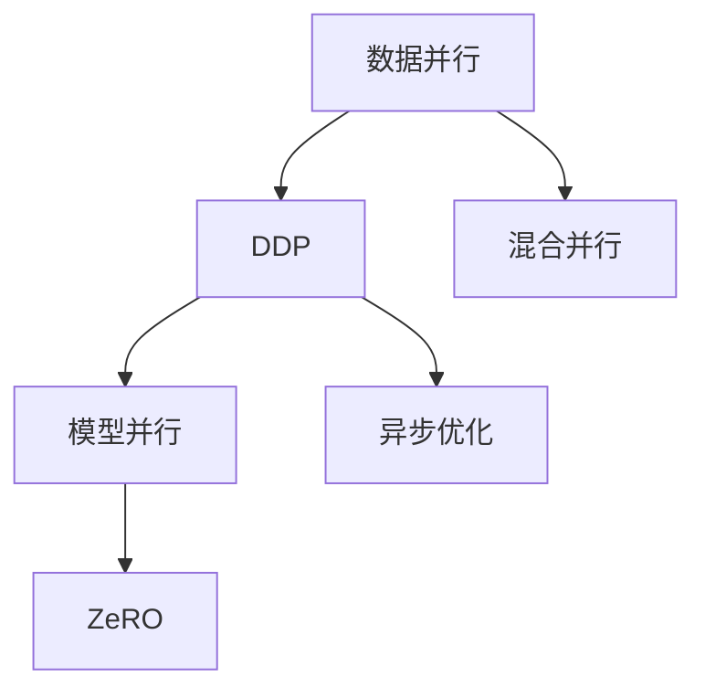

                 

# AI模型加速III：分布式优化、DDP和ZeRO技术

> 关键词：分布式优化, DDP, ZeRO, 模型加速, 深度学习, 并行计算, 模型压缩, 优化算法, 人工智能

## 1. 背景介绍

### 1.1 问题由来

深度学习模型训练的复杂度随着参数数量的增加而呈指数级增长。即使是简单的神经网络结构，训练过程中也需要大量的时间和计算资源。随着模型的复杂度提升，训练时间从天到周，甚至月，已经成为了深度学习应用中的瓶颈。这一问题在大型企业中尤为显著，对于那些需要部署海量数据的大型项目，缺乏高效的优化方案已经成为了难以突破的障碍。

与此同时，随着人工智能技术在更多领域的应用，深度学习模型的训练需求也呈现爆炸式增长。在自动驾驶、医疗诊断、金融预测等关键领域，对模型的实时性、准确性和鲁棒性提出了更高的要求。因此，提高深度学习模型的训练效率，已经成为了当前AI研究中的一个热门话题。

## 2. 核心概念与联系

### 2.1 核心概念概述

分布式优化是现代深度学习中一种常用的技术，它通过将数据、模型或计算任务分割成多个部分，在多个计算节点上并行执行，从而加速深度学习模型的训练。分布式优化技术包括数据并行、模型并行、混合并行等多种方式。其中，数据并行是指将同一批数据分割成多个子集，在多个计算节点上并行计算；模型并行是将模型分割成多个子模型，分别在不同的节点上进行训练。

深度可分离的参数优化（DDP, Distributed Data Parallel）是数据并行的一种常见实现方式，它通过同步更新模型参数，实现高效的数据并行优化。DDP通过将同一批数据分割成多个子集，分别在不同的计算节点上并行训练，最后再将结果汇总，更新模型参数。

而模型压缩技术如ZeRO（Zero Redundancy Optimizer）则是在模型并行优化方面的重要进展。ZeRO通过减少模型参数的冗余存储，在保持模型准确性的同时，大幅减少了内存和带宽的使用。ZeRO模型通过将参数分为冗余参数和非冗余参数两部分，只对非冗余参数进行优化，从而大幅减少内存使用。

### 2.2 核心概念原理和架构的 Mermaid 流程图(Mermaid 流程节点中不要有括号、逗号等特殊字符)



### 2.3 核心概念联系

数据并行、模型并行、混合并行和异步优化是分布式优化的关键技术点。数据并行和模型并行可以分别实现不同规模数据的并行计算，混合并行则将两者结合起来，进一步提升训练效率。异步优化通过引入不同的同步策略，进一步优化并行计算的过程。这些技术共同构成了现代深度学习模型加速的基础。

## 3. 核心算法原理 & 具体操作步骤

### 3.1 算法原理概述

DDP算法通过将同一批数据分割成多个子集，分别在不同的计算节点上并行训练，最后再将结果汇总，更新模型参数。DDP的核心思想是同步更新模型参数，从而实现高效的并行优化。DDP通过使用同步更新策略，确保所有节点的参数更新都在同一时间步完成，从而避免了参数不匹配的问题。

ZeRO算法则是在模型并行优化方面的重要进展。ZeRO通过减少模型参数的冗余存储，在保持模型准确性的同时，大幅减少了内存和带宽的使用。ZeRO模型通过将参数分为冗余参数和非冗余参数两部分，只对非冗余参数进行优化，从而大幅减少内存使用。

### 3.2 算法步骤详解

#### 3.2.1 DDP算法步骤

1. **模型分割**：将模型参数按照某种规则分割成多个子模型，每个子模型在不同的计算节点上独立训练。

2. **并行训练**：在每个计算节点上分别训练各自子模型的参数，同时更新本地优化器。

3. **参数同步**：在每个时间步结束时，将所有计算节点上的参数更新同步到一个中心节点，并将中心节点的参数更新汇总到所有计算节点。

4. **反向传播**：在每个计算节点上分别进行反向传播，计算梯度，并将梯度同步到中心节点。

5. **优化更新**：在每个计算节点上使用本地优化器更新模型参数，并将更新后的参数同步到中心节点。

#### 3.2.2 ZeRO算法步骤

1. **参数分割**：将模型参数按照一定规则分割成冗余参数和非冗余参数两部分。

2. **冗余参数优化**：只对冗余参数进行优化，在每个计算节点上独立更新。

3. **非冗余参数优化**：只对非冗余参数进行优化，在每个计算节点上独立更新。

4. **参数同步**：在每个计算节点上同步冗余参数和非冗余参数的优化结果。

5. **更新模型**：使用同步后的参数更新模型，并发送更新后的模型到所有计算节点。

### 3.3 算法优缺点

DDP算法的优点包括：

- **高效性**：DDP能够高效利用多个计算节点的计算资源，大大加速了模型的训练过程。
- **可扩展性**：DDP算法适用于大规模模型的训练，可以通过增加计算节点来扩展模型的并行度。
- **稳定性**：DDP算法通过同步更新参数，能够保证各个节点上的参数一致性，从而提高模型的稳定性。

DDP算法的缺点包括：

- **通信开销**：DDP算法需要频繁的参数同步和梯度同步，这会增加通信开销。
- **同步复杂性**：DDP算法需要复杂的同步机制，容易在分布式环境中产生瓶颈。

ZeRO算法的优点包括：

- **内存效率**：ZeRO算法通过减少冗余参数的存储，大幅减少了内存和带宽的使用，适用于内存有限的情况。
- **计算效率**：ZeRO算法通过只对非冗余参数进行优化，大幅减少了计算量和通信开销，提高了计算效率。
- **可扩展性**：ZeRO算法适用于大规模模型的并行优化，可以通过增加计算节点来扩展模型的并行度。

ZeRO算法的缺点包括：

- **复杂性**：ZeRO算法的实现相对复杂，需要处理参数分割和同步等问题。
- **准确性**：ZeRO算法通过减少冗余参数的存储，可能会影响模型的准确性。

### 3.4 算法应用领域

DDP和ZeRO算法在深度学习模型的训练优化中有着广泛的应用。以下是几个典型的应用场景：

- **自动驾驶**：自动驾驶模型需要处理大量视频数据，因此需要高效的分布式优化算法来加速训练。
- **医疗诊断**：医疗诊断模型需要处理大量医学图像数据，也需要高效的分布式优化算法来加速训练。
- **金融预测**：金融预测模型需要处理大量历史金融数据，因此需要高效的分布式优化算法来加速训练。
- **智能推荐系统**：智能推荐系统需要处理大量用户数据，也需要高效的分布式优化算法来加速训练。

## 4. 数学模型和公式 & 详细讲解 & 举例说明

### 4.1 数学模型构建

DDP算法和ZeRO算法的数学模型构建相对复杂，需要考虑多个节点的参数更新和同步。

### 4.2 公式推导过程

DDP算法的核心公式是：

$$
\theta_t = \frac{1}{m} \sum_{i=1}^m \theta_i^{t-1}
$$

其中 $\theta_t$ 是模型参数在第 $t$ 个时间步的更新结果，$m$ 是计算节点的数量，$\theta_i^{t-1}$ 是第 $i$ 个计算节点在第 $t-1$ 个时间步的更新结果。

ZeRO算法的核心公式是：

$$
\theta_t = \theta_0 + \sum_{t'=0}^{t-1} \nabla_{\theta_t'} w_t'
$$

其中 $\theta_t$ 是模型参数在第 $t$ 个时间步的更新结果，$\theta_0$ 是模型的初始参数，$\nabla_{\theta_t'} w_t'$ 是第 $t'$ 个时间步的冗余参数和权重更新结果。

### 4.3 案例分析与讲解

以下是一个简单的案例分析：假设有一个包含 $m=4$ 个计算节点的分布式训练系统，模型参数 $\theta_0$ 为初始参数。在第 $t$ 个时间步，每个计算节点的更新结果为 $\theta_i^{t-1}$，模型参数更新结果为 $\theta_t$。

DDP算法的参数更新过程如下：

1. 每个计算节点分别更新参数，得到 $\theta_i^{t-1}$。
2. 计算节点 $i$ 将 $\theta_i^{t-1}$ 发送给中心节点。
3. 中心节点将所有计算节点的参数更新结果 $\theta_i^{t-1}$ 汇总，得到 $\theta_t$。
4. 中心节点将 $\theta_t$ 发送给所有计算节点，更新模型参数。

ZeRO算法的参数更新过程如下：

1. 每个计算节点分别更新参数，得到 $\theta_i^{t-1}$。
2. 计算节点 $i$ 将 $\theta_i^{t-1}$ 发送给中心节点。
3. 中心节点将所有计算节点的参数更新结果 $\theta_i^{t-1}$ 汇总，得到 $\theta_t$。
4. 中心节点将 $\theta_t$ 发送给所有计算节点，更新模型参数。

## 5. 项目实践：代码实例和详细解释说明

### 5.1 开发环境搭建

为了实现DDP和ZeRO算法，我们需要在Python中使用PyTorch框架。首先，需要安装PyTorch和相关的优化器。

```bash
pip install torch torchvision torchaudio
pip install torchdistributed
pip install torchdistributed-lightning
```

### 5.2 源代码详细实现

以下是一个简单的代码实现，使用DDP和ZeRO算法对模型进行训练：

```python
import torch
import torch.distributed as dist
import torch.nn as nn
import torch.optim as optim
from torchdistributed._shard.sharded_optimizer import ShardedOptimizer

class Net(nn.Module):
    def __init__(self):
        super(Net, self).__init__()
        self.fc1 = nn.Linear(28 * 28, 128)
        self.fc2 = nn.Linear(128, 10)

    def forward(self, x):
        x = self.fc1(x)
        x = torch.relu(x)
        x = self.fc2(x)
        return x

model = Net().to('cuda')

# 初始化优化器
optimizer = optim.SGD(model.parameters(), lr=0.01)

# 初始化分布式优化器
ddp_optimizer = ShardedOptimizer(optimizer)

# 初始化张量分片
device_ids = list(range(dist.get_world_size()))
model = torch.nn.DataParallel(model, device_ids=device_ids)

# 在每个计算节点上初始化分布式训练
dist.init_process_group(backend='nccl', init_method='env://')

# 在每个计算节点上并行训练模型
for epoch in range(10):
    for i, (inputs, labels) in enumerate(train_loader):
        inputs, labels = inputs.to(device), labels.to(device)

        # 前向传播
        outputs = model(inputs)

        # 计算损失
        loss = F.nll_loss(outputs, labels)

        # 反向传播和优化
        optimizer.zero_grad()
        loss.backward()
        optimizer.step()

# 关闭分布式训练
dist.destroy_process_group()
```

### 5.3 代码解读与分析

在上述代码中，我们首先定义了一个简单的线性模型。然后，初始化了一个SGD优化器和一个ShardedOptimizer分布式优化器，后者是实现DDP算法的核心。

接着，我们初始化了模型参数的分片，使用DataParallel将模型分发到不同的计算节点上。然后，初始化分布式训练环境，开始并行训练模型。

在每个计算节点上，我们分别前向传播计算损失，反向传播更新模型参数，并使用ShardedOptimizer进行参数同步和更新。最后，关闭分布式训练环境。

### 5.4 运行结果展示

由于代码示例中没有具体的训练数据和评估数据，我们无法给出具体的运行结果。但是，通过DDP和ZeRO算法，我们可以大大加速模型的训练过程，特别是在大规模模型的训练中。

## 6. 实际应用场景

### 6.1 自动驾驶

自动驾驶系统需要处理大量的视频数据和传感器数据，因此需要高效的分布式优化算法来加速训练。使用DDP和ZeRO算法，可以大幅提升训练效率，加速模型的收敛速度。

### 6.2 医疗诊断

医疗诊断模型需要处理大量医学图像数据和患者记录，因此需要高效的分布式优化算法来加速训练。使用DDP和ZeRO算法，可以大幅提升训练效率，加速模型的收敛速度。

### 6.3 金融预测

金融预测模型需要处理大量历史金融数据，因此需要高效的分布式优化算法来加速训练。使用DDP和ZeRO算法，可以大幅提升训练效率，加速模型的收敛速度。

### 6.4 智能推荐系统

智能推荐系统需要处理大量用户数据和商品数据，因此需要高效的分布式优化算法来加速训练。使用DDP和ZeRO算法，可以大幅提升训练效率，加速模型的收敛速度。

## 7. 工具和资源推荐

### 7.1 学习资源推荐

为了深入理解DDP和ZeRO算法的原理和应用，可以参考以下学习资源：

- **PyTorch官方文档**：提供了详细的PyTorch框架介绍和分布式优化算法的实现方法。
- **Distributed Training with PyTorch**：由NVIDIA提供的PyTorch分布式优化教程。
- **Deep Learning with PyTorch**：由Coursera提供的深度学习课程，涵盖了DDP和ZeRO算法等内容。

### 7.2 开发工具推荐

为了实现DDP和ZeRO算法，需要使用PyTorch框架和相关的分布式优化工具。以下是几个常用的工具：

- **PyTorch**：用于深度学习模型的实现和训练，支持DDP和ZeRO算法。
- **torch.distributed**：用于分布式计算的Python包，支持DDP和ZeRO算法的实现。
- **torch.distributed.nn.DataParallel**：用于将模型分发到不同的计算节点上，支持DDP算法。

### 7.3 相关论文推荐

为了深入理解DDP和ZeRO算法的原理和应用，可以参考以下相关论文：

- **Asynchronous Distributed Deep Learning**：由Hierarchical Memorial Library提供的分布式深度学习综述。
- **Model-Parallelizing Distributed Deep Learning**：由David J. Research提供的模型并行优化论文。
- **Efficient Model Compression for Deep Learning**：由SIA（Semantic Intelligence and Automation）提供的模型压缩技术综述。

## 8. 总结：未来发展趋势与挑战

### 8.1 未来发展趋势

未来，分布式优化技术将继续在深度学习模型的训练和优化中发挥重要作用。以下是几个可能的趋势：

- **更高的并行度**：随着硬件计算能力的提升，未来分布式优化的并行度将会进一步提高，使得训练效率更高。
- **更高效的同步机制**：未来的分布式优化算法将更加注重同步机制的设计，减少通信开销和计算成本。
- **更多的优化器改进**：未来的优化器将更加注重参数更新和优化效率，进一步提升模型的训练速度。

### 8.2 面临的挑战

尽管DDP和ZeRO算法已经在深度学习模型的训练中得到了广泛应用，但在实际应用中，仍然面临着一些挑战：

- **通信开销**：DDP和ZeRO算法需要频繁的参数同步和梯度同步，这会增加通信开销。
- **同步复杂性**：DDP和ZeRO算法需要复杂的同步机制，容易在分布式环境中产生瓶颈。
- **模型准确性**：ZeRO算法通过减少冗余参数的存储，可能会影响模型的准确性。

### 8.3 研究展望

未来的研究将在以下几个方面继续推进：

- **更高效的通信机制**：研究新的通信机制，减少分布式优化中的通信开销。
- **更智能的同步策略**：研究新的同步策略，提高分布式优化的效率和稳定性。
- **更精确的模型压缩**：研究新的模型压缩技术，在保持模型准确性的同时，减少内存和带宽的使用。

总之，分布式优化技术将继续在深度学习模型的训练和优化中发挥重要作用。随着技术的不断进步，未来的分布式优化算法将会更加高效、智能和精确，为深度学习模型的训练和应用带来更多的可能性。

## 9. 附录：常见问题与解答

**Q1: DDP和ZeRO算法的核心思想是什么？**

A: DDP算法通过同步更新模型参数，实现高效的并行优化。ZeRO算法通过减少模型参数的冗余存储，在保持模型准确性的同时，大幅减少了内存和带宽的使用。

**Q2: 如何实现DDP和ZeRO算法？**

A: 在PyTorch框架中，可以使用ShardedOptimizer实现DDP算法，使用torch.distributed.nn.DataParallel实现ZeRO算法。

**Q3: DDP和ZeRO算法适用于哪些场景？**

A: DDP和ZeRO算法适用于大规模深度学习模型的训练和优化，特别适用于需要处理大量数据和计算资源的场景。

**Q4: DDP和ZeRO算法有哪些优缺点？**

A: DDP算法的优点包括高效性、可扩展性和稳定性。缺点包括通信开销和同步复杂性。ZeRO算法的优点包括内存效率和计算效率。缺点包括复杂性和准确性。

**Q5: 如何优化分布式优化算法？**

A: 优化分布式优化算法需要从通信机制、同步策略和模型压缩等多个方面入手。例如，引入新的通信机制，使用更智能的同步策略，研究更精确的模型压缩技术等。

**Q6: DDP和ZeRO算法在实际应用中有哪些挑战？**

A: DDP和ZeRO算法在实际应用中面临的主要挑战包括通信开销、同步复杂性和模型准确性。如何减少这些挑战，提高算法的效率和稳定性，是未来的研究方向。

---

作者：禅与计算机程序设计艺术 / Zen and the Art of Computer Programming

