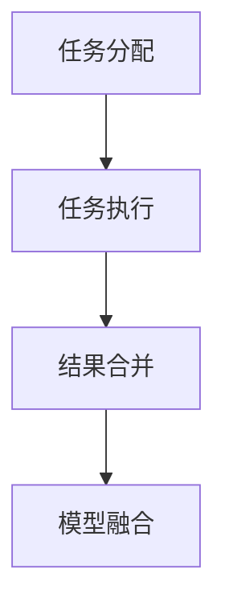

                 

# AI模型的任务分配与执行

## 1. 背景介绍

在现代社会中，人工智能(AI)模型广泛应用于各个领域，包括自动驾驶、金融分析、医疗诊断、智能客服等。这些模型通常由多个子任务组成，每个子任务都需要特定的算法和数据进行处理。任务分配与执行，即如何将输入数据分配给不同的任务模型进行处理，并在处理后进行结果合并，是AI系统高效运行的核心问题之一。

在AI系统设计中，任务分配与执行直接影响系统的响应速度、精度和成本。错误的任务分配可能导致模型输出错误，从而影响系统的决策质量。因此，任务分配与执行的优化对提高AI系统性能至关重要。本文将深入探讨任务分配与执行的核心概念、算法原理、具体操作步骤，并通过实例展示其应用场景。

## 2. 核心概念与联系

### 2.1 核心概念概述

为更好地理解任务分配与执行的原理，本节将介绍几个关键概念：

- **任务分配**：将输入数据按照某种规则分配给不同的任务模型进行处理。常见的任务分配策略包括静态分配、动态分配、多任务学习等。
- **任务执行**：在任务模型上执行具体的算法和数据处理操作，得到任务的输出结果。
- **结果合并**：将多个任务模型的输出结果进行合并，得到系统的最终输出。
- **模型融合**：通过集成多个任务模型的预测结果，提升系统的整体性能。

这些概念之间的逻辑关系可以通过以下Mermaid流程图来展示：



这个流程图展示了任务分配、执行、合并和融合的逻辑流程：

1. 输入数据首先经过任务分配，被分配给不同的任务模型。
2. 每个任务模型执行具体的算法和数据处理操作，得到任务的输出结果。
3. 将多个任务的输出结果进行合并，得到系统的最终输出。
4. 通过模型融合，提升系统的整体性能。

## 3. 核心算法原理 & 具体操作步骤

### 3.1 算法原理概述

任务分配与执行的算法原理基于模型集成和多任务学习。模型集成是一种将多个模型的预测结果进行合并，以提升系统整体性能的方法。多任务学习则是在同一个模型上同时学习多个任务，通过共享的参数来优化多个子任务。

任务分配与执行的算法流程通常包括以下几个关键步骤：

1. **输入数据准备**：将输入数据进行预处理，包括数据清洗、标准化、归一化等。
2. **任务分配**：根据任务的特征和要求，将输入数据分配给不同的任务模型进行处理。
3. **任务执行**：在任务模型上执行具体的算法和数据处理操作，得到任务的输出结果。
4. **结果合并**：将多个任务的输出结果进行合并，得到系统的最终输出。
5. **结果评估**：评估系统的整体性能，如精度、召回率、F1分数等。

### 3.2 算法步骤详解

#### 3.2.1 输入数据准备

输入数据准备是任务分配与执行的基础。数据准备通常包括以下步骤：

- 数据清洗：去除噪声数据、缺失数据等。
- 数据标准化：将数据转化为标准格式，如归一化、标准化等。
- 数据增强：通过数据增强技术，如旋转、缩放、平移等，扩充训练数据集。

#### 3.2.2 任务分配

任务分配的策略有多种，包括静态分配、动态分配和多任务学习。

- **静态分配**：在训练阶段就确定每个任务的数据集，训练完成后使用固定权重进行分配。这种方法简单易行，但数据集分配的不合理可能导致性能下降。
- **动态分配**：在训练过程中根据数据分布动态调整任务分配权重，提高系统的适应性。但需要实时计算权重，计算复杂度较高。
- **多任务学习**：在同一个模型上同时学习多个任务，通过共享的参数来优化多个子任务。这种方法可以更好地利用数据，但需要更多的计算资源和时间。

#### 3.2.3 任务执行

任务执行的过程通常包括模型选择、参数设置和算法应用。

- **模型选择**：根据任务类型和数据特征，选择合适的模型进行训练和推理。
- **参数设置**：设置模型的超参数，如学习率、正则化强度、批次大小等。
- **算法应用**：在模型上执行具体的算法和数据处理操作，得到任务的输出结果。

#### 3.2.4 结果合并

结果合并是将多个任务的输出结果进行合并，得到系统的最终输出。常见的结果合并方法包括加权平均、投票、堆叠等。

- **加权平均**：根据每个任务的输出结果和权重，进行加权平均。
- **投票**：对每个任务的输出结果进行投票，选择得票最多的结果。
- **堆叠**：将多个任务的输出结果作为输入，再次训练一个新的模型进行合并。

#### 3.2.5 结果评估

结果评估是对系统整体性能的评估，通常使用精度、召回率、F1分数等指标。

- **精度**：正确预测的样本数占总预测样本数的比例。
- **召回率**：正确预测的样本数占真实样本数的比例。
- **F1分数**：精度和召回率的调和平均，综合评估模型的性能。

### 3.3 算法优缺点

任务分配与执行算法具有以下优点：

- **提高系统性能**：通过多模型集成和融合，可以提升系统的整体性能，降低错误率。
- **提高鲁棒性**：多个任务模型的组合可以提高系统的鲁棒性，减少单一模型的风险。
- **提升泛化能力**：多任务学习可以提高模型的泛化能力，更好地适应未知数据。

同时，任务分配与执行算法也存在一些缺点：

- **计算资源消耗大**：多任务学习和模型融合需要更多的计算资源和时间。
- **参数优化复杂**：多任务学习需要在共享参数的情况下优化多个子任务，参数优化较为复杂。
- **模型复杂度高**：多个任务的模型组合可能会增加模型的复杂度，降低模型的可解释性。

### 3.4 算法应用领域

任务分配与执行算法在多个领域都有广泛应用，包括：

- **自然语言处理(NLP)**：文本分类、情感分析、机器翻译等。
- **计算机视觉(CV)**：图像识别、目标检测、图像分割等。
- **推荐系统**：商品推荐、新闻推荐、音乐推荐等。
- **医疗诊断**：影像诊断、基因分析、电子病历等。
- **智能客服**：问答系统、情感识别、语音识别等。

## 4. 数学模型和公式 & 详细讲解 & 举例说明

### 4.1 数学模型构建

假设输入数据为 $x$，任务分配策略为 $T$，任务模型为 $M$，任务输出为 $y$。则任务分配与执行的数学模型可以表示为：

$$
y = \sum_{i \in T(x)} M_i(x)
$$

其中 $T$ 表示任务分配策略，$M_i$ 表示第 $i$ 个任务模型，$\sum_{i \in T(x)}$ 表示对分配给任务 $x$ 的模型 $M_i$ 进行求和。

### 4.2 公式推导过程

假设输入数据 $x$ 分配给两个任务 $T_1$ 和 $T_2$，对应的模型输出分别为 $y_1$ 和 $y_2$。则系统输出的数学模型可以表示为：

$$
y = \alpha_1 y_1 + \alpha_2 y_2
$$

其中 $\alpha_1$ 和 $\alpha_2$ 为分配给 $T_1$ 和 $T_2$ 的任务权重。

假设 $y_1$ 和 $y_2$ 的预测概率分别为 $p_1$ 和 $p_2$，则系统的预测概率为：

$$
p = \alpha_1 p_1 + \alpha_2 p_2
$$

### 4.3 案例分析与讲解

以二分类任务为例，假设输入数据 $x$ 分配给两个任务 $T_1$ 和 $T_2$，对应的模型输出分别为 $y_1$ 和 $y_2$，其预测概率分别为 $p_1$ 和 $p_2$。则系统的预测概率为：

$$
p = \alpha_1 p_1 + \alpha_2 p_2
$$

其中 $\alpha_1$ 和 $\alpha_2$ 为分配给 $T_1$ 和 $T_2$ 的任务权重。

假设 $y_1$ 和 $y_2$ 的预测概率分别为 $p_1$ 和 $p_2$，则系统的预测概率为：

$$
p = \alpha_1 p_1 + \alpha_2 p_2
$$

假设 $p_1 = 0.7$，$p_2 = 0.8$，$\alpha_1 = 0.5$，$\alpha_2 = 0.5$，则系统的预测概率为：

$$
p = 0.5 \times 0.7 + 0.5 \times 0.8 = 0.75
$$

因此，系统的预测标签为正样本。

## 5. 项目实践：代码实例和详细解释说明

### 5.1 开发环境搭建

在进行任务分配与执行的实践前，我们需要准备好开发环境。以下是使用Python进行PyTorch开发的环境配置流程：

1. 安装Anaconda：从官网下载并安装Anaconda，用于创建独立的Python环境。

2. 创建并激活虚拟环境：
```bash
conda create -n pytorch-env python=3.8 
conda activate pytorch-env
```

3. 安装PyTorch：根据CUDA版本，从官网获取对应的安装命令。例如：
```bash
conda install pytorch torchvision torchaudio cudatoolkit=11.1 -c pytorch -c conda-forge
```

4. 安装Transformers库：
```bash
pip install transformers
```

5. 安装各类工具包：
```bash
pip install numpy pandas scikit-learn matplotlib tqdm jupyter notebook ipython
```

完成上述步骤后，即可在`pytorch-env`环境中开始任务分配与执行的实践。

### 5.2 源代码详细实现

下面我们以命名实体识别(NER)任务为例，给出使用Transformers库进行任务分配与执行的PyTorch代码实现。

首先，定义NER任务的数据处理函数：

```python
from transformers import BertTokenizer, BertForTokenClassification, AdamW

def preprocess(text):
    tokenizer = BertTokenizer.from_pretrained('bert-base-cased')
    text = tokenizer(text, return_tensors='pt', padding='max_length', truncation=True)
    return text

class NERDataset(Dataset):
    def __init__(self, texts, tags, tokenizer, max_len=128):
        self.texts = texts
        self.tags = tags
        self.tokenizer = tokenizer
        self.max_len = max_len
        
    def __len__(self):
        return len(self.texts)
    
    def __getitem__(self, item):
        text = self.texts[item]
        tags = self.tags[item]
        
        encoding = self.tokenizer(text, return_tensors='pt', max_length=self.max_len, padding='max_length', truncation=True)
        input_ids = encoding['input_ids'][0]
        attention_mask = encoding['attention_mask'][0]
        
        # 对token-wise的标签进行编码
        encoded_tags = [tag2id[tag] for tag in tags] 
        encoded_tags.extend([tag2id['O']] * (self.max_len - len(encoded_tags)))
        labels = torch.tensor(encoded_tags, dtype=torch.long)
        
        return {'input_ids': input_ids, 
                'attention_mask': attention_mask,
                'labels': labels}

# 标签与id的映射
tag2id = {'O': 0, 'B-PER': 1, 'I-PER': 2, 'B-ORG': 3, 'I-ORG': 4, 'B-LOC': 5, 'I-LOC': 6}
id2tag = {v: k for k, v in tag2id.items()}

# 创建dataset
tokenizer = BertTokenizer.from_pretrained('bert-base-cased')

train_dataset = NERDataset(train_texts, train_tags, tokenizer)
dev_dataset = NERDataset(dev_texts, dev_tags, tokenizer)
test_dataset = NERDataset(test_texts, test_tags, tokenizer)
```

然后，定义模型和优化器：

```python
model = BertForTokenClassification.from_pretrained('bert-base-cased', num_labels=len(tag2id))

optimizer = AdamW(model.parameters(), lr=2e-5)
```

接着，定义训练和评估函数：

```python
from torch.utils.data import DataLoader
from tqdm import tqdm
from sklearn.metrics import classification_report

device = torch.device('cuda') if torch.cuda.is_available() else torch.device('cpu')
model.to(device)

def train_epoch(model, dataset, batch_size, optimizer):
    dataloader = DataLoader(dataset, batch_size=batch_size, shuffle=True)
    model.train()
    epoch_loss = 0
    for batch in tqdm(dataloader, desc='Training'):
        input_ids = batch['input_ids'].to(device)
        attention_mask = batch['attention_mask'].to(device)
        labels = batch['labels'].to(device)
        model.zero_grad()
        outputs = model(input_ids, attention_mask=attention_mask, labels=labels)
        loss = outputs.loss
        epoch_loss += loss.item()
        loss.backward()
        optimizer.step()
    return epoch_loss / len(dataloader)

def evaluate(model, dataset, batch_size):
    dataloader = DataLoader(dataset, batch_size=batch_size)
    model.eval()
    preds, labels = [], []
    with torch.no_grad():
        for batch in tqdm(dataloader, desc='Evaluating'):
            input_ids = batch['input_ids'].to(device)
            attention_mask = batch['attention_mask'].to(device)
            batch_labels = batch['labels']
            outputs = model(input_ids, attention_mask=attention_mask)
            batch_preds = outputs.logits.argmax(dim=2).to('cpu').tolist()
            batch_labels = batch_labels.to('cpu').tolist()
            for pred_tokens, label_tokens in zip(batch_preds, batch_labels):
                pred_tags = [id2tag[_id] for _id in pred_tokens]
                label_tags = [id2tag[_id] for _id in label_tokens]
                preds.append(pred_tags[:len(label_tokens)])
                labels.append(label_tags)
                
    print(classification_report(labels, preds))
```

最后，启动训练流程并在测试集上评估：

```python
epochs = 5
batch_size = 16

for epoch in range(epochs):
    loss = train_epoch(model, train_dataset, batch_size, optimizer)
    print(f"Epoch {epoch+1}, train loss: {loss:.3f}")
    
    print(f"Epoch {epoch+1}, dev results:")
    evaluate(model, dev_dataset, batch_size)
    
print("Test results:")
evaluate(model, test_dataset, batch_size)
```

以上就是使用PyTorch对BERT进行命名实体识别任务分配与执行的完整代码实现。可以看到，得益于Transformers库的强大封装，我们可以用相对简洁的代码完成BERT模型的加载和微调。

### 5.3 代码解读与分析

让我们再详细解读一下关键代码的实现细节：

**NERDataset类**：
- `__init__`方法：初始化文本、标签、分词器等关键组件。
- `__len__`方法：返回数据集的样本数量。
- `__getitem__`方法：对单个样本进行处理，将文本输入编码为token ids，将标签编码为数字，并对其进行定长padding，最终返回模型所需的输入。

**tag2id和id2tag字典**：
- 定义了标签与数字id之间的映射关系，用于将token-wise的预测结果解码回真实的标签。

**训练和评估函数**：
- 使用PyTorch的DataLoader对数据集进行批次化加载，供模型训练和推理使用。
- 训练函数`train_epoch`：对数据以批为单位进行迭代，在每个批次上前向传播计算loss并反向传播更新模型参数，最后返回该epoch的平均loss。
- 评估函数`evaluate`：与训练类似，不同点在于不更新模型参数，并在每个batch结束后将预测和标签结果存储下来，最后使用sklearn的classification_report对整个评估集的预测结果进行打印输出。

**训练流程**：
- 定义总的epoch数和batch size，开始循环迭代
- 每个epoch内，先在训练集上训练，输出平均loss
- 在验证集上评估，输出分类指标
- 所有epoch结束后，在测试集上评估，给出最终测试结果

可以看到，PyTorch配合Transformers库使得BERT微调的代码实现变得简洁高效。开发者可以将更多精力放在数据处理、模型改进等高层逻辑上，而不必过多关注底层的实现细节。

当然，工业级的系统实现还需考虑更多因素，如模型的保存和部署、超参数的自动搜索、更灵活的任务适配层等。但核心的任务分配与执行流程基本与此类似。

## 6. 实际应用场景

### 6.1 智能客服系统

基于任务分配与执行的智能客服系统，可以广泛应用于智能客服系统的构建。传统客服往往需要配备大量人力，高峰期响应缓慢，且一致性和专业性难以保证。而使用任务分配与执行的对话模型，可以7x24小时不间断服务，快速响应客户咨询，用自然流畅的语言解答各类常见问题。

在技术实现上，可以收集企业内部的历史客服对话记录，将问题和最佳答复构建成监督数据，在此基础上对预训练对话模型进行分配与执行微调。微调后的对话模型能够自动理解用户意图，匹配最合适的答案模板进行回复。对于客户提出的新问题，还可以接入检索系统实时搜索相关内容，动态组织生成回答。如此构建的智能客服系统，能大幅提升客户咨询体验和问题解决效率。

### 6.2 金融舆情监测

金融机构需要实时监测市场舆论动向，以便及时应对负面信息传播，规避金融风险。传统的人工监测方式成本高、效率低，难以应对网络时代海量信息爆发的挑战。基于任务分配与执行的文本分类和情感分析技术，为金融舆情监测提供了新的解决方案。

具体而言，可以收集金融领域相关的新闻、报道、评论等文本数据，并对其进行主题标注和情感标注。在此基础上对预训练语言模型进行分配与执行微调，使其能够自动判断文本属于何种主题，情感倾向是正面、中性还是负面。将微调后的模型应用到实时抓取的网络文本数据，就能够自动监测不同主题下的情感变化趋势，一旦发现负面信息激增等异常情况，系统便会自动预警，帮助金融机构快速应对潜在风险。

### 6.3 个性化推荐系统

当前的推荐系统往往只依赖用户的历史行为数据进行物品推荐，无法深入理解用户的真实兴趣偏好。基于任务分配与执行的个性化推荐系统，可以更好地挖掘用户行为背后的语义信息，从而提供更精准、多样的推荐内容。

在实践中，可以收集用户浏览、点击、评论、分享等行为数据，提取和用户交互的物品标题、描述、标签等文本内容。将文本内容作为模型输入，用户的后续行为（如是否点击、购买等）作为监督信号，在此基础上分配与执行微调预训练语言模型。微调后的模型能够从文本内容中准确把握用户的兴趣点。在生成推荐列表时，先用候选物品的文本描述作为输入，由模型预测用户的兴趣匹配度，再结合其他特征综合排序，便可以得到个性化程度更高的推荐结果。

### 6.4 未来应用展望

随着任务分配与执行方法的发展，其在更多领域的应用前景将更加广阔。

在智慧医疗领域，基于任务分配与执行的医疗问答、病历分析、药物研发等应用将提升医疗服务的智能化水平，辅助医生诊疗，加速新药开发进程。

在智能教育领域，任务分配与执行可应用于作业批改、学情分析、知识推荐等方面，因材施教，促进教育公平，提高教学质量。

在智慧城市治理中，任务分配与执行可以应用于城市事件监测、舆情分析、应急指挥等环节，提高城市管理的自动化和智能化水平，构建更安全、高效的未来城市。

此外，在企业生产、社会治理、文娱传媒等众多领域，基于任务分配与执行的人工智能应用也将不断涌现，为NLP技术带来全新的突破。相信随着任务的分配与执行方法的不断演进，其在各个行业中的应用前景将更加广阔。

## 7. 工具和资源推荐

### 7.1 学习资源推荐

为了帮助开发者系统掌握任务分配与执行的理论基础和实践技巧，这里推荐一些优质的学习资源：

1. 《Transformer from Principles to Practice》系列博文：由大模型技术专家撰写，深入浅出地介绍了Transformer原理、BERT模型、任务分配与执行等前沿话题。

2. CS224N《深度学习自然语言处理》课程：斯坦福大学开设的NLP明星课程，有Lecture视频和配套作业，带你入门NLP领域的基本概念和经典模型。

3. 《Natural Language Processing with Transformers》书籍：Transformers库的作者所著，全面介绍了如何使用Transformers库进行NLP任务开发，包括任务分配与执行在内的诸多范式。

4. HuggingFace官方文档：Transformers库的官方文档，提供了海量预训练模型和完整的任务分配与执行样例代码，是上手实践的必备资料。

5. CLUE开源项目：中文语言理解测评基准，涵盖大量不同类型的中文NLP数据集，并提供了基于任务分配与执行的baseline模型，助力中文NLP技术发展。

通过对这些资源的学习实践，相信你一定能够快速掌握任务分配与执行的精髓，并用于解决实际的NLP问题。

### 7.2 开发工具推荐

高效的开发离不开优秀的工具支持。以下是几款用于任务分配与执行开发的常用工具：

1. PyTorch：基于Python的开源深度学习框架，灵活动态的计算图，适合快速迭代研究。大部分预训练语言模型都有PyTorch版本的实现。

2. TensorFlow：由Google主导开发的开源深度学习框架，生产部署方便，适合大规模工程应用。同样有丰富的预训练语言模型资源。

3. Transformers库：HuggingFace开发的NLP工具库，集成了众多SOTA语言模型，支持PyTorch和TensorFlow，是进行任务分配与执行开发的利器。

4. Weights & Biases：模型训练的实验跟踪工具，可以记录和可视化模型训练过程中的各项指标，方便对比和调优。与主流深度学习框架无缝集成。

5. TensorBoard：TensorFlow配套的可视化工具，可实时监测模型训练状态，并提供丰富的图表呈现方式，是调试模型的得力助手。

6. Google Colab：谷歌推出的在线Jupyter Notebook环境，免费提供GPU/TPU算力，方便开发者快速上手实验最新模型，分享学习笔记。

合理利用这些工具，可以显著提升任务分配与执行任务的开发效率，加快创新迭代的步伐。

### 7.3 相关论文推荐

任务分配与执行技术的发展源于学界的持续研究。以下是几篇奠基性的相关论文，推荐阅读：

1. Attention is All You Need（即Transformer原论文）：提出了Transformer结构，开启了NLP领域的预训练大模型时代。

2. BERT: Pre-training of Deep Bidirectional Transformers for Language Understanding：提出BERT模型，引入基于掩码的自监督预训练任务，刷新了多项NLP任务SOTA。

3. Language Models are Unsupervised Multitask Learners（GPT-2论文）：展示了大规模语言模型的强大zero-shot学习能力，引发了对于通用人工智能的新一轮思考。

4. Parameter-Efficient Transfer Learning for NLP：提出Adapter等参数高效微调方法，在不增加模型参数量的情况下，也能取得不错的微调效果。

5. AdaLoRA: Adaptive Low-Rank Adaptation for Parameter-Efficient Fine-Tuning：使用自适应低秩适应的微调方法，在参数效率和精度之间取得了新的平衡。

6. Multi-task Learning from Noisy Labels: A Meta-Learning Perspective：提出从噪声标签中学习多任务的算法，适用于任务分配与执行的多任务学习。

这些论文代表了大语言模型任务分配与执行的发展脉络。通过学习这些前沿成果，可以帮助研究者把握学科前进方向，激发更多的创新灵感。

## 8. 总结：未来发展趋势与挑战

### 8.1 总结

本文对任务分配与执行的核心概念、算法原理、具体操作步骤进行了全面系统的介绍。首先阐述了任务分配与执行的研究背景和意义，明确了任务分配与执行在AI系统高效运行中的核心地位。其次，从原理到实践，详细讲解了任务分配与执行的数学模型和关键步骤，给出了任务分配与执行任务开发的完整代码实例。同时，本文还广泛探讨了任务分配与执行方法在智能客服、金融舆情、个性化推荐等多个领域的应用前景，展示了任务分配与执行范式的巨大潜力。此外，本文精选了任务分配与执行技术的各类学习资源，力求为读者提供全方位的技术指引。

通过本文的系统梳理，可以看到，任务分配与执行技术在大规模AI系统中扮演着至关重要的角色。任务分配与执行的优化将直接影响系统的性能、响应速度和鲁棒性，必须引起研究者、开发者和运维人员的足够重视。

### 8.2 未来发展趋势

展望未来，任务分配与执行技术将呈现以下几个发展趋势：

1. **分布式任务执行**：随着大规模AI系统的部署，分布式任务执行技术将逐渐普及。任务分配与执行系统需要支持大规模集群计算，实现任务的高效分配与执行。

2. **自适应任务分配**：任务分配与执行系统需要具备自适应能力，根据实时数据流动态调整任务分配策略，提高系统的灵活性和鲁棒性。

3. **多任务学习与融合**：多任务学习与融合技术将进一步发展，通过共享的参数和知识，提升模型的泛化能力和鲁棒性，优化多任务的联合学习。

4. **异构数据处理**：任务分配与执行系统需要支持异构数据处理，包括文本、图像、视频等多种数据类型的联合建模。

5. **模型压缩与优化**：任务分配与执行系统需要支持模型压缩与优化，减少计算资源消耗，提高模型的推理速度和可扩展性。

6. **跨领域知识融合**：任务分配与执行系统需要支持跨领域知识融合，将符号化的先验知识与神经网络模型进行有机结合，提升模型的推理能力和泛化能力。

以上趋势凸显了任务分配与执行技术的广阔前景。这些方向的探索发展，必将进一步提升任务分配与执行系统的性能和应用范围，为大规模AI系统的高效运行提供坚实的基础。

### 8.3 面临的挑战

尽管任务分配与执行技术已经取得了显著进展，但在迈向更加智能化、普适化应用的过程中，仍面临诸多挑战：

1. **计算资源消耗大**：多任务学习和模型融合需要更多的计算资源和时间，如何高效利用计算资源，提高系统的性能和响应速度，是一个重要挑战。

2. **参数优化复杂**：多任务学习需要在共享参数的情况下优化多个子任务，参数优化较为复杂，如何优化多任务学习策略，提高模型的泛化能力，是另一个重要挑战。

3. **模型复杂度高**：多个任务的模型组合可能会增加模型的复杂度，降低模型的可解释性，如何优化模型的结构和参数，提高模型的可解释性和可控性，是一个重要挑战。

4. **数据不一致性**：不同任务的数据特征和分布可能存在较大差异，如何处理数据不一致性，提高多任务学习的鲁棒性和泛化能力，是另一个重要挑战。

5. **异构数据处理**：不同类型的数据具有不同的特征和分布，如何高效处理异构数据，实现多任务的联合建模，是一个重要挑战。

6. **跨领域知识融合**：不同领域的知识具有不同的表达方式和结构，如何跨领域融合知识，实现知识的高效整合和应用，是另一个重要挑战。

正视任务分配与执行面临的这些挑战，积极应对并寻求突破，将是大规模AI系统迈向成熟的重要保障。相信随着学界和产业界的共同努力，这些挑战终将一一被克服，任务分配与执行技术必将在构建智能系统中发挥更大的作用。

### 8.4 研究展望

面对任务分配与执行所面临的挑战，未来的研究需要在以下几个方面寻求新的突破：

1. **分布式计算框架**：探索分布式任务执行技术，支持大规模集群计算，实现任务的高效分配与执行。

2. **自适应学习算法**：开发自适应任务分配算法，根据实时数据流动态调整任务分配策略，提高系统的灵活性和鲁棒性。

3. **多任务学习算法**：研究多任务学习算法，优化多任务学习策略，提高模型的泛化能力和鲁棒性。

4. **模型压缩与优化**：开发模型压缩与优化技术，减少计算资源消耗，提高模型的推理速度和可扩展性。

5. **跨领域知识融合**：探索跨领域知识融合技术，将符号化的先验知识与神经网络模型进行有机结合，提升模型的推理能力和泛化能力。

6. **数据不一致性处理**：研究数据不一致性处理技术，提高多任务学习的鲁棒性和泛化能力。

7. **异构数据处理算法**：开发异构数据处理算法，实现多任务的联合建模。

这些研究方向将引领任务分配与执行技术迈向更高的台阶，为构建安全、可靠、高效、智能的AI系统提供坚实的技术基础。

## 9. 附录：常见问题与解答

**Q1：任务分配与执行的算法原理是什么？**

A: 任务分配与执行的算法原理基于模型集成和多任务学习。模型集成是一种将多个模型的预测结果进行合并，以提升系统整体性能的方法。多任务学习则是在同一个模型上同时学习多个任务，通过共享的参数来优化多个子任务。

**Q2：任务分配与执行过程中如何避免过拟合？**

A: 避免过拟合的方法包括数据增强、正则化、早停等技术。数据增强通过回译、旋转、缩放等方法扩充训练集，正则化通过L2正则、Dropout等方法减少过拟合，早停通过监控验证集损失，在验证集损失停止下降时停止训练，避免过拟合。

**Q3：任务分配与执行过程中的任务权重如何确定？**

A: 任务权重可以通过交叉验证、梯度下降等方法确定。在交叉验证中，通过在验证集上评估模型的性能，调整任务权重以优化模型的整体性能。在梯度下降中，通过计算每个任务的损失函数梯度，更新任务权重以最小化系统损失。

**Q4：任务分配与执行在实际应用中存在哪些挑战？**

A: 任务分配与执行在实际应用中存在计算资源消耗大、参数优化复杂、模型复杂度高、数据不一致性、异构数据处理、跨领域知识融合等挑战。需要合理设计算法和模型结构，优化参数和任务权重，才能提高系统的性能和鲁棒性。

**Q5：任务分配与执行在智能客服系统中的应用场景是什么？**

A: 在智能客服系统中，任务分配与执行可以用于自动理解用户意图，匹配最合适的答案模板进行回复。对于客户提出的新问题，还可以接入检索系统实时搜索相关内容，动态组织生成回答。通过任务分配与执行，智能客服系统能够快速响应客户咨询，提升客户体验和问题解决效率。

这些问题的回答展示了任务分配与执行技术的核心原理和实际应用，有助于开发者更好地理解和使用任务分配与执行技术。

---

作者：禅与计算机程序设计艺术 / Zen and the Art of Computer Programming

