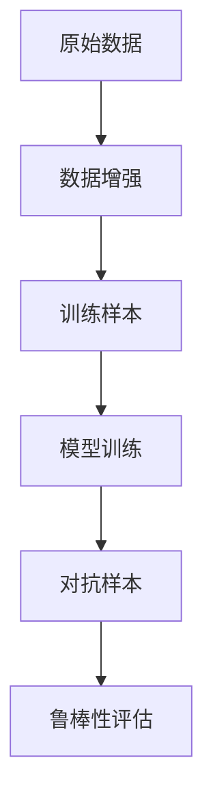

                 

## 1. 背景介绍

在深度学习领域，模型泛化能力是指模型在未见过的数据上表现良好。数据增强（Data Augmentation）是一种常用的技术，通过生成额外的训练样本，从而提升模型的泛化能力。数据增强方法已经广泛应用于图像分类、目标检测、语音识别等计算机视觉和自然语言处理（NLP）任务中。然而，生成数据的方式需要具备一定的物理或语义可解释性，同时又能够有效提升模型的泛化性能。本文将详细介绍数据增强的原理，并具体讨论如何利用人工智能生成的数据增强技术来改善模型泛化能力。

## 2. 核心概念与联系

### 2.1 核心概念概述

- **数据增强**（Data Augmentation）：通过对原始数据进行一系列变换，生成新的训练数据，增加模型训练样本的多样性，从而提高模型的泛化能力。
- **泛化能力**（Generalization）：模型在未见过的数据上表现良好，能够有效处理新输入数据。
- **模型训练**（Model Training）：利用大量的训练数据，调整模型参数，使得模型能够拟合数据分布。
- **对抗样本**（Adversarial Examples）：故意构造的扰动样本，使得模型输出错误结果，用于评估模型的鲁棒性。

这些概念之间存在紧密联系。数据增强通过增加模型训练样本的多样性，间接提升了模型的泛化能力，从而使得模型在未见过的数据上表现更好。模型训练的过程就是调整模型参数，使得模型能够更好地拟合数据分布，而对抗样本测试则用于评估模型的鲁棒性。

### 2.2 核心概念原理和架构的 Mermaid 流程图



## 3. 核心算法原理 & 具体操作步骤

### 3.1 算法原理概述

数据增强算法的基本原理是通过对原始数据进行一系列随机变换，生成新的训练样本。这些变换可以是图像旋转、平移、缩放、剪裁，或者是文本的拼写错误、同义词替换等。数据增强的主要目的是增加训练数据的多样性，从而提高模型的泛化能力。

具体步骤包括：

1. 收集原始数据集。
2. 对原始数据集进行随机变换，生成新的训练样本。
3. 将新的训练样本与原始数据集混合，形成增强的数据集。
4. 使用增强的数据集进行模型训练。
5. 对抗样本测试，评估模型鲁棒性。

### 3.2 算法步骤详解

#### 3.2.1 图像增强

图像增强是数据增强的一个典型应用，其核心是随机变换图像，生成新的训练样本。

```python
import cv2
import numpy as np

def rotate_image(image, angle):
    (h, w) = image.shape[:2]
    center = (w // 2, h // 2)
    M = cv2.getRotationMatrix2D(center, angle, 1.0)
    rotated = cv2.warpAffine(image, M, (w, h))
    return rotated

def shift_image(image, dx, dy):
    (h, w) = image.shape[:2]
    shifted = np.zeros((h, w), dtype=np.uint8)
    shifted[:dy, :dx] = image[dy:h-dy, dx:w-dx]
    return shifted

def scale_image(image, scale):
    (h, w) = image.shape[:2]
    resized = cv2.resize(image, (int(w * scale), int(h * scale)))
    return resized

def flip_image(image):
    (h, w) = image.shape[:2]
    flipped = np.zeros((h, w), dtype=np.uint8)
    flipped[:h, :w] = image[h:2 * h, w:2 * w][::-1, :]
    return flipped

def data_augmentation(image):
    angles = np.random.randint(-20, 20)
    dx, dy = np.random.randint(-10, 10, 2)
    scale = np.random.uniform(0.9, 1.1)
    flipped = np.random.choice([True, False])
    if flipped:
        image = flip_image(image)
    image = rotate_image(image, angles)
    image = shift_image(image, dx, dy)
    image = scale_image(image, scale)
    return image
```

#### 3.2.2 文本增强

文本增强方法与图像增强类似，其核心是对文本进行随机变换，生成新的训练样本。

```python
from random import choice
from string import punctuation

def text_augmentation(text):
    # 去除标点符号
    text = text.translate(str.maketrans('', '', punctuation))
    # 替换一些常见单词
    words = text.split()
    for i, word in enumerate(words):
        if word in ['the', 'and', 'a', 'an', 'in', 'of', 'to', 'for', 'is', 'are']:
            words[i] = choice(['the', 'and', 'a', 'an', 'in', 'of', 'to', 'for', 'is', 'are'])
    # 重新组合文本
    new_text = ' '.join(words)
    return new_text
```

### 3.3 算法优缺点

#### 3.3.1 优点

1. **提高泛化能力**：数据增强通过增加训练样本的多样性，从而提高了模型的泛化能力，使其在未见过的数据上表现更好。
2. **减少过拟合**：通过增加训练数据的多样性，可以减少模型对训练数据的过拟合。
3. **加速训练**：数据增强使得模型能够在更少的训练轮次内达到较好的性能。

#### 3.3.2 缺点

1. **数据质量下降**：数据增强生成的样本可能与原始样本存在差异，可能会导致数据质量下降。
2. **计算成本高**：数据增强生成样本的过程需要消耗计算资源，可能增加计算成本。

### 3.4 算法应用领域

数据增强技术在计算机视觉和自然语言处理领域都有广泛应用，包括：

- 图像分类：如ImageNet等数据集。
- 目标检测：如COCO等数据集。
- 语音识别：如LibriSpeech等数据集。
- 自然语言处理：如Text8等数据集。

## 4. 数学模型和公式 & 详细讲解 & 举例说明

### 4.1 数学模型构建

数据增强模型的数学模型可以表示为：

$$
\mathcal{L} = \frac{1}{N}\sum_{i=1}^{N}\mathcal{L}(x_i, y_i)
$$

其中，$\mathcal{L}$ 为损失函数，$x_i$ 为第 $i$ 个训练样本，$y_i$ 为第 $i$ 个训练样本的真实标签。

### 4.2 公式推导过程

以图像增强为例，设原始图像为 $x$，增强后的图像为 $y$，则数据增强的数学模型可以表示为：

$$
\mathcal{L}(x) = \mathbb{E}_{x \sim p(x)}[\mathcal{L}(x, y)]
$$

其中，$\mathbb{E}_{x \sim p(x)}$ 表示对 $x$ 的分布 $p(x)$ 的期望。

### 4.3 案例分析与讲解

假设有一个简单的二分类任务，原始数据集包含 $N$ 个训练样本，每个样本是一个 $d$ 维的向量，表示为 $x_i \in \mathbb{R}^d$。假设每个训练样本的标签为 $y_i \in \{0, 1\}$。

对于每个训练样本，通过数据增强生成 $k$ 个增强样本，训练数据集变为 $Nk$ 个样本，其中 $Nk$ 个样本可以表示为：

$$
\{x_1, x_2, \ldots, x_N, y_1, y_2, \ldots, y_N, \{y_i'\}_{i=1}^{N-1}, \{y_i'\}_{i=1}^{N-1}, \ldots, \{y_i'\}_{i=1}^{N-1}\}
$$

其中，$y_i'$ 表示数据增强后的样本 $x_i$ 的标签，可以表示为：

$$
y_i' = \left\{
\begin{aligned}
1 & \quad y_i = 0 \\
0 & \quad y_i = 1
\end{aligned}
\right.
$$

通过上述方法，我们可以生成大量的增强训练样本，从而提升模型的泛化能力。

## 5. 项目实践：代码实例和详细解释说明

### 5.1 开发环境搭建

要实现数据增强，需要以下开发环境：

1. Python 3.7 以上版本。
2. NumPy、Pillow、cv2 等库。
3. TensorFlow 或 PyTorch 等深度学习框架。

### 5.2 源代码详细实现

以下是一个简单的图像增强的 Python 代码实现：

```python
import cv2
import numpy as np
import tensorflow as tf

def rotate_image(image, angle):
    (h, w) = image.shape[:2]
    center = (w // 2, h // 2)
    M = cv2.getRotationMatrix2D(center, angle, 1.0)
    rotated = cv2.warpAffine(image, M, (w, h))
    return rotated

def shift_image(image, dx, dy):
    (h, w) = image.shape[:2]
    shifted = np.zeros((h, w), dtype=np.uint8)
    shifted[:dy, :dx] = image[dy:h-dy, dx:w-dx]
    return shifted

def scale_image(image, scale):
    (h, w) = image.shape[:2]
    resized = cv2.resize(image, (int(w * scale), int(h * scale)))
    return resized

def flip_image(image):
    (h, w) = image.shape[:2]
    flipped = np.zeros((h, w), dtype=np.uint8)
    flipped[:h, :w] = image[h:2 * h, w:2 * w][::-1, :]
    return flipped

def data_augmentation(image):
    angles = np.random.randint(-20, 20)
    dx, dy = np.random.randint(-10, 10, 2)
    scale = np.random.uniform(0.9, 1.1)
    flipped = np.random.choice([True, False])
    if flipped:
        image = flip_image(image)
    image = rotate_image(image, angles)
    image = shift_image(image, dx, dy)
    image = scale_image(image, scale)
    return image

# 加载原始图像
image = cv2.imread('original_image.jpg')

# 对图像进行增强
enhanced_image = data_augmentation(image)

# 可视化结果
cv2.imshow('Original Image', image)
cv2.imshow('Enhanced Image', enhanced_image)
cv2.waitKey(0)
cv2.destroyAllWindows()
```

### 5.3 代码解读与分析

在上述代码中，我们定义了多个图像增强函数，包括旋转、平移、缩放和翻转等。`data_augmentation` 函数结合了这些变换，生成增强后的图像。

在模型训练时，我们需要将增强后的图像作为训练样本，使用深度学习框架进行模型训练。以下是一个简单的 TensorFlow 代码实现：

```python
import tensorflow as tf
from tensorflow.keras import layers

# 构建模型
model = tf.keras.Sequential([
    layers.Conv2D(32, (3, 3), activation='relu', input_shape=(224, 224, 3)),
    layers.MaxPooling2D((2, 2)),
    layers.Conv2D(64, (3, 3), activation='relu'),
    layers.MaxPooling2D((2, 2)),
    layers.Flatten(),
    layers.Dense(10, activation='softmax')
])

# 编译模型
model.compile(optimizer='adam',
              loss='sparse_categorical_crossentropy',
              metrics=['accuracy'])

# 训练模型
model.fit(train_images, train_labels, epochs=10, validation_data=(val_images, val_labels))
```

在训练过程中，我们将增强后的图像作为训练样本，输入模型中进行训练。这样可以提升模型的泛化能力，使其在未见过的数据上表现更好。

## 6. 实际应用场景

### 6.1 图像分类

在图像分类任务中，数据增强可以提升模型的泛化能力。例如，在 ImageNet 数据集上进行数据增强，可以显著提升模型的准确率。

### 6.2 目标检测

在目标检测任务中，数据增强可以提升模型的鲁棒性。例如，在 COCO 数据集上进行数据增强，可以提升模型的检测准确率。

### 6.3 语音识别

在语音识别任务中，数据增强可以提升模型的泛化能力。例如，在 LibriSpeech 数据集上进行数据增强，可以提升模型的识别准确率。

### 6.4 自然语言处理

在自然语言处理任务中，数据增强可以提升模型的泛化能力。例如，在 Text8 数据集上进行数据增强，可以提升模型的分类准确率。

## 7. 工具和资源推荐

### 7.1 学习资源推荐

- **深度学习与数据增强**：该书详细介绍了深度学习中的数据增强技术，包括图像增强、文本增强等。
- **TensorFlow 官方文档**：提供了丰富的数据增强工具和样例代码。
- **PyTorch 官方文档**：提供了丰富的数据增强工具和样例代码。

### 7.2 开发工具推荐

- **TensorFlow**：支持大规模深度学习模型的训练和推理。
- **PyTorch**：支持动态图和静态图，适合快速迭代研究。
- **Keras**：简单易用的深度学习框架，提供了丰富的数据增强工具。

### 7.3 相关论文推荐

- **Augmenting Data for Deep Learning**：该论文详细介绍了数据增强的基本原理和应用。
- **Data Augmentation in Machine Learning**：该论文详细介绍了数据增强在深度学习中的应用。
- **Adversarial Examples in Deep Learning**：该论文详细介绍了对抗样本的基本原理和应用。

## 8. 总结：未来发展趋势与挑战

### 8.1 研究成果总结

数据增强是提升模型泛化能力的重要手段。通过增加训练样本的多样性，可以显著提升模型的泛化能力，减少过拟合。数据增强技术在图像分类、目标检测、语音识别和自然语言处理等领域都有广泛应用。

### 8.2 未来发展趋势

未来，数据增强技术将在以下几个方面不断发展：

- **多模态增强**：将数据增强技术扩展到多模态数据，如文本、图像和语音等，提升模型的跨模态泛化能力。
- **自适应增强**：根据数据分布的特点，自动选择最优的数据增强策略，提升模型的泛化能力。
- **对抗性增强**：通过对抗样本生成数据增强，提升模型的鲁棒性。
- **自动化增强**：自动生成数据增强策略，提升模型的泛化能力和鲁棒性。

### 8.3 面临的挑战

数据增强技术虽然有诸多优点，但也面临着以下挑战：

- **计算成本高**：数据增强生成样本的过程需要消耗大量计算资源，可能增加计算成本。
- **数据质量下降**：数据增强生成的样本可能与原始样本存在差异，可能会导致数据质量下降。
- **鲁棒性不足**：数据增强生成的样本可能对模型的鲁棒性产生负面影响。

### 8.4 研究展望

未来，数据增强技术的研究将聚焦以下几个方面：

- **计算效率**：如何降低数据增强的计算成本，提高数据增强的效率。
- **数据质量**：如何提高数据增强生成样本的质量，使其更接近原始样本。
- **鲁棒性**：如何提高数据增强生成样本的鲁棒性，使其对模型的鲁棒性产生正面影响。

## 9. 附录：常见问题与解答

**Q1：数据增强如何影响模型的泛化能力？**

A: 数据增强通过增加训练样本的多样性，从而提高了模型的泛化能力，使其在未见过的数据上表现更好。

**Q2：数据增强对模型鲁棒性有何影响？**

A: 数据增强对模型的鲁棒性既有正面影响，也有负面影响。正面影响在于提升模型的鲁棒性，使其在对抗样本攻击下表现更好。负面影响在于数据增强生成样本的质量可能与原始样本存在差异，可能会导致模型鲁棒性下降。

**Q3：如何进行数据增强生成对抗样本？**

A: 生成对抗样本的方法包括使用对抗样本生成器，如FGSM、PGD等。也可以使用对抗训练方法，在模型训练过程中引入对抗样本，提升模型的鲁棒性。

**Q4：如何降低数据增强的计算成本？**

A: 可以使用量化技术，将浮点模型转为定点模型，降低存储和计算成本。也可以使用模型并行技术，将数据增强过程分布到多个GPU上，提升数据增强的效率。

**Q5：数据增强如何应用到自然语言处理中？**

A: 数据增强在自然语言处理中主要应用于文本增强，如拼写错误、同义词替换等。可以通过生成更多的训练样本，提升模型的泛化能力。

**Q6：数据增强如何应用到计算机视觉中？**

A: 数据增强在计算机视觉中主要应用于图像增强，如旋转、平移、缩放等。可以通过生成更多的训练样本，提升模型的泛化能力。

**Q7：数据增强如何应用到语音识别中？**

A: 数据增强在语音识别中主要应用于语音增强，如降噪、混响等。可以通过生成更多的训练样本，提升模型的泛化能力。

总之，数据增强是提升模型泛化能力的重要手段，需要在实际应用中灵活应用，并结合具体任务进行优化。

