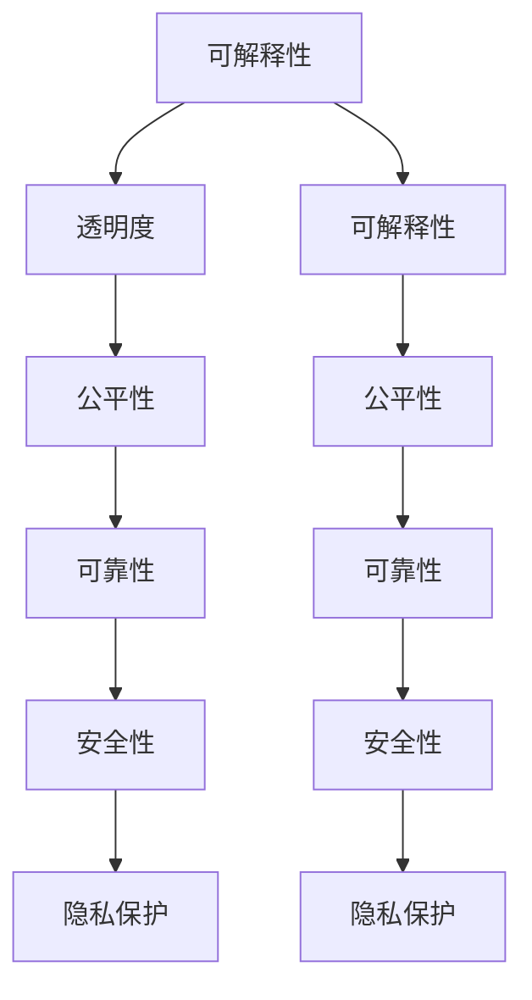

                 

## 1. 背景介绍

随着人工智能(AI)技术的迅猛发展，AI系统在各个领域的应用日益广泛，如自动驾驶、金融风控、医疗诊断、智能客服等。AI系统通过深度学习和机器学习算法，能够处理海量数据，快速做出高效决策，提升业务效率和用户体验。然而，这些系统的"黑盒"特性，使得其决策过程缺乏可解释性，常常引起质疑和误解。特别是在一些对人类福祉影响深远的领域，如医疗诊断、金融风控、司法判决等，缺乏可解释性和透明度的AI系统将难以获得用户的信任和社会的认可。

本文将系统介绍AI系统的可解释性与透明度设计，探讨如何构建具有高可解释性、高透明度的AI系统，以提升系统的可信度和接受度，确保其能够发挥应有的价值。

## 2. 核心概念与联系

### 2.1 核心概念概述

为更好地理解AI系统的可解释性与透明度设计，本节将介绍几个密切相关的核心概念：

- **可解释性(Explainability)**：指AI系统能够提供清晰、易于理解的理由和依据，解释其决策和推理过程，使用户能够理解系统为何做出特定决策。
- **透明度(Transparency)**：指AI系统的运作机制公开透明，用户能够获取关于系统的关键信息，包括其数据来源、算法原理、参数设置等。
- **公平性(Fairness)**：指AI系统在处理数据和做出决策时，不因偏见、歧视等原因导致对特定群体的歧视。
- **可靠性(Reliability)**：指AI系统能够稳定、准确地运行，在各种场景下都能提供可靠的结果。
- **安全性(Security)**：指AI系统具备对抗各种恶意攻击的能力，如对抗样本攻击、模型投毒等。
- **隐私保护(Privacy Protection)**：指AI系统在收集和使用数据时，能够保护用户的隐私信息，避免数据泄露和滥用。

这些核心概念之间存在密切联系，通过协同设计，可以构建具备高可解释性、高透明度的AI系统。下面通过Mermaid流程图展示它们之间的关系：



这个流程图展示了各个概念之间的相互影响关系。例如，公平性保证了系统的公正性，而透明度则提供了必要的信息，帮助判断公平性是否得到满足。可靠性是系统的核心性能指标，安全性是保证系统免受攻击的关键，隐私保护则确保数据使用的合法性。

## 3. 核心算法原理 & 具体操作步骤

### 3.1 算法原理概述

AI系统的可解释性与透明度设计，本质上是一种权衡策略，需要在模型的性能和可解释性之间找到平衡点。其核心思想是：通过合理设计模型结构和算法，将模型决策的依据清晰、直观地呈现给用户，同时确保模型的可靠性和安全性。

形式化地，假设AI系统为 $S$，其输入为 $x$，输出为 $y$。设 $f$ 为模型的函数映射，则：

$$
y = f(x)
$$

可解释性设计关注于函数 $f$ 的各个部分，如输入特征、模型结构、中间变量、输出结果等，帮助用户理解系统的决策过程。透明度设计则关注于函数 $f$ 的实现细节，如数据来源、算法原理、参数设置等，确保用户能够获取必要的信息。

### 3.2 算法步骤详解

AI系统的可解释性与透明度设计，通常包括以下几个关键步骤：

**Step 1: 数据准备与预处理**

- 收集和整理训练数据，确保数据多样性和代表性。
- 对数据进行清洗、标注、归一化等预处理，避免数据噪声和异常值影响模型。
- 确保数据符合伦理和隐私要求，如去标识化、数据最小化等。

**Step 2: 模型选择与构建**

- 选择合适的模型结构，如线性模型、决策树、神经网络等。
- 设计合理的模型参数和超参数，如学习率、正则化系数、特征选择等。
- 使用可解释性方法，如LIME、SHAP、特征重要性等，帮助理解模型决策。

**Step 3: 模型训练与评估**

- 在训练数据上训练模型，确保模型能够学习到数据的特征和规律。
- 使用测试数据评估模型性能，如准确率、召回率、F1值等。
- 在模型训练过程中，记录关键指标，如损失函数、梯度、特征权重等，用于后续分析和诊断。

**Step 4: 可解释性增强与透明度提升**

- 使用可解释性方法，对模型进行解释和可视化，如图示化、文本化等。
- 提供模型使用的数据来源、算法原理、参数设置等详细信息，确保用户能够获取必要的信息。
- 设计模型监控和反馈机制，及时发现和修正问题，确保系统的可靠性和安全性。

**Step 5: 系统部署与测试**

- 将模型部署到实际应用环境中，如API、移动应用等。
- 在实际应用中收集用户反馈，监控系统性能和用户满意度。
- 定期对模型进行再训练和微调，确保系统的持续优化和改进。

以上是AI系统可解释性与透明度设计的一般流程。在实际应用中，还需要根据具体任务和场景，对各环节进行优化设计，如引入对抗训练、数据增强、模型融合等，进一步提升系统的性能和可解释性。

### 3.3 算法优缺点

AI系统的可解释性与透明度设计，具有以下优点：

1. **提升用户信任**：通过清晰、直观的解释，帮助用户理解系统的决策过程，提升用户信任度和接受度。
2. **辅助决策优化**：通过分析模型的中间变量和输出结果，发现模型的优势和不足，辅助优化模型结构和参数。
3. **增强系统透明度**：确保用户能够获取必要的信息，帮助理解和监控系统的运作机制，确保系统的公平性和可靠性。
4. **促进模型改进**：通过系统的反馈机制，收集用户和业务方的意见，指导模型的持续改进和优化。

同时，该方法也存在一定的局限性：

1. **增加开发成本**：设计和实现可解释性方法需要额外的资源和成本投入，尤其是在复杂模型上。
2. **影响模型性能**：增加的解释步骤可能会对模型的训练速度和性能产生影响，需要权衡解释性和性能。
3. **解释质量不确定**：可解释性方法往往无法完全解释模型的决策过程，特别是在非线性或复杂模型中。
4. **复杂度增加**：增加的透明度设计可能会增加系统的复杂度，导致难以维护和调试。

尽管存在这些局限性，但就目前而言，AI系统的可解释性与透明度设计已成为构建可信、可接受AI系统的关键方向。未来相关研究的重点在于如何进一步降低设计成本，提高解释质量，同时兼顾模型的性能和可解释性。

### 3.4 算法应用领域

AI系统的可解释性与透明度设计，已经在诸多领域得到了广泛应用，如金融风控、医疗诊断、司法判决、智能客服等。以下是几个典型应用案例：

**金融风控**：在金融领域，AI系统被用于信用评分、欺诈检测、投资决策等。通过增加可解释性，可以帮助客户理解系统为什么拒绝其申请，提升用户满意度，同时确保系统的公平性和可靠性。

**医疗诊断**：在医疗领域，AI系统被用于影像分析、疾病预测、个性化治疗等。通过提供可解释的诊断依据，帮助医生理解系统的决策过程，辅助临床决策，提升医疗质量。

**司法判决**：在司法领域，AI系统被用于案件分析、证据评估、判决预测等。通过增加透明度，确保判决过程公开透明，提高司法公信力和公正性。

**智能客服**：在客服领域，AI系统被用于自动问答、情感分析、客户推荐等。通过提供清晰的解释和反馈，提升用户体验，同时辅助客服人员处理复杂问题，提升工作效率。

除了上述这些领域，AI系统的可解释性与透明度设计还在教育、交通、制造等多个行业得到应用，为各行业带来了深远的变革。随着AI技术的发展和应用场景的拓展，相信可解释性与透明度设计将更加深入人心，成为AI系统设计的标配。

## 4. 数学模型和公式 & 详细讲解 & 举例说明

### 4.1 数学模型构建

本节将使用数学语言对AI系统的可解释性与透明度设计进行更加严格的刻画。

假设AI系统为线性回归模型，其输入为 $x \in \mathbb{R}^d$，输出为 $y \in \mathbb{R}$。模型为：

$$
y = \theta^T x + b
$$

其中 $\theta$ 为模型参数，$b$ 为偏置项。训练数据为 $D=\{(x_i,y_i)\}_{i=1}^N$。模型损失函数为：

$$
\mathcal{L}(\theta) = \frac{1}{N}\sum_{i=1}^N (y_i - \theta^T x_i - b)^2
$$

模型的解释性设计可以通过特征重要性分析来实现，例如使用LIME、SHAP等方法。具体的数学推导和公式推导过程如下：

### 4.2 公式推导过程

LIME（Local Interpretable Model-agnostic Explanations）是一种常用的可解释性方法，通过局部线性模型来近似全局非线性模型。假设模型 $f(x)$ 在输入 $x$ 处的预测为 $y$，LIME方法的数学模型为：

$$
f(x) \approx f(x_0) + \sum_{i=1}^d \alpha_i \phi_i(x)
$$

其中 $\alpha_i$ 为权重，$\phi_i(x)$ 为特征 $x_i$ 的局部影响函数。假设训练数据为 $D=\{(x_i,y_i)\}_{i=1}^N$，模型为 $f(x) = \theta^T x + b$，则：

$$
f(x) \approx \theta^T x_0 + b + \sum_{i=1}^d \alpha_i \phi_i(x)
$$

进一步推导可得：

$$
\alpha_i = \frac{\partial \mathcal{L}(\theta)}{\partial x_i}
$$

通过求解上述方程，可以得到各个特征的局部影响权重，用于解释模型预测。

### 4.3 案例分析与讲解

以线性回归模型为例，LIME方法的应用过程如下：

1. 选择一个输入样本 $x_0$，计算其预测结果 $y_0 = f(x_0)$。
2. 收集模型在该样本的局部影响函数 $\phi_i(x)$，用于计算权重 $\alpha_i$。
3. 通过求解方程 $\alpha_i = \frac{\partial \mathcal{L}(\theta)}{\partial x_i}$，得到每个特征的局部影响权重。
4. 将局部线性模型 $f(x) \approx f(x_0) + \sum_{i=1}^d \alpha_i \phi_i(x)$ 应用到其他样本 $x_i$，解释模型预测结果。

假设某银行的信用评分模型 $f(x)$ 用于评估客户的信用风险。使用LIME方法，可以获取模型对每个特征（如收入、年龄、职业等）的局部影响权重，解释模型为什么拒绝某客户的申请。通过这种方式，不仅提升了用户对模型的信任度，还能辅助银行优化评分标准，提升信贷质量。

## 5. 项目实践：代码实例和详细解释说明

### 5.1 开发环境搭建

在进行可解释性与透明度设计实践前，我们需要准备好开发环境。以下是使用Python进行Scikit-learn和XGBoost开发的Python环境配置流程：

1. 安装Anaconda：从官网下载并安装Anaconda，用于创建独立的Python环境。

2. 创建并激活虚拟环境：
```bash
conda create -n explainable-env python=3.8 
conda activate explainable-env
```

3. 安装Scikit-learn和XGBoost：
```bash
conda install scikit-learn
conda install xgboost
```

4. 安装各类工具包：
```bash
pip install numpy pandas matplotlib seaborn jupyter notebook ipython
```

完成上述步骤后，即可在`explainable-env`环境中开始项目实践。

### 5.2 源代码详细实现

这里我们以线性回归模型为例，给出使用Scikit-learn和XGBoost对模型进行可解释性与透明度设计的Python代码实现。

首先，定义线性回归模型：

```python
from sklearn.linear_model import LinearRegression
from sklearn.model_selection import train_test_split
from sklearn.metrics import mean_squared_error

# 定义线性回归模型
model = LinearRegression()
```

然后，准备数据集并进行预处理：

```python
# 准备数据集
X = pd.read_csv('data.csv')
y = X.pop('target')

# 划分训练集和测试集
X_train, X_test, y_train, y_test = train_test_split(X, y, test_size=0.2, random_state=42)

# 数据标准化
X_train = StandardScaler().fit_transform(X_train)
X_test = StandardScaler().fit_transform(X_test)
```

接着，训练模型并进行解释性分析：

```python
# 训练模型
model.fit(X_train, y_train)

# 测试模型
y_pred = model.predict(X_test)

# 计算MSE
mse = mean_squared_error(y_test, y_pred)

# 计算特征重要性
importances = model.coef_

# 可视化特征重要性
feature_importances = pd.DataFrame({'feature': X.columns, 'importance': importances})
feature_importances.sort_values(by='importance', ascending=False).plot.bar()
```

最后，使用LIME方法进行局部解释：

```python
from lime.lime_tabular import LimeTabularExplainer

# 选择样本进行解释
x0 = X_test.iloc[0].to_dict()

# 初始化解释器
explainer = LimeTabularExplainer(X_train, feature_names=X_train.columns, random_state=42)

# 解释模型预测结果
iids = explainer.top_labels(X_train, [y0], num_features=3)
explanations = explainer.explain_instance(x0, model.predict_proba, num_features=3, num_samples=100)

# 输出解释结果
print(explanations)
```

以上就是使用Scikit-learn和XGBoost对线性回归模型进行可解释性与透明度设计的完整代码实现。可以看到，Scikit-learn和XGBoost提供了丰富的模型和工具，使得可解释性与透明度设计变得更加高效和便捷。

### 5.3 代码解读与分析

让我们再详细解读一下关键代码的实现细节：

**LinearRegression类**：
- `LinearRegression()`：定义线性回归模型。
- `fit(X, y)`：训练模型，其中X为输入特征，y为目标变量。
- `predict(X)`：预测模型输出。

**train_test_split函数**：
- 将数据集划分为训练集和测试集，其中test_size指定了测试集的比例，random_state指定了随机种子，保证结果的可复现性。

**StandardScaler类**：
- `StandardScaler()`：定义数据标准化器，将数据按均值和方差进行标准化处理。
- `fit_transform(X)`：拟合标准化器并转换数据，确保数据在相同尺度下进行比较。

**mean_squared_error函数**：
- `mean_squared_error(y_true, y_pred)`：计算预测值和真实值之间的均方误差。

**LimeTabularExplainer类**：
- `LimeTabularExplainer(X, feature_names, random_state)`：初始化LIME解释器，其中X为训练数据，feature_names为特征名称，random_state为随机种子。
- `top_labels(X, y, num_features)`：获取局部解释所需的样本标签。
- `explain_instance(x, model, num_features, num_samples)`：对单个样本进行解释，其中x为输入样本，model为模型，num_features为需要解释的特征数，num_samples为样本数量。

通过上述代码的实现，可以看出Scikit-learn和XGBoost在可解释性与透明度设计中的强大功能。开发者可以方便地使用这些工具，快速实现模型的训练、解释和可视化，提升系统的可解释性和透明度。

## 6. 实际应用场景

### 6.1 智能客服系统

在智能客服系统中，基于可解释性与透明度设计的AI模型，可以显著提升用户的信任度和满意度。客服人员可以使用模型生成的解释结果，向用户解释AI系统的决策依据，辅助解决复杂问题，提升用户体验。

例如，某智能客服系统使用基于可解释性与透明度设计的模型，进行自动问答和情感分析。当用户输入问题或反馈时，系统能够快速提供清晰、简洁的解释结果，帮助用户理解AI的决策过程。同时，系统还提供了详细的日志记录，便于客服人员跟踪和分析用户问题，提供更精准的服务。

### 6.2 金融风控系统

在金融风控系统中，基于可解释性与透明度设计的AI模型，可以提升系统的公平性和透明度，增强用户的信任度。通过解释模型的决策依据，用户能够理解系统为什么拒绝其申请或提出警告，从而提升系统的透明度和公信力。

例如，某银行使用基于可解释性与透明度设计的模型，进行客户信用评分和欺诈检测。系统在拒绝申请或标记可疑交易时，自动生成详细的解释结果，说明拒绝或标记的原因。用户可以通过这些解释结果，了解模型的决策依据，提升对系统的信任度，同时帮助银行优化信用评分标准，提高信贷质量。

### 6.3 医疗诊断系统

在医疗诊断系统中，基于可解释性与透明度设计的AI模型，可以提升系统的可解释性和透明度，增强医生的信任度。通过解释模型的诊断依据，医生能够理解系统的决策过程，辅助临床决策，提升医疗质量。

例如，某医院使用基于可解释性与透明度设计的模型，进行影像分析和疾病预测。系统在生成诊断结果时，自动生成详细的解释结果，说明诊断依据和可能的疾病类型。医生可以通过这些解释结果，理解系统的决策依据，辅助临床诊断，提升医疗质量。

## 7. 工具和资源推荐

### 7.1 学习资源推荐

为了帮助开发者系统掌握可解释性与透明度设计的理论基础和实践技巧，这里推荐一些优质的学习资源：

1. 《机器学习实战》系列博文：由知名机器学习专家撰写，深入浅出地介绍了机器学习模型的构建、训练、解释等技术细节。

2. 《深度学习框架指南》系列书籍：系统介绍了TensorFlow、PyTorch等深度学习框架的使用方法，涵盖模型构建、优化、解释等各个环节。

3. 《可解释机器学习》书籍：全面介绍了机器学习模型的可解释性方法，包括LIME、SHAP、XAI等，帮助理解模型决策过程。

4. 《Python机器学习》书籍：提供了Python在机器学习领域的实战经验，涵盖了数据预处理、模型训练、评估等各个环节。

5. 《XGBoost用户手册》书籍：详细介绍了XGBoost模型的使用方法，包括特征重要性分析、可解释性增强等技术细节。

通过这些资源的学习实践，相信你一定能够快速掌握可解释性与透明度设计的精髓，并用于解决实际的AI问题。

### 7.2 开发工具推荐

高效的开发离不开优秀的工具支持。以下是几款用于可解释性与透明度设计开发的常用工具：

1. Scikit-learn：开源的Python机器学习库，提供了丰富的模型和工具，包括特征选择、模型训练、可解释性增强等。

2. XGBoost：开源的Python机器学习库，提供高效的梯度提升算法，支持特征重要性分析、可解释性增强等。

3. SHAP：开源的Python库，提供了多种可解释性方法，包括LIME、SHAP值等，帮助理解模型决策过程。

4. LIME：开源的Python库，提供局部解释方法，能够生成模型的可解释性结果，帮助理解模型决策。

5. TensorBoard：TensorFlow配套的可视化工具，可以实时监测模型训练状态，提供详细的指标和图表，帮助分析模型性能。

6. Weights & Biases：模型训练的实验跟踪工具，可以记录和可视化模型训练过程中的各项指标，方便对比和调优。

合理利用这些工具，可以显著提升可解释性与透明度设计任务的开发效率，加快创新迭代的步伐。

### 7.3 相关论文推荐

可解释性与透明度设计的研究源于学界的持续研究。以下是几篇奠基性的相关论文，推荐阅读：

1. Explaining Machine Learning Models and Predictions for End Users: An Approach for Medical Diagnosis（医疗诊断中的机器学习模型和预测解释）：提出了一种将机器学习模型解释给医生的方法，帮助医生理解模型的决策过程。

2. Interpretable Machine Learning with Scikit-Learn: A Comparative Study（可解释机器学习：一种比较研究）：比较了多种可解释性方法，包括LIME、SHAP、XAI等，讨论了它们在实际应用中的效果和性能。

3. Deep Learning Explained: A deep dive into deep neural networks（深度学习解释：深入理解深度神经网络）：深入浅出地介绍了深度学习模型的工作原理和可解释性方法，帮助理解模型的决策过程。

4. On Explainable AI (XAI) Techniques for Interpretation of Machine Learning Models in Healthcare（AI解释性技术在医疗中的解释机器学习模型）：讨论了AI解释性技术在医疗领域的应用，帮助理解模型的决策过程。

5. The Art of Interpreting Deep Learning Models（解释深度学习模型的艺术）：介绍了多种可解释性方法，包括LIME、SHAP、TCAI等，帮助理解模型的决策过程。

这些论文代表了大模型可解释性与透明度设计的最新进展，通过学习这些前沿成果，可以帮助研究者把握学科前进方向，激发更多的创新灵感。

## 8. 总结：未来发展趋势与挑战

### 8.1 总结

本文对AI系统的可解释性与透明度设计进行了全面系统的介绍。首先阐述了可解释性和透明度在AI系统中的重要地位，明确了其在提升用户信任、辅助决策优化、增强系统透明度等方面的作用。其次，从原理到实践，详细讲解了可解释性设计的基本方法和具体步骤，给出了可解释性与透明度设计实践的完整代码实例。同时，本文还广泛探讨了可解释性方法在智能客服、金融风控、医疗诊断等多个行业领域的应用前景，展示了其广阔的应用空间。

通过本文的系统梳理，可以看到，AI系统的可解释性与透明度设计正在成为AI系统设计的标配，通过系统的设计，可以显著提升系统的可信度和接受度，确保其能够发挥应有的价值。未来，伴随AI技术的不断演进，可解释性与透明度设计必将进一步深入人心，成为构建可信、可接受AI系统的关键方向。

### 8.2 未来发展趋势

展望未来，AI系统的可解释性与透明度设计将呈现以下几个发展趋势：

1. **可解释性方法多样化**：除了传统的LIME、SHAP等方法外，未来将涌现更多可解释性方法，如Attribute-based Explanation（基于属性的解释）、Schema-based Explanation（基于模式的解释）等，为不同场景下的解释需求提供更多选择。

2. **透明度设计全面化**：未来的透明度设计将不仅限于模型的输出解释，还涉及模型的训练过程、参数设置、数据来源等，确保用户能够获取完整的模型信息。

3. **智能解释系统**：通过引入自然语言处理和生成技术，将模型的解释结果转化为易于理解的语言，进一步提升用户对系统的理解。

4. **联邦学习下的解释**：在联邦学习场景下，如何在保护隐私的前提下，对模型的解释结果进行安全传输和共享，成为新的研究方向。

5. **可解释性评估标准**：制定统一的AI可解释性评估标准，帮助比较不同解释方法的性能和效果。

6. **跨学科融合**：将可解释性设计与其他学科（如心理学、伦理学、法律等）进行跨学科融合，帮助理解模型决策的心理学和社会学影响。

以上趋势凸显了AI系统可解释性与透明度设计的广阔前景。这些方向的探索发展，必将进一步提升系统的可解释性和透明度，为构建安全、可靠、可解释、可控的智能系统铺平道路。

### 8.3 面临的挑战

尽管AI系统的可解释性与透明度设计已经取得了不小的进展，但在迈向更加智能化、普适化应用的过程中，它仍面临诸多挑战：

1. **解释质量不确定**：现有的可解释性方法往往无法完全解释模型的决策过程，特别是在非线性或复杂模型中，解释质量的确定性有待提升。

2. **解释成本高**：可解释性设计增加了开发成本，特别是在复杂模型上，解释步骤的增加会显著影响模型的训练速度和性能。

3. **解释结果不直观**：可解释性方法生成的解释结果往往复杂冗长，难以直观理解，需要进一步优化和简化。

4. **跨领域应用困难**：可解释性设计在不同领域的应用效果和需求各异，需要针对具体领域进行定制化的设计和优化。

5. **公平性和偏见**：可解释性设计可能会暴露模型中的偏见和歧视，需要对解释结果进行细致审查，确保公平性和公正性。

6. **隐私和安全风险**：在解释过程中，涉及大量的数据和模型信息，如何保护用户隐私和安全，防止数据泄露和滥用，仍需深入研究。

正视可解释性与透明度设计面临的这些挑战，积极应对并寻求突破，将是大模型可解释性与透明度设计走向成熟的必由之路。相信随着学界和产业界的共同努力，这些挑战终将一一被克服，可解释性与透明度设计必将在构建安全、可靠、可解释、可控的智能系统中扮演越来越重要的角色。

### 8.4 研究展望

面对可解释性与透明度设计所面临的种种挑战，未来的研究需要在以下几个方面寻求新的突破：

1. **引入先进技术**：引入自然语言处理、生成对抗网络等先进技术，进一步提升解释结果的直观性和易理解性。

2. **优化可解释性方法**：开发更加高效、精确的可解释性方法，在减少解释成本的同时，提升解释质量。

3. **定制化设计**：针对不同领域的特点，设计特定的解释方法，满足各领域的解释需求。

4. **多模型融合**：将多个可解释性方法进行融合，提升解释结果的全面性和可信度。

5. **隐私保护技术**：结合隐私保护技术，如差分隐私、联邦学习等，保护用户隐私和数据安全。

这些研究方向的探索，必将引领可解释性与透明度设计技术迈向更高的台阶，为构建安全、可靠、可解释、可控的智能系统铺平道路。面向未来，可解释性与透明度设计需要与其他人工智能技术进行更深入的融合，如知识表示、因果推理、强化学习等，多路径协同发力，共同推动人工智能技术的进步。

## 9. 附录：常见问题与解答

**Q1：什么是AI系统的可解释性与透明度设计？**

A: AI系统的可解释性与透明度设计，旨在构建具备高可解释性、高透明度的AI系统，通过清晰、直观的解释，帮助用户理解系统的决策过程，同时确保系统的运作机制公开透明，用户能够获取必要的信息。

**Q2：可解释性设计和技术有哪些？**

A: 可解释性设计和技术主要包括：LIME、SHAP、TCAI、XAI、Attribute-based Explanation、Schema-based Explanation等。这些方法通过不同的视角和手段，帮助理解模型的决策过程。

**Q3：如何选择合适的可解释性方法？**

A: 选择合适的可解释性方法，需要考虑模型的复杂度、数据的性质、解释需求等。对于线性模型，LIME和SHAP往往效果较好；对于复杂模型，XAI和TCAI等方法可能更适合。

**Q4：可解释性与透明度设计对AI系统有什么影响？**

A: 可解释性与透明度设计有助于提升AI系统的可信度和接受度，通过清晰、直观的解释，帮助用户理解系统的决策过程，同时确保系统的运作机制公开透明，用户能够获取必要的信息。这有助于提高用户信任度，降低误解和质疑，提升系统的实用性。

**Q5：可解释性与透明度设计的难点和挑战是什么？**

A: 可解释性与透明度设计的难点和挑战主要包括解释质量不确定、解释成本高、解释结果不直观、跨领域应用困难、公平性和偏见、隐私和安全风险等。需要在技术、应用、伦理等多个方面进行全面优化和改进。

通过这些问题的回答，相信你能够更全面地理解AI系统的可解释性与透明度设计的核心概念、基本方法和实际应用，从而更好地应用于具体的AI系统构建和优化中。

---

作者：禅与计算机程序设计艺术 / Zen and the Art of Computer Programming

