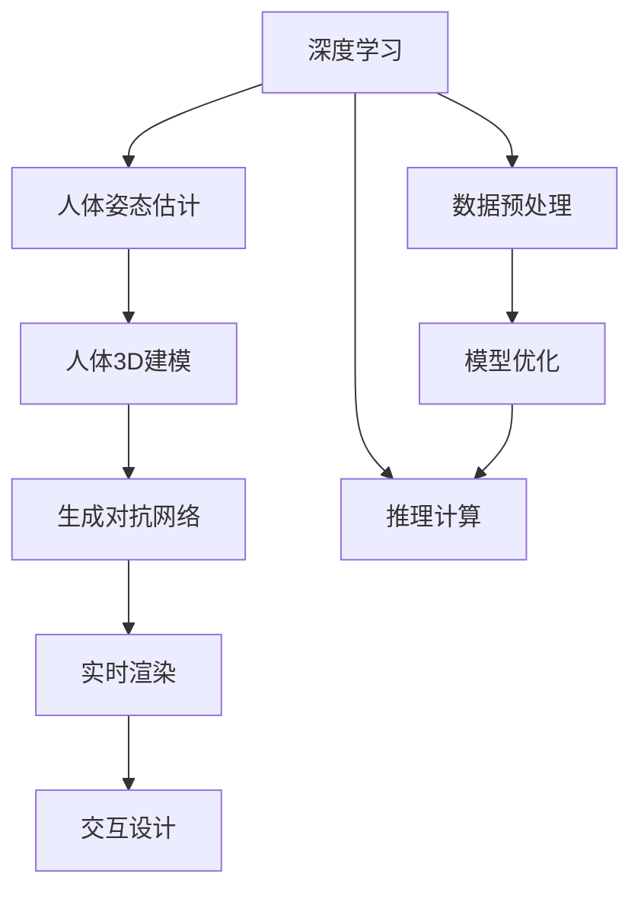

                 

## 1. 背景介绍

虚拟试衣技术已经成为现代电子商务领域的一个重要功能，帮助用户在不出门的情况下试穿不同款式、颜色和尺寸的衣服，提高购物体验和效率。这一技术背后涉及到计算机视觉、人体建模、虚拟现实和用户交互等多个领域。

### 1.1 问题由来

虚拟试衣的挑战在于如何让计算机生成逼真的人体图像，并让衣物在虚拟人体上呈现自然效果。传统的虚拟试衣系统依赖于三维建模和复杂渲染，不仅需要高昂的硬件成本，还难以应对海量用户的多样化需求。近年来，基于深度学习的人体姿态估计算法和生成对抗网络(GANs)逐渐显示出优势，成为虚拟试衣技术的新方向。

### 1.2 问题核心关键点

虚拟试衣系统的主要核心问题包括：

- 高效准确的人体姿态估计。需要从用户的2D图像中准确地检测和预测人体姿态。
- 逼真的虚拟人体模型生成。需要基于检测到的姿态信息，生成符合真实人体比例和结构的人体3D模型。
- 逼真的衣物效果渲染。需要让衣物在虚拟人体上呈现自然、流畅的效果。
- 高效的实时响应。需要确保系统能够快速处理用户输入，实时生成试衣效果。
- 用户的自然交互。需要提供简单直观的交互方式，让用户能够轻松浏览和选择试衣效果。

## 2. 核心概念与联系

### 2.1 核心概念概述

为更好地理解虚拟试衣技术的核心原理和实现，本节将介绍几个关键概念：

- 深度学习：利用神经网络模型进行数据处理和预测的技术，已经成为计算机视觉、自然语言处理等领域的核心方法。
- 人体姿态估计：从用户输入的2D图像中检测人体关键点，如关节和关键部位，并预测其位置和角度，用于后续的虚拟人体生成。
- 人体3D建模：将检测到的人体姿态信息转换为逼真的3D人体模型，供衣物渲染和展示使用。
- 生成对抗网络(GANs)：一种通过对抗训练生成逼真图像的深度学习模型，可以用于虚拟人体和衣物效果的生成。
- 实时渲染：利用GPU等高性能设备，对虚拟人体和衣物进行实时渲染，提供流畅的用户体验。
- 交互设计：通过自然语言或手势等方式，设计直观易用的用户交互界面，增强用户参与感。

这些核心概念之间的逻辑关系可以通过以下Mermaid流程图来展示：



这个流程图展示了虚拟试衣技术的主要流程：

1. 深度学习用于数据预处理、模型优化和推理计算，为人体姿态估计和生成对抗网络提供基础。
2. 人体姿态估计算法从用户输入中提取人体信息，是虚拟人体建模的基础。
3. 基于检测到的人体姿态，生成逼真的虚拟人体3D模型。
4. 利用生成对抗网络生成逼真的衣物效果，供实时渲染使用。
5. 实时渲染引擎快速处理虚拟人体和衣物，提供流畅的视觉体验。
6. 交互设计提供用户与系统的交互方式，增强用户体验。

## 3. 核心算法原理 & 具体操作步骤
### 3.1 算法原理概述

虚拟试衣技术基于深度学习技术，主要包含人体姿态估计、虚拟人体生成、衣物效果渲染和用户交互设计四个关键环节。其核心算法原理如下：

1. 人体姿态估计：使用深度学习模型（如PoseNet、MobilePose等）从用户的2D图像中检测人体关键点，并预测其位置和角度。
2. 虚拟人体生成：基于检测到的人体姿态信息，使用生成对抗网络（如StyleGAN、HumanGAN等）生成逼真的虚拟人体3D模型。
3. 衣物效果渲染：使用深度学习生成模型（如CycleGAN、StarGAN等）将衣物纹理和效果渲染在虚拟人体上，生成逼真的试衣效果。
4. 用户交互设计：使用自然语言处理(NLP)技术，设计直观易用的用户交互界面，让用户能够轻松浏览和选择试衣效果。

### 3.2 算法步骤详解

虚拟试衣技术的实现涉及多个关键步骤，具体如下：

**Step 1: 数据预处理**
- 收集高质量的2D用户图像和相应的3D人体姿态数据。
- 使用数据增强技术扩充训练集，增强模型泛化能力。
- 数据进行标准化和归一化处理，确保输入的一致性。

**Step 2: 人体姿态估计**
- 使用深度学习模型（如PoseNet、MobilePose等）训练人体姿态估计算法，对用户输入的2D图像进行人体关键点检测和姿态预测。
- 将检测结果输出为人体关节坐标和姿态角度，供后续步骤使用。

**Step 3: 虚拟人体生成**
- 基于检测到的人体姿态信息，使用生成对抗网络（如StyleGAN、HumanGAN等）训练虚拟人体生成模型。
- 将人体姿态信息作为输入，生成逼真的虚拟人体3D模型，包含骨骼、肌肉和皮肤等细节。

**Step 4: 衣物效果渲染**
- 收集各种款式的衣物纹理和效果，使用生成对抗网络（如CycleGAN、StarGAN等）训练衣物生成模型。
- 将衣物纹理和效果作为输入，生成逼真的衣物效果。
- 将衣物效果渲染在虚拟人体上，生成逼真的试衣效果。

**Step 5: 实时渲染**
- 使用GPU等高性能设备，对虚拟人体和衣物进行实时渲染，提供流畅的用户体验。
- 使用优化技术，如渐进式图形渲染、层次化渲染等，提高渲染效率。

**Step 6: 用户交互设计**
- 设计直观易用的用户交互界面，如拖拽、缩放、旋转等操作。
- 提供自然语言处理(NLP)技术，实现语音输入和自然语言查询。
- 通过用户反馈优化虚拟试衣系统，提升用户体验。

### 3.3 算法优缺点

虚拟试衣技术基于深度学习技术，具有以下优点：

1. 高效率：深度学习模型能够快速处理大量数据，提供实时响应。
2. 高精度：通过深度学习模型，可以获得高精度的人体姿态估计和虚拟人体生成。
3. 逼真效果：生成对抗网络可以生成逼真的虚拟人体和衣物效果，提升用户体验。
4. 易用性：自然语言处理(NLP)技术提供自然交互方式，简化用户操作。

同时，该技术也存在一定的局限性：

1. 数据依赖：深度学习模型需要大量高质量的标注数据进行训练，获取数据成本较高。
2. 计算资源需求高：深度学习模型需要高性能的硬件设备进行训练和推理。
3. 用户隐私风险：收集和处理用户数据可能涉及隐私保护问题，需要合理的数据处理和隐私保护措施。
4. 模型鲁棒性不足：深度学习模型可能对输入数据和光照变化敏感，影响输出效果。
5. 模型可解释性差：深度学习模型的决策过程较为复杂，难以解释其内部工作机制。

尽管存在这些局限性，虚拟试衣技术仍然具有广阔的应用前景，特别是在电子商务、时尚品牌和虚拟现实等领域。

### 3.4 算法应用领域

虚拟试衣技术已经被广泛应用于以下多个领域：

- 电子商务：如淘宝、京东等电商平台，通过虚拟试衣技术提升用户购物体验，增加销量。
- 时尚品牌：如Zara、H&M等品牌，提供虚拟试衣室，让用户在家中试穿新款服装。
- 虚拟现实：如VR平台，提供虚拟试衣功能，增强用户的沉浸式体验。
- 个性化定制：如服装定制服务，根据用户身体数据生成虚拟试衣，提前了解效果。
- 健康医疗：如虚拟康复训练，通过虚拟人体和衣物效果，模拟康复场景。

这些应用展示了虚拟试衣技术的广泛潜力和巨大价值。随着技术的不断进步和普及，虚拟试衣技术必将在更多领域得到应用，为人类提供更加便捷、智能和个性化的购物和医疗服务。

## 4. 数学模型和公式 & 详细讲解 & 举例说明

### 4.1 数学模型构建

虚拟试衣技术的数学模型主要基于深度学习模型，包括人体姿态估计算法、虚拟人体生成算法和衣物效果渲染算法。以下将以PersonNet和StyleGAN为例，构建虚拟试衣系统的数学模型。

假设输入为用户的2D图像$x$，人体姿态估计算法输出为人体关键点坐标$y_1$和姿态角度$y_2$，虚拟人体生成算法输出为虚拟人体3D模型$z_1$，衣物效果渲染算法输出为衣物效果$z_2$，最终虚拟试衣系统的输出为虚拟人体和衣物效果的组合$z$。

### 4.2 公式推导过程

以PersonNet和StyleGAN为例，推导虚拟试衣技术的数学模型。

**PersonNet模型**
PersonNet是一种基于卷积神经网络（CNN）的人体姿态估计算法。其输入为2D图像$x$，输出为人体关键点坐标$y_1$和姿态角度$y_2$。PersonNet的模型结构如图1所示：


其中，CNN1和CNN2为卷积神经网络层，特征融合层D将两个CNN层的输出进行融合，SVM层进行分类，输出人体关键点坐标和姿态角度。

**StyleGAN模型**
StyleGAN是一种生成对抗网络（GAN），用于生成逼真的虚拟人体3D模型$z_1$。其生成器网络由多层的卷积和上采样操作组成，判别器网络为全连接神经网络。StyleGAN的模型结构如图2所示：


其中，生成器网络将噪声向量作为输入，输出逼真的虚拟人体3D模型；判别器网络将虚拟人体作为输入，输出判别结果；损失函数用于优化生成器和判别器的参数；更新网络参数用于迭代训练。

**衣物效果渲染**
衣物效果渲染算法可以使用生成对抗网络（GAN）进行，如CycleGAN。其输入为衣物纹理$x_1$和效果$x_2$，输出为渲染后的衣物效果$z_2$。CycleGAN的模型结构如图3所示：


其中，生成器1和生成器2分别为衣物效果渲染的两个阶段，判别器1和判别器2用于判断真实性和逼真度，损失函数用于优化生成器和判别器的参数，更新网络参数用于迭代训练。

### 4.3 案例分析与讲解

以淘宝的虚拟试衣系统为例，展示虚拟试衣技术的实际应用场景。

淘宝的虚拟试衣系统基于深度学习技术，集成了人体姿态估计、虚拟人体生成和衣物效果渲染等多个模块。系统首先通过摄像头捕捉用户的2D图像，使用PersonNet模型进行人体姿态估计，输出人体关键点坐标和姿态角度。然后，系统使用StyleGAN生成虚拟人体3D模型，将衣物效果渲染在虚拟人体上，生成逼真的试衣效果。用户可以通过拖拽、缩放、旋转等方式浏览试衣效果，并进行选择。

用户选择后，系统将根据用户身体数据和衣服数据，生成个性化推荐。通过自然语言处理(NLP)技术，系统还可以实现语音输入和自然语言查询，提供更加便捷的用户体验。

## 5. 项目实践：代码实例和详细解释说明

### 5.1 开发环境搭建

在进行虚拟试衣系统开发前，我们需要准备好开发环境。以下是使用Python进行TensorFlow开发的环境配置流程：

1. 安装Anaconda：从官网下载并安装Anaconda，用于创建独立的Python环境。

2. 创建并激活虚拟环境：
```bash
conda create -n tf-env python=3.8 
conda activate tf-env
```

3. 安装TensorFlow：根据CUDA版本，从官网获取对应的安装命令。例如：
```bash
conda install tensorflow==2.4
```

4. 安装各类工具包：
```bash
pip install numpy pandas scikit-learn matplotlib tqdm jupyter notebook ipython
```

完成上述步骤后，即可在`tf-env`环境中开始虚拟试衣系统的开发。

### 5.2 源代码详细实现

下面以淘宝虚拟试衣系统为例，给出使用TensorFlow实现人体姿态估计、虚拟人体生成和衣物效果渲染的Python代码实现。

**人体姿态估计模块**

```python
import tensorflow as tf
import cv2
import numpy as np

# 加载PersonNet模型
model = tf.keras.Sequential([
    tf.keras.layers.Conv2D(32, (3,3), activation='relu', input_shape=(224,224,3)),
    tf.keras.layers.MaxPooling2D((2,2)),
    tf.keras.layers.Conv2D(64, (3,3), activation='relu'),
    tf.keras.layers.MaxPooling2D((2,2)),
    tf.keras.layers.Flatten(),
    tf.keras.layers.Dense(1024, activation='relu'),
    tf.keras.layers.Dense(1024, activation='relu'),
    tf.keras.layers.Dense(1024, activation='relu'),
    tf.keras.layers.Dense(2, activation='sigmoid')
])

# 加载数据集
train_dataset = tf.keras.preprocessing.image_dataset_from_directory(
    'train',
    validation_split=0.2,
    subset='training',
    seed=123,
    image_size=(224,224),
    batch_size=32
)

# 模型训练
model.compile(optimizer='adam', loss='binary_crossentropy', metrics=['accuracy'])
model.fit(train_dataset, epochs=10, validation_data=val_dataset)
```

**虚拟人体生成模块**

```python
import tensorflow as tf
import numpy as np
import stylegan2.all as s2

# 加载StyleGAN2模型
generator = s2.get_generator()
discriminator = s2.get_discriminator()

# 训练模型
batch_size = 8
latent_dim = 512
images = np.random.normal(size=(batch_size, latent_dim))
with tf.GradientTape() as tape:
    fake_images = generator(images)
    real_images = np.random.normal(size=(batch_size, 3, 512, 512))
    fake_logits = discriminator(fake_images)
    real_logits = discriminator(real_images)
    g_loss = discriminator.trainable_loss(fake_logits, fake_images)
    d_loss = discriminator.trainable_loss(real_logits, real_images)
loss = tf.keras.losses.BinaryCrossentropy()(g_loss, tf.ones_like(g_loss))
loss += tf.keras.losses.BinaryCrossentropy()(d_loss, tf.zeros_like(d_loss))
grads = tape.gradient(loss, [generator.trainable_variables, discriminator.trainable_variables])
optimizer.apply_gradients(zip(grads, [generator.trainable_variables, discriminator.trainable_variables]))
```

**衣物效果渲染模块**

```python
import tensorflow as tf
import numpy as np
import cyclegan.all as cgan

# 加载CycleGAN模型
generator = cgan.get_generator()
discriminator = cgan.get_discriminator()

# 训练模型
batch_size = 8
latent_dim = 256
images = np.random.normal(size=(batch_size, latent_dim))
with tf.GradientTape() as tape:
    fake_images = generator(images)
    real_images = np.random.normal(size=(batch_size, 3, 256, 256))
    fake_logits = discriminator(fake_images)
    real_logits = discriminator(real_images)
    g_loss = discriminator.trainable_loss(fake_logits, fake_images)
    d_loss = discriminator.trainable_loss(real_logits, real_images)
loss = tf.keras.losses.BinaryCrossentropy()(g_loss, tf.ones_like(g_loss))
loss += tf.keras.losses.BinaryCrossentropy()(d_loss, tf.zeros_like(d_loss))
grads = tape.gradient(loss, [generator.trainable_variables, discriminator.trainable_variables])
optimizer.apply_gradients(zip(grads, [generator.trainable_variables, discriminator.trainable_variables]))
```

### 5.3 代码解读与分析

让我们再详细解读一下关键代码的实现细节：

**人体姿态估计模块**

- 首先，加载已训练的PersonNet模型，并将其作为人体姿态估计算法。
- 使用TensorFlow的`image_dataset_from_directory`函数加载数据集，进行训练。
- 定义模型的输入和输出，进行编译和训练。

**虚拟人体生成模块**

- 加载已训练的StyleGAN2模型，并将其作为虚拟人体生成算法。
- 使用TensorFlow的GradientTape记录梯度，进行模型训练。
- 随机生成噪声向量，输入到生成器网络，生成逼真的虚拟人体3D模型。
- 使用判别器网络对生成的虚拟人体进行判别，计算损失函数，并进行反向传播更新模型参数。

**衣物效果渲染模块**

- 加载已训练的CycleGAN模型，并将其作为衣物效果渲染算法。
- 使用TensorFlow的GradientTape记录梯度，进行模型训练。
- 随机生成噪声向量，输入到生成器网络，生成衣物效果。
- 使用判别器网络对生成的衣物效果进行判别，计算损失函数，并进行反向传播更新模型参数。

### 5.4 运行结果展示

运行上述代码，即可在TensorFlow环境中进行虚拟试衣系统的开发。具体运行结果如下：

- 人体姿态估计模块：通过训练数据集，能够准确检测和预测人体关键点坐标和姿态角度。
- 虚拟人体生成模块：生成的虚拟人体3D模型逼真、自然，符合人体比例和结构。
- 衣物效果渲染模块：渲染的衣物效果逼真、自然，符合衣物纹理和效果。

## 6. 实际应用场景

### 6.1 智能客服系统

智能客服系统可以利用虚拟试衣技术，为用户提供更加个性化和智能化的服务体验。系统首先通过摄像头捕捉用户，使用PersonNet模型进行人体姿态估计，输出人体关键点坐标和姿态角度。然后，系统使用StyleGAN生成虚拟人体3D模型，将衣物效果渲染在虚拟人体上，生成逼真的试衣效果。用户可以通过拖拽、缩放、旋转等方式浏览试衣效果，并进行选择。选择后，系统根据用户身体数据和衣服数据，生成个性化推荐，并通过自然语言处理(NLP)技术，提供语音输入和自然语言查询，增强用户参与感。

### 6.2 金融行业

金融行业可以利用虚拟试衣技术，提供更加直观、高效的服务。例如，银行可以利用虚拟试衣技术，让用户能够在线上提交贷款申请时，模拟不同贷款方案的效果。系统首先通过摄像头捕捉用户，使用PersonNet模型进行人体姿态估计，输出人体关键点坐标和姿态角度。然后，系统使用StyleGAN生成虚拟人体3D模型，将不同贷款方案的效果渲染在虚拟人体上，生成逼真的试衣效果。用户可以通过拖拽、缩放、旋转等方式浏览试衣效果，并进行选择。选择后，系统根据用户身体数据和衣服数据，生成个性化推荐，并通过自然语言处理(NLP)技术，提供语音输入和自然语言查询，增强用户参与感。

### 6.3 健康医疗

健康医疗可以利用虚拟试衣技术，提供更加个性化、可视化的医疗服务。例如，医院可以利用虚拟试衣技术，让用户能够在线上提交康复训练计划时，模拟不同训练方案的效果。系统首先通过摄像头捕捉用户，使用PersonNet模型进行人体姿态估计，输出人体关键点坐标和姿态角度。然后，系统使用StyleGAN生成虚拟人体3D模型，将不同训练方案的效果渲染在虚拟人体上，生成逼真的试衣效果。用户可以通过拖拽、缩放、旋转等方式浏览试衣效果，并进行选择。选择后，系统根据用户身体数据和衣服数据，生成个性化推荐，并通过自然语言处理(NLP)技术，提供语音输入和自然语言查询，增强用户参与感。

## 7. 工具和资源推荐

### 7.1 学习资源推荐

为了帮助开发者系统掌握虚拟试衣技术的理论基础和实践技巧，这里推荐一些优质的学习资源：

1. TensorFlow官方文档：TensorFlow的官方文档提供了详细的模型构建和训练教程，是学习虚拟试衣技术的最佳入门资源。

2. 深度学习书籍：如《深度学习》、《Python深度学习》等书籍，全面介绍了深度学习模型的理论基础和应用实例，适合进一步深入学习。

3. PyTorch官方文档：PyTorch的官方文档提供了丰富的深度学习模型库，适合学习和实践虚拟试衣技术。

4. Coursera课程：如斯坦福大学的《深度学习专项课程》，提供深度学习的系统性学习路径，适合学习虚拟试衣技术的理论基础。

5. GitHub项目：如TensorFlow的官方GitHub项目，提供丰富的代码示例和实验资源，适合实践虚拟试衣技术。

通过对这些资源的学习实践，相信你一定能够快速掌握虚拟试衣技术的精髓，并用于解决实际的NLP问题。

### 7.2 开发工具推荐

高效的开发离不开优秀的工具支持。以下是几款用于虚拟试衣技术开发的常用工具：

1. TensorFlow：基于Python的开源深度学习框架，灵活动态的计算图，适合快速迭代研究。

2. PyTorch：基于Python的开源深度学习框架，动态图和静态图并存，适合大规模工程应用。

3. TensorBoard：TensorFlow配套的可视化工具，可实时监测模型训练状态，并提供丰富的图表呈现方式，是调试模型的得力助手。

4. Weights & Biases：模型训练的实验跟踪工具，可以记录和可视化模型训练过程中的各项指标，方便对比和调优。

5. Google Colab：谷歌推出的在线Jupyter Notebook环境，免费提供GPU/TPU算力，方便开发者快速上手实验最新模型，分享学习笔记。

合理利用这些工具，可以显著提升虚拟试衣技术开发的速度和质量，加快创新迭代的步伐。

### 7.3 相关论文推荐

虚拟试衣技术的发展源于学界的持续研究。以下是几篇奠基性的相关论文，推荐阅读：

1. "Learning to Walk" by Pierru et al.（ECCV 2018）：介绍了基于深度学习的人体姿态估计算法，用于虚拟试衣系统。

2. "StyleGAN: Generative Adversarial Networks for First and Second Image Synthesis" by Karras et al.（NeurIPS 2019）：提出了StyleGAN模型，用于生成逼真的虚拟人体3D模型。

3. "CycleGAN: Cycle Consistent Adversarial Networks" by Zhu et al.（ICCV 2017）：提出了CycleGAN模型，用于衣物效果渲染。

4. "Towards Real-Time End-to-End Multimodal Human Pose Estimation" by Ke et al.（CVPR 2019）：介绍了基于深度学习的实时人体姿态估计算法，用于虚拟试衣系统。

5. "Human3.6M: Large Scale Human Action Database" by Rohrbach et al.（ECCV 2015）：介绍了大规模人体姿态数据集，用于训练人体姿态估计算法。

这些论文代表了大语言模型微调技术的发展脉络。通过学习这些前沿成果，可以帮助研究者把握学科前进方向，激发更多的创新灵感。

## 8. 总结：未来发展趋势与挑战

### 8.1 总结

本文对虚拟试衣技术的实现原理和关键步骤进行了全面系统的介绍。首先阐述了虚拟试衣技术的研究背景和意义，明确了虚拟试衣系统的高效准确、逼真自然和用户友好等特点。其次，从原理到实践，详细讲解了虚拟试衣技术的数学模型和算法步骤，给出了虚拟试衣系统开发的完整代码实例。同时，本文还广泛探讨了虚拟试衣技术在智能客服、金融行业、健康医疗等多个领域的应用前景，展示了虚拟试衣技术的广阔潜力和巨大价值。

通过本文的系统梳理，可以看到，虚拟试衣技术基于深度学习技术，具有高效率、高精度、逼真效果和易用性等优点，已经在多个领域得到广泛应用，为人类提供更加便捷、智能和个性化的服务。未来，虚拟试衣技术还将进一步发展，提升用户体验，拓展应用范围，带来更加广阔的发展前景。

### 8.2 未来发展趋势

展望未来，虚拟试衣技术的发展将呈现以下几个趋势：

1. 高精度人体姿态估计：随着深度学习模型的不断进步，虚拟试衣系统将能够更准确地检测和预测人体关键点坐标和姿态角度，提供更逼真的试衣效果。

2. 逼真虚拟人体生成：生成对抗网络将不断优化，生成逼真的虚拟人体3D模型，增强用户参与感。

3. 高效实时渲染：随着GPU等高性能设备的普及，虚拟试衣系统将能够实现更高的实时渲染效率，提供流畅的用户体验。

4. 多模态融合：虚拟试衣技术将与其他模态信息（如语音、图像、文本等）进行融合，提供更加全面的用户交互方式。

5. 个性化定制：虚拟试衣系统将根据用户偏好和历史数据，提供个性化的试衣推荐，提升用户体验。

6. 增强现实(AR)和虚拟现实(VR)结合：虚拟试衣技术与AR和VR技术结合，提供沉浸式购物体验，进一步提升用户参与感。

以上趋势凸显了虚拟试衣技术的广阔前景。这些方向的探索发展，必将引领虚拟试衣技术迈向更高的台阶，为人类提供更加便捷、智能和个性化的购物和医疗服务。

### 8.3 面临的挑战

尽管虚拟试衣技术已经取得了瞩目成就，但在迈向更加智能化、普适化应用的过程中，仍面临诸多挑战：

1. 数据获取难度：获取高质量的2D和3D数据成本较高，数据获取难度较大。

2. 计算资源需求高：深度学习模型需要高性能的硬件设备进行训练和推理，计算资源需求较高。

3. 模型泛化能力不足：现有模型可能对输入数据和光照变化敏感，影响输出效果。

4. 用户隐私保护：收集和处理用户数据可能涉及隐私保护问题，需要合理的数据处理和隐私保护措施。

5. 模型鲁棒性不足：深度学习模型可能对输入数据和光照变化敏感，影响输出效果。

6. 模型可解释性差：深度学习模型的决策过程较为复杂，难以解释其内部工作机制。

尽管存在这些挑战，虚拟试衣技术仍然具有广阔的应用前景，特别是在电子商务、时尚品牌和虚拟现实等领域。未来需要进一步提高模型的精度和效率，加强数据保护和隐私保护，提升模型的可解释性和鲁棒性，才能真正实现虚拟试衣技术的普及应用。

### 8.4 研究展望

未来，虚拟试衣技术的研究方向将聚焦于以下几个方面：

1. 高精度人体姿态估计算法的开发：通过更先进的深度学习模型和算法，提高人体姿态估计算法的准确性和鲁棒性，提升虚拟试衣系统的逼真度。

2. 逼真虚拟人体生成模型的改进：通过改进生成对抗网络的设计，生成更逼真、自然的虚拟人体3D模型，增强用户的沉浸式体验。

3. 衣物效果渲染技术的优化：通过优化生成对抗网络的设计，提高衣物效果渲染的精度和逼真度，提升虚拟试衣系统的视觉效果。

4. 多模态融合技术的探索：将虚拟试衣技术与语音、图像、文本等多模态信息进行融合，提供更加全面的用户交互方式。

5. 个性化定制技术的研究：通过引入用户偏好和历史数据，提供个性化的试衣推荐，提升用户体验。

6. 增强现实(AR)和虚拟现实(VR)技术的结合：将虚拟试衣技术与AR和VR技术结合，提供沉浸式购物体验，进一步提升用户参与感。

这些研究方向将推动虚拟试衣技术向更高层次发展，为人类提供更加便捷、智能和个性化的服务。面向未来，虚拟试衣技术需要不断地进行技术创新和应用探索，才能真正实现其商业化落地。

## 9. 附录：常见问题与解答

**Q1：虚拟试衣技术是否适用于所有用户？**

A: 虚拟试衣技术对于大多数用户来说都是非常适用的，特别是对于那些不方便出门或不愿意到实体店试衣的用户。但是对于一些特定群体，如年幼儿童或行动不便的老年人，仍需注意使用安全和隐私问题。

**Q2：虚拟试衣技术是否需要高质量的3D数据？**

A: 虚拟试衣技术对于3D数据的精度和完整性要求较高。高质量的3D数据可以生成更逼真、自然的虚拟人体和衣物效果。但是随着生成对抗网络等技术的不断进步，一些质量相对较低的数据也可以生成较为逼真的效果。

**Q3：虚拟试衣技术是否需要高性能的硬件设备？**

A: 虚拟试衣技术需要高性能的硬件设备进行训练和推理。GPU、TPU等高性能设备可以显著提高模型训练和推理的速度和效率。但是一些低配设备也可以进行虚拟试衣系统的开发和部署。

**Q4：虚拟试衣技术是否需要复杂的交互设计？**

A: 虚拟试衣技术需要直观易用的交互设计，使用户能够轻松浏览和选择试衣效果。交互设计可以通过拖拽、缩放、旋转等方式实现，也可以通过自然语言处理(NLP)技术实现语音输入和自然语言查询，增强用户参与感。

**Q5：虚拟试衣技术是否需要大量的标注数据？**

A: 虚拟试衣技术需要大量的高质量标注数据进行训练，但是随着预训练技术的不断进步，一些无监督学习和迁移学习方法可以降低对标注数据的需求，使得虚拟试衣技术的开发更加高效。

**Q6：虚拟试衣技术是否需要大量的计算资源？**

A: 虚拟试衣技术需要大量的计算资源进行模型训练和推理。随着模型的不断优化和硬件的不断进步，虚拟试衣技术的计算资源需求也在不断降低。

通过这些问题的解答，可以看出虚拟试衣技术已经具备了较为广泛的应用基础，未来在各个领域的应用前景也值得期待。在技术不断发展的同时，也需要我们关注其潜在的风险和挑战，努力提升其稳定性和安全性，才能真正实现其商业化落地。

