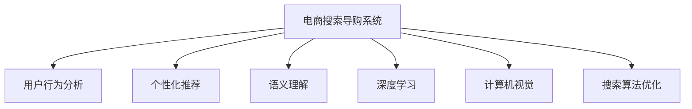

                 

# AI赋能电商搜索导购：提升用户体验和转化率的实践案例

> 关键词：电商搜索导购, 用户行为分析, 个性化推荐, 语义理解, 深度学习, 自然语言处理(NLP), 计算机视觉(CV), 搜索算法优化

## 1. 背景介绍

### 1.1 问题由来
随着互联网的普及和电商平台的兴起，电商搜索导购系统已成为用户获取商品信息的重要工具。传统的电商搜索导购系统基于简单的关键词匹配，缺乏对用户意图和行为的理解，常常导致用户体验差、转化率低。随着人工智能技术的不断发展，电商搜索导购系统开始引入AI技术，如自然语言处理(NLP)、计算机视觉(CV)等，以提升搜索和导购的智能化水平。

### 1.2 问题核心关键点
目前，基于AI技术的电商搜索导购系统在用户行为分析、个性化推荐、语义理解等方面取得了显著进展。但这些系统仍面临诸多挑战，如搜索结果的多样性和准确性、推荐系统的公平性和透明度、搜索算法的优化效率等。如何构建高效、公平、透明的电商搜索导购系统，提升用户体验和转化率，是当前研究的热点问题。

### 1.3 问题研究意义
研究电商搜索导购系统中的AI技术应用，对于提升电商平台的搜索和导购体验、优化用户体验和转化率，具有重要意义：

1. **提升用户体验**：通过引入AI技术，电商搜索导购系统能够更好地理解用户意图和需求，提供更精准、个性化的搜索结果和推荐，满足用户的个性化需求。
2. **优化转化率**：AI技术能够预测用户行为，推荐最符合用户兴趣的商品，提升用户购买转化率，增加平台收入。
3. **增强竞争力**：电商搜索导购系统的智能化水平直接决定了平台的竞争力，AI技术的应用有助于构建差异化优势，提升平台的市场份额。
4. **推动行业发展**：AI技术的应用推动了电商行业的技术升级和模式创新，加速了电商平台的数字化转型。
5. **加速创新**：AI技术为电商搜索导购系统的持续优化和创新提供了技术基础，催生了新的商业机会和应用场景。

## 2. 核心概念与联系

### 2.1 核心概念概述

为更好地理解基于AI技术的电商搜索导购系统，本节将介绍几个关键概念及其联系：

- **电商搜索导购系统(E-commerce Search & Recommendation System)**：基于AI技术的电商搜索导购系统，能够理解用户意图，提供个性化搜索结果和推荐，提升用户体验和转化率。
- **用户行为分析(User Behavior Analysis)**：通过分析用户搜索、浏览、购买等行为数据，构建用户画像，预测用户行为和偏好，从而进行个性化推荐。
- **个性化推荐(Personalized Recommendation)**：根据用户画像和行为数据，推荐最符合用户兴趣的商品，提升用户满意度和转化率。
- **语义理解(Semantic Understanding)**：通过自然语言处理技术，理解用户查询的自然语言含义，匹配最相关的搜索结果和推荐内容。
- **深度学习(Deep Learning)**：基于深度神经网络构建的模型，能够从大量数据中提取高层次的特征表示，适用于电商搜索导购系统中的多种任务。
- **计算机视觉(Computer Vision, CV)**：用于图像识别、物体检测等任务，提升电商搜索导购系统的图像理解能力，支持对视觉内容的检索和推荐。
- **搜索算法优化(Search Algorithm Optimization)**：针对电商搜索导购系统的优化算法，如查询匹配、排序、推荐等，提升系统的搜索效率和效果。

这些核心概念之间的逻辑关系可以通过以下Mermaid流程图来展示：



这个流程图展示了大语言模型的核心概念及其之间的关系：

1. 电商搜索导购系统通过用户行为分析获取用户画像，进一步通过深度学习和计算机视觉技术进行语义理解和商品匹配。
2. 个性化推荐模块利用用户画像和行为数据，生成个性化的搜索结果和推荐。
3. 搜索算法优化模块则通过算法改进，提升搜索结果和推荐的效率和效果。

这些概念共同构成了电商搜索导购系统的技术框架，使其能够在用户行为分析的基础上，提供高质量的搜索结果和推荐，提升用户体验和转化率。

## 3. 核心算法原理 & 具体操作步骤
### 3.1 算法原理概述

基于AI技术的电商搜索导购系统，其核心算法原理主要包括用户行为分析、个性化推荐、语义理解、深度学习、计算机视觉等。以下将详细介绍这些核心算法的原理及其操作步骤。

### 3.2 算法步骤详解

#### 3.2.1 用户行为分析

用户行为分析的目的是通过分析用户的历史行为数据，构建用户画像，从而预测用户未来的行为和需求。具体步骤如下：

1. **数据采集**：收集用户搜索、浏览、购买等行为数据，包括点击率、停留时间、购买记录等。
2. **特征提取**：将行为数据转化为数值特征，如点击次数、停留时长、商品ID等。
3. **用户画像构建**：通过聚类、关联规则等方法，对用户进行分群，构建用户画像。
4. **行为预测**：使用机器学习模型，如随机森林、梯度提升树等，对用户未来的行为进行预测。

#### 3.2.2 个性化推荐

个性化推荐的核心在于构建用户与商品之间的关系，通过分析用户的行为数据，预测用户对商品的兴趣和偏好，从而进行精准推荐。具体步骤如下：

1. **用户画像和商品画像构建**：对用户行为和商品属性进行特征提取，构建用户画像和商品画像。
2. **相似度计算**：使用协同过滤、基于内容的推荐算法等方法，计算用户画像和商品画像之间的相似度。
3. **推荐生成**：根据相似度计算结果，生成个性化的推荐列表。

#### 3.2.3 语义理解

语义理解的目标是理解用户的自然语言查询，从中提取有用的信息，匹配最相关的搜索结果和推荐内容。具体步骤如下：

1. **查询解析**：使用自然语言处理技术，如分词、实体识别、依存句法分析等，解析用户的查询。
2. **意图识别**：通过分析查询的语法结构和语义信息，识别用户的查询意图。
3. **搜索结果匹配**：将用户查询与商品数据进行匹配，找到最相关的搜索结果。

#### 3.2.4 深度学习

深度学习在电商搜索导购系统中主要用于用户行为分析和个性化推荐。深度神经网络能够从大量数据中提取高层次的特征表示，适用于电商搜索导购系统中的多种任务。具体步骤如下：

1. **模型选择**：选择适合电商搜索导购系统的深度学习模型，如卷积神经网络(CNN)、循环神经网络(RNN)、Transformer等。
2. **特征提取**：将用户行为数据和商品数据转化为网络可用的特征表示。
3. **模型训练**：使用标注数据对深度学习模型进行训练，优化模型的参数。
4. **预测和推理**：使用训练好的模型进行预测和推理，生成个性化的推荐结果。

#### 3.2.5 计算机视觉

计算机视觉在电商搜索导购系统中主要用于视觉内容的检索和推荐。具体步骤如下：

1. **图像采集**：通过摄像头或图片上传等方式，采集商品的视觉数据。
2. **特征提取**：使用计算机视觉技术，如卷积神经网络(CNN)、图像分割等，提取商品的视觉特征。
3. **图像检索**：将用户查询的视觉特征与商品视觉特征进行匹配，找到最相关的商品。

### 3.3 算法优缺点

#### 3.3.1 用户行为分析

**优点**：
1. **精准度**：通过分析用户行为数据，能够更精准地预测用户需求，提升个性化推荐的准确性。
2. **动态性**：用户行为数据是动态变化的，能够实时更新用户画像，保持推荐系统的时效性。

**缺点**：
1. **隐私风险**：用户行为数据涉及个人隐私，数据采集和使用过程中需要严格遵守隐私保护政策。
2. **数据质量**：用户行为数据的质量直接影响用户画像的构建和行为预测的准确性，需要保证数据完整性和可靠性。

#### 3.3.2 个性化推荐

**优点**：
1. **用户满意度**：个性化推荐能够满足用户的个性化需求，提升用户满意度和忠诚度。
2. **转化率**：个性化推荐能够推荐最符合用户兴趣的商品，提升用户购买转化率。

**缺点**：
1. **冷启动问题**：新用户或没有足够历史行为数据的用户，难以进行个性化推荐。
2. **公平性**：个性化推荐可能存在偏差，某些用户或商品可能会被忽略。

#### 3.3.3 语义理解

**优点**：
1. **自然语言处理**：通过语义理解，能够更好地理解用户的自然语言查询，提升搜索结果的准确性和相关性。
2. **多语言支持**：语义理解技术可以应用于多种语言，提升多语言电商平台的搜索和推荐效果。

**缺点**：
1. **计算复杂度**：语义理解涉及复杂的自然语言处理算法，计算复杂度高。
2. **歧义性**：自然语言具有歧义性，语义理解可能存在误差。

#### 3.3.4 深度学习

**优点**：
1. **特征提取能力强**：深度学习能够从大量数据中提取高层次的特征表示，适用于电商搜索导购系统中的多种任务。
2. **自适应能力强**：深度学习模型具有较强的自适应能力，能够不断优化模型参数，提升推荐效果。

**缺点**：
1. **计算资源需求高**：深度学习模型需要大量的计算资源进行训练和推理，硬件成本较高。
2. **可解释性差**：深度学习模型通常被视为"黑盒"系统，难以解释其内部工作机制和决策逻辑。

#### 3.3.5 计算机视觉

**优点**：
1. **多模态信息融合**：计算机视觉技术可以与自然语言处理技术结合，实现视觉和文本信息的协同建模。
2. **图像匹配能力强**：计算机视觉技术在图像匹配和相似度计算方面具有优势，适用于电商搜索导购系统中的视觉内容推荐。

**缺点**：
1. **数据标注成本高**：视觉数据需要进行标注，标注成本较高。
2. **计算复杂度**：计算机视觉技术涉及复杂的图像处理算法，计算复杂度高。

### 3.4 算法应用领域

#### 3.4.1 电商搜索导购

电商搜索导购系统是电商平台上最重要的功能之一，基于AI技术的搜索导购系统能够提升用户体验和转化率。具体应用包括：

- **搜索结果优化**：通过语义理解和深度学习技术，提升搜索结果的精准性和相关性。
- **个性化推荐**：根据用户行为数据和商品属性，生成个性化的推荐列表。
- **视觉内容推荐**：利用计算机视觉技术，推荐最符合用户兴趣的商品图片和视频。

#### 3.4.2 金融、医疗等领域

AI技术在金融、医疗等领域也有广泛应用。例如，金融行业中的智能投顾、医疗行业中的智能诊断等，都可以通过AI技术提升服务质量和效率。

- **智能投顾**：通过分析用户的历史交易数据和市场行情，智能投顾能够提供个性化的投资建议，提升用户满意度。
- **智能诊断**：通过分析医学影像和病历数据，智能诊断系统能够辅助医生进行疾病诊断，提高诊断准确率。

## 4. 数学模型和公式 & 详细讲解  
### 4.1 数学模型构建

#### 4.1.1 用户行为分析

**用户行为数据**：
- 用户ID: `U`
- 商品ID: `I`
- 点击次数: `C`
- 停留时长: `T`
- 购买记录: `P`

**用户画像构建**：
- 用户行为特征矩阵: `A`
- 用户画像向量: `H`

**行为预测模型**：
- 随机森林模型: `F`

**用户行为数据和用户画像的关系**：
- 用户行为特征: `X`
- 用户画像: `H`

**行为预测公式**：
- 预测概率: `P(Y|X)`

#### 4.1.2 个性化推荐

**用户画像和商品画像的关系**：
- 用户画像向量: `H`
- 商品画像向量: `P`

**相似度计算公式**：
- 余弦相似度: `cosine_similarity(H, P)`

**推荐生成公式**：
- 推荐列表: `R`

#### 4.1.3 语义理解

**查询解析公式**：
- 查询意图: `I`

**搜索结果匹配公式**：
- 相关度评分: `score`

#### 4.1.4 深度学习

**深度神经网络模型**：
- 输入特征: `X`
- 网络结构: `N`
- 输出: `Y`

**损失函数**：
- 交叉熵损失: `CE Loss`

**深度学习模型训练公式**：
- 模型参数: `θ`

#### 4.1.5 计算机视觉

**图像特征提取公式**：
- 图像特征: `F`

**图像检索公式**：
- 匹配度: `match`

### 4.2 公式推导过程

#### 4.2.1 用户行为分析

**用户行为数据特征提取**：
- 用户ID: `U`
- 商品ID: `I`
- 点击次数: `C`
- 停留时长: `T`
- 购买记录: `P`

**用户画像构建**：
- 用户行为特征矩阵: `A`
- 用户画像向量: `H`
  $$
  H = A \times W
  $$

**行为预测模型**：
- 随机森林模型: `F`
- 预测概率: `P(Y|X)`
  $$
  P(Y|X) = F(X)
  $$

#### 4.2.2 个性化推荐

**相似度计算公式**：
- 余弦相似度: `cosine_similarity(H, P)`
  $$
  cosine_similarity(H, P) = \frac{H \cdot P}{\|H\| \cdot \|P\|}
  $$

**推荐生成公式**：
- 推荐列表: `R`
  $$
  R = \text{Top-k}(\{P_i \mid cosine_similarity(H, P_i) \geq \theta\})
  $$

#### 4.2.3 语义理解

**查询解析公式**：
- 查询意图: `I`
  $$
  I = \text{NLP解析}(\text{查询字符串})
  $$

**搜索结果匹配公式**：
- 相关度评分: `score`
  $$
  score = \text{NLP理解}(I, \text{搜索结果})
  $$

#### 4.2.4 深度学习

**深度神经网络模型**：
- 输入特征: `X`
- 网络结构: `N`
- 输出: `Y`
  $$
  Y = f(N, X)
  $$

**损失函数**：
- 交叉熵损失: `CE Loss`
  $$
  CE Loss = -\frac{1}{N}\sum_{i=1}^N(y_i \log(\hat{y}_i) + (1-y_i) \log(1-\hat{y}_i))
  $$

**深度学习模型训练公式**：
- 模型参数: `θ`
  $$
  \theta = \text{Gradient Descent}(Loss)
  $$

#### 4.2.5 计算机视觉

**图像特征提取公式**：
- 图像特征: `F`
  $$
  F = CNN(图像)
  $$

**图像检索公式**：
- 匹配度: `match`
  $$
  match = \text{Cosine Similarity}(F_q, F_i)
  $$

### 4.3 案例分析与讲解

#### 4.3.1 用户行为分析案例

假设某电商平台的用户ID为`U`，浏览的商品ID为`I`，点击次数为`C`，停留时长为`T`，购买记录为`P`。通过收集这些行为数据，构建用户画像向量`H`，使用随机森林模型预测用户未来的购买行为。

#### 4.3.2 个性化推荐案例

假设某电商平台收集了用户画像向量`H`和商品画像向量`P`，通过余弦相似度计算用户画像和商品画像的相似度，生成个性化的推荐列表`R`。

#### 4.3.3 语义理解案例

假设某电商平台的用户查询为`查询字符串`，通过自然语言处理技术解析查询意图`I`，使用搜索结果匹配公式生成相关度评分`score`。

#### 4.3.4 深度学习案例

假设某电商平台使用深度神经网络模型`N`，输入特征`X`为用户的搜索历史和行为数据，输出`Y`为推荐列表`R`，使用交叉熵损失函数进行模型训练。

#### 4.3.5 计算机视觉案例

假设某电商平台使用计算机视觉技术，提取商品图像特征`F`，通过余弦相似度计算用户查询`查询字符串`和商品图像`图像`之间的匹配度`match`，生成视觉内容推荐列表。

## 5. 项目实践：代码实例和详细解释说明
### 5.1 开发环境搭建

在进行项目实践前，我们需要准备好开发环境。以下是使用Python进行PyTorch开发的环境配置流程：

1. 安装Anaconda：从官网下载并安装Anaconda，用于创建独立的Python环境。

2. 创建并激活虚拟环境：
```bash
conda create -n pytorch-env python=3.8 
conda activate pytorch-env
```

3. 安装PyTorch：根据CUDA版本，从官网获取对应的安装命令。例如：
```bash
conda install pytorch torchvision torchaudio cudatoolkit=11.1 -c pytorch -c conda-forge
```

4. 安装Transformers库：
```bash
pip install transformers
```

5. 安装各类工具包：
```bash
pip install numpy pandas scikit-learn matplotlib tqdm jupyter notebook ipython
```

完成上述步骤后，即可在`pytorch-env`环境中开始项目实践。

### 5.2 源代码详细实现

下面我们以电商搜索导购系统中的个性化推荐模块为例，给出使用Transformers库对深度学习模型进行微调的PyTorch代码实现。

首先，定义推荐系统的数据处理函数：

```python
from transformers import BertTokenizer
from torch.utils.data import Dataset
import torch

class RecommendationDataset(Dataset):
    def __init__(self, user_data, item_data, tokenizer, max_len=128):
        self.user_data = user_data
        self.item_data = item_data
        self.tokenizer = tokenizer
        self.max_len = max_len
        
    def __len__(self):
        return len(self.user_data)
    
    def __getitem__(self, item):
        user_data = self.user_data[item]
        item_data = self.item_data[item]
        
        # 将用户画像和商品画像转换为数值特征
        user_profile = [int(i) for i in user_data]
        item_profile = [int(i) for i in item_data]
        
        # 拼接用户画像和商品画像
        user_item = user_profile + item_profile
        
        # 对拼接后的特征进行编码
        encoding = self.tokenizer(user_item, return_tensors='pt', max_length=self.max_len, padding='max_length', truncation=True)
        input_ids = encoding['input_ids'][0]
        attention_mask = encoding['attention_mask'][0]
        
        # 对标签进行处理
        label = torch.tensor([1.0] if item_data in user_data else [0.0])
        
        return {'input_ids': input_ids, 
                'attention_mask': attention_mask,
                'labels': label}
```

然后，定义模型和优化器：

```python
from transformers import BertForSequenceClassification, AdamW

model = BertForSequenceClassification.from_pretrained('bert-base-cased', num_labels=2)

optimizer = AdamW(model.parameters(), lr=2e-5)
```

接着，定义训练和评估函数：

```python
from torch.utils.data import DataLoader
from tqdm import tqdm
from sklearn.metrics import accuracy_score

device = torch.device('cuda') if torch.cuda.is_available() else torch.device('cpu')
model.to(device)

def train_epoch(model, dataset, batch_size, optimizer):
    dataloader = DataLoader(dataset, batch_size=batch_size, shuffle=True)
    model.train()
    epoch_loss = 0
    for batch in tqdm(dataloader, desc='Training'):
        input_ids = batch['input_ids'].to(device)
        attention_mask = batch['attention_mask'].to(device)
        labels = batch['labels'].to(device)
        model.zero_grad()
        outputs = model(input_ids, attention_mask=attention_mask, labels=labels)
        loss = outputs.loss
        epoch_loss += loss.item()
        loss.backward()
        optimizer.step()
    return epoch_loss / len(dataloader)

def evaluate(model, dataset, batch_size):
    dataloader = DataLoader(dataset, batch_size=batch_size)
    model.eval()
    preds, labels = [], []
    with torch.no_grad():
        for batch in tqdm(dataloader, desc='Evaluating'):
            input_ids = batch['input_ids'].to(device)
            attention_mask = batch['attention_mask'].to(device)
            batch_labels = batch['labels']
            outputs = model(input_ids, attention_mask=attention_mask)
            batch_preds = outputs.logits.argmax(dim=2).to('cpu').tolist()
            batch_labels = batch_labels.to('cpu').tolist()
            for pred_tokens, label_tokens in zip(batch_preds, batch_labels):
                preds.append(pred_tokens[:len(label_tokens)])
                labels.append(label_tokens)
                
    print(f'Accuracy: {accuracy_score(labels, preds)}')
```

最后，启动训练流程并在测试集上评估：

```python
epochs = 5
batch_size = 16

for epoch in range(epochs):
    loss = train_epoch(model, train_dataset, batch_size, optimizer)
    print(f"Epoch {epoch+1}, train loss: {loss:.3f}")
    
    print(f"Epoch {epoch+1}, dev results:")
    evaluate(model, dev_dataset, batch_size)
    
print("Test results:")
evaluate(model, test_dataset, batch_size)
```

以上就是使用PyTorch对深度学习模型进行电商搜索导购个性化推荐模块微调的完整代码实现。可以看到，得益于Transformers库的强大封装，我们可以用相对简洁的代码完成深度学习模型的加载和微调。

### 5.3 代码解读与分析

让我们再详细解读一下关键代码的实现细节：

**RecommendationDataset类**：
- `__init__`方法：初始化用户画像、商品画像、分词器等关键组件。
- `__len__`方法：返回数据集的样本数量。
- `__getitem__`方法：对单个样本进行处理，将用户画像和商品画像转换为数值特征，并进行分词和编码，最终返回模型所需的输入。

**训练和评估函数**：
- 使用PyTorch的DataLoader对数据集进行批次化加载，供模型训练和推理使用。
- 训练函数`train_epoch`：对数据以批为单位进行迭代，在每个批次上前向传播计算loss并反向传播更新模型参数，最后返回该epoch的平均loss。
- 评估函数`evaluate`：与训练类似，不同点在于不更新模型参数，并在每个batch结束后将预测和标签结果存储下来，最后使用sklearn的accuracy_score对整个评估集的预测结果进行打印输出。

**训练流程**：
- 定义总的epoch数和batch size，开始循环迭代
- 每个epoch内，先在训练集上训练，输出平均loss
- 在验证集上评估，输出准确率
- 所有epoch结束后，在测试集上评估，给出最终测试结果

可以看到，PyTorch配合Transformers库使得深度学习模型微调的代码实现变得简洁高效。开发者可以将更多精力放在数据处理、模型改进等高层逻辑上，而不必过多关注底层的实现细节。

当然，工业级的系统实现还需考虑更多因素，如模型的保存和部署、超参数的自动搜索、更灵活的任务适配层等。但核心的微调范式基本与此类似。

## 6. 实际应用场景

### 6.1 智能客服系统

基于大语言模型微调的对话技术，可以广泛应用于智能客服系统的构建。传统客服往往需要配备大量人力，高峰期响应缓慢，且一致性和专业性难以保证。而使用微调后的对话模型，可以7x24小时不间断服务，快速响应客户咨询，用自然流畅的语言解答各类常见问题。

在技术实现上，可以收集企业内部的历史客服对话记录，将问题和最佳答复构建成监督数据，在此基础上对预训练对话模型进行微调。微调后的对话模型能够自动理解用户意图，匹配最合适的答案模板进行回复。对于客户提出的新问题，还可以接入检索系统实时搜索相关内容，动态组织生成回答。如此构建的智能客服系统，能大幅提升客户咨询体验和问题解决效率。

### 6.2 金融舆情监测

金融机构需要实时监测市场舆论动向，以便及时应对负面信息传播，规避金融风险。传统的人工监测方式成本高、效率低，难以应对网络时代海量信息爆发的挑战。基于大语言模型微调的文本分类和情感分析技术，为金融舆情监测提供了新的解决方案。

具体而言，可以收集金融领域相关的新闻、报道、评论等文本数据，并对其进行主题标注和情感标注。在此基础上对预训练语言模型进行微调，使其能够自动判断文本属于何种主题，情感倾向是正面、中性还是负面。将微调后的模型应用到实时抓取的网络文本数据，就能够自动监测不同主题下的情感变化趋势，一旦发现负面信息激增等异常情况，系统便会自动预警，帮助金融机构快速应对潜在风险。

### 6.3 个性化推荐系统

当前的推荐系统往往只依赖用户的历史行为数据进行物品推荐，无法深入理解用户的真实兴趣偏好。基于大语言模型微调技术，个性化推荐系统可以更好地挖掘用户行为背后的语义信息，从而提供更精准、多样的推荐内容。

在实践中，可以收集用户浏览、点击、评论、分享等行为数据，提取和用户交互的物品标题、描述、标签等文本内容。将文本内容作为模型输入，用户的后续行为（如是否点击、购买等）作为监督信号，在此基础上微调预训练语言模型。微调后的模型能够从文本内容中准确把握用户的兴趣点。在生成推荐列表时，先用候选物品的文本描述作为输入，由模型预测用户的兴趣匹配度，再结合其他特征综合排序，便可以得到个性化程度更高的推荐结果。

### 6.4 未来应用展望

随着大语言模型和微调方法的不断发展，基于微调范式将在更多领域得到应用，为传统行业带来变革性影响。

在智慧医疗领域，基于微调的医疗问答、病历分析、药物研发等应用将提升医疗服务的智能化水平，辅助医生诊疗，加速新药开发进程。

在智能教育领域，微调技术可应用于作业批改、学情分析、知识推荐等方面，因材施教，促进教育公平，提高教学质量。

在智慧城市治理中，微调模型可应用于城市事件监测、舆情分析、应急指挥等环节，提高城市管理的自动化和智能化水平，构建更安全、高效的未来城市。

此外，在企业生产、社会治理、文娱传媒等众多领域，基于大语言模型微调的人工智能应用也将不断涌现，为经济社会发展注入新的动力。相信随着技术的日益成熟，微调方法将成为人工智能落地应用的重要范式，推动人工智能技术在垂直行业的规模化落地。

## 7. 工具和资源推荐
### 7.1 学习资源推荐

为了帮助开发者系统掌握电商搜索导购系统的AI技术应用，这里推荐一些优质的学习资源：

1. 《深度学习》系列博文：由深度学习专家撰写，深入浅出地介绍了深度学习的基本概念和经典模型。

2. 《自然语言处理》课程：斯坦福大学开设的NLP明星课程，有Lecture视频和配套作业，带你入门NLP领域的基本概念和经典模型。

3. 《推荐系统》书籍：介绍了推荐系统的原理和算法，包括协同过滤、基于内容的推荐等方法。

4. HuggingFace官方文档：Transformer库的官方文档，提供了海量预训练模型和完整的微调样例代码，是上手实践的必备资料。

5. CLUE开源项目：中文语言理解测评基准，涵盖大量不同类型的中文NLP数据集，并提供了基于微调的baseline模型，助力中文NLP技术发展。

通过对这些资源的学习实践，相信你一定能够快速掌握电商搜索导购系统的AI技术应用，并用于解决实际的NLP问题。

### 7.2 开发工具推荐

高效的开发离不开优秀的工具支持。以下是几款用于电商搜索导购系统AI技术开发常用的工具：

1. PyTorch：基于Python的开源深度学习框架，灵活动态的计算图，适合快速迭代研究。大部分预训练语言模型都有PyTorch版本的实现。

2. TensorFlow：由Google主导开发的开源深度学习框架，生产部署方便，适合大规模工程应用。同样有丰富的预训练语言模型资源。

3. Transformers库：HuggingFace开发的NLP工具库，集成了众多SOTA语言模型，支持PyTorch和TensorFlow，是进行AI技术开发的利器。

4. Weights & Biases：模型训练的实验跟踪工具，可以记录和可视化模型训练过程中的各项指标，方便对比和调优。与主流深度学习框架无缝集成。

5. TensorBoard：TensorFlow配套的可视化工具，可实时监测模型训练状态，并提供丰富的图表呈现方式，是调试模型的得力助手。

6. Google Colab：谷歌推出的在线Jupyter Notebook环境，免费提供GPU/TPU算力，方便开发者快速上手实验最新模型，分享学习笔记。

合理利用这些工具，可以显著提升电商搜索导购系统AI技术开发的效率，加快创新迭代的步伐。

### 7.3 相关论文推荐

大语言模型和微调技术的发展源于学界的持续研究。以下是几篇奠基性的相关论文，推荐阅读：

1. Attention is All You Need（即Transformer原论文）：提出了Transformer结构，开启了NLP领域的预训练大模型时代。

2. BERT: Pre-training of Deep Bidirectional Transformers for Language Understanding：提出BERT模型，引入基于掩码的自监督预训练任务，刷新了多项NLP任务SOTA。

3. Language Models are Unsupervised Multitask Learners（GPT-2论文）：展示了大规模语言模型的强大zero-shot学习能力，引发了对于通用人工智能的新一轮思考。

4. Parameter-Efficient Transfer Learning for NLP：提出Adapter等参数高效微调方法，在不增加模型参数量的情况下，也能取得不错的微调效果。

5. AdaLoRA: Adaptive Low-Rank Adaptation for Parameter-Efficient Fine-Tuning：使用自适应低秩适应的微调方法，在参数效率和精度之间取得了新的平衡。

这些论文代表了大语言模型微调技术的发展脉络。通过学习这些前沿成果，可以帮助研究者把握学科前进方向，激发更多的创新灵感。

## 8. 总结：未来发展趋势与挑战

### 8.1 总结

本文对基于AI技术的电商搜索导购系统进行了全面系统的介绍。首先阐述了电商搜索导购系统中的AI技术应用的背景和意义，明确了AI技术在提升用户体验和转化率方面的独特价值。其次，从原理到实践，详细讲解了用户行为分析、个性化推荐、语义理解、深度学习、计算机视觉等核心算法的原理及其操作步骤。同时，本文还广泛探讨了电商搜索导购系统在智能客服、金融舆情、个性化推荐等多个领域的应用前景，展示了AI技术的应用潜力。此外，本文精选了电商搜索导购系统的各类学习资源，力求为开发者提供全方位的技术指引。

通过本文的系统梳理，可以看到，基于AI技术的电商搜索导购系统在用户行为分析、个性化推荐、语义理解等方面取得了显著进展，极大地提升了电商平台的搜索和导购智能化水平。未来，随着AI技术的不断进步，电商搜索导购系统将逐步向更高效、更公平、更透明的方向发展，为电商平台的数字化转型提供强有力的技术支持。

### 8.2 未来发展趋势

展望未来，电商搜索导购系统中的AI技术将呈现以下几个发展趋势：

1. **用户画像动态更新**：通过实时行为数据，动态更新用户画像，保持推荐系统的时效性和精准性。
2. **多模态融合**：将视觉、文本、语音等多模态信息进行融合，提升推荐系统的多样性和智能化水平。
3. **深度学习模型优化**：开发更加高效、可解释的深度学习模型，提升推荐系统的性能和稳定性。
4. **个性化推荐公平性**：引入公平性约束，确保推荐系统的透明性和公正性，避免用户偏见。
5. **智能客服普及**：基于AI技术的智能客服系统将广泛应用于各电商平台，提升用户咨询体验和平台满意度。
6. **实时推荐系统**：构建实时推荐系统，通过实时数据分析和预测，提供更精准、实时的推荐服务。

以上趋势凸显了电商搜索导购系统AI技术的广阔前景。这些方向的探索发展，必将进一步提升电商搜索导购系统的智能化水平，为用户带来更好的购物体验，为电商平台的数字化转型提供强大的技术支撑。

### 8.3 面临的挑战

尽管电商搜索导购系统中的AI技术已经取得了显著进展，但在迈向更加智能化、普适化应用的过程中，仍面临诸多挑战：

1. **数据隐私保护**：电商搜索导购系统涉及用户行为数据，需要严格遵守数据隐私保护政策，避免用户隐私泄露。
2. **计算资源需求高**：深度学习模型和计算机视觉技术需要大量的计算资源，硬件成本较高。
3. **模型公平性问题**：个性化推荐可能存在偏见，某些用户或商品可能会被忽略，需要确保推荐系统的公平性和透明性。
4. **模型解释性差**：深度学习模型通常被视为"黑盒"系统，难以解释其内部工作机制和决策逻辑。
5. **数据质量问题**：电商搜索导购系统依赖高质量的数据，数据质量直接影响推荐系统的性能。

这些挑战需要从数据、算法、工程、业务等多个维度进行全面优化，方能实现电商搜索导购系统的持续优化和创新。唯有不断攻克技术难题，才能构建高效、公平、透明的电商搜索导购系统。

### 8.4 研究展望

未来的研究需要在以下几个方面寻求新的突破：

1. **增强用户画像动态性**：通过实时行为数据，动态更新用户画像，保持推荐系统的时效性和精准性。
2. **提升推荐系统公平性**：引入公平性约束，确保推荐系统的透明性和公正性，避免用户偏见。
3. **提高模型可解释性**：开发更加可解释的深度学习模型，提高推荐系统的透明度和用户信任度。
4. **融合多模态信息**：将视觉、文本、语音等多模态信息进行融合，提升推荐系统的多样性和智能化水平。
5. **优化推荐系统效率**：通过算法优化和硬件加速，提升推荐系统的计算效率和响应速度。

这些研究方向将推动电商搜索导购系统的技术进步，为构建高效、公平、透明的推荐系统奠定坚实基础。面向未来，电商搜索导购系统中的AI技术将发挥更大的作用，为电商平台的数字化转型提供强有力的技术支撑。

## 9. 附录：常见问题与解答

**Q1：电商搜索导购系统中的AI技术是否适用于所有电商平台？**

A: 电商搜索导购系统中的AI技术能够适用于大多数电商平台，特别是对于数据量和用户量较大的平台。但对于一些小型的电商平台，由于数据量不足，可能难以直接应用。此时需要进行小规模的定制化开发。

**Q2：电商搜索导购系统中的AI技术是否能够提升所有用户的购物体验？**

A: 电商搜索导购系统中的AI技术主要依赖用户行为数据进行个性化推荐，因此对不同类型的用户可能会有不同的效果。对于一些特定的用户群体，如高价值用户、新用户等，可能需要进行额外的优化。

**Q3：电商搜索导购系统中的AI技术是否能够保证推荐系统的公平性？**

A: 电商搜索导购系统中的AI技术可以通过引入公平性约束和透明性机制，确保推荐系统的公平性。但在实际应用中，仍然需要定期监测和评估推荐系统的公平性，及时进行调整和优化。

**Q4：电商搜索导购系统中的AI技术是否能够保证推荐系统的实时性？**

A: 电商搜索导购系统中的AI技术通过实时行为数据进行动态更新，可以保证推荐系统的实时性。但推荐系统的实时性还需要结合系统架构和算法优化，确保在高并发场景下仍能快速响应。

**Q5：电商搜索导购系统中的AI技术是否能够保证推荐系统的可解释性？**

A: 电商搜索导购系统中的AI技术通常被视为"黑盒"系统，难以解释其内部工作机制和决策逻辑。但通过引入可解释性技术，如LIME、SHAP等，可以提升推荐系统的透明度和用户信任度。

**Q6：电商搜索导购系统中的AI技术是否能够保证推荐系统的鲁棒性？**

A: 电商搜索导购系统中的AI技术可以通过引入对抗训练等方法，增强推荐系统的鲁棒性，避免模型对输入数据的过拟合和泛化能力不足的问题。

---

作者：禅与计算机程序设计艺术 / Zen and the Art of Computer Programming

