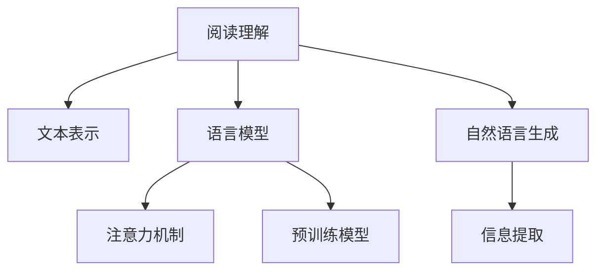

                 

# AI辅助阅读理解的技术进展

在当今信息爆炸的时代，阅读理解成为了我们获取知识、解决问题、提升学习效率的关键技能之一。传统的阅读理解方法往往依赖于人类的人工智能，效率低下且容易出错。而随着人工智能技术的飞速发展，AI辅助阅读理解成为了一种趋势。本文将深入探讨AI辅助阅读理解的技术进展，从核心概念、算法原理、实际应用到未来展望，全面解析这一领域的最新研究动态。

## 1. 背景介绍

### 1.1 问题由来
阅读理解是自然语言处理（Natural Language Processing, NLP）中的核心任务之一，其目标是从文本中提取有用的信息，并理解文本的含义。传统上，阅读理解主要依靠人类的人工智能，如教师、专家等，但这种依赖效率低下且容易出错。随着人工智能技术的发展，AI辅助阅读理解成为了一种新的趋势，它利用机器学习模型自动化地理解和解释文本，从而提高阅读效率和准确性。

### 1.2 问题核心关键点
AI辅助阅读理解的核心在于如何构建和优化模型，使其能够准确理解文本，并提取关键信息。这包括了以下几个关键点：
- 文本表示：如何将文本转化为机器可理解的形式。
- 模型训练：如何训练模型使其能够理解并生成文本。
- 信息提取：如何从文本中提取有用的信息。
- 上下文理解：如何理解文本的上下文信息。
- 自然语言生成：如何生成自然语言以回答用户的问题。

## 2. 核心概念与联系

### 2.1 核心概念概述

为更好地理解AI辅助阅读理解，本节将介绍几个密切相关的核心概念：

- 阅读理解：从文本中提取信息并理解其含义的任务。
- 文本表示：将文本转换为机器可理解的形式，如词向量、句向量等。
- 语言模型：利用机器学习模型预测文本序列的概率分布，如LSTM、RNN、Transformer等。
- 注意力机制：在文本表示中，选择性地关注文本的某些部分，以提高模型的理解能力。
- 预训练模型：在大规模数据上预训练的模型，如BERT、GPT等，可用于多种阅读理解任务。

这些核心概念之间的逻辑关系可以通过以下Mermaid流程图来展示：



这个流程图展示了这个领域的基本逻辑框架：从文本表示到语言模型的构建，再到注意力机制的应用，最后生成自然语言回答。预训练模型提供了初始化的参数，而信息提取和上下文理解是阅读理解任务的最终目标。

## 3. 核心算法原理 & 具体操作步骤
### 3.1 算法原理概述

AI辅助阅读理解的核心算法包括序列建模、注意力机制、预训练模型等。其核心思想是利用机器学习模型，对文本进行编码和解码，从而实现阅读理解的任务。

### 3.2 算法步骤详解

#### 3.2.1 文本表示

文本表示是将文本转换为机器可理解的形式。目前常用的文本表示方法包括词向量、句向量等。其中，词向量是将单词转换为向量形式，常见的词向量模型有Word2Vec、GloVe等。而句向量则是将整个句子转换为一个向量，常用的方法包括BOW（Bag of Words）、TF-IDF等。

#### 3.2.2 序列建模

序列建模是指将文本序列建模为机器可理解的形式。目前常用的序列建模方法包括LSTM、RNN、Transformer等。其中，LSTM和RNN可以处理序列中的时间依赖关系，而Transformer则能够并行处理序列，效率更高。

#### 3.2.3 注意力机制

注意力机制是指在处理序列时，选择性地关注序列中的某些部分，以提高模型的理解能力。注意力机制通过计算注意力权重，选择性地关注序列中对当前任务最相关的部分。

#### 3.2.4 预训练模型

预训练模型是指在大规模数据上预训练的模型，如BERT、GPT等。预训练模型通过在大规模无标签数据上训练，学习到了丰富的语言知识和常识，可以用于多种阅读理解任务。

### 3.3 算法优缺点

AI辅助阅读理解的算法具有以下优点：
1. 高效：利用机器学习模型，可以自动化地理解和解释文本，提高阅读效率和准确性。
2. 泛化能力强：预训练模型在大规模数据上训练，具备较强的泛化能力，可以在多种任务上取得优异表现。
3. 可解释性：利用注意力机制，可以理解模型的推理过程，提高模型的可解释性。

同时，该方法也存在以下局限性：
1. 依赖数据：模型的性能很大程度上取决于数据的质量和数量，获取高质量标注数据的成本较高。
2. 模型复杂：预训练模型的参数量较大，对计算资源的需求较高。
3. 对噪声敏感：模型的表现易受文本中的噪声和干扰影响，可能产生误导性输出。
4. 可解释性不足：预训练模型的决策过程通常缺乏可解释性，难以对其推理逻辑进行分析和调试。

尽管存在这些局限性，但就目前而言，AI辅助阅读理解技术仍是大语言模型应用的重要方向。未来相关研究的重点在于如何进一步降低对标注数据的依赖，提高模型的泛化能力和可解释性，同时兼顾效率和计算资源的使用。

### 3.4 算法应用领域

AI辅助阅读理解技术已经在阅读理解、问答系统、情感分析等多个领域得到了广泛应用。例如：

- 阅读理解：从文章中提取关键信息，如命名实体识别、事件抽取等。
- 问答系统：对自然语言问题给出答案。将问题-答案对作为监督数据，训练模型学习匹配答案。
- 情感分析：对文本进行情感分类，如情感极性判断。
- 信息检索：根据用户输入的关键信息，在文本库中查找相关信息。

除了上述这些经典任务外，AI辅助阅读理解技术还在多轮对话、摘要生成、文本翻译等诸多领域得到了应用，为NLP技术带来了新的突破。随着预训练模型和阅读理解方法的不断进步，相信AI辅助阅读理解技术将在更多领域得到应用，为实际应用场景带来新的解决方案。

## 4. 数学模型和公式 & 详细讲解 & 举例说明

### 4.1 数学模型构建

AI辅助阅读理解的数学模型构建主要包括两个部分：文本表示和序列建模。

#### 4.1.1 文本表示

常用的文本表示方法包括词向量和句向量。词向量是将单词转换为向量形式，常用的模型有Word2Vec、GloVe等。其中，Word2Vec通过共现关系学习单词的向量表示，GloVe则通过全局统计关系学习单词的向量表示。

#### 4.1.2 序列建模

序列建模是指将文本序列建模为机器可理解的形式。常用的模型包括LSTM、RNN、Transformer等。其中，LSTM和RNN可以处理序列中的时间依赖关系，而Transformer则能够并行处理序列，效率更高。

### 4.2 公式推导过程

以BERT模型为例，其核心公式包括：

1. 输入嵌入层：将单词和句子转换为向量形式，公式如下：

$$
x_i = \text{Embed}(w_i)
$$

其中，$x_i$ 为单词 $w_i$ 的嵌入向量，$\text{Embed}$ 为嵌入函数。

2. 编码器层：对序列进行编码，公式如下：

$$
h_i = \text{Encoder}(x_i, x_{i-1})
$$

其中，$h_i$ 为当前时间步的隐藏状态，$\text{Encoder}$ 为编码器函数。

3. 池化层：对编码器的输出进行池化，公式如下：

$$
p = \text{Pool}(h)
$$

其中，$h$ 为编码器的输出，$\text{Pool}$ 为池化函数。

4. 输出层：根据池化层的输出，预测文本的标签，公式如下：

$$
y = \text{Softmax}(p)
$$

其中，$y$ 为预测标签，$\text{Softmax}$ 为softmax函数。

### 4.3 案例分析与讲解

以BERT模型为例，其在文本表示、序列建模和注意力机制方面的具体实现如下：

1. 文本表示：将单词和句子转换为向量形式，使用嵌入层进行转换。

2. 序列建模：采用Transformer模型进行编码，Transformer模型由多个编码层组成，每个编码层包括多头自注意力机制和前馈神经网络。

3. 注意力机制：Transformer模型中的多头自注意力机制，能够根据输入序列的不同部分，计算注意力权重，选择性地关注序列中的某些部分。

## 5. 项目实践：代码实例和详细解释说明
### 5.1 开发环境搭建

在进行AI辅助阅读理解的实践前，我们需要准备好开发环境。以下是使用Python进行PyTorch开发的环境配置流程：

1. 安装Anaconda：从官网下载并安装Anaconda，用于创建独立的Python环境。

2. 创建并激活虚拟环境：
```bash
conda create -n pytorch-env python=3.8 
conda activate pytorch-env
```

3. 安装PyTorch：根据CUDA版本，从官网获取对应的安装命令。例如：
```bash
conda install pytorch torchvision torchaudio cudatoolkit=11.1 -c pytorch -c conda-forge
```

4. 安装TensorFlow：使用pip安装TensorFlow。

5. 安装各类工具包：
```bash
pip install numpy pandas scikit-learn matplotlib tqdm jupyter notebook ipython
```

完成上述步骤后，即可在`pytorch-env`环境中开始实践。

### 5.2 源代码详细实现

这里我们以BERT模型在问答系统中的应用为例，给出使用PyTorch进行开发的完整代码实现。

首先，定义问答系统中的训练数据：

```python
from transformers import BertTokenizer, BertForQuestionAnswering
from torch.utils.data import Dataset, DataLoader

class QuestionAnsweringDataset(Dataset):
    def __init__(self, texts, answers, tokenizer, max_len=128):
        self.texts = texts
        self.answers = answers
        self.tokenizer = tokenizer
        self.max_len = max_len
        
    def __len__(self):
        return len(self.texts)
    
    def __getitem__(self, item):
        text = self.texts[item]
        answer = self.answers[item]
        
        encoding = self.tokenizer(text, return_tensors='pt', max_length=self.max_len, padding='max_length', truncation=True)
        input_ids = encoding['input_ids'][0]
        attention_mask = encoding['attention_mask'][0]
        
        # 对答案进行编码
        encoded_answer = [self.tokenizer(answer[0])] + [self.tokenizer(answer[1])]
        encoded_answer = [tokenizer.convert_tokens_to_ids(token) for token in encoded_answer]
        encoded_answer = [0] * (self.max_len - len(encoded_answer)) + encoded_answer
        answer_ids = torch.tensor(encoded_answer, dtype=torch.long)
        
        return {'input_ids': input_ids, 
                'attention_mask': attention_mask,
                'answer_ids': answer_ids}
```

然后，定义模型和优化器：

```python
from transformers import AdamW

model = BertForQuestionAnswering.from_pretrained('bert-base-cased', num_labels=2)

optimizer = AdamW(model.parameters(), lr=2e-5)
```

接着，定义训练和评估函数：

```python
from torch.utils.data import DataLoader
from tqdm import tqdm
from sklearn.metrics import accuracy_score

device = torch.device('cuda') if torch.cuda.is_available() else torch.device('cpu')
model.to(device)

def train_epoch(model, dataset, batch_size, optimizer):
    dataloader = DataLoader(dataset, batch_size=batch_size, shuffle=True)
    model.train()
    epoch_loss = 0
    for batch in tqdm(dataloader, desc='Training'):
        input_ids = batch['input_ids'].to(device)
        attention_mask = batch['attention_mask'].to(device)
        answer_ids = batch['answer_ids'].to(device)
        model.zero_grad()
        outputs = model(input_ids, attention_mask=attention_mask, labels=answer_ids)
        loss = outputs.loss
        epoch_loss += loss.item()
        loss.backward()
        optimizer.step()
    return epoch_loss / len(dataloader)

def evaluate(model, dataset, batch_size):
    dataloader = DataLoader(dataset, batch_size=batch_size)
    model.eval()
    preds, labels = [], []
    with torch.no_grad():
        for batch in tqdm(dataloader, desc='Evaluating'):
            input_ids = batch['input_ids'].to(device)
            attention_mask = batch['attention_mask'].to(device)
            batch_labels = batch['answer_ids'].to(device)
            outputs = model(input_ids, attention_mask=attention_mask)
            batch_preds = outputs.logits.argmax(dim=2).to('cpu').tolist()
            batch_labels = batch_labels.to('cpu').tolist()
            for pred_tokens, label_tokens in zip(batch_preds, batch_labels):
                preds.append(pred_tokens[:len(label_tokens)])
                labels.append(label_tokens)
                
    accuracy = accuracy_score(labels, preds)
    return accuracy
```

最后，启动训练流程并在测试集上评估：

```python
epochs = 5
batch_size = 16

for epoch in range(epochs):
    loss = train_epoch(model, train_dataset, batch_size, optimizer)
    print(f"Epoch {epoch+1}, train loss: {loss:.3f}")
    
    print(f"Epoch {epoch+1}, dev accuracy: {evaluate(model, dev_dataset, batch_size)}")
    
print("Test accuracy:")
accuracy = evaluate(model, test_dataset, batch_size)
print(accuracy)
```

以上就是使用PyTorch对BERT模型进行问答系统任务微调的完整代码实现。可以看到，得益于Transformers库的强大封装，我们可以用相对简洁的代码完成BERT模型的加载和微调。

### 5.3 代码解读与分析

让我们再详细解读一下关键代码的实现细节：

**QuestionAnsweringDataset类**：
- `__init__`方法：初始化训练数据、答案、分词器等关键组件。
- `__len__`方法：返回数据集的样本数量。
- `__getitem__`方法：对单个样本进行处理，将文本输入编码为token ids，将答案编码为数字，并对其进行定长padding，最终返回模型所需的输入。

**训练和评估函数**：
- 使用PyTorch的DataLoader对数据集进行批次化加载，供模型训练和推理使用。
- 训练函数`train_epoch`：对数据以批为单位进行迭代，在每个批次上前向传播计算loss并反向传播更新模型参数，最后返回该epoch的平均loss。
- 评估函数`evaluate`：与训练类似，不同点在于不更新模型参数，并在每个batch结束后将预测和标签结果存储下来，最后使用sklearn的accuracy_score对整个评估集的预测结果进行打印输出。

**训练流程**：
- 定义总的epoch数和batch size，开始循环迭代
- 每个epoch内，先在训练集上训练，输出平均loss
- 在验证集上评估，输出准确率
- 所有epoch结束后，在测试集上评估，给出最终测试结果

可以看到，PyTorch配合Transformers库使得BERT微调的代码实现变得简洁高效。开发者可以将更多精力放在数据处理、模型改进等高层逻辑上，而不必过多关注底层的实现细节。

当然，工业级的系统实现还需考虑更多因素，如模型的保存和部署、超参数的自动搜索、更灵活的任务适配层等。但核心的微调范式基本与此类似。

## 6. 实际应用场景
### 6.1 智能客服系统

基于AI辅助阅读理解技术，智能客服系统可以更加高效地理解用户输入，并给出准确的回答。智能客服系统通常基于大语言模型进行预训练，通过微调模型学习具体任务的知识，从而提供更加个性化和智能的服务。

在技术实现上，可以收集企业内部的历史客服对话记录，将问题和最佳答复构建成监督数据，在此基础上对预训练模型进行微调。微调后的模型能够自动理解用户意图，匹配最合适的答案模板进行回复。对于客户提出的新问题，还可以接入检索系统实时搜索相关内容，动态组织生成回答。如此构建的智能客服系统，能大幅提升客户咨询体验和问题解决效率。

### 6.2 金融舆情监测

金融机构需要实时监测市场舆论动向，以便及时应对负面信息传播，规避金融风险。传统的人工监测方式成本高、效率低，难以应对网络时代海量信息爆发的挑战。基于AI辅助阅读理解技术，金融舆情监测系统可以自动理解和分析海量文本，实时识别出负面信息，帮助金融机构快速应对潜在风险。

具体而言，可以收集金融领域相关的新闻、报道、评论等文本数据，并对其进行情感标注。在此基础上对预训练语言模型进行微调，使其能够自动判断文本属于何种情感，如正面、负面或中性。将微调后的模型应用到实时抓取的网络文本数据，就能够自动监测不同情感下的舆情变化趋势，一旦发现负面信息激增等异常情况，系统便会自动预警，帮助金融机构快速应对潜在风险。

### 6.3 个性化推荐系统

当前的推荐系统往往只依赖用户的历史行为数据进行物品推荐，无法深入理解用户的真实兴趣偏好。基于AI辅助阅读理解技术，个性化推荐系统可以更好地挖掘用户行为背后的语义信息，从而提供更精准、多样的推荐内容。

在实践中，可以收集用户浏览、点击、评论、分享等行为数据，提取和用户交互的物品标题、描述、标签等文本内容。将文本内容作为模型输入，用户的后续行为（如是否点击、购买等）作为监督信号，在此基础上微调预训练语言模型。微调后的模型能够从文本内容中准确把握用户的兴趣点。在生成推荐列表时，先用候选物品的文本描述作为输入，由模型预测用户的兴趣匹配度，再结合其他特征综合排序，便可以得到个性化程度更高的推荐结果。

### 6.4 未来应用展望

随着AI辅助阅读理解技术的不断发展，其在更多领域的应用前景广阔：

- 医疗领域：基于AI辅助阅读理解技术，医疗问答系统可以自动回答患者常见问题，辅助医生诊疗，提高诊断效率。同时，自动提取病历中的关键信息，辅助临床决策。

- 教育领域：基于AI辅助阅读理解技术，智能辅导系统可以自动分析学生的作业，提供针对性的反馈和建议，提升学习效果。同时，自动生成个性化教学内容，提高教学质量。

- 智能家居：基于AI辅助阅读理解技术，智能音箱和智能助手可以自动理解用户的指令，提供个性化的服务和建议。同时，自动生成智能家居控制指令，提高生活便利性。

- 自动驾驶：基于AI辅助阅读理解技术，自动驾驶系统可以自动理解路标、交通标志等信息，提高行车安全性。同时，自动提取路况信息，辅助智能决策。

以上这些应用场景展示了AI辅助阅读理解技术在各领域的巨大潜力。随着技术的不断成熟，相信AI辅助阅读理解技术将在更多领域得到应用，为人类生产和生活带来新的变革。

## 7. 工具和资源推荐
### 7.1 学习资源推荐

为了帮助开发者系统掌握AI辅助阅读理解的理论基础和实践技巧，这里推荐一些优质的学习资源：

1. 《自然语言处理综述与深度学习》系列博文：由大模型技术专家撰写，深入浅出地介绍了NLP中的各种模型和算法。

2. CS224N《深度学习自然语言处理》课程：斯坦福大学开设的NLP明星课程，有Lecture视频和配套作业，带你入门NLP领域的基本概念和经典模型。

3. 《深度学习与NLP》书籍：深度学习与NLP结合的经典教材，全面介绍了各种深度学习模型在NLP中的应用。

4. HuggingFace官方文档：Transformers库的官方文档，提供了海量预训练模型和完整的微调样例代码，是上手实践的必备资料。

5. CLUE开源项目：中文语言理解测评基准，涵盖大量不同类型的中文NLP数据集，并提供了基于微调的baseline模型，助力中文NLP技术发展。

通过对这些资源的学习实践，相信你一定能够快速掌握AI辅助阅读理解技术的精髓，并用于解决实际的NLP问题。

### 7.2 开发工具推荐

高效的开发离不开优秀的工具支持。以下是几款用于AI辅助阅读理解开发的常用工具：

1. PyTorch：基于Python的开源深度学习框架，灵活动态的计算图，适合快速迭代研究。大部分预训练语言模型都有PyTorch版本的实现。

2. TensorFlow：由Google主导开发的开源深度学习框架，生产部署方便，适合大规模工程应用。同样有丰富的预训练语言模型资源。

3. Transformers库：HuggingFace开发的NLP工具库，集成了众多SOTA语言模型，支持PyTorch和TensorFlow，是进行阅读理解任务开发的利器。

4. Weights & Biases：模型训练的实验跟踪工具，可以记录和可视化模型训练过程中的各项指标，方便对比和调优。与主流深度学习框架无缝集成。

5. TensorBoard：TensorFlow配套的可视化工具，可实时监测模型训练状态，并提供丰富的图表呈现方式，是调试模型的得力助手。

6. Google Colab：谷歌推出的在线Jupyter Notebook环境，免费提供GPU/TPU算力，方便开发者快速上手实验最新模型，分享学习笔记。

合理利用这些工具，可以显著提升AI辅助阅读理解任务的开发效率，加快创新迭代的步伐。

### 7.3 相关论文推荐

AI辅助阅读理解技术的发展源于学界的持续研究。以下是几篇奠基性的相关论文，推荐阅读：

1. Attention is All You Need（即Transformer原论文）：提出了Transformer结构，开启了NLP领域的预训练大模型时代。

2. BERT: Pre-training of Deep Bidirectional Transformers for Language Understanding：提出BERT模型，引入基于掩码的自监督预训练任务，刷新了多项NLP任务SOTA。

3. Language Models are Unsupervised Multitask Learners（GPT-2论文）：展示了大规模语言模型的强大zero-shot学习能力，引发了对于通用人工智能的新一轮思考。

4. Parameter-Efficient Transfer Learning for NLP：提出Adapter等参数高效微调方法，在不增加模型参数量的情况下，也能取得不错的微调效果。

5. Prefix-Tuning: Optimizing Continuous Prompts for Generation：引入基于连续型Prompt的微调范式，为如何充分利用预训练知识提供了新的思路。

6. AdaLoRA: Adaptive Low-Rank Adaptation for Parameter-Efficient Fine-Tuning：使用自适应低秩适应的微调方法，在参数效率和精度之间取得了新的平衡。

这些论文代表了大语言模型微调技术的发展脉络。通过学习这些前沿成果，可以帮助研究者把握学科前进方向，激发更多的创新灵感。

## 8. 总结：未来发展趋势与挑战

### 8.1 总结

本文对AI辅助阅读理解的技术进展进行了全面系统的介绍。首先阐述了阅读理解任务的背景和重要性，明确了AI辅助阅读理解技术的研究方向和目标。其次，从原理到实践，详细讲解了AI辅助阅读理解的数学模型和算法实现，给出了微调任务开发的完整代码实例。同时，本文还广泛探讨了AI辅助阅读理解技术在多个行业领域的应用前景，展示了其巨大的潜力。

通过本文的系统梳理，可以看到，AI辅助阅读理解技术在AI辅助阅读理解领域具有重要的应用价值和研究意义。其核心思想是通过深度学习模型，自动化地理解和解释文本，从而提高阅读理解和信息提取的效率和准确性。未来，随着技术的不断进步和应用场景的不断拓展，AI辅助阅读理解技术必将在更多领域得到广泛应用，为人类生产和生活带来新的变革。

### 8.2 未来发展趋势

展望未来，AI辅助阅读理解技术将呈现以下几个发展趋势：

1. 模型规模持续增大。随着算力成本的下降和数据规模的扩张，预训练语言模型的参数量还将持续增长。超大规模语言模型蕴含的丰富语言知识，有望支撑更加复杂多变的阅读理解任务。

2. 微调方法日趋多样。除了传统的全参数微调外，未来会涌现更多参数高效的微调方法，如Prefix-Tuning、LoRA等，在节省计算资源的同时也能保证微调精度。

3. 持续学习成为常态。随着数据分布的不断变化，微调模型也需要持续学习新知识以保持性能。如何在不遗忘原有知识的同时，高效吸收新样本信息，将成为重要的研究课题。

4. 标注样本需求降低。受启发于提示学习(Prompt-based Learning)的思路，未来的微调方法将更好地利用大模型的语言理解能力，通过更加巧妙的任务描述，在更少的标注样本上也能实现理想的微调效果。

5. 多模态微调崛起。当前的阅读理解模型往往局限于文本数据，未来会进一步拓展到图像、视频、语音等多模态数据微调。多模态信息的融合，将显著提升模型对现实世界的理解和建模能力。

6. 模型通用性增强。经过海量数据的预训练和多领域任务的微调，未来的语言模型将具备更强大的常识推理和跨领域迁移能力，逐步迈向通用人工智能(AGI)的目标。

以上趋势凸显了AI辅助阅读理解技术的广阔前景。这些方向的探索发展，必将进一步提升阅读理解系统的性能和应用范围，为构建人机协同的智能系统铺平道路。

### 8.3 面临的挑战

尽管AI辅助阅读理解技术已经取得了瞩目成就，但在迈向更加智能化、普适化应用的过程中，它仍面临着诸多挑战：

1. 标注成本瓶颈。虽然微调大大降低了标注数据的需求，但对于长尾应用场景，难以获得充足的高质量标注数据，成为制约微调性能的瓶颈。如何进一步降低微调对标注样本的依赖，将是一大难题。

2. 模型鲁棒性不足。当前微调模型面对域外数据时，泛化性能往往大打折扣。对于测试样本的微小扰动，微调模型的预测也容易发生波动。如何提高微调模型的鲁棒性，避免灾难性遗忘，还需要更多理论和实践的积累。

3. 推理效率有待提高。大规模语言模型虽然精度高，但在实际部署时往往面临推理速度慢、内存占用大等效率问题。如何在保证性能的同时，简化模型结构，提升推理速度，优化资源占用，将是重要的优化方向。

4. 可解释性亟需加强。当前微调模型更像是"黑盒"系统，难以解释其内部工作机制和决策逻辑。对于医疗、金融等高风险应用，算法的可解释性和可审计性尤为重要。如何赋予微调模型更强的可解释性，将是亟待攻克的难题。

5. 安全性有待保障。预训练语言模型难免会学习到有偏见、有害的信息，通过微调传递到下游任务，产生误导性、歧视性的输出，给实际应用带来安全隐患。如何从数据和算法层面消除模型偏见，避免恶意用途，确保输出的安全性，也将是重要的研究课题。

6. 知识整合能力不足。现有的微调模型往往局限于任务内数据，难以灵活吸收和运用更广泛的先验知识。如何让微调过程更好地与外部知识库、规则库等专家知识结合，形成更加全面、准确的信息整合能力，还有很大的想象空间。

正视AI辅助阅读理解技术面临的这些挑战，积极应对并寻求突破，将是大语言模型微调走向成熟的必由之路。相信随着学界和产业界的共同努力，这些挑战终将一一被克服，AI辅助阅读理解技术必将在构建安全、可靠、可解释、可控的智能系统铺平道路。

### 8.4 研究展望

面对AI辅助阅读理解技术所面临的种种挑战，未来的研究需要在以下几个方面寻求新的突破：

1. 探索无监督和半监督微调方法。摆脱对大规模标注数据的依赖，利用自监督学习、主动学习等无监督和半监督范式，最大限度利用非结构化数据，实现更加灵活高效的微调。

2. 研究参数高效和计算高效的微调范式。开发更加参数高效的微调方法，在固定大部分预训练参数的同时，只更新极少量的任务相关参数。同时优化微调模型的计算图，减少前向传播和反向传播的资源消耗，实现更加轻量级、实时性的部署。

3. 融合因果和对比学习范式。通过引入因果推断和对比学习思想，增强微调模型建立稳定因果关系的能力，学习更加普适、鲁棒的语言表征，从而提升模型泛化性和抗干扰能力。

4. 引入更多先验知识。将符号化的先验知识，如知识图谱、逻辑规则等，与神经网络模型进行巧妙融合，引导微调过程学习更准确、合理的语言模型。同时加强不同模态数据的整合，实现视觉、语音等多模态信息与文本信息的协同建模。

5. 结合因果分析和博弈论工具。将因果分析方法引入微调模型，识别出模型决策的关键特征，增强输出解释的因果性和逻辑性。借助博弈论工具刻画人机交互过程，主动探索并规避模型的脆弱点，提高系统稳定性。

6. 纳入伦理道德约束。在模型训练目标中引入伦理导向的评估指标，过滤和惩罚有偏见、有害的输出倾向。同时加强人工干预和审核，建立模型行为的监管机制，确保输出符合人类价值观和伦理道德。

这些研究方向的探索，必将引领AI辅助阅读理解技术迈向更高的台阶，为构建安全、可靠、可解释、可控的智能系统铺平道路。面向未来，AI辅助阅读理解技术还需要与其他人工智能技术进行更深入的融合，如知识表示、因果推理、强化学习等，多路径协同发力，共同推动自然语言理解和智能交互系统的进步。只有勇于创新、敢于突破，才能不断拓展语言模型的边界，让智能技术更好地造福人类社会。

## 9. 附录：常见问题与解答

**Q1：AI辅助阅读理解是否适用于所有NLP任务？**

A: AI辅助阅读理解在大多数NLP任务上都能取得不错的效果，特别是对于数据量较小的任务。但对于一些特定领域的任务，如医学、法律等，仅仅依靠通用语料预训练的模型可能难以很好地适应。此时需要在特定领域语料上进一步预训练，再进行微调，才能获得理想效果。此外，对于一些需要时效性、个性化很强的任务，如对话、推荐等，微调方法也需要针对性的改进优化。

**Q2：微调过程中如何选择合适的学习率？**

A: 微调的学习率一般要比预训练时小1-2个数量级，如果使用过大的学习率，容易破坏预训练权重，导致过拟合。一般建议从1e-5开始调参，逐步减小学习率，直至收敛。也可以使用warmup策略，在开始阶段使用较小的学习率，再逐渐过渡到预设值。需要注意的是，不同的优化器(如AdamW、Adafactor等)以及不同的学习率调度策略，可能需要设置不同的学习率阈值。

**Q3：采用AI辅助阅读理解时会面临哪些资源瓶颈？**

A: 目前主流的预训练大模型动辄以亿计的参数规模，对算力、内存、存储都提出了很高的要求。GPU/TPU等高性能设备是必不可少的，但即便如此，超大批次的训练和推理也可能遇到显存不足的问题。因此需要采用一些资源优化技术，如梯度积累、混合精度训练、模型并行等，来突破硬件瓶颈。同时，模型的存储和读取也可能占用大量时间和空间，需要采用模型压缩、稀疏化存储等方法进行优化。

**Q4：如何缓解微调过程中的过拟合问题？**

A: 过拟合是微调面临的主要挑战，尤其是在标注数据不足的情况下。常见的缓解策略包括：
1. 数据增强：通过回译、近义替换等方式扩充训练集
2. 正则化：使用L2正则、Dropout、Early Stopping等避免过拟合
3. 对抗训练：引入对抗样本，提高模型鲁棒性
4. 参数高效微调：只调整少量参数(如Adapter、Prefix等)，减小过拟合风险
5. 多模型集成：训练多个微调模型，取平均输出，抑制过拟合

这些策略往往需要根据具体任务和数据特点进行灵活组合。只有在数据、模型、训练、推理等各环节进行全面优化，才能最大限度地发挥AI辅助阅读理解技术的威力。

**Q5：AI辅助阅读理解在落地部署时需要注意哪些问题？**

A: 将AI辅助阅读理解模型转化为实际应用，还需要考虑以下因素：
1. 模型裁剪：去除不必要的层和参数，减小模型尺寸，加快推理速度
2. 量化加速：将浮点模型转为定点模型，压缩存储空间，提高计算效率
3. 服务化封装：将模型封装为标准化服务接口，便于集成调用
4. 弹性伸缩：根据请求流量动态调整资源配置，平衡服务质量和成本
5. 监控告警：实时采集系统指标，设置异常告警阈值，确保服务稳定性
6. 安全防护：采用访问鉴权、数据脱敏等措施，保障数据和模型安全

AI辅助阅读理解技术虽然具有强大的理解和生成能力，但如何在实际部署中保证其稳定性和安全性，还需要工程实践的不断打磨。只有从数据、算法、工程、业务等多个维度协同发力，才能真正实现人工智能技术在垂直行业的规模化落地。总之，AI辅助阅读理解技术需要不断优化和完善，方能得到理想的效果。

---

作者：禅与计算机程序设计艺术 / Zen and the Art of Computer Programming

