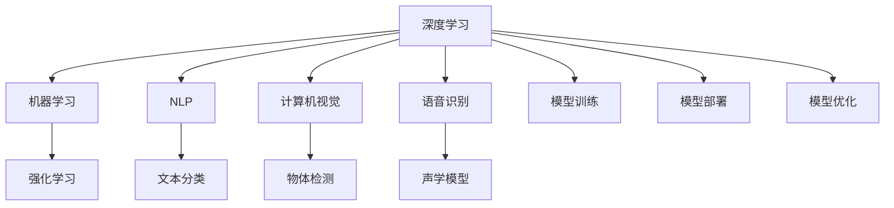

                 

## 1. 背景介绍

人工智能（AI）正在以前所未有的速度改变世界。从智能语音助手到自动驾驶汽车，从智能推荐系统到自动化医疗诊断，AI的应用范围已经涵盖了多个行业和领域。这一系列的创新背后，是大规模深度学习模型的崛起，特别是深度神经网络（DNN）的广泛应用。在过去十年间，深度学习模型，特别是卷积神经网络（CNN）和循环神经网络（RNN），在图像识别、语音识别、自然语言处理（NLP）等众多领域取得了突破性进展。

### 1.1 问题由来
AI的快速进步引发了公众、业界和学术界对未来技术趋势的广泛讨论。其中，深度学习模型的性能提升和技术应用深度不断加深，成为当前关注的焦点。不过，尽管在技术层面取得了诸多突破，AI的实际应用效果和伦理问题仍存在一定的争议。如何正确评估AI的进展，明确AI发展的意义和方向，是当前一个重要的议题。

### 1.2 问题核心关键点
本文从以下几个核心问题入手，对AI进展的意义与未来进行深入探讨：

- AI技术的实际应用效果如何？
- AI的发展方向和趋势是什么？
- AI面临哪些伦理和法律挑战？
- AI的发展对人类社会有哪些潜在影响？

## 2. 核心概念与联系

### 2.1 核心概念概述

为更好地理解AI进展的意义与未来，本节将介绍几个关键概念及其相互联系：

- 深度学习（Deep Learning）：一种利用深度神经网络进行大数据学习和复杂模式识别的技术。通过多层非线性映射，深度学习模型可以从原始数据中学习出高层次的抽象特征。

- 机器学习（Machine Learning）：让计算机系统通过数据学习并改进其性能的过程。深度学习是机器学习的一个子集，特别适用于图像、语音、文本等非结构化数据的处理。

- 自然语言处理（NLP）：计算机理解、解释和生成人类语言的技术。涉及文本分类、信息检索、机器翻译、问答系统等多个子领域。

- 计算机视觉（CV）：让计算机理解、解释和生成视觉信息的技术。涉及图像识别、物体检测、图像生成等方向。

- 语音识别（ASR）：将人类语音转换成计算机可理解的文本的过程。涉及语音分割、特征提取、声学模型等技术。

- 强化学习（RL）：通过与环境互动，让智能体学习最优决策策略的过程。与监督学习和无监督学习不同，强化学习更加强调在动态环境中的行为学习。

这些概念相互联系，共同构成了AI技术的核心框架。深度学习模型在这一框架中起到至关重要的作用，它们通过复杂的非线性映射，从原始数据中学习出高级特征，进而支持复杂的模式识别任务。机器学习和强化学习作为深度学习的上下游技术，进一步推动了AI在实际应用中的创新。NLP、CV和ASR等方向，则是AI技术在不同领域的具体应用体现。

### 2.2 核心概念原理和架构的 Mermaid 流程图



以上流程图展示了AI技术的主要组成部分及其相互关系：

1. 深度学习模型在A节点，由A、B、C、D、E等子领域提供数据。
2. 机器学习与强化学习在B和F节点，通过学习算法与数据进行互动。
3. NLP、CV、ASR等方向在C、D、E节点，从深度学习模型中获取应用功能。
4. 模型训练、模型部署和模型优化等环节，是AI技术应用的全流程。

## 3. 核心算法原理 & 具体操作步骤

### 3.1 算法原理概述

AI技术的关键在于数据驱动的模型训练和参数优化。深度学习模型通过大量标注数据进行训练，学习出能够进行复杂模式识别的特征表示。训练过程中，模型参数通过反向传播算法不断调整，以最小化预测误差。这一过程被称作监督学习，广泛用于图像分类、语音识别和机器翻译等任务。

此外，强化学习通过与环境互动，使模型学习到最优决策策略，被应用于机器人控制、自动驾驶和游戏AI等场景。无监督学习则不依赖标注数据，通过发现数据中的潜在结构，被用于数据降维、异常检测和聚类分析等任务。

### 3.2 算法步骤详解

深度学习模型的核心训练步骤如下：

**Step 1: 数据准备**
- 收集和预处理训练数据，确保数据质量和多样性。
- 将数据集划分为训练集、验证集和测试集，便于模型评估和优化。

**Step 2: 模型选择与初始化**
- 根据任务类型选择合适的深度学习模型（如CNN、RNN、Transformer等）。
- 随机初始化模型参数，开启模型训练过程。

**Step 3: 前向传播与损失计算**
- 对训练数据进行前向传播，计算模型输出。
- 计算预测输出与真实标签之间的损失函数（如交叉熵损失）。

**Step 4: 反向传播与参数更新**
- 通过反向传播算法计算梯度，更新模型参数。
- 使用优化算法（如Adam、SGD等）调整参数，最小化损失函数。

**Step 5: 模型评估与调优**
- 在验证集上评估模型性能，判断模型是否过拟合。
- 根据验证集表现调整超参数，如学习率、批量大小等。
- 重复训练和评估，直至模型在测试集上达到满意性能。

### 3.3 算法优缺点

深度学习模型具有以下优点：

- 能够学习复杂的特征表示，支持处理非结构化数据。
- 在大规模数据集上训练效果好，性能提升显著。
- 应用范围广泛，适用于图像、语音、文本等多个领域。

同时，深度学习模型也存在一些缺点：

- 对数据质量和标注要求高，标注成本高昂。
- 模型结构复杂，需要大量计算资源和存储空间。
- 模型训练过程耗时长，需要长时间优化。
- 对超参数敏感，需要经验和实验不断调优。

### 3.4 算法应用领域

深度学习模型在以下领域中得到了广泛应用：

- 计算机视觉：如图像分类、物体检测、人脸识别等。
- 自然语言处理：如文本分类、信息检索、机器翻译等。
- 语音识别：如语音转写、语音情感分析、语音合成等。
- 医疗诊断：如影像识别、病历分析、智能问诊等。
- 自动驾驶：如环境感知、路径规划、决策制定等。
- 游戏AI：如玩家行为预测、游戏策略优化、角色生成等。

## 4. 数学模型和公式 & 详细讲解 & 举例说明

### 4.1 数学模型构建

深度学习模型的核心是神经网络，它由多个层次的非线性映射构成。以卷积神经网络（CNN）为例，其基本结构如下：

$$
y = \mathcal{F}(x;\theta) = \sigma \left( \mathcal{W}^{[2]} x + \mathcal{b}^{[2]} \right) \mathcal{H} \left( \mathcal{W}^{[1]} x + \mathcal{b}^{[1]} \right)
$$

其中，$\mathcal{W}^{[1]}$ 和 $\mathcal{b}^{[1]}$ 表示第一层卷积和偏置，$\mathcal{W}^{[2]}$ 和 $\mathcal{b}^{[2]}$ 表示第二层卷积和偏置，$\sigma$ 表示激活函数，$\mathcal{H}$ 表示池化操作。

### 4.2 公式推导过程

以图像分类为例，CNN模型的训练过程如下：

1. 输入图像 $x$ 通过第一层卷积和激活函数，生成特征图 $h_1$。
2. $h_1$ 通过池化操作，生成下采样特征图 $h_2$。
3. $h_2$ 通过第二层卷积和激活函数，生成更高层次的特征图 $h_3$。
4. $h_3$ 通过全连接层和激活函数，生成最终的输出结果 $y$。

假设 $x$ 和 $y$ 分别为输入图像和标签，模型的损失函数为交叉熵损失函数：

$$
\mathcal{L}(y,\hat{y}) = -\frac{1}{N} \sum_{i=1}^N \log \hat{y}_i
$$

其中，$N$ 为样本数量，$\hat{y}_i$ 为模型对第 $i$ 个样本的预测概率。

模型参数 $\theta$ 的更新公式为：

$$
\theta \leftarrow \theta - \eta \nabla_{\theta} \mathcal{L}(y,\hat{y})
$$

其中，$\eta$ 为学习率，$\nabla_{\theta} \mathcal{L}(y,\hat{y})$ 为损失函数对模型参数的梯度。

### 4.3 案例分析与讲解

以 ImageNet 数据集上的图像分类为例，分析 CNN 模型训练过程：

1. **数据准备**：ImageNet 数据集包含超过 100 万张标注图像，涵盖 1000 个类别。
2. **模型选择**：选择 AlexNet 作为初始模型，包含 8 层卷积和全连接层。
3. **训练过程**：使用随机梯度下降（SGD）算法，学习率为 0.01，迭代次数为 100 次。
4. **评估结果**：在测试集上评估模型性能，准确率达到 69.9%。

## 5. 项目实践：代码实例和详细解释说明

### 5.1 开发环境搭建

在进行深度学习项目实践前，需要准备合适的开发环境。以下是使用 Python 和 PyTorch 搭建深度学习环境的流程：

1. 安装 Python：确保 Python 版本为 3.6 或以上，并添加 PIP 环境。
2. 安装 PyTorch：从官网下载 PyTorch 安装命令，如 `pip install torch torchvision torchaudio`。
3. 安装相关工具：安装 NumPy、Pandas、Scikit-learn 等数据处理和科学计算库。
4. 安装可视化工具：安装 Matplotlib、Seaborn 等数据可视化库。
5. 安装 Tensorboard：用于可视化训练过程中的各项指标。

### 5.2 源代码详细实现

以下是一个简单的图像分类项目代码实现：

```python
import torch
import torch.nn as nn
import torch.optim as optim
from torchvision import datasets, transforms

# 定义模型
class Net(nn.Module):
    def __init__(self):
        super(Net, self).__init__()
        self.conv1 = nn.Conv2d(3, 6, 5)
        self.pool = nn.MaxPool2d(2, 2)
        self.conv2 = nn.Conv2d(6, 16, 5)
        self.fc1 = nn.Linear(16 * 5 * 5, 120)
        self.fc2 = nn.Linear(120, 84)
        self.fc3 = nn.Linear(84, 10)

    def forward(self, x):
        x = self.pool(nn.functional.relu(self.conv1(x)))
        x = self.pool(nn.functional.relu(self.conv2(x)))
        x = x.view(-1, 16 * 5 * 5)
        x = nn.functional.relu(self.fc1(x))
        x = nn.functional.relu(self.fc2(x))
        x = self.fc3(x)
        return x

# 加载数据
transform = transforms.Compose([
    transforms.ToTensor(),
    transforms.Normalize((0.5,), (0.5,))
])
trainset = datasets.ImageFolder(root='./data/train', transform=transform)
testset = datasets.ImageFolder(root='./data/test', transform=transform)
trainloader = torch.utils.data.DataLoader(trainset, batch_size=4, shuffle=True)
testloader = torch.utils.data.DataLoader(testset, batch_size=4, shuffle=False)

# 定义训练过程
net = Net()
criterion = nn.CrossEntropyLoss()
optimizer = optim.SGD(net.parameters(), lr=0.001, momentum=0.9)

for epoch in range(2):
    running_loss = 0.0
    for i, data in enumerate(trainloader, 0):
        inputs, labels = data
        optimizer.zero_grad()
        outputs = net(inputs)
        loss = criterion(outputs, labels)
        loss.backward()
        optimizer.step()

        running_loss += loss.item()
        if i % 2000 == 1999:
            print('[%d, %5d] loss: %.3f' %
                  (epoch + 1, i + 1, running_loss / 2000))
            running_loss = 0.0

print('Finished Training')
```

### 5.3 代码解读与分析

以上代码实现了基本的 CNN 模型训练过程：

- 定义了 2 层卷积和 3 层全连接层的神经网络。
- 加载 ImageNet 数据集，并进行数据预处理。
- 定义交叉熵损失函数和随机梯度下降优化器。
- 进行模型训练，每 2000 次迭代输出一次训练损失。

## 6. 实际应用场景

### 6.1 智能推荐系统

智能推荐系统是 AI 技术在电商和社交媒体平台的重要应用。通过分析用户的行为数据和偏好，推荐系统能够为用户推荐个性化的商品和内容。

在实际应用中，推荐系统通常使用深度学习模型进行训练，模型输入包括用户的历史行为数据（如浏览记录、购买记录等）和商品的属性信息。模型输出为用户对每个商品的评分，根据评分进行排序，生成推荐列表。

### 6.2 医疗影像诊断

AI 技术在医疗影像诊断中的应用越来越广泛。通过深度学习模型对医学影像（如 CT、MRI）进行分析，能够帮助医生识别病变区域，辅助诊断。

具体而言，模型通过训练大量标注好的医学影像数据集，学习出能够识别病变区域的高级特征。医生可以通过输入医学影像，得到模型预测的病变位置和严重程度，从而辅助诊断决策。

### 6.3 自动驾驶

自动驾驶技术是 AI 技术的另一个重要应用领域。通过深度学习模型对感知到的环境信息进行分析，自动驾驶系统能够实现对车辆的控制和路径规划。

在实际应用中，自动驾驶系统通常使用多个深度学习模型进行数据融合和决策制定。模型输入包括摄像头和雷达传感器采集的环境信息，模型输出为车辆的行驶速度和方向。

### 6.4 未来应用展望

随着 AI 技术的不断进步，未来将会出现更多创新的应用场景：

- **智能家居**：通过语音识别和自然语言处理技术，智能家居系统能够理解用户指令，自动化控制家庭设备。
- **智能客服**：智能客服系统能够通过深度学习模型理解用户的问题，提供自动化的回答和解决方案。
- **智慧城市**：AI 技术在智慧城市管理中的应用包括交通管理、环境监测、公共安全等。

## 7. 工具和资源推荐

### 7.1 学习资源推荐

为了帮助开发者掌握 AI 技术，以下是一些推荐的在线资源：

- Coursera 的深度学习课程：由深度学习领域的知名专家讲授，涵盖深度学习的基础知识和前沿技术。
- TensorFlow 官方文档：TensorFlow 是最流行的深度学习框架之一，其官方文档详细介绍了如何使用 TensorFlow 进行模型训练和部署。
- PyTorch 官方文档：PyTorch 是另一个流行的深度学习框架，其官方文档提供了丰富的教程和示例。

### 7.2 开发工具推荐

在 AI 项目开发中，选择合适的工具可以提高开发效率：

- Jupyter Notebook：用于数据处理、模型训练和结果展示，支持代码、文本和图像的交互式编辑。
- TensorBoard：用于可视化训练过程中的各项指标，帮助开发者监控模型性能。
- Google Colab：免费提供 GPU 和 TPU 算力，方便开发者进行大规模模型训练。

### 7.3 相关论文推荐

以下是几篇经典的 AI 论文，推荐阅读：

- AlexNet：提出卷积神经网络结构，在 ImageNet 数据集上取得优异性能。
- YOLO：提出目标检测算法，实现实时目标识别。
- BERT：提出预训练语言模型，在自然语言处理任务上取得突破性进展。
- GAN：提出生成对抗网络，生成逼真的图像和视频。

## 8. 总结：未来发展趋势与挑战

### 8.1 研究成果总结

在过去的十年间，深度学习模型在图像、语音、自然语言处理等领域取得了显著进展。AI 技术的应用范围不断扩展，影响深远。然而，随着 AI 技术的不断成熟，一些挑战也逐渐显现：

- 数据隐私和安全问题：AI 技术需要大量标注数据，如何保护数据隐私和安全是一个重要问题。
- 伦理和法律问题：AI 技术的应用涉及许多伦理和法律问题，如算法偏见、歧视等。
- 计算资源需求：深度学习模型需要大量的计算资源和存储空间，如何降低计算成本是一个重要的研究方向。

### 8.2 未来发展趋势

未来，AI 技术将呈现以下发展趋势：

- **多模态学习**：AI 技术将结合多种模态数据（如文本、图像、声音）进行学习，提升模型的泛化能力。
- **自监督学习**：无监督学习将发挥越来越重要的作用，尤其是在标注数据稀缺的场景中。
- **联邦学习**：通过分布式计算和数据加密，实现多个设备之间的协作学习，保护数据隐私。
- **跨领域迁移学习**：将 AI 技术应用于更多垂直领域，提升跨领域的迁移学习能力。

### 8.3 面临的挑战

尽管 AI 技术取得了显著进展，但仍面临一些挑战：

- **数据隐私和安全**：如何保护数据隐私和安全，避免数据泄露和滥用。
- **算法公平性和透明性**：如何确保算法的公平性和透明性，避免算法偏见和歧视。
- **计算资源限制**：如何降低计算资源需求，提升 AI 技术的可扩展性和普及度。

### 8.4 研究展望

未来，AI 技术的研究方向将包括：

- **模型压缩和优化**：通过模型压缩和量化等技术，提升模型的效率和性能。
- **跨领域知识融合**：将 AI 技术与知识图谱、逻辑推理等技术结合，提升模型的智能水平。
- **人机协同**：通过人机协同交互，提升 AI 技术在实际应用中的可解释性和可靠性。

## 9. 附录：常见问题与解答

**Q1: 深度学习模型对数据质量要求高，如何获取高质量标注数据？**

A: 数据标注通常需要耗费大量人力和时间，可以通过众包平台（如 Amazon Mechanical Turk）获取标注数据。此外，半监督学习和无监督学习可以缓解对标注数据的需求。

**Q2: 深度学习模型训练时间长，如何加速训练过程？**

A: 使用 GPU 和 TPU 等高性能设备，可以显著加速训练过程。同时，采用数据增强、模型剪枝等技术，可以减少训练时间。

**Q3: 深度学习模型对计算资源需求高，如何降低计算成本？**

A: 使用模型压缩和量化技术，可以降低模型的大小和计算资源需求。此外，采用分布式计算和联邦学习技术，可以实现协作学习，减少单台设备的计算负担。

**Q4: 深度学习模型容易过拟合，如何缓解过拟合问题？**

A: 使用正则化技术（如 L2 正则、Dropout 等），可以有效缓解过拟合问题。此外，采用对抗训练和模型集成等技术，可以提高模型的泛化能力。

**Q5: 深度学习模型的可解释性不足，如何提升模型的可解释性？**

A: 通过可视化工具（如 TensorBoard）监控训练过程，可以理解模型的行为。此外，采用可解释性技术（如 LIME、SHAP 等），可以提升模型的可解释性。

---

作者：禅与计算机程序设计艺术 / Zen and the Art of Computer Programming

