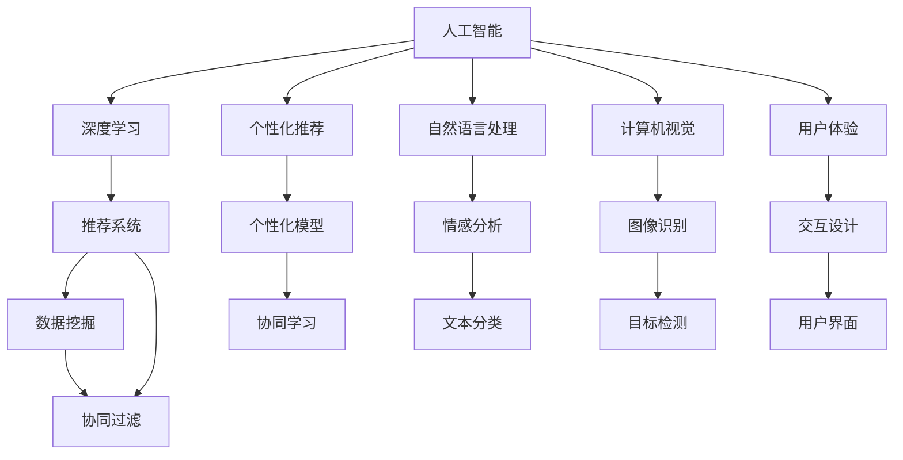

                 

# AI重塑电商购物体验：更便捷、更愉悦

## 1. 背景介绍

### 1.1 问题由来

随着互联网和移动互联网的飞速发展，电商行业已经成为全球最重要的经济活动之一。传统的电商模式，从浏览、选择、下单到配送，每一步都需要用户进行繁琐的操作。如何提升用户的购物体验，增加用户黏性，吸引更多的用户，成为电商企业面临的重大挑战。

同时，随着消费者需求的不断升级，从个性化推荐到情感陪伴，再到智能客服，电商平台在提升用户体验的道路上不断探索，寻求新的突破点。AI技术，尤其是深度学习和大数据技术，在这一过程中扮演着关键角色。通过智能化推荐、自然语言处理、计算机视觉等技术，电商企业能够更精准地把握用户需求，提供更加个性化、智能化的服务，从而提升用户的购物体验。

### 1.2 问题核心关键点

1. **个性化推荐**：通过用户历史行为数据，结合深度学习模型，为用户提供个性化的商品推荐。
2. **自然语言处理**：利用NLP技术，提升智能客服、聊天机器人等应用的用户体验。
3. **计算机视觉**：通过图像识别、人脸识别等技术，提升用户在购物过程中的识别和验证速度。
4. **数据分析与挖掘**：通过大数据分析，发现用户行为和需求，提供更为精准的服务。
5. **用户体验优化**：利用交互设计，提升用户界面的友好性和操作便利性。

这些问题关键点的解决，将大幅提升用户的购物体验，使电商购物变得更加便捷和愉悦。

## 2. 核心概念与联系

### 2.1 核心概念概述

为了更好地理解AI如何重塑电商购物体验，本节将介绍几个密切相关的核心概念：

- **人工智能(AI)**：通过模拟人类智能过程，实现信息的自动获取、处理和利用，包括机器学习、自然语言处理、计算机视觉等技术。
- **深度学习(Deep Learning)**：一种基于神经网络的机器学习方法，通过多层次的特征提取和抽象，实现对复杂数据的高效处理和分析。
- **个性化推荐**：通过用户历史行为和偏好，为每个用户提供定制化的商品推荐。
- **自然语言处理(NLP)**：利用计算机处理和理解人类语言，包括语音识别、情感分析、聊天机器人等应用。
- **计算机视觉(Computer Vision)**：使计算机能够“看”和“理解”图像和视频内容，包括图像识别、人脸识别等。
- **用户体验(UX)**：通过设计用户界面和交互方式，提升用户的满意度和使用体验。

这些核心概念之间的逻辑关系可以通过以下Mermaid流程图来展示：



这个流程图展示了人工智能的核心概念及其之间的联系：

1. 人工智能通过深度学习、个性化推荐、自然语言处理、计算机视觉和用户体验等技术，实现了从数据分析到智能服务的全流程智能化。
2. 推荐系统、情感分析、图像识别等技术是人工智能在不同领域的典型应用。
3. 数据挖掘、协同学习、协同过滤等技术是实现个性化推荐和智能服务的关键手段。

## 3. 核心算法原理 & 具体操作步骤
### 3.1 算法原理概述

AI重塑电商购物体验，主要是通过以下几个关键算法原理实现的：

- **深度学习推荐系统**：基于用户行为数据，利用深度神经网络模型进行个性化推荐。
- **自然语言处理**：通过文本分类、情感分析等技术，实现智能客服和聊天机器人的自然语言理解与响应。
- **计算机视觉**：利用图像识别、人脸识别等技术，提升用户的操作便利性和安全性。
- **数据分析与挖掘**：通过数据挖掘和统计分析，发现用户行为模式和需求趋势，为推荐和客服等应用提供数据支持。
- **用户体验优化**：通过交互设计和用户测试，提升用户界面的易用性和友好性。

### 3.2 算法步骤详解

#### 3.2.1 深度学习推荐系统

1. **数据准备**：收集用户的历史行为数据，包括浏览、点击、购买记录等，形成用户行为序列。
2. **模型构建**：选择适合的深度神经网络模型，如RNN、CNN、BERT等，设计输入层、隐藏层和输出层。
3. **模型训练**：利用用户行为数据，通过反向传播算法优化模型参数，使模型能够准确预测用户的兴趣。
4. **推荐生成**：将新商品加入数据集，利用训练好的模型生成推荐列表。
5. **结果评估**：通过交叉验证等方法，评估推荐效果，不断调整模型参数。

#### 3.2.2 自然语言处理

1. **意图识别**：通过文本分类模型，识别用户输入的自然语言意图，如查询、投诉、建议等。
2. **情感分析**：利用情感分析模型，判断用户情绪，提供相应的情感响应。
3. **聊天机器人**：设计合适的对话管理策略，实现与用户的自然交互。
4. **结果反馈**：根据用户反馈，不断优化模型和对话策略。

#### 3.2.3 计算机视觉

1. **图像识别**：利用卷积神经网络模型，对商品图片进行特征提取和分类。
2. **人脸识别**：利用人脸识别模型，对用户进行身份验证和个性化推荐。
3. **行为分析**：通过动作识别模型，分析用户的购物行为，优化推荐系统。
4. **结果展示**：将识别结果嵌入商品详情页，提升用户体验。

#### 3.2.4 数据分析与挖掘

1. **数据采集**：从电商网站收集用户行为数据，包括点击、浏览、购买记录等。
2. **数据预处理**：清洗、归一化数据，去除噪音和异常值。
3. **特征工程**：设计合适的特征，提升模型的预测能力。
4. **模型训练**：利用机器学习算法，如随机森林、XGBoost等，训练用户行为模型。
5. **预测分析**：基于用户行为模型，进行用户行为预测和需求分析。

#### 3.2.5 用户体验优化

1. **用户研究**：通过用户调研、A/B测试等方法，收集用户反馈。
2. **界面设计**：根据用户反馈，优化界面布局和交互方式。
3. **UI/UX设计**：采用交互设计原则，提升用户界面的易用性和友好性。
4. **测试与迭代**：通过用户测试，不断优化和改进用户界面。

### 3.3 算法优缺点

AI重塑电商购物体验的方法具有以下优点：

1. **个性化程度高**：通过深度学习和数据挖掘，能够提供高度个性化的推荐和客服服务，提升用户体验。
2. **实时响应快**：利用自然语言处理和计算机视觉技术，能够实现实时响应，提高用户满意度。
3. **可扩展性强**：通过模块化设计，不同算法和技术可以灵活组合，适应不同的应用场景。
4. **易于优化调整**：数据驱动的算法和模型，可以通过持续优化和迭代，不断提升系统性能。

同时，该方法也存在一些缺点：

1. **数据依赖性强**：模型的效果依赖于高质量的数据，数据采集和清洗需要大量时间和人力成本。
2. **计算资源需求高**：深度学习和计算机视觉等算法，需要大量的计算资源，硬件成本较高。
3. **隐私风险**：用户数据的收集和使用需要遵循严格的隐私保护法规，避免数据泄露和滥用。
4. **算法复杂度高**：深度学习模型和计算机视觉算法，需要专业知识进行设计和调试，难度较大。
5. **用户体验差异大**：不同用户对界面和交互方式的需求不同，设计出的界面需要适配不同的用户群体。

尽管存在这些缺点，但AI技术在电商购物体验重塑中的作用已经毋庸置疑，未来还将有更多的应用场景和技术手段加入进来，推动电商行业进入新的发展阶段。

### 3.4 算法应用领域

AI重塑电商购物体验的方法，已经在以下多个领域得到了广泛应用：

1. **个性化推荐**：在商品推荐、内容推荐、广告推荐等场景中，提升用户购物体验。
2. **智能客服**：在客服咨询、投诉处理、客户支持等场景中，提高服务效率和用户满意度。
3. **图像识别**：在商品识别、库存管理、防伪检测等场景中，提升操作便利性和安全性。
4. **数据分析与挖掘**：在用户行为分析、市场趋势预测、用户画像生成等场景中，提供数据支持。
5. **用户体验优化**：在移动端、PC端、网页端等不同平台，提升用户界面的友好性和易用性。

这些应用领域涵盖了电商购物体验的各个环节，通过AI技术的应用，电商行业能够实现从数据获取到智能服务的全流程智能化。

## 4. 数学模型和公式 & 详细讲解  
### 4.1 数学模型构建

本节将使用数学语言对AI重塑电商购物体验的过程进行更加严格的刻画。

设电商平台的商品数量为 $n$，每个商品对应的特征向量为 $\mathbf{x}_i \in \mathbb{R}^d$，用户行为数据为 $\mathbf{y}_i \in \{0,1\}^n$，其中 $1$ 表示用户对商品 $i$ 有购买意向，$0$ 表示无购买意向。模型的目标是通过最大化用户的点击率或购买率，推荐用户感兴趣的商品。

定义用户行为数据与特征向量之间的关联函数 $f(\mathbf{x}_i, \mathbf{y}_i)$，模型的目标函数为：

$$
\min_{\theta} \sum_{i=1}^N L(f(\mathbf{x}_i, \mathbf{y}_i; \theta), y_i)
$$

其中 $L$ 为损失函数，常用的损失函数包括交叉熵损失、均方误差损失等。

### 4.2 公式推导过程

以下我们以深度学习推荐系统为例，推导常用的协同过滤算法和矩阵分解模型的基本公式。

#### 协同过滤算法

协同过滤算法是基于用户行为数据进行推荐的一种方法，包括基于用户的协同过滤和基于物品的协同过滤两种。

1. **基于用户的协同过滤**：
   - 设用户 $u$ 对商品 $i$ 的评分 $r_{ui} \in [0,1]$，通过用户行为数据构建用户 $u$ 对商品 $i$ 的评分矩阵 $R \in \mathbb{R}^{U \times N}$，其中 $U$ 为用户数，$N$ 为商品数。
   - 对于新商品 $i'$，找到与其最相似的商品 $i$，使用相似度矩阵 $S \in \mathbb{R}^{U \times N}$ 进行相似度计算，预测用户 $u$ 对 $i'$ 的评分 $\hat{r}_{ui'}$。
   - 最终推荐列表为 $\{i' | \hat{r}_{ui'} > \tau\}$，其中 $\tau$ 为阈值。

2. **基于物品的协同过滤**：
   - 类似地，设物品 $i$ 对用户 $u$ 的评分 $r_{ui} \in [0,1]$，通过用户行为数据构建物品 $i$ 对用户 $u$ 的评分矩阵 $R \in \mathbb{R}^{U \times N}$。
   - 对于新用户 $u'$，找到与其最相似的用户 $u$，使用相似度矩阵 $S \in \mathbb{R}^{U \times N}$ 进行相似度计算，预测用户 $u'$ 对 $i$ 的评分 $\hat{r}_{ui'}$。
   - 最终推荐列表为 $\{i | \hat{r}_{ui'} > \tau\}$。

#### 矩阵分解模型

矩阵分解模型是一种基于矩阵因式分解的推荐算法，通过分解用户行为矩阵 $R$ 和物品特征矩阵 $F$，找到低秩矩阵 $A$ 和 $B$，预测用户对物品的评分 $\hat{r}_{ui}$。

设用户行为矩阵 $R$ 的SVD分解为 $R = AB$，其中 $A \in \mathbb{R}^{U \times K}$，$B \in \mathbb{R}^{N \times K}$，$K$ 为降维后的特征维度。

对于新商品 $i'$，使用矩阵 $B$ 预测用户 $u$ 对 $i'$ 的评分 $\hat{r}_{ui'} = \mathbf{a}_u^T \mathbf{b}_{i'}$，其中 $\mathbf{a}_u = [a_{u1}, a_{u2}, \ldots, a_{uK}]^T$，$\mathbf{b}_{i'} = [b_{i'1}, b_{i'2}, \ldots, b_{i'K}]^T$。

### 4.3 案例分析与讲解

我们以电商平台的用户个性化推荐为例，展示如何使用协同过滤算法进行推荐。

设电商平台上某用户 $u$ 对商品 $i$ 的评分 $r_{ui} = 1$，对商品 $i'$ 的评分未知。根据协同过滤算法，可以通过计算用户 $u$ 与其他用户之间的相似度，预测用户 $u$ 对 $i'$ 的评分。

具体步骤如下：

1. 计算用户 $u$ 与其他用户之间的相似度矩阵 $S \in \mathbb{R}^{U \times U}$，通常使用余弦相似度进行计算。
2. 找到与用户 $u$ 相似度最高的 $k$ 个用户 $u_1, u_2, \ldots, u_k$。
3. 计算这些用户对商品 $i'$ 的评分平均值 $\hat{r}_{ui'} = \frac{1}{k} \sum_{j=1}^k r_{uj i'}$。
4. 如果 $\hat{r}_{ui'} > \tau$，则将商品 $i'$ 加入推荐列表。

## 5. 项目实践：代码实例和详细解释说明
### 5.1 开发环境搭建

在进行AI重塑电商购物体验的实践前，我们需要准备好开发环境。以下是使用Python进行TensorFlow和PyTorch开发的环境配置流程：

1. 安装Anaconda：从官网下载并安装Anaconda，用于创建独立的Python环境。

2. 创建并激活虚拟环境：
```bash
conda create -n ai-env python=3.8 
conda activate ai-env
```

3. 安装TensorFlow和PyTorch：根据CUDA版本，从官网获取对应的安装命令。例如：
```bash
conda install tensorflow==2.4 
conda install torch torchvision torchaudio cudatoolkit=11.1 -c pytorch -c conda-forge
```

4. 安装TensorFlow Hub和Keras：
```bash
pip install tensorflow-hub tensorflow-addons keras
```

5. 安装PyTorch的深度学习库：
```bash
pip install torch torchtext transformers
```

完成上述步骤后，即可在`ai-env`环境中开始AI重塑电商购物体验的实践。

### 5.2 源代码详细实现

这里我们以深度学习推荐系统为例，给出使用TensorFlow实现协同过滤算法的PyTorch代码实现。

首先，定义协同过滤算法的模型和损失函数：

```python
import tensorflow as tf
from tensorflow.keras.layers import Dense, Dot
from tensorflow.keras.models import Model

class CollaborativeFiltering(tf.keras.Model):
    def __init__(self, n_users, n_items, k):
        super(CollaborativeFiltering, self).__init__()
        self.user_factors = tf.Variable(tf.random.normal([n_users, k]))
        self.item_factors = tf.Variable(tf.random.normal([n_items, k]))
        self.dot_product = Dot(axes=[2, 1])
        
    def call(self, u, i):
        u_factors = tf.expand_dims(self.user_factors[u], axis=1)
        i_factors = tf.expand_dims(self.item_factors[i], axis=0)
        dot_product = self.dot_product(u_factors, i_factors)
        return dot_product

    def predict(self, u, i, scores):
        dot_product = self.call(u, i)
        scores += dot_product
        return scores
```

然后，定义训练和评估函数：

```python
from tensorflow.keras.losses import MeanSquaredError
from tensorflow.keras.optimizers import Adam

n_users = 1000
n_items = 1000
k = 10
batch_size = 32
epochs = 100
learning_rate = 0.001

def train_epoch(model, dataset, optimizer, loss_func):
    for i in range(epochs):
        for u, i, y in dataset:
            with tf.GradientTape() as tape:
                y_pred = model(u, i)
                loss = loss_func(y_pred, y)
            gradients = tape.gradient(loss, model.trainable_variables)
            optimizer.apply_gradients(zip(gradients, model.trainable_variables))
            print(f"Epoch {i+1}, loss: {loss:.4f}")

def evaluate(model, dataset):
    total_loss = 0
    for u, i, y in dataset:
        y_pred = model(u, i)
        total_loss += tf.reduce_mean(tf.square(y_pred - y))
    return total_loss / len(dataset)
```

最后，启动训练流程并在测试集上评估：

```python
train_dataset = tf.data.Dataset.from_tensor_slices((np.arange(n_users), np.arange(n_items), np.random.rand(n_users * n_items) < 0.5))
train_dataset = train_dataset.shuffle(buffer_size=10000).batch(batch_size)
test_dataset = tf.data.Dataset.from_tensor_slices((np.arange(n_users), np.arange(n_items), np.random.rand(n_users * n_items) < 0.5))
test_dataset = test_dataset.shuffle(buffer_size=10000).batch(batch_size)

model = CollaborativeFiltering(n_users, n_items, k)
optimizer = Adam(learning_rate=learning_rate)
loss_func = MeanSquaredError()

train_epoch(model, train_dataset, optimizer, loss_func)
test_loss = evaluate(model, test_dataset)
print(f"Test loss: {test_loss:.4f}")
```

以上就是使用TensorFlow实现协同过滤算法的完整代码实现。可以看到，利用TensorFlow和Keras的封装，协同过滤算法的实现变得简洁高效。

### 5.3 代码解读与分析

让我们再详细解读一下关键代码的实现细节：

**CollaborativeFiltering类**：
- `__init__`方法：初始化用户因素矩阵和商品因素矩阵，以及点积操作。
- `call`方法：根据用户和商品因素矩阵，计算点积。
- `predict`方法：根据用户和商品因素矩阵，计算预测评分。

**train_epoch函数**：
- 在每个epoch内，对每个用户-商品对进行前向传播，计算损失函数，并反向传播更新模型参数。

**evaluate函数**：
- 在测试集上，计算每个用户-商品对的预测评分与真实评分的误差，返回平均损失。

**训练流程**：
- 定义训练集和测试集，并进行数据预处理。
- 在`CollaborativeFiltering`模型上定义优化器和学习率。
- 在训练集上进行训练，每个epoch输出平均损失。
- 在测试集上评估模型性能，输出测试损失。

可以看到，TensorFlow和Keras在实现协同过滤算法时提供了极大的便利性。开发者可以将更多精力放在模型设计和优化上，而不必过多关注底层实现细节。

当然，工业级的系统实现还需考虑更多因素，如模型的保存和部署、超参数的自动搜索、更灵活的任务适配层等。但核心的算法逻辑基本与此类似。

## 6. 实际应用场景
### 6.1 智能客服系统

基于AI重塑电商购物体验的方法，智能客服系统已经在电商企业中得到了广泛应用。传统的客服模式，依赖于大量的人工客服，响应速度慢，且成本高昂。智能客服系统通过自然语言处理和计算机视觉技术，能够快速响应用户咨询，提供个性化的服务。

在技术实现上，可以收集用户的历史对话记录，将问题和最佳答复构建成监督数据，在此基础上对预训练语言模型进行微调。微调后的模型能够自动理解用户意图，匹配最合适的答复。对于用户提出的新问题，还可以接入检索系统实时搜索相关内容，动态生成回答。如此构建的智能客服系统，能够大幅提升用户咨询体验和问题解决效率。

### 6.2 图像搜索

图像搜索是电商购物体验中的一个重要环节。传统的图像搜索需要用户手动输入关键词，匹配度较低。基于计算机视觉技术，电商企业可以实现更加智能化的图像搜索。

具体而言，可以通过图像识别技术，对用户上传的商品图片进行分类和描述，生成商品标签。然后，利用用户的历史浏览和购买记录，进行推荐和召回，提升用户搜索的准确度和便捷性。例如，用户上传一张鞋子的图片，系统能够自动识别出鞋子品牌、颜色、尺码等信息，并推荐相应的商品列表。

### 6.3 个性化推荐

个性化推荐是电商购物体验的核心。基于用户行为数据，电商企业可以通过深度学习模型，实现精准的个性化推荐。用户的历史浏览、点击、购买记录，都可以作为推荐模型的输入，生成个性化的推荐列表。

在推荐系统中，协同过滤算法和矩阵分解模型是常用的推荐方法。通过协同过滤算法，可以基于用户行为数据进行推荐；通过矩阵分解模型，可以实现用户对商品的评分预测。推荐算法的选择需要根据具体应用场景和数据特征进行综合评估。

## 7. 工具和资源推荐
### 7.1 学习资源推荐

为了帮助开发者系统掌握AI重塑电商购物体验的理论基础和实践技巧，这里推荐一些优质的学习资源：

1. **TensorFlow官方文档**：提供了丰富的TensorFlow教程和API文档，是学习TensorFlow的权威资源。
2. **PyTorch官方文档**：提供了详尽的PyTorch教程和API文档，是学习PyTorch的重要资料。
3. **Deep Learning Specialization**：Coursera上的深度学习课程，涵盖了深度学习的基础和进阶内容，适合初学者和进阶学习者。
4. **Hands-On Machine Learning with Scikit-Learn, Keras, and TensorFlow**：Scikit-Learn、Keras和TensorFlow的实战教程，适合动手实践。
5. **Neural Network and Deep Learning**：深度学习领域的经典教材，涵盖深度学习模型的基础和前沿技术。

通过对这些资源的学习实践，相信你一定能够快速掌握AI重塑电商购物体验的核心技术，并用于解决实际的电商问题。

### 7.2 开发工具推荐

高效的开发离不开优秀的工具支持。以下是几款用于AI重塑电商购物体验开发的常用工具：

1. Jupyter Notebook：交互式的Python开发环境，支持代码编写、执行和结果展示，适合快速原型设计和实验。
2. Google Colab：免费的在线Jupyter Notebook环境，提供GPU/TPU算力支持，适合高性能计算任务。
3. PyCharm：功能强大的Python IDE，支持代码编写、调试、测试和部署，适合大型项目开发。
4. VS Code：轻量级的代码编辑器，支持Python和TensorFlow等深度学习框架，适合移动开发和部署。
5. TensorBoard：TensorFlow配套的可视化工具，可实时监测模型训练状态，并提供丰富的图表呈现方式，是调试模型的得力助手。
6. Weights & Biases：模型训练的实验跟踪工具，可以记录和可视化模型训练过程中的各项指标，方便对比和调优。

合理利用这些工具，可以显著提升AI重塑电商购物体验任务的开发效率，加快创新迭代的步伐。

### 7.3 相关论文推荐

AI重塑电商购物体验的研究源于学界的持续研究。以下是几篇奠基性的相关论文，推荐阅读：

1. **Recommender Systems**：机器学习领域的经典书籍，涵盖协同过滤、矩阵分解等推荐算法。
2. **Neural Networks and Deep Learning**：深度学习领域的经典教材，涵盖深度学习模型的基础和前沿技术。
3. **Natural Language Processing with TensorFlow**：TensorFlow配套的NLP教程，涵盖NLP任务和模型的实现。
4. **Visual Recognition with Deep Learning**：计算机视觉领域的经典书籍，涵盖图像识别、目标检测等技术。

这些论文代表了大语言模型微调技术的发展脉络。通过学习这些前沿成果，可以帮助研究者把握学科前进方向，激发更多的创新灵感。

## 8. 总结：未来发展趋势与挑战

### 8.1 总结

本文对AI重塑电商购物体验的方法进行了全面系统的介绍。首先阐述了电商购物体验重塑的背景和核心关键点，明确了AI技术在这一领域的应用方向。其次，从原理到实践，详细讲解了深度学习推荐系统、自然语言处理、计算机视觉等技术在电商购物体验中的应用。最后，给出了项目实践的代码实例和详细解释，帮助读者理解具体的实现方法。

通过本文的系统梳理，可以看到，AI技术在电商购物体验重塑中扮演着重要角色，通过个性化推荐、智能客服、图像搜索等技术，提升了用户的购物体验。未来，随着技术的不断进步，AI技术将进一步深入电商行业的各个环节，推动电商行业进入新的发展阶段。

### 8.2 未来发展趋势

展望未来，AI重塑电商购物体验的方法将呈现以下几个发展趋势：

1. **深度学习模型的演化**：未来深度学习模型的结构和算法将不断优化，提升推荐系统的效果和实时性。
2. **自然语言处理技术的进步**：自然语言处理技术将更加智能化，提升智能客服和聊天机器人的用户体验。
3. **计算机视觉技术的提升**：计算机视觉技术将更加高效和准确，提升图像搜索和个性化推荐的效果。
4. **大数据分析的深入**：大数据分析技术将更加普及，提升电商企业的决策能力和个性化推荐能力。
5. **多模态融合**：将深度学习、自然语言处理、计算机视觉等技术进行融合，提供更全面的电商购物体验。
6. **智能决策**：通过强化学习等技术，实现电商系统的智能决策，提升推荐和客服的自动化程度。

这些趋势凸显了AI技术在电商购物体验重塑中的广阔前景，未来AI技术将更加智能化、普适化，推动电商行业进入新的发展阶段。

### 8.3 面临的挑战

尽管AI技术在电商购物体验重塑中取得了显著成效，但在迈向更加智能化、普适化应用的过程中，仍面临诸多挑战：

1. **数据质量和隐私保护**：高质量的数据是AI技术发挥作用的基础，但数据采集和清洗需要大量时间和人力成本。同时，用户数据的隐私保护也是一个重要问题。
2. **模型复杂度和可解释性**：深度学习模型和自然语言处理算法，通常具有较高的复杂度，难以解释其内部工作机制。这对于金融、医疗等高风险应用尤为重要。
3. **计算资源和成本**：深度学习和计算机视觉算法，需要大量的计算资源，硬件成本较高。同时，模型训练和推理的计算开销也较大。
4. **多模态融合**：将不同模态的数据进行融合，需要设计复杂的技术架构，且模型之间可能存在协同问题。
5. **系统稳定性和鲁棒性**：电商系统需要稳定可靠地运行，避免因算法和数据问题导致的系统故障。

尽管存在这些挑战，但AI技术在电商购物体验重塑中的作用已经毋庸置疑，未来还需要在数据、算法、工程、业务等多个维度协同发力，推动电商行业进入新的发展阶段。

### 8.4 研究展望

面对AI重塑电商购物体验所面临的挑战，未来的研究需要在以下几个方面寻求新的突破：

1. **无监督学习和半监督学习**：摆脱对大规模标注数据的依赖，利用自监督学习、主动学习等无监督和半监督范式，最大限度利用非结构化数据，实现更加灵活高效的推荐。
2. **模型压缩和优化**：通过模型压缩、量化等技术，提升模型的推理速度和资源利用率，实现更加轻量级、实时性的部署。
3. **多模态融合的优化**：设计更加复杂的技术架构，解决不同模态数据融合的问题，提升推荐和客服的自动化程度。
4. **可解释性研究**：研究模型的可解释性和可解释性算法，提升系统的透明度和可信度。
5. **隐私保护技术**：研究数据隐私保护技术，确保用户数据的安全性和隐私保护。

这些研究方向将进一步提升AI技术在电商购物体验重塑中的作用，推动电商行业进入新的发展阶段。

## 9. 附录：常见问题与解答

**Q1：如何实现高效的个性化推荐？**

A: 实现高效的个性化推荐，需要从数据采集、特征工程、模型选择和训练等多个环节进行优化。具体而言，可以通过以下几个步骤实现：

1. **数据采集**：收集用户的历史浏览、点击、购买记录等行为数据，构建用户行为序列。
2. **特征工程**：设计合适的特征，如商品ID、用户ID、时间戳、浏览时长等，提升模型的预测能力。
3. **模型选择**：选择适合的深度学习模型，如协同过滤算法、矩阵分解模型、序列模型等，根据数据特征进行选择。
4. **模型训练**：利用用户行为数据，通过反向传播算法优化模型参数，使模型能够准确预测用户的兴趣。
5. **结果评估**：通过交叉验证等方法，评估推荐效果，不断调整模型参数，提升推荐精度和覆盖度。

**Q2：智能客服系统如何提高用户满意度？**

A: 提高智能客服系统的用户满意度，需要从自然语言处理和计算机视觉两个方面进行优化。具体而言，可以通过以下几个步骤实现：

1. **意图识别**：通过文本分类模型，识别用户输入的自然语言意图，如查询、投诉、建议等。
2. **情感分析**：利用情感分析模型，判断用户情绪，提供相应的情感响应。
3. **对话管理**：设计合适的对话管理策略，实现与用户的自然交互。
4. **结果反馈**：根据用户反馈，不断优化模型和对话策略，提高系统响应速度和准确性。

**Q3：计算机视觉技术在电商购物体验中的应用有哪些？**

A: 计算机视觉技术在电商购物体验中的应用非常广泛，包括：

1. **图像搜索**：通过图像识别技术，对用户上传的商品图片进行分类和描述，生成商品标签，提升用户搜索的准确度和便捷性。
2. **人脸识别**：通过人脸识别技术，对用户进行身份验证和个性化推荐，提升用户的安全性和体验。
3. **动作识别**：通过动作识别技术，分析用户的购物行为，优化推荐系统，提升用户购物体验。

**Q4：如何优化电商系统的用户体验？**

A: 优化电商系统的用户体验，需要从界面设计、交互设计、用户测试等多个环节进行综合考虑。具体而言，可以通过以下几个步骤实现：

1. **用户研究**：通过用户调研、A/B测试等方法，收集用户反馈。
2. **界面设计**：根据用户反馈，优化界面布局和交互方式，提升用户的视觉体验。
3. **UI/UX设计**：采用交互设计原则，提升用户界面的易用性和友好性。
4. **测试与迭代**：通过用户测试，不断优化和改进用户界面，提升用户满意度。

**Q5：AI技术在电商购物体验中的应用场景有哪些？**

A: AI技术在电商购物体验中的应用场景非常广泛，包括：

1. **个性化推荐**：通过深度学习模型，实现精准的个性化推荐，提升用户购物体验。
2. **智能客服**：通过自然语言处理和计算机视觉技术，提升智能客服系统的响应速度和准确性。
3. **图像搜索**：通过图像识别技术，提升用户搜索的准确度和便捷性。
4. **个性化定价**：通过机器学习模型，实现个性化的定价策略，提升用户满意度和转化率。
5. **库存管理**：通过计算机视觉和图像识别技术，提升库存管理的准确性和效率。

这些应用场景展示了AI技术在电商购物体验中的广泛应用，未来随着技术的不断进步，将有更多的应用场景和技术手段加入进来，推动电商行业进入新的发展阶段。

---

作者：禅与计算机程序设计艺术 / Zen and the Art of Computer Programming

