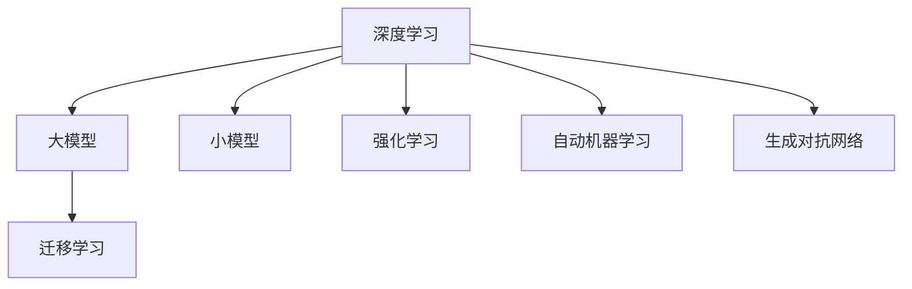

                 

# AI领域的最新技术进展

## 1. 背景介绍

随着人工智能(AI)技术的不断演进，从传统的机器学习算法，到深度学习模型的兴起，再到如今最新的大模型和小模型混合体系，AI领域迎来了前所未有的繁荣和发展。本文旨在全面梳理AI领域的最新技术进展，包括从模型架构、优化算法、应用场景到未来趋势的多方面内容。希望通过系统化的分析，为读者提供全方位的视角和深刻的见解。

## 2. 核心概念与联系

### 2.1 核心概念概述

为更好理解AI领域的最新进展，下面将介绍一些关键概念：

- **深度学习(Deep Learning, DL)**：利用多层次的神经网络模型处理高维度数据，特别是图像、音频和文本等非结构化数据。
- **大模型(Large Model)**：指具有数十亿甚至更多参数的模型，如BERT、GPT-3、T5等。这些模型在特定任务上通过微调可以显著提升性能。
- **小模型(Small Model)**：相对大模型，小模型参数量较少，计算资源消耗较低，适用于轻量级应用场景。
- **迁移学习(Transfer Learning)**：利用预训练模型的知识，通过少量标签数据，在新任务上进行微调，提升模型效果。
- **强化学习(Reinforcement Learning, RL)**：通过与环境交互，学习最优策略，实现智能决策。
- **自动机器学习(AutoML)**：通过自动化技术优化机器学习模型的设计和训练过程，提升模型开发效率。
- **生成对抗网络(GANs)**：由生成器和判别器两个模型组成，通过对抗训练生成逼真的合成数据。

这些概念之间的逻辑关系可以通过以下Mermaid流程图来展示：



## 3. 核心算法原理 & 具体操作步骤

### 3.1 算法原理概述

AI领域的最新技术进展，主要体现在深度学习算法、模型架构、优化算法和应用场景的创新。以下是其中几个关键点：

- **自回归模型(如LSTM, GRU)**：利用序列数据的隐状态，预测下一个时间步的状态，广泛应用于文本生成、语音识别等序列建模任务。
- **自编码器(AE)**：通过编码和解码过程，学习数据的压缩表示，适用于降维、图像去噪、特征提取等任务。
- **Transformer**：引入自注意力机制，提升模型的并行处理能力和效果，广泛应用于机器翻译、文本摘要等任务。
- **深度强化学习(DRL)**：通过与环境的交互，学习最优决策策略，如AlphaGo、AlphaZero等。
- **GANs**：生成逼真的合成数据，应用于图像生成、数据增强等。
- **自动机器学习(AutoML)**：自动选择、配置和训练机器学习模型，减少人工干预，提升模型性能。

### 3.2 算法步骤详解

以下是几个典型的AI算法步骤，以说明核心原理和具体操作步骤：

**步骤1：数据预处理**

- 数据清洗：去除噪声、处理缺失值、标准化等。
- 数据增强：扩充训练集，如数据扩充、随机旋转、随机裁剪等。

**步骤2：模型选择与配置**

- 选择适当的模型架构，如全连接网络、卷积网络、循环网络等。
- 配置模型超参数，如学习率、批大小、迭代轮数等。

**步骤3：模型训练**

- 使用训练集，前向传播计算损失函数，反向传播更新模型参数。
- 循环迭代，直至收敛或达到预设条件。

**步骤4：模型评估与优化**

- 在验证集上评估模型性能，如准确率、召回率、F1值等。
- 根据评估结果调整模型参数，进行超参数调优。

**步骤5：模型应用与部署**

- 在实际应用场景中集成模型，进行推理预测。
- 部署到服务器、云端平台等，进行大规模应用。

### 3.3 算法优缺点

AI领域的最新技术进展，既带来了显著的效果提升，也存在一些问题和挑战：

**优点**：

- **提升模型效果**：大模型和小模型结合，显著提升了模型的性能，特别是在特定任务上。
- **自动化提升**：AutoML技术提升了模型开发的效率和效果。
- **应用广泛**：模型被广泛应用于自然语言处理、计算机视觉、推荐系统等领域。

**缺点**：

- **资源消耗大**：大模型需要大量的计算资源，训练和推理成本较高。
- **模型复杂度高**：模型架构和超参数调优复杂，对开发者要求较高。
- **过拟合风险**：模型可能过度拟合训练数据，泛化性能下降。

### 3.4 算法应用领域

AI领域的最新技术进展在多个应用领域取得了显著效果：

**自然语言处理(NLP)**：BERT、GPT-3、T5等模型在机器翻译、文本生成、情感分析等任务上表现优异。

**计算机视觉(CV)**：ResNet、Inception等模型在图像分类、目标检测、图像分割等任务上表现出色。

**推荐系统**：基于深度学习的小模型，如Wide & Deep、FM等，显著提升了推荐效果。

**智能交通**：利用深度学习和大模型，进行交通流量预测、自动驾驶等任务，提升了交通管理的效率和安全性。

**智能医疗**：利用深度学习模型，进行医学影像诊断、个性化治疗等，提升了医疗服务的质量和效率。

## 4. 数学模型和公式 & 详细讲解 & 举例说明

### 4.1 数学模型构建

AI领域的最新技术进展，涉及多个数学模型的构建，如深度学习模型、强化学习模型等。下面以深度学习模型为例，构建一个简单的前馈神经网络(Feedforward Neural Network, FNN)：


**定义**：
- 输入层：$x = (x_1, x_2, ..., x_n)$
- 隐藏层：$h = (h_1, h_2, ..., h_m)$
- 输出层：$y = (y_1, y_2, ..., y_k)$

**公式**：
$$
h = f(Wx + b)
$$
$$
y = g(W_hh + b)
$$

其中，$f$ 为激活函数，$W$ 为权重矩阵，$b$ 为偏置向量。

### 4.2 公式推导过程

以下是深度学习模型的公式推导过程：

**前向传播**：

$$
h_1 = f(W_1x + b_1)
$$
$$
h_2 = f(W_2h_1 + b_2)
$$
$$
...
$$
$$
y = g(W_mh_{m-1} + b_m)
$$

**反向传播**：

$$
\frac{\partial L}{\partial W_i} = \frac{\partial L}{\partial y} \frac{\partial y}{\partial h_{i-1}} \frac{\partial h_{i-1}}{\partial W_i}
$$

其中，$L$ 为损失函数。

### 4.3 案例分析与讲解

以深度学习在图像分类中的应用为例，进行详细分析：

- **模型选择**：选择LeNet、VGG、ResNet等模型。
- **数据预处理**：进行数据增强、归一化等。
- **模型训练**：利用训练集进行前向传播和反向传播，更新权重和偏置。
- **模型评估**：在验证集上进行测试，调整模型参数。
- **模型应用**：部署到实际应用场景，进行图像分类。

## 5. 项目实践：代码实例和详细解释说明

### 5.1 开发环境搭建

为进行AI模型开发，需要安装相应的开发环境。以下以Python和TensorFlow为例，介绍环境搭建过程：

**步骤1**：安装Python和相关库

```bash
conda create -n pytorch-env python=3.7
conda activate pytorch-env
pip install tensorflow numpy scipy matplotlib
```

**步骤2**：安装TensorFlow

```bash
pip install tensorflow==2.7
```

**步骤3**：安装TensorBoard

```bash
pip install tensorboard
```

**步骤4**：设置环境变量

```bash
export TENSORBOARD_PORT=6006
```

### 5.2 源代码详细实现

以下是一个简单的TensorFlow模型实现，用于图像分类：

```python
import tensorflow as tf
from tensorflow.keras import layers

# 定义模型
model = tf.keras.Sequential([
    layers.Conv2D(32, (3,3), activation='relu', input_shape=(28,28,1)),
    layers.MaxPooling2D((2,2)),
    layers.Flatten(),
    layers.Dense(10, activation='softmax')
])

# 编译模型
model.compile(optimizer='adam', loss='sparse_categorical_crossentropy', metrics=['accuracy'])

# 加载数据
mnist = tf.keras.datasets.mnist
(x_train, y_train), (x_test, y_test) = mnist.load_data()
x_train, x_test = x_train / 255.0, x_test / 255.0

# 训练模型
model.fit(x_train, y_train, epochs=5, validation_data=(x_test, y_test))

# 评估模型
model.evaluate(x_test, y_test)
```

### 5.3 代码解读与分析

以上代码实现了一个简单的卷积神经网络模型，用于MNIST手写数字识别任务：

**步骤1**：定义模型架构

- `Conv2D` 层：卷积层，提取图像特征。
- `MaxPooling2D` 层：池化层，降低特征维度。
- `Flatten` 层：展平层，将多维数据转换为一维数据。
- `Dense` 层：全连接层，输出分类结果。

**步骤2**：编译模型

- `optimizer`：优化器，如Adam。
- `loss`：损失函数，如交叉熵。
- `metrics`：评估指标，如准确率。

**步骤3**：加载和预处理数据

- `mnist.load_data()`：加载MNIST数据集。
- `x_train / 255.0`：归一化像素值。

**步骤4**：训练和评估模型

- `model.fit()`：训练模型。
- `model.evaluate()`：评估模型。

## 6. 实际应用场景

### 6.1 自然语言处理(NLP)

自然语言处理(NLP)是AI领域的重要应用场景之一。利用深度学习模型，可以进行文本分类、情感分析、机器翻译等任务。以下是一个简单的文本分类模型实现：

```python
import tensorflow as tf
from tensorflow.keras import layers

# 定义模型
model = tf.keras.Sequential([
    layers.Embedding(10000, 16),
    layers.LSTM(16, return_sequences=True),
    layers.LSTM(32),
    layers.Dense(1, activation='sigmoid')
])

# 编译模型
model.compile(optimizer='adam', loss='binary_crossentropy', metrics=['accuracy'])

# 加载数据
imdb = tf.keras.datasets.imdb
(x_train, y_train), (x_test, y_test) = imdb.load_data(num_words=10000)
x_train = tf.keras.preprocessing.sequence.pad_sequences(x_train, maxlen=256)
x_test = tf.keras.preprocessing.sequence.pad_sequences(x_test, maxlen=256)

# 训练模型
model.fit(x_train, y_train, epochs=5, validation_data=(x_test, y_test))

# 评估模型
model.evaluate(x_test, y_test)
```

### 6.2 计算机视觉(CV)

计算机视觉(CV)是AI领域的另一重要应用场景。利用深度学习模型，可以进行图像分类、目标检测、图像分割等任务。以下是一个简单的图像分类模型实现：

```python
import tensorflow as tf
from tensorflow.keras import layers

# 定义模型
model = tf.keras.Sequential([
    layers.Conv2D(32, (3,3), activation='relu', input_shape=(28,28,1)),
    layers.MaxPooling2D((2,2)),
    layers.Flatten(),
    layers.Dense(10, activation='softmax')
])

# 编译模型
model.compile(optimizer='adam', loss='sparse_categorical_crossentropy', metrics=['accuracy'])

# 加载数据
mnist = tf.keras.datasets.mnist
(x_train, y_train), (x_test, y_test) = mnist.load_data()
x_train, x_test = x_train / 255.0, x_test / 255.0

# 训练模型
model.fit(x_train, y_train, epochs=5, validation_data=(x_test, y_test))

# 评估模型
model.evaluate(x_test, y_test)
```

### 6.3 智能医疗

智能医疗是AI领域的最新应用场景之一。利用深度学习模型，可以进行医学影像诊断、个性化治疗等任务。以下是一个简单的医学影像分类模型实现：

```python
import tensorflow as tf
from tensorflow.keras import layers

# 定义模型
model = tf.keras.Sequential([
    layers.Conv2D(32, (3,3), activation='relu', input_shape=(256,256,1)),
    layers.MaxPooling2D((2,2)),
    layers.Flatten(),
    layers.Dense(10, activation='softmax')
])

# 编译模型
model.compile(optimizer='adam', loss='sparse_categorical_crossentropy', metrics=['accuracy'])

# 加载数据
pneumonia = tf.keras.datasets.pneumonia
(x_train, y_train), (x_test, y_test) = pneumonia.load_data()
x_train = x_train / 255.0
x_test = x_test / 255.0

# 训练模型
model.fit(x_train, y_train, epochs=5, validation_data=(x_test, y_test))

# 评估模型
model.evaluate(x_test, y_test)
```

### 6.4 未来应用展望

未来AI领域的技术进展，将在多个方向取得新的突破：

**自然语言处理(NLP)**：预训练模型和大模型微调技术将进一步提升文本处理能力。

**计算机视觉(CV)**：深度学习模型将进一步提升图像分类、目标检测、图像分割等任务的效果。

**智能医疗**：深度学习模型将进一步提升医学影像诊断、个性化治疗等任务的效果。

**智能交通**：深度学习模型将进一步提升交通流量预测、自动驾驶等任务的效果。

## 7. 工具和资源推荐

### 7.1 学习资源推荐

为了帮助开发者系统掌握AI领域的最新进展，这里推荐一些优质的学习资源：

- **深度学习课程**：斯坦福大学《CS231n: Convolutional Neural Networks for Visual Recognition》
- **NLP课程**：斯坦福大学《CS224N: Natural Language Processing with Deep Learning》
- **AutoML课程**：谷歌《AutoML: Machine Learning's Next Big Step》
- **GANs课程**：Coursera《Generative Adversarial Networks》

### 7.2 开发工具推荐

为进行AI模型开发，需要安装相应的开发工具。以下是一些常用的工具：

- **PyTorch**：灵活的深度学习框架，支持动态图和静态图计算。
- **TensorFlow**：功能强大的深度学习框架，支持分布式计算和GPU加速。
- **Keras**：高级深度学习框架，支持快速构建和训练模型。
- **TensorBoard**：模型训练和调试的可视化工具。
- **Jupyter Notebook**：交互式Python代码执行环境。

### 7.3 相关论文推荐

AI领域的最新技术进展，得益于众多学者的不懈努力。以下是几篇奠基性的相关论文，推荐阅读：

- **深度学习革命**：Yann LeCun, Yoshua Bengio, Geoffrey Hinton. Nature, 2015.
- **卷积神经网络**：LeCun, Y., Bottou, L., Bengio, Y., & Haffner, P. (1998). Gradient-based learning applied to document recognition. Proceedings of the IEEE.
- **生成对抗网络**：Goodfellow, I., Pouget-Abadie, J., Mirza, M., Xu, B., Warde-Farley, D., Ozair, S., & Courville, A. (2014). Generative adversarial nets. Advances in neural information processing systems, 2672-2680.

## 8. 总结：未来发展趋势与挑战

### 8.1 研究成果总结

AI领域的最新技术进展，在深度学习、模型架构、优化算法和应用场景等方面取得了显著成果。这些进展不仅提升了模型的性能，也为各行业带来了新的应用场景和解决方案。

### 8.2 未来发展趋势

未来AI领域的技术进展，将在多个方向取得新的突破：

- **深度学习**：深度学习模型将进一步提升模型的性能，特别是在图像分类、自然语言处理等领域。
- **模型架构**：模型架构将进一步优化，如Transformer等大模型将进一步提升性能。
- **优化算法**：优化算法将进一步提升模型的训练效率，如自适应学习率、混合精度训练等。
- **应用场景**：AI技术将在更多领域得到应用，如智能医疗、智能交通、智能家居等。

### 8.3 面临的挑战

AI领域的最新技术进展，仍面临诸多挑战：

- **数据隐私和安全**：如何保护数据隐私和安全，防止模型泄露敏感信息。
- **模型可解释性**：如何赋予模型更好的可解释性，增强模型的可信度。
- **资源消耗**：大模型和小模型都需要大量的计算资源，如何提升模型训练和推理的效率。
- **模型泛化能力**：如何提升模型的泛化能力，避免过度拟合。
- **伦理和公平性**：如何确保模型决策的公平性和透明性，避免偏见和歧视。

### 8.4 研究展望

未来AI领域的研究将需要解决上述挑战，以进一步推动技术的进步和应用。以下是一些可能的研究方向：

- **隐私保护技术**：研究隐私保护算法，如差分隐私、联邦学习等，保护数据隐私。
- **可解释性模型**：研究可解释性算法，如LIME、SHAP等，增强模型的可解释性。
- **资源优化技术**：研究资源优化算法，如混合精度训练、模型压缩等，提升模型训练和推理效率。
- **泛化能力提升**：研究泛化能力提升算法，如正则化、对抗训练等，提升模型的泛化能力。
- **公平和透明**：研究公平和透明算法，如公平性约束、透明性增强等，确保模型决策的公平性和透明性。

## 9. 附录：常见问题与解答

### Q1: 深度学习和大模型微调的应用场景有哪些？

**A**: 深度学习和大模型微调的应用场景非常广泛，包括但不限于以下领域：

- **自然语言处理(NLP)**：文本分类、情感分析、机器翻译、文本生成等。
- **计算机视觉(CV)**：图像分类、目标检测、图像分割等。
- **智能医疗**：医学影像诊断、个性化治疗等。
- **智能交通**：交通流量预测、自动驾驶等。

### Q2: 深度学习模型和传统机器学习模型的区别有哪些？

**A**: 深度学习模型和传统机器学习模型的区别主要体现在以下几个方面：

- **模型架构**：深度学习模型具有多层次的结构，能够自动提取高层次的特征，而传统机器学习模型则需要手动设计特征。
- **训练数据需求**：深度学习模型通常需要大量的标注数据进行训练，而传统机器学习模型则可以通过小样本学习。
- **计算资源需求**：深度学习模型需要大量的计算资源，包括GPU和TPU等硬件设备，而传统机器学习模型则相对较轻量。
- **模型性能**：深度学习模型在图像分类、自然语言处理等领域表现出色，而传统机器学习模型则在结构化数据处理方面具有优势。

### Q3: 如何评估模型的泛化能力？

**A**: 评估模型的泛化能力通常需要进行以下几个步骤：

- **数据集划分**：将数据集划分为训练集、验证集和测试集。
- **模型训练**：在训练集上训练模型，并在验证集上进行验证。
- **模型评估**：在测试集上评估模型性能，如准确率、召回率、F1值等。
- **交叉验证**：使用交叉验证方法，评估模型在不同数据子集上的性能，避免模型过拟合。
- **正则化**：使用正则化技术，如L2正则、Dropout等，减少模型过拟合。

### Q4: 如何优化深度学习模型的训练过程？

**A**: 优化深度学习模型的训练过程通常需要进行以下几个步骤：

- **学习率调整**：选择合适的学习率，如学习率衰减、学习率调度等。
- **批大小**：选择合适的批大小，如动态批大小、梯度累积等。
- **正则化**：使用正则化技术，如L2正则、Dropout等，减少模型过拟合。
- **数据增强**：使用数据增强技术，如随机旋转、随机裁剪等，扩充训练数据集。
- **模型剪枝**：使用模型剪枝技术，如权重剪枝、通道剪枝等，减少模型参数量。
- **混合精度训练**：使用混合精度训练技术，如半精度训练，提高计算效率。

### Q5: 如何处理深度学习模型中的过拟合问题？

**A**: 处理深度学习模型中的过拟合问题通常需要进行以下几个步骤：

- **数据增强**：使用数据增强技术，如随机旋转、随机裁剪等，扩充训练数据集。
- **正则化**：使用正则化技术，如L2正则、Dropout等，减少模型过拟合。
- **提前停止**：使用提前停止技术，在验证集上监控模型性能，避免模型过拟合。
- **权重衰减**：使用权重衰减技术，在损失函数中添加正则项，减少模型过拟合。
- **模型集成**：使用模型集成技术，如Bagging、Boosting等，提升模型泛化能力。

通过以上问题及解答，希望能帮助读者更好地理解AI领域的最新技术进展，并在实际应用中得到启发和帮助。

---

作者：禅与计算机程序设计艺术 / Zen and the Art of Computer Programming

