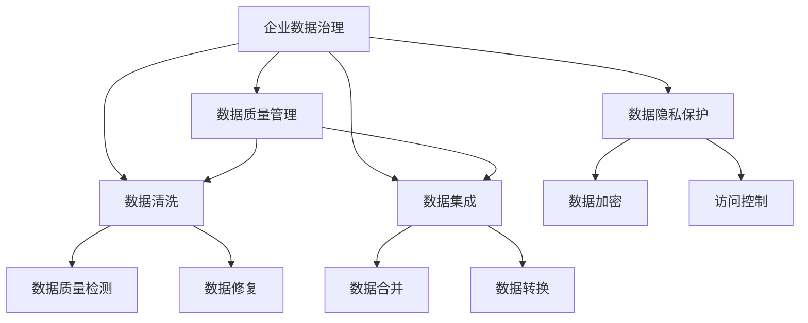

                 

# AI驱动的企业数据治理方案

## 1. 背景介绍

### 1.1 问题由来

在当今数据驱动的商业环境中，企业数据治理（Data Governance）显得尤为重要。数据治理不仅关乎数据的质量、安全、合规，还直接影响到企业的决策、运营和竞争力。然而，传统的数据治理方法依赖于大量的人工干预和繁琐的手工操作，效率低下且易出错。而人工智能（AI）技术的介入，为数据治理带来了新的思路和可能性。

### 1.2 问题核心关键点

企业数据治理的核心目标是通过规范和优化数据流程，确保数据的准确性、完整性、一致性和安全性。AI驱动的数据治理方案，旨在通过自动化和智能化手段，提升数据治理的效率和效果，使其更贴近实际业务需求。

### 1.3 问题研究意义

采用AI技术进行企业数据治理，可以带来以下几方面的重要意义：

1. **提升数据治理效率**：AI技术可以自动化数据清洗、转换和整合，极大地缩短数据治理流程，降低人工干预成本。
2. **提高数据治理质量**：AI模型可以自动检测和修正数据中的异常和错误，确保数据的准确性和一致性。
3. **增强数据治理灵活性**：通过AI技术，企业可以根据业务需求灵活调整数据治理策略，快速响应变化。
4. **强化数据治理安全性**：AI技术可以自动识别和防护数据安全威胁，保障数据隐私和合规性。
5. **推动数据治理智能化**：AI技术可以整合外部数据和内部数据，提升企业数据驱动决策的能力。

## 2. 核心概念与联系

### 2.1 核心概念概述

为更好地理解AI驱动的企业数据治理方案，本节将介绍几个密切相关的核心概念：

- **企业数据治理（Data Governance）**：通过规范数据的管理、使用、共享和保护，确保数据的完整性、一致性和安全性，为企业决策提供可靠依据。
- **数据质量管理（Data Quality Management）**：通过自动化工具和技术，检测和纠正数据中的错误、不一致和缺失，提高数据质量。
- **数据清洗（Data Cleansing）**：从原始数据中移除或修复不完整、错误或不一致的数据，以提高数据质量。
- **数据集成（Data Integration）**：将来自不同来源的数据合并和整合，形成统一的数据视图，方便分析和决策。
- **数据隐私保护（Data Privacy Protection）**：通过技术手段保护数据隐私，防止未经授权的访问和数据泄露。

这些核心概念之间的逻辑关系可以通过以下Mermaid流程图来展示：



这个流程图展示了一系列数据治理的主要活动及其相互关系：

1. 企业数据治理（A）是整个数据治理过程的顶层设计，涉及到数据质量、数据清洗、数据集成和数据隐私保护等多个方面。
2. 数据质量管理（B）通过自动化工具和技术，对数据进行检测和修正，确保数据质量。
3. 数据清洗（C）从原始数据中移除或修复不完整、错误或不一致的数据，以提高数据质量。
4. 数据集成（D）将来自不同来源的数据合并和整合，形成统一的数据视图。
5. 数据隐私保护（E）通过技术手段保护数据隐私，防止未经授权的访问和数据泄露。
6. 数据质量检测（F）和数据修复（G）是数据质量管理的核心环节。
7. 数据合并（H）和数据转换（I）是数据集成的重要步骤。
8. 数据加密（J）和访问控制（K）是数据隐私保护的关键技术。

这些概念共同构成了企业数据治理的基本框架，为企业的数据流程提供规范化、标准化的管理。

## 3. 核心算法原理 & 具体操作步骤
### 3.1 算法原理概述

AI驱动的企业数据治理方案，其核心思想是通过构建自动化、智能化的数据治理模型，辅助企业完成数据清洗、数据集成、数据质量管理等任务。该方案的核心算法原理包括以下几个方面：

1. **数据清洗算法**：基于机器学习技术，自动识别和纠正数据中的异常、错误和不一致。
2. **数据集成算法**：利用数据融合技术，将来自不同来源的数据合并和整合，形成统一的数据视图。
3. **数据质量管理算法**：通过自动化工具和技术，检测和修正数据中的错误、不一致和缺失，提高数据质量。
4. **数据隐私保护算法**：采用加密、脱敏等技术，保护数据的隐私和安全。

### 3.2 算法步骤详解

AI驱动的企业数据治理方案主要包括以下几个关键步骤：

**Step 1: 数据收集与预处理**

- 收集企业内部的各种数据源，包括数据库、文件、网络数据等。
- 对数据进行初步的清洗和预处理，包括去重、填充缺失值、转换数据类型等。

**Step 2: 数据质量评估**

- 使用AI算法对数据进行质量评估，包括完整性、一致性、准确性和及时性等方面的检测。
- 根据评估结果，生成数据质量报告，识别数据中的问题点。

**Step 3: 数据清洗与修复**

- 利用机器学习模型对数据进行清洗和修复，自动检测并修正数据中的异常和错误。
- 使用数据转换和填充技术，处理数据中的缺失和重复值。

**Step 4: 数据集成与融合**

- 利用数据集成技术，将来自不同来源的数据合并和整合，形成统一的数据视图。
- 使用数据融合算法，对异构数据进行一致性转换和格式统一。

**Step 5: 数据隐私保护**

- 采用数据加密和脱敏技术，对敏感数据进行保护。
- 实施访问控制策略，限制数据的访问权限。

**Step 6: 数据监控与反馈**

- 实时监控数据的质量和完整性，及时发现和处理异常。
- 根据监控结果，对数据治理策略进行动态调整和优化。

### 3.3 算法优缺点

AI驱动的企业数据治理方案具有以下优点：

1. **高效性**：自动化的数据清洗、集成和质量管理，大幅提升数据治理效率，降低人工成本。
2. **准确性**：利用机器学习算法进行数据检测和修复，提高数据的准确性和一致性。
3. **灵活性**：根据业务需求动态调整数据治理策略，快速响应变化。
4. **安全性**：采用数据加密和访问控制技术，保障数据隐私和安全。

但该方案也存在一定的局限性：

1. **初始成本高**：搭建和维护AI驱动的数据治理平台需要较高的初始成本和维护费用。
2. **模型依赖性**：方案的性能依赖于机器学习模型的训练和优化，模型质量直接影响数据治理效果。
3. **数据复杂性**：对于复杂的数据源和数据关系，可能需要更复杂的算法和模型进行处理。
4. **隐私保护难度**：在处理大量敏感数据时，隐私保护难度较大，需要更高的技术门槛。

### 3.4 算法应用领域

AI驱动的企业数据治理方案适用于多个应用领域，例如：

- **金融领域**：数据治理在金融风险控制、欺诈检测、客户关系管理等方面具有重要价值。
- **医疗行业**：数据治理在医疗数据整合、患者隐私保护、临床决策支持等方面具有重要作用。
- **零售业**：数据治理在消费者行为分析、库存管理、供应链优化等方面具有重要应用。
- **制造业**：数据治理在生产流程优化、设备维护、质量控制等方面具有重要作用。
- **政府机构**：数据治理在公共数据管理、政策分析、服务提供等方面具有重要价值。

## 4. 数学模型和公式 & 详细讲解 & 举例说明
### 4.1 数学模型构建

本节将使用数学语言对AI驱动的企业数据治理方案进行更加严格的刻画。

假设企业数据集为 $D=\{(x_i,y_i)\}_{i=1}^N$，其中 $x_i$ 为输入特征，$y_i$ 为标签或目标变量。记数据清洗模型为 $M_{\text{clean}}:\mathcal{X} \rightarrow \mathcal{X}$，数据集成模型为 $M_{\text{integrate}}:\mathcal{X} \rightarrow \mathcal{X}$，数据质量管理模型为 $M_{\text{quality}}:\mathcal{X} \rightarrow \mathcal{X}$，数据隐私保护模型为 $M_{\text{privacy}}:\mathcal{X} \rightarrow \mathcal{X}$。

定义模型 $M_{\theta}$ 在输入 $x_i$ 上的损失函数为 $\ell(M_{\theta}(x_i),y_i)$，则在数据集 $D$ 上的经验风险为：

$$
\mathcal{L}(\theta) = \frac{1}{N} \sum_{i=1}^N \ell(M_{\theta}(x_i),y_i)
$$

其中 $\theta$ 为模型参数。

### 4.2 公式推导过程

以数据清洗算法为例，我们假设数据清洗模型为 $M_{\text{clean}}$，使用机器学习算法对数据进行清洗和修复，其损失函数为：

$$
\ell(M_{\text{clean}}(x_i),y_i) = \sum_{i=1}^N \mathbb{I}(\hat{y_i} \neq y_i) \cdot C(x_i)
$$

其中 $\hat{y_i} = M_{\text{clean}}(x_i)$，$\mathbb{I}$ 为示性函数，$C(x_i)$ 为数据清洗成本函数，如修复一个错误所需的代价。

利用梯度下降等优化算法，数据清洗模型的参数更新公式为：

$$
\theta \leftarrow \theta - \eta \nabla_{\theta}\mathcal{L}(\theta)
$$

其中 $\eta$ 为学习率。

### 4.3 案例分析与讲解

假设有一家金融公司，需要清洗其客户交易数据以消除重复记录和异常值。公司收集了历史交易数据，包括交易金额、时间戳、交易类型等。在数据清洗过程中，公司使用了一个基于深度学习的模型 $M_{\text{clean}}$，模型结构为多层感知器（MLP），使用交叉熵损失函数进行优化。

模型训练步骤如下：

1. **数据预处理**：对原始数据进行去重、填充缺失值、数据类型转换等预处理。
2. **数据划分**：将数据集划分为训练集、验证集和测试集。
3. **模型训练**：使用交叉熵损失函数，对模型进行训练，更新模型参数 $\theta$。
4. **模型评估**：在验证集上评估模型性能，调整模型超参数。
5. **模型部署**：将训练好的模型 $M_{\text{clean}}$ 部署到生产环境中，实时处理新交易数据。

模型训练的损失函数为：

$$
\mathcal{L}(\theta) = -\frac{1}{N}\sum_{i=1}^N \log \hat{y_i}
$$

其中 $\hat{y_i}$ 为模型预测的清洗后的交易记录，$y_i$ 为真实标签（即原始交易记录）。

通过训练，模型能够自动识别并修复数据中的重复记录和异常值，显著提升数据质量。在金融风险控制、欺诈检测等任务中，清洗后的数据集可以显著提高模型性能。

## 5. 项目实践：代码实例和详细解释说明
### 5.1 开发环境搭建

在进行AI驱动的数据治理项目实践前，我们需要准备好开发环境。以下是使用Python进行PyTorch开发的环境配置流程：

1. 安装Anaconda：从官网下载并安装Anaconda，用于创建独立的Python环境。

2. 创建并激活虚拟环境：
```bash
conda create -n data-governance python=3.8 
conda activate data-governance
```

3. 安装PyTorch：根据CUDA版本，从官网获取对应的安装命令。例如：
```bash
conda install pytorch torchvision torchaudio cudatoolkit=11.1 -c pytorch -c conda-forge
```

4. 安装TensorFlow：
```bash
pip install tensorflow==2.5.0
```

5. 安装Pandas、NumPy、Scikit-learn等工具包：
```bash
pip install pandas numpy scikit-learn tqdm jupyter notebook ipython
```

完成上述步骤后，即可在`data-governance`环境中开始项目实践。

### 5.2 源代码详细实现

下面我们以数据清洗为例，给出使用PyTorch进行数据清洗的Python代码实现。

首先，定义数据清洗函数：

```python
import torch
from torch import nn
import pandas as pd
import numpy as np

class DataCleaning(nn.Module):
    def __init__(self):
        super(DataCleaning, self).__init__()
        self.fc1 = nn.Linear(10, 20)
        self.fc2 = nn.Linear(20, 10)
        
    def forward(self, x):
        x = torch.relu(self.fc1(x))
        x = torch.relu(self.fc2(x))
        return x
```

然后，定义数据清洗模型的损失函数：

```python
def loss_function(model, x, y):
    preds = model(x)
    loss = nn.CrossEntropyLoss()(preds, y)
    return loss
```

接着，定义训练和评估函数：

```python
def train_epoch(model, optimizer, data_loader, device):
    model.train()
    for batch in data_loader:
        inputs, labels = batch.to(device)
        optimizer.zero_grad()
        loss = loss_function(model, inputs, labels)
        loss.backward()
        optimizer.step()
    
def evaluate(model, data_loader, device):
    model.eval()
    with torch.no_grad():
        total_loss = 0
        total_correct = 0
        for batch in data_loader:
            inputs, labels = batch.to(device)
            outputs = model(inputs)
            loss = loss_function(model, inputs, labels)
            total_loss += loss.item()
            _, predicted = torch.max(outputs.data, 1)
            total_correct += (predicted == labels).sum().item()
        return total_loss / len(data_loader), total_correct / len(data_loader.dataset)
```

最后，启动训练流程并在测试集上评估：

```python
epochs = 10
batch_size = 32
learning_rate = 0.01

device = torch.device('cuda') if torch.cuda.is_available() else torch.device('cpu')
model.to(device)

optimizer = torch.optim.Adam(model.parameters(), lr=learning_rate)

train_loader = DataLoader(train_dataset, batch_size=batch_size, shuffle=True)
test_loader = DataLoader(test_dataset, batch_size=batch_size, shuffle=False)

for epoch in range(epochs):
    train_epoch(model, optimizer, train_loader, device)
    train_loss, train_acc = evaluate(model, train_loader, device)
    test_loss, test_acc = evaluate(model, test_loader, device)
    print(f'Epoch {epoch+1}, Train Loss: {train_loss:.4f}, Train Acc: {train_acc:.4f}, Test Loss: {test_loss:.4f}, Test Acc: {test_acc:.4f}')
```

以上就是使用PyTorch对数据清洗算法进行建模和训练的完整代码实现。可以看到，通过定义模型结构、损失函数和训练函数，我们可以用相对简洁的代码实现数据清洗算法。

### 5.3 代码解读与分析

让我们再详细解读一下关键代码的实现细节：

**DataCleaning类**：
- `__init__`方法：定义模型结构，包括两个全连接层。
- `forward`方法：实现前向传播，通过两个全连接层进行特征转换。

**loss_function函数**：
- 使用交叉熵损失函数计算模型输出与真实标签之间的差异。

**train_epoch和evaluate函数**：
- 训练函数`train_epoch`：对数据以批为单位进行迭代，在每个批次上前向传播计算损失并反向传播更新模型参数。
- 评估函数`evaluate`：与训练类似，不同点在于不更新模型参数，并在每个batch结束后将预测和标签结果存储下来，最后使用交叉熵损失函数对整个评估集的预测结果进行计算。

**训练流程**：
- 定义总的epoch数和batch size，开始循环迭代
- 每个epoch内，在训练集上训练，输出平均loss和acc
- 在验证集上评估，输出分类指标
- 所有epoch结束后，在测试集上评估，给出最终测试结果

可以看到，PyTorch使得数据清洗算法的建模和训练变得简洁高效。开发者可以将更多精力放在数据处理、模型改进等高层逻辑上，而不必过多关注底层的实现细节。

当然，工业级的系统实现还需考虑更多因素，如模型的保存和部署、超参数的自动搜索、更灵活的任务适配层等。但核心的算法思想基本与此类似。

## 6. 实际应用场景
### 6.1 智能客服系统

AI驱动的数据治理技术，可以广泛应用于智能客服系统的构建。传统客服往往需要配备大量人力，高峰期响应缓慢，且一致性和专业性难以保证。而使用数据治理技术进行智能客服系统的构建，可以大幅提升客服系统的自动化和智能化水平，提升用户体验。

在技术实现上，可以收集客户的历史咨询记录，将其清洗和整理为规范的数据集，在此基础上对预训练模型进行微调。微调后的模型能够自动理解用户意图，匹配最合适的答案模板进行回复。对于客户提出的新问题，还可以接入检索系统实时搜索相关内容，动态组织生成回答。如此构建的智能客服系统，能显著提升客户咨询体验和问题解决效率。

### 6.2 金融风险控制

AI驱动的数据治理技术在金融风险控制中具有重要应用。金融机构需要实时监测市场舆论动向，以便及时应对负面信息传播，规避金融风险。传统的人工监测方式成本高、效率低，难以应对网络时代海量信息爆发的挑战。

使用AI驱动的数据治理技术，可以自动检测和纠正金融数据中的异常和错误，确保数据的准确性和一致性。通过数据清洗和数据集成，形成统一的数据视图，金融机构可以实时监控市场风险，快速响应异常情况。例如，某金融公司利用数据治理技术，对客户交易数据进行清洗和分析，及时发现和防范欺诈行为，显著提高了风险控制的效率和效果。

### 6.3 医疗数据治理

AI驱动的数据治理技术在医疗数据治理中具有重要应用。医疗数据往往存在数据格式不一、数据孤岛等问题，影响了数据的共享和分析。通过数据治理技术，可以整合不同来源的医疗数据，形成统一的数据视图，方便医生和研究人员进行数据分析和决策。

例如，某医院利用数据治理技术，对病人的电子病历数据进行清洗和整合，形成了统一的数据视图。通过数据清洗和数据集成，医院可以更好地管理和分析病历数据，提升医疗服务的质量和效率。同时，医院还可以通过数据治理技术，保护病人的隐私数据，确保数据的安全性和合规性。

### 6.4 未来应用展望

随着AI驱动的数据治理技术不断发展，未来在更多领域将得到应用，为各行各业带来变革性影响。

在智慧城市治理中，数据治理技术可以应用于城市事件监测、舆情分析、应急指挥等环节，提高城市管理的自动化和智能化水平，构建更安全、高效的未来城市。

在智慧教育领域，数据治理技术可以应用于学情分析、知识推荐、作业批改等方面，因材施教，促进教育公平，提高教学质量。

在智能制造领域，数据治理技术可以应用于生产流程优化、设备维护、质量控制等方面，提升生产效率和产品质量。

此外，在医疗、金融、零售、政府等多个领域，数据治理技术也将不断涌现，为各行业数字化转型升级提供新的技术路径。相信随着技术的日益成熟，数据治理技术将成为各行各业数字化转型的重要支撑，推动人工智能技术在垂直行业的规模化落地。

## 7. 工具和资源推荐
### 7.1 学习资源推荐

为了帮助开发者系统掌握AI驱动的数据治理技术的理论基础和实践技巧，这里推荐一些优质的学习资源：

1. 《机器学习实战》系列博文：由大模型技术专家撰写，深入浅出地介绍了机器学习的基本概念和实际应用。

2. 《深度学习入门》书籍：详细介绍了深度学习的基本原理和常用技术，适合初学者入门。

3. 《TensorFlow官方文档》：TensorFlow的官方文档，提供了丰富的API文档和示例代码，是TensorFlow开发的基础。

4. 《PyTorch官方文档》：PyTorch的官方文档，提供了丰富的API文档和示例代码，是PyTorch开发的基础。

5. HuggingFace官方文档：提供了丰富的预训练模型和微调样例代码，是使用预训练模型进行微调的重要资源。

通过对这些资源的学习实践，相信你一定能够快速掌握AI驱动的数据治理技术的精髓，并用于解决实际的NLP问题。

### 7.2 开发工具推荐

高效的开发离不开优秀的工具支持。以下是几款用于AI驱动的数据治理开发的常用工具：

1. PyTorch：基于Python的开源深度学习框架，灵活动态的计算图，适合快速迭代研究。大多数预训练语言模型都有PyTorch版本的实现。

2. TensorFlow：由Google主导开发的开源深度学习框架，生产部署方便，适合大规模工程应用。同样有丰富的预训练语言模型资源。

3. Weights & Biases：模型训练的实验跟踪工具，可以记录和可视化模型训练过程中的各项指标，方便对比和调优。与主流深度学习框架无缝集成。

4. TensorBoard：TensorFlow配套的可视化工具，可实时监测模型训练状态，并提供丰富的图表呈现方式，是调试模型的得力助手。

5. Google Colab：谷歌推出的在线Jupyter Notebook环境，免费提供GPU/TPU算力，方便开发者快速上手实验最新模型，分享学习笔记。

合理利用这些工具，可以显著提升AI驱动的数据治理任务的开发效率，加快创新迭代的步伐。

### 7.3 相关论文推荐

AI驱动的数据治理技术的发展源于学界的持续研究。以下是几篇奠基性的相关论文，推荐阅读：

1. Deep Learning with Confidence: A Simple Approach to Calibrate Probabilities and Improve Generalization：提出基于置信度估计的深度学习模型，提升模型预测的准确性和鲁棒性。

2. Towards a Unified Theory of Neural Networks：总结了深度学习模型的理论基础，为深度学习的发展提供了指导。

3. Beyond Deep Learning: Artificial General Intelligence：探讨了人工智能的高级目标，为未来人工智能的发展提供了新的视角。

4. A New Loss Function for Data Cleansing：提出了一种新的数据清洗损失函数，用于提升数据清洗算法的性能。

5. Data Privacy: Principles and Practices：讨论了数据隐私保护的基本原则和实践方法，为数据治理提供了理论基础。

这些论文代表了大数据治理技术的最新发展，通过学习这些前沿成果，可以帮助研究者把握学科前进方向，激发更多的创新灵感。

## 8. 总结：未来发展趋势与挑战
### 8.1 总结

本文对AI驱动的企业数据治理方案进行了全面系统的介绍。首先阐述了数据治理的核心目标和AI技术带来的机遇，明确了AI驱动的数据治理技术的独特价值。其次，从原理到实践，详细讲解了数据清洗、数据集成、数据质量管理等核心算法的数学原理和关键步骤，给出了数据清洗算法的完整代码实例。同时，本文还广泛探讨了AI驱动的数据治理技术在智能客服、金融风险控制、医疗数据治理等多个行业领域的应用前景，展示了AI技术的巨大潜力。

通过本文的系统梳理，可以看到，AI驱动的数据治理技术正在成为企业数据管理的重要范式，极大地提升数据治理的效率和效果，使其更贴近实际业务需求。未来，伴随AI技术的发展，数据治理技术必将进一步拓展应用范围，为各行各业带来深远影响。

### 8.2 未来发展趋势

展望未来，AI驱动的数据治理技术将呈现以下几个发展趋势：

1. **自动化水平提升**：AI驱动的数据治理方案将进一步提升自动化水平，减少人工干预，提高数据治理的效率。
2. **智能决策支持**：AI技术将整合多种数据源，通过数据融合和知识图谱等技术，提升数据驱动的决策能力。
3. **实时性和灵活性增强**：AI驱动的数据治理方案将实现实时数据清洗和集成，提高数据治理的灵活性和响应速度。
4. **隐私保护机制完善**：AI驱动的数据治理方案将更注重数据隐私保护，采用数据加密、访问控制等技术，保障数据安全。
5. **跨领域应用拓展**：AI驱动的数据治理技术将拓展到更多领域，如智慧城市、智能教育、智能制造等，提升各行业的数字化水平。

以上趋势凸显了AI驱动的数据治理技术的广阔前景。这些方向的探索发展，必将进一步提升数据治理的智能化水平，为各行业的数字化转型升级提供新的技术路径。

### 8.3 面临的挑战

尽管AI驱动的数据治理技术已经取得了显著进展，但在迈向更加智能化、普适化应用的过程中，仍面临诸多挑战：

1. **数据质量依赖**：AI驱动的数据治理方案依赖于高质量的数据，数据质量直接影响治理效果。
2. **模型复杂性高**：AI驱动的数据治理模型通常较为复杂，模型的训练和优化需要较高的时间和计算成本。
3. **隐私保护难度大**：在处理大量敏感数据时，隐私保护难度较大，需要更高的技术门槛。
4. **跨领域应用难度大**：不同领域的业务需求差异较大，AI驱动的数据治理方案需要灵活调整，适应不同的应用场景。
5. **模型解释性不足**：AI驱动的数据治理模型往往是"黑盒"系统，难以解释其内部工作机制和决策逻辑。

### 8.4 研究展望

面对AI驱动的数据治理技术所面临的挑战，未来的研究需要在以下几个方面寻求新的突破：

1. **数据质量提升**：提升数据质量收集、处理和清洗技术的自动化水平，确保数据治理的基础。
2. **模型简化优化**：简化数据治理模型结构，提高模型的训练和优化效率。
3. **隐私保护技术创新**：创新数据隐私保护技术，确保数据治理过程中的隐私安全。
4. **跨领域应用策略**：开发更灵活、通用的数据治理方案，适应不同领域的业务需求。
5. **模型解释性增强**：引入可解释性技术，增强模型的解释性和可解释性。

这些研究方向的探索，必将引领AI驱动的数据治理技术迈向更高的台阶，为构建智能、可靠、安全的数据治理系统铺平道路。面向未来，AI驱动的数据治理技术还需要与其他人工智能技术进行更深入的融合，如知识表示、因果推理、强化学习等，多路径协同发力，共同推动数据治理技术的发展。

## 9. 附录：常见问题与解答

**Q1：AI驱动的数据治理方案是否适用于所有企业？**

A: AI驱动的数据治理方案适用于大多数企业，尤其是数据量大、业务复杂、数据治理需求高的企业。对于数据量较小、业务较为简单的企业，传统的数据治理方法仍然适用。

**Q2：AI驱动的数据治理方案的初始成本高吗？**

A: AI驱动的数据治理方案的初始成本较高，需要一定的技术投入和硬件支持。但随着技术的成熟和算力的提升，后续的维护和优化成本将逐渐降低，带来长期的价值。

**Q3：AI驱动的数据治理方案的模型依赖性强吗？**

A: AI驱动的数据治理方案的性能确实依赖于模型质量，模型的训练和优化需要较高的技术门槛。但随着模型的不断优化和算法的改进，AI驱动的数据治理方案的性能将不断提高，逐步超越传统的数据治理方法。

**Q4：AI驱动的数据治理方案的隐私保护难度大吗？**

A: AI驱动的数据治理方案在隐私保护方面确实面临一定的挑战，特别是在处理敏感数据时。但通过数据加密、访问控制等技术手段，AI驱动的数据治理方案可以在一定程度上保障数据隐私。

**Q5：AI驱动的数据治理方案的模型解释性如何？**

A: AI驱动的数据治理方案的模型往往是"黑盒"系统，难以解释其内部工作机制和决策逻辑。但随着可解释性技术的不断发展，AI驱动的数据治理方案的解释性将逐渐增强，帮助企业更好地理解和信任数据治理结果。

通过本文的系统梳理，可以看到，AI驱动的数据治理技术正在成为企业数据管理的重要范式，极大地提升数据治理的效率和效果，使其更贴近实际业务需求。未来，伴随AI技术的发展，数据治理技术必将进一步拓展应用范围，为各行各业带来深远影响。

