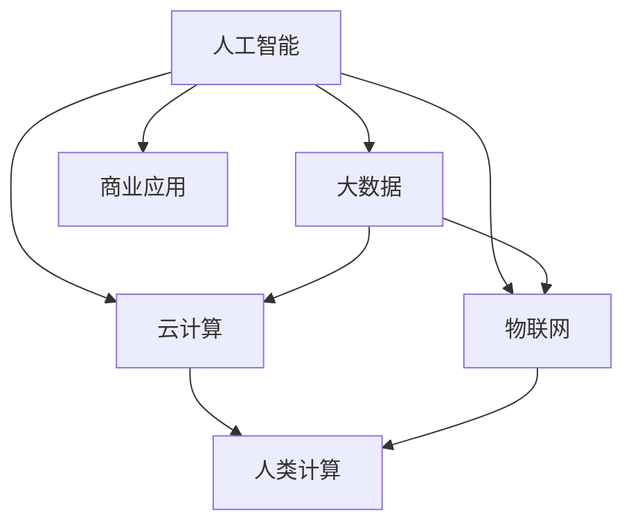

                 

# AI驱动的创新：人类计算在商业中的未来发展趋势

## 1. 背景介绍

### 1.1 问题由来
人工智能（AI）和人类计算正在改变商业的运作方式。随着大数据、云计算和物联网技术的飞速发展，企业对数据的依赖越来越深，迫切需要借助AI技术来提升数据处理、分析和应用的能力。AI不仅在提升运营效率和客户体验方面扮演重要角色，而且在产品创新、服务优化和市场开拓等多个方面也发挥着不可替代的作用。本文将探讨AI在商业中的应用趋势，探讨未来人类计算的新格局。

### 1.2 问题核心关键点
AI在商业中的应用主要包括两个层面：一是通过自动化、智能化提升业务运营效率；二是通过数据分析和机器学习挖掘潜在的商业价值，实现业务创新和智能化决策。具体问题点包括：

1. **自动化和智能化**：如何通过AI技术自动化和智能化企业的各项业务流程，提升效率和准确性？
2. **数据驱动决策**：如何在海量数据中提取有价值的信息，实现数据驱动的业务决策和优化？
3. **业务创新**：如何利用AI技术发掘新业务模式，开拓新的市场机会？
4. **商业伦理**：在AI技术应用中如何确保数据安全和用户隐私，避免伦理风险？
5. **组织变革**：AI技术应用对企业组织结构和管理模式的变革需求是什么？

## 2. 核心概念与联系

### 2.1 核心概念概述

为更好地理解AI在商业中的应用，本节将介绍几个关键概念：

- **人工智能（AI）**：使用计算机算法和数据处理技术，模拟人类智能的机器和系统，包括机器学习、深度学习、自然语言处理、计算机视觉等技术。
- **人类计算（Human Computation）**：指通过集聚和利用人类的认知能力，解决复杂问题的方法。
- **大数据（Big Data）**：指体量巨大、类型多样的数据集，其特点是体量大、速度快、种类多、价值密度低。
- **云计算（Cloud Computing）**：通过网络提供计算资源和服务，按需使用的模式，支持弹性扩展和灵活管理。
- **物联网（IoT）**：将设备、传感器、系统等通过网络连接，实现数据互通和智能互联。

这些核心概念之间的逻辑关系可以通过以下Mermaid流程图来展示：



这个流程图展示了大数据、云计算、物联网、人工智能和人类计算之间的关联关系，以及它们在商业中的应用。

## 3. 核心算法原理 & 具体操作步骤

### 3.1 算法原理概述

AI在商业中的应用，主要依赖于数据处理和模型训练技术。通过收集、存储和分析海量数据，构建数学模型，并通过机器学习算法优化模型参数，实现业务流程自动化和智能化决策。

### 3.2 算法步骤详解

#### 步骤1：数据准备和清洗
- 收集与业务相关的数据，包括内部数据和外部数据。
- 清洗和预处理数据，去除噪声和异常值，确保数据质量。

#### 步骤2：特征工程和模型选择
- 进行特征提取和转换，将原始数据转化为模型可用的特征。
- 选择合适的机器学习算法，如线性回归、决策树、随机森林、深度学习等。

#### 步骤3：模型训练和优化
- 使用训练数据集训练模型，调整模型参数。
- 使用验证数据集评估模型性能，进行超参数调优。
- 使用测试数据集评估最终模型效果。

#### 步骤4：模型部署和应用
- 将训练好的模型部署到生产环境。
- 通过API或集成方式，将AI技术应用到业务流程中。
- 监控模型性能，定期更新模型以应对业务变化。

### 3.3 算法优缺点

**优点**：
- **提升效率**：自动化和智能化流程可以大幅提升业务处理速度和准确性。
- **数据驱动决策**：通过数据分析和模型训练，实现数据驱动的业务决策，降低决策风险。
- **业务创新**：AI技术可以帮助企业发掘新业务模式，开拓新市场。

**缺点**：
- **数据依赖**：高质量数据是AI应用的基础，但数据获取和处理成本较高。
- **技术门槛**：AI技术需要专业的数据科学和机器学习知识，对企业人才结构提出挑战。
- **伦理风险**：AI应用可能带来数据安全和隐私问题，需严格控制和监管。

### 3.4 算法应用领域

AI技术在商业中的应用领域非常广泛，包括但不限于：

- **客户关系管理（CRM）**：通过AI技术优化客户数据管理，提升客户满意度和忠诚度。
- **供应链管理**：利用AI进行需求预测、库存管理和物流优化。
- **市场营销**：通过数据分析和推荐系统，精准营销和客户细分。
- **金融服务**：利用AI进行风险评估、欺诈检测和智能投顾。
- **人力资源管理**：通过AI技术优化招聘、培训和绩效管理。
- **医疗健康**：利用AI进行疾病预测、治疗方案优化和医疗影像分析。

## 4. 数学模型和公式 & 详细讲解

### 4.1 数学模型构建

在商业应用中，常见的AI模型包括线性回归、决策树、随机森林、深度神经网络等。以线性回归模型为例，其数学模型为：

$$
y = \theta_0 + \theta_1 x_1 + \theta_2 x_2 + \cdots + \theta_n x_n + \epsilon
$$

其中，$y$为输出值，$\theta_0, \theta_1, \theta_2, \cdots, \theta_n$为模型参数，$x_1, x_2, \cdots, x_n$为输入特征，$\epsilon$为误差项。

### 4.2 公式推导过程

线性回归模型的参数估计，通常使用最小二乘法进行求解。假设已有$m$个样本，其输出值为$y_i$，输入特征为$x_{ij}$，则目标是最小化误差平方和：

$$
\sum_{i=1}^m (y_i - \hat{y}_i)^2 = \sum_{i=1}^m (\hat{y}_i - y_i)^2
$$

其中，$\hat{y}_i = \theta_0 + \theta_1 x_{i1} + \theta_2 x_{i2} + \cdots + \theta_n x_{in}$为预测值。

最小二乘法求解的目标函数为：

$$
J(\theta) = \frac{1}{2m} \sum_{i=1}^m (y_i - \hat{y}_i)^2
$$

通过求解该函数的极小值，可以得到模型参数$\theta$的估计值。

### 4.3 案例分析与讲解

以销售预测为例，假设公司有历史销售数据$x_1, x_2, \cdots, x_n$，包括时间、促销、季节等特征，目标预测未来一个月的销售量$y$。通过构建线性回归模型，可以对历史数据进行拟合，得到预测公式。在实际应用中，需要定期更新模型参数，以适应新的业务数据和市场变化。

## 5. 项目实践：代码实例和详细解释说明

### 5.1 开发环境搭建

在进行AI项目实践前，我们需要准备好开发环境。以下是使用Python进行Scikit-learn开发的环境配置流程：

1. 安装Anaconda：从官网下载并安装Anaconda，用于创建独立的Python环境。

2. 创建并激活虚拟环境：
```bash
conda create -n sklearn-env python=3.8 
conda activate sklearn-env
```

3. 安装Scikit-learn和其他必要工具包：
```bash
pip install scikit-learn pandas numpy matplotlib scikit-optimize jupyter notebook ipython
```

完成上述步骤后，即可在`sklearn-env`环境中开始AI项目实践。

### 5.2 源代码详细实现

下面我们以销售预测任务为例，给出使用Scikit-learn进行线性回归模型的PyTorch代码实现。

首先，准备销售数据：

```python
from sklearn.datasets import load_boston
from sklearn.model_selection import train_test_split
from sklearn.preprocessing import StandardScaler
import pandas as pd

# 加载波士顿房价数据
boston = load_boston()
X, y = boston.data, boston.target

# 数据分割
X_train, X_test, y_train, y_test = train_test_split(X, y, test_size=0.3, random_state=42)

# 数据标准化
scaler = StandardScaler()
X_train = scaler.fit_transform(X_train)
X_test = scaler.transform(X_test)

# 数据加载为DataFrame格式
X_train_df = pd.DataFrame(X_train, columns=boston.feature_names)
X_test_df = pd.DataFrame(X_test, columns=boston.feature_names)
```

然后，定义线性回归模型：

```python
from sklearn.linear_model import LinearRegression
from sklearn.metrics import mean_squared_error

# 定义线性回归模型
model = LinearRegression()
```

接着，定义训练和评估函数：

```python
def train_model(X_train, y_train):
    # 模型训练
    model.fit(X_train, y_train)
    return model

def evaluate_model(model, X_test, y_test):
    # 模型评估
    y_pred = model.predict(X_test)
    mse = mean_squared_error(y_test, y_pred)
    rmse = np.sqrt(mse)
    return rmse
```

最后，启动训练流程并在测试集上评估：

```python
# 训练模型
model = train_model(X_train, y_train)

# 模型评估
rmse = evaluate_model(model, X_test, y_test)
print(f"测试集均方根误差：{rmse:.3f}")
```

以上就是使用Scikit-learn进行线性回归模型训练的完整代码实现。可以看到，得益于Scikit-learn的强大封装，我们可以用相对简洁的代码完成线性回归模型的训练和评估。

### 5.3 代码解读与分析

让我们再详细解读一下关键代码的实现细节：

**数据准备**：
- 使用`load_boston`函数加载波士顿房价数据集，并分割为训练集和测试集。
- 使用`StandardScaler`对数据进行标准化处理，以提升模型训练效果。

**模型定义**：
- 使用`LinearRegression`定义线性回归模型，准备进行训练。

**训练和评估**：
- 使用`fit`方法训练模型，返回训练好的模型。
- 使用`predict`方法对测试集进行预测，并使用`mean_squared_error`函数计算均方根误差（RMSE），评估模型性能。

可以看到，Scikit-learn提供了简单易用的API接口，使得机器学习模型的实现变得便捷高效。在实际应用中，可以通过调整模型参数、优化算法等进一步提升模型性能。

## 6. 实际应用场景

### 6.1 智慧物流管理

AI在智慧物流管理中的应用，可以显著提升物流效率和客户满意度。通过实时监测和优化物流路径，结合大数据分析和机器学习算法，可以实现货物追踪、库存管理、配送优化等功能。

在技术实现上，可以收集物流运输的实时数据，包括车辆位置、货物状态、交通状况等，建立物流预测模型，优化运输路径和配货策略。例如，使用深度学习模型对历史运输数据进行分析，预测未来的交通状况和配送需求，自动调整配送路线和运输方式，实现动态优化和资源调配。

### 6.2 智能制造

AI在智能制造中的应用，可以实现生产流程的智能化和自动化，提升生产效率和产品质量。通过机器视觉、传感器数据和工业物联网（IIoT）等技术，结合AI算法进行实时监控和预测，可以优化生产计划、预测设备故障、提升设备利用率等。

在技术实现上，可以部署传感器和摄像头对生产设备进行监控，收集设备状态、运行数据等，使用机器学习模型进行设备健康监测和故障预测。例如，使用时间序列分析模型对设备运行数据进行实时监测，预测设备寿命和故障时间，自动发出维护警报，减少停机时间和维护成本。

### 6.3 健康医疗

AI在健康医疗中的应用，可以提升疾病诊断、治疗方案优化和医疗影像分析的效率和准确性。通过大数据分析和机器学习算法，结合医疗领域的专家知识，可以实现更精准的诊断和更有效的治疗方案。

在技术实现上，可以收集患者的病历数据、影像数据、基因数据等，使用深度学习模型进行疾病预测和诊断。例如，使用卷积神经网络（CNN）对医疗影像进行分析，自动检测异常情况，辅助医生进行诊断和治疗。

### 6.4 未来应用展望

随着AI技术的不断进步，未来的商业应用将更加智能化和自动化。以下是几个可能的发展方向：

1. **自动化和智能化生产**：通过AI技术优化生产流程，实现智能化生产，提升生产效率和产品质量。
2. **智能客服和销售**：通过AI技术提升客户服务和销售效率，实现智能化客服和个性化推荐，提升客户体验。
3. **智能城市和交通**：通过AI技术优化城市管理，实现交通流量控制、智慧公共安全等应用。
4. **智能金融**：通过AI技术提升金融服务和风险管理，实现智能投顾、风险预测等功能。
5. **智能健康**：通过AI技术提升医疗诊断和治疗方案，实现个性化健康管理，提升医疗服务水平。

## 7. 工具和资源推荐

### 7.1 学习资源推荐

为了帮助开发者系统掌握AI技术在商业中的应用，这里推荐一些优质的学习资源：

1. **Coursera《机器学习》课程**：由斯坦福大学开设，涵盖了机器学习的基本概念和算法，适合初学者入门。
2. **edX《人工智能基础》课程**：由麻省理工学院和微软联合开设，全面介绍了人工智能的原理和应用。
3. **Kaggle竞赛平台**：提供大量数据集和竞赛，通过实践学习AI技术的实际应用。
4. **GitHub AI项目**：提供丰富的AI项目代码和资源，适合学习和研究。
5. **NIPS、ICML等顶级会议论文**：阅读顶级会议的最新论文，了解AI技术的最新进展。

通过对这些资源的学习实践，相信你一定能够快速掌握AI技术的精髓，并用于解决实际的商业问题。

### 7.2 开发工具推荐

高效的开发离不开优秀的工具支持。以下是几款用于AI项目开发的常用工具：

1. **Jupyter Notebook**：开源的交互式计算平台，支持Python、R等多种编程语言，便于快速迭代和分享代码。
2. **PyTorch**：基于Python的深度学习框架，支持动态计算图和GPU加速，适合研究和原型开发。
3. **TensorFlow**：由Google主导的深度学习框架，支持静态计算图和分布式训练，适合生产部署。
4. **Scikit-learn**：基于Python的机器学习库，提供了丰富的算法和工具，适合数据处理和建模。
5. **Keras**：高层次的神经网络API，易于上手，适合快速开发原型。
6. **Visual Studio Code**：轻量级代码编辑器，支持丰富的插件和扩展，便于高效开发和调试。

合理利用这些工具，可以显著提升AI项目开发的效率和质量。

### 7.3 相关论文推荐

AI在商业中的应用涉及众多领域，以下是几篇奠基性的相关论文，推荐阅读：

1. **《Deep Learning》（Ian Goodfellow等）**：深度学习领域的经典教材，详细介绍了深度学习的基本原理和算法。
2. **《Artificial Intelligence: A Modern Approach》（Russell & Norvig）**：全面介绍了AI技术的原理和应用，适合系统学习。
3. **《Neural Networks and Deep Learning》（Michael Nielsen）**：介绍了深度学习的基本概念和算法，适合初学者学习。
4. **《Machine Learning Yearning》（Andrew Ng）**：针对机器学习的实践和应用，提供了实用的建议和案例。
5. **《Towards Data Science》（John W. Foreman）**：介绍了数据科学的基本概念和工具，适合全面了解数据驱动的技术。

这些论文代表了大数据、云计算和AI技术的发展脉络，通过学习这些前沿成果，可以帮助研究者把握学科前进方向，激发更多的创新灵感。

## 8. 总结：未来发展趋势与挑战

### 8.1 总结

本文对AI在商业中的应用进行了全面系统的介绍。首先阐述了AI和人类计算在商业中的重要性，明确了AI技术在自动化、智能化和数据驱动决策方面的独特价值。其次，从原理到实践，详细讲解了AI模型构建和训练的具体步骤，给出了AI项目开发的完整代码实例。同时，本文还广泛探讨了AI技术在物流管理、智能制造、健康医疗等众多领域的应用前景，展示了AI技术带来的巨大潜力。此外，本文精选了AI技术的各类学习资源，力求为读者提供全方位的技术指引。

通过本文的系统梳理，可以看到，AI技术在商业中的应用前景广阔，能够在多个方面提升企业的运营效率和竞争力。未来，伴随AI技术的不断进步，人类计算的方式将更加智能化和自动化，为商业发展带来新的机遇和挑战。

### 8.2 未来发展趋势

展望未来，AI在商业中的应用将呈现以下几个发展趋势：

1. **更加智能化**：AI技术将进一步提升智能化水平，实现更加精准的预测和决策。
2. **更加个性化**：通过AI技术，实现更加个性化的产品和服务，提升客户体验。
3. **更加自动化**：通过AI技术，实现自动化和智能化流程，提升效率和准确性。
4. **更加开放和协作**：AI技术将促进数据和算法的开放共享，促进跨行业、跨领域的合作。
5. **更加安全和透明**：AI技术将注重数据安全和隐私保护，提升系统的可解释性和透明性。

### 8.3 面临的挑战

尽管AI在商业中的应用已经取得了显著成果，但在迈向更加智能化、普适化应用的过程中，仍面临诸多挑战：

1. **数据质量问题**：高质量数据是AI应用的基础，但数据获取和处理成本较高，且数据质量和完整性难以保证。
2. **技术复杂性**：AI技术需要专业的数据科学和机器学习知识，对企业人才结构提出挑战。
3. **伦理和法律风险**：AI应用可能带来数据安全和隐私问题，需严格控制和监管。
4. **资源消耗问题**：AI模型的训练和推理需要大量计算资源，成本较高。

### 8.4 研究展望

面对AI应用所面临的挑战，未来的研究需要在以下几个方面寻求新的突破：

1. **数据质量提升**：研究和开发高效、可靠的数据采集和处理技术，提升数据质量和完整性。
2. **技术普及化**：推动AI技术的普及和应用，降低技术门槛，提高企业的AI应用能力。
3. **伦理和法律规范**：制定和完善AI技术的伦理和法律规范，保障数据安全和用户隐私。
4. **资源优化**：优化AI模型的计算图和推理算法，减少资源消耗，提升模型效率。

这些研究方向的探索，将引领AI技术迈向更加智能化、普适化应用，为商业发展带来新的机遇和挑战。未来，伴随AI技术的不断进步，人类计算的方式将更加智能化和自动化，为商业发展带来新的机遇和挑战。

## 9. 附录：常见问题与解答

**Q1：AI在商业中的应用是否能够提高企业的运营效率？**

A: 是的。AI可以通过自动化和智能化流程，大幅提升业务处理速度和准确性，降低运营成本，提高企业竞争力。例如，在智能客服、供应链管理和客户关系管理等方面，AI技术可以显著提升效率和效果。

**Q2：AI技术在商业应用中面临哪些伦理和法律风险？**

A: AI技术在商业应用中可能面临数据安全和隐私问题，需严格控制和监管。例如，在医疗和金融等领域，AI应用可能涉及敏感数据和隐私信息，需要制定和完善相关的伦理和法律规范，保障数据安全和用户隐私。

**Q3：AI在商业中的应用如何确保数据质量？**

A: 数据质量是AI应用的基础，提升数据质量和完整性需要从数据采集、存储和处理等多个环节进行优化。例如，在数据采集阶段，可以使用数据清洗和预处理技术，去除噪声和异常值，提升数据质量。在数据存储和处理阶段，可以使用数据标准化和异常检测技术，确保数据一致性和完整性。

**Q4：AI在商业中的应用需要哪些技术支持？**

A: AI在商业中的应用需要数据科学、机器学习和软件工程等多方面的技术支持。例如，数据科学负责数据处理和分析，机器学习负责模型构建和训练，软件工程负责系统集成和部署。此外，还需要结合具体业务需求，选择和优化技术方案。

**Q5：AI技术在商业中的应用前景如何？**

A: AI技术在商业中的应用前景广阔，能够在多个方面提升企业的运营效率和竞争力。例如，在智能制造、智慧物流、智能金融等领域，AI技术可以显著提升生产效率、物流管理和金融服务水平。未来，随着AI技术的不断进步，AI在商业中的应用将更加智能化和自动化，为商业发展带来新的机遇和挑战。

---

作者：禅与计算机程序设计艺术 / Zen and the Art of Computer Programming

