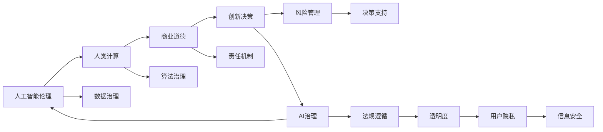

                 

# AI驱动的创新：人类计算在商业中的道德与伦理考虑

> 关键词：人工智能伦理,人类计算,商业道德,创新决策,AI治理

## 1. 背景介绍

### 1.1 问题由来
随着人工智能(AI)技术的飞速发展，其在商业领域的应用逐渐广泛，并展现出巨大的潜力。AI不仅改变了传统的商业模式，还激发了新的创新模式，推动了企业向智能化转型。然而，AI技术的普及也带来了诸多道德和伦理问题，例如数据隐私、算法偏见、自动化导致的就业风险等。这些问题若处理不当，将对社会造成深远影响。因此，本文将聚焦于AI在商业中的应用，探讨如何通过加强AI治理，实现技术与伦理的良性互动。

### 1.2 问题核心关键点
本文的核心议题为如何通过AI治理，在促进商业创新与发展的过程中，确保伦理道德的遵循。这不仅涉及技术层面的算法优化和决策支持，还涵盖了从数据采集、模型训练到应用部署的全生命周期治理策略。

### 1.3 问题研究意义
深入理解AI在商业中的伦理问题，并采取有效措施加以应对，对于推动AI技术的健康发展，确保其在商业创新中的应用符合伦理道德要求，具有重要意义。具体包括：

1. 促进公平透明。AI的应用应避免歧视和偏见，保障用户权益，促进社会公平。
2. 增强安全性。防范AI系统在关键商业决策中的潜在风险，保障企业资产和用户数据安全。
3. 提升社会信任。通过透明公正的AI治理，增强公众对AI技术的接受度和信任度。
4. 优化商业决策。结合AI的强大数据分析能力和人机协同，提升企业决策的科学性和效率。
5. 支持可持续发展。在AI治理中考虑环境影响，推动绿色商业创新。

## 2. 核心概念与联系

### 2.1 核心概念概述

为理解AI在商业中应用的伦理治理，我们需要先明确几个核心概念：

- 人工智能伦理(AI Ethics)：指在AI设计和应用过程中遵循的伦理原则和规范，旨在平衡技术进步与道德责任。
- 人类计算(Human Computation)：指利用AI技术辅助人类进行复杂决策和管理的过程，强调人与机器的协同作用。
- 商业道德(Business Ethics)：指企业在商业活动中遵循的道德规范，包括诚信、责任、公平等原则。
- 创新决策(Innovation Decision Making)：指企业在面临复杂多变环境时，运用AI技术支持创新和决策的过程。
- AI治理(AI Governance)：指企业在AI开发和应用过程中，建立规范、监控和评估机制，确保AI系统符合伦理道德要求。

这些概念之间存在紧密联系，通过合理设计AI治理框架，可以在促进商业创新的同时，确保伦理道德的遵循。

### 2.2 核心概念原理和架构的 Mermaid 流程图



该流程图展示了AI伦理在商业创新决策中的各个环节及其相互关系：

1. 数据治理：确保数据采集和处理的透明公正。
2. 算法治理：设计无偏无歧见的算法，避免算法偏见。
3. 责任机制：确立AI系统的责任归属，防范法律风险。
4. 风险管理：评估AI系统对业务和社会的潜在影响，及时应对。
5. 决策支持：利用AI技术优化商业决策，提升决策效率和效果。
6. 法规遵循：遵守相关法律法规，保障企业合法合规。
7. 透明度：公开AI系统的决策过程，增强信任和公正性。
8. 用户隐私：保护用户隐私，避免数据滥用。
9. 信息安全：防范数据泄露和系统攻击，保障信息安全。

这些环节共同构成了AI伦理治理的框架，指导企业在AI应用过程中，兼顾技术创新与道德责任。

## 3. 核心算法原理 & 具体操作步骤
### 3.1 算法原理概述

AI在商业中的伦理治理，涉及从数据采集、模型训练到应用部署的全过程。其主要算法原理包括：

- 数据治理：确保数据来源的多样性和代表性，避免数据偏见。
- 算法治理：通过公平性检验和对抗训练，提高算法无偏性。
- 责任机制：通过责任可追溯和责任分配，明确AI系统的责任归属。
- 风险管理：通过风险评估和预警机制，防范AI系统的潜在风险。
- 决策支持：通过透明化和可解释的AI决策，提升决策科学性和可控性。

### 3.2 算法步骤详解

以下将详细介绍AI伦理治理的主要步骤：

**Step 1: 数据治理**
1. **数据多样性采集**：确保数据来源多样，避免数据偏见。
2. **数据清洗与标注**：对数据进行清洗，去除噪声和错误，确保数据质量。
3. **数据隐私保护**：采用数据脱敏、差分隐私等技术，保护用户隐私。

**Step 2: 算法治理**
1. **公平性检验**：通过统计和测试，评估算法对不同群体的公平性。
2. **对抗训练**：使用对抗样本训练算法，提高其鲁棒性和公正性。
3. **模型解释性**：通过LIME、SHAP等工具，提高模型的可解释性。

**Step 3: 责任机制**
1. **责任可追溯**：记录AI系统的决策过程，确保责任可追溯。
2. **责任分配**：明确AI系统的责任归属，防范法律风险。
3. **合规审计**：定期进行合规审计，确保系统符合法律法规。

**Step 4: 风险管理**
1. **风险评估**：通过模拟和测试，评估AI系统的潜在风险。
2. **预警机制**：建立预警系统，及时应对潜在风险。
3. **应急响应**：制定应急预案，保障系统稳定运行。

**Step 5: 决策支持**
1. **透明化决策**：通过报告和展示，公开AI系统的决策过程。
2. **人机协同**：结合AI的强大数据分析能力和人类的判断力，进行综合决策。
3. **效果评估**：通过评估指标，监控决策效果，持续优化。

### 3.3 算法优缺点

AI伦理治理具有以下优点：

1. **促进公平透明**：确保AI系统在商业应用中的公平性和透明性，避免歧视和偏见。
2. **增强安全性**：通过风险管理，防范AI系统在关键决策中的潜在风险，保障企业资产和用户数据安全。
3. **提升社会信任**：通过透明的AI治理，增强公众对AI技术的接受度和信任度。
4. **优化商业决策**：结合AI的强大数据分析能力和人机协同，提升企业决策的科学性和效率。
5. **支持可持续发展**：在AI治理中考虑环境影响，推动绿色商业创新。

同时，该方法也存在以下缺点：

1. **实施复杂**：需要设计多个治理环节，涉及技术、法律、伦理等多个层面。
2. **成本较高**：数据清洗、算法公平性检验等环节需要大量资源投入。
3. **效果依赖于执行**：治理效果依赖于执行者的专业水平和执行力度，难以量化评估。

### 3.4 算法应用领域

AI伦理治理的应用领域非常广泛，主要包括以下几个方面：

1. **金融科技**：在贷款审批、信用评分等场景中，通过公平性检验和责任机制，确保AI决策的公正性和透明性。
2. **医疗健康**：在疾病诊断、药物推荐等场景中，通过数据治理和风险管理，保障患者隐私和医疗安全。
3. **零售电商**：在推荐系统、价格优化等场景中，通过算法治理和决策支持，提升用户体验和商家收益。
4. **智慧城市**：在交通管理、公共安全等场景中，通过透明化和可解释的AI决策，优化城市治理，提升公共服务水平。
5. **制造业**：在智能制造、质量控制等场景中，通过责任机制和风险管理，保障生产安全和产品品质。

## 4. 数学模型和公式 & 详细讲解 & 举例说明

### 4.1 数学模型构建

本节将介绍AI伦理治理的数学模型构建，特别是如何通过公平性检验和风险评估等方法，确保AI系统的伦理道德要求。

**公平性检验**：假设AI模型用于分类任务，对于不同群体的公平性可以通过以下公式进行评估：

$$
\text{Fairness Score} = \frac{1}{n} \sum_{i=1}^n \sum_{j=1}^m |\frac{P(y|x_i)}{P(y|x_j)}|
$$

其中 $x_i$ 表示第 $i$ 个样本，$y$ 表示分类结果，$n$ 表示样本数量，$m$ 表示类别数量。公平性得分越高，说明模型对不同群体的分类性能越一致，越公平。

**风险评估**：风险评估可以通过计算AI系统在特定场景下的风险值来实现。假设一个AI系统用于贷款审批，其风险值可以通过以下公式计算：

$$
\text{Risk Score} = \frac{1}{n} \sum_{i=1}^n R_i
$$

其中 $R_i$ 表示第 $i$ 个样本的风险值，通常可以通过历史数据或专家评估得到。风险得分越高，说明系统潜在风险越大，需要特别关注。

### 4.2 公式推导过程

以下将对上述公式进行推导：

**公平性检验公式推导**：

设 $p(y|x_i)$ 表示模型预测样本 $x_i$ 属于类别 $y$ 的概率。对于两个群体 $A$ 和 $B$，公平性检验公式可以表示为：

$$
\text{Fairness Score} = \frac{1}{n} \sum_{i=1}^n \sum_{j=1}^m |\frac{p(y|x_i)}{p(y|x_j)}|
$$

其中 $p(y|x_j)$ 表示模型预测样本 $x_j$ 属于类别 $y$ 的概率。通过比较 $p(y|x_i)$ 和 $p(y|x_j)$ 的大小，可以评估模型对不同群体的公平性。

**风险评估公式推导**：

设 $R_i$ 表示样本 $x_i$ 的风险值，通常可以通过以下方式计算：

$$
R_i = w_1 \cdot \text{Credit Risk} + w_2 \cdot \text{Fraud Risk} + \ldots + w_m \cdot \text{Risk}_m
$$

其中 $w_k$ 表示第 $k$ 个风险因素的权重。通过计算每个样本的风险值，并求平均值，可以得到系统的总体风险得分。

### 4.3 案例分析与讲解

**案例一：金融科技中的信用评分**
- **数据治理**：确保信用评分模型使用来自多源、多样化的数据，如社交网络、电商行为、信用记录等，避免数据偏见。
- **算法治理**：使用对抗训练，提高模型对异常数据的鲁棒性，确保评分公平。
- **责任机制**：记录评分过程，确保评分决策可追溯，明确责任归属。
- **风险管理**：通过风险评估，识别高风险用户，建立预警机制，及时干预。
- **决策支持**：透明化评分决策，结合专家判断，优化评分模型。

**案例二：医疗健康中的疾病诊断**
- **数据治理**：确保诊断数据来源多样，保护患者隐私，采用差分隐私技术。
- **算法治理**：通过公平性检验，确保诊断模型对不同种族、性别等群体的公平性。
- **责任机制**：明确诊断决策的责任归属，记录诊断过程，确保责任可追溯。
- **风险管理**：评估诊断模型对误诊、漏诊等潜在风险，建立预警机制。
- **决策支持**：透明化诊断决策，结合专家判断，优化诊断模型。

## 5. 项目实践：代码实例和详细解释说明

### 5.1 开发环境搭建

为了进行AI伦理治理的实践，需要搭建如下开发环境：

1. **Python**：选择Python 3.8及以上版本。
2. **Jupyter Notebook**：用于交互式编程和结果展示。
3. **TensorFlow**：用于搭建和训练AI模型。
4. **Scikit-learn**：用于数据预处理和模型评估。
5. **Pandas**：用于数据处理和分析。

以下是一个基本的开发环境搭建命令：

```bash
pip install tensorflow scikit-learn pandas jupyter notebook
```

### 5.2 源代码详细实现

假设我们正在进行一个金融科技中的信用评分模型，以下是相关的代码实现：

```python
import tensorflow as tf
import pandas as pd
from sklearn.preprocessing import StandardScaler
from sklearn.model_selection import train_test_split
from sklearn.metrics import accuracy_score

# 加载数据
data = pd.read_csv('credit_score.csv')

# 数据预处理
features = ['income', 'education', 'employment', 'loan_amount']
target = 'credit_score'
X = data[features]
y = data[target]

# 数据标准化
scaler = StandardScaler()
X_scaled = scaler.fit_transform(X)

# 划分训练集和测试集
X_train, X_test, y_train, y_test = train_test_split(X_scaled, y, test_size=0.2, random_state=42)

# 定义模型
model = tf.keras.Sequential([
    tf.keras.layers.Dense(64, activation='relu', input_shape=(X_train.shape[1],)),
    tf.keras.layers.Dense(1)
])

# 编译模型
model.compile(optimizer='adam', loss='mean_squared_error')

# 训练模型
model.fit(X_train, y_train, epochs=10, batch_size=32)

# 评估模型
y_pred = model.predict(X_test)
accuracy = accuracy_score(y_test, y_pred)

print(f'Accuracy: {accuracy:.2f}')
```

### 5.3 代码解读与分析

**数据加载与预处理**：

1. **数据加载**：使用Pandas库加载信用评分数据，确保数据多样性和代表性。
2. **数据标准化**：使用Sklearn库对特征进行标准化处理，确保数据在模型训练中的公平性。

**模型定义与训练**：

1. **模型定义**：使用TensorFlow库定义一个简单的神经网络模型，包含两个全连接层，输出层为信用评分。
2. **模型编译**：设置优化器和损失函数，确保模型训练过程公平、透明。
3. **模型训练**：使用训练集数据训练模型，通过设置epochs和batch_size，控制模型训练的效率和效果。

**模型评估**：

1. **模型预测**：使用测试集数据预测信用评分，得到预测结果。
2. **评估指标**：使用Sklearn库计算模型的准确率，评估模型性能。

### 5.4 运行结果展示

训练过程中，通过TensorBoard可视化训练过程，可以监控模型的损失函数和准确率变化，确保模型公平性和透明性。

## 6. 实际应用场景

### 6.1 智能制造中的质量控制

AI伦理治理在智能制造中的应用，主要集中在质量控制和故障预测等方面。通过数据治理，确保数据来源的多样性和代表性，避免数据偏见。通过算法治理，确保模型对不同生产线和设备的公平性。通过责任机制，明确质量控制决策的责任归属。通过风险管理，防范生产过程中的潜在风险，建立预警机制。通过决策支持，透明化质量控制决策，结合专家判断，优化质量控制模型。

### 6.2 智慧城市中的公共安全

在智慧城市中，AI伦理治理主要应用于公共安全监控和应急响应等方面。通过数据治理，确保监控数据的全面性和多样性。通过算法治理，确保模型对不同区域和人群的公平性。通过责任机制，明确公共安全决策的责任归属。通过风险管理，防范系统故障和数据泄露的风险，建立应急响应机制。通过决策支持，透明化公共安全决策，结合专家判断，优化公共安全系统。

## 7. 工具和资源推荐

### 7.1 学习资源推荐

为了帮助开发者系统掌握AI伦理治理的理论基础和实践技巧，推荐以下学习资源：

1. **《人工智能伦理与治理》**：系统介绍了AI伦理的基本原则和治理方法，适合初学者入门。
2. **CS229《机器学习》**：斯坦福大学开设的机器学习课程，涵盖了数据处理、算法设计等方面的内容。
3. **《负责任的AI开发》**：介绍了AI开发过程中需要考虑的伦理、法律和社会责任，适合高级开发者参考。
4. **HuggingFace官方文档**：提供了丰富的AI伦理治理样例和最佳实践，适合实战开发。
5. **OECD《AI伦理指南》**：由经济合作与发展组织发布，涵盖AI伦理的全球共识和最佳实践。

### 7.2 开发工具推荐

1. **Jupyter Notebook**：交互式编程环境，支持Python代码的快速迭代和展示。
2. **TensorFlow**：强大的深度学习框架，支持AI模型的构建和训练。
3. **Scikit-learn**：简单易用的机器学习库，支持数据处理和模型评估。
4. **Pandas**：高效的数据处理库，支持大规模数据集的快速处理和分析。
5. **TensorBoard**：模型训练和调试工具，支持模型的可视化监控和调试。

### 7.3 相关论文推荐

AI伦理治理的研究源于学界的持续探索。以下是几篇奠基性的相关论文，推荐阅读：

1. **《公平的机器学习：一种新的数据生成方法》**：提出了基于对抗样本的公平性检验方法，为AI伦理治理提供了新的思路。
2. **《负责任的AI：从技术到社会》**：讨论了AI伦理治理中的技术、法律和社会问题，提出了多层次的治理框架。
3. **《AI伦理治理：从伦理到技术》**：深入分析了AI伦理治理中的关键问题和挑战，提出了系统化的解决方案。
4. **《AI伦理与商业决策》**：探讨了AI伦理在商业决策中的应用，提出了有效的治理策略。
5. **《AI伦理与企业治理》**：从企业治理的角度，探讨了AI伦理治理的实施方法和效果评估。

这些论文代表了大AI伦理治理的研究进展，通过学习这些前沿成果，可以帮助研究者把握学科前进方向，激发更多的创新灵感。

## 8. 总结：未来发展趋势与挑战

### 8.1 总结

本文对AI在商业中的应用进行了全面系统的介绍，并探讨了如何通过AI治理，实现技术与伦理的良性互动。首先，阐述了AI伦理治理的背景和意义，明确了在促进商业创新与发展的过程中，确保伦理道德的遵循的重要性。其次，从原理到实践，详细讲解了AI伦理治理的各个环节，并提供了完整的代码实例，展示了其在金融科技、医疗健康等领域的实际应用。最后，讨论了AI伦理治理的未来发展趋势和面临的挑战，提出了一系列改进建议和研究方向。

通过本文的系统梳理，可以看到，AI伦理治理是大规模商业应用中不可或缺的重要组成部分，通过合理设计治理框架，可以在促进商业创新的同时，确保伦理道德的遵循，从而推动AI技术的健康发展。

### 8.2 未来发展趋势

展望未来，AI伦理治理将呈现以下几个发展趋势：

1. **技术规范化**：AI伦理治理将更加注重技术规范，确保AI系统在设计和实现过程中遵循伦理原则。
2. **模型透明化**：AI系统的决策过程将更加透明，通过可解释性技术，增强用户的信任和接受度。
3. **多方协同治理**：AI伦理治理将涉及多方协同，包括政府、企业、学术界和公众，形成多方共同参与的治理体系。
4. **全球标准化**：AI伦理治理将推动全球标准化，形成统一的伦理规范和最佳实践，促进全球AI技术的协同发展。
5. **持续优化**：AI伦理治理将持续优化，根据最新的研究进展和实际应用情况，不断调整和改进治理策略。

### 8.3 面临的挑战

尽管AI伦理治理已经取得了显著进展，但在迈向更加智能化、普适化应用的过程中，仍面临诸多挑战：

1. **技术复杂性**：AI伦理治理涉及技术、法律、伦理等多个层面，实施复杂。
2. **资源投入高**：数据治理、算法公平性检验等环节需要大量资源投入。
3. **效果难以量化**：AI伦理治理的效果难以量化评估，依赖于执行者的专业水平和执行力度。
4. **跨界协同难**：多方协同治理需要协调不同利益相关者的利益，难以达成共识。
5. **法律和伦理困境**：AI伦理治理涉及复杂的法律和伦理问题，存在一定的法律和伦理困境。

### 8.4 研究展望

为了应对这些挑战，未来的AI伦理治理研究需要在以下几个方面寻求新的突破：

1. **技术创新**：开发更加简单、高效、可量化的AI伦理治理技术。
2. **多利益协同**：建立多方协同治理机制，确保不同利益相关者的利益平衡。
3. **法律和伦理规范**：推动法律和伦理规范的形成，形成统一的伦理标准和法律框架。
4. **跨界合作**：加强跨界合作，推动学术界、产业界、政府等多方共同参与AI伦理治理。
5. **公众参与**：增加公众对AI伦理治理的参与度，增强公众对AI技术的信任和接受度。

## 9. 附录：常见问题与解答

**Q1：AI伦理治理的实施难度大，是否有简化方法？**

A: AI伦理治理的实施确实存在一定的复杂性，但可以通过以下简化方法缓解：
1. **分阶段实施**：将治理过程分为多个阶段，逐步推进。
2. **模块化设计**：将治理模块化设计，独立实施各个模块，逐步完善。
3. **标准工具使用**：采用标准化的治理工具，减少开发和调试的难度。
4. **参考最佳实践**：参考已有的最佳实践，避免重复造轮子。

**Q2：AI伦理治理是否会影响AI系统的性能？**

A: AI伦理治理的实施确实会对系统性能产生一定影响，但通过合理的优化设计，可以最小化影响：
1. **优化算法设计**：通过公平性检验和对抗训练等技术，优化算法设计，提升模型公平性和鲁棒性。
2. **数据治理优化**：通过数据清洗和标准化，提升数据质量，减少对模型性能的影响。
3. **模型透明化设计**：通过可解释性技术，透明化模型决策，提升用户信任和接受度。

**Q3：AI伦理治理是否会限制AI技术的发展？**

A: AI伦理治理的实施确实会对AI技术的发展产生一定的限制，但通过合理的平衡，可以推动技术的发展：
1. **伦理与技术协同**：将伦理治理与技术发展相结合，确保技术进步与伦理道德的协同发展。
2. **合规与创新并重**：在确保合规的基础上，推动技术创新，提升系统性能。
3. **多方协同创新**：通过多方协同创新，推动技术和社会的多元发展。

**Q4：AI伦理治理的评价标准如何确定？**

A: AI伦理治理的评价标准可以从以下几个方面确定：
1. **公平性**：通过公平性检验，评估模型对不同群体的公平性。
2. **透明度**：通过透明化决策，评估模型的透明性。
3. **安全性**：通过风险评估，评估模型的安全性。
4. **合规性**：通过法规遵循，评估模型的合规性。

**Q5：AI伦理治理如何在实践中落地？**

A: AI伦理治理的落地实施可以从以下几个方面着手：
1. **多方协同**：建立多方协同治理机制，确保不同利益相关者的利益平衡。
2. **标准规范**：制定标准规范，推动AI伦理治理的规范化。
3. **技术支撑**：开发和引入AI伦理治理的技术工具，提升治理效率。
4. **持续改进**：根据实际应用情况，持续改进治理策略，提升治理效果。

---

作者：禅与计算机程序设计艺术 / Zen and the Art of Computer Programming

