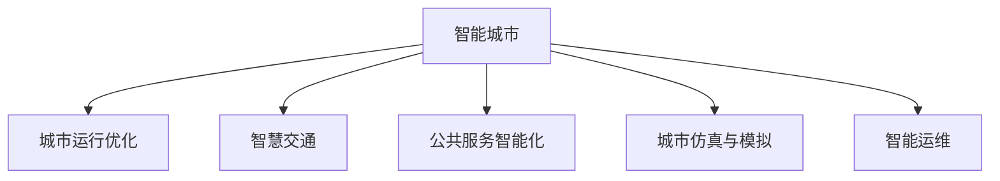

                 

# AI驱动的智能城市规划与管理

> 关键词：智能城市,规划与管理,人工智能,大数据,自动驾驶,城市运行优化,智慧交通,公共服务

## 1. 背景介绍

### 1.1 问题由来
随着人口的快速增长和城市化的加速推进，传统的城市规划和管理方式已难以应对现代城市发展带来的复杂挑战。传统的城市规划和管理依赖于人为经验和历史数据的静态分析，效率低下且难以应对不断变化的城市动态特性。而随着人工智能和大数据技术的快速发展，城市规划和管理领域迎来了新的技术革命。

人工智能和大数据技术为城市规划和管理提供了全新的视角和方法。通过引入人工智能和大数据技术，城市规划和管理可以更加智能化、高效化，提升城市运行的效率和居民的满意度。本文将系统探讨AI如何驱动城市规划和管理，为智能城市建设提供理论和实践指导。

### 1.2 问题核心关键点
AI驱动的城市规划和管理涉及多个关键环节，包括智能交通、公共服务、资源分配、环境监测等。其核心在于如何利用AI技术进行城市数据的智能分析和决策支持，提升城市管理的智能化水平。

AI城市规划和管理的核心技术包括：
1. **大数据分析**：通过采集、处理和分析海量城市数据，发现城市运行规律和趋势。
2. **机器学习与深度学习**：利用模型对城市数据进行预测、分类、聚类等分析，实现智能化决策。
3. **自动驾驶与无人系统**：实现交通和环境管理的自动化，提升城市运行效率。
4. **城市仿真与模拟**：通过虚拟城市仿真模拟，评估城市规划方案的可行性。
5. **智能运维与服务**：实现对城市基础设施和公共服务的智能监测和管理。

本文将从技术原理和应用实践两个角度，全面阐述AI如何驱动智能城市的规划与管理。

## 2. 核心概念与联系

### 2.1 核心概念概述

为更好地理解AI如何驱动城市规划与管理，本节将介绍几个密切相关的核心概念：

- **智能城市**：基于物联网、大数据、云计算、人工智能等技术，构建的智能化、智慧化、高效化、生态化的城市体系。
- **城市运行优化**：通过数据驱动的智能化分析，优化城市资源的配置和管理，提升城市运行的效率和可持续性。
- **智慧交通**：利用AI技术实现交通流量的智能化控制和管理，提高交通效率，减少交通拥堵。
- **公共服务智能化**：通过AI技术提升公共服务如医疗、教育、环卫、安防等领域的智能化水平，提升居民的生活质量和满意度。
- **城市仿真与模拟**：构建虚拟城市模型，通过仿真和模拟技术，评估不同规划方案的效果和可行性。
- **智能运维**：利用AI技术实现城市基础设施如道路、桥梁、建筑等的智能监测和管理，提升运维效率。

这些概念之间的逻辑关系可以通过以下Mermaid流程图来展示：



这个流程图展示智能城市概念与其他核心概念的联系：

1. 智能城市通过大数据和AI技术，实现城市运行的智能化。
2. 智慧交通、公共服务智能化、城市仿真与模拟、智能运维是智能城市的重要组成部分。

## 3. 核心算法原理 & 具体操作步骤
### 3.1 算法原理概述

AI驱动的城市规划与管理，本质上是通过大数据和AI技术，对城市数据进行智能分析和决策支持的过程。其核心算法原理包括：

- **数据采集与处理**：通过物联网、传感器等技术，采集城市运行数据，并进行预处理和清洗。
- **数据建模与分析**：利用机器学习、深度学习等算法，对城市数据进行建模和分析，发现城市运行的规律和趋势。
- **智能决策与控制**：基于数据建模和分析结果，通过智能决策系统进行交通流、资源分配等控制和管理。
- **仿真与模拟**：构建虚拟城市模型，通过仿真和模拟技术，评估城市规划和管理方案的效果和可行性。
- **智能运维与服务**：利用AI技术对城市基础设施和公共服务进行智能监测和管理，提升运维效率和服务质量。

### 3.2 算法步骤详解

基于AI的城市规划与管理一般包括以下几个关键步骤：

**Step 1: 数据采集与预处理**
- 利用物联网、传感器等技术，采集城市运行相关的数据，如交通流量、环境监测数据、公共服务需求等。
- 对采集的数据进行预处理和清洗，包括去噪、填补缺失值、标准化等操作。

**Step 2: 数据建模与分析**
- 使用机器学习、深度学习等算法，对处理后的数据进行建模和分析，如分类、聚类、预测等。
- 利用可视化工具对分析结果进行展示，帮助决策者理解数据背后的规律和趋势。

**Step 3: 智能决策与控制**
- 根据数据建模和分析结果，设计智能决策模型，进行交通流、资源分配等控制和管理。
- 利用优化算法和仿真技术，评估不同决策方案的效果，选择最优方案。

**Step 4: 仿真与模拟**
- 构建虚拟城市模型，利用仿真和模拟技术，评估不同规划和管理方案的效果和可行性。
- 通过多次仿真模拟，优化城市规划和管理方案，提升城市运行的效率和可持续性。

**Step 5: 智能运维与服务**
- 利用AI技术对城市基础设施如道路、桥梁、建筑等进行智能监测和管理，提升运维效率。
- 实现对公共服务如医疗、教育、环卫、安防等的智能化监测和管理，提升服务质量和满意度。

### 3.3 算法优缺点

基于AI的城市规划与管理方法具有以下优点：
1. 高效智能：通过数据驱动的智能化分析，可以大幅提升城市管理的效率和准确性。
2. 数据驱动：基于海量数据进行分析和决策，可以发现城市运行的规律和趋势。
3. 动态调整：通过实时数据更新和模型优化，可以动态调整城市规划和管理策略。
4. 应急响应：在突发事件发生时，可以快速进行数据分析和决策，提高应急响应能力。

同时，该方法也存在一定的局限性：
1. 数据依赖：对数据质量、数据量有较高要求，数据采集和处理成本较高。
2. 模型复杂：需要构建复杂的数据建模和分析模型，对技术要求较高。
3. 隐私问题：城市数据涉及隐私保护，需要严格的数据管理和隐私保护措施。
4. 技术局限：目前AI模型仍无法完全替代人类经验和直觉，需要在决策中结合人工干预。

尽管存在这些局限性，但AI驱动的城市规划与管理仍是大势所趋，对于提升城市智能化水平具有重要意义。

### 3.4 算法应用领域

基于AI的城市规划与管理方法，在多个领域得到了广泛应用，例如：

- **智慧交通**：通过智能交通系统实现交通流量的智能化控制，提升交通效率，减少交通拥堵。
- **公共服务智能化**：通过AI技术提升公共服务如医疗、教育、环卫、安防等领域的智能化水平，提升居民的生活质量和满意度。
- **城市运行优化**：通过数据驱动的智能化分析，优化城市资源的配置和管理，提升城市运行的效率和可持续性。
- **环境监测与治理**：利用AI技术实现对环境数据的智能化分析，提升环境监测和治理能力。
- **灾害预警与应急管理**：通过AI技术实现对自然灾害的智能化预警和应急管理，提升城市的安全性。

## 4. 数学模型和公式 & 详细讲解  
### 4.1 数学模型构建

本节将使用数学语言对AI驱动的城市规划与管理过程进行更加严格的刻画。

记城市运行数据为 $D=\{(x_i,y_i)\}_{i=1}^N$，其中 $x_i$ 为输入特征，$y_i$ 为输出标签。假设智能决策模型为 $M_{\theta}$，其中 $\theta$ 为模型参数。

定义模型 $M_{\theta}$ 在输入 $x$ 上的输出为 $y=M_{\theta}(x)$，其在数据集 $D$ 上的经验风险为：

$$
\mathcal{L}(\theta) = \frac{1}{N}\sum_{i=1}^N \ell(y_i, M_{\theta}(x_i))
$$

其中 $\ell$ 为损失函数，用于衡量模型预测输出与真实标签之间的差异。

在实践中，我们通常使用基于梯度的优化算法（如SGD、Adam等）来近似求解上述最优化问题。设 $\eta$ 为学习率，则参数的更新公式为：

$$
\theta \leftarrow \theta - \eta \nabla_{\theta}\mathcal{L}(\theta)
$$

其中 $\nabla_{\theta}\mathcal{L}(\theta)$ 为损失函数对参数 $\theta$ 的梯度，可通过反向传播算法高效计算。

### 4.2 公式推导过程

以下我们以智能交通管理为例，推导AI驱动的城市规划与管理数学模型。

假设城市交通数据为 $D=\{(t_i,v_i,c_i)\}_{i=1}^N$，其中 $t_i$ 为时间戳，$v_i$ 为车辆速度，$c_i$ 为道路通行能力。

定义交通状态预测模型为 $M_{\theta}$，其中 $\theta$ 为模型参数。则交通状态预测问题可以转化为一个回归问题，模型的输入特征为 $x_i=(t_i,v_i)$，输出标签为 $y_i=c_i$。

采用均方误差作为损失函数 $\ell$，则经验风险 $\mathcal{L}(\theta)$ 为：

$$
\mathcal{L}(\theta) = \frac{1}{N}\sum_{i=1}^N (c_i - M_{\theta}(t_i,v_i))^2
$$

在训练过程中，通过反向传播算法更新模型参数 $\theta$，最小化经验风险 $\mathcal{L}(\theta)$。在得到训练后的模型后，可以利用该模型对未来交通状态进行预测，实现交通流的智能化控制和管理。

### 4.3 案例分析与讲解

**智能交通管理**：

智能交通管理是AI驱动城市规划与管理的典型应用场景之一。通过AI技术，可以实现交通流的智能化控制和管理，提升交通效率，减少交通拥堵。

具体实现流程如下：

1. **数据采集与预处理**：利用传感器、摄像头等设备采集交通流量、速度、拥堵状况等数据，并进行预处理和清洗。
2. **数据建模与分析**：使用机器学习、深度学习等算法，对处理后的数据进行建模和分析，预测未来交通状态。
3. **智能决策与控制**：根据数据建模和分析结果，设计智能决策模型，进行交通信号灯控制、变道引导等决策。
4. **仿真与模拟**：构建虚拟城市模型，通过仿真和模拟技术，评估不同交通管理方案的效果和可行性。
5. **智能运维与服务**：利用AI技术对交通基础设施进行智能监测和管理，提升运维效率。

例如，在实际应用中，可以通过建立车辆位置和速度的预测模型，实时调整信号灯的时序和相位，动态引导车辆绕行，从而缓解交通拥堵。

## 5. 项目实践：代码实例和详细解释说明
### 5.1 开发环境搭建

在进行AI驱动的城市规划与管理实践前，我们需要准备好开发环境。以下是使用Python进行Scikit-Learn和TensorFlow开发的环境配置流程：

1. 安装Anaconda：从官网下载并安装Anaconda，用于创建独立的Python环境。

2. 创建并激活虚拟环境：
```bash
conda create -n ai-env python=3.8 
conda activate ai-env
```

3. 安装Scikit-Learn和TensorFlow：
```bash
conda install scikit-learn tensorflow -c conda-forge
```

4. 安装其他工具包：
```bash
pip install numpy pandas matplotlib scikit-learn tensorflow-gpu
```

完成上述步骤后，即可在`ai-env`环境中开始AI驱动城市规划与管理实践。

### 5.2 源代码详细实现

下面我们以智能交通管理为例，给出使用Scikit-Learn和TensorFlow进行AI驱动城市规划与管理的PyTorch代码实现。

首先，定义智能交通管理的数据处理函数：

```python
import pandas as pd
from sklearn.model_selection import train_test_split
from sklearn.preprocessing import MinMaxScaler
from sklearn.linear_model import LinearRegression
from sklearn.metrics import mean_squared_error
from tensorflow.keras.models import Sequential
from tensorflow.keras.layers import Dense
from tensorflow.keras.optimizers import Adam

def preprocess_data(data):
    # 数据预处理
    data['v'] = data['v'].astype(float)
    data['t'] = data['t'].astype(int)
    data = data.dropna()
    scaler = MinMaxScaler(feature_range=(0, 1))
    data_scaled = scaler.fit_transform(data[['v', 't']])
    return data_scaled

def split_data(data):
    # 数据切分
    X = data[:, 1:].reshape(-1, 1)
    y = data[:, 0]
    X_train, X_test, y_train, y_test = train_test_split(X, y, test_size=0.2, random_state=42)
    return X_train, X_test, y_train, y_test

def train_model(X_train, y_train):
    # 模型训练
    model = Sequential()
    model.add(Dense(32, input_dim=2, activation='relu'))
    model.add(Dense(1))
    model.compile(optimizer=Adam(lr=0.01), loss='mse')
    model.fit(X_train, y_train, epochs=100, batch_size=32)
    return model

def evaluate_model(model, X_test, y_test):
    # 模型评估
    y_pred = model.predict(X_test)
    mse = mean_squared_error(y_test, y_pred)
    rmse = np.sqrt(mse)
    print('Mean Squared Error:', mse)
    print('Root Mean Squared Error:', rmse)
```

然后，定义数据集和训练函数：

```python
# 加载数据集
data = pd.read_csv('traffic_data.csv')

# 数据预处理
data_scaled = preprocess_data(data)

# 数据切分
X_train, X_test, y_train, y_test = split_data(data_scaled)

# 模型训练
model = train_model(X_train, y_train)

# 模型评估
evaluate_model(model, X_test, y_test)
```

以上代码实现了使用线性回归模型对智能交通管理中的速度预测问题进行建模和评估。

### 5.3 代码解读与分析

让我们再详细解读一下关键代码的实现细节：

**preprocess_data函数**：
- 对输入数据进行预处理，包括数据类型转换、去缺失值、归一化等操作，确保模型输入数据的规范性。

**split_data函数**：
- 对数据集进行切分，将数据集分为训练集和测试集，以便于模型的训练和评估。

**train_model函数**：
- 定义模型结构，使用单层全连接神经网络，其中输入层和输出层的维度分别为2和1。
- 定义损失函数和优化器，采用均方误差损失和Adam优化器，进行模型训练。
- 返回训练后的模型。

**evaluate_model函数**：
- 对模型进行评估，计算模型预测值与真实值之间的均方误差和均方根误差。
- 打印评估结果。

**train函数**：
- 加载数据集并进行预处理和切分。
- 训练模型并评估其性能。

## 6. 实际应用场景

### 6.1 智能交通管理

智能交通管理是AI驱动城市规划与管理的典型应用场景之一。通过AI技术，可以实现交通流的智能化控制和管理，提升交通效率，减少交通拥堵。

具体实现流程如下：

1. **数据采集与预处理**：利用传感器、摄像头等设备采集交通流量、速度、拥堵状况等数据，并进行预处理和清洗。
2. **数据建模与分析**：使用机器学习、深度学习等算法，对处理后的数据进行建模和分析，预测未来交通状态。
3. **智能决策与控制**：根据数据建模和分析结果，设计智能决策模型，进行交通信号灯控制、变道引导等决策。
4. **仿真与模拟**：构建虚拟城市模型，通过仿真和模拟技术，评估不同交通管理方案的效果和可行性。
5. **智能运维与服务**：利用AI技术对交通基础设施进行智能监测和管理，提升运维效率。

例如，在实际应用中，可以通过建立车辆位置和速度的预测模型，实时调整信号灯的时序和相位，动态引导车辆绕行，从而缓解交通拥堵。

### 6.2 智能运维与服务

智能运维与服务是AI驱动城市规划与管理的另一重要应用场景。通过AI技术，可以实现对城市基础设施如道路、桥梁、建筑等的智能监测和管理，提升运维效率。

具体实现流程如下：

1. **数据采集与预处理**：利用传感器、摄像头等设备采集基础设施的运行状态数据，并进行预处理和清洗。
2. **数据建模与分析**：使用机器学习、深度学习等算法，对处理后的数据进行建模和分析，预测基础设施的维护需求。
3. **智能决策与控制**：根据数据建模和分析结果，设计智能决策模型，进行基础设施的维护和修复决策。
4. **仿真与模拟**：构建虚拟城市模型，通过仿真和模拟技术，评估不同维护方案的效果和可行性。
5. **智能运维与服务**：利用AI技术对基础设施进行智能监测和管理，提升运维效率。

例如，在实际应用中，可以通过建立道路损坏的预测模型，实时监测路面状态，自动发出维护请求，从而提升城市道路的运行寿命和安全性。

## 7. 工具和资源推荐
### 7.1 学习资源推荐

为了帮助开发者系统掌握AI驱动城市规划与管理的理论基础和实践技巧，这里推荐一些优质的学习资源：

1. **《Python数据科学手册》**：一本介绍Python数据分析和机器学习的经典书籍，涵盖数据处理、模型构建、评估等多个方面。
2. **Coursera的《机器学习》课程**：由斯坦福大学Andrew Ng教授主讲，系统介绍机器学习和深度学习的基本原理和应用。
3. **Google的TensorFlow官方文档**：提供了丰富的TensorFlow使用示例和API文档，是学习深度学习的重要资源。
4. **Kaggle数据科学竞赛平台**：提供海量数据集和开源代码，是练习数据处理和模型构建的绝佳平台。
5. **GitHub的机器学习库**：提供了丰富的机器学习和深度学习开源项目，方便学习者参考和复用。

通过对这些资源的学习实践，相信你一定能够快速掌握AI驱动城市规划与管理的精髓，并用于解决实际的AI应用问题。

### 7.2 开发工具推荐

高效的开发离不开优秀的工具支持。以下是几款用于AI驱动城市规划与管理开发的常用工具：

1. **Jupyter Notebook**：一款开源的交互式编程环境，方便开发者快速进行数据处理和模型构建。
2. **Scikit-Learn**：一个Python机器学习库，提供了丰富的机器学习算法和工具，方便开发者进行模型训练和评估。
3. **TensorFlow**：一个开源的深度学习框架，支持分布式计算，方便开发者构建大规模深度学习模型。
4. **PyTorch**：一个开源的深度学习框架，提供了灵活的动态计算图，方便开发者进行模型构建和优化。
5. **Keras**：一个高层次的深度学习API，方便开发者快速搭建深度学习模型。

合理利用这些工具，可以显著提升AI驱动城市规划与管理的开发效率，加快创新迭代的步伐。

### 7.3 相关论文推荐

AI驱动城市规划与管理领域的研究不断涌现，以下是几篇奠基性的相关论文，推荐阅读：

1. **《智能城市基础设施的AI驱动维护》**：研究了如何利用AI技术进行城市基础设施的智能监测和维护，提升了运维效率和安全性。
2. **《基于AI的智慧交通系统》**：提出了智慧交通系统的框架，利用AI技术实现了交通流的智能化控制和管理。
3. **《城市运行优化的数据驱动分析》**：探讨了利用大数据和AI技术进行城市运行优化的方法，提升了城市管理的效率和可持续性。
4. **《城市仿真的智能模型构建》**：研究了如何构建虚拟城市模型，利用仿真和模拟技术进行城市规划和管理的优化。
5. **《AI驱动的城市应急响应系统》**：提出了AI技术在城市应急响应中的应用，提升了应急响应的速度和准确性。

这些论文代表了大规模AI驱动城市规划与管理的发展脉络。通过学习这些前沿成果，可以帮助研究者把握学科前进方向，激发更多的创新灵感。

## 8. 总结：未来发展趋势与挑战

### 8.1 总结

本文对AI驱动的城市规划与管理方法进行了全面系统的介绍。首先阐述了AI驱动城市规划与管理的技术背景和应用意义，明确了智能城市规划与管理的核心技术和实施步骤。其次，从技术原理和应用实践两个角度，详细讲解了AI如何驱动智能城市的规划与管理。最后，总结了AI驱动城市规划与管理的优缺点、应用领域和未来发展方向，为智能城市的建设提供了理论和实践指导。

通过本文的系统梳理，可以看到，AI驱动的城市规划与管理技术正在成为未来城市建设的重要手段，具有广阔的发展前景。AI技术可以在多个环节提升城市管理的智能化水平，为居民提供更高效、更安全、更智能的生活环境。

### 8.2 未来发展趋势

展望未来，AI驱动的城市规划与管理技术将呈现以下几个发展趋势：

1. **数据驱动的智能化分析**：利用海量城市数据进行智能化分析和决策支持，提升城市管理的效率和准确性。
2. **深度学习和神经网络的应用**：通过深度学习和神经网络技术，实现更复杂的模型训练和预测，提升模型的精度和鲁棒性。
3. **多模态数据的融合**：融合城市运行中的不同模态数据，如文本、图像、视频等，实现更全面的城市分析和决策。
4. **自适应和动态优化**：利用实时数据和动态优化技术，实现城市管理的自适应和动态调整，提升城市运行的灵活性和可持续性。
5. **边缘计算和雾计算**：将AI模型部署在边缘设备上，减少数据传输和存储成本，提升实时处理能力。

以上趋势凸显了AI驱动城市规划与管理技术的广阔前景。这些方向的探索发展，必将进一步提升城市智能化水平，为构建智慧城市铺平道路。

### 8.3 面临的挑战

尽管AI驱动的城市规划与管理技术已经取得了显著成效，但在迈向更加智能化、普适化应用的过程中，它仍面临着诸多挑战：

1. **数据质量和隐私保护**：城市数据涉及隐私保护，需要严格的数据管理和隐私保护措施。
2. **模型的可解释性和透明性**：AI模型的决策过程复杂，难以解释和透明化，需要进一步研究模型的可解释性。
3. **跨部门协同**：城市管理涉及多个部门和领域，需要跨部门协同，统一数据标准和接口。
4. **技术的融合和集成**：AI技术与其他技术如物联网、区块链等的融合和集成，需要统一的架构和标准。
5. **资金和资源限制**：AI驱动城市规划与管理需要大量的资金和资源投入，需要多部门协同推进。

这些挑战需要通过跨学科协作、技术创新和政策支持等多种手段加以解决，才能更好地推动AI驱动城市规划与管理的落地应用。

### 8.4 研究展望

面向未来，AI驱动城市规划与管理技术的研究需要关注以下几个方向：

1. **数据融合和协同分析**：研究如何融合城市运行中的不同数据，进行多模态协同分析，提升数据利用的效率和精度。
2. **自适应和动态优化**：研究如何实现城市管理的自适应和动态优化，提升城市运行的灵活性和可持续性。
3. **模型的可解释性和透明性**：研究如何提升AI模型的可解释性和透明性，增强模型的可信度和可靠性。
4. **边缘计算和雾计算**：研究如何利用边缘计算和雾计算技术，提升AI模型在边缘设备的实时处理能力。
5. **跨部门协同和标准化**：研究如何实现跨部门协同和标准化，构建统一的智能城市数据平台和接口。

这些研究方向的探索，必将推动AI驱动城市规划与管理技术迈向更高的台阶，为构建智慧城市提供更强大的技术支撑。相信在多部门的协同努力下，智能城市建设的步伐将不断加快，AI技术在城市管理中的应用前景将更加广阔。

## 9. 附录：常见问题与解答

**Q1：AI驱动的城市规划与管理是否适用于所有城市？**

A: AI驱动的城市规划与管理方法在技术和实施上并不存在任何限制，理论上适用于所有城市。但不同城市在资源、数据、需求等方面存在差异，需要根据具体情况进行定制化设计和实施。

**Q2：AI驱动的城市规划与管理是否需要大量资金和资源投入？**

A: AI驱动的城市规划与管理确实需要大量的资金和资源投入，包括数据采集和处理、模型训练和优化、系统部署和运维等环节。但随着技术的发展和普及，AI驱动城市规划与管理的高成本问题将逐步缓解。

**Q3：AI驱动的城市规划与管理如何保证数据隐私和安全？**

A: 数据隐私和安全是AI驱动城市规划与管理的重要问题，需要采取一系列措施加以保障，包括数据匿名化、加密存储、访问控制等技术手段，以及严格的数据管理和隐私保护政策。

**Q4：AI驱动的城市规划与管理是否需要跨部门协同？**

A: 是的，AI驱动的城市规划与管理涉及多个部门和领域，需要跨部门协同，统一数据标准和接口，才能实现数据的高效利用和智能化决策。

**Q5：AI驱动的城市规划与管理如何评估其效果和可行性？**

A: AI驱动的城市规划与管理效果和可行性评估需要结合实际应用场景进行，包括对模型性能的评估、对城市运行状态的监测、对用户反馈的收集和分析等多个方面。

通过本文的系统梳理，可以看到，AI驱动的城市规划与管理技术正在成为未来城市建设的重要手段，具有广阔的发展前景。AI技术可以在多个环节提升城市管理的智能化水平，为居民提供更高效、更安全、更智能的生活环境。相信在多部门的协同努力下，智能城市建设的步伐将不断加快，AI技术在城市管理中的应用前景将更加广阔。

