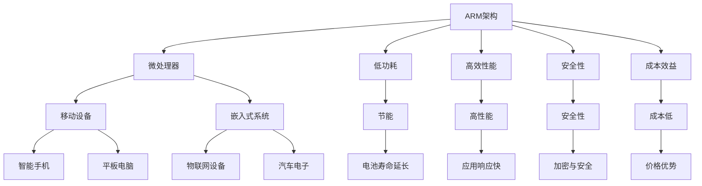

                 

# ARM架构：移动设备与嵌入式系统的核心

> 关键词：ARM架构, 移动设备, 嵌入式系统, 微处理器, 节能, 低功耗, 安全性

## 1. 背景介绍

在现代科技发展的浪潮中，移动设备和嵌入式系统已成为无处不在的科技基础设施。从智能手机到物联网设备，从汽车电子到可穿戴设备，ARM架构的微处理器无处不在。ARM架构以其卓越的性能、低功耗、高安全性和成本效益，成为了移动设备与嵌入式系统的首选架构。本文将深入探讨ARM架构的核心原理、应用领域以及未来发展趋势，帮助读者更好地理解这一至关重要的技术。

## 2. 核心概念与联系

### 2.1 核心概念概述

ARM架构是一种用于微处理器的指令集架构，由英国Acorn Computers公司于1985年设计并发布。它以其高效、节能和成本低廉的特点，广泛应用于移动设备和嵌入式系统领域。与常见的x86架构相比，ARM架构的微处理器具有更高的能效比和更低的功耗，同时提供了更高的安全性和更好的可扩展性。

### 2.2 核心概念原理和架构的 Mermaid 流程图



这个流程图展示了ARM架构与微处理器、移动设备和嵌入式系统的联系，以及ARM架构的主要优势：低功耗、高效性能、高安全性和成本效益。

## 3. 核心算法原理 & 具体操作步骤

### 3.1 算法原理概述

ARM架构的微处理器基于RISC（精简指令集计算）指令集架构。与CISC（复杂指令集计算）架构相比，RISC架构的指令集精简、功能单一，但执行速度更快、能效比更高。ARM架构的微处理器通过优化指令集、流水线技术、缓存机制等手段，实现了更高的性能和更低的功耗。

### 3.2 算法步骤详解

#### 3.2.1 指令集设计

ARM架构的指令集包括ARMv4、ARMv5、ARMv6、ARMv7、ARMv8等多个版本，每个版本都有其特定的指令集和性能特点。ARMv8引入了AArch64指令集，提供了更高的安全性和更好的可扩展性。

#### 3.2.2 流水线技术

ARM架构的微处理器采用了多级流水线技术，包括取指、译码、执行、写回等多个阶段。通过并行执行不同的指令，提高了处理器的效率。

#### 3.2.3 缓存机制

ARM架构的微处理器采用了缓存机制，包括数据缓存和指令缓存。缓存机制能够有效减少内存访问延迟，提高处理器的执行效率。

### 3.3 算法优缺点

#### 3.3.1 优点

- **高效性能**：ARM架构的微处理器执行速度快，适合高性能计算任务。
- **低功耗**：ARM架构的微处理器具有较低的功耗，适合移动设备和电池供电的嵌入式系统。
- **高安全性**：ARM架构的微处理器提供了多种安全特性，如TrustZone技术，增强了系统的安全性。
- **成本效益**：ARM架构的微处理器成本低廉，适合广泛的应用场景。

#### 3.3.2 缺点

- **复杂性**：ARM架构的微处理器设计复杂，开发难度较大。
- **性能瓶颈**：在处理高并发任务时，ARM架构的微处理器可能会出现性能瓶颈。

### 3.4 算法应用领域

ARM架构的微处理器广泛应用于以下领域：

- **移动设备**：如智能手机、平板电脑、可穿戴设备等。
- **嵌入式系统**：如物联网设备、汽车电子、医疗设备等。
- **服务器与数据中心**：如高密度计算、云计算等。
- **工业自动化**：如自动化控制、机器人等。

## 4. 数学模型和公式 & 详细讲解 & 举例说明

### 4.1 数学模型构建

ARM架构的微处理器通过RISC指令集执行计算任务。假设一个ARM微处理器执行一条指令，其执行过程可以用以下数学模型表示：

$$
T = C + M + W
$$

其中，$T$ 表示指令执行时间，$C$ 表示取指时间，$M$ 表示执行时间，$W$ 表示写回时间。

### 4.2 公式推导过程

以ARMv8架构为例，假设一条指令执行的时间为$T$，取指时间$C$为1ns，执行时间$M$为2ns，写回时间$W$为1ns，则指令执行时间$T$为：

$$
T = C + M + W = 1ns + 2ns + 1ns = 4ns
$$

### 4.3 案例分析与讲解

假设一个ARM微处理器需要执行100条指令，每条指令执行时间为4ns，则其总执行时间为：

$$
Total\ Time = 100 \times 4ns = 400ns
$$

## 5. 项目实践：代码实例和详细解释说明

### 5.1 开发环境搭建

搭建ARM架构的开发环境需要以下步骤：

1. **安装交叉编译工具链**：如GCC、G++等，用于将ARM架构的代码编译成可执行文件。
2. **安装ARM调试工具**：如GDB、Lldb等，用于调试ARM架构的程序。
3. **配置开发板**：如Raspberry Pi、NVIDIA Jetson等，用于测试ARM架构的代码。

### 5.2 源代码详细实现

以下是一个简单的ARM汇编代码示例，用于计算两个整数的和：

```assembly
.global main
main:
    ldr r0, =x
    ldr r1, =y
    add r2, r0, r1
    str r2, =z
    bx lr
x:
    .word 10
y:
    .word 20
z:
    .word 0
```

### 5.3 代码解读与分析

- **ldr指令**：用于将内存中的数据加载到寄存器中。
- **add指令**：用于将两个寄存器中的数据相加，结果存入另一个寄存器中。
- **str指令**：用于将寄存器中的数据存储到内存中。
- **bx指令**：用于跳转到子程序或函数。

### 5.4 运行结果展示

运行上述代码，将两个整数的和计算出来并存储在变量$z$中。

## 6. 实际应用场景

### 6.1 移动设备

ARM架构的微处理器在移动设备中得到了广泛应用，如智能手机、平板电脑、可穿戴设备等。这些设备对性能和功耗都有严格的要求，ARM架构的微处理器通过优化指令集、流水线技术和缓存机制，实现了高效的性能和低功耗，满足了移动设备的需求。

### 6.2 嵌入式系统

嵌入式系统通常对成本和功耗有严格要求，ARM架构的微处理器以其低成本、低功耗和高性能，成为了嵌入式系统的主流选择。例如，物联网设备、汽车电子、医疗设备等均采用了ARM架构的微处理器。

### 6.3 服务器与数据中心

ARM架构的微处理器在服务器与数据中心中也开始得到应用。例如，高密度计算、云计算等需要高性能和低功耗的计算环境，ARM架构的微处理器提供了优秀的性能和能效比。

### 6.4 未来应用展望

未来，ARM架构的微处理器将继续在移动设备、嵌入式系统、服务器与数据中心等领域发挥重要作用。随着ARM架构的不断发展，其在人工智能、机器学习等领域的应用也将得到拓展，进一步提升其在复杂计算任务中的表现。

## 7. 工具和资源推荐

### 7.1 学习资源推荐

- **《ARM Architecture and Programming》**：由Mark Orchard所著，详细介绍了ARM架构的原理和编程方法。
- **《ARM Assembly Language Programming》**：由Raj Kamble所著，介绍了ARM汇编语言的编程技巧和调试方法。
- **ARM Developer website**：提供了丰富的ARM架构资源，包括文档、工具、社区等。

### 7.2 开发工具推荐

- **GCC**：用于ARM架构的C语言和C++语言编程。
- **GDB**：用于ARM架构的程序调试。
- **Qemu**：用于ARM架构的模拟器和虚拟机。

### 7.3 相关论文推荐

- **"Energy-Efficient Mobile Device Architecture Design"**：研究了基于ARM架构的移动设备设计。
- **"Secure ARM Architecture Design"**：研究了基于ARM架构的安全设计。

## 8. 总结：未来发展趋势与挑战

### 8.1 研究成果总结

本文详细介绍了ARM架构的原理、应用领域和未来发展趋势。ARM架构以其高效性能、低功耗、高安全性和成本效益，成为移动设备与嵌入式系统的首选架构。

### 8.2 未来发展趋势

未来，ARM架构的微处理器将继续在移动设备、嵌入式系统、服务器与数据中心等领域发挥重要作用。随着ARM架构的不断发展，其在人工智能、机器学习等领域的应用也将得到拓展。

### 8.3 面临的挑战

尽管ARM架构具有诸多优势，但其复杂性和高并发处理能力仍是一个挑战。未来的研究需要进一步优化ARM架构的性能，提升其在高并发任务中的表现。

### 8.4 研究展望

未来的研究将进一步探索ARM架构在人工智能、机器学习等领域的潜力，同时优化其设计，提升其在高并发任务中的处理能力。

## 9. 附录：常见问题与解答

**Q1：ARM架构与x86架构有什么区别？**

A: ARM架构采用RISC指令集，而x86架构采用CISC指令集。RISC指令集精简，功能单一，执行速度更快，能效比更高；CISC指令集复杂，功能丰富，但执行速度较慢，能效比较低。

**Q2：ARM架构的微处理器如何实现低功耗？**

A: ARM架构的微处理器通过优化指令集、流水线技术和缓存机制，实现了较低的功耗。例如，ARM架构的微处理器采用了多级缓存机制，减少了内存访问延迟，提高了能效比。

**Q3：ARM架构的微处理器在服务器与数据中心中的应用有哪些？**

A: ARM架构的微处理器在服务器与数据中心中的应用包括高密度计算、云计算等。ARM架构的微处理器以其低功耗和高性能，满足了服务器与数据中心对高性能和低功耗的需求。

**Q4：如何提高ARM架构的微处理器的性能？**

A: 提高ARM架构的微处理器的性能需要优化指令集、流水线技术和缓存机制。例如，通过增加流水线的深度，减少内存访问延迟，优化缓存机制，提高处理器的效率。

**Q5：ARM架构的微处理器在移动设备中的应用有哪些？**

A: ARM架构的微处理器在移动设备中的应用包括智能手机、平板电脑、可穿戴设备等。这些设备对性能和功耗有严格的要求，ARM架构的微处理器通过优化指令集、流水线技术和缓存机制，实现了高效的性能和低功耗，满足了移动设备的需求。

---

作者：禅与计算机程序设计艺术 / Zen and the Art of Computer Programming

