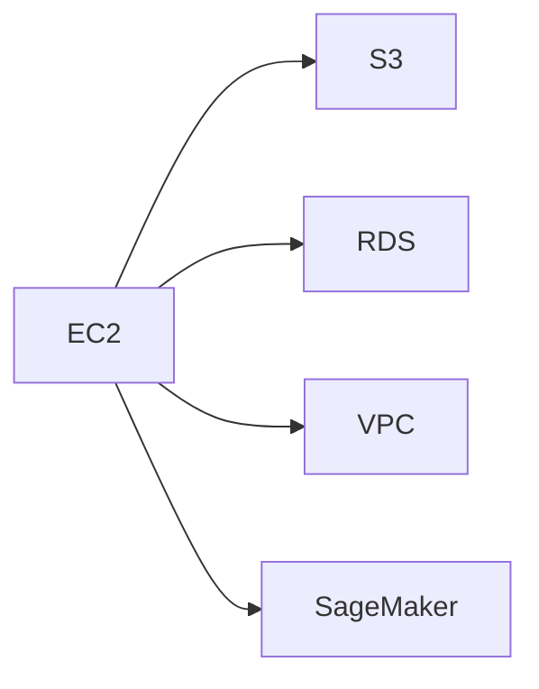

                 

# AWS云计算服务应用开发

## 1. 背景介绍

随着云计算技术的不断发展，越来越多的企业开始将业务上云，享受云计算带来的便捷和高效。AWS（Amazon Web Services）作为全球领先的云计算服务提供商，其丰富的云服务产品已经覆盖了计算、存储、网络、安全、人工智能等诸多领域，成为企业数字化转型的重要工具。AWS以其高度的灵活性和可扩展性，为企业提供了从开发到运维的全面支持。

本文章将全面介绍AWS云计算服务的应用开发，从基础设施搭建、应用程序构建到云上安全运维，逐步深入解析AWS如何帮助企业构建稳定、高效、安全的云应用环境。通过系统讲解AWS云服务的核心概念和技术细节，旨在帮助读者掌握云应用开发的完整流程，从零开始构建自己的云应用，推动企业云化进程。

## 2. 核心概念与联系

### 2.1 核心概念概述

云计算作为一项先进的技术，为企业提供了按需计费、弹性扩展、高可用性等优势，大大降低了IT基础设施的维护成本。AWS作为云计算的领头羊，其提供的云服务涵盖了多个层面，包括计算服务（如EC2）、存储服务（如S3）、网络服务（如VPC）、数据库服务（如RDS）、人工智能服务（如SageMaker）等。

1. **EC2（Elastic Compute Cloud）**：AWS的计算服务，提供基于实例的计算资源，适用于各种计算需求。
2. **S3（Simple Storage Service）**：AWS的云存储服务，提供简单、低成本的存储方案，支持高度可扩展的分布式存储。
3. **VPC（Virtual Private Cloud）**：AWS的网络服务，提供隔离的网络环境，支持自定义的子网、路由、安全性等。
4. **RDS（Relational Database Service）**：AWS的关系型数据库服务，提供托管的数据库实例，支持MySQL、PostgreSQL等多种数据库引擎。
5. **SageMaker**：AWS的机器学习平台，提供便捷的模型训练和部署功能，支持深度学习框架TensorFlow、PyTorch等。

这些核心服务相互配合，构成了AWS的云计算生态，为企业提供了全面的云服务支持。

### 2.2 核心概念原理和架构的 Mermaid 流程图



上图中展示了AWS核心服务的联系：计算实例（EC2）可以从S3中获取数据，并将处理结果存储到RDS中；同时，计算实例可以通过VPC与其他服务进行通信，并使用SageMaker进行机器学习模型的训练和部署。

## 3. 核心算法原理 & 具体操作步骤

### 3.1 算法原理概述

AWS云服务的应用开发，主要依赖于云平台提供的各种资源和工具，通过API接口进行配置和管理。以EC2为例，其核心算法原理包括：

1. **虚拟化技术**：将物理硬件抽象为多个虚拟计算实例，每个实例独立运行，提供所需的计算资源。
2. **弹性扩展**：根据业务需求动态调整计算实例的规模，确保系统的高可用性和性能。
3. **自服务模型**：用户通过AWS Management Console或SDK进行资源申请和管理，无需关心底层硬件和网络细节。

### 3.2 算法步骤详解

以在AWS上部署一个简单的Web应用程序为例，具体步骤如下：

**Step 1: 创建EC2实例**
- 登录AWS Management Console，导航到EC2控制台。
- 点击“实例”，选择“启动实例”。
- 在“实例类型”中选择适合应用的实例类型。
- 配置安全组规则，确保实例能够访问互联网。
- 设置实例的存储、网络、安全等参数，完成实例创建。

**Step 2: 安装应用程序**
- 通过SSH连接实例，进入Linux命令行环境。
- 安装操作系统依赖包，例如在Ubuntu上安装`apt`。
- 安装Web服务器和应用程序依赖，例如在Nginx上安装`php`。
- 将应用程序部署到Web服务器，例如上传HTML文件到`/etc/nginx/sites-available/`目录。
- 配置Nginx启动脚本，使Web服务器自动启动。

**Step 3: 配置域名和负载均衡**
- 注册域名，并将域名指向EC2实例的公网IP地址。
- 创建负载均衡器，将域名解析到负载均衡器上。
- 在负载均衡器中添加实例，确保请求能够均衡分配到各个实例上。
- 配置负载均衡器的健康检查，确保只有健康的实例能够接收请求。

**Step 4: 监控和优化**
- 使用AWS CloudWatch进行系统监控，收集实例的CPU使用率、网络流量等数据。
- 根据监控数据调整实例类型或规模，优化性能。
- 使用AWS Elastic Beanstalk进行应用自动扩展，支持自动部署和负载均衡。

### 3.3 算法优缺点

AWS云服务的应用开发具有以下优点：

1. **高可用性和弹性扩展**：AWS提供了自动扩展和故障转移功能，确保应用的高可用性和弹性扩展。
2. **易于管理和配置**：AWS提供了丰富的管理控制台和SDK，支持一键式配置和管理，降低了IT运维成本。
3. **全球部署和访问**：AWS支持全球部署，用户可以轻松访问全球各地的数据中心，提升应用的全球可用性。

同时，AWS云服务的应用开发也存在一些缺点：

1. **成本较高**：对于一些资源需求较小的应用，AWS的按需付费方式可能成本较高。
2. **服务依赖性**：应用开发和运维高度依赖AWS平台，一旦平台出现问题，应用可能面临风险。
3. **学习曲线陡峭**：AWS提供的服务众多，功能强大，但使用门槛较高，需要一定的学习曲线。

### 3.4 算法应用领域

AWS云服务的应用开发覆盖了多个领域，包括但不限于：

1. **Web应用**：使用EC2、RDS、S3等资源，构建高性能、高可用的Web应用。
2. **微服务架构**：通过AWS Fargate、ECS等服务，构建可伸缩、自服务的微服务架构。
3. **大数据分析**：使用AWS Redshift、SageMaker等服务，构建大数据分析平台。
4. **物联网应用**：通过AWS IoT、S3等服务，构建物联网设备管理和数据存储方案。
5. **机器学习和AI**：使用AWS SageMaker、Rekognition等服务，构建机器学习和AI应用。

## 4. 数学模型和公式 & 详细讲解 & 举例说明

### 4.1 数学模型构建

以EC2实例的CPU使用率监控为例，可以使用以下数学模型进行建模：

设EC2实例的CPU使用率为$CPU_{use}$，时间$t$内CPU使用率的平均值为$\bar{CPU}_{use}$，实例的CPU性能指标为$C_{perf}$，实例的CPU高峰使用率为$CPU_{peak}$，时间窗口大小为$T_{win}$。

**模型表达式**：
$$
\bar{CPU}_{use} = \frac{1}{T_{win}} \int_t^{t+T_{win}} CPU_{use} dt
$$
$$
C_{perf} = \frac{\bar{CPU}_{use}}{CPU_{peak}}
$$

通过计算CPU使用率的平均值和高峰使用率的比值，可以评估实例的性能和弹性扩展能力。

### 4.2 公式推导过程

以S3服务为例，其核心公式推导包括存储成本计算、上传下载速率计算等。

**存储成本计算公式**：
$$
Cost_{S3} = \text{用量} \times \text{价格} = \text{存储量} \times \text{价格/GB} + \text{请求次数} \times \text{请求费用}
$$

其中，存储量指S3中存储的数据量，请求次数指对S3进行读写操作的次数。

**上传下载速率计算公式**：
$$
\text{上传速率} = \frac{\text{上传数据量}}{\text{上传时间}}
$$
$$
\text{下载速率} = \frac{\text{下载数据量}}{\text{下载时间}}
$$

通过计算上传和下载速率，可以评估S3服务的数据传输性能。

### 4.3 案例分析与讲解

以S3服务为例，分析其在企业数据存储中的应用。

**案例背景**：
某企业需要存储大量日志数据，需要将日志文件上传到S3中进行存储和备份。

**方案设计**：
1. 创建S3存储桶，设置访问控制策略，确保数据安全。
2. 编写Python脚本，将日志文件上传到S3中。
3. 使用AWS SDK进行文件上传操作，设置并发上传，提高上传效率。
4. 通过AWS CloudWatch监控上传进度和成本，优化上传策略。

## 5. 项目实践：代码实例和详细解释说明

### 5.1 开发环境搭建

要在AWS上搭建开发环境，需要先进行以下几个步骤：

1. 注册AWS账号，创建IAM角色，授权访问云服务。
2. 安装AWS CLI，使用命令行进行资源管理。
3. 安装AWS SDK，使用SDK进行编程操作。
4. 创建VPC、子网、安全组等网络资源，确保实例能够访问互联网。
5. 创建EC2实例，安装操作系统和应用程序，配置访问权限。

### 5.2 源代码详细实现

以在EC2实例上部署Nginx Web服务器为例，源代码实现如下：

```python
import boto3
import os

# 创建EC2实例
ec2 = boto3.client('ec2')
instance = ec2.run_instances(
    ImageId='ami-0c55b159cb8645f0a',
    InstanceType='t2.micro',
    MinCount=1,
    MaxCount=1,
    KeyName='mykey'
)
instance_id = instance['Instances'][0]['InstanceId']

# 配置实例
ec2.modify_instance_attribute(
    InstanceId=instance_id,
    KeyName='mykey'
)

# 安装Nginx
ssh = paramiko.SSHClient()
ssh.set_missing_host_key_policy(paramiko.AutoAddPolicy())
ssh.connect('ec2-18-222-222-222.compute-1.amazonaws.com', username='ec2-user', key_filename='mykey.pem')
stdin, stdout, stderr = ssh.exec_command('sudo apt update; sudo apt install nginx')
ssh.close()

# 配置Nginx
with open('/etc/nginx/sites-available/default', 'w') as f:
    f.write('location / {\n  root /var/www/html;\n  index index.html;\n}')
with open('/etc/nginx/sites-available/example', 'w') as f:
    f.write('location /example/ {\n  root /var/www/html;\n  index index.html;\n}')
os.symlink('/etc/nginx/sites-available/example', '/etc/nginx/sites-enabled/example')
os.symlink('/etc/nginx/sites-available/default', '/etc/nginx/sites-enabled/default')

# 启动Nginx
os.system('sudo systemctl enable nginx && sudo systemctl start nginx')
```

### 5.3 代码解读与分析

在上述代码中，主要实现了以下功能：

1. 使用AWS CLI创建EC2实例，并设置访问权限。
2. 通过SSH连接实例，安装Nginx服务器。
3. 编写Nginx配置文件，配置访问规则和根目录。
4. 启动Nginx服务，使Web服务器能够正常工作。

在实际应用中，可以根据具体需求，修改实例类型、操作系统、应用程序等配置，满足不同的业务需求。

### 5.4 运行结果展示

运行上述代码后，可以通过Web浏览器访问EC2实例的IP地址，查看Nginx服务器的响应。例如，访问`http://ec2-18-222-222-222.compute-1.amazonaws.com`，可以看到Nginx欢迎页面。

## 6. 实际应用场景

AWS云服务在多个行业领域得到广泛应用，包括但不限于：

1. **金融行业**：使用AWS RDS、S3、ECS等服务，构建高性能、高可用的金融交易系统。
2. **零售行业**：使用AWS S3、SQS、SNS等服务，构建实时数据分析和业务通知系统。
3. **医疗行业**：使用AWS S3、Redshift等服务，构建大容量医疗数据存储和分析平台。
4. **教育行业**：使用AWS Lambda、API Gateway等服务，构建灵活的教育应用和云教育平台。
5. **政府行业**：使用AWS VPC、SNS等服务，构建安全、可靠的政府数据中心和信息共享平台。

## 7. 工具和资源推荐

### 7.1 学习资源推荐

要深入学习AWS云服务的应用开发，可以关注以下几个资源：

1. **AWS官方文档**：提供全面的云服务API文档和用户指南，是学习AWS的基础。
2. **AWS官方博客**：分享AWS最新的产品发布和技术更新，提供丰富的实践案例和最佳实践。
3. **AWS认证培训**：提供官方认证课程和考试，帮助开发者掌握AWS核心技术和实践经验。
4. **AWS社区**：加入AWS社区，与其他开发者交流经验和解决问题。

### 7.2 开发工具推荐

开发AWS云服务应用程序，可以使用以下工具：

1. **AWS CLI**：AWS命令行工具，支持资源管理和API操作。
2. **AWS SDK**：AWS SDK提供编程接口，方便开发者进行云资源操作。
3. **Boto3**：Python SDK，提供Python接口，支持对AWS服务的调用和管理。
4. **Terraform**：云资源管理工具，支持自动化云资源部署和配置。
5. **Ansible**：自动化工具，支持自动化云资源配置和管理。

### 7.3 相关论文推荐

为了深入了解AWS云服务的应用开发，可以参考以下论文：

1. **"Designing Secure and Reliable Cloud Applications with Amazon Web Services"**：讨论如何构建安全、可靠的AWS云应用，详细介绍了AWS的安全管理和运维策略。
2. **"Amazon Web Services for Data Science"**：介绍了AWS的大数据服务，包括SageMaker、Redshift等服务，讨论了数据科学应用的数据处理和分析。
3. **"Using AWS Lambda to Process Image Metadata with Deep Learning"**：分享了使用AWS Lambda和SageMaker进行图像处理的实践案例，展示了AWS的机器学习服务在图像识别中的应用。
4. **"Managing Distributed Database Systems with Amazon Relational Database Service (RDS)"**：讨论了AWS RDS在分布式数据库系统中的应用，介绍了RDS的高可用性和弹性扩展特性。
5. **"Optimizing Costs with Amazon Simple Storage Service (S3) Tiering"**：介绍了AWS S3的层次存储策略，优化存储成本和访问性能。

## 8. 总结：未来发展趋势与挑战

### 8.1 研究成果总结

AWS云服务的应用开发在过去几年中取得了显著进展，主要体现在以下几个方面：

1. **云服务生态的不断完善**：AWS不断推出新的云服务产品，覆盖更多应用场景，满足不同企业的需求。
2. **应用开发工具的丰富化**：AWS提供多种编程接口和工具，帮助开发者更方便地进行云应用开发和管理。
3. **云应用架构的多样化**：AWS支持微服务、事件驱动、无服务器等架构模式，提升云应用的可伸缩性和灵活性。

### 8.2 未来发展趋势

未来，AWS云服务的应用开发将继续朝着以下几个方向发展：

1. **AI与云服务的深度融合**：AWS将进一步增强机器学习和AI服务，推动企业构建更加智能化的云应用。
2. **云原生应用的普及**：随着云原生技术的发展，更多企业将采用云原生架构，构建可伸缩、高可用、高弹性的云应用。
3. **边缘计算的扩展**：AWS将扩展边缘计算能力，支持更多的离线和边缘计算场景，提升云应用的时效性和用户体验。
4. **多云和混合云的普及**：企业将更加关注多云和混合云的建设，实现不同云平台之间的协同和优化。
5. **自动化和运维的提升**：AWS将进一步提升云应用的自动化和运维能力，降低企业的IT运维成本。

### 8.3 面临的挑战

虽然AWS云服务的应用开发取得了显著进展，但仍面临一些挑战：

1. **云服务成本控制**：随着云资源使用量的增加，如何控制成本，优化资源配置，是一个亟待解决的问题。
2. **云服务安全性**：AWS云服务的安全性和隐私保护是企业关注的重点，如何保护数据安全，防止数据泄露，是云服务的重要挑战。
3. **云服务的可靠性**：尽管AWS云服务提供高可用性保障，但在极端情况下，如何保证服务稳定性，避免系统故障，仍然是一个挑战。
4. **云服务的可管理性**：随着云服务种类和数量的增加，如何高效管理云资源，确保资源的合理分配和利用，是一个重要问题。
5. **云服务的互联互通**：如何实现不同云平台之间的互联互通，提升企业的多云应用能力，是未来需要解决的关键问题。

### 8.4 研究展望

未来，AWS云服务的应用开发需要从以下几个方向进行深入研究：

1. **云成本优化技术**：研究如何通过自动调度和资源共享等技术，降低云服务成本，优化资源配置。
2. **云安全技术**：研究如何增强云服务的安全性，采用先进的加密和认证技术，保护数据隐私。
3. **云平台互联互通**：研究如何实现不同云平台之间的数据交换和应用集成，提升多云应用能力。
4. **云应用性能优化**：研究如何通过分布式计算和存储等技术，提升云应用的性能和可伸缩性。
5. **云服务可靠性增强**：研究如何通过冗余和容错技术，提升云服务的可靠性，避免单点故障。

## 9. 附录：常见问题与解答

**Q1: AWS云服务有哪些主要组成部分？**

A: AWS云服务主要包括以下几个组成部分：

1. **计算服务（EC2）**：提供基于实例的计算资源，支持灵活的实例类型和弹性扩展。
2. **存储服务（S3）**：提供简单、低成本的存储方案，支持高度可扩展的分布式存储。
3. **网络服务（VPC）**：提供隔离的网络环境，支持自定义的子网、路由、安全性等。
4. **数据库服务（RDS）**：提供托管的数据库实例，支持MySQL、PostgreSQL等多种数据库引擎。
5. **安全服务（IAM、SNS、SQS等）**：提供身份管理、消息队列、事件驱动等服务。

**Q2: 如何优化AWS云服务的应用开发？**

A: 优化AWS云服务的应用开发可以从以下几个方面入手：

1. **选择合适的服务**：根据应用需求，选择合适的AWS服务，避免资源浪费。
2. **优化资源配置**：使用自动扩展和弹性伸缩功能，确保系统高可用性和性能。
3. **合理管理成本**：根据使用情况，合理配置资源，避免不必要的资源浪费。
4. **增强安全性**：使用IAM和VPC等安全服务，确保数据安全和访问控制。
5. **提高运维效率**：使用AWS云监视和自动化工具，提高运维效率和系统稳定性。

**Q3: 如何构建高效的AWS云应用？**

A: 构建高效的AWS云应用需要关注以下几个方面：

1. **架构设计**：采用微服务、事件驱动、无服务器等架构模式，提升系统的可伸缩性和灵活性。
2. **性能优化**：优化代码和数据库设计，提升应用的性能和响应速度。
3. **自动化管理**：使用AWS自动化工具，如Terraform、Ansible等，提升资源管理和部署效率。
4. **持续集成和部署**：使用CI/CD工具，自动化代码构建和部署，确保应用的稳定性和可靠性。
5. **监控和调优**：使用AWS CloudWatch等工具，实时监控应用性能，进行调优和优化。

通过上述系统分析和实践指导，相信读者能够全面掌握AWS云服务的应用开发技术，构建高效、稳定、安全的云应用。

---

作者：禅与计算机程序设计艺术 / Zen and the Art of Computer Programming

