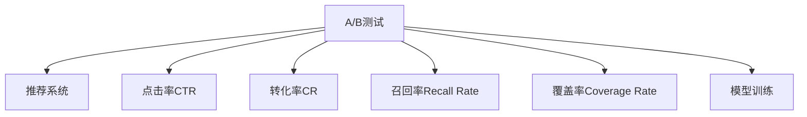

                 

# A/B测试在推荐策略优化中的作用

## 1. 背景介绍

### 1.1 问题由来

在推荐系统的优化中，A/B测试作为一种科学的实验方法，被广泛应用于比较新旧推荐策略的效果。通过科学合理的A/B测试，可以快速找到最优的推荐策略，同时确保推荐的准确性和用户满意度。近年来，随着在线业务的快速发展，A/B测试在推荐系统中的应用越来越广泛，成为提升用户体验和业务收益的重要手段。

### 1.2 问题核心关键点

在推荐系统的优化过程中，A/B测试可以帮助开发人员快速评估不同推荐策略的效果，识别出最适合用户的推荐方式。同时，A/B测试还可以帮助优化推荐系统的各个环节，包括推荐算法、特征工程、模型训练等，提升推荐系统的整体效果。

### 1.3 问题研究意义

A/B测试在推荐系统的优化中具有重要意义。通过A/B测试，可以：
- 识别最优推荐策略：通过对比新旧推荐策略的效果，快速找到最有效的推荐方式。
- 优化系统各个环节：通过A/B测试，可以系统性地优化推荐系统的各个环节，提升推荐效果。
- 提升用户体验和收益：通过优化推荐策略，提高用户的满意度和转化率，增加平台的收益。
- 保障决策的科学性：通过A/B测试，可以科学合理地选择推荐策略，避免决策的盲目性。

## 2. 核心概念与联系

### 2.1 核心概念概述

为了更好地理解A/B测试在推荐策略优化中的作用，本节将介绍几个密切相关的核心概念：

- A/B测试（A/B Testing）：通过对比两种或多种策略的效果，确定哪种策略更优的一种实验方法。广泛应用于产品优化、营销策略选择等领域。
- 推荐系统（Recommender System）：利用用户行为数据和物品属性数据，为用户推荐可能感兴趣或满意物品的系统。
- 点击率（Click-Through Rate, CTR）：衡量用户点击推荐结果的概率，是推荐系统优化的重要指标之一。
- 转化率（Conversion Rate, CR）：衡量用户完成推荐行为的概率，如购买、注册等，是推荐系统优化的重要指标之一。
- 召回率（Recall Rate）：衡量推荐系统推荐出用户感兴趣物品的概率，是推荐系统优化的重要指标之一。
- 覆盖率（Coverage Rate）：衡量推荐系统推荐出所有用户感兴趣物品的概率，是推荐系统优化的重要指标之一。
- 模型训练（Model Training）：通过大量标注数据和机器学习算法，训练推荐模型的过程。

这些核心概念之间的逻辑关系可以通过以下Mermaid流程图来展示：

这个流程图展示了大语言模型微调的核

