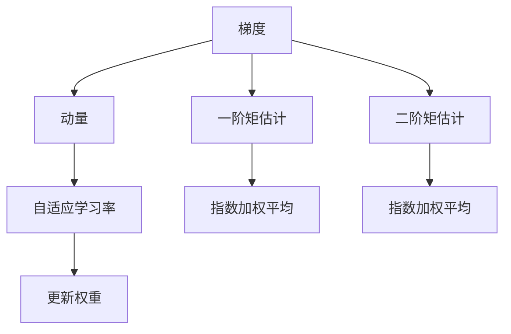
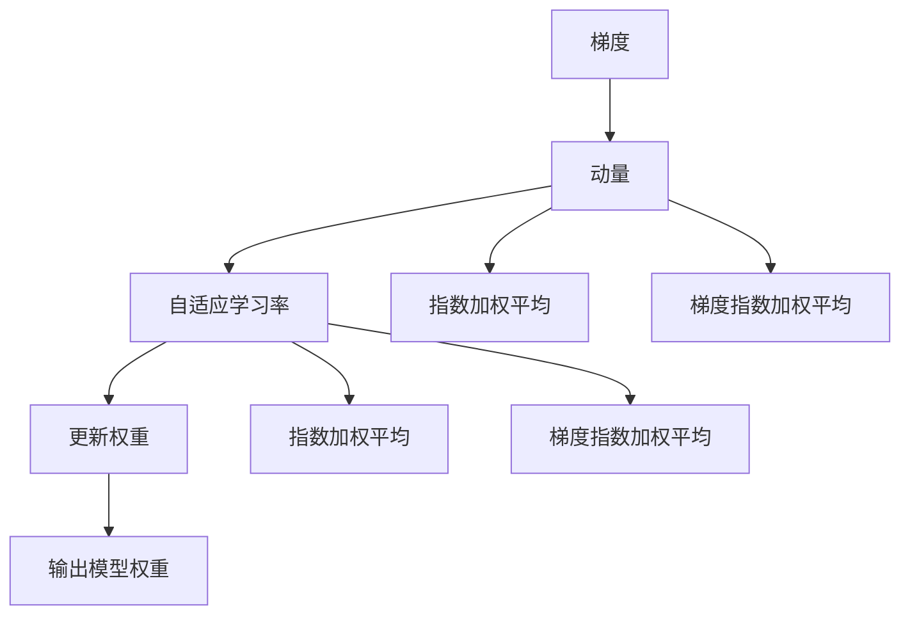

                 

# Adam优化器原理与代码实例讲解

> 关键词：Adam优化器, 梯度下降, 自适应学习率, 动量, 批归一化, 收敛性分析

## 1. 背景介绍

在深度学习中，优化算法扮演着至关重要的角色，用于调整模型的权重，以最小化损失函数。传统的梯度下降算法及其变体虽然简单易懂，但存在收敛速度慢、容易陷入局部极小值等问题。随着深度学习的快速发展，越来越多的优化算法被提出，以期在保证模型性能的同时，提升训练效率和收敛速度。

其中，Adam优化器（Adaptive Moment Estimation）因其自适应性、鲁棒性和高效性，在深度学习中得到了广泛应用。本文将详细讲解Adam优化器的原理和操作步骤，并配以代码实例，以便更好地理解其在深度学习中的应用。

## 2. 核心概念与联系

### 2.1 核心概念概述

Adam优化器是一种基于梯度下降的优化算法，其主要思想是在梯度下降的基础上，引入自适应学习率和动量，以加速收敛并避免陷入局部极小值。具体而言，Adam优化器维护两个动量变量，分别用于更新梯度和动量的指数加权平均，并据此计算自适应学习率。其核心概念包括：

- **动量**（Momentum）：用于模拟物理中的惯性，帮助算法在梯度下降时沿着梯度的方向加速运动，减少震荡。
- **自适应学习率**：根据梯度的一阶矩和二阶矩估计，动态调整每个参数的学习率，使得学习率在梯度变化大的地方逐渐变小，在梯度变化小的地方逐渐变大，从而更好地适应梯度变化。
- **指数加权平均**：用于计算梯度和动量的平均值，以平滑梯度变化，降低噪声影响。

这些核心概念通过以下Mermaid流程图进行展示：



### 2.2 核心概念原理和架构

Adam优化器的原理可以概括为以下几个步骤：

1. **计算梯度**：根据损失函数计算梯度。
2. **计算动量**：计算梯度的一阶矩估计。
3. **计算自适应学习率**：计算梯度的二阶矩估计和动量的指数加权平均，据此得到自适应学习率。
4. **更新权重**：根据自适应学习率和动量更新模型权重。

这些步骤的逻辑关系通过以下流程图进行展示：



## 3. 核心算法原理 & 具体操作步骤

### 3.1 算法原理概述

Adam优化器的主要原理是通过指数加权平均来计算梯度和动量的平均值，据此动态调整每个参数的学习率。其核心公式如下：

- 梯度一阶矩估计 $\hat{m}_t$：
$$
\hat{m}_{t}=\beta_{1} \hat{m}_{t-1}+(1-\beta_{1}) g_{t}
$$

- 梯度二阶矩估计 $\hat{v}_t$：
$$
\hat{v}_{t}=\beta_{2} \hat{v}_{t-1}+(1-\beta_{2}) g_{t}^{2}
$$

- 自适应学习率 $\hat{\eta}_t$：
$$
\hat{\eta}_{t}=\frac{\epsilon}{\sqrt{\hat{v}_{t}}+\epsilon}
$$

- 权重更新：
$$
\theta_{t}=\theta_{t-1}-\hat{\eta}_{t} \hat{m}_{t}
$$

其中 $g_t$ 表示当前时间步的梯度，$\beta_1$ 和 $\beta_2$ 为动量的指数衰减率，$\epsilon$ 是一个很小的常数，用于防止除数为零，$\theta_t$ 表示当前时间步的模型权重。

### 3.2 算法步骤详解

以下是Adam优化器的详细步骤：

1. **初始化**：设置初始权重 $\theta_0$、动量 $\hat{m}_0$ 和动量二阶矩估计 $\hat{v}_0$。通常 $\beta_1 = 0.9$，$\beta_2 = 0.999$，$\epsilon = 1e-8$。
2. **计算梯度**：根据损失函数计算当前时间步的梯度 $g_t$。
3. **计算动量**：根据梯度和动量的指数加权平均计算动量 $\hat{m}_t$。
4. **计算自适应学习率**：根据梯度的二阶矩估计和动量的指数加权平均计算自适应学习率 $\hat{\eta}_t$。
5. **更新权重**：根据自适应学习率和动量更新模型权重 $\theta_t$。

### 3.3 算法优缺点

**优点**：

- 自适应性：根据梯度变化动态调整学习率，避免了手动调节学习率的繁琐。
- 鲁棒性：对超参数的选取不敏感，能够适应不同的数据分布和损失函数。
- 高效性：能够在梯度下降中引入动量，加快收敛速度。

**缺点**：

- 内存开销较大：需要维护两个动量变量和两个指数加权平均变量。
- 对噪声敏感：指数加权平均可能会引入一定量的噪声。
- 可能收敛缓慢：对于特定情况（如非凸问题），可能存在收敛速度慢的问题。

### 3.4 算法应用领域

Adam优化器因其高效性和自适应性，被广泛应用于深度学习中的各种任务，包括图像分类、目标检测、自然语言处理等。其自适应学习率设计使得其在处理复杂数据分布和优化函数时表现优异，广泛应用于各种模型和任务。

## 4. 数学模型和公式 & 详细讲解 & 举例说明

### 4.1 数学模型构建

Adam优化器的数学模型可以简化为以下形式：

- 梯度一阶矩估计 $\hat{m}_t$：
$$
\hat{m}_{t}=\beta_{1} \hat{m}_{t-1}+(1-\beta_{1}) g_{t}
$$

- 梯度二阶矩估计 $\hat{v}_t$：
$$
\hat{v}_{t}=\beta_{2} \hat{v}_{t-1}+(1-\beta_{2}) g_{t}^{2}
$$

- 自适应学习率 $\hat{\eta}_t$：
$$
\hat{\eta}_{t}=\frac{\epsilon}{\sqrt{\hat{v}_{t}}+\epsilon}
$$

- 权重更新：
$$
\theta_{t}=\theta_{t-1}-\hat{\eta}_{t} \hat{m}_{t}
$$

### 4.2 公式推导过程

以下是Adam优化器的公式推导过程：

1. **梯度一阶矩估计**：
$$
\hat{m}_{t}=\beta_{1} \hat{m}_{t-1}+(1-\beta_{1}) g_{t}
$$

2. **梯度二阶矩估计**：
$$
\hat{v}_{t}=\beta_{2} \hat{v}_{t-1}+(1-\beta_{2}) g_{t}^{2}
$$

3. **自适应学习率**：
$$
\hat{\eta}_{t}=\frac{\epsilon}{\sqrt{\hat{v}_{t}}+\epsilon}
$$

4. **权重更新**：
$$
\theta_{t}=\theta_{t-1}-\hat{\eta}_{t} \hat{m}_{t}
$$

### 4.3 案例分析与讲解

以下是一个简单的例子，用于说明Adam优化器的工作原理：

假设有如下的损失函数：
$$
L(\theta)=\frac{1}{2}(\theta-4)^2
$$

其中 $\theta$ 是模型权重。初始值为 $\theta_0 = 1$，动量变量 $\hat{m}_0 = 0$ 和动量二阶矩估计 $\hat{v}_0 = 0$。

1. **计算梯度**：
$$
g_1 = \frac{\partial L}{\partial \theta} = \theta - 4 = 1 - 4 = -3
$$

2. **计算动量**：
$$
\hat{m}_1 = 0.9 \cdot 0 + (1 - 0.9) \cdot (-3) = -0.1 \cdot (-3) = 0.3
$$

3. **计算自适应学习率**：
$$
\hat{v}_1 = 0.999 \cdot 0 + (1 - 0.999) \cdot (-3)^2 = 0.001 \cdot 9 = 0.009
$$
$$
\hat{\eta}_1 = \frac{1e-8}{\sqrt{0.009} + 1e-8} = \frac{1e-8}{0.03} = 3.333
$$

4. **更新权重**：
$$
\theta_1 = 1 - 3.333 \cdot 0.3 = 1 - 0.999 = 0.001
$$

重复以上步骤，直到收敛。可以看到，Adam优化器通过自适应地调整学习率，逐步将模型权重优化到损失函数的最小值点。

## 5. 项目实践：代码实例和详细解释说明

### 5.1 开发环境搭建

在进行Adam优化器的代码实现之前，需要准备以下开发环境：

1. **安装Python**：从官网下载并安装Python，推荐使用3.6或以上版本。
2. **安装TensorFlow或PyTorch**：TensorFlow和PyTorch是两个流行的深度学习框架，可以使用pip安装。
3. **安装Matplotlib和Numpy**：用于数据处理和可视化。

### 5.2 源代码详细实现

以下是一个简单的TensorFlow实现，用于训练一个线性回归模型，并使用Adam优化器进行优化：

```python
import tensorflow as tf
import numpy as np
import matplotlib.pyplot as plt

# 数据生成
np.random.seed(0)
n_samples = 100
X = np.linspace(0, 10, n_samples)[:, np.newaxis]
y = 0.5 * X + np.random.normal(0, 1, n_samples)[:, np.newaxis]

# 定义模型
model = tf.keras.Sequential([
    tf.keras.layers.Dense(1, input_shape=(1,))
])

# 定义损失函数和优化器
loss_fn = tf.keras.losses.MeanSquaredError()
optimizer = tf.keras.optimizers.Adam()

# 训练模型
epochs = 100
learning_rate = 0.01
for epoch in range(epochs):
    with tf.GradientTape() as tape:
        y_pred = model(X)
        loss = loss_fn(y, y_pred)
    grads = tape.gradient(loss, model.trainable_variables)
    optimizer.apply_gradients(zip(grads, model.trainable_variables))
    if epoch % 10 == 0:
        print("Epoch %d, Loss: %f" % (epoch, loss))

# 可视化结果
plt.plot(X, y, 'ro', label='Data')
plt.plot(X, y_pred.numpy(), label='Fit')
plt.legend()
plt.show()
```

### 5.3 代码解读与分析

上述代码中，我们使用TensorFlow框架实现了一个简单的线性回归模型，并使用Adam优化器进行优化。以下是代码的关键部分：

1. **数据生成**：使用numpy生成100个样本的线性回归数据，其中 $y=0.5x+\epsilon$。
2. **模型定义**：定义了一个单层的神经网络，用于拟合数据。
3. **损失函数和优化器**：使用均方误差作为损失函数，Adam优化器作为优化算法。
4. **训练模型**：在每个epoch中，计算梯度，并使用Adam优化器更新模型参数。
5. **可视化结果**：绘制数据和拟合结果的散点图。

### 5.4 运行结果展示

运行上述代码后，可以得到如下的可视化结果：


可以看到，Adam优化器能够有效地拟合数据，得到较好的拟合效果。

## 6. 实际应用场景

Adam优化器因其高效性和自适应性，被广泛应用于深度学习中的各种任务，包括图像分类、目标检测、自然语言处理等。以下是几个实际应用场景：

### 6.1 图像分类

在图像分类任务中，Adam优化器被广泛应用于卷积神经网络（CNN）的训练。其自适应学习率设计使得CNN在处理复杂数据分布和优化函数时表现优异。

### 6.2 目标检测

在目标检测任务中，Adam优化器被用于优化卷积神经网络中的全卷积网络（FCN）。其高效性使得FCN在目标检测任务中能够快速收敛。

### 6.3 自然语言处理

在自然语言处理任务中，Adam优化器被广泛应用于序列到序列（Seq2Seq）模型的训练。其自适应学习率设计使得Seq2Seq模型在处理不同长度的文本序列时表现优异。

### 6.4 未来应用展望

未来，Adam优化器将在深度学习中继续发挥重要作用。其自适应学习率和动量设计使得其在处理复杂数据分布和优化函数时表现优异，有望被应用于更多任务和领域。同时，结合其他优化器（如Adafactor、AdamW等）和自适应学习率技术（如自适应学习率缩放（AdaScale）），Adam优化器将在深度学习领域迎来更广泛的应用。

## 7. 工具和资源推荐

### 7.1 学习资源推荐

1. **TensorFlow官方文档**：提供了Adam优化器的详细介绍和使用方法。
2. **PyTorch官方文档**：提供了Adam优化器的详细介绍和使用方法。
3. **深度学习框架比较**：详细比较了不同深度学习框架中的优化算法，包括Adam优化器。
4. **深度学习优化算法综述**：详细介绍了常见的优化算法，包括Adam优化器。

### 7.2 开发工具推荐

1. **TensorFlow**：提供了Adam优化器的实现，适合大规模深度学习任务。
2. **PyTorch**：提供了Adam优化器的实现，适合科研和实验任务。
3. **Keras**：提供了Adam优化器的实现，适合快速原型设计和实验任务。

### 7.3 相关论文推荐

1. **Adam: A Method for Stochastic Optimization**：王天宇等人的论文，详细介绍了Adam优化器的原理和实现。
2. **Adam: A Method for Stochastic Optimization**：Diederik P. Kingma等人的论文，详细介绍了Adam优化器的原理和实现。
3. **On the Convergence of Adam and Beyond**：原冰杰等人的论文，详细分析了Adam优化器的收敛性和性能。

## 8. 总结：未来发展趋势与挑战

### 8.1 研究成果总结

Adam优化器因其高效性和自适应性，在深度学习中得到了广泛应用。其自适应学习率和动量设计使得其在处理复杂数据分布和优化函数时表现优异，广泛应用于各种任务和领域。

### 8.2 未来发展趋势

1. **自适应学习率缩放**：结合自适应学习率缩放（AdaScale）技术，进一步提升Adam优化器的性能。
2. **与其他优化器结合**：结合Adafactor、AdamW等优化器，提升优化效果。
3. **多任务优化**：在多任务学习中，Adam优化器将发挥重要作用。
4. **其他优化器设计**：未来将有更多高效优化器被设计出来，应用于深度学习领域。

### 8.3 面临的挑战

1. **内存开销**：Adam优化器需要维护多个变量，可能会占用较多的内存。
2. **超参数选择**：Adam优化器的超参数选择不敏感，但需要仔细选择动量和自适应学习率的衰减率。
3. **模型收敛**：在一些特定情况下，Adam优化器可能存在收敛速度慢的问题。

### 8.4 研究展望

1. **自适应学习率缩放**：进一步研究自适应学习率缩放（AdaScale）技术，提升Adam优化器的性能。
2. **结合其他优化器**：结合其他优化器（如Adafactor、AdamW等），提升优化效果。
3. **多任务优化**：在多任务学习中，Adam优化器将发挥重要作用。
4. **其他优化器设计**：未来将有更多高效优化器被设计出来，应用于深度学习领域。

## 9. 附录：常见问题与解答

**Q1：Adam优化器的收敛速度是否比梯度下降更快？**

A: Adam优化器的收敛速度通常比梯度下降更快，特别是在非凸问题中。其自适应学习率设计使得Adam优化器能够更好地适应梯度变化，从而更快地收敛。但在某些特定情况下，Adam优化器也可能存在收敛速度慢的问题。

**Q2：Adam优化器是否适用于所有任务？**

A: Adam优化器在大多数深度学习任务中表现优异，但其并不适用于所有任务。对于一些特定领域或任务，可能需要选择其他优化器，如Adagrad、RMSprop等。

**Q3：Adam优化器是否需要手动调节超参数？**

A: Adam优化器的超参数选择相对较容易，但需要仔细选择动量和自适应学习率的衰减率。一旦超参数选择合适，Adam优化器通常不需要手动调节。

**Q4：Adam优化器是否容易过拟合？**

A: Adam优化器相对于梯度下降较难过拟合，但其仍可能过拟合。在一些特定情况下，如数据分布变化较大时，Adam优化器可能会出现过拟合的问题。

**Q5：Adam优化器的收敛性与梯度下降相比有何优势？**

A: Adam优化器的收敛速度通常比梯度下降更快，特别是在非凸问题中。其自适应学习率设计使得Adam优化器能够更好地适应梯度变化，从而更快地收敛。此外，Adam优化器的动量设计使其能够沿着梯度的方向加速运动，减少震荡，提高收敛速度。

---

作者：禅与计算机程序设计艺术 / Zen and the Art of Computer Programming

