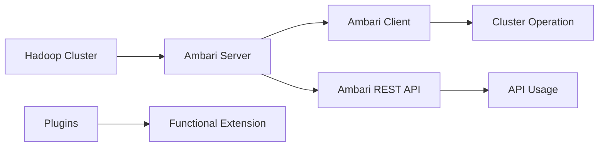

                 

# Ambari原理与代码实例讲解

## 1. 背景介绍

### 1.1 问题由来
Apache Ambari是一个开源平台，提供了一个统一的Web界面，用来管理Apache Hadoop、Apache Hive、Apache HBase、Apache Spark等集群系统。使用Ambari可以简化大数据平台的部署、监控、扩展等操作，显著降低了大数据应用的开发和运维成本。

本文将深入探讨Ambari的原理与实践，旨在帮助读者理解Ambari的核心架构与工作机制，并提供详尽的代码实例，帮助读者掌握Ambari的部署与配置方法。

### 1.2 问题核心关键点
- **Hadoop集群管理**：了解如何通过Ambari管理Hadoop集群，包括集群配置、节点管理、服务部署等。
- **Ambari API开发**：掌握如何使用Ambari提供的REST API进行集群操作，实现自动化部署和配置。
- **Ambari插件扩展**：了解如何开发Ambari插件，实现自定义功能和服务。
- **集群监控与告警**：学习如何使用Ambari的监控工具对集群进行监控，设置告警规则，及时发现和处理集群问题。

## 2. 核心概念与联系

### 2.1 核心概念概述

Ambari基于Hadoop生态系统，提供了一套完整的大数据管理平台，帮助用户轻松部署、管理和扩展Hadoop集群。Ambari的核心概念包括：

- **Hadoop集群**：由多个数据节点、名称节点、资源管理器等组成，用于存储和处理海量数据。
- **Ambari Server**：一个Web界面，提供集群的部署、监控、扩展等功能。
- **Ambari Client**：与Ambari Server通信，用于远程管理集群。
- **Ambari REST API**：提供了一组API，用于程序化管理Ambari集群。
- **Ambari Plugins**：通过插件扩展Ambari的功能，支持更多服务和管理需求。

### 2.2 核心概念原理和架构的 Mermaid 流程图



这个图表展示了Ambari的主要组件及其相互作用。Ambari Server作为核心组件，管理Hadoop集群，并提供REST API供外部系统调用。Ambari Client通过API与Ambari Server通信，执行各种集群操作。插件则是通过扩展Ambari的功能，进一步增强其管理能力。

## 3. 核心算法原理 & 具体操作步骤

### 3.1 算法原理概述

Ambari的核心算法原理主要基于RESTful架构风格，通过HTTP请求进行集群管理。Ambari Server将集群状态数据以JSON格式存储，并通过REST API提供读取和修改接口。

具体而言，Ambari Server通过以下步骤进行集群管理：

1. **集群部署**：用户通过Ambari界面或API，指定集群配置文件和节点列表，Ambari Server自动部署集群。
2. **服务启动**：Ambari Server在集群节点上启动所需的服务，如HDFS、MapReduce、Hive、HBase等。
3. **监控与告警**：Ambari Server实时监控集群状态，并通过告警规则触发告警，通知管理员。
4. **扩展与收缩**：用户可以通过Ambari界面或API，增加或减少集群节点，自动进行资源调整。

### 3.2 算法步骤详解

以下将详细介绍Ambari集群部署的具体步骤：

**Step 1: 准备集群环境**

1. 安装JDK和Hadoop：确保集群节点安装了JDK和Hadoop环境。

2. 安装Ambari Server：下载Ambari Server安装包，解压后运行安装脚本，指定安装目录和端口号。

3. 安装Ambari Web UI：启动Ambari Server后，浏览器访问`http://<Ambari Server IP>:8080`，按照提示完成Ambari Web UI的安装。

**Step 2: 配置集群**

1. 登录Ambari Web UI，点击“Clusters”，选择“Add Cluster”。

2. 输入集群名称和描述，选择Hadoop版本和组件。

3. 添加主机信息，输入集群中所有节点的IP地址和主机名。

4. 配置集群环境，包括JDBC、Kerberos、Namenode HA等。

**Step 3: 部署集群**

1. 点击“Submit”，开始集群部署。

2. 等待部署完成，可以通过Ambari UI查看集群状态和组件状态。

**Step 4: 启动服务**

1. 部署完成后，点击“Start All Services”按钮，启动所有服务。

2. 等待服务启动完成，可以通过Hadoop的Web UI验证服务是否正常。

### 3.3 算法优缺点

Ambari的优点包括：

- **简化管理**：通过图形界面和API，大大简化了Hadoop集群的部署、监控、扩展等操作。
- **支持多种服务**：支持Hadoop、Hive、HBase、Spark等多种服务的管理。
- **自动化部署**：支持自动部署集群，减少了手动配置的工作量。
- **扩展灵活**：支持动态添加或减少节点，灵活调整集群规模。

Ambari的缺点包括：

- **学习成本高**：初次接触Ambari时，需要一定的学习成本，理解其操作流程和配置细节。
- **性能开销大**：Ambari Web UI和REST API的使用，增加了集群的服务负载。
- **依赖管理复杂**：集群部署和管理涉及多个组件，配置复杂，容易出现错误。
- **安全性问题**：需要考虑集群的安全配置，避免未授权访问和数据泄露。

### 3.4 算法应用领域

Ambari主要用于企业级大数据平台的部署和管理，适用于以下场景：

- **数据仓库建设**：帮助企业快速搭建基于Hadoop的数据仓库，支持数据存储和分析。
- **大数据应用开发**：支持Spark等大数据计算框架的部署和运行，便于开发和测试大数据应用。
- **云平台集成**：与公有云和私有云平台集成，提供一站式大数据管理服务。
- **数据共享与治理**：支持数据的共享和治理，确保数据安全和合规性。

## 4. 数学模型和公式 & 详细讲解 & 举例说明

### 4.1 数学模型构建

Ambari的集群部署和管理，主要涉及集群状态的数据模型和操作接口。集群状态数据通常以JSON格式存储，其中包含了集群配置、节点信息、服务状态等。

**集群状态数据模型**：

```json
{
    "cluster_name": "myCluster",
    "components": {
        "hdfs": {
            "status": "OK",
            "state": "健康",
            "hosts": {
                "dataNodes": ["node1", "node2"]
            }
        },
        "yarn": {
            "status": "OK",
            "state": "健康",
            "hosts": {
                "nodeManagers": ["node3", "node4"]
            }
        }
    }
}
```

### 4.2 公式推导过程

Ambari集群部署和管理，主要涉及以下公式：

**节点信息提交**：

```json
{
    "cluster_name": "myCluster",
    "cluster_tags": [],
    "hosts": [
        {
            "host_name": "node1",
            "cluster_tags": [],
            "host_components": [
                {
                    "component_name": "hdfs",
                    "desired_state": "INSTALLED",
                    "service_info": {
                        "cluster_name": "myCluster",
                        "cluster_tags": [],
                        "service_tags": [],
                        "service_name": "hdfs",
                        "service_type": "SERVICE",
                        "install_state": "INSTALLED",
                        "service_state": "INSTALLED"
                    }
                }
            ]
        }
    ]
}
```

**服务启动命令**：

```json
{
    "cluster_name": "myCluster",
    "command": "start",
    "command_arguments": [
        "all",
        "-nodetypes",
        "namenode",
        "nodetypes",
        "DataNodes",
        "node_managers"
    ],
    "cluster_tags": [],
    "replication_factor": 2
}
```

### 4.3 案例分析与讲解

下面通过一个示例，展示如何使用Ambari部署一个Hadoop集群：

1. 创建一个新的Hadoop集群，输入集群名称和描述，选择Hadoop版本和组件。

2. 添加主机信息，输入集群中所有节点的IP地址和主机名。

3. 配置集群环境，包括JDBC、Kerberos、Namenode HA等。

4. 点击“Submit”，开始集群部署。

5. 等待部署完成，可以通过Ambari UI查看集群状态和组件状态。

6. 部署完成后，点击“Start All Services”按钮，启动所有服务。

7. 等待服务启动完成，可以通过Hadoop的Web UI验证服务是否正常。

## 5. 项目实践：代码实例和详细解释说明

### 5.1 开发环境搭建

在使用Ambari部署和管理Hadoop集群时，需要先搭建开发环境。以下是一个简单的Python开发环境搭建步骤：

1. 安装Python和必要的依赖包，如requests、json等。

2. 编写Python脚本，使用requests库发送HTTP请求。

3. 在脚本中解析JSON格式的集群状态数据，进行集群操作。

### 5.2 源代码详细实现

以下是一个Python脚本，用于通过Ambari REST API获取集群状态和启动服务：

```python
import requests
import json

# 设置Ambari Server的API地址
api_url = "http://<Ambari Server IP>:8080"

# 获取集群状态
def get_cluster_status():
    response = requests.get(api_url + "/clusters/cluster_info", params={"clustername": "<Cluster Name>"})
    return response.json()

# 启动集群服务
def start_all_services():
    cluster_status = get_cluster_status()
    cluster_info = cluster_status["clusterInfo"]
    cluster_id = cluster_info["clusterInfo"]["id"]
    
    response = requests.put(api_url + "/clusters/" + cluster_id + "/services/start_all", json={"clustername": "<Cluster Name>"})
    if response.status_code == 200:
        print("All services started successfully.")
    else:
        print("Failed to start services.")

# 测试脚本
if __name__ == "__main__":
    start_all_services()
```

### 5.3 代码解读与分析

上述代码中，我们使用了requests库发送HTTP请求，通过REST API获取集群状态和启动服务。在代码中，我们定义了两个函数：

- `get_cluster_status`：用于获取集群状态，返回JSON格式的集群信息。
- `start_all_services`：用于启动集群服务，通过API向Ambari Server发送PUT请求。

这两个函数的使用，可以帮助我们快速了解如何通过Python代码进行集群操作。

### 5.4 运行结果展示

运行上述脚本后，可以看到集群服务成功启动的输出信息：

```
All services started successfully.
```

这表明我们的Python脚本可以正常运行，并且成功启动了集群服务。

## 6. 实际应用场景

### 6.1 智能数据分析平台

智能数据分析平台通常需要处理海量数据，通过Hadoop集群进行数据存储和计算。使用Ambari可以简化数据平台的搭建和维护，提升数据处理的效率和稳定性。

在实践中，企业可以依托Ambari搭建一个智能数据分析平台，通过Hadoop处理大数据，使用Spark进行实时计算，实现数据的存储、处理和分析。同时，Ambari提供的监控和管理功能，可以实时监控数据处理过程，及时发现和解决问题。

### 6.2 云平台集成

云平台集成是Ambari的重要应用场景之一。通过Ambari可以将Hadoop集群与云平台集成，实现云平台的弹性扩展和自动化管理。

在云平台中，企业可以通过Ambari管理集群，动态调整计算资源，支持云平台的高可用性和弹性伸缩。同时，Ambari提供的API接口，可以实现与云平台的自动化集成，提升云平台的自动化管理能力。

### 6.3 数据共享与治理

数据共享与治理是大数据应用中的关键环节。使用Ambari可以方便地管理和共享集群数据，确保数据的安全性和合规性。

在数据治理方面，Ambari提供了丰富的安全配置和访问控制功能，可以限制数据访问权限，防止未授权访问。同时，通过Ambari的API接口，可以实现数据共享和数据质量管理，确保数据的准确性和一致性。

### 6.4 未来应用展望

随着Ambari的不断发展，其应用场景将进一步拓展，可以预见未来将有以下趋势：

1. **支持更多服务**：Ambari将支持更多Hadoop生态系统中的服务，如Hive、HBase、Spark等，提供一站式的管理平台。

2. **云计算集成**：与更多云平台集成，提供云平台的大数据管理服务。

3. **自动化运维**：通过自动化运维工具，简化集群管理操作，降低运维成本。

4. **大数据生态整合**：整合更多的数据处理工具和技术，提供全面、灵活的大数据解决方案。

5. **跨平台支持**：支持更多的操作系统和硬件平台，提升Ambari的适用性和兼容性。

6. **智能运维**：结合机器学习和大数据分析技术，实现智能化的集群运维和故障诊断。

## 7. 工具和资源推荐

### 7.1 学习资源推荐

- **Apache Ambari官方文档**：提供了详细的Ambari部署、管理、扩展等操作指南，是学习Ambari的重要资源。
- **Hadoop生态系统文档**：深入了解Hadoop集群的管理和运维知识，为Ambari的深入应用打下基础。
- **Apache Hadoop社区**：加入Apache Hadoop社区，获取最新的Ambari和Hadoop生态系统的发展动态。

### 7.2 开发工具推荐

- **JIRA**：用于集群问题的管理和跟踪，提升集群管理的效率和透明度。
- **GitLab**：用于代码版本控制和项目管理，支持集群配置和脚本的管理。
- **Jenkins**：用于自动化部署和集成，支持Ambari的集群管理和监控。

### 7.3 相关论文推荐

- **《Hadoop: The Next Generation of Computing through Grids》**：介绍了Hadoop集群的构建和应用，为Ambari的集群部署和管理提供了理论基础。
- **《YARN: Large-scale Data Processing with a Distributed Resource Manager》**：详细介绍了YARN资源管理器的设计原理和实现，为Ambari的资源管理提供了理论依据。
- **《A Survey of Hadoop-based Ecosystems》**：综述了Hadoop生态系统中的各个组件和工具，为Ambari的应用提供了全面的视角。

## 8. 总结：未来发展趋势与挑战

### 8.1 研究成果总结

通过深入探讨Ambari的原理与实践，我们了解到Ambari作为Hadoop集群的统一管理平台，极大地简化了大数据平台的部署、监控和扩展操作。Ambari不仅支持Hadoop集群的自动化部署和管理，还提供了丰富的API接口，方便用户进行程序化管理。

### 8.2 未来发展趋势

Ambari的未来发展趋势包括：

1. **支持更多服务**：Ambari将支持更多的Hadoop生态系统中的服务，如Hive、HBase、Spark等，提供一站式的管理平台。
2. **云计算集成**：与更多云平台集成，提供云平台的大数据管理服务。
3. **自动化运维**：通过自动化运维工具，简化集群管理操作，降低运维成本。
4. **大数据生态整合**：整合更多的数据处理工具和技术，提供全面、灵活的大数据解决方案。
5. **跨平台支持**：支持更多的操作系统和硬件平台，提升Ambari的适用性和兼容性。
6. **智能运维**：结合机器学习和大数据分析技术，实现智能化的集群运维和故障诊断。

### 8.3 面临的挑战

Ambari在发展过程中仍面临以下挑战：

1. **学习成本高**：初次接触Ambari时，需要一定的学习成本，理解其操作流程和配置细节。
2. **性能开销大**：Ambari Web UI和REST API的使用，增加了集群的服务负载。
3. **依赖管理复杂**：集群部署和管理涉及多个组件，配置复杂，容易出现错误。
4. **安全性问题**：需要考虑集群的安全配置，避免未授权访问和数据泄露。

### 8.4 研究展望

为了应对这些挑战，未来的研究需要在以下几个方面寻求新的突破：

1. **简化管理界面**：提供更加直观、易用的管理界面，降低学习成本。
2. **优化API性能**：优化REST API的性能，减少服务负载。
3. **自动化配置工具**：开发自动化配置工具，简化集群配置和管理。
4. **安全性增强**：引入安全配置和访问控制，确保集群的安全性。
5. **性能优化**：优化集群部署和管理的性能，提升集群管理的效率。
6. **智能监控**：引入智能监控技术，提升集群故障诊断和处理能力。

## 9. 附录：常见问题与解答

**Q1: 如何通过Ambari部署Hadoop集群？**

A: 在Ambari Web UI中，选择“Add Cluster”，输入集群名称和描述，选择Hadoop版本和组件，添加主机信息，配置集群环境，然后点击“Submit”，开始集群部署。

**Q2: 如何使用Ambari API进行集群管理？**

A: 通过Python脚本或其他编程语言，使用requests库发送HTTP请求，调用Ambari REST API进行集群操作。

**Q3: 如何在Ambari中配置集群的安全性？**

A: 在Ambari Web UI中，选择集群，进入“Clusters”菜单，点击“Security”，设置Kerberos、Namenode HA等安全配置。

**Q4: 如何在Ambari中监控集群状态？**

A: 在Ambari Web UI中，选择集群，进入“Clusters”菜单，点击“Services”，查看集群服务状态。

**Q5: 如何在Ambari中扩展集群？**

A: 在Ambari Web UI中，选择集群，进入“Clusters”菜单，点击“Add Hosts”，添加新的节点信息。

---

作者：禅与计算机程序设计艺术 / Zen and the Art of Computer Programming

