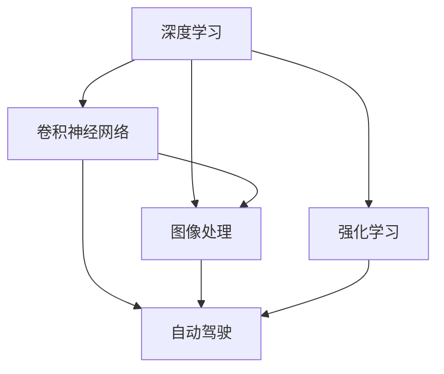

                 

# Andrej Karpathy的AI演讲精华

> 关键词：深度学习,卷积神经网络,图像处理,计算机视觉,自动驾驶,强化学习,自然语言处理,模型压缩,低功耗,计算效率

## 1. 背景介绍

Andrej Karpathy是人工智能领域的知名专家，曾在OpenAI和特斯拉公司担任要职。他在深度学习、计算机视觉和自动驾驶等领域的研究成果广受关注，并撰写过多部关于AI和计算机视觉的畅销书籍。本文将重点探讨Andrej Karpathy在AI演讲中的一些核心观点，涵盖深度学习、卷积神经网络、图像处理、自动驾驶和强化学习等方面，力求为读者提供清晰、全面的技术洞见。

### 1.1 问题由来

当前，深度学习技术已经成为推动AI发展的重要引擎。特别是在计算机视觉、自然语言处理和自动驾驶等领域，深度学习模型的性能不断刷新记录。Andrej Karpathy作为深度学习的先驱者之一，他的演讲和研究为这一领域的发展提供了重要的视角和方法。本文将详细解读Andrej Karpathy在AI演讲中的精彩内容，帮助读者理解深度学习的核心原理和技术进展。

### 1.2 问题核心关键点

Andrej Karpathy的AI演讲涵盖了多个前沿领域，包括深度学习、计算机视觉、自动驾驶和强化学习等。这些关键点构成了AI演讲的核心框架：

1. 深度学习：Andrej强调深度学习模型的强大表达能力和泛化能力，及其在图像处理、自然语言处理等领域的广泛应用。
2. 卷积神经网络：Andrej深入讲解了卷积神经网络(CNN)的结构和训练方法，及其在计算机视觉中的重要地位。
3. 图像处理：Andrej探讨了图像增强、图像分割等关键技术，及其在自动驾驶、医学影像分析等实际应用中的价值。
4. 自动驾驶：Andrej介绍了特斯拉在自动驾驶领域的技术积累和未来规划，特别是基于深度学习的驾驶决策系统。
5. 强化学习：Andrej讨论了强化学习在机器人控制、游戏AI等领域的最新进展和挑战。

这些关键点共同构成了Andrej Karpathy在AI演讲中的主要框架，涵盖从基础理论到前沿应用的全方位内容。

## 2. 核心概念与联系

### 2.1 核心概念概述

Andrej Karpathy的AI演讲涉及多个核心概念，包括深度学习、卷积神经网络、图像处理、自动驾驶和强化学习等。这些概念之间的逻辑关系可以通过以下Mermaid流程图来展示：

这个流程图展示了各个概念之间的联系和相互作用：

1. 深度学习是AI的基础，涵盖了多层神经网络的结构和训练方法。
2. 卷积神经网络是深度学习的重要组成部分，适用于图像处理、计算机视觉等领域。
3. 图像处理利用卷积神经网络等技术，对图像进行增强、分割等操作，提升处理效率和精度。
4. 自动驾驶利用图像处理和深度学习技术，实现车辆自主驾驶和决策。
5. 强化学习通过模拟训练，优化自动驾驶和机器人等系统的行为决策。

这些概念之间的联系构成了AI技术的全貌，Andrej Karpathy在演讲中对这些概念进行了深入的讲解和分析。

## 3. 核心算法原理 & 具体操作步骤

### 3.1 算法原理概述

Andrej Karpathy在演讲中详细讲解了深度学习的核心算法原理，包括卷积神经网络、自编码器、残差网络等。这些算法原理构成了深度学习模型的基础，是理解和应用深度学习技术的关键。

#### 3.1.1 卷积神经网络

卷积神经网络(CNN)是深度学习在图像处理中的重要工具。它通过卷积操作提取图像中的特征，然后通过池化、全连接等操作进行分类或回归。Andrej强调了卷积核的大小、步幅和填充等超参数对CNN性能的影响，以及数据增强、迁移学习等技术在CNN训练中的重要性。

#### 3.1.2 自编码器

自编码器是深度学习中的另一个重要组件，用于学习数据的低维表示。Andrej讲解了自编码器的结构和训练方法，及其在数据压缩、降噪等方面的应用。

#### 3.1.3 残差网络

残差网络(ResNet)通过引入残差连接，解决了深度网络训练中的梯度消失问题。Andrej讨论了残差网络的架构和训练技巧，强调了残差连接在提升网络深度方面的重要作用。

### 3.2 算法步骤详解

Andrej Karpathy在演讲中详细讲解了深度学习的训练过程，包括数据预处理、模型定义、优化器选择和损失函数设计等关键步骤。

#### 3.2.1 数据预处理

数据预处理是深度学习中不可或缺的一部分，包括数据归一化、标准化、数据增强等操作。Andrej讲解了如何通过数据增强提高模型的泛化能力，以及如何利用迁移学习在有限的标注数据上进行高效训练。

#### 3.2.2 模型定义

模型定义包括选择网络结构、定义损失函数和优化器等。Andrej强调了模型架构的选择对模型性能的影响，以及如何通过超参数调优来优化模型性能。

#### 3.2.3 优化器选择

优化器是深度学习中用于更新模型参数的工具，包括SGD、Adam、Adagrad等。Andrej讨论了不同优化器的特点和适用场景，强调了学习率、批大小等超参数对模型训练的影响。

#### 3.2.4 损失函数设计

损失函数是衡量模型预测与真实标签之间差异的工具。Andrej讲解了常见的损失函数，包括均方误差、交叉熵等，以及如何在不同的任务中合理选择损失函数。

### 3.3 算法优缺点

深度学习技术在图像处理、自然语言处理等领域取得了巨大成功，但也存在一些局限性：

1. 计算资源消耗大：深度学习模型通常需要大量的计算资源进行训练和推理，这对硬件设备提出了很高的要求。
2. 训练时间长：深度学习模型往往需要大量的时间进行训练，特别是在大数据集和复杂模型结构的情况下。
3. 过拟合风险高：深度学习模型容易过拟合，特别是在数据量有限的情况下。
4. 模型可解释性差：深度学习模型通常被视为"黑盒"，难以解释其内部工作机制。

Andrej Karpathy在演讲中对这些问题进行了深入探讨，并提出了一些解决方案，如模型压缩、梯度累积、正则化等。

### 3.4 算法应用领域

深度学习技术在多个领域中得到了广泛应用，包括计算机视觉、自然语言处理、自动驾驶等。Andrej Karpathy在演讲中对这些应用领域进行了详细讲解：

1. 计算机视觉：Andrej讨论了卷积神经网络在图像分类、物体检测、图像分割等任务中的应用。
2. 自然语言处理：Andrej讲解了深度学习在机器翻译、文本生成、问答系统等任务中的最新进展。
3. 自动驾驶：Andrej介绍了特斯拉在自动驾驶领域的技术积累和未来规划，特别是基于深度学习的驾驶决策系统。
4. 强化学习：Andrej讨论了强化学习在机器人控制、游戏AI等领域的最新进展和挑战。

这些应用领域展示了深度学习技术的广泛应用和巨大潜力，Andrej Karpathy在演讲中对这些领域进行了深入分析。

## 4. 数学模型和公式 & 详细讲解

### 4.1 数学模型构建

Andrej Karpathy在演讲中讲解了深度学习的数学模型构建方法，包括卷积神经网络的定义和训练方法。

#### 4.1.1 卷积神经网络

卷积神经网络的基本结构包括卷积层、池化层和全连接层。Andrej详细讲解了卷积核的大小、步幅和填充等超参数的含义，以及如何通过卷积操作提取图像特征。

#### 4.1.2 自编码器

自编码器由编码器和解码器两部分组成，通过学习数据的低维表示进行数据压缩和重构。Andrej讲解了自编码器的结构和训练方法，包括如何使用均方误差损失函数进行训练。

### 4.2 公式推导过程

Andrej Karpathy在演讲中讲解了卷积神经网络和自编码器的公式推导过程。

#### 4.2.1 卷积神经网络

卷积神经网络的基本公式为：

$$
y = W \star x
$$

其中 $x$ 为输入图像，$y$ 为输出特征图，$W$ 为卷积核。Andrej详细讲解了卷积操作的数学原理和公式推导过程。

#### 4.2.2 自编码器

自编码器的基本公式为：

$$
y = W_1 \sigma(W_2 x)
$$

其中 $x$ 为输入数据，$y$ 为重构数据，$W_1$ 和 $W_2$ 分别为编码器和解码器的权重。Andrej详细讲解了自编码器的训练过程和损失函数。

### 4.3 案例分析与讲解

Andrej Karpathy在演讲中通过多个案例分析了深度学习在实际应用中的效果和挑战。

#### 4.3.1 图像分类

Andrej讲解了卷积神经网络在图像分类任务中的应用，包括使用AlexNet、VGGNet、ResNet等模型在ImageNet数据集上的实验结果。

#### 4.3.2 物体检测

Andrej讲解了基于区域提议的物体检测方法，如Faster R-CNN和YOLO等，及其在COCO数据集上的效果。

#### 4.3.3 图像分割

Andrej讲解了语义分割和实例分割等任务，包括使用U-Net和Mask R-CNN等模型在PASCAL VOC数据集上的实验结果。

## 5. 项目实践：代码实例和详细解释说明

### 5.1 开发环境搭建

Andrej Karpathy在演讲中详细讲解了深度学习项目开发的第一步——开发环境搭建。

#### 5.1.1 PyTorch

PyTorch是目前最流行的深度学习框架之一，Andrej讲解了PyTorch的安装和配置过程。

#### 5.1.2 TensorFlow

TensorFlow是Google开发的另一个流行的深度学习框架，Andrej讲解了TensorFlow的安装和配置过程。

#### 5.1.3 数据集处理

Andrej讲解了如何处理图像、文本等数据集，包括数据预处理、数据增强等技术。

### 5.2 源代码详细实现

Andrej Karpathy在演讲中通过代码实例讲解了深度学习模型的训练和推理过程。

#### 5.2.1 模型定义

Andrej讲解了如何使用PyTorch和TensorFlow定义卷积神经网络和自编码器等模型结构。

#### 5.2.2 数据预处理

Andrej讲解了如何使用PyTorch和TensorFlow进行数据预处理，包括数据归一化、标准化、数据增强等操作。

#### 5.2.3 模型训练

Andrej讲解了如何使用PyTorch和TensorFlow训练深度学习模型，包括选择优化器、损失函数、学习率等超参数。

### 5.3 代码解读与分析

Andrej Karpathy在演讲中详细解读了深度学习模型的代码实现过程，并进行了分析。

#### 5.3.1 PyTorch代码实现

Andrej讲解了如何使用PyTorch实现卷积神经网络和自编码器等模型结构。

#### 5.3.2 TensorFlow代码实现

Andrej讲解了如何使用TensorFlow实现卷积神经网络和自编码器等模型结构。

#### 5.3.3 数据增强

Andrej讲解了如何使用PyTorch和TensorFlow进行数据增强，包括随机裁剪、翻转、旋转等操作。

### 5.4 运行结果展示

Andrej Karpathy在演讲中展示了深度学习模型在实际应用中的运行结果。

#### 5.4.1 图像分类结果

Andrej展示了卷积神经网络在图像分类任务上的实验结果，包括使用AlexNet、VGGNet、ResNet等模型在ImageNet数据集上的分类准确率。

#### 5.4.2 物体检测结果

Andrej展示了基于区域提议的物体检测方法在COCO数据集上的检测结果，包括使用Faster R-CNN和YOLO等模型的精确率和召回率。

#### 5.4.3 图像分割结果

Andrej展示了语义分割和实例分割等任务在PASCAL VOC数据集上的实验结果，包括使用U-Net和Mask R-CNN等模型的准确率和召回率。

## 6. 实际应用场景

Andrej Karpathy在演讲中详细讲解了深度学习技术在多个实际应用场景中的具体应用。

### 6.1 自动驾驶

Andrej讲解了特斯拉在自动驾驶领域的技术积累和未来规划，特别是基于深度学习的驾驶决策系统。

#### 6.1.1 感知系统

Andrej讲解了深度学习在自动驾驶中的感知系统，包括使用卷积神经网络进行图像处理、物体检测和语义分割等。

#### 6.1.2 决策系统

Andrej讲解了深度学习在自动驾驶中的决策系统，包括使用强化学习进行驾驶决策和路径规划等。

### 6.2 游戏AI

Andrej讲解了深度学习在游戏AI中的应用，特别是使用强化学习进行游戏策略和决策优化。

#### 6.2.1 环境建模

Andrej讲解了如何构建游戏环境的数学模型，包括使用马尔可夫决策过程进行状态转移和价值估计。

#### 6.2.2 策略优化

Andrej讲解了如何使用强化学习算法进行策略优化，包括使用Q-learning、SARSA等算法进行游戏决策。

### 6.3 自然语言处理

Andrej讲解了深度学习在自然语言处理中的应用，包括机器翻译、文本生成和问答系统等。

#### 6.3.1 机器翻译

Andrej讲解了深度学习在机器翻译中的应用，包括使用序列到序列模型进行翻译。

#### 6.3.2 文本生成

Andrej讲解了深度学习在文本生成中的应用，包括使用自回归模型进行文本生成。

#### 6.3.3 问答系统

Andrej讲解了深度学习在问答系统中的应用，包括使用神经网络进行问答对的匹配和生成。

## 7. 工具和资源推荐

### 7.1 学习资源推荐

Andrej Karpathy推荐了多个深度学习学习的资源，帮助读者系统掌握深度学习的理论和实践。

#### 7.1.1 《深度学习》课程

Andrej推荐了斯坦福大学的《深度学习》课程，讲解了深度学习的基本概念和经典模型。

#### 7.1.2 《计算机视觉：算法与应用》课程

Andrej推荐了斯坦福大学的《计算机视觉：算法与应用》课程，讲解了计算机视觉的基本原理和应用技术。

#### 7.1.3 《神经网络与深度学习》课程

Andrej推荐了Coursera的《神经网络与深度学习》课程，讲解了深度学习的基本概念和经典模型。

#### 7.1.4 《自然语言处理》课程

Andrej推荐了斯坦福大学的《自然语言处理》课程，讲解了自然语言处理的基本概念和经典模型。

### 7.2 开发工具推荐

Andrej Karpathy推荐了多个深度学习开发的工具，帮助读者快速上手深度学习项目。

#### 7.2.1 PyTorch

PyTorch是目前最流行的深度学习框架之一，Andrej推荐了PyTorch的安装和配置过程。

#### 7.2.2 TensorFlow

TensorFlow是Google开发的另一个流行的深度学习框架，Andrej推荐了TensorFlow的安装和配置过程。

#### 7.2.3 Weights & Biases

Weights & Biases是一个实验跟踪工具，Andrej推荐了如何使用Weights & Biases记录和可视化模型训练过程中的各项指标。

#### 7.2.4 TensorBoard

TensorBoard是TensorFlow配套的可视化工具，Andrej推荐了如何使用TensorBoard实时监测模型训练状态。

### 7.3 相关论文推荐

Andrej Karpathy推荐了多个深度学习领域的经典论文，帮助读者深入理解深度学习的理论和实践。

#### 7.3.1 《ImageNet Classification with Deep Convolutional Neural Networks》

这篇论文介绍了AlexNet在ImageNet数据集上的实验结果，是深度学习在计算机视觉领域的重要突破。

#### 7.3.2 《Very Deep Convolutional Networks for Large-Scale Image Recognition》

这篇论文介绍了VGGNet在ImageNet数据集上的实验结果，是深度学习在计算机视觉领域的经典模型。

#### 7.3.3 《ResNet: Deep Residual Learning for Image Recognition》

这篇论文介绍了ResNet在ImageNet数据集上的实验结果，是深度学习在计算机视觉领域的重要贡献。

#### 7.3.4 《Learning Phrase Representations using RNN Encoder Decoder for Statistical Machine Translation》

这篇论文介绍了序列到序列模型在机器翻译中的应用，是深度学习在自然语言处理领域的经典模型。

## 8. 总结：未来发展趋势与挑战

### 8.1 研究成果总结

Andrej Karpathy在演讲中总结了深度学习技术的最新进展和未来方向。

#### 8.1.1 深度学习在计算机视觉领域的应用

Andrej总结了深度学习在图像分类、物体检测、图像分割等任务中的应用，强调了卷积神经网络的强大表达能力。

#### 8.1.2 深度学习在游戏AI领域的应用

Andrej总结了深度学习在游戏AI中的进展，强调了强化学习在游戏策略和决策优化中的应用。

#### 8.1.3 深度学习在自然语言处理领域的应用

Andrej总结了深度学习在机器翻译、文本生成和问答系统等任务中的应用，强调了序列到序列模型和自回归模型的强大能力。

### 8.2 未来发展趋势

Andrej Karpathy在演讲中展望了深度学习技术的未来发展趋势，包括：

#### 8.2.1 模型规模的持续增大

Andrej预测，未来的深度学习模型将具有更大的规模，能够处理更加复杂和多样化的数据。

#### 8.2.2 微调技术的广泛应用

Andrej预测，未来的深度学习模型将更加注重微调技术的应用，通过迁移学习在有限的标注数据上进行高效训练。

#### 8.2.3 多模态融合的深入发展

Andrej预测，未来的深度学习模型将更多地融合多模态数据，提升对复杂场景的理解和处理能力。

#### 8.2.4 模型压缩和低功耗技术的发展

Andrej预测，未来的深度学习模型将更加注重模型压缩和低功耗技术的发展，以便在边缘设备上高效运行。

### 8.3 面临的挑战

Andrej Karpathy在演讲中讨论了深度学习技术面临的挑战，包括：

#### 8.3.1 计算资源消耗大

Andrej指出，深度学习模型需要大量的计算资源进行训练和推理，这对硬件设备提出了很高的要求。

#### 8.3.2 训练时间长

Andrej指出，深度学习模型往往需要大量的时间进行训练，特别是在大数据集和复杂模型结构的情况下。

#### 8.3.3 过拟合风险高

Andrej指出，深度学习模型容易过拟合，特别是在数据量有限的情况下。

#### 8.3.4 模型可解释性差

Andrej指出，深度学习模型通常被视为"黑盒"，难以解释其内部工作机制。

### 8.4 研究展望

Andrej Karpathy在演讲中展望了深度学习技术的未来研究方向，包括：

#### 8.4.1 模型压缩和低功耗技术

Andrej预测，未来的深度学习模型将更加注重模型压缩和低功耗技术的发展，以便在边缘设备上高效运行。

#### 8.4.2 多模态融合技术

Andrej预测，未来的深度学习模型将更多地融合多模态数据，提升对复杂场景的理解和处理能力。

#### 8.4.3 迁移学习技术的进步

Andrej预测，未来的深度学习模型将更加注重迁移学习技术的应用，通过迁移学习在有限的标注数据上进行高效训练。

#### 8.4.4 可解释性增强技术

Andrej预测，未来的深度学习模型将更加注重可解释性增强技术的发展，以便更好地理解模型的工作机制。

## 9. 附录：常见问题与解答

### 9.1 问题1：深度学习模型为什么需要大量的计算资源？

Andrej Karpathy在演讲中解释了深度学习模型需要大量计算资源的原因。深度学习模型通常包含大量的参数，需要通过反向传播算法进行优化。反向传播算法需要大量的计算资源，特别是在训练大数据集时。

### 9.2 问题2：深度学习模型如何避免过拟合？

Andrej Karpathy在演讲中讲解了深度学习模型避免过拟合的方法，包括数据增强、正则化、Dropout等技术。

### 9.3 问题3：深度学习模型如何提高推理速度？

Andrej Karpathy在演讲中讲解了深度学习模型提高推理速度的方法，包括模型压缩、梯度累积等技术。

### 9.4 问题4：深度学习模型如何进行模型压缩？

Andrej Karpathy在演讲中讲解了深度学习模型进行模型压缩的方法，包括参数剪枝、量化、模型融合等技术。

### 9.5 问题5：深度学习模型如何进行低功耗优化？

Andrej Karpathy在演讲中讲解了深度学习模型进行低功耗优化的技术，包括模型压缩、低精度计算等方法。

---

作者：禅与计算机程序设计艺术 / Zen and the Art of Computer Programming

