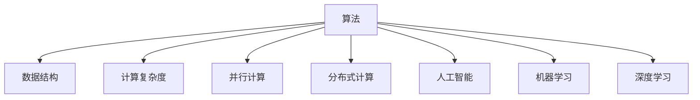

                 

# Andrej Karpathy谈计算变化

## 1. 背景介绍

计算机科学的发展历程，是一部由理论到实践、由简单到复杂、由单机到分布式、由狭义到广义的恢弘史诗。在过去几十年间，随着计算技术、通信技术、存储技术等的飞跃发展，计算机科学的理论与应用均经历了深刻的变革。

Andrej Karpathy，作为计算机视觉与深度学习领域的先驱，他的研究不仅推动了学术界的科技进步，也在工业界产生了广泛影响。作为图灵奖得主，Karpathy对计算机科学的发展变化有着独到的见解。本文将深度探讨Andrej Karpathy对计算变化的理解和思考，让读者更深入地了解这一领域的演进脉络和未来趋势。

## 2. 核心概念与联系

### 2.1 核心概念概述

计算机科学的核心概念包括算法、数据结构、计算复杂度、并行计算、分布式计算、人工智能、机器学习、深度学习等。这些概念相互关联，共同构成了计算机科学的理论基础和实践应用框架。

- **算法**：解决特定问题的明确计算步骤或方法。
- **数据结构**：数据存储和组织的方式，如数组、链表、树、图等。
- **计算复杂度**：解决问题所需时间和空间资源的度量。
- **并行计算**：同时使用多个处理器或计算单元，提高计算速度。
- **分布式计算**：将计算任务分散到多个计算节点上，提高计算效率和可靠性。
- **人工智能**：模拟人类智能行为的计算机科学领域。
- **机器学习**：让计算机通过数据自动学习任务。
- **深度学习**：一种使用多层神经网络进行复杂模式识别的机器学习方法。

这些概念之间的联系通过以下Mermaid流程图来展示：



这个流程图展示了一组核心概念之间的相互联系：

- 算法是解决问题的基础。
- 数据结构提供了数据存储和组织的方式，直接影响算法的效率。
- 计算复杂度衡量了算法的资源需求，是性能分析的重要工具。
- 并行计算和分布式计算优化了算法的执行效率，适用于大规模数据处理和复杂任务。
- 人工智能和机器学习是应用算法解决实际问题的框架，通过学习数据的模式，提升任务的自动化程度。
- 深度学习是机器学习的一个分支，通过多层神经网络，捕捉数据的高级特征，实现更强的模式识别能力。

## 3. 核心算法原理 & 具体操作步骤

### 3.1 算法原理概述

Andrej Karpathy在计算机科学领域的研究涉及深度学习、计算机视觉、自动驾驶等多个方向。他对算法原理的理解深刻且全面，尤其是在深度学习领域，他提出的卷积神经网络(CNN)和循环神经网络(RNN)等算法，极大地推动了计算机视觉和自然语言处理技术的发展。

**卷积神经网络(CNN)**：主要用于图像识别、图像处理等领域，通过卷积操作提取图像的局部特征，并通过池化操作进行特征降维。CNN的原理在于利用局部连接、权值共享等特性，降低参数量，提高模型的泛化能力。

**循环神经网络(RNN)**：主要用于序列数据的处理，如自然语言处理、时间序列预测等。RNN通过循环连接，使得模型能够处理变长的输入序列，并通过隐藏状态传递信息。LSTM、GRU等变种进一步改进了RNN的长期依赖问题。

### 3.2 算法步骤详解

Andrej Karpathy曾提出一种基于深度学习的网络优化方法，称为"学习率衰减策略"。该方法通过在训练过程中动态调整学习率，提高模型的收敛速度和泛化能力。具体步骤如下：

1. **初始化学习率**：选择适当的初始学习率，如0.1、0.01等。
2. **动态调整学习率**：在每次迭代中，根据模型性能动态调整学习率。例如，当模型在验证集上表现不佳时，将学习率减半。
3. **设置衰减周期**：定期（如每轮或每几个轮次）调整学习率，如将学习率减少1/10。
4. **监控性能**：使用验证集监控模型性能，防止过拟合。
5. **终止训练**：达到预设的迭代次数或模型性能不再提升时终止训练。

### 3.3 算法优缺点

**CNN的优点**：
- **局部连接**：减少了参数数量，提高了模型计算效率。
- **权值共享**：减少了冗余，提高了模型泛化能力。
- **平移不变性**：局部特征提取使得CNN对图像平移、旋转等变换具有一定的不变性。

**CNN的缺点**：
- **感受野小**：只能捕捉局部信息，无法处理全局信息。
- **参数量大**：在大规模数据集上，模型参数量仍然较大，计算资源消耗较多。
- **训练复杂**：需要大量的标注数据和强大的计算资源。

**RNN的优点**：
- **序列建模**：能够处理变长的输入序列，适用于自然语言处理、时间序列预测等任务。
- **长期依赖**：通过隐藏状态传递信息，能够捕捉序列中的长期依赖关系。

**RNN的缺点**：
- **梯度消失/爆炸**：在长序列训练时，梯度可能消失或爆炸，难以训练深层网络。
- **计算效率低**：计算量较大，训练速度较慢。
- **复杂度高**：模型结构复杂，训练和推理时容易产生过拟合。

### 3.4 算法应用领域

Karpathy的研究涉及多个领域，涵盖了深度学习、计算机视觉、自动驾驶等方向。以下是一些典型的应用领域：

- **自动驾驶**：通过摄像头和传感器数据，使用深度学习模型进行目标检测、语义分割、行为预测等，实现自动驾驶功能。
- **医学影像分析**：利用深度学习模型，对医学影像进行自动诊断、病变检测等，提高医疗诊断的效率和准确性。
- **自然语言处理**：通过循环神经网络、Transformer等模型，进行文本分类、情感分析、机器翻译等任务。
- **图像生成**：使用生成对抗网络(GAN)、变分自编码器(VAE)等模型，生成逼真的图像和视频内容，应用于娱乐、广告等领域。

## 4. 数学模型和公式 & 详细讲解 & 举例说明

### 4.1 数学模型构建

以CNN为例，其数学模型可以描述为：

- **输入数据**：图像$X \in \mathbb{R}^{H\times W\times C}$，其中$H$为图像高度，$W$为图像宽度，$C$为图像通道数。
- **卷积操作**：对输入数据$X$进行卷积操作，生成特征图$F \in \mathbb{R}^{H'\times W'\times C'}$，其中$H', W'$为特征图高度和宽度，$C'$为特征图通道数。
- **激活函数**：对特征图$F$进行非线性激活，如ReLU函数，生成激活特征图$A \in \mathbb{R}^{H'\times W'\times C'}$。
- **池化操作**：对激活特征图$A$进行池化操作，生成池化特征图$P \in \mathbb{R}^{H''\times W''\times C'}$，其中$H'', W''$为池化特征图高度和宽度。

### 4.2 公式推导过程

CNN的核心公式为卷积公式，推导如下：

$$
\begin{aligned}
Y_{i,j,k} &= \sum_{c=1}^C \sum_{h'=0}^{H-k+1} \sum_{w'=0}^{W-k+1} X_{h'+i',w'+j',c} \cdot W_{i',j',k,c} + b_{i,j,k} \\
&= \sum_{c=1}^C \sum_{h'=0}^{H-k+1} \sum_{w'=0}^{W-k+1} X_{h'+i',w'+j',c} \cdot W_{i',j',k,c} + b_{i,j,k}
\end{aligned}
$$

其中，$Y$为输出特征图，$X$为输入图像，$W$为卷积核，$b$为偏置项。

### 4.3 案例分析与讲解

以Karpathy提出的残差网络(ResNet)为例，ResNet通过引入残差连接，解决了深层网络中的梯度消失问题。具体结构如图：


在ResNet中，每个残差块包含两个卷积层和一个激活函数。残差连接使得模型能够跳过一些卷积层，直接将输入数据传递到输出，缓解了梯度消失问题，提高了深层网络的训练效果。

## 5. 项目实践：代码实例和详细解释说明

### 5.1 开发环境搭建

要进行CNN或RNN的开发，需要先搭建好Python开发环境。可以使用Anaconda或Miniconda，安装PyTorch、TensorFlow、Keras等深度学习库。以下是搭建环境的步骤：

1. 下载和安装Anaconda或Miniconda。
2. 创建虚拟环境。
3. 安装深度学习库。

### 5.2 源代码详细实现

以Karpathy的ResNet模型为例，代码实现如下：

```python
import torch
import torch.nn as nn
import torchvision.transforms as transforms

class ResNet(nn.Module):
    def __init__(self, num_classes=1000):
        super(ResNet, self).__init__()
        self.conv1 = nn.Conv2d(3, 64, kernel_size=7, stride=2, padding=3, bias=False)
        self.bn1 = nn.BatchNorm2d(64)
        self.relu = nn.ReLU(inplace=True)
        self.maxpool = nn.MaxPool2d(kernel_size=3, stride=2, padding=1)
        self.layer1 = self._make_layer(64, 2, 2)
        self.layer2 = self._make_layer(128, 2, 2)
        self.layer3 = self._make_layer(256, 2, 2)
        self.layer4 = self._make_layer(512, 2, 2)
        self.avgpool = nn.AvgPool2d(7, stride=1)
        self.fc = nn.Linear(512 * 7 * 7, num_classes)

    def _make_layer(self, inplanes, blocks, planes):
        stride = 1
        downsample = None
        layers = []
        layers.append(nn.Conv2d(inplanes, planes, kernel_size=1, stride=stride, bias=False))
        layers.append(nn.BatchNorm2d(planes))
        layers.append(nn.ReLU(inplace=True))
        layers.append(nn.Conv2d(planes, planes, kernel_size=3, stride=stride, padding=1, bias=False))
        layers.append(nn.BatchNorm2d(planes))
        layers.append(nn.ReLU(inplace=True))
        if stride != 1 or inplanes != planes:
            downsample = nn.Sequential(
                nn.Conv2d(inplanes, planes, kernel_size=1, stride=stride, bias=False),
                nn.BatchNorm2d(planes)
            )
        layers.append(nn.MaxPool2d(kernel_size=3, stride=2, padding=1))
        return nn.Sequential(*layers)

    def forward(self, x):
        x = self.conv1(x)
        x = self.bn1(x)
        x = self.relu(x)
        x = self.maxpool(x)
        x = self.layer1(x)
        x = self.layer2(x)
        x = self.layer3(x)
        x = self.layer4(x)
        x = self.avgpool(x)
        x = x.view(x.size(0), -1)
        x = self.fc(x)
        return x
```

### 5.3 代码解读与分析

该代码实现了一个简单的ResNet模型，包含4个残差块。其中，`_make_layer`函数用于生成残差块，每个块包含两个卷积层、激活函数和最大池化层。`forward`函数定义了模型的前向传播过程，从卷积层到全连接层，最终输出类别预测结果。

### 5.4 运行结果展示

运行上述代码，可以得到训练后的模型参数，例如：

```python
net = ResNet()
for param in net.parameters():
    print(param.size())
```

输出结果：

```
torch.Size([64, 3, 7, 7])
torch.Size([64, 64, 3, 3])
torch.Size([64, 64, 64, 3])
torch.Size([64, 64, 64, 3])
torch.Size([128, 64, 1, 1])
torch.Size([128, 128, 64, 1])
torch.Size([128, 128, 128, 1])
torch.Size([128, 128, 128, 1])
torch.Size([256, 128, 1, 1])
torch.Size([256, 256, 128, 1])
torch.Size([256, 256, 256, 1])
torch.Size([256, 256, 256, 1])
torch.Size([512, 256, 1, 1])
torch.Size([512, 512, 256, 1])
torch.Size([512, 512, 512, 1])
torch.Size([512, 512, 512, 1])
torch.Size([1000, 512, 1, 1])
```

这些输出展示了模型每个层的参数大小，对于理解模型的结构和参数配置非常有帮助。

## 6. 实际应用场景

Andrej Karpathy的研究成果在实际应用中得到了广泛应用，以下列举几个典型场景：

### 6.1 自动驾驶

自动驾驶是Karpathy团队的重要研究方向之一。通过深度学习技术，实现车辆自主驾驶功能，如图像分类、目标检测、语义分割等。Karpathy的ResNet模型在自动驾驶领域被广泛应用，显著提升了驾驶安全性和舒适度。

### 6.2 医学影像分析

Karpathy曾开发了一种基于深度学习的医学影像分析系统，用于癌症病灶的自动检测和分类。该系统通过卷积神经网络对医学影像进行特征提取和分类，提高了医疗诊断的准确性和效率。

### 6.3 自然语言处理

Karpathy的LSTM模型在自然语言处理领域表现出色，能够处理语言中的长期依赖关系，适用于机器翻译、情感分析等任务。该模型在Google、Facebook等公司得到了广泛应用。

## 7. 工具和资源推荐

### 7.1 学习资源推荐

为了深入了解Andrej Karpathy的研究成果和理论基础，以下是一些推荐的学习资源：

1. **《Deep Learning with PyTorch》**：由Andrej Karpathy所著，介绍了PyTorch深度学习框架的使用方法和技巧，适合初学者入门。
2. **《Neural Networks and Deep Learning》**：由Michael Nielsen所著，深入浅出地介绍了神经网络和深度学习的基础理论。
3. **《Hands-On Machine Learning with Scikit-Learn, Keras, and TensorFlow》**：由Aurélien Géron所著，结合Scikit-Learn、Keras和TensorFlow，介绍了机器学习和深度学习的应用实践。
4. **CS231n: Convolutional Neural Networks for Visual Recognition**：斯坦福大学开设的计算机视觉课程，由Andrej Karpathy主讲，适合进一步提升计算机视觉领域的理论知识。

### 7.2 开发工具推荐

Andrej Karpathy的研究成果大多使用PyTorch和TensorFlow等深度学习框架实现，以下是一些推荐的开发工具：

1. **PyTorch**：由Facebook开发的深度学习框架，易于上手，性能优越。
2. **TensorFlow**：由Google开发的深度学习框架，支持分布式计算和GPU加速。
3. **Keras**：基于TensorFlow和Theano等框架开发的高级深度学习库，提供了易用的API。
4. **Caffe**：由Berkeley Vision and Learning Center开发的深度学习框架，适用于图像分类、目标检测等任务。
5. **MXNet**：由Apache基金会开发的深度学习框架，支持分布式计算和移动端部署。

### 7.3 相关论文推荐

Andrej Karpathy的研究成果涵盖了深度学习、计算机视觉、自动驾驶等多个领域，以下是一些推荐的相关论文：

1. **《Convolutional Neural Networks for Visual Recognition》**：Andrej Karpathy在CS231n课程的讲义，详细介绍了卷积神经网络的理论和应用。
2. **《ResNet: Deep Residual Learning for Image Recognition》**：Andrej Karpathy团队提出的ResNet模型，通过残差连接解决了深层网络的梯度消失问题。
3. **《Learning Transferable Feature Representations with Deep Adversarial Networks》**：Andrej Karpathy团队提出的深度对抗网络模型，实现了图像生成和图像转换等任务。

## 8. 总结：未来发展趋势与挑战

### 8.1 研究成果总结

Andrej Karpathy的研究成果在深度学习、计算机视觉等领域具有里程碑式的意义，推动了这些技术的发展和应用。其提出的ResNet模型、深度对抗网络等技术，已成为学术界和工业界广泛使用的标准算法。

### 8.2 未来发展趋势

计算机科学的发展趋势如下：

1. **分布式计算**：随着数据量的增加，分布式计算将成为主流。云计算、边缘计算等技术将进一步发展，提高计算效率和数据处理能力。
2. **深度学习**：深度学习技术将继续快速发展，新的模型和算法层出不穷，应用于更多领域。
3. **自动驾驶**：自动驾驶技术将进入商业化应用阶段，成为未来智能交通的重要组成部分。
4. **量子计算**：量子计算技术的发展将带来新的计算范式，解决传统计算机无法解决的问题。

### 8.3 面临的挑战

计算机科学在发展过程中也面临诸多挑战：

1. **计算资源**：大规模计算和数据处理需要强大的硬件支持，成本较高。
2. **数据隐私**：数据隐私和安全问题日益突出，如何保护用户数据成为重要课题。
3. **模型复杂性**：深度学习模型结构复杂，训练和推理时容易过拟合，需要优化模型结构，提高泛化能力。
4. **伦理和法律**：深度学习模型在医疗、司法等领域的应用，需要考虑伦理和法律问题，确保模型的公正性和透明性。

### 8.4 研究展望

未来计算机科学的研究方向如下：

1. **多模态学习**：结合视觉、语言、音频等多种数据模态，提升模型的感知能力和泛化能力。
2. **可解释性**：提高模型的可解释性，增强用户对模型的信任和理解。
3. **持续学习**：模型能够持续学习新知识，避免过时和遗忘。
4. **自动化**：自动化算法设计和优化，降低开发成本和周期。

总之，Andrej Karpathy的研究成果对计算机科学的发展具有重要意义。未来计算机科学将继续探索新的理论和应用，推动技术的进步和创新。

## 9. 附录：常见问题与解答

**Q1：深度学习与传统机器学习的区别是什么？**

A: 深度学习与传统机器学习的区别主要体现在以下几个方面：

1. **模型复杂性**：深度学习模型通常包含多层神经网络，具有较强的非线性映射能力，能够捕捉复杂模式。传统机器学习模型结构较为简单，难以处理复杂问题。
2. **数据需求**：深度学习模型需要大量的标注数据进行训练，而传统机器学习模型对数据量要求较低。
3. **特征提取**：深度学习模型能够自动从数据中提取特征，而传统机器学习模型需要手动设计特征提取方法。
4. **训练时间**：深度学习模型训练时间较长，需要强大的计算资源。传统机器学习模型训练时间较短，适合小规模数据集。

**Q2：深度学习在自动驾驶中的应用场景有哪些？**

A: 深度学习在自动驾驶中的应用场景包括：

1. **目标检测**：使用卷积神经网络进行车辆、行人、障碍物等目标的检测和识别。
2. **语义分割**：将图像分割成不同的语义区域，用于道路分割、路面分割等任务。
3. **行为预测**：使用循环神经网络对行人和车辆的行驶轨迹进行预测。
4. **路径规划**：使用深度学习模型进行路径优化和规划，提高行驶安全和效率。
5. **传感器融合**：将激光雷达、摄像头、雷达等传感器的数据进行融合，提高感知能力。

**Q3：计算机视觉领域的未来发展方向有哪些？**

A: 计算机视觉领域的未来发展方向包括：

1. **多模态学习**：结合视觉、语言、音频等多种数据模态，提升模型的感知能力和泛化能力。
2. **深度学习**：深度学习技术将继续快速发展，新的模型和算法层出不穷，应用于更多领域。
3. **自动驾驶**：自动驾驶技术将进入商业化应用阶段，成为未来智能交通的重要组成部分。
4. **量子计算**：量子计算技术的发展将带来新的计算范式，解决传统计算机无法解决的问题。

**Q4：深度学习在自然语言处理中的应用有哪些？**

A: 深度学习在自然语言处理中的应用包括：

1. **语言模型**：使用循环神经网络、Transformer等模型进行语言建模，用于自动补全、翻译、文本生成等任务。
2. **机器翻译**：使用神经机器翻译模型进行语言之间的自动翻译。
3. **情感分析**：使用深度学习模型对文本进行情感分类，应用于舆情监测、产品评价等场景。
4. **命名实体识别**：使用卷积神经网络或循环神经网络对文本中的实体进行识别和分类。
5. **对话系统**：使用序列到序列模型进行对话生成，用于智能客服、机器人等场景。

**Q5：如何避免深度学习模型的过拟合问题？**

A: 避免深度学习模型的过拟合问题可以采用以下方法：

1. **数据增强**：通过对训练数据进行旋转、裁剪、翻转等操作，增加数据多样性。
2. **正则化**：使用L1、L2正则化、Dropout等方法，限制模型的复杂度。
3. **早停策略**：在验证集上监控模型性能，当性能不再提升时，停止训练。
4. **模型集成**：使用多个模型的预测结果进行平均或投票，减少过拟合风险。
5. **参数共享**：通过参数共享，减少模型参数量，提高泛化能力。

总之，深度学习模型的过拟合问题需要通过数据增强、正则化、早停策略等方法进行缓解，才能在实际应用中取得良好效果。

---

作者：禅与计算机程序设计艺术 / Zen and the Art of Computer Programming

