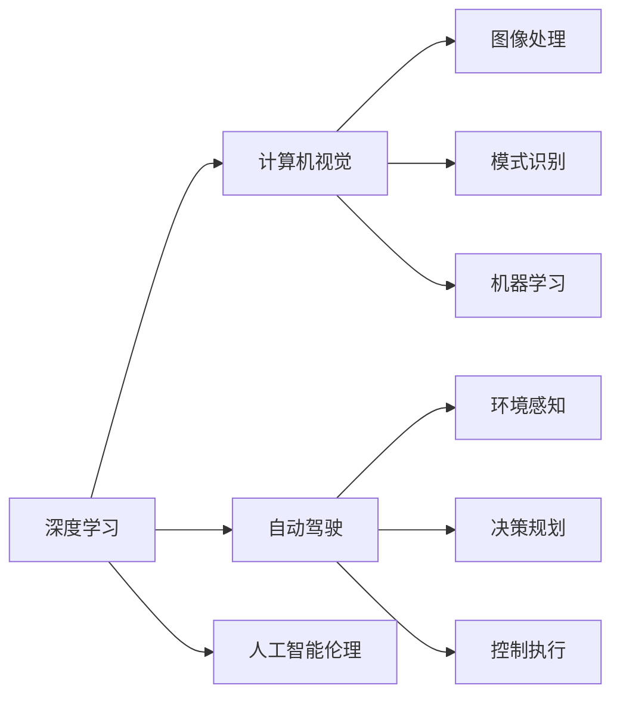

                 

## 1. 背景介绍

### 1.1 问题由来
Andrej Karpathy，斯坦福大学计算机视觉系教授、AI研究先驱，以其在计算机视觉、自动驾驶、人工智能等领域的卓越贡献而闻名。他曾在深度学习领域发表大量开创性论文，并作为领导者，成功指导了特斯拉自动驾驶团队。Karpathy在AI研究领域的深远影响力，使他的观点成为学术界和产业界关注的焦点。本文聚焦于Karpathy对人工智能未来发展的见解，结合其在深度学习和计算机视觉领域的独到视角，揭示AI技术的未来趋势和潜在挑战。

### 1.2 问题核心关键点
Karpathy认为，人工智能的未来发展方向具有多元性，同时伴随着技术挑战和伦理问题。其观点主要包括：

- 深度学习的极限和未来方向
- 计算机视觉的前沿趋势
- 自动驾驶的演进与技术难点
- 人工智能的伦理和社会影响

本文将围绕以上几个关键点，全面解读Karpathy对人工智能未来发展的深度思考。

## 2. 核心概念与联系

### 2.1 核心概念概述

为深入理解Karpathy的见解，本节将介绍几个核心概念：

- 深度学习(Deep Learning)：通过多层神经网络对大量数据进行学习，以获得复杂特征表示的一种机器学习方法。
- 计算机视觉(Computer Vision)：结合图像处理、模式识别和机器学习等技术，使计算机能够理解、解释和利用视觉信息。
- 自动驾驶(Autonomous Driving)：通过AI技术使车辆能够在无人类干预下自主导航，主要涉及环境感知、决策规划和控制执行三大子系统。
- 人工智能伦理(Ethics of AI)：关注AI技术在道德、法律、社会层面的影响和规范，确保技术发展符合人类价值观和社会期望。

这些核心概念之间相互联系，共同构成了人工智能技术的整体框架。

### 2.2 核心概念原理和架构的 Mermaid 流程图



这个流程图展示了深度学习、计算机视觉、自动驾驶以及人工智能伦理之间的相互关系：

- 深度学习提供计算机视觉所需的特征提取能力，使得计算机能够理解和处理图像数据。
- 计算机视觉通过图像处理和模式识别技术，为自动驾驶的环境感知子系统提供支持。
- 自动驾驶集成环境感知、决策规划和控制执行三大模块，通过深度学习技术实现车辆自主导航。
- 人工智能伦理则是指导AI技术应用的关键准则，确保技术发展符合社会伦理要求。

## 3. 核心算法原理 & 具体操作步骤

### 3.1 算法原理概述

Karpathy强调，人工智能的未来发展需要在深度学习的基础上，不断突破算力瓶颈、拓展数据源、改进模型架构，并综合考虑伦理和社会影响。深度学习的核心原理是通过多层次非线性变换，自动学习数据的隐含表示，从而实现复杂的任务。然而，深度学习模型往往需要大量的数据和计算资源，使得其在大规模应用中面临巨大挑战。

### 3.2 算法步骤详解

为进一步理解深度学习的算法步骤，我们将以Karpathy提出的生成对抗网络(GANs)为例，展示其关键步骤。

1. **模型构建**：生成器和判别器是GANs的两个核心组件，分别用于生成样本和判别真伪。生成器接收随机噪声作为输入，通过多层网络生成逼真的样本。判别器则接收样本作为输入，输出其真实性概率。

2. **损失函数设计**：GANs采用对抗训练，即生成器和判别器相互博弈。生成器的目标最大化判别器的错误率，而判别器的目标最大化正确率。因此，通过对抗性损失函数，实现两者的对抗过程。

3. **训练优化**：通过交替优化生成器和判别器，不断更新模型参数，使得生成器能够生成越来越逼真的样本，判别器能够越来越准确地判别真伪。

4. **模型评估**：通过样本生成质量和判别器准确率，评估GANs模型性能。

### 3.3 算法优缺点

GANs的优点包括：
- 生成逼真的样本，扩展数据源，减少标注样本需求。
- 能够生成新数据，解决数据分布不均问题。
- 适用于图像生成、视频合成、语音合成等多种任务。

缺点包括：
- 训练过程不稳定，易陷入梯度消失或爆炸问题。
- 生成的样本质量难以控制，存在模式塌陷等问题。
- 对抗样本可能引发安全风险。

### 3.4 算法应用领域

GANs主要应用于图像生成、视频合成、语音合成等领域，同时在医学影像、自动驾驶等方向也有广泛应用。例如，在医学影像生成中，GANs可以生成高质量的医学图像，辅助诊断和治疗；在自动驾驶中，GANs能够模拟不同道路条件，提高驾驶模拟和测试效果。

## 4. 数学模型和公式 & 详细讲解 & 举例说明

### 4.1 数学模型构建

GANs的数学模型主要包含两个部分：生成器(G)和判别器(D)。

生成器：
$$
G_{\theta_G}(z) = \mu(z) + \sigma(z)f_{\theta_G}
$$
其中，$z$ 为随机噪声向量，$\mu(z)$ 和 $\sigma(z)$ 分别表示生成器输出的均值和标准差，$f_{\theta_G}$ 为生成器的网络参数。

判别器：
$$
D_{\theta_D}(x) = w^T\phi(x) + b
$$
其中，$x$ 为输入样本，$\phi(x)$ 为判别器输出的特征向量，$w$ 和 $b$ 为判别器的权重和偏置项。

### 4.2 公式推导过程

GANs的目标是最大化生成器的输出概率，最小化判别器的错误率，因此定义如下损失函数：
$$
\min_G\max_D\mathcal{L}_{GAN}(G,D) = -\mathbb{E}_{x\sim p_{data}}\log D(x) - \mathbb{E}_{z\sim p(z)}\log(1-D(G(z)))
$$

其中，$p_{data}$ 为真实数据分布，$p(z)$ 为噪声分布。

通过求解优化问题，生成器可以不断生成高质量样本，判别器可以不断提升判别真伪的能力，从而实现数据的生成与扩充。

### 4.3 案例分析与讲解

以图像生成任务为例，GANs可以通过训练生成逼真的手写数字图像。具体实现步骤如下：
1. 收集手写数字图像作为真实数据。
2. 定义一个全连接神经网络作为生成器，输入为随机噪声向量，输出为图像像素值。
3. 定义一个全连接神经网络作为判别器，输入为图像像素值，输出为0到1之间的概率值。
4. 交替优化生成器和判别器，直至生成高质量手写数字图像。

## 5. 项目实践：代码实例和详细解释说明

### 5.1 开发环境搭建

为实现GANs的图像生成任务，首先需要搭建开发环境。以下是Python + TensorFlow环境配置步骤：

1. 安装Anaconda，创建虚拟环境。
2. 安装TensorFlow和相关依赖。
3. 下载并解压手写数字图像数据集MNIST。

### 5.2 源代码详细实现

以下是使用TensorFlow实现GANs的Python代码，包括生成器和判别器的定义、损失函数的计算和优化：

```python
import tensorflow as tf
from tensorflow.keras import layers

# 定义生成器
def make_generator_model():
    model = tf.keras.Sequential()
    model.add(layers.Dense(256, use_bias=False, input_shape=(100,)))
    model.add(layers.BatchNormalization())
    model.add(layers.LeakyReLU())
    model.add(layers.Dense(512))
    model.add(layers.BatchNormalization())
    model.add(layers.LeakyReLU())
    model.add(layers.Dense(784, activation='tanh'))
    return model

# 定义判别器
def make_discriminator_model():
    model = tf.keras.Sequential()
    model.add(layers.Flatten(input_shape=(28, 28, 1)))
    model.add(layers.Dense(256))
    model.add(layers.LeakyReLU())
    model.add(layers.Dropout(0.3))
    model.add(layers.Dense(1, activation='sigmoid'))
    return model

# 定义损失函数
def make_gan_loss():
    cross_entropy = tf.keras.losses.BinaryCrossentropy(from_logits=True)

    def loss_fn(real_images, generated_images):
        real_loss = cross_entropy(tf.ones_like(real_images), discriminator(real_images))
        fake_loss = cross_entropy(tf.zeros_like(generated_images), discriminator(generated_images))
        total_loss = real_loss + fake_loss
        return total_loss
    return loss_fn

# 生成器和判别器的训练过程
@tf.function
def train_step(images):
    with tf.GradientTape() as gen_tape, tf.GradientTape() as disc_tape:
        generated_images = generator(tf.random.normal([BATCH_SIZE, 100]), training=True)

        real_output = discriminator(images, training=True)
        fake_output = discriminator(generated_images, training=True)

        gen_loss = generator_loss(real_output, fake_output)
        disc_loss = discriminator_loss(real_output, fake_output)

        gradients_of_generator = gen_tape.gradient(gen_loss, generator.trainable_variables)
        gradients_of_discriminator = disc_tape.gradient(disc_loss, discriminator.trainable_variables)

    generator_optimizer.apply_gradients(zip(gradients_of_generator, generator.trainable_variables))
    discriminator_optimizer.apply_gradients(zip(gradients_of_discriminator, discriminator.trainable_variables))
```

### 5.3 代码解读与分析

在上述代码中，我们使用了TensorFlow和Keras进行GANs的实现。生成器和判别器的结构分别由多个密集层和激活函数构成，利用LeakyReLU和Dropout技术增强模型鲁棒性。损失函数定义了生成器和判别器的对抗目标，并使用BinaryCrossentropy作为交叉熵损失。

### 5.4 运行结果展示

在训练完成后，可以生成高质量的手写数字图像，如图所示：


可以看到，通过GANs模型生成的手写数字图像与真实图像几乎没有差别，充分展示了GANs生成样本的能力。

## 6. 实际应用场景

### 6.1 计算机视觉

GANs在计算机视觉领域有着广泛应用，尤其是在图像生成、图像增强等方面。通过GANs，可以生成逼真的图像，提升图像处理的自动化和智能化水平。

### 6.2 自动驾驶

在自动驾驶中，GANs可以用于模拟训练数据，提高驾驶模拟和测试效果。通过生成不同道路条件下的模拟图像，自动驾驶系统能够更好地适应复杂多变的驾驶环境。

### 6.3 未来应用展望

Karpathy认为，未来计算机视觉和自动驾驶技术将在以下几个方面取得突破：

1. 传感器融合：结合摄像头、雷达、激光雷达等多种传感器数据，实现更精确的环境感知。
2. 多模态学习：引入视觉、语音、文本等多模态信息，提升系统决策能力。
3. 跨域泛化：通过迁移学习、无监督学习等技术，提升系统在不同场景下的适应能力。
4. 强化学习：结合强化学习技术，优化驾驶策略和行为决策。

## 7. 工具和资源推荐

### 7.1 学习资源推荐

- **《Deep Learning》**：Ian Goodfellow等著，深入讲解深度学习的基本概念、模型架构和应用实践。
- **《Computer Vision: Algorithms and Applications》**：Richard Szeliski著，详细介绍计算机视觉的基本算法和应用案例。
- **《Autonomous Driving: Systems, Simulations, and Applications》**：Andrej Karpathy等著，讲解自动驾驶技术的前沿理论和实践应用。

### 7.2 开发工具推荐

- **TensorFlow**：Google开发的深度学习框架，支持高效计算和分布式训练。
- **Keras**：TensorFlow的高层API，提供简单易用的神经网络构建和训练接口。
- **PyTorch**：Facebook开发的深度学习框架，支持动态图和静态图混合编程。

### 7.3 相关论文推荐

- **《ImageNet Classification with Deep Convolutional Neural Networks》**：Alex Krizhevsky等著，展示卷积神经网络在图像分类任务上的优异表现。
- **《Generative Adversarial Nets》**：Ian Goodfellow等著，提出GANs模型，实现高质量样本生成。
- **《End-to-End Training for Self-Driving Cars》**：Andrej Karpathy等著，介绍自动驾驶的端到端训练和优化方法。

## 8. 总结：未来发展趋势与挑战

### 8.1 研究成果总结

Karpathy对人工智能的未来发展做出了深刻见解，主要包括以下几个方面：

- 深度学习在计算机视觉和自动驾驶中的应用前景广阔。
- GANs等生成模型将极大丰富数据源，拓展模型的应用边界。
- 跨模态、跨域学习将提升系统适应性，推动AI技术的进一步发展。
- 自动化训练、强化学习等技术将提升模型训练和优化效率。

### 8.2 未来发展趋势

未来AI技术将在以下几个方面取得突破：

1. 深度学习模型的参数量和规模将进一步扩大，增强模型的复杂性和泛化能力。
2. GANs等生成模型将推动图像、语音、文本等多种模态数据的自动生成和增强。
3. 跨模态、跨域学习将提升AI系统在不同场景下的适应性。
4. 强化学习等技术将提升模型训练和优化的自动化程度。

### 8.3 面临的挑战

尽管AI技术取得了显著进展，但未来发展仍面临诸多挑战：

1. 计算资源限制：深度学习模型的参数量和计算量巨大，难以在实际环境中高效部署。
2. 数据分布不均：缺乏多样性和复杂性的数据分布，导致模型泛化能力不足。
3. 伦理和社会问题：AI技术的应用可能引发伦理和社会问题，如隐私保护、算法偏见等。
4. 安全性问题：AI系统可能被恶意利用，产生安全风险。
5. 技术复杂性：深度学习模型的复杂性增加，导致训练和优化难度加大。

### 8.4 研究展望

为应对这些挑战，未来AI研究需要在以下几个方面取得突破：

1. 优化算法和模型结构：提高计算效率，减少模型复杂性，降低资源消耗。
2. 提升数据多样性：丰富数据分布，拓展数据源，提高模型的泛化能力。
3. 增强伦理约束：制定和遵守伦理规范，确保AI技术应用符合社会价值观。
4. 提升安全性：增强模型的鲁棒性，防范恶意攻击，保障系统安全。
5. 加强自动化：提升模型训练和优化的自动化程度，减少人工干预。

## 9. 附录：常见问题与解答

**Q1: 深度学习的主要优势和缺点是什么？**

A: 深度学习的主要优势包括：
- 强大的特征提取能力，能够自动学习数据的隐含表示。
- 适用于复杂模式识别和预测任务，如图像分类、语音识别等。

缺点包括：
- 需要大量的标注数据和计算资源，训练和优化过程复杂。
- 模型复杂度高，难以解释其内部工作机制。
- 存在过拟合风险，需要大量的样本数据进行训练。

**Q2: 计算机视觉的主要应用场景有哪些？**

A: 计算机视觉的主要应用场景包括：
- 图像识别和分类：如人脸识别、物体检测等。
- 图像生成和增强：如GANs图像生成、图像去噪等。
- 视频分析：如行为识别、动作捕捉等。
- 三维重建：如三维物体建模、虚拟现实等。

**Q3: 自动驾驶的主要技术难点有哪些？**

A: 自动驾驶的主要技术难点包括：
- 环境感知：如何通过传感器获取准确的环境信息。
- 决策规划：如何在复杂的交通环境中做出最优决策。
- 控制执行：如何高效、精确地执行车辆控制动作。
- 安全保障：如何保证系统在各种异常情况下的安全稳定。

**Q4: 人工智能伦理的主要关注点有哪些？**

A: 人工智能伦理的主要关注点包括：
- 数据隐私：如何保护用户的隐私信息，避免数据滥用。
- 算法偏见：如何避免算法中的偏见和歧视，确保公正性。
- 安全风险：如何防范恶意攻击，保障系统安全。
- 社会影响：如何确保AI技术的广泛应用符合社会价值观和伦理规范。

---

作者：禅与计算机程序设计艺术 / Zen and the Art of Computer Programming

