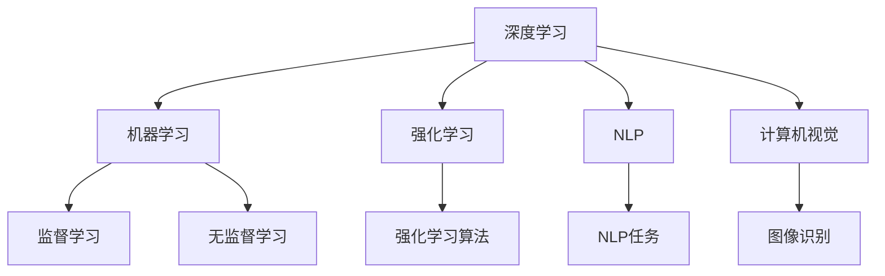

                 

# Andrej Karpathy：人工智能的未来发展挑战

在科技飞速发展的今天，人工智能（AI）已经成为推动社会进步的重要力量。然而，AI的未来发展并非一帆风顺，它面临着诸多挑战。本文将深入探讨Andrej Karpathy在其演讲中提到的AI未来发展的主要挑战，以及应对这些挑战的策略和思考。

## 1. 背景介绍

### 1.1 问题由来
人工智能领域在过去几十年里取得了显著进展，从最初的专家系统到如今的深度学习和机器学习，AI的应用范围和深度都在不断扩展。Andrej Karpathy，作为斯坦福大学人工智能实验室的教授，同时也是Facebook AI Research（FAIR）的研究员，对AI的未来发展有着深刻的见解。在他的演讲中，Karpathy强调了AI在应用过程中面临的挑战，并提出了相应的解决方案。

### 1.2 问题核心关键点
Karpathy认为，当前AI面临的主要挑战包括以下几个方面：

1. **伦理和道德问题**：AI的应用可能带来伦理和道德问题，如隐私保护、算法偏见等。
2. **安全性**：AI系统在关键领域（如医疗、交通）的可靠性与安全至关重要。
3. **可解释性**：许多AI模型，特别是深度学习模型，缺乏可解释性，导致用户难以理解其决策过程。
4. **数据依赖**：AI模型高度依赖于数据，数据质量和数量直接影响模型的性能。
5. **计算资源**：训练大规模AI模型需要大量计算资源，成本高昂。

## 2. 核心概念与联系

### 2.1 核心概念概述

为了更好地理解Karpathy所提到的AI挑战，我们将涉及以下几个核心概念：

- **深度学习**：基于神经网络的机器学习方法，通过多层非线性变换学习输入数据的复杂特征。
- **机器学习**：通过数据训练模型，使模型能够对新数据进行预测或分类。
- **强化学习**：通过与环境的交互，优化模型行为以最大化某种奖励的算法。
- **自然语言处理（NLP）**：使计算机能够理解、处理和生成人类语言的技术。
- **计算机视觉**：使计算机能够理解和分析图像和视频的技术。

这些概念之间的联系可以通过以下Mermaid流程图来展示：



这个流程图展示了深度学习、机器学习和强化学习之间的相互关系，以及它们如何应用于NLP和计算机视觉领域。

## 3. 核心算法原理 & 具体操作步骤

### 3.1 算法原理概述
Andrej Karpathy在其演讲中强调了深度学习算法在AI中的核心地位。深度学习通过多层神经网络，能够自动学习输入数据的复杂特征，适用于各种NLP和计算机视觉任务。然而，深度学习模型的可解释性问题、数据依赖以及计算资源需求，是当前面临的主要挑战。

### 3.2 算法步骤详解
深度学习模型的训练通常包括以下几个步骤：

1. **数据预处理**：将原始数据转换为模型可以处理的格式。
2. **模型定义**：选择合适的神经网络架构，并定义模型的损失函数。
3. **模型训练**：使用训练数据对模型进行优化，最小化损失函数。
4. **模型评估**：使用验证集或测试集评估模型性能。
5. **模型部署**：将训练好的模型部署到实际应用中。

### 3.3 算法优缺点
深度学习的优点包括：

- **高精度**：在许多任务中，深度学习模型的表现优于传统机器学习方法。
- **自动特征提取**：模型能够自动学习输入数据的复杂特征。

然而，深度学习也存在以下缺点：

- **计算资源需求高**：训练大规模深度学习模型需要大量计算资源。
- **可解释性差**：深度学习模型的决策过程难以解释，缺乏透明度。
- **数据依赖**：深度学习模型高度依赖于训练数据，数据质量和数量直接影响模型性能。

### 3.4 算法应用领域
深度学习在以下几个领域得到了广泛应用：

1. **自然语言处理（NLP）**：如机器翻译、文本分类、情感分析等。
2. **计算机视觉**：如图像识别、物体检测、图像生成等。
3. **语音识别**：将语音信号转换为文本或命令。
4. **自动驾驶**：处理传感器数据，进行路径规划和决策。

## 4. 数学模型和公式 & 详细讲解 & 举例说明

### 4.1 数学模型构建

以深度学习中的卷积神经网络（CNN）为例，其数学模型可以表示为：

$$
y = Wx + b
$$

其中，$x$ 是输入数据，$W$ 是权重矩阵，$b$ 是偏置向量，$y$ 是输出。

### 4.2 公式推导过程

卷积神经网络的核心操作是卷积操作。对于二维输入数据 $x$，卷积操作的定义为：

$$
y(x) = \sum_{i=0}^{n-1} \sum_{j=0}^{m-1} W_{i,j} x_{i,j}
$$

其中，$W$ 是卷积核，$n$ 和 $m$ 是卷积核的大小。

### 4.3 案例分析与讲解

以图像分类任务为例，CNN可以通过卷积层和池化层对图像特征进行提取和降维，最终通过全连接层进行分类。这种架构在ImageNet等大规模图像数据集上取得了优异的表现。

## 5. 项目实践：代码实例和详细解释说明

### 5.1 开发环境搭建

在进行深度学习项目时，我们需要以下开发环境：

1. **Python**：深度学习的主要编程语言。
2. **PyTorch**：常用的深度学习框架。
3. **Jupyter Notebook**：交互式编程环境。
4. **GPU**：加速深度学习模型训练。

### 5.2 源代码详细实现

以下是一个简单的卷积神经网络实现，用于图像分类：

```python
import torch
import torch.nn as nn
import torch.optim as optim
import torchvision
import torchvision.transforms as transforms

class Net(nn.Module):
    def __init__(self):
        super(Net, self).__init__()
        self.conv1 = nn.Conv2d(3, 6, 5)
        self.pool = nn.MaxPool2d(2, 2)
        self.conv2 = nn.Conv2d(6, 16, 5)
        self.fc1 = nn.Linear(16 * 5 * 5, 120)
        self.fc2 = nn.Linear(120, 84)
        self.fc3 = nn.Linear(84, 10)

    def forward(self, x):
        x = self.pool(F.relu(self.conv1(x)))
        x = self.pool(F.relu(self.conv2(x)))
        x = x.view(-1, 16 * 5 * 5)
        x = F.relu(self.fc1(x))
        x = F.relu(self.fc2(x))
        x = self.fc3(x)
        return x

# 加载数据集
transform = transforms.Compose(
    [transforms.ToTensor(),
     transforms.Normalize((0.5, 0.5, 0.5), (0.5, 0.5, 0.5))])

trainset = torchvision.datasets.CIFAR10(root='./data', train=True,
                                        download=True, transform=transform)
trainloader = torch.utils.data.DataLoader(trainset, batch_size=4,
                                          shuffle=True, num_workers=2)

testset = torchvision.datasets.CIFAR10(root='./data', train=False,
                                       download=True, transform=transform)
testloader = torch.utils.data.DataLoader(testset, batch_size=4,
                                         shuffle=False, num_workers=2)

# 定义模型、优化器和损失函数
net = Net()
criterion = nn.CrossEntropyLoss()
optimizer = optim.SGD(net.parameters(), lr=0.001, momentum=0.9)

# 训练模型
for epoch in range(2):
    running_loss = 0.0
    for i, data in enumerate(trainloader, 0):
        inputs, labels = data
        optimizer.zero_grad()
        outputs = net(inputs)
        loss = criterion(outputs, labels)
        loss.backward()
        optimizer.step()
        running_loss += loss.item()
        if i % 2000 == 1999:    # 每2000个小批次后输出一次loss信息
            print('[%d, %5d] loss: %.3f' %
                  (epoch + 1, i + 1, running_loss / 2000))
            running_loss = 0.0

print('Finished Training')
```

### 5.3 代码解读与分析

在上述代码中，我们定义了一个简单的卷积神经网络模型，用于CIFAR-10数据集上的图像分类任务。模型包括两个卷积层和三个全连接层，最后通过交叉熵损失函数进行训练。

## 6. 实际应用场景

### 6.1 智能推荐系统

智能推荐系统通过深度学习模型对用户行为数据进行分析和建模，从而为用户推荐个性化内容。这种系统可以应用于电商、视频平台、社交网络等多个领域，提高用户满意度和留存率。

### 6.2 自动驾驶

自动驾驶技术通过深度学习模型对传感器数据进行处理和分析，实现车辆的路径规划和决策。这项技术在汽车行业的应用前景广阔，有望大幅提升交通安全和效率。

### 6.3 医疗影像诊断

深度学习模型在医疗影像诊断中表现出色，可以通过对医学影像的分析，辅助医生进行疾病诊断和治疗决策。这不仅提高了诊断的准确性，还减少了医生的工作量。

## 7. 工具和资源推荐

### 7.1 学习资源推荐

为了深入理解深度学习算法和其应用，以下是一些推荐的资源：

1. **《Deep Learning》书籍**：Ian Goodfellow、Yoshua Bengio和Aaron Courville合著的经典书籍，全面介绍了深度学习的理论基础和实践方法。
2. **Coursera《深度学习专项课程》**：由Andrew Ng教授主讲的深度学习课程，适合初学者和进阶学习者。
3. **arXiv**：深度学习领域的预印本论文库，包含大量最新研究成果。
4. **Kaggle**：数据科学竞赛平台，提供丰富的数据集和模型挑战，是学习和实践深度学习的好地方。

### 7.2 开发工具推荐

为了提高深度学习项目的开发效率，以下是一些推荐的开发工具：

1. **PyTorch**：灵活的深度学习框架，支持动态图和静态图两种计算图。
2. **TensorFlow**：Google开发的深度学习框架，支持分布式训练和高性能计算。
3. **Jupyter Notebook**：交互式编程环境，支持多种编程语言和数据可视化。
4. **Git**：版本控制工具，用于管理代码和协作开发。

### 7.3 相关论文推荐

以下是一些深度学习领域的重要论文：

1. **《ImageNet Classification with Deep Convolutional Neural Networks》**：Alex Krizhevsky等人提出的深度卷积神经网络在ImageNet图像分类任务上取得优异表现。
2. **《Recurrent Neural Network Architectures》**：Andrej Karpathy等人提出的循环神经网络，用于处理序列数据。
3. **《Deep Learning for Self-Driving Cars》**：Andrej Karpathy等人提出的深度学习模型在自动驾驶中的应用，推动了自动驾驶技术的进步。

## 8. 总结：未来发展趋势与挑战

### 8.1 研究成果总结

Andrej Karpathy在演讲中强调了深度学习算法在AI领域的重要性，同时指出了当前面临的挑战，包括伦理和道德问题、安全性、可解释性、数据依赖和计算资源需求。针对这些问题，他提出了相应的解决方案和思考。

### 8.2 未来发展趋势

未来，深度学习将继续在AI领域发挥重要作用，但同时也需要解决以下趋势：

1. **跨领域应用**：深度学习模型将被广泛应用于医疗、自动驾驶、机器人等多个领域。
2. **模型可解释性**：提高深度学习模型的可解释性，使其决策过程更加透明。
3. **数据质量提升**：通过数据增强和迁移学习等技术，提高深度学习模型的鲁棒性和泛化能力。
4. **计算资源优化**：开发更加高效的计算图和算法，减少深度学习模型的训练和推理时间。

### 8.3 面临的挑战

尽管深度学习在AI领域取得了巨大成功，但未来仍面临以下挑战：

1. **伦理和道德问题**：深度学习模型可能带来伦理和道德问题，如隐私保护、算法偏见等。
2. **安全性**：深度学习模型在关键领域的应用需要高可靠性和安全性。
3. **可解释性**：深度学习模型的决策过程难以解释，缺乏透明度。
4. **数据依赖**：深度学习模型高度依赖于训练数据，数据质量和数量直接影响模型性能。
5. **计算资源**：训练大规模深度学习模型需要大量计算资源，成本高昂。

### 8.4 研究展望

未来的研究需要在以下几个方向进行探索：

1. **模型可解释性**：开发可解释性更强的深度学习模型，使其决策过程更加透明。
2. **跨领域应用**：将深度学习模型应用于医疗、自动驾驶、机器人等多个领域。
3. **数据质量提升**：通过数据增强和迁移学习等技术，提高深度学习模型的鲁棒性和泛化能力。
4. **计算资源优化**：开发更加高效的计算图和算法，减少深度学习模型的训练和推理时间。

## 9. 附录：常见问题与解答

**Q1：如何提高深度学习模型的可解释性？**

A: 提高深度学习模型的可解释性可以通过以下方法：

1. **可视化技术**：使用可视化工具，如Grad-CAM、LIME等，可视化模型在每个输入特征上的权重，帮助理解模型决策过程。
2. **特征重要性分析**：计算每个特征对模型输出的贡献度，筛选出对模型决策最重要的特征。
3. **模型简化**：使用剪枝、融合等技术，简化模型结构，提高可解释性。

**Q2：如何处理深度学习模型的过拟合问题？**

A: 处理深度学习模型的过拟合问题可以通过以下方法：

1. **数据增强**：通过数据增强技术，如旋转、平移、裁剪等，扩充训练集。
2. **正则化**：使用L1、L2正则化等技术，限制模型参数的大小。
3. **Dropout**：在训练过程中随机丢弃一部分神经元，减少过拟合风险。
4. **早停法**：在验证集上监测模型性能，一旦性能不再提升，立即停止训练。

**Q3：如何提高深度学习模型的泛化能力？**

A: 提高深度学习模型的泛化能力可以通过以下方法：

1. **迁移学习**：使用预训练模型作为初始化参数，在新的数据集上进行微调。
2. **数据增强**：通过数据增强技术，扩充训练集。
3. **正则化**：使用L1、L2正则化等技术，限制模型参数的大小。
4. **对抗训练**：使用对抗样本，提高模型的鲁棒性。

通过以上方法，可以提高深度学习模型的泛化能力，使其在新的数据集上表现更好。

---

作者：禅与计算机程序设计艺术 / Zen and the Art of Computer Programming

