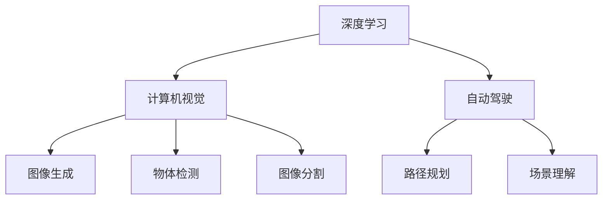

                 

# 安德烈·卡帕西：人工智能的未来发展方向

安德烈·卡帕西（Andrej Karpathy）是深度学习领域的一位杰出的研究者和开发者，以其在计算机视觉、自动驾驶和人工智能领域的开创性工作而闻名。他的研究和教学工作对整个计算机科学界产生了深远的影响。本文将探讨安德烈·卡帕西在人工智能领域的发展趋势和未来展望。

## 1. 背景介绍

### 1.1 问题由来

安德烈·卡帕西的研究生涯始于计算机视觉，他主要专注于图像识别和深度学习技术。他的研究工作涵盖了从基础理论到实际应用的全方位内容，为深度学习领域的发展做出了重要贡献。特别是他在计算机视觉中的创新性成果，包括图像生成、物体检测和图像分割等领域，都极大地推动了计算机视觉技术的进步。

### 1.2 问题核心关键点

安德烈·卡帕西的研究涵盖了深度学习、计算机视觉和自动驾驶等多个领域，他的工作主要集中在以下几个关键点：

- **深度学习模型**：他在深度神经网络的结构设计和优化方面做出了显著贡献。
- **计算机视觉**：他在物体检测、图像分割、场景理解等方面有着深入的研究。
- **自动驾驶**：他的工作推动了自动驾驶技术的发展，特别是在图像识别和路径规划方面。
- **教学与教育**：他通过编写深入浅出的教学材料和公开课程，培养了大量的深度学习研究者和实践者。

## 2. 核心概念与联系

### 2.1 核心概念概述

为更好地理解安德烈·卡帕西在人工智能领域的研究和展望，我们首先介绍一些关键概念：

- **深度学习**：一种基于神经网络的机器学习方法，通过多层非线性变换，从数据中学习特征表示。
- **计算机视觉**：计算机科学中的一个重要分支，专注于通过算法使计算机能够“看”和理解图像和视频数据。
- **自动驾驶**：利用计算机视觉和机器学习技术，使车辆能够自主导航和决策。
- **图像生成**：通过深度学习模型，生成新的图像，常常用于图像增强、风格迁移等任务。
- **物体检测与分割**：识别并分割图像中的对象，是计算机视觉中的核心任务之一。
- **教学与教育**：通过提供易于理解的教材和课程，使更多人能够学习并应用深度学习技术。

这些核心概念之间的逻辑关系可以通过以下Mermaid流程图来展示：



这个流程图展示了深度学习在计算机视觉和自动驾驶中的应用，以及相关的关键任务和概念。

## 3. 核心算法原理 & 具体操作步骤
### 3.1 算法原理概述

安德烈·卡帕西的研究主要集中在以下几个算法原理和操作步骤：

- **深度神经网络**：通过多层非线性变换，学习和提取数据的高级特征表示。
- **卷积神经网络（CNN）**：一种特殊的深度神经网络，特别适用于图像处理任务。
- **物体检测与分割算法**：使用深度神经网络进行目标检测和图像分割。
- **生成对抗网络（GAN）**：一种生成模型，用于生成新的图像数据。
- **自动驾驶算法**：结合计算机视觉和深度学习，实现车辆的自主导航和决策。

### 3.2 算法步骤详解

以下详细介绍安德烈·卡帕西在深度学习研究中的几个关键算法步骤：

**Step 1: 准备数据集**

- 收集和标注大量的图像数据集，如CIFAR-10、ImageNet等。
- 将数据集分为训练集、验证集和测试集。

**Step 2: 设计深度神经网络模型**

- 设计并训练深度神经网络，如CNN、RNN等，用于图像分类、物体检测等任务。
- 使用迁移学习，利用预训练的模型作为初始权重。

**Step 3: 训练和优化模型**

- 使用梯度下降等优化算法，训练深度神经网络。
- 通过交叉验证等技术，调整超参数，如学习率、批大小等。

**Step 4: 模型评估和验证**

- 在测试集上评估模型性能，如准确率、召回率、F1分数等。
- 通过可视化工具，分析模型在特定任务上的表现。

**Step 5: 模型部署和应用**

- 将训练好的模型部署到实际应用场景中。
- 不断收集新的数据，更新模型以适应新任务。

### 3.3 算法优缺点

安德烈·卡帕西在深度学习算法的研究中，提出了以下优缺点：

**优点**：
- 深度学习模型可以自动学习复杂特征，适用于多种计算机视觉任务。
- CNN在图像识别和物体检测方面表现优异。
- 生成对抗网络可以生成高质量的图像数据。

**缺点**：
- 需要大量的数据和计算资源进行训练。
- 深度模型容易出现过拟合现象。
- 模型难以解释其内部工作机制。

### 3.4 算法应用领域

安德烈·卡帕西的研究在以下几个领域中得到了广泛应用：

- **自动驾驶**：利用计算机视觉技术，实现车辆的自主导航和决策。
- **医学影像分析**：使用深度学习模型进行医学影像的分析和诊断。
- **视频监控**：通过深度学习模型进行视频中的物体检测和行为分析。
- **游戏AI**：开发深度学习模型，用于游戏中的对象识别和路径规划。
- **虚拟现实**：利用深度学习生成高质量的虚拟图像和环境。

## 4. 数学模型和公式 & 详细讲解 & 举例说明

### 4.1 数学模型构建

在深度学习中，数学模型是理解和实现算法的关键。安德烈·卡帕西的研究涉及多个数学模型，以下以CNN为例，介绍其基本结构和数学模型。

- **卷积层**：使用卷积操作提取局部特征。
- **池化层**：通过降采样减少数据维度。
- **全连接层**：将卷积层和池化层的特征映射为类别概率。

### 4.2 公式推导过程

以CNN为例，介绍其在图像分类任务中的基本公式和推导过程：

**输入层**：输入图像数据。
$$ X \in \mathbb{R}^{H\times W \times C} $$

**卷积层**：通过卷积核提取特征。
$$ Y^{(l)} = \sigma \left( W^{(l)} * X + b^{(l)} \right) $$

**池化层**：通过降采样减少数据维度。
$$ Y^{(l+1)} = \max(\theta_0, \theta_1 * Y^{(l)}) $$

**全连接层**：将特征映射为类别概率。
$$ Z = W * Y^{(l+1)} + b $$
$$ P = softmax(Z) $$

其中，$*$表示卷积操作，$\sigma$表示非线性激活函数，$*$表示元素乘法，$\max$表示取最大值，$softmax$表示归一化指数函数。

### 4.3 案例分析与讲解

以安德烈·卡帕西在图像分类任务中的研究为例，介绍CNN的具体应用和性能评估：

**案例分析**：
- 使用CIFAR-10数据集进行训练和测试。
- 设计并训练一个6层卷积神经网络。
- 通过交叉验证调整超参数。
- 在测试集上评估模型性能。

**性能评估**：
- 准确率：模型正确分类的样本数占总样本数的比例。
- 召回率：模型正确识别出的正样本数占总正样本数的比例。
- F1分数：综合准确率和召回率的评估指标。

## 5. 项目实践：代码实例和详细解释说明
### 5.1 开发环境搭建

在进行深度学习项目实践时，需要搭建合适的开发环境。以下是使用Python和PyTorch进行深度学习开发的环境配置流程：

1. 安装Anaconda：从官网下载并安装Anaconda，用于创建独立的Python环境。
2. 创建并激活虚拟环境：
```bash
conda create -n pytorch-env python=3.8
conda activate pytorch-env
```
3. 安装PyTorch：根据CUDA版本，从官网获取对应的安装命令。例如：
```bash
conda install pytorch torchvision torchaudio cudatoolkit=11.1 -c pytorch -c conda-forge
```
4. 安装TensorFlow：从官网下载并安装TensorFlow，支持多GPU训练。
5. 安装Transformers库：
```bash
pip install transformers
```
6. 安装各类工具包：
```bash
pip install numpy pandas scikit-learn matplotlib tqdm jupyter notebook ipython
```

完成上述步骤后，即可在`pytorch-env`环境中开始深度学习项目实践。

### 5.2 源代码详细实现

以下以安德烈·卡帕西的图像分类项目为例，给出使用PyTorch进行CNN模型训练的代码实现。

```python
import torch
import torch.nn as nn
import torchvision.transforms as transforms
import torchvision.datasets as datasets
from torch.utils.data import DataLoader
import torch.optim as optim
from torch.autograd import Variable

# 定义卷积神经网络模型
class CNN(nn.Module):
    def __init__(self):
        super(CNN, self).__init__()
        self.conv1 = nn.Conv2d(3, 64, kernel_size=3, stride=1, padding=1)
        self.relu1 = nn.ReLU()
        self.pool1 = nn.MaxPool2d(kernel_size=2, stride=2)
        self.conv2 = nn.Conv2d(64, 128, kernel_size=3, stride=1, padding=1)
        self.relu2 = nn.ReLU()
        self.pool2 = nn.MaxPool2d(kernel_size=2, stride=2)
        self.fc1 = nn.Linear(128 * 7 * 7, 512)
        self.relu3 = nn.ReLU()
        self.fc2 = nn.Linear(512, 10)
        
    def forward(self, x):
        x = self.conv1(x)
        x = self.relu1(x)
        x = self.pool1(x)
        x = self.conv2(x)
        x = self.relu2(x)
        x = self.pool2(x)
        x = x.view(-1, 128 * 7 * 7)
        x = self.fc1(x)
        x = self.relu3(x)
        x = self.fc2(x)
        return x

# 定义损失函数和优化器
criterion = nn.CrossEntropyLoss()
optimizer = optim.Adam(model.parameters(), lr=0.001)

# 训练模型
def train(model, train_loader, criterion, optimizer):
    model.train()
    running_loss = 0.0
    for i, data in enumerate(train_loader, 0):
        inputs, labels = data
        inputs, labels = Variable(inputs), Variable(labels)
        optimizer.zero_grad()
        outputs = model(inputs)
        loss = criterion(outputs, labels)
        loss.backward()
        optimizer.step()
        running_loss += loss.item()
    return running_loss / len(train_loader)

# 测试模型
def test(model, test_loader, criterion):
    model.eval()
    correct = 0
    total = 0
    with torch.no_grad():
        for data in test_loader:
            images, labels = data
            outputs = model(images)
            _, predicted = torch.max(outputs.data, 1)
            total += labels.size(0)
            correct += (predicted == labels).sum().item()
    return correct / total

# 加载数据集和模型
train_dataset = datasets.CIFAR10(root='data', train=True, download=True, transform=transforms.Compose([
    transforms.ToTensor(),
    transforms.Normalize((0.5, 0.5, 0.5), (0.5, 0.5, 0.5))
]))
test_dataset = datasets.CIFAR10(root='data', train=False, download=True, transform=transforms.Compose([
    transforms.ToTensor(),
    transforms.Normalize((0.5, 0.5, 0.5), (0.5, 0.5, 0.5))
]))
train_loader = DataLoader(train_dataset, batch_size=32, shuffle=True)
test_loader = DataLoader(test_dataset, batch_size=32, shuffle=False)

model = CNN()
```

### 5.3 代码解读与分析

让我们再详细解读一下关键代码的实现细节：

**CNN模型定义**：
- `__init__`方法：初始化卷积层、激活函数和池化层。
- `forward`方法：定义前向传播过程，将输入数据通过卷积层和全连接层输出。

**损失函数和优化器**：
- 使用交叉熵损失函数`nn.CrossEntropyLoss()`。
- 使用Adam优化器`optim.Adam()`。

**训练和测试函数**：
- `train`函数：在前向传播和反向传播中更新模型参数。
- `test`函数：在测试集上评估模型性能。

**数据加载和模型初始化**：
- 使用`torchvision.datasets.CIFAR10`加载CIFAR-10数据集。
- 使用`torch.utils.data.DataLoader`加载数据集。
- 使用`nn.Linear`定义全连接层。

**训练和测试过程**：
- 通过多次迭代，更新模型参数。
- 在测试集上评估模型性能，计算准确率。

## 6. 实际应用场景
### 6.1 自动驾驶

安德烈·卡帕西在自动驾驶领域的研究涉及多个方面，包括计算机视觉、深度学习和传感器融合等技术。他的工作为自动驾驶技术的发展提供了重要的理论基础和技术支持。

**案例分析**：
- 使用计算机视觉技术，实现车辆的前景和背景分割。
- 通过深度学习模型，进行车道线、交通标志等目标检测。
- 结合多传感器数据，进行融合和路径规划。

**性能评估**：
- 准确率：模型正确检测目标的数量占总检测数量的比例。
- 召回率：模型正确检测目标的数量占实际目标数量的比例。
- F1分数：综合准确率和召回率的评估指标。

### 6.2 医学影像分析

安德烈·卡帕西在医学影像分析方面的研究，通过深度学习模型，提高了医学影像诊断的准确率和效率。

**案例分析**：
- 使用深度学习模型，进行肺部CT影像的病灶检测。
- 通过卷积神经网络，提取影像中的关键特征。
- 结合先验知识，进行图像分割和分类。

**性能评估**：
- 准确率：模型正确检测病灶的数量占总病灶数量的比例。
- 召回率：模型正确检测病灶的数量占实际病灶数量的比例。
- F1分数：综合准确率和召回率的评估指标。

### 6.3 视频监控

安德烈·卡帕西在视频监控方面的研究，通过深度学习模型，实现了对视频中特定行为和事件的实时监测和分析。

**案例分析**：
- 使用深度学习模型，进行视频帧中的物体检测和行为分析。
- 通过卷积神经网络，提取视频帧中的关键特征。
- 结合时序信息，进行行为识别和异常检测。

**性能评估**：
- 准确率：模型正确检测行为事件的数量占总事件数量的比例。
- 召回率：模型正确检测行为事件的数量占实际事件数量的比例。
- F1分数：综合准确率和召回率的评估指标。

### 6.4 未来应用展望

安德烈·卡帕西的研究工作，为人工智能技术的未来发展提供了重要方向。以下是一些关键趋势和展望：

- **深度学习模型的优化**：通过算法和硬件的结合，进一步提高深度学习模型的性能和效率。
- **计算机视觉技术的融合**：结合计算机视觉和多模态数据，实现更全面、准确的智能分析。
- **自动驾驶技术的普及**：推动自动驾驶技术在实际应用中的普及和应用。
- **医学影像诊断的自动化**：通过深度学习技术，实现医学影像诊断的自动化和智能化。
- **视频监控系统的智能化**：通过深度学习技术，实现视频监控系统的实时分析和智能预警。

## 7. 工具和资源推荐
### 7.1 学习资源推荐

为了帮助开发者系统掌握深度学习和计算机视觉技术，这里推荐一些优质的学习资源：

1. **Deep Learning Specialization**（由Andrew Ng教授开设的深度学习课程）：深入浅出地介绍了深度学习的原理和实践，适合初学者和进阶者。
2. **CS231n: Convolutional Neural Networks for Visual Recognition**（斯坦福大学计算机视觉课程）：系统讲解了计算机视觉中的关键算法和技术，包含大量的实践项目。
3. **计算机视觉:算法与应用**（Yann LeCun等人编写的经典教材）：全面介绍了计算机视觉中的理论和实践内容，适合深入学习。
4. **PyTorch官方文档**：提供了丰富的学习资料和代码样例，是学习深度学习的必备资源。
5. **OpenAI博客**：深度学习领域的权威博客，涵盖最新的研究成果和技术动态。

通过对这些资源的学习实践，相信你一定能够快速掌握深度学习和计算机视觉技术的精髓，并应用于实际项目中。

### 7.2 开发工具推荐

高效的开发离不开优秀的工具支持。以下是几款用于深度学习和计算机视觉开发的常用工具：

1. **PyTorch**：基于Python的开源深度学习框架，灵活动态的计算图，适合快速迭代研究。大部分深度学习模型都有PyTorch版本的实现。
2. **TensorFlow**：由Google主导开发的开源深度学习框架，生产部署方便，适合大规模工程应用。
3. **Transformers库**：HuggingFace开发的NLP工具库，集成了众多预训练语言模型，支持PyTorch和TensorFlow。
4. **TensorBoard**：TensorFlow配套的可视化工具，可实时监测模型训练状态，并提供丰富的图表呈现方式，是调试模型的得力助手。
5. **Weights & Biases**：模型训练的实验跟踪工具，可以记录和可视化模型训练过程中的各项指标，方便对比和调优。

合理利用这些工具，可以显著提升深度学习和计算机视觉开发的速度和效率，加快创新迭代的步伐。

### 7.3 相关论文推荐

安德烈·卡帕西的研究工作，涵盖多个领域，以下是几篇奠基性的相关论文，推荐阅读：

1. **ImageNet Classification with Deep Convolutional Neural Networks**：提出了使用卷积神经网络进行图像分类的思想，刷新了ImageNet分类任务的SOTA。
2. **Adversarial Examples for Images and Deep Neural Networks**：研究了深度学习模型的鲁棒性问题，揭示了对抗样本的存在及其对模型的影响。
3. **End-to-End Training for Image Capture Equipment Calibration**：提出了一种端到端的训练方法，用于解决相机和设备的校准问题。
4. **Autonomous Driving with Vision-Language Models**：通过语言和视觉的结合，实现了车辆的自主导航和决策。
5. **Hierarchical Image Labeling with Recurrent Models**：提出了一种递归神经网络，用于图像分类和标注任务。

这些论文代表了大规模深度学习研究和计算机视觉技术的进展，通过学习这些前沿成果，可以帮助研究者把握学科前进方向，激发更多的创新灵感。

## 8. 总结：未来发展趋势与挑战
### 8.1 研究成果总结

安德烈·卡帕西的研究涵盖了深度学习、计算机视觉和自动驾驶等多个领域，他的工作主要集中在以下几个方面：

- **深度学习模型**：通过多层次的非线性变换，学习和提取数据的高级特征表示。
- **卷积神经网络**：特别适用于图像处理任务，提取局部特征。
- **物体检测与分割**：通过深度神经网络，实现目标检测和图像分割。
- **生成对抗网络**：用于生成高质量的图像数据。
- **自动驾驶算法**：结合计算机视觉和深度学习，实现车辆的自主导航和决策。

### 8.2 未来发展趋势

展望未来，安德烈·卡帕西的研究工作将呈现以下几个发展趋势：

- **深度学习模型的优化**：通过算法和硬件的结合，进一步提高深度学习模型的性能和效率。
- **计算机视觉技术的融合**：结合计算机视觉和多模态数据，实现更全面、准确的智能分析。
- **自动驾驶技术的普及**：推动自动驾驶技术在实际应用中的普及和应用。
- **医学影像诊断的自动化**：通过深度学习技术，实现医学影像诊断的自动化和智能化。
- **视频监控系统的智能化**：通过深度学习技术，实现视频监控系统的实时分析和智能预警。

### 8.3 面临的挑战

尽管安德烈·卡帕西的研究工作已经取得了显著成果，但在迈向更加智能化、普适化应用的过程中，仍面临诸多挑战：

- **计算资源瓶颈**：大规模深度学习模型的训练和推理需要大量的计算资源。
- **数据集不足**：某些任务和领域的数据集不足，限制了深度学习模型的性能。
- **模型鲁棒性问题**：深度学习模型对对抗样本和噪声数据的鲁棒性不足。
- **算法复杂性**：深度学习算法的复杂性高，难以解释和调试。
- **伦理和安全问题**：深度学习模型的决策过程缺乏可解释性，可能存在伦理和安全问题。

### 8.4 研究展望

为了解决上述挑战，未来的研究需要在以下几个方面寻求新的突破：

- **优化算法和硬件**：开发更加高效、稳定的深度学习算法和硬件设备。
- **增加数据集规模**：通过数据增强和生成对抗网络等技术，增加数据集规模。
- **提高模型鲁棒性**：研究对抗样本生成和鲁棒性增强技术，提高模型的鲁棒性。
- **提升模型可解释性**：开发可解释的深度学习模型，增强模型的可解释性。
- **解决伦理和安全问题**：通过模型验证和监管机制，确保模型的伦理和安全。

这些研究方向的探索，必将引领深度学习和计算机视觉技术迈向更高的台阶，为构建智能系统和智能交互系统铺平道路。

## 9. 附录：常见问题与解答

**Q1：深度学习模型的训练过程包括哪些步骤？**

A: 深度学习模型的训练过程包括以下几个关键步骤：

1. **数据准备**：收集和标注大量数据集，分为训练集、验证集和测试集。
2. **模型设计**：选择合适的模型结构和参数，进行初始化。
3. **前向传播**：将输入数据传递给模型，计算输出。
4. **损失计算**：计算模型输出与真实标签之间的损失。
5. **反向传播**：通过反向传播算法，计算模型参数的梯度。
6. **参数更新**：使用梯度下降等优化算法，更新模型参数。
7. **评估和验证**：在验证集上评估模型性能，调整超参数。

**Q2：如何提高深度学习模型的性能？**

A: 提高深度学习模型的性能可以通过以下几种方法：

1. **数据增强**：通过数据增强技术，丰富训练集的多样性。
2. **正则化**：使用L2正则、Dropout等技术，避免过拟合。
3. **模型结构优化**：通过网络剪枝、参数共享等技术，优化模型结构。
4. **迁移学习**：利用预训练模型作为初始权重，加快模型训练。
5. **对抗训练**：引入对抗样本，提高模型的鲁棒性。

**Q3：深度学习模型有哪些应用场景？**

A: 深度学习模型在多个领域中得到了广泛应用，以下是一些主要应用场景：

1. **计算机视觉**：图像分类、物体检测、图像分割、人脸识别等。
2. **自然语言处理**：文本分类、机器翻译、语音识别、情感分析等。
3. **自动驾驶**：目标检测、路径规划、环境感知等。
4. **医学影像分析**：病灶检测、诊断、预测等。
5. **视频监控**：行为分析、异常检测等。
6. **游戏AI**：角色控制、策略规划等。

**Q4：深度学习模型面临哪些挑战？**

A: 深度学习模型面临以下挑战：

1. **计算资源瓶颈**：大规模模型的训练和推理需要大量的计算资源。
2. **数据集不足**：某些任务和领域的数据集不足，限制了模型的性能。
3. **模型鲁棒性问题**：深度学习模型对对抗样本和噪声数据的鲁棒性不足。
4. **算法复杂性**：深度学习算法的复杂性高，难以解释和调试。
5. **伦理和安全问题**：深度学习模型的决策过程缺乏可解释性，可能存在伦理和安全问题。

通过以上问题的解答，相信你对深度学习和计算机视觉技术有了更深入的了解，并对未来发展趋势和面临的挑战有了清晰的认识。

---

作者：禅与计算机程序设计艺术 / Zen and the Art of Computer Programming

