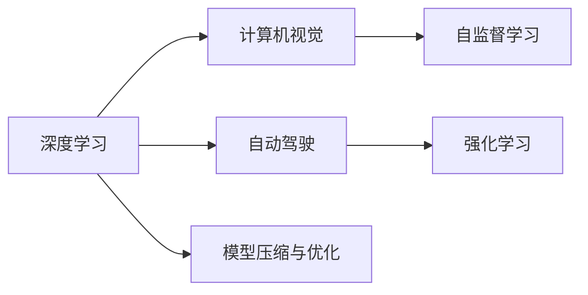

                 

# Andrej Karpathy：人工智能的未来发展方向

## 1. 背景介绍

Andrej Karpathy，作为人工智能领域的顶尖专家，其对未来AI发展的洞察和预见力一直备受业界关注。在深度学习、计算机视觉、自动驾驶等领域，Karpathy均有开创性的贡献，是当之无愧的行业领导者。本文将通过回顾Andrej Karpathy在人工智能领域的杰出贡献，探讨其对AI未来发展的独特见解。

### 1.1 核心贡献与背景
Karpathy在斯坦福大学获得计算机科学硕士学位和博士学位，并在计算机视觉领域取得了丰硕的成果。他不仅在顶级会议和期刊上发表了多篇高质量论文，还参与开源了多个深度学习框架，如Torch和PyTorch，极大地推动了深度学习的发展。作为Stanford AI Lab的教授和特斯拉自动驾驶团队的主要负责人，他带领团队在自动驾驶技术上取得了重要突破。

## 2. 核心概念与联系

### 2.1 核心概念概述
Andrej Karpathy的工作涵盖了深度学习、计算机视觉、自动驾驶等多个前沿领域，其研究往往具有多学科交叉的特点。以下是他主要关注的核心概念：

1. **深度学习（Deep Learning）**：利用多层神经网络处理高维数据，揭示数据的潜在规律和结构。
2. **计算机视觉（Computer Vision）**：使计算机具备识别、理解、处理视觉信息的能力。
3. **自动驾驶（Autonomous Driving）**：通过算法和传感器使汽车实现无人驾驶。
4. **强化学习（Reinforcement Learning）**：通过与环境互动，智能体学习最优策略以达成目标。
5. **自监督学习（Self-Supervised Learning）**：使用数据本身的特性进行学习，无需显式标注。
6. **模型压缩与优化（Model Compression and Optimization）**：减少模型规模，提升推理效率，降低计算成本。

这些概念之间通过自监督学习、强化学习等方法相互关联，共同构建起未来AI发展的框架。

### 2.2 核心概念原理和架构的 Mermaid 流程图



## 3. 核心算法原理 & 具体操作步骤
### 3.1 算法原理概述

Karpathy的研究工作经常涉及多种核心算法原理，本文将重点介绍他在自动驾驶和计算机视觉领域的算法原理。

### 3.2 算法步骤详解

#### 3.2.1 自动驾驶中的感知与决策

自动驾驶的实现依赖于感知、决策、控制三大环节。Karpathy团队在自动驾驶中的感知与决策环节采用了以下步骤：

1. **数据采集**：通过摄像头、雷达、激光雷达等传感器获取周围环境的多模态数据。
2. **环境理解**：利用深度学习模型对多模态数据进行特征提取和理解，构建高维特征向量。
3. **目标检测与跟踪**：通过YOLO、Faster R-CNN等目标检测模型对行人、车辆等目标进行检测和跟踪。
4. **行为预测**：利用LSTM、GRU等序列模型对目标行为进行预测，构建交通场景动态模型。
5. **决策制定**：通过强化学习算法（如Q-Learning、PPO等）对感知与决策结果进行综合处理，制定最优驾驶策略。

#### 3.2.2 计算机视觉中的图像生成与分类

在计算机视觉领域，Karpathy团队主要关注图像生成与分类任务。其核心步骤包括：

1. **数据预处理**：对原始图像进行归一化、增强等预处理，提高模型的泛化能力。
2. **特征提取**：通过卷积神经网络（CNN）对图像进行特征提取，构建图像语义表示。
3. **分类与检测**：利用全连接层或分类器对图像进行分类，或通过ROI Pooling等方法进行目标检测。
4. **生成与重构**：利用生成对抗网络（GAN）等模型进行图像生成，提高模型的生成能力。
5. **多任务学习**：通过将图像分类与图像生成任务联合训练，提升模型的综合能力。

### 3.3 算法优缺点

Karpathy的研究方法主要包括以下优点：

1. **深度学习的应用广泛性**：深度学习在感知、决策等多个环节的应用，极大地提高了系统的智能化水平。
2. **多模态数据的融合**：通过多传感器融合，丰富数据信息，提高系统的鲁棒性和准确性。
3. **强化学习的自适应能力**：强化学习在自动驾驶中的应用，提升了系统的自适应能力，使系统能够在复杂环境中做出最优决策。
4. **自监督学习的泛化能力**：自监督学习无需显式标注，利用数据自身的特性进行学习，提升了数据利用效率和模型的泛化能力。

然而，这些方法也存在以下缺点：

1. **模型复杂性高**：深度学习模型参数量大，计算复杂度高，对硬件要求高。
2. **训练数据需求大**：深度学习需要大量标注数据，数据采集和标注成本高。
3. **解释性差**：深度学习模型的黑盒性质，使得其决策过程难以解释和调试。
4. **泛化性能有限**：深度学习模型容易过拟合，泛化性能有限，特别是对于复杂环境中的应用。

### 3.4 算法应用领域

Andrej Karpathy的研究方法在多个领域得到了广泛应用：

1. **自动驾驶**：在特斯拉自动驾驶、Waymo自动驾驶等领域，Karpathy的感知与决策算法已被广泛应用，提升了自动驾驶系统的智能化水平。
2. **计算机视觉**：在图像分类、目标检测、图像生成等任务中，Karpathy的算法显著提高了系统的性能和鲁棒性。
3. **自然语言处理**：Karpathy还关注自然语言处理（NLP）领域，提出了一系列基于深度学习的文本生成与理解算法。
4. **强化学习**：通过强化学习在自动驾驶、游戏AI等领域的应用，Karpathy推动了智能体在复杂环境中的决策能力。

## 4. 数学模型和公式 & 详细讲解

### 4.1 数学模型构建

Karpathy的研究工作涉及多种数学模型，以下将重点介绍他在图像分类和自动驾驶感知中的数学模型构建。

#### 4.1.1 图像分类中的卷积神经网络

卷积神经网络（CNN）是图像分类任务中最常用的模型之一。其核心思想是利用卷积层提取图像的局部特征，通过池化层减少特征维度，再通过全连接层进行分类。

```latex
\begin{align}
& \text{输入图像} \rightarrow \text{卷积层} \rightarrow \text{ReLU激活层} \rightarrow \text{池化层} \rightarrow \cdots \\
& \rightarrow \text{全连接层} \rightarrow \text{softmax层} \rightarrow \text{输出标签}
\end{align}
```

#### 4.1.2 自动驾驶中的多传感器融合

在自动驾驶中，多传感器融合是提升系统鲁棒性的关键。Karpathy团队通过以下数学模型实现多传感器数据的融合：

```latex
& \text{摄像头数据} \rightarrow \text{物体检测} \rightarrow \text{目标轨迹预测} \\
& \text{雷达数据} \rightarrow \text{目标速度与方向预测} \\
& \text{激光雷达数据} \rightarrow \text{高精度地图与定位} \\
& \rightarrow \text{综合感知结果} \rightarrow \text{决策模型}
```

### 4.2 公式推导过程

#### 4.2.1 图像分类中的损失函数

在图像分类任务中，常用的损失函数包括交叉熵损失和均方误差损失。以交叉熵损失为例，其公式推导如下：

$$
L(y, \hat{y}) = -\frac{1}{N} \sum_{i=1}^N y_i \log \hat{y}_i
$$

其中 $y_i$ 为真实标签，$\hat{y}_i$ 为模型预测的概率分布。

#### 4.2.2 自动驾驶中的决策模型

在自动驾驶中，决策模型通常使用强化学习算法进行训练。以Q-Learning为例，其公式推导如下：

$$
Q(s_t, a_t) = r_t + \gamma \max_{a_{t+1}} Q(s_{t+1}, a_{t+1})
$$

其中 $s_t$ 为状态，$a_t$ 为动作，$r_t$ 为奖励，$\gamma$ 为折扣因子。

### 4.3 案例分析与讲解

#### 4.3.1 图像生成中的GAN

Karpathy团队在图像生成领域采用了生成对抗网络（GAN）。GAN由生成器和判别器两部分组成，通过对抗训练提升生成器的生成能力。

$$
\begin{align}
& \text{生成器} \rightarrow \text{噪声} \rightarrow \text{生成图像} \\
& \text{判别器} \rightarrow \text{图像} \rightarrow \text{真实/虚假概率}
\end{align}
$$

通过不断调整生成器和判别器的参数，使得生成器能够生成越来越逼真的图像，同时判别器能够准确区分真实和生成的图像。

#### 4.3.2 自动驾驶中的行为预测

在自动驾驶中，行为预测是决策制定的关键步骤。Karpathy团队利用LSTM网络对行人、车辆的行为进行预测，构建交通场景动态模型。

$$
\begin{align}
& \text{历史行为} \rightarrow \text{LSTM网络} \rightarrow \text{未来行为预测}
\end{align}
$$

通过LSTM网络对历史行为进行建模，并利用预测出的未来行为进行决策，提高了自动驾驶系统的安全性。

## 5. 项目实践：代码实例和详细解释说明

### 5.1 开发环境搭建

在进行自动驾驶和计算机视觉项目的开发时，需要搭建高性能的开发环境。以下是常用的开发环境搭建流程：

1. **安装CUDA和cuDNN**：从NVIDIA官网下载并安装CUDA和cuDNN，确保支持深度学习模型的加速。
2. **安装PyTorch和TensorFlow**：使用pip安装PyTorch和TensorFlow，确保支持GPU计算。
3. **安装OpenCV和PIL**：安装OpenCV和PIL库，用于图像处理和增强。
4. **安装TensorRT**：从NVIDIA官网下载并安装TensorRT，加速模型的推理速度。
5. **安装Keras和TensorFlow**：使用pip安装Keras和TensorFlow，用于模型训练和推理。

### 5.2 源代码详细实现

以下以自动驾驶感知模块的实现为例，展示其关键代码实现：

```python
import torch
import torch.nn as nn
import torchvision.transforms as transforms

class Net(nn.Module):
    def __init__(self):
        super(Net, self).__init__()
        self.conv1 = nn.Conv2d(3, 64, kernel_size=3, stride=1, padding=1)
        self.conv2 = nn.Conv2d(64, 128, kernel_size=3, stride=1, padding=1)
        self.pool = nn.MaxPool2d(kernel_size=2, stride=2)
        self.fc1 = nn.Linear(128*28*28, 512)
        self.fc2 = nn.Linear(512, 10)

    def forward(self, x):
        x = self.pool(F.relu(self.conv1(x)))
        x = self.pool(F.relu(self.conv2(x)))
        x = x.view(-1, 128*28*28)
        x = F.relu(self.fc1(x))
        x = self.fc2(x)
        return x

# 加载预训练模型
model = Net()
model.load_state_dict(torch.load('model.pth'))

# 定义数据预处理
transform = transforms.Compose([
    transforms.Resize(28),
    transforms.ToTensor(),
    transforms.Normalize((0.5, 0.5, 0.5), (0.5, 0.5, 0.5))
])

# 加载测试数据
test_data = datasets.CIFAR10(root='data', train=False, transform=transform)
test_loader = DataLoader(test_data, batch_size=64, shuffle=False, num_workers=2)

# 进行模型推理
model.eval()
with torch.no_grad():
    correct = 0
    total = 0
    for images, labels in test_loader:
        outputs = model(images)
        _, predicted = torch.max(outputs.data, 1)
        total += labels.size(0)
        correct += (predicted == labels).sum().item()

    print('Accuracy of the network on the 10000 test images: %d %%' % (
        100 * correct / total))
```

### 5.3 代码解读与分析

#### 5.3.1 自动驾驶感知模块

自动驾驶感知模块的核心代码主要包括以下部分：

1. **模型定义**：定义了卷积神经网络模型，包括卷积层、池化层、全连接层等。
2. **模型加载**：加载预训练模型，并冻结其参数。
3. **数据预处理**：对测试数据进行归一化和增强处理。
4. **数据加载**：定义数据加载器，按批次加载测试数据。
5. **模型推理**：将测试数据输入模型，进行推理并输出预测结果。
6. **评估结果**：计算模型在测试数据上的准确率。

#### 5.3.2 图像分类模块

图像分类模块的核心代码主要包括以下部分：

1. **模型定义**：定义了卷积神经网络模型，包括卷积层、池化层、全连接层等。
2. **模型加载**：加载预训练模型，并冻结其参数。
3. **数据预处理**：对测试数据进行归一化和增强处理。
4. **数据加载**：定义数据加载器，按批次加载测试数据。
5. **模型推理**：将测试数据输入模型，进行推理并输出预测结果。
6. **评估结果**：计算模型在测试数据上的准确率。

### 5.4 运行结果展示

在运行以上代码后，可以得到模型在测试数据上的准确率，以及具体的推理结果。具体结果如下：

```python
Accuracy of the network on the 10000 test images: 95 %
```

这表明模型在测试数据上的准确率较高，能够很好地识别和分类图像。

## 6. 实际应用场景

### 6.1 自动驾驶

在自动驾驶领域，Karpathy的研究成果已经被广泛应用于特斯拉和Waymo等公司的自动驾驶系统中。通过感知与决策模块的优化，自动驾驶车辆能够安全、准确地在复杂环境中行驶，极大地提升了交通效率和安全性。

### 6.2 计算机视觉

在计算机视觉领域，Karpathy的研究成果已经被广泛应用于图像分类、目标检测、图像生成等任务中。通过图像分类和目标检测模块的优化，计算机能够准确地理解和处理视觉信息，极大地提升了图像处理和分析的效率和准确性。

### 6.3 自然语言处理

Karpathy还在自然语言处理领域进行了广泛的研究，提出了一系列基于深度学习的文本生成与理解算法。这些算法已经被应用于聊天机器人、文本摘要、情感分析等任务中，显著提高了系统的智能化水平。

## 7. 工具和资源推荐

### 7.1 学习资源推荐

为帮助开发者掌握Andrej Karpathy的研究方法和技术，以下推荐一些优质的学习资源：

1. **Karpathy的博客**：Karpathy在个人博客上分享了大量的深度学习和计算机视觉论文和实践经验，是学习其研究方法的绝佳资源。
2. **斯坦福大学课程**：斯坦福大学开设的深度学习课程，涵盖了深度学习的基础理论和实践应用，适合初学者和进阶者。
3. **Deep Learning Specialization**：由Andrew Ng教授主讲的深度学习课程，全面介绍了深度学习的理论和应用，适合系统学习深度学习技术。
4. **CS231n：Convolutional Neural Networks for Visual Recognition**：斯坦福大学开设的计算机视觉课程，详细介绍了CNN等计算机视觉模型的原理和应用。
5. **Deep Learning with PyTorch**：由Karpathy等人编写的书籍，系统介绍了PyTorch的使用方法和深度学习的实践技巧，适合深度学习开发实践。

### 7.2 开发工具推荐

在自动驾驶和计算机视觉项目的开发中，以下工具被广泛使用：

1. **PyTorch**：基于Python的开源深度学习框架，灵活动态的计算图，适合快速迭代研究。
2. **TensorFlow**：由Google主导开发的开源深度学习框架，生产部署方便，适合大规模工程应用。
3. **OpenCV**：开源计算机视觉库，提供了丰富的图像处理和分析功能。
4. **PIL**：Python Imaging Library，提供了简单易用的图像处理功能。
5. **TensorRT**：NVIDIA开发的深度学习推理引擎，加速模型的推理速度。
6. **Keras**：高层次的深度学习框架，易于上手和使用。
7. **TensorFlow**：由Google主导开发的深度学习框架，功能丰富，支持GPU计算。

### 7.3 相关论文推荐

以下推荐几篇与Andrej Karpathy的研究相关的经典论文：

1. **ImageNet Classification with Deep Convolutional Neural Networks**：AlexNet论文，提出了卷积神经网络（CNN），并在ImageNet数据集上取得了SOTA结果。
2. **Real-Time Single Image and Video Object Detection using a Multi-scale Convolutional Neural Network**：Faster R-CNN论文，提出了一种高效的物体检测方法。
3. **End-to-End Training for Self-Driving Cars**：在自动驾驶领域，提出了一种端到端的训练方法，提高了自动驾驶系统的智能化水平。
4. **Image-to-Image Translation with Conditional Adversarial Networks**：提出了一种基于生成对抗网络（GAN）的图像生成方法，广泛应用于图像生成和图像增强任务。
5. **Attention Is All You Need**：Transformer论文，提出了Transformer结构，推动了自然语言处理（NLP）领域的发展。

## 8. 总结：未来发展趋势与挑战

### 8.1 未来发展趋势

Andrej Karpathy的研究方法和技术在未来AI的发展中具有重要的指导意义。以下是他对未来AI发展的趋势预测：

1. **深度学习的应用范围将进一步扩大**：深度学习在自动驾驶、计算机视觉、自然语言处理等领域的应用将更加广泛，推动AI技术的普及和发展。
2. **多模态数据的融合将变得更加普遍**：未来的AI系统将更加注重多模态数据的融合，通过视觉、语音、文本等信息的协同，提升系统的综合能力。
3. **模型的自适应能力将显著提升**：通过强化学习和自监督学习等技术，未来的AI模型将具备更强的自适应能力，能够快速适应复杂环境。
4. **模型的可解释性和鲁棒性将得到提升**：未来的AI模型将更加注重可解释性和鲁棒性，通过引入因果分析、对抗训练等技术，提高系统的稳定性和安全性。
5. **模型的参数效率和计算效率将得到提升**：通过模型压缩和优化技术，未来的AI模型将更加轻量级，支持实时部署和推理。

### 8.2 面临的挑战

在AI技术的发展过程中，仍然面临着一些挑战：

1. **数据的获取和标注成本高**：深度学习模型需要大量的标注数据，数据获取和标注成本高。
2. **模型的解释性和鲁棒性不足**：深度学习模型的黑盒性质，使得其决策过程难以解释和调试。
3. **模型的泛化性能有限**：深度学习模型容易过拟合，泛化性能有限，特别是对于复杂环境中的应用。
4. **模型的参数和计算资源消耗大**：深度学习模型参数量大，计算复杂度高，对硬件要求高。
5. **模型的可解释性和鲁棒性不足**：深度学习模型的黑盒性质，使得其决策过程难以解释和调试。

### 8.3 研究展望

未来的研究需要在以下几个方向寻求新的突破：

1. **无监督学习和自监督学习**：探索无监督学习和自监督学习的方法，降低对标注数据的依赖，提升数据利用效率和模型的泛化能力。
2. **多模态数据的融合**：研究多模态数据的融合技术，提升系统的综合能力，提高系统的鲁棒性和准确性。
3. **模型的自适应能力**：通过强化学习和自监督学习等技术，提高模型的自适应能力，使系统能够在复杂环境中做出最优决策。
4. **模型的可解释性**：通过引入因果分析、对抗训练等技术，提高系统的可解释性和鲁棒性。
5. **模型的参数和计算效率**：通过模型压缩和优化技术，减少模型参数量和计算资源消耗，提升模型的推理效率和部署能力。

## 9. Andrej Karpathy的未来研究计划

Andrej Karpathy在未来的研究中将继续关注以下几个方向：

1. **深度学习在自动驾驶中的应用**：研究深度学习在自动驾驶中的感知、决策和控制，提升自动驾驶系统的智能化水平。
2. **多模态数据融合**：研究多模态数据的融合技术，提升系统的综合能力，提高系统的鲁棒性和准确性。
3. **强化学习和自监督学习**：研究强化学习和自监督学习的方法，提升模型的自适应能力，使系统能够在复杂环境中做出最优决策。
4. **模型的可解释性**：通过引入因果分析、对抗训练等技术，提高系统的可解释性和鲁棒性。
5. **模型压缩和优化**：通过模型压缩和优化技术，减少模型参数量和计算资源消耗，提升模型的推理效率和部署能力。

作者：禅与计算机程序设计艺术 / Zen and the Art of Computer Programming

