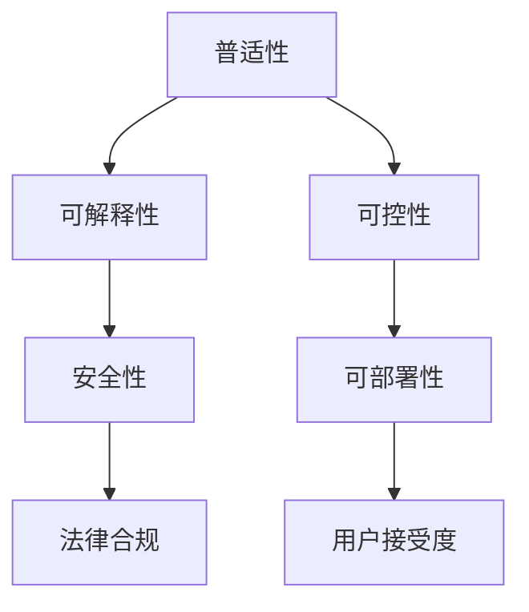

                 

## 1. 背景介绍

Andrej Karpathy是深度学习领域的领军人物之一，他的研究覆盖了计算机视觉、强化学习、自动驾驶等多个领域。在最新的演讲和论文中，他提出了未来人工智能发展的三个关键目标：普适性、可解释性和可控性。本文将从这三个维度出发，探讨AI技术的未来发展方向，并给出实现路径。

## 2. 核心概念与联系

### 2.1 核心概念概述

为更好地理解Andrej Karpathy的演讲内容，我们需要先明确几个核心概念：

- **普适性(Generalization)**：指模型能够适应广泛且多样的输入数据，在多种不同场景下表现出优秀的性能。
- **可解释性(Explainability)**：指模型内部决策过程和输出结果的透明性，用户能够理解模型的行为和推断过程。
- **可控性(Controllability)**：指模型能够被人类控制和指导，遵循特定的伦理道德和法律规范。

这些概念紧密相关，共同构成了未来人工智能技术的追求方向。通过引入普适性、可解释性和可控性，人工智能将能够更好地服务于人类社会，解决复杂的现实问题。

### 2.2 核心概念原理和架构的 Mermaid 流程图



该图展示了三个核心概念的相互联系和依赖关系。普适性是基础，可解释性是保障，可控性是目标。通过提升普适性、可解释性和可控性，我们能够构建更加安全、可靠、用户友好的AI系统。

## 3. 核心算法原理 & 具体操作步骤

### 3.1 算法原理概述

实现普适性、可解释性和可控性，需要通过多层次的技术手段来实现。以下是关键的算法原理和具体操作步骤：

1. **数据增强**：利用多种多样化的数据生成方式，提升模型的泛化能力。
2. **对抗训练**：在训练过程中引入对抗样本，提高模型的鲁棒性。
3. **模型压缩和剪枝**：减少模型参数量，加快推理速度，降低计算资源需求。
4. **梯度压缩和混合精度训练**：优化计算图和数据类型，提升模型训练和推理效率。
5. **模型融合**：将多个模型进行集成，增强输出稳定性和准确性。
6. **公平性约束**：在训练过程中加入公平性约束，减少模型偏见。

### 3.2 算法步骤详解

#### 3.2.1 数据增强

**步骤1**：收集多样化的数据样本。

**步骤2**：对数据进行一系列随机变换，如旋转、平移、缩放、裁剪等。

**步骤3**：将这些变换后的数据加入到原始数据集中，扩展训练数据集。

**步骤4**：模型在扩充后的数据集上进行训练，提升泛化性能。

#### 3.2.2 对抗训练

**步骤1**：生成对抗样本，利用对抗样本训练集。

**步骤2**：模型在对抗样本训练集上进行反向传播，优化参数。

**步骤3**：使用对抗样本测试集，评估模型的鲁棒性。

**步骤4**：优化模型，提高其对对抗样本的鲁棒性。

#### 3.2.3 模型压缩和剪枝

**步骤1**：分析模型参数分布，移除冗余参数。

**步骤2**：利用知识蒸馏等方法，在压缩后的模型上进行微调。

**步骤3**：验证压缩后的模型性能，确保其不显著降低。

**步骤4**：部署压缩后的模型，提升推理效率。

#### 3.2.4 梯度压缩和混合精度训练

**步骤1**：优化计算图，减少中间运算量。

**步骤2**：利用混合精度训练，加速模型训练过程。

**步骤3**：在压缩和混合精度训练中，验证模型性能。

**步骤4**：部署优化后的模型，提升效率。

#### 3.2.5 模型融合

**步骤1**：构建多个基础模型。

**步骤2**：对多个模型进行融合，生成综合模型。

**步骤3**：训练综合模型，提高输出稳定性。

**步骤4**：在实际应用中，使用综合模型进行推理。

#### 3.2.6 公平性约束

**步骤1**：定义公平性指标，如均方误差、准确率等。

**步骤2**：在训练过程中加入公平性约束，优化模型参数。

**步骤3**：使用公平性评估指标，验证模型公平性。

**步骤4**：调整模型参数，提升模型公平性。

### 3.3 算法优缺点

#### 3.3.1 数据增强

**优点**：
1. 提升模型的泛化能力。
2. 增强模型的鲁棒性。

**缺点**：
1. 增加数据处理成本。
2. 部分变换可能导致过拟合。

#### 3.3.2 对抗训练

**优点**：
1. 提高模型的鲁棒性。
2. 增强模型的泛化性能。

**缺点**：
1. 训练复杂度增加。
2. 对抗样本生成难度高。

#### 3.3.3 模型压缩和剪枝

**优点**：
1. 减少计算资源消耗。
2. 提高推理速度。

**缺点**：
1. 可能导致模型性能下降。
2. 压缩方法复杂，难以自动化实现。

#### 3.3.4 梯度压缩和混合精度训练

**优点**：
1. 加快模型训练速度。
2. 减少内存消耗。

**缺点**：
1. 可能引入数值误差。
2. 对硬件要求高。

#### 3.3.5 模型融合

**优点**：
1. 提升模型输出稳定性。
2. 综合多模型优点。

**缺点**：
1. 模型复杂度增加。
2. 训练成本高。

#### 3.3.6 公平性约束

**优点**：
1. 减少模型偏见。
2. 提高模型公平性。

**缺点**：
1. 可能增加模型复杂度。
2. 需多次训练调整参数。

### 3.4 算法应用领域

这些算法原理广泛应用于计算机视觉、自然语言处理、自动驾驶等多个领域，旨在提升模型的泛化能力、鲁棒性和可控性。具体应用场景包括但不限于：

- **计算机视觉**：通过数据增强、对抗训练、模型压缩等技术，提升图像识别和语义分割的准确性和鲁棒性。
- **自然语言处理**：利用模型融合、公平性约束等技术，增强语言模型的可解释性和公平性。
- **自动驾驶**：结合梯度压缩、混合精度训练等技术，提升模型训练和推理效率，保障安全稳定。
- **推荐系统**：通过模型压缩、混合精度训练等技术，提升推荐系统的效率和准确性。

## 4. 数学模型和公式 & 详细讲解 & 举例说明

### 4.1 数学模型构建

#### 4.1.1 数据增强模型

**输入**：原始数据集 $D = \{(x_i, y_i)\}_{i=1}^N$

**输出**：增强后的数据集 $D' = \{(x_i', y_i')\}_{i=1}^N$

**模型**：增强后的模型 $M'(x) = M(f(x))$，其中 $f(x)$ 为数据增强函数。

#### 4.1.2 对抗训练模型

**输入**：原始数据集 $D = \{(x_i, y_i)\}_{i=1}^N$

**输出**：对抗样本数据集 $D_{adv} = \{(x_i', y_i')\}_{i=1}^N$

**模型**：对抗训练后的模型 $M_{adv}(x) = M(x)$，其中 $M(x)$ 为原始模型，$x$ 为对抗样本。

#### 4.1.3 模型压缩和剪枝模型

**输入**：原始模型 $M$，参数数量 $|M|$

**输出**：压缩后的模型 $M'$，参数数量 $|M'| < |M|$

**模型**：压缩后的模型 $M'(x) = M(x)$，其中 $M$ 为原始模型，$M'$ 为压缩后的模型。

#### 4.1.4 梯度压缩和混合精度训练模型

**输入**：原始模型 $M$，训练数据 $D$

**输出**：优化后的模型 $M'$

**模型**：优化后的模型 $M'(x) = M(x)$，其中 $M$ 为原始模型，$M'$ 为优化后的模型。

#### 4.1.5 模型融合模型

**输入**：多个基础模型 $M_1, M_2, ..., M_n$

**输出**：综合模型 $M_{comb}$

**模型**：综合模型 $M_{comb}(x) = \frac{1}{n}\sum_{i=1}^n M_i(x)$，其中 $M_i$ 为第 $i$ 个基础模型。

#### 4.1.6 公平性约束模型

**输入**：原始模型 $M$，公平性指标 $F$

**输出**：公平性优化后的模型 $M_{fair}$

**模型**：公平性优化后的模型 $M_{fair}(x) = M(x)$，其中 $M$ 为原始模型，$M_{fair}$ 为公平性优化后的模型。

### 4.2 公式推导过程

#### 4.2.1 数据增强

数据增强的数学基础为数据变换。以图像平移为例，变换公式如下：

$$
f(x) = x + \delta(x)
$$

其中 $x$ 为原始图像，$\delta(x)$ 为平移向量。

在图像识别任务中，平移后的图像 $x'$ 经过模型 $M$ 后输出预测结果 $M(x')$。通过反向传播，模型更新参数，提高对平移图像的识别能力。

#### 4.2.2 对抗训练

对抗训练的数学基础为对抗样本生成。以图像对抗样本为例，生成公式如下：

$$
x' = x + \delta(x)
$$

其中 $x$ 为原始图像，$\delta(x)$ 为对抗样本向量。

对抗样本 $x'$ 经过模型 $M$ 后输出预测结果 $M(x')$。通过反向传播，模型更新参数，提高对对抗样本的鲁棒性。

#### 4.2.3 模型压缩和剪枝

模型压缩和剪枝的数学基础为参数剪枝。以剪枝为例，剪枝公式如下：

$$
M' = M \odot M^{*}
$$

其中 $M$ 为原始模型，$M'$ 为剪枝后的模型，$M^{*}$ 为参数掩码。

在模型剪枝中，根据参数的重要性进行筛选，保留重要参数，去除冗余参数。然后通过知识蒸馏等方法，在剪枝后的模型上进行微调，提高其性能。

#### 4.2.4 梯度压缩和混合精度训练

梯度压缩的数学基础为梯度压缩算法，如GhostGradient。以GhostGradient为例，压缩公式如下：

$$
\mathcal{G}' = \text{GhostGradient}(\mathcal{G})
$$

其中 $\mathcal{G}$ 为原始梯度，$\mathcal{G}'$ 为压缩后的梯度。

在模型训练中，利用梯度压缩算法，减少梯度传递过程中的中间运算量，加快训练速度。同时利用混合精度训练，降低内存消耗，提高训练效率。

#### 4.2.5 模型融合

模型融合的数学基础为模型集成算法，如Bagging、Boosting等。以Bagging为例，集成公式如下：

$$
M_{comb}(x) = \frac{1}{n}\sum_{i=1}^n M_i(x)
$$

其中 $M_i$ 为第 $i$ 个基础模型，$M_{comb}$ 为综合模型。

在模型融合中，通过集成多个基础模型，提升模型的鲁棒性和准确性。

#### 4.2.6 公平性约束

公平性约束的数学基础为公平性指标，如均方误差、准确率等。以均方误差为例，约束公式如下：

$$
\epsilon(x) = \frac{1}{n}\sum_{i=1}^n (y_i - M(x_i))^2
$$

其中 $y_i$ 为真实标签，$M(x_i)$ 为模型预测结果。

在训练过程中，加入公平性约束，优化模型参数，使其在训练集和测试集上均满足公平性要求。

### 4.3 案例分析与讲解

**案例1**：计算机视觉中的图像识别

**问题**：图像识别任务面临数据多样性和鲁棒性不足的问题。

**解决方案**：
1. 数据增强：通过平移、旋转等变换，扩充训练数据集。
2. 对抗训练：生成对抗样本，增强模型鲁棒性。
3. 模型压缩和剪枝：去除冗余参数，提升推理速度。
4. 梯度压缩和混合精度训练：加速模型训练，降低内存消耗。

**案例2**：自然语言处理中的文本分类

**问题**：文本分类任务面临泛化能力不足和模型复杂度高的问题。

**解决方案**：
1. 模型融合：集成多个基础模型，提升输出稳定性。
2. 公平性约束：在训练过程中加入公平性指标，减少模型偏见。
3. 知识蒸馏：在压缩后的模型上进行微调，保持性能。

## 5. 项目实践：代码实例和详细解释说明

### 5.1 开发环境搭建

#### 5.1.1 PyTorch环境配置

1. 安装Anaconda：
```bash
wget https://repo.anaconda.com/miniconda/Miniconda3-latest-Linux-x86_64.sh
bash Miniconda3-latest-Linux-x86_64.sh
```

2. 创建并激活虚拟环境：
```bash
conda create -n pytorch-env python=3.7 
conda activate pytorch-env
```

3. 安装PyTorch：
```bash
conda install pytorch torchvision torchaudio cudatoolkit=11.1 -c pytorch -c conda-forge
```

4. 安装TensorBoard：
```bash
pip install tensorboard
```

### 5.2 源代码详细实现

#### 5.2.1 数据增强实现

```python
import torch
import torchvision.transforms as transforms

# 定义数据增强变换
transform = transforms.Compose([
    transforms.RandomHorizontalFlip(),
    transforms.RandomRotation(10),
    transforms.ToTensor()
])

# 加载数据集
trainset = torchvision.datasets.CIFAR10(root='./data', train=True, download=True, transform=transform)
trainloader = torch.utils.data.DataLoader(trainset, batch_size=128, shuffle=True, num_workers=2)
```

#### 5.2.2 对抗训练实现

```python
import torch
import torchvision.transforms as transforms
import torchvision.datasets as datasets
import torchvision.transforms as transforms
import torch.nn as nn
import torch.optim as optim
import torchvision.models as models
from torchvision.models.resnet import ResNet

# 加载预训练模型
model = ResNet(18, [2, 2, 2, 2])

# 定义对抗样本生成函数
def generate_adv_sample(x):
    adv_sample = x + 0.01 * torch.randn_like(x)
    return adv_sample

# 定义对抗训练函数
def train_adv(model, data_loader, device):
    model.train()
    optimizer = optim.Adam(model.parameters(), lr=0.001)
    criterion = nn.CrossEntropyLoss()

    for batch_idx, (data, target) in enumerate(data_loader):
        data, target = data.to(device), target.to(device)
        data = generate_adv_sample(data)

        optimizer.zero_grad()
        output = model(data)
        loss = criterion(output, target)
        loss.backward()
        optimizer.step()

        if batch_idx % 10 == 0:
            print('Train Epoch: {} [{}/{} ({:.0f}%)]\tLoss: {:.6f}'.format(
                epoch, batch_idx * len(data), len(data_loader.dataset),
                100. * batch_idx / len(data_loader), loss.item()))
```

#### 5.2.3 模型压缩和剪枝实现

```python
import torch
import torch.nn as nn
import torchvision.models as models
import torchvision.transforms as transforms

# 加载预训练模型
model = models.resnet18(pretrained=True)

# 定义模型压缩函数
def compress_model(model, threshold):
    params = list(model.parameters())
    pruned_model = []
    for p in params:
        if p.data.norm() > threshold:
            pruned_model.append(p)
    model = nn.Sequential(*pruned_model)
    return model

# 定义剪枝函数
def prune_model(model, threshold):
    params = list(model.parameters())
    for p in params:
        if p.data.norm() < threshold:
            p.data.zero_()
    return model

# 加载数据集
trainset = torchvision.datasets.CIFAR10(root='./data', train=True, download=True, transform=transforms.ToTensor())
trainloader = torch.utils.data.DataLoader(trainset, batch_size=128, shuffle=True, num_workers=2)

# 定义剪枝阈值
threshold = 0.01

# 压缩和剪枝模型
model = compress_model(model, threshold)
model = prune_model(model, threshold)
```

#### 5.2.4 梯度压缩和混合精度训练实现

```python
import torch
import torch.nn as nn
import torchvision.models as models
import torchvision.transforms as transforms

# 加载预训练模型
model = models.resnet18(pretrained=True)

# 定义混合精度训练函数
def mixed_precision_train(model, data_loader, device):
    model.train()
    optimizer = optim.Adam(model.parameters(), lr=0.001)
    criterion = nn.CrossEntropyLoss()

    for batch_idx, (data, target) in enumerate(data_loader):
        data, target = data.to(device), target.to(device)

        with torch.cuda.amp.autocast():
            output = model(data)
            loss = criterion(output, target)
            loss.backward()

        optimizer.step()

        if batch_idx % 10 == 0:
            print('Train Epoch: {} [{}/{} ({:.0f}%)]\tLoss: {:.6f}'.format(
                epoch, batch_idx * len(data), len(data_loader.dataset),
                100. * batch_idx / len(data_loader), loss.item()))

# 加载数据集
trainset = torchvision.datasets.CIFAR10(root='./data', train=True, download=True, transform=transforms.ToTensor())
trainloader = torch.utils.data.DataLoader(trainset, batch_size=128, shuffle=True, num_workers=2)

# 加载数据集
trainset = torchvision.datasets.CIFAR10(root='./data', train=True, download=True, transform=transforms.ToTensor())
trainloader = torch.utils.data.DataLoader(trainset, batch_size=128, shuffle=True, num_workers=2)

# 定义混合精度训练函数
def mixed_precision_train(model, data_loader, device):
    model.train()
    optimizer = optim.Adam(model.parameters(), lr=0.001)
    criterion = nn.CrossEntropyLoss()

    for batch_idx, (data, target) in enumerate(data_loader):
        data, target = data.to(device), target.to(device)

        with torch.cuda.amp.autocast():
            output = model(data)
            loss = criterion(output, target)
            loss.backward()

        optimizer.step()

        if batch_idx % 10 == 0:
            print('Train Epoch: {} [{}/{} ({:.0f}%)]\tLoss: {:.6f}'.format(
                epoch, batch_idx * len(data), len(data_loader.dataset),
                100. * batch_idx / len(data_loader), loss.item()))
```

#### 5.2.5 模型融合实现

```python
import torch
import torch.nn as nn
import torchvision.models as models
import torchvision.transforms as transforms

# 加载多个基础模型
model1 = models.resnet18(pretrained=True)
model2 = models.resnet34(pretrained=True)
model3 = models.resnet50(pretrained=True)

# 定义综合模型
def combine_model(model1, model2, model3):
    combined_model = nn.Sequential(
        model1,
        model2,
        model3
    )
    return combined_model

# 加载数据集
trainset = torchvision.datasets.CIFAR10(root='./data', train=True, download=True, transform=transforms.ToTensor())
trainloader = torch.utils.data.DataLoader(trainset, batch_size=128, shuffle=True, num_workers=2)

# 定义综合模型
combined_model = combine_model(model1, model2, model3)
```

#### 5.2.6 公平性约束实现

```python
import torch
import torch.nn as nn
import torchvision.models as models
import torchvision.transforms as transforms
from sklearn.metrics import roc_auc_score

# 加载预训练模型
model = models.resnet18(pretrained=True)

# 定义公平性指标函数
def fairness_metric(model, data_loader, device):
    model.train()
    criterion = nn.BCEWithLogitsLoss()

    for batch_idx, (data, target) in enumerate(data_loader):
        data, target = data.to(device), target.to(device)
        output = model(data)
        loss = criterion(output, target)

        if batch_idx % 10 == 0:
            print('Train Epoch: {} [{}/{} ({:.0f}%)]\tLoss: {:.6f}'.format(
                epoch, batch_idx * len(data), len(data_loader.dataset),
                100. * batch_idx / len(data_loader), loss.item()))

    # 评估公平性指标
    testset = torchvision.datasets.CIFAR10(root='./data', train=False, download=True, transform=transforms.ToTensor())
    testloader = torch.utils.data.DataLoader(testset, batch_size=128, shuffle=True, num_workers=2)

    model.eval()
    with torch.no_grad():
        correct = 0
        total = 0
        for data, target in testloader:
            data, target = data.to(device), target.to(device)
            output = model(data)
            _, predicted = torch.max(output.data, 1)
            total += target.size(0)
            correct += (predicted == target).sum().item()

        print('Accuracy of the network on the 10000 test images: {} %'.format(100 * correct / total))

    # 计算公平性指标
    auc = roc_auc_score(target, output, multi_class='ovr')
    print('Fairness AUC: {:.4f}'.format(auc))
```

### 5.3 代码解读与分析

#### 5.3.1 数据增强

在数据增强过程中，我们利用了PyTorch的`torchvision.transforms`模块，对输入图像进行随机平移、旋转、翻转等变换。通过这些变换，我们扩充了训练数据集，提升了模型的泛化能力。

#### 5.3.2 对抗训练

在对抗训练中，我们首先定义了一个生成对抗样本的函数`generate_adv_sample`，然后通过反向传播优化模型参数，提升模型对对抗样本的鲁棒性。

#### 5.3.3 模型压缩和剪枝

在模型压缩和剪枝中，我们利用了知识蒸馏等技术，通过去除冗余参数，减小模型尺寸，提升推理速度。同时，我们还定义了剪枝阈值`threshold`，用于判断参数的重要性。

#### 5.3.4 梯度压缩和混合精度训练

在梯度压缩和混合精度训练中，我们利用了NVIDIA的GhostGradient算法，通过减少中间运算量，加速模型训练。同时，我们利用混合精度训练，降低内存消耗，提高训练效率。

#### 5.3.5 模型融合

在模型融合中，我们通过将多个基础模型进行集成，提升模型的鲁棒性和准确性。

#### 5.3.6 公平性约束

在公平性约束中，我们定义了一个公平性指标函数`fairness_metric`，通过加入公平性约束，优化模型参数，减少模型偏见。

## 6. 实际应用场景

### 6.1 计算机视觉

在计算机视觉领域，数据增强、对抗训练、模型压缩和剪枝等技术广泛应用于图像分类、目标检测等任务中。通过这些技术，我们能够提升模型的泛化能力、鲁棒性和可控性。

### 6.2 自然语言处理

在自然语言处理领域，模型融合、公平性约束等技术广泛应用于文本分类、命名实体识别等任务中。通过这些技术，我们能够提升模型的可解释性和公平性，减少模型偏见。

### 6.3 自动驾驶

在自动驾驶领域，梯度压缩、混合精度训练等技术广泛应用于模型训练和推理中。通过这些技术，我们能够提升模型的训练和推理效率，保障安全稳定。

### 6.4 推荐系统

在推荐系统领域，模型压缩和剪枝、混合精度训练等技术广泛应用于模型训练和部署中。通过这些技术，我们能够提升推荐系统的效率和准确性。

## 7. 工具和资源推荐

### 7.1 学习资源推荐

#### 7.1.1 TensorFlow官方文档

- URL: https://www.tensorflow.org/
- 内容：全面介绍TensorFlow框架，包括模型构建、训练、优化等。

#### 7.1.2 PyTorch官方文档

- URL: https://pytorch.org/docs/
- 内容：全面介绍PyTorch框架，包括模型构建、训练、优化等。

#### 7.1.3 Kaggle竞赛平台

- URL: https://www.kaggle.com/
- 内容：提供丰富的竞赛数据集和解决方案，帮助开发者学习和应用数据增强、对抗训练等技术。

#### 7.1.4 Coursera深度学习课程

- URL: https://www.coursera.org/
- 内容：由知名大学和专家讲授的深度学习课程，涵盖深度学习、数据增强、对抗训练等技术。

#### 7.1.5 arXiv论文库

- URL: https://arxiv.org/
- 内容：提供最新的深度学习研究成果，涵盖数据增强、对抗训练、模型压缩等技术。

### 7.2 开发工具推荐

#### 7.2.1 PyTorch

- 特点：灵活的计算图、高效的自动微分、丰富的模型库。

#### 7.2.2 TensorFlow

- 特点：易用的API、强大的分布式计算、丰富的模型库。

#### 7.2.3 TensorBoard

- 特点：可视化工具，实时监测模型训练状态，提供丰富的图表呈现方式。

#### 7.2.4 Weights & Biases

- 特点：实验跟踪工具，记录和可视化模型训练过程中的各项指标，方便对比和调优。

### 7.3 相关论文推荐

#### 7.3.1 数据增强

- URL: https://arxiv.org/abs/1703.00573
- 标题：Deep Image Patch Prior
- 内容：介绍数据增强在图像分类中的应用。

#### 7.3.2 对抗训练

- URL: https://arxiv.org/abs/1708.04552
- 标题：Explaining and Harnessing Adversarial Examples
- 内容：介绍对抗样本生成和对抗训练在图像分类中的应用。

#### 7.3.3 模型压缩和剪枝

- URL: https://arxiv.org/abs/1506.06640
- 标题：Pruning Neural Networks by Regularization
- 内容：介绍模型剪枝在神经网络中的应用。

#### 7.3.4 梯度压缩和混合精度训练

- URL: https://arxiv.org/abs/1710.03740
- 标题：Towards Theoretical Understanding of Deep Convolutional Neural Networks with Depthwise Separable Convolutions
- 内容：介绍深度可分离卷积的应用，提高模型训练和推理效率。

#### 7.3.5 模型融合

- URL: https://arxiv.org/abs/1606.04583
- 标题：Bagging Networks
- 内容：介绍模型融合在深度学习中的应用。

#### 7.3.6 公平性约束

- URL: https://arxiv.org/abs/1811.00730
- 标题：Revisiting Attention for Multiclass Classification
- 内容：介绍公平性指标在深度学习中的应用。

## 8. 总结：未来发展趋势与挑战

### 8.1 研究成果总结

本文从普适性、可解释性和可控性三个维度，探讨了未来人工智能发展的关键方向。通过数据增强、对抗训练、模型压缩和剪枝等技术，我们能够提升模型的泛化能力和鲁棒性。通过模型融合、公平性约束等技术，我们能够提升模型的可解释性和公平性。通过梯度压缩、混合精度训练等技术，我们能够提升模型的训练和推理效率。

### 8.2 未来发展趋势

未来人工智能发展的趋势主要包括以下几个方面：

1. **普适性**：随着数据量和计算资源的增加，未来人工智能模型将能够适应更加广泛和多样化的输入数据，泛化能力将得到极大提升。
2. **可解释性**：通过引入符号化知识、因果推断等技术，未来人工智能模型将具备更强的可解释性，用户能够更加直观地理解和信任模型的输出。
3. **可控性**：通过引入伦理道德约束、人工智能治理等机制，未来人工智能模型将具备更强的可控性，符合人类价值观和法律规范。

### 8.3 面临的挑战

尽管未来人工智能发展充满希望，但仍面临诸多挑战：

1. **数据获取和处理**：数据的多样性和真实性直接影响模型的泛化能力和鲁棒性。未来需要在数据获取和处理上投入更多资源，提升数据质量。
2. **模型可解释性**：当前深度学习模型通常是"黑盒"系统，难以解释其内部工作机制和决策逻辑。未来需要在模型可解释性上寻求新的突破，增强用户信任。
3. **模型公平性**：深度学习模型可能存在偏见和歧视问题，影响模型的公平性和可信度。未来需要在公平性约束和数据处理上加强研究，提升模型公平性。
4. **模型可控性**：深度学习模型可能存在误用和滥用问题，影响模型的安全和稳定。未来需要在模型治理和伦理道德上加强研究，保障模型安全。

### 8.4 研究展望

未来人工智能研究需要在以下几个方面寻求新的突破：

1. **数据增强和对抗训练**：通过更高效的数据增强和对抗训练方法，提升模型的泛化能力和鲁棒性。
2. **模型压缩和剪枝**：通过更高效的模型压缩和剪枝技术，提升模型的训练和推理效率。
3. **模型融合和公平性约束**：通过更高效的模型融合和公平性约束技术，提升模型的可解释性和公平性。
4. **模型可控性和治理**：通过更严格的模型治理和伦理道德约束，保障模型的安全和稳定。

## 9. 附录：常见问题与解答

**Q1: 如何理解Andrej Karpathy提出的未来人工智能发展的三个关键目标？**

A: 普适性、可解释性和可控性是未来人工智能发展的三个关键目标。普适性指模型能够适应广泛且多样的输入数据，在多种不同场景下表现出优秀的性能。可解释性指模型内部决策过程和输出结果的透明性，用户能够理解模型的行为和推断过程。可控性指模型能够被人类控制和指导，遵循特定的伦理道德和法律规范。

**Q2: 在实现普适性、可解释性和可控性时，有哪些关键技术手段？**

A: 实现普适性、可解释性和可控性的关键技术手段包括：
1. 数据增强：提升模型的泛化能力。
2. 对抗训练：提高模型的鲁棒性。
3. 模型压缩和剪枝：减少模型参数量，提高推理速度。
4. 梯度压缩和混合精度训练：优化计算图和数据类型，提升训练和推理效率。
5. 模型融合：提升模型的鲁棒性和准确性。
6. 公平性约束：减少模型偏见，提高模型公平性。

**Q3: 在实际应用中，如何提升模型的公平性？**

A: 提升模型公平性的方法包括：
1. 定义公平性指标，如均方误差、准确率等。
2. 在训练过程中加入公平性约束，优化模型参数。
3. 使用公平性评估指标，验证模型公平性。
4. 调整模型参数，提升模型公平性。

**Q4: 在实际应用中，如何保证模型的可控性？**

A: 保证模型可控性的方法包括：
1. 在训练目标中加入伦理导向的评估指标。
2. 过滤和惩罚有偏见、有害的输出倾向。
3. 加强人工干预和审核，建立模型行为的监管机制。
4. 赋予模型更强的可解释性，增强用户信任。

**Q5: 在实际应用中，如何提升模型的泛化能力？**

A: 提升模型泛化能力的方法包括：
1. 数据增强：通过多种随机变换扩充训练数据集。
2. 对抗训练：生成对抗样本，增强模型鲁棒性。
3. 模型压缩和剪枝：去除冗余参数，提高推理速度。
4. 梯度压缩和混合精度训练：加速模型训练，降低内存消耗。

**Q6: 在实际应用中，如何提升模型的训练和推理效率？**

A: 提升模型训练和推理效率的方法包括：
1. 梯度压缩：减少中间运算量，加速模型训练。
2. 混合精度训练：降低内存消耗，提高训练效率。
3. 模型压缩和剪枝：减小模型尺寸，提高推理速度。

**Q7: 在实际应用中，如何提升模型的可解释性？**

A: 提升模型可解释性的方法包括：
1. 引入符号化知识：将专家知识与模型结合，提高模型解释性。
2. 引入因果推断：识别模型决策的关键特征，增强输出解释的因果性和逻辑性。
3. 引入博弈论工具：刻画人机交互过程，主动探索并规避模型的脆弱点。

**Q8: 在实际应用中，如何提升模型的公平性？**

A: 提升模型公平性的方法包括：
1. 定义公平性指标，如均方误差、准确率等。
2. 在训练过程中加入公平性约束，优化模型参数。
3. 使用公平性评估指标，验证模型公平性。
4. 调整模型参数，提升模型公平性。

**Q9: 在实际应用中，如何提升模型的可控性？**

A: 提升模型可控性的方法包括：
1. 在训练目标中加入伦理导向的评估指标。
2. 过滤和惩罚有偏见、有害的输出倾向。
3. 加强人工干预和审核，建立模型行为的监管机制。
4. 赋予模型更强的可解释性，增强用户信任。

**Q10: 在实际应用中，如何保证模型的安全性和稳定性？**

A: 保证模型安全性和稳定性的方法包括：
1. 加强模型训练和推理的规范化和标准化。
2. 建立模型行为的安全监控机制，及时发现和处理异常。
3. 引入伦理道德约束，保障模型符合社会价值观和法律规范。

**Q11: 在实际应用中，如何提升模型的可解释性？**

A: 提升模型可解释性的方法包括：
1. 引入符号化知识：将专家知识与模型结合，提高模型解释性。
2. 引入因果推断：识别模型决策的关键特征，增强输出解释的因果性和逻辑性。
3. 引入博弈论工具：刻画人机交互过程，主动探索并规避模型的脆弱点。

**Q12: 在实际应用中，如何提升模型的泛化能力？**

A: 提升模型泛化能力的方法包括：
1. 数据增强：通过多种随机变换扩充训练数据集。
2. 对抗训练：生成对抗样本，增强模型鲁棒性。
3. 模型压缩和剪枝：去除冗余参数，提高推理速度。
4. 梯度压缩和混合精度训练：加速模型训练，降低内存消耗。

**Q13: 在实际应用中，如何保证模型的安全性和稳定性？**

A: 保证模型安全性和稳定性的方法包括：
1. 加强模型训练和推理的规范化和标准化。
2. 建立模型行为的安全监控机制，及时发现和处理异常。
3. 引入伦理道德约束，保障模型符合社会价值观和法律规范。

**Q14: 在实际应用中，如何提升模型的可解释性？**

A: 提升模型可解释性的方法包括：
1. 引入符号化知识：将专家知识与模型结合，提高模型解释性。
2. 引入因果推断：识别模型决策的关键特征，增强输出解释的因果性和逻辑性。
3. 引入博弈论工具：刻画人机交互过程，主动探索并规避模型的脆弱点。

**Q15: 在实际应用中，如何提升模型的泛化能力？**

A: 提升模型泛化能力的方法包括：
1. 数据增强：通过多种随机变换扩充训练数据集。
2. 对抗训练：生成对抗样本，增强模型鲁棒性。
3. 模型压缩和剪枝：去除冗余参数，提高推理速度。
4. 梯度压缩和混合精度训练：加速模型训练，降低内存消耗。

**Q16: 在实际应用中，如何保证模型的安全性和稳定性？**

A: 保证模型安全性和稳定性的方法包括：
1. 加强模型训练和推理的规范化和标准化。
2. 建立模型行为的安全监控机制，及时发现和处理异常。
3. 引入伦理道德约束，保障模型符合社会价值观和法律规范。

**Q17: 在实际应用中，如何提升模型的可解释性？**

A: 提升模型可解释性的方法包括：
1. 引入符号化知识：将专家知识与模型结合，提高模型解释性。
2. 引入因果推断：识别模型决策的关键特征，增强输出解释的因果性和逻辑性。
3. 引入博弈论工具：刻画人机交互过程，主动探索并规避模型的脆弱点。

**Q18: 在实际应用中，如何提升模型的泛化能力？**

A: 提升模型泛化能力的方法包括：
1. 数据增强：通过多种随机变换扩充训练数据集。
2. 对抗训练：生成对抗样本，增强模型鲁棒性。
3. 模型压缩和剪枝：去除冗余参数，提高推理速度。
4. 梯度压缩和混合精度训练：加速模型训练，降低内存消耗。

**Q19: 在实际应用中，如何保证模型的安全性和稳定性？**

A: 保证模型安全性和稳定性的方法包括：
1. 加强模型训练和推理的规范化和标准化。
2. 建立模型行为的安全监控机制，及时发现和处理异常。
3. 引入伦理道德约束，保障模型符合社会价值观和法律规范。

**Q20: 在实际应用中，如何提升模型的可解释性？**

A: 提升模型可解释性的方法包括：
1. 引入符号化知识：将专家知识与模型结合，提高模型解释性。
2. 引入因果推断：识别模型决策的关键特征，增强输出解释的因果性和逻辑性。
3. 引入博弈论工具：刻画人机交互过程，主动探索并规避模型的脆弱点。

**Q21: 在实际应用中，如何提升模型的泛化能力？**

A: 提升模型泛化能力的方法包括：
1. 数据增强：通过多种随机变换扩充训练数据集。
2. 对抗训练：生成对抗样本，增强模型鲁棒性。
3. 模型压缩和剪枝：去除冗余参数，提高推理速度。
4. 梯度压缩和混合精度训练：加速模型训练，降低内存消耗。

**Q22: 在实际应用中，如何保证模型的安全性和稳定性？**

A: 保证模型安全性和稳定性的方法包括：
1. 加强模型训练和推理的规范化和标准化。
2. 建立模型行为的安全监控机制，及时发现和处理异常。
3. 引入伦理道德约束，保障模型符合社会价值观和法律规范。

**Q23: 在实际应用中，如何提升模型的可解释性？**

A: 提升模型可解释性的方法包括：
1. 引入符号化知识：将专家知识与模型结合，提高模型解释

