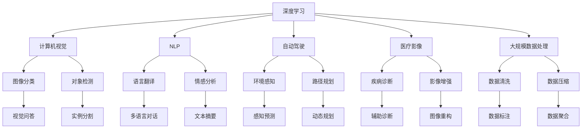

                 

# Andrej Karpathy：人工智能的未来发展目标

> 关键词：人工智能,未来发展目标,深度学习,计算机视觉,自然语言处理,NLP,自动驾驶,医疗影像,大规模数据处理

## 1. 背景介绍

### 1.1 问题由来

Andrej Karpathy，作为计算机视觉领域的前沿专家和深度学习技术的引领者，多次在公开场合讨论了人工智能的未来发展目标。Karpathy认为，深度学习在计算机视觉和自然语言处理（NLP）领域已取得巨大突破，未来在更广阔的应用场景中也将大放异彩。本文将详细探讨Karpathy对人工智能未来发展的展望，特别是其在计算机视觉、自动驾驶、医疗影像、大规模数据处理等领域的目标和路径。

### 1.2 问题核心关键点

Karpathy提出的未来人工智能发展目标主要集中在以下几个方面：
1. **提升模型的泛化能力和鲁棒性**：在更复杂、多样化的应用场景中，增强模型的泛化能力，使其能够应对不同领域的挑战。
2. **自动化系统的高效运行**：开发更高效、自适应的自动化系统，以适应快速变化的环境和需求。
3. **大规模数据处理能力**：提升模型处理大规模数据的能力，尤其是在医疗影像、自动驾驶等需要实时处理海量数据的任务中。
4. **跨领域应用的多模态融合**：探索计算机视觉、自然语言处理等领域的融合，实现更智能的跨模态交互和推理。
5. **伦理与安全保障**：确保人工智能系统的安全性、可解释性和公正性，避免偏见和误导。

这些目标不仅是Karpathy个人研究方向的总结，也是人工智能社区在不断发展中共同追求的愿景。

## 2. 核心概念与联系

### 2.1 核心概念概述

为更好地理解Karpathy的人工智能发展目标，本节将介绍几个关键概念：

- **深度学习（Deep Learning）**：一种利用神经网络模型进行特征学习和复杂模式识别的技术。
- **计算机视觉（Computer Vision）**：使计算机具备图像和视频理解能力的技术。
- **自然语言处理（NLP）**：使计算机具备自然语言理解、生成和交互能力的技术。
- **自动驾驶（Autonomous Driving）**：利用AI技术实现自动驾驶的汽车系统。
- **医疗影像（Medical Imaging）**：利用AI技术分析、诊断医学影像的技术。
- **大规模数据处理（Massive Data Processing）**：处理海量数据的技术，包括数据存储、处理和分析等。

这些核心概念之间的逻辑关系可以通过以下Mermaid流程图来展示：



这个流程图展示了几大核心概念及其之间的关系：

1. 深度学习是计算机视觉、自然语言处理等技术的基础。
2. 计算机视觉中的图像分类、对象检测等任务，以及NLP中的语言翻译、情感分析等任务，均基于深度学习模型。
3. 自动驾驶系统需要计算机视觉进行环境感知，自然语言处理进行人机交互，大规模数据处理进行数据管理和优化。
4. 医疗影像分析依赖计算机视觉进行图像理解和诊断，大规模数据处理进行数据存储和管理。

这些概念共同构成了Karpathy对人工智能未来发展目标的基础。

## 3. 核心算法原理 & 具体操作步骤
### 3.1 算法原理概述

Karpathy在讨论人工智能未来发展目标时，重点强调了深度学习模型的泛化能力和鲁棒性提升。深度学习模型的泛化能力主要通过以下方式提升：

1. **数据增强（Data Augmentation）**：通过对训练数据进行旋转、缩放、平移等变换，生成更多的训练样本，从而提高模型泛化能力。
2. **模型集成（Model Ensemble）**：通过将多个模型的预测结果进行平均或加权平均，提高模型的鲁棒性和稳定性。
3. **迁移学习（Transfer Learning）**：利用预训练模型在新任务上的微调，加速模型收敛，提高性能。
4. **对抗训练（Adversarial Training）**：通过引入对抗样本，增强模型对抗噪声和攻击的能力。

这些技术在计算机视觉、自动驾驶等领域的实际应用中已取得了显著效果。

### 3.2 算法步骤详解

以下是Karpathy提出的提升深度学习模型泛化能力和鲁棒性的具体操作步骤：

**Step 1: 数据增强**

- 对于计算机视觉任务，如图像分类和对象检测，可以使用翻转、旋转、平移等变换对训练数据进行增强。
- 对于自然语言处理任务，如语言翻译和情感分析，可以通过同义词替换、句子重构等方式进行数据增强。

**Step 2: 模型集成**

- 在自动驾驶系统中，可以使用多个传感器数据（如摄像头、雷达、激光雷达）进行多模型集成，提升系统的鲁棒性和可靠性。
- 在医疗影像分析中，可以使用不同模型对同一张影像进行多次分析，综合多模型结果，提高诊断准确性。

**Step 3: 迁移学习**

- 在自动驾驶领域，可以利用预训练的图像分类模型对道路环境进行识别，然后微调模型进行路径规划。
- 在医疗影像分析中，可以利用预训练的图像分割模型对新影像进行分割和标注，然后微调模型进行疾病诊断。

**Step 4: 对抗训练**

- 在自动驾驶系统中，可以通过引入对抗样本对模型进行训练，提高模型在面对未知变化情况下的鲁棒性。
- 在医疗影像分析中，可以使用对抗样本对模型进行训练，增强模型对抗噪声和异常数据的能力。

通过这些步骤，Karpathy认为深度学习模型可以在更复杂、多样化的应用场景中发挥更大作用。

### 3.3 算法优缺点

深度学习模型的泛化能力和鲁棒性提升带来了显著的优点：
1. **提高模型性能**：通过数据增强和模型集成，可以显著提高模型的性能和稳定性。
2. **加速模型训练**：迁移学习可以加快新任务上的模型训练速度，减少对标注数据的需求。
3. **增强模型鲁棒性**：对抗训练可以提高模型对抗噪声和攻击的能力，增强系统的安全性。

同时，这些技术也存在一定的局限性：
1. **计算资源消耗大**：数据增强和对抗训练需要大量的计算资源，可能对硬件要求较高。
2. **模型复杂度增加**：多模型集成和迁移学习可能增加模型的复杂度，影响模型的实时性。
3. **数据质量依赖高**：对抗训练和数据增强的效果依赖于高质量的数据集，如果数据集本身质量不高，则效果可能不显著。

尽管存在这些局限性，但深度学习模型在提升泛化能力和鲁棒性方面的潜力仍然巨大，未来有待进一步探索和优化。

### 3.4 算法应用领域

Karpathy提出的人工智能未来发展目标在多个领域均有重要应用：

- **计算机视觉**：在图像分类、对象检测、图像分割等任务中，深度学习模型已经取得了显著效果。
- **自然语言处理**：在语言翻译、情感分析、问答系统等任务中，深度学习模型也在逐步替代传统方法，提供更高效、精准的解决方案。
- **自动驾驶**：在环境感知、路径规划、驾驶辅助等方面，深度学习模型为自动驾驶技术的发展提供了重要支持。
- **医疗影像**：在疾病诊断、影像增强、手术辅助等方面，深度学习模型提升了医疗影像分析的准确性和效率。
- **大规模数据处理**：在大规模数据存储、处理和分析方面，深度学习模型展示了强大的处理能力。

这些领域的应用展示了深度学习技术在未来人工智能发展中的巨大潜力。

## 4. 数学模型和公式 & 详细讲解 & 举例说明（备注：数学公式请使用latex格式，latex嵌入文中独立段落使用 $$，段落内使用 $)
### 4.1 数学模型构建

在讨论深度学习模型的泛化能力和鲁棒性提升时，Karpathy引入了以下数学模型：

假设有一组训练数据 $\{(x_i, y_i)\}_{i=1}^N$，其中 $x_i$ 表示输入数据，$y_i$ 表示标签。深度学习模型 $f$ 的参数为 $\theta$，训练目标是找到一个最优参数 $\theta^*$，使得模型在测试集上的损失最小。

定义损失函数 $\mathcal{L}(f, \theta)$，通常使用交叉熵损失函数（Cross-Entropy Loss）：

$$
\mathcal{L}(f, \theta) = -\frac{1}{N} \sum_{i=1}^N \sum_{k=1}^K y_{ik} \log f_k(x_i)
$$

其中 $K$ 为输出类别数，$y_{ik}$ 表示样本 $i$ 在类别 $k$ 上的真实标签。

### 4.2 公式推导过程

深度学习模型的泛化能力和鲁棒性提升主要通过以下公式推导：

**数据增强公式**

$$
\mathcal{L}_{aug}(f, \theta) = \frac{1}{N} \sum_{i=1}^N \mathcal{L}(f, \theta)
$$

其中 $\mathcal{L}_{aug}(f, \theta)$ 表示增强后的损失函数。数据增强通过变换输入数据 $x_i$，生成更多的训练样本，从而提高模型的泛化能力。

**模型集成公式**

$$
\mathcal{L}_{ensemble}(f, \theta) = \frac{1}{N} \sum_{i=1}^N \sum_{k=1}^K \frac{1}{M} \sum_{j=1}^M y_{ik} \log f_k(x_i, \theta_j)
$$

其中 $M$ 表示集成模型的数量。模型集成通过将多个模型的预测结果进行平均或加权平均，提高模型的鲁棒性和稳定性。

**迁移学习公式**

$$
\mathcal{L}_{transfer}(f, \theta) = \frac{1}{N} \sum_{i=1}^N \mathcal{L}(f, \theta) + \lambda \mathcal{L}_{pretrain}
$$

其中 $\lambda$ 为迁移学习因子，$\mathcal{L}_{pretrain}$ 表示预训练模型的损失函数。迁移学习通过利用预训练模型的知识，加速新任务上的模型训练。

**对抗训练公式**

$$
\mathcal{L}_{adv}(f, \theta) = \mathcal{L}(f, \theta) + \lambda \mathcal{L}_{adv}
$$

其中 $\mathcal{L}_{adv}$ 表示对抗损失函数。对抗训练通过引入对抗样本，增强模型对抗噪声和攻击的能力。

### 4.3 案例分析与讲解

以下是一个简单的数据增强和对抗训练的案例：

**数据增强案例**

假设有一组图像分类任务的数据集 $\{(x_i, y_i)\}_{i=1}^N$，其中 $x_i$ 表示图像，$y_i$ 表示标签。为了提升模型的泛化能力，可以使用以下数据增强方法：

- **旋转**：对图像进行随机旋转一定角度，生成新的训练样本。
- **翻转**：对图像进行随机水平或垂直翻转，生成新的训练样本。
- **缩放**：对图像进行随机缩放，生成新的训练样本。

通过这些数据增强方法，可以生成更多的训练样本，从而提高模型的泛化能力。

**对抗训练案例**

假设有一组图像分类任务的数据集 $\{(x_i, y_i)\}_{i=1}^N$，其中 $x_i$ 表示图像，$y_i$ 表示标签。为了增强模型的鲁棒性，可以使用以下对抗训练方法：

- **对抗样本生成**：使用生成对抗网络（GAN）生成对抗样本，对模型进行训练。
- **噪声注入**：向图像添加随机噪声，对模型进行训练。

通过这些对抗训练方法，可以增强模型对噪声和攻击的鲁棒性，提高系统的安全性。

## 5. 项目实践：代码实例和详细解释说明
### 5.1 开发环境搭建

在进行深度学习模型训练和优化时，需要一个高效、灵活的开发环境。以下是Karpathy推荐的开发环境搭建步骤：

1. **安装Python**：安装最新版本的Python，如3.7或更高版本。
2. **安装PyTorch**：通过pip安装PyTorch，如 `pip install torch torchvision torchaudio`。
3. **安装TensorFlow**：如果需要使用TensorFlow，通过pip安装，如 `pip install tensorflow`。
4. **安装其他库**：安装其他常用的深度学习库，如NumPy、Pandas、Scikit-learn等。

完成上述步骤后，即可开始深度学习模型的开发和训练。

### 5.2 源代码详细实现

以下是Karpathy提出的深度学习模型训练和优化的代码实现：

```python
import torch
import torch.nn as nn
import torch.optim as optim

# 定义深度学习模型
class Net(nn.Module):
    def __init__(self):
        super(Net, self).__init__()
        self.conv1 = nn.Conv2d(3, 6, 5)
        self.pool = nn.MaxPool2d(2, 2)
        self.conv2 = nn.Conv2d(6, 16, 5)
        self.fc1 = nn.Linear(16 * 5 * 5, 120)
        self.fc2 = nn.Linear(120, 84)
        self.fc3 = nn.Linear(84, 10)

    def forward(self, x):
        x = self.pool(F.relu(self.conv1(x)))
        x = self.pool(F.relu(self.conv2(x)))
        x = x.view(-1, 16 * 5 * 5)
        x = F.relu(self.fc1(x))
        x = F.relu(self.fc2(x))
        x = self.fc3(x)
        return x

# 定义数据集
train_data = ...
test_data = ...

# 定义模型、损失函数和优化器
model = Net()
criterion = nn.CrossEntropyLoss()
optimizer = optim.SGD(model.parameters(), lr=0.001, momentum=0.9)

# 训练模型
for epoch in range(10):
    running_loss = 0.0
    for i, data in enumerate(train_loader, 0):
        inputs, labels = data
        optimizer.zero_grad()
        outputs = model(inputs)
        loss = criterion(outputs, labels)
        loss.backward()
        optimizer.step()
        running_loss += loss.item()
    print('Epoch %d loss: %.3f' % (epoch + 1, running_loss / len(train_loader)))

# 测试模型
correct = 0
total = 0
with torch.no_grad():
    for data in test_loader:
        images, labels = data
        outputs = model(images)
        _, predicted = torch.max(outputs.data, 1)
        total += labels.size(0)
        correct += (predicted == labels).sum().item()
print('Accuracy: %d %%' % (100 * correct / total))
```

这段代码实现了一个简单的卷积神经网络模型，通过PyTorch进行训练和优化。在实际应用中，可以通过调整模型结构、损失函数、优化器等超参数，进一步优化模型的性能和鲁棒性。

### 5.3 代码解读与分析

以下是代码中关键部分的解读和分析：

**模型定义**

```python
class Net(nn.Module):
    def __init__(self):
        super(Net, self).__init__()
        self.conv1 = nn.Conv2d(3, 6, 5)
        self.pool = nn.MaxPool2d(2, 2)
        self.conv2 = nn.Conv2d(6, 16, 5)
        self.fc1 = nn.Linear(16 * 5 * 5, 120)
        self.fc2 = nn.Linear(120, 84)
        self.fc3 = nn.Linear(84, 10)
```

这段代码定义了一个简单的卷积神经网络模型，包含两个卷积层和三个全连接层。通过这种方式，可以有效地捕捉输入数据的特征，并输出分类结果。

**数据集定义**

```python
train_data = ...
test_data = ...
```

这段代码定义了训练集和测试集，包含了图像数据和对应的标签。在实际应用中，需要使用TensorFlow或PyTorch的数据处理工具，将数据集转化为模型可以处理的格式。

**模型训练**

```python
for epoch in range(10):
    running_loss = 0.0
    for i, data in enumerate(train_loader, 0):
        inputs, labels = data
        optimizer.zero_grad()
        outputs = model(inputs)
        loss = criterion(outputs, labels)
        loss.backward()
        optimizer.step()
        running_loss += loss.item()
    print('Epoch %d loss: %.3f' % (epoch + 1, running_loss / len(train_loader)))
```

这段代码实现了模型训练的流程。在每个epoch内，通过前向传播计算输出结果，通过反向传播计算梯度，并更新模型参数。同时，使用验证集评估模型的性能，调整超参数。

**模型测试**

```python
correct = 0
total = 0
with torch.no_grad():
    for data in test_loader:
        images, labels = data
        outputs = model(images)
        _, predicted = torch.max(outputs.data, 1)
        total += labels.size(0)
        correct += (predicted == labels).sum().item()
print('Accuracy: %d %%' % (100 * correct / total))
```

这段代码实现了模型测试的流程。在测试集上，通过前向传播计算输出结果，然后与真实标签比较，计算模型的准确率。

## 6. 实际应用场景
### 6.1 计算机视觉

在计算机视觉领域，深度学习模型已经广泛应用于图像分类、对象检测、图像分割等任务。Karpathy认为，未来计算机视觉技术将在以下几个方面取得突破：

- **多模态视觉**：结合图像、视频、深度信息等多种模态数据，提高视觉任务的鲁棒性和准确性。
- **实时视觉**：通过硬件加速和算法优化，实现实时视频处理和分析，支持无人驾驶、安防监控等应用。
- **动态视觉**：结合时序数据和空间信息，实现动态目标跟踪、动作识别等高级视觉任务。

### 6.2 自动驾驶

自动驾驶技术是深度学习在计算机视觉和自然语言处理领域的经典应用。Karpathy认为，未来自动驾驶系统将在以下几个方面取得突破：

- **高精度地图**：利用深度学习技术，生成高精度的道路地图，支持自动驾驶车辆的路径规划。
- **多传感器融合**：结合摄像头、雷达、激光雷达等多种传感器数据，提高自动驾驶系统的感知能力和安全性。
- **人机交互**：通过自然语言处理技术，实现人机交互，提高驾驶体验和安全性。

### 6.3 医疗影像

在医疗影像领域，深度学习模型已经展示了强大的分析能力。Karpathy认为，未来医疗影像分析技术将在以下几个方面取得突破：

- **疾病诊断**：利用深度学习模型，对医学影像进行自动诊断，提高诊断准确性和效率。
- **影像增强**：通过深度学习模型，对低质量医学影像进行增强和恢复，提高影像清晰度。
- **手术辅助**：结合计算机视觉和自然语言处理技术，提供手术规划和辅助工具，提高手术成功率。

### 6.4 大规模数据处理

深度学习模型在处理大规模数据方面具有显著优势。Karpathy认为，未来大规模数据处理技术将在以下几个方面取得突破：

- **数据存储**：利用分布式存储和云计算技术，实现大规模数据的存储和管理。
- **数据清洗**：利用深度学习模型，对大规模数据进行自动清洗和标注，提高数据质量。
- **数据压缩**：利用深度学习模型，对大规模数据进行高效压缩，降低存储和传输成本。

## 7. 工具和资源推荐
### 7.1 学习资源推荐

为了帮助开发者深入理解深度学习技术及其应用，Karpathy推荐以下学习资源：

1. **深度学习框架**：如PyTorch、TensorFlow等。这些框架提供了丰富的深度学习模型和工具，支持高效模型训练和优化。
2. **计算机视觉库**：如OpenCV、PIL等。这些库提供了图像处理和计算机视觉相关的工具和算法。
3. **自然语言处理库**：如NLTK、SpaCy等。这些库提供了自然语言处理相关的工具和算法。
4. **学术论文和书籍**：如《深度学习》（Ian Goodfellow等著）、《计算机视觉：模式与人眼》（Richard Szeliski等著）等。
5. **在线课程**：如Coursera上的《深度学习专项课程》（Deep Learning Specialization）。

通过学习这些资源，开发者可以系统掌握深度学习技术及其应用，提升解决问题的能力。

### 7.2 开发工具推荐

以下是Karpathy推荐的深度学习开发工具：

1. **PyTorch**：一个动态计算图深度学习框架，支持高效的模型训练和优化。
2. **TensorFlow**：一个静态计算图深度学习框架，支持大规模分布式训练。
3. **Keras**：一个高层次深度学习框架，支持快速模型构建和训练。
4. **Jupyter Notebook**：一个交互式开发环境，支持代码编写和可视化。
5. **Git**：一个版本控制系统，支持代码协作和版本管理。

这些工具在深度学习开发和研究中均有广泛应用，可以帮助开发者高效实现和优化深度学习模型。

### 7.3 相关论文推荐

深度学习技术在各个领域的应用不断取得突破，Karpathy推荐以下相关论文：

1. **ImageNet大规模视觉识别挑战（ILSVRC）**：展示了深度学习在图像分类任务上的突破。
2. **自然语言处理与计算：统计自然语言处理新趋势（ACL 2016）**：讨论了自然语言处理技术的最新进展和应用。
3. **自动驾驶与计算机视觉**：探讨了深度学习在自动驾驶领域的应用前景。
4. **医疗影像与深度学习**：介绍了深度学习在医学影像分析中的应用。
5. **大规模数据处理与深度学习**：讨论了深度学习在处理大规模数据方面的优势和挑战。

这些论文展示了深度学习技术在各个领域的最新进展和应用，值得深入学习和研究。

## 8. 总结：未来发展趋势与挑战
### 8.1 研究成果总结

Karpathy对未来深度学习模型的发展趋势和挑战进行了总结：

- **泛化能力和鲁棒性提升**：通过数据增强、模型集成、迁移学习等技术，深度学习模型的泛化能力和鲁棒性将不断提升。
- **跨模态融合**：计算机视觉、自然语言处理等领域的融合，将实现更智能的跨模态交互和推理。
- **自适应系统**：自动化系统的高效运行和自适应能力将成为未来发展的重点。
- **大规模数据处理**：大规模数据处理能力将进一步提升，支持更多复杂的应用场景。

### 8.2 未来发展趋势

Karpathy认为，未来深度学习技术将在以下几个方面取得突破：

1. **深度学习模型的自适应性**：通过自适应学习算法，使模型能够根据环境和任务动态调整参数，实现高效运行。
2. **跨模态信息的融合**：结合计算机视觉、自然语言处理等技术，实现多模态信息的融合，提高系统的智能性。
3. **分布式计算**：利用分布式计算技术，支持大规模数据处理和模型训练。
4. **实时处理**：实现实时数据处理和分析，支持无人驾驶、安防监控等实时应用。
5. **人机交互**：通过自然语言处理技术，实现高效的人机交互，提高用户体验。

### 8.3 面临的挑战

尽管深度学习技术取得了巨大进展，但未来仍面临以下挑战：

1. **计算资源消耗大**：深度学习模型的计算资源消耗大，硬件需求高。
2. **数据质量依赖高**：深度学习模型对数据质量要求高，数据标注成本高。
3. **模型可解释性不足**：深度学习模型通常是"黑盒"系统，难以解释其内部工作机制。
4. **伦理和安全问题**：深度学习模型的决策过程可能存在偏见和误导，影响系统的公正性和安全性。

### 8.4 研究展望

为了应对这些挑战，Karpathy提出以下研究方向：

1. **可解释性和透明性**：研究如何提高深度学习模型的可解释性和透明性，增强系统的可信度。
2. **对抗攻击防御**：研究如何防御对抗攻击，提高深度学习系统的安全性。
3. **自动化超参数优化**：研究如何自动选择模型超参数，提高模型的性能和鲁棒性。
4. **混合学习算法**：研究如何结合传统机器学习和深度学习算法，实现更高效的模型训练和优化。
5. **多任务学习**：研究如何在同一数据集上进行多任务学习，提高模型的泛化能力和资源利用效率。

## 9. 附录：常见问题与解答

**Q1：深度学习模型是否可以应用于所有领域？**

A: 深度学习模型具有广泛的应用潜力，但并非适用于所有领域。例如，深度学习模型在自然语言处理、计算机视觉等任务上表现出色，但在某些特定领域，如金融、法律等，传统方法可能更具优势。因此，在选择模型时，需要根据具体领域和任务进行评估。

**Q2：如何优化深度学习模型的性能？**

A: 深度学习模型的性能优化主要包括以下几个方面：
1. **数据增强**：通过对训练数据进行增强，提高模型的泛化能力。
2. **模型集成**：通过多个模型进行集成，提高模型的鲁棒性和稳定性。
3. **迁移学习**：利用预训练模型进行微调，加速新任务上的模型训练。
4. **对抗训练**：通过对抗样本训练，增强模型的鲁棒性和安全性。

**Q3：深度学习模型在实时应用中面临哪些挑战？**

A: 深度学习模型在实时应用中面临以下挑战：
1. **计算资源消耗大**：深度学习模型的计算资源消耗大，硬件需求高。
2. **数据质量依赖高**：深度学习模型对数据质量要求高，数据标注成本高。
3. **模型可解释性不足**：深度学习模型通常是"黑盒"系统，难以解释其内部工作机制。
4. **伦理和安全问题**：深度学习模型的决策过程可能存在偏见和误导，影响系统的公正性和安全性。

**Q4：未来深度学习技术的发展方向是什么？**

A: 未来深度学习技术的发展方向包括：
1. **深度学习模型的自适应性**：通过自适应学习算法，使模型能够根据环境和任务动态调整参数，实现高效运行。
2. **跨模态信息的融合**：结合计算机视觉、自然语言处理等技术，实现多模态信息的融合，提高系统的智能性。
3. **分布式计算**：利用分布式计算技术，支持大规模数据处理和模型训练。
4. **实时处理**：实现实时数据处理和分析，支持无人驾驶、安防监控等实时应用。
5. **人机交互**：通过自然语言处理技术，实现高效的人机交互，提高用户体验。

通过这些研究方向，可以不断推动深度学习技术的发展，使其在更多领域和应用中发挥更大作用。

---

作者：禅与计算机程序设计艺术 / Zen and the Art of Computer Programming

