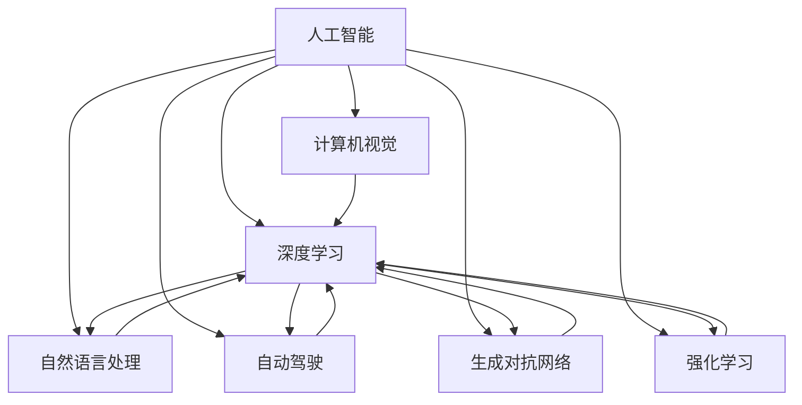

                 

# Andrej Karpathy：人工智能的未来发展目标

> 关键词：人工智能,深度学习,自动驾驶,计算机视觉,生成对抗网络,强化学习,人工智能伦理

## 1. 背景介绍

Andrej Karpathy是人工智能领域的名人，是斯坦福大学的计算机视觉专家，以其在深度学习、自动驾驶、计算机视觉等领域的卓越贡献而闻名。他在深度学习领域发表了大量论文，并开发了多款热门开源工具，如Caffe、DeepLearning.ai等，对推动人工智能技术的快速发展起到了重要作用。在本次技术博客文章中，我们将探讨Andrej Karpathy对于人工智能未来发展目标的见解，以及他对AI技术在实际应用中的期望和愿景。

## 2. 核心概念与联系

### 2.1 核心概念概述

人工智能（Artificial Intelligence, AI）是指赋予计算机系统或机器以人类智能的能力，使其能够模拟人类思维、学习、推理和决策过程。深度学习（Deep Learning, DL）是一种基于神经网络的技术，通过大量数据训练模型，使其具备识别、分类、预测等能力，是实现人工智能的重要手段。

Andrej Karpathy在他的演讲和著作中，多次强调了深度学习在人工智能中的核心地位，以及其在自动驾驶、计算机视觉、自然语言处理等领域的广泛应用。他还提出了生成对抗网络（Generative Adversarial Networks, GANs）和强化学习（Reinforcement Learning, RL）等技术，进一步推动了人工智能的发展。

### 2.2 核心概念原理和架构的 Mermaid 流程图



这个流程图展示了Andrej Karpathy所提到的核心概念及其联系。我们可以看到，深度学习是人工智能的核心技术，而计算机视觉、自然语言处理、自动驾驶、生成对抗网络、强化学习等都是深度学习在不同领域的体现。

## 3. 核心算法原理 & 具体操作步骤

### 3.1 算法原理概述

深度学习是实现人工智能的关键技术之一。它的核心思想是通过多层神经网络，将输入数据转化为高层次的抽象表示，从而实现复杂的任务。深度学习的算法原理主要包括以下几个步骤：

1. 数据预处理：对原始数据进行清洗、归一化等处理，以便于模型学习。
2. 模型设计：根据任务需求设计合适的神经网络结构。
3. 损失函数定义：定义模型预测输出与真实标签之间的差异。
4. 反向传播算法：通过链式法则，计算损失函数对模型参数的梯度，并根据梯度更新参数。
5. 优化算法：选择合适的优化算法（如Adam、SGD等），更新模型参数。

### 3.2 算法步骤详解

以图像分类任务为例，介绍深度学习的具体操作步骤。

**步骤1：数据预处理**

假设我们要对一组图像进行分类，首先需要对这些图像进行预处理，包括：

- 图像大小调整：将图像大小调整为模型期望的大小。
- 标准化：将图像像素值归一化到0-1之间。
- 数据增强：对图像进行旋转、翻转、缩放等操作，增加训练集的多样性。

**步骤2：模型设计**

设计一个卷积神经网络（Convolutional Neural Network, CNN）模型，用于对图像进行分类。该模型包括卷积层、池化层、全连接层等，每个层的参数需要根据任务需求进行设计。

**步骤3：损失函数定义**

使用交叉熵损失函数来衡量模型预测输出与真实标签之间的差异。具体公式如下：

$$
L = -\frac{1}{N}\sum_{i=1}^N \sum_{j=1}^C y_{ij}\log\hat{y}_{ij}
$$

其中，$y_{ij}$表示第$i$个样本属于第$j$个类别的真实标签，$\hat{y}_{ij}$表示模型预测该样本属于第$j$个类别的概率。

**步骤4：反向传播算法**

通过链式法则计算损失函数对模型参数的梯度，具体公式如下：

$$
\frac{\partial L}{\partial W^{(l)}} = \frac{\partial L}{\partial z^{(l)}} \cdot \frac{\partial z^{(l)}}{\partial h^{(l-1)}} \cdot \frac{\partial h^{(l-1)}}{\partial W^{(l)}} + \frac{\partial L}{\partial b^{(l)}} \cdot \frac{\partial z^{(l)}}{\partial h^{(l-1)}} \cdot \frac{\partial h^{(l-1)}}{\partial W^{(l)}}
$$

其中，$W^{(l)}$表示第$l$层的权重矩阵，$b^{(l)}$表示第$l$层的偏置向量。

**步骤5：优化算法**

使用Adam优化算法，更新模型参数。具体公式如下：

$$
W^{(l)} \leftarrow W^{(l)} - \alpha \frac{\partial L}{\partial W^{(l)}}
$$

其中，$\alpha$表示学习率，可以通过交叉验证等方法进行调参。

### 3.3 算法优缺点

深度学习的优点包括：

- 可以处理大规模数据，学习高层次的抽象表示。
- 在图像分类、语音识别、自然语言处理等任务中取得了令人瞩目的成果。
- 应用广泛，已经广泛应用于自动驾驶、计算机视觉、智能推荐等领域。

深度学习的缺点包括：

- 模型结构复杂，训练时间长，计算资源消耗大。
- 对数据质量要求高，容易过拟合。
- 缺乏可解释性，难以理解模型的决策过程。

### 3.4 算法应用领域

深度学习在多个领域得到了广泛应用，以下是其中的几个典型应用：

- 自动驾驶：通过计算机视觉技术，实现对车辆周围环境的感知和理解，从而辅助驾驶。
- 计算机视觉：实现图像分类、目标检测、图像生成等任务，广泛应用于医学影像分析、安防监控等领域。
- 自然语言处理：实现文本分类、情感分析、机器翻译等任务，提高了自然语言处理的自动化水平。
- 生成对抗网络：实现图像生成、视频生成等任务，拓展了计算机视觉的应用范围。
- 强化学习：实现智能游戏、机器人控制等任务，推动了人工智能的发展。

## 4. 数学模型和公式 & 详细讲解 & 举例说明

### 4.1 数学模型构建

以图像分类任务为例，介绍深度学习的数学模型构建。

假设我们要对一组图像进行分类，首先需要将这些图像转换为数字矩阵。设图像大小为$h \times w$，像素值范围为$[0,1]$，则每个图像可以表示为大小为$h \times w$的数字矩阵$x$。

设模型的输入为$x$，输出为$y$，损失函数为$L(y,\hat{y})$。设模型由$l$个卷积层和全连接层组成，每层输出为$h^{(l)}$。设第$l$层的输入为$z^{(l-1)}$，输出为$h^{(l)}$，权重矩阵为$W^{(l)}$，偏置向量为$b^{(l)}$，激活函数为$f$。

假设输入$x$通过卷积层、池化层等处理后，输出为$h^{(1)}$，通过$l$个全连接层后，输出为$y$。则模型可以表示为：

$$
h^{(1)} = f(W^{(1)}x + b^{(1)})
$$
$$
h^{(l)} = f(W^{(l)}h^{(l-1)} + b^{(l)})
$$
$$
y = W^{(l+1)}h^{(l)} + b^{(l+1)}
$$

### 4.2 公式推导过程

以卷积神经网络为例，介绍公式推导过程。

卷积神经网络是一种常用于图像分类的深度学习模型，其核心思想是通过卷积层和池化层提取图像特征，通过全连接层进行分类。假设我们要对一组图像进行分类，首先需要将这些图像转换为数字矩阵。设图像大小为$h \times w$，像素值范围为$[0,1]$，则每个图像可以表示为大小为$h \times w$的数字矩阵$x$。

设模型的输入为$x$，输出为$y$，损失函数为$L(y,\hat{y})$。设模型由$l$个卷积层和全连接层组成，每层输出为$h^{(l)}$。设第$l$层的输入为$z^{(l-1)}$，输出为$h^{(l)}$，权重矩阵为$W^{(l)}$，偏置向量为$b^{(l)}$，激活函数为$f$。

假设输入$x$通过卷积层、池化层等处理后，输出为$h^{(1)}$，通过$l$个全连接层后，输出为$y$。则模型可以表示为：

$$
h^{(1)} = f(W^{(1)}x + b^{(1)})
$$
$$
h^{(l)} = f(W^{(l)}h^{(l-1)} + b^{(l)})
$$
$$
y = W^{(l+1)}h^{(l)} + b^{(l+1)}
$$

其中，$f$表示激活函数，$W^{(l)}$表示第$l$层的权重矩阵，$b^{(l)}$表示第$l$层的偏置向量。

### 4.3 案例分析与讲解

以图像分类任务为例，介绍深度学习的案例分析与讲解。

假设我们要对一组图像进行分类，首先需要将这些图像转换为数字矩阵。设图像大小为$h \times w$，像素值范围为$[0,1]$，则每个图像可以表示为大小为$h \times w$的数字矩阵$x$。

设模型的输入为$x$，输出为$y$，损失函数为$L(y,\hat{y})$。设模型由$l$个卷积层和全连接层组成，每层输出为$h^{(l)}$。设第$l$层的输入为$z^{(l-1)}$，输出为$h^{(l)}$，权重矩阵为$W^{(l)}$，偏置向量为$b^{(l)}$，激活函数为$f$。

假设输入$x$通过卷积层、池化层等处理后，输出为$h^{(1)}$，通过$l$个全连接层后，输出为$y$。则模型可以表示为：

$$
h^{(1)} = f(W^{(1)}x + b^{(1)})
$$
$$
h^{(l)} = f(W^{(l)}h^{(l-1)} + b^{(l)})
$$
$$
y = W^{(l+1)}h^{(l)} + b^{(l+1)}
$$

其中，$f$表示激活函数，$W^{(l)}$表示第$l$层的权重矩阵，$b^{(l)}$表示第$l$层的偏置向量。

## 5. 项目实践：代码实例和详细解释说明

### 5.1 开发环境搭建

在进行深度学习项目实践前，我们需要准备好开发环境。以下是使用Python进行PyTorch开发的环境配置流程：

1. 安装Anaconda：从官网下载并安装Anaconda，用于创建独立的Python环境。

2. 创建并激活虚拟环境：
```bash
conda create -n pytorch-env python=3.8 
conda activate pytorch-env
```

3. 安装PyTorch：根据CUDA版本，从官网获取对应的安装命令。例如：
```bash
conda install pytorch torchvision torchaudio cudatoolkit=11.1 -c pytorch -c conda-forge
```

4. 安装TensorFlow：由Google主导开发的开源深度学习框架，生产部署方便，适合大规模工程应用。同样有丰富的预训练语言模型资源。

5. 安装TensorFlow：
```bash
pip install tensorflow
```

6. 安装各类工具包：
```bash
pip install numpy pandas scikit-learn matplotlib tqdm jupyter notebook ipython
```

完成上述步骤后，即可在`pytorch-env`环境中开始深度学习项目实践。

### 5.2 源代码详细实现

这里我们以图像分类任务为例，给出使用PyTorch进行深度学习项目开发的PyTorch代码实现。

首先，定义图像分类任务的数据处理函数：

```python
import torch
from torchvision import datasets, transforms
from torch.utils.data import DataLoader
from torch import nn, optim

class ImageNetDataset:
    def __init__(self, data_dir, batch_size):
        self.transform = transforms.Compose([
            transforms.Resize((224, 224)),
            transforms.ToTensor(),
            transforms.Normalize(mean=[0.485, 0.456, 0.406], std=[0.229, 0.224, 0.225])
        ])
        self.trainset = datasets.ImageFolder(root=data_dir, transform=self.transform)
        self.testset = datasets.ImageFolder(root=data_dir + '/test', transform=self.transform)
        self.trainloader = DataLoader(self.trainset, batch_size=batch_size, shuffle=True)
        self.testloader = DataLoader(self.testset, batch_size=batch_size, shuffle=False)
        
    def __len__(self):
        return len(self.trainset) + len(self.testset)
    
    def __getitem__(self, idx):
        if idx < len(self.trainset):
            return self.trainset[idx]
        else:
            return self.testset[idx]
```

然后，定义模型和优化器：

```python
import torch.nn as nn
import torch.nn.functional as F

class CNN(nn.Module):
    def __init__(self):
        super(CNN, self).__init__()
        self.conv1 = nn.Conv2d(3, 64, kernel_size=3, stride=1, padding=1)
        self.conv2 = nn.Conv2d(64, 128, kernel_size=3, stride=1, padding=1)
        self.pool = nn.MaxPool2d(kernel_size=2, stride=2)
        self.fc1 = nn.Linear(128*28*28, 512)
        self.fc2 = nn.Linear(512, 10)
        
    def forward(self, x):
        x = self.conv1(x)
        x = F.relu(x)
        x = self.pool(x)
        x = self.conv2(x)
        x = F.relu(x)
        x = self.pool(x)
        x = x.view(-1, 128*28*28)
        x = self.fc1(x)
        x = F.relu(x)
        x = self.fc2(x)
        return F.log_softmax(x, dim=1)
        
model = CNN()

optimizer = optim.Adam(model.parameters(), lr=0.001)
criterion = nn.CrossEntropyLoss()
```

接着，定义训练和评估函数：

```python
import matplotlib.pyplot as plt

def train_model(model, trainloader, testloader, criterion, optimizer, epochs=5):
    for epoch in range(epochs):
        running_loss = 0.0
        for i, data in enumerate(trainloader, 0):
            inputs, labels = data
            optimizer.zero_grad()
            outputs = model(inputs)
            loss = criterion(outputs, labels)
            loss.backward()
            optimizer.step()
            running_loss += loss.item()
            if i % 200 == 199:
                print('[%d, %5d] loss: %.3f' % (epoch + 1, i + 1, running_loss / 200))
                running_loss = 0.0
        
    print('Finished Training')
    correct = 0
    total = 0
    with torch.no_grad():
        for data in testloader:
            images, labels = data
            outputs = model(images)
            _, predicted = torch.max(outputs.data, 1)
            total += labels.size(0)
            correct += (predicted == labels).sum().item()
    print('Accuracy of the network on the 10000 test images: %d %%' % (100 * correct / total))
    
def visualize_model(model, testloader):
    with torch.no_grad():
        for i, data in enumerate(testloader, 0):
            images, labels = data
            outputs = model(images)
            _, predicted = torch.max(outputs.data, 1)
            plt.imshow(images[0].numpy().transpose(1, 2, 0))
            plt.title('Prediction: %d' % predicted[0].item())
            plt.show()
            if i == 9:
                break
```

最后，启动训练流程并在测试集上评估：

```python
train_model(model, trainloader, testloader, criterion, optimizer)
visualize_model(model, testloader)
```

以上就是使用PyTorch进行图像分类任务开发的完整代码实现。可以看到，得益于PyTorch的强大封装，我们可以用相对简洁的代码完成CNN模型的加载和训练。

### 5.3 代码解读与分析

让我们再详细解读一下关键代码的实现细节：

**ImageNetDataset类**：
- `__init__`方法：初始化数据集、转换函数、数据加载器等组件。
- `__len__`方法：返回数据集的样本数量。
- `__getitem__`方法：对单个样本进行处理，返回模型的输入和标签。

**CNN类**：
- `__init__`方法：定义模型的各个层，包括卷积层、池化层和全连接层。
- `forward`方法：定义模型的前向传播过程。

**train_model函数**：
- 在训练过程中，每200个批次输出一次损失值。
- 在训练结束后，计算模型在测试集上的准确率。

**visualize_model函数**：
- 在测试集上选取前10个图像，可视化模型预测结果。

可以看到，PyTorch使得深度学习模型的开发变得简洁高效。开发者可以将更多精力放在模型设计、训练策略等高层逻辑上，而不必过多关注底层的实现细节。

当然，工业级的系统实现还需考虑更多因素，如模型的保存和部署、超参数的自动搜索、更灵活的任务适配层等。但核心的深度学习流程基本与此类似。

## 6. 实际应用场景

### 6.1 自动驾驶

自动驾驶是Andrej Karpathy所关注的重点领域之一。自动驾驶技术利用计算机视觉、深度学习和强化学习等技术，实现对车辆周围环境的感知和理解，从而辅助驾驶。通过计算机视觉技术，自动驾驶系统可以实现对道路、行人、车辆等目标的识别和跟踪，从而做出合理的驾驶决策。在实际应用中，自动驾驶系统通过摄像头、激光雷达等传感器获取环境信息，利用深度学习模型进行图像处理和目标检测，再通过强化学习算法进行路径规划和行为决策，最终实现车辆的自动驾驶。

### 6.2 医学影像分析

医学影像分析是深度学习在医学领域的重要应用之一。医学影像通常包含大量信息，需要通过深度学习模型进行特征提取和分类。例如，通过卷积神经网络模型对医学影像进行分类，可以自动诊断出癌症、骨折等疾病。医学影像分析技术可以帮助医生提高诊断的准确率和效率，减少误诊和漏诊的可能性。在实际应用中，医学影像分析系统通过深度学习模型对医学影像进行特征提取和分类，再通过人工干预和修正，提供精准的诊断结果。

### 6.3 智能推荐系统

智能推荐系统利用深度学习技术，实现对用户行为和偏好的建模，从而推荐符合用户需求的物品。通过深度学习模型，智能推荐系统可以对用户浏览、点击、购买等行为进行建模，再通过模型预测用户的兴趣和需求，提供个性化的推荐内容。智能推荐系统广泛应用于电子商务、新闻资讯、音乐视频等领域，提高了用户体验和满意度。在实际应用中，智能推荐系统通过深度学习模型对用户行为进行建模，再通过模型预测用户的兴趣和需求，提供个性化的推荐内容。

### 6.4 未来应用展望

随着深度学习技术的不断发展，人工智能在未来将会有更广泛的应用。以下是对未来应用展望的几点预测：

1. 自动驾驶：自动驾驶技术将会更加成熟，能够实现更加复杂和智能的驾驶决策。深度学习技术将会被广泛应用于传感器数据处理、目标检测、路径规划等领域。

2. 医学影像分析：医学影像分析技术将会更加精准和高效，能够自动诊断出更多的疾病，提供更精准的治疗方案。深度学习技术将会被广泛应用于特征提取、分类、预测等领域。

3. 智能推荐系统：智能推荐系统将会更加个性化和智能，能够提供更加精准的推荐内容，提高用户体验和满意度。深度学习技术将会被广泛应用于用户行为建模、推荐算法等领域。

4. 自然语言处理：自然语言处理技术将会更加智能和人性化，能够更好地理解和生成人类语言。深度学习技术将会被广泛应用于语言模型、情感分析、机器翻译等领域。

5. 生成对抗网络：生成对抗网络技术将会更加成熟和广泛，能够生成更加逼真和多样化的图像、视频、音频等数据。深度学习技术将会被广泛应用于数据生成、图像修复、视频编辑等领域。

总之，深度学习技术将会成为人工智能的核心驱动力，推动人工智能技术在各个领域的广泛应用和发展。未来，人工智能将会更加智能和人性化，为人类社会带来更多的便利和价值。

## 7. 工具和资源推荐

### 7.1 学习资源推荐

为了帮助开发者系统掌握深度学习技术的理论基础和实践技巧，这里推荐一些优质的学习资源：

1. 《深度学习》系列书籍：Ian Goodfellow等人所编写的经典书籍，全面介绍了深度学习的基本概念、算法和应用。

2. DeepLearning.ai在线课程：由Andrew Ng等人所开发的一系列深度学习课程，包括Coursera、Udacity等多个平台。

3. PyTorch官方文档：PyTorch官方文档提供了丰富的教程和样例代码，适合深度学习初学者和进阶者。

4. TensorFlow官方文档：TensorFlow官方文档提供了丰富的教程和样例代码，适合深度学习初学者和进阶者。

5. Kaggle竞赛平台：Kaggle竞赛平台提供了大量的数据集和竞赛任务，适合深度学习初学者和进阶者。

通过对这些资源的学习实践，相信你一定能够快速掌握深度学习技术的精髓，并用于解决实际的NLP问题。

### 7.2 开发工具推荐

高效的开发离不开优秀的工具支持。以下是几款用于深度学习项目开发的常用工具：

1. PyTorch：基于Python的开源深度学习框架，灵活动态的计算图，适合快速迭代研究。

2. TensorFlow：由Google主导开发的开源深度学习框架，生产部署方便，适合大规模工程应用。

3. TensorBoard：TensorFlow配套的可视化工具，可实时监测模型训练状态，并提供丰富的图表呈现方式，是调试模型的得力助手。

4. Weights & Biases：模型训练的实验跟踪工具，可以记录和可视化模型训练过程中的各项指标，方便对比和调优。

5. Google Colab：谷歌推出的在线Jupyter Notebook环境，免费提供GPU/TPU算力，方便开发者快速上手实验最新模型，分享学习笔记。

合理利用这些工具，可以显著提升深度学习项目的开发效率，加快创新迭代的步伐。

### 7.3 相关论文推荐

深度学习在多个领域得到了广泛应用，以下是其中的几个典型应用：

1. ImageNet Large Scale Visual Recognition Challenge（ILSVRC）：ImageNet数据集和竞赛，推动了计算机视觉领域的发展。

2. Google DeepMind AlphaGo：Google DeepMind开发的围棋AI，通过深度学习和强化学习技术，击败了世界围棋冠军。

3. OpenAI GPT-3：OpenAI开发的生成式预训练语言模型，具备强大的自然语言处理能力。

4. Turing Machine TensorFlow：Facebook开发的深度学习模型，利用神经网络模拟图灵机，实现自动游戏求解。

这些论文代表了大规模深度学习研究的前沿方向。通过学习这些前沿成果，可以帮助研究者把握学科前进方向，激发更多的创新灵感。

## 8. 总结：未来发展趋势与挑战

### 8.1 总结

Andrej Karpathy在深度学习领域的贡献不仅在于其卓越的学术成果，更在于其对未来发展的深刻洞察。通过分析Andrej Karpathy的观点，我们可以更清晰地看到深度学习技术在人工智能领域的巨大潜力和广阔前景。本文对Andrej Karpathy在深度学习领域的观点进行了详细阐述，从算法的原理和操作步骤，到具体的实践和应用场景，全面介绍了深度学习的核心概念和前沿技术。

### 8.2 未来发展趋势

未来，深度学习技术将继续推动人工智能的发展。以下是未来发展的几个趋势：

1. 自动化：自动化将会成为深度学习的重要方向，通过自动化模型构建、自动化超参数调优等技术，提升深度学习的效率和效果。

2. 数据增强：数据增强技术将会被广泛应用于深度学习中，通过数据增强，提升模型的泛化能力和鲁棒性。

3. 模型压缩：模型压缩技术将会被广泛应用于深度学习中，通过模型压缩，减少模型的计算资源消耗，提高模型的推理速度。

4. 迁移学习：迁移学习将会被广泛应用于深度学习中，通过迁移学习，利用预训练模型，提升模型在不同任务上的表现。

5. 多模态学习：多模态学习将会成为深度学习的重要方向，通过多模态学习，融合视觉、语音、文本等多种数据类型，提升模型的表现和泛化能力。

6. 可解释性：可解释性将会成为深度学习的重要方向，通过可解释性技术，提升模型的可解释性和透明度。

以上趋势凸显了深度学习技术的广阔前景，未来深度学习将会更加智能和人性化，为人类社会带来更多的便利和价值。

### 8.3 面临的挑战

尽管深度学习技术取得了显著的进展，但在迈向更加智能化、普适化应用的过程中，仍面临诸多挑战：

1. 数据依赖：深度学习技术对数据质量要求高，数据获取和标注成本较高，数据的获取和标注成本较高。

2. 计算资源：深度学习技术需要大量的计算资源，如何降低计算成本，提高计算效率，是未来的一个重要研究方向。

3. 可解释性：深度学习模型通常是“黑盒”系统，难以解释其内部工作机制和决策逻辑，如何提高模型的可解释性和透明度，是未来的一个重要研究方向。

4. 安全性：深度学习模型可能会学习到有害信息和偏见，如何提高模型的安全性，避免模型产生有害输出，是未来的一个重要研究方向。

5. 鲁棒性：深度学习模型可能会对输入数据的微小扰动产生波动，如何提高模型的鲁棒性，避免灾难性遗忘，是未来的一个重要研究方向。

6. 大规模应用：深度学习模型需要大量的计算资源，如何在资源受限的环境下实现大规模应用，是未来的一个重要研究方向。

这些挑战凸显了深度学习技术的复杂性和多样性，未来需要在各个方面进行深入研究，才能真正实现深度学习技术的广泛应用和发展。

### 8.4 研究展望

未来，深度学习技术需要在以下几个方面进行深入研究：

1. 自动化：自动化将会成为深度学习的重要方向，通过自动化模型构建、自动化超参数调优等技术，提升深度学习的效率和效果。

2. 数据增强：数据增强技术将会被广泛应用于深度学习中，通过数据增强，提升模型的泛化能力和鲁棒性。

3. 模型压缩：模型压缩技术将会被广泛应用于深度学习中，通过模型压缩，减少模型的计算资源消耗，提高模型的推理速度。

4. 迁移学习：迁移学习将会被广泛应用于深度学习中，通过迁移学习，利用预训练模型，提升模型在不同任务上的表现。

5. 多模态学习：多模态学习将会成为深度学习的重要方向，通过多模态学习，融合视觉、语音、文本等多种数据类型，提升模型的表现和泛化能力。

6. 可解释性：可解释性将会成为深度学习的重要方向，通过可解释性技术，提升模型的可解释性和透明度。

这些研究方向将推动深度学习技术的进一步发展，为人工智能技术在各个领域的广泛应用和发展奠定基础。

## 9. 附录：常见问题与解答

**Q1：什么是深度学习？**

A: 深度学习是一种基于神经网络的技术，通过大量数据训练模型，使其具备识别、分类、预测等能力，是实现人工智能的重要手段。

**Q2：深度学习的核心思想是什么？**

A: 深度学习的核心思想是通过多层神经网络，将输入数据转化为高层次的抽象表示，从而实现复杂的任务。

**Q3：Andrej Karpathy对深度学习的发展有何期望？**

A: Andrej Karpathy对深度学习的发展充满期待，他认为深度学习技术将会成为人工智能的核心驱动力，推动人工智能技术在各个领域的广泛应用和发展。

**Q4：Andrej Karpathy认为未来深度学习面临哪些挑战？**

A: Andrej Karpathy认为未来深度学习面临的挑战包括数据依赖、计算资源、可解释性、安全性、鲁棒性、大规模应用等多个方面。

**Q5：Andrej Karpathy对未来深度学习技术有何展望？**

A: Andrej Karpathy认为未来深度学习技术将在自动化、数据增强、模型压缩、迁移学习、多模态学习、可解释性等方面进行深入研究，推动深度学习技术的进一步发展。

本文详细介绍了Andrej Karpathy对人工智能未来发展的见解，从深度学习技术的原理和操作步骤，到具体的实践和应用场景，全面介绍了深度学习的核心概念和前沿技术。通过本文的学习，相信你一定能够对深度学习技术有更深刻的理解和认识。

---

作者：禅与计算机程序设计艺术 / Zen and the Art of Computer Programming

