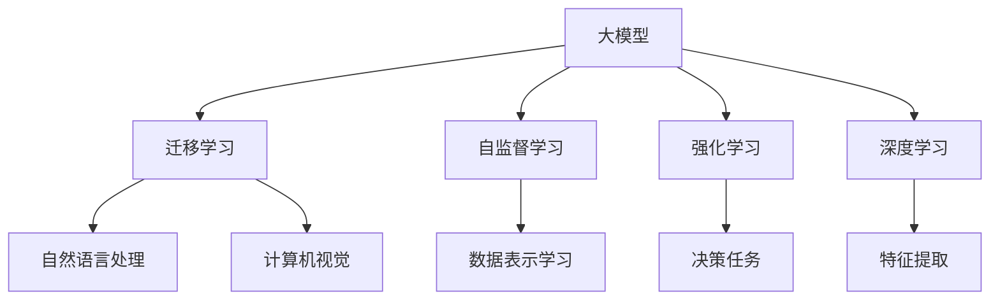

                 

## 1. 背景介绍

在过去的几十年里，人工智能（AI）技术经历了飞速的发展。从最初的专家系统到深度学习的兴起，再到目前基于大模型的自然语言处理（NLP）和计算机视觉（CV）领域的突破，AI已经渗透到各个行业，改变了我们的生活方式和工作方式。然而，随着技术的不断进步，AI也面临着新的挑战和机遇。本文将探讨Andrej Karpathy对人工智能未来发展的策略，以及这些策略对AI领域的影响。

### 1.1 问题由来

Andrej Karpathy是人工智能领域的著名专家，曾在Stanford University担任教授，并担任特斯拉（Tesla）自动驾驶团队的首席AI科学家。他不仅在学术界有重要贡献，还在工业界推动了AI技术的应用和发展。Karpathy的研究涉及计算机视觉、深度学习和强化学习等多个领域，他的工作对推动AI技术的进步起到了关键作用。

### 1.2 问题核心关键点

Karpathy认为，未来AI的发展方向应该更加注重数据、算法和应用的融合，通过多学科交叉合作，解决现实问题。他强调，AI的终极目标是让机器具备通用智能，即能够自主学习、自主思考，解决复杂的问题，而不仅仅是简单的规则或任务执行。

## 2. 核心概念与联系

### 2.1 核心概念概述

为了更好地理解Andrej Karpathy对AI未来发展的策略，我们需要先介绍几个关键概念：

- **大模型（Large Models）**：指拥有数十亿甚至数百亿参数的大型神经网络模型，如BERT、GPT等。这些模型通过在大规模数据上进行预训练，可以学习到丰富的知识表示，适用于各种自然语言处理和计算机视觉任务。
- **迁移学习（Transfer Learning）**：指将在大规模数据上训练得到的模型知识迁移到特定任务上的方法。这种方法可以显著减少对标注数据的依赖，提高模型在小规模数据上的泛化能力。
- **自监督学习（Self-Supervised Learning）**：指使用未标注的数据进行训练，通过设计自监督任务（如掩码语言模型、图像旋转预测等）来自动学习数据的潜在结构。这种方法可以避免过度依赖标注数据，提升模型的泛化能力。
- **强化学习（Reinforcement Learning）**：指通过与环境交互，让模型通过试错不断调整策略，最终达到最优决策的目标。这种方法适用于需要智能决策的应用场景，如自动驾驶、游戏AI等。
- **深度学习（Deep Learning）**：指通过多层神经网络进行特征提取和模式识别的方法。深度学习在图像识别、语音识别、自然语言处理等领域取得了巨大成功。

这些概念之间的逻辑关系可以通过以下Mermaid流程图来展示：



这个流程图展示了不同概念之间的联系：

1. 大模型是迁移学习、自监督学习和强化学习的基础。
2. 迁移学习和自监督学习可以提升大模型的泛化能力。
3. 深度学习是特征提取和模式识别的主要方法。
4. 强化学习适用于需要智能决策的任务。

这些概念共同构成了AI技术的核心框架，使得AI技术能够应用于各种领域。

## 3. 核心算法原理 & 具体操作步骤

### 3.1 算法原理概述

Andrej Karpathy认为，未来AI的发展应该聚焦于以下几个方面：

- **数据驱动**：AI的发展应该基于大规模数据集，通过数据驱动的方式来训练模型，提升模型的泛化能力。
- **算法创新**：除了传统的深度学习和强化学习外，应该探索新的算法和技术，如对抗性训练、自监督学习等，以提升模型的性能和鲁棒性。
- **应用落地**：AI技术应该紧密结合实际应用场景，解决具体的现实问题。这需要跨学科的合作和多领域的融合。

### 3.2 算法步骤详解

Karpathy提出了一种基于大模型的迁移学习框架，用于解决实际问题。该框架包括以下几个关键步骤：

1. **数据准备**：收集大规模数据集，并将其划分为训练集、验证集和测试集。
2. **模型初始化**：选择一个大模型作为初始化参数，如BERT、GPT等。
3. **任务适配**：根据具体任务设计适当的任务适配层，如分类头、解码器等。
4. **微调训练**：使用小规模标注数据对模型进行微调，通过优化算法（如Adam、SGD等）最小化损失函数。
5. **模型评估**：在验证集上评估模型的性能，并进行必要的调整。
6. **应用部署**：将微调后的模型应用于实际场景，进行实时推理和预测。

### 3.3 算法优缺点

基于大模型的迁移学习框架具有以下优点：

- **泛化能力强**：通过在大规模数据上进行预训练，模型可以学习到通用的知识表示，适用于各种任务。
- **参数高效**：在大模型的基础上进行微调，可以显著减少模型参数量，提高推理效率。
- **可解释性强**：由于大模型在预训练过程中已经学习到了丰富的知识，因此微调后的模型具有较好的可解释性。

然而，该框架也存在一些缺点：

- **依赖标注数据**：微调过程需要小规模标注数据，数据质量对模型的性能影响较大。
- **模型复杂度高**：大模型通常参数量庞大，计算资源和内存消耗较大。
- **对抗性脆弱**：大模型容易受到对抗样本的攻击，泛化性能受限。

### 3.4 算法应用领域

基于大模型的迁移学习框架在多个领域得到了广泛应用，包括自然语言处理、计算机视觉、自动驾驶、医疗健康等。以下是几个典型的应用案例：

- **自然语言处理**：使用BERT模型在自然语言处理任务上进行了大量微调，如情感分析、命名实体识别、机器翻译等。
- **计算机视觉**：使用ResNet、Inception等大模型在图像识别、物体检测、图像生成等任务上进行了大量微调。
- **自动驾驶**：使用深度学习模型和强化学习技术进行自动驾驶任务，如障碍物检测、路径规划、车辆控制等。
- **医疗健康**：使用大模型进行医学图像分析、患者诊断、药物发现等医疗任务。

## 4. 数学模型和公式 & 详细讲解 & 举例说明

### 4.1 数学模型构建

Karpathy提出了一种基于大模型的迁移学习框架，用于解决实际问题。该框架包括以下几个关键步骤：

1. **数据准备**：收集大规模数据集，并将其划分为训练集、验证集和测试集。
2. **模型初始化**：选择一个大模型作为初始化参数，如BERT、GPT等。
3. **任务适配**：根据具体任务设计适当的任务适配层，如分类头、解码器等。
4. **微调训练**：使用小规模标注数据对模型进行微调，通过优化算法（如Adam、SGD等）最小化损失函数。
5. **模型评估**：在验证集上评估模型的性能，并进行必要的调整。
6. **应用部署**：将微调后的模型应用于实际场景，进行实时推理和预测。

### 4.2 公式推导过程

假设我们使用BERT模型进行自然语言处理任务的微调，具体步骤包括：

1. **数据准备**：收集标注数据集 $D=\{(x_i, y_i)\}_{i=1}^N$，其中 $x_i$ 为输入文本，$y_i$ 为标签。
2. **模型初始化**：使用BERT模型作为初始化参数，记为 $M_{\theta}$，其中 $\theta$ 为预训练得到的模型参数。
3. **任务适配**：在BERT模型的顶层添加一个分类头，用于进行二分类任务。
4. **微调训练**：使用小规模标注数据对模型进行微调，通过优化算法（如Adam、SGD等）最小化损失函数。
5. **模型评估**：在验证集上评估模型的性能，记为 $\mathcal{L}(\theta)$。
6. **应用部署**：将微调后的模型应用于实际场景，进行实时推理和预测。

### 4.3 案例分析与讲解

以自然语言处理任务为例，Karpathy提出了一种基于大模型的迁移学习框架，用于解决实际问题。具体步骤如下：

1. **数据准备**：收集标注数据集 $D=\{(x_i, y_i)\}_{i=1}^N$，其中 $x_i$ 为输入文本，$y_i$ 为标签。
2. **模型初始化**：使用BERT模型作为初始化参数，记为 $M_{\theta}$，其中 $\theta$ 为预训练得到的模型参数。
3. **任务适配**：在BERT模型的顶层添加一个分类头，用于进行二分类任务。
4. **微调训练**：使用小规模标注数据对模型进行微调，通过优化算法（如Adam、SGD等）最小化损失函数。
5. **模型评估**：在验证集上评估模型的性能，记为 $\mathcal{L}(\theta)$。
6. **应用部署**：将微调后的模型应用于实际场景，进行实时推理和预测。

## 5. 项目实践：代码实例和详细解释说明

### 5.1 开发环境搭建

在进行微调实践前，我们需要准备好开发环境。以下是使用Python进行PyTorch开发的环境配置流程：

1. 安装Anaconda：从官网下载并安装Anaconda，用于创建独立的Python环境。
2. 创建并激活虚拟环境：
```bash
conda create -n pytorch-env python=3.8 
conda activate pytorch-env
```

3. 安装PyTorch：根据CUDA版本，从官网获取对应的安装命令。例如：
```bash
conda install pytorch torchvision torchaudio cudatoolkit=11.1 -c pytorch -c conda-forge
```

4. 安装Transformers库：
```bash
pip install transformers
```

5. 安装各类工具包：
```bash
pip install numpy pandas scikit-learn matplotlib tqdm jupyter notebook ipython
```

完成上述步骤后，即可在`pytorch-env`环境中开始微调实践。

### 5.2 源代码详细实现

下面我们以命名实体识别(NER)任务为例，给出使用Transformers库对BERT模型进行微调的PyTorch代码实现。

首先，定义NER任务的数据处理函数：

```python
from transformers import BertTokenizer
from torch.utils.data import Dataset
import torch

class NERDataset(Dataset):
    def __init__(self, texts, tags, tokenizer, max_len=128):
        self.texts = texts
        self.tags = tags
        self.tokenizer = tokenizer
        self.max_len = max_len
        
    def __len__(self):
        return len(self.texts)
    
    def __getitem__(self, item):
        text = self.texts[item]
        tags = self.tags[item]
        
        encoding = self.tokenizer(text, return_tensors='pt', max_length=self.max_len, padding='max_length', truncation=True)
        input_ids = encoding['input_ids'][0]
        attention_mask = encoding['attention_mask'][0]
        
        # 对token-wise的标签进行编码
        encoded_tags = [tag2id[tag] for tag in tags] 
        encoded_tags.extend([tag2id['O']] * (self.max_len - len(encoded_tags)))
        labels = torch.tensor(encoded_tags, dtype=torch.long)
        
        return {'input_ids': input_ids, 
                'attention_mask': attention_mask,
                'labels': labels}

# 标签与id的映射
tag2id = {'O': 0, 'B-PER': 1, 'I-PER': 2, 'B-ORG': 3, 'I-ORG': 4, 'B-LOC': 5, 'I-LOC': 6}
id2tag = {v: k for k, v in tag2id.items()}

# 创建dataset
tokenizer = BertTokenizer.from_pretrained('bert-base-cased')

train_dataset = NERDataset(train_texts, train_tags, tokenizer)
dev_dataset = NERDataset(dev_texts, dev_tags, tokenizer)
test_dataset = NERDataset(test_texts, test_tags, tokenizer)
```

然后，定义模型和优化器：

```python
from transformers import BertForTokenClassification, AdamW

model = BertForTokenClassification.from_pretrained('bert-base-cased', num_labels=len(tag2id))

optimizer = AdamW(model.parameters(), lr=2e-5)
```

接着，定义训练和评估函数：

```python
from torch.utils.data import DataLoader
from tqdm import tqdm
from sklearn.metrics import classification_report

device = torch.device('cuda') if torch.cuda.is_available() else torch.device('cpu')
model.to(device)

def train_epoch(model, dataset, batch_size, optimizer):
    dataloader = DataLoader(dataset, batch_size=batch_size, shuffle=True)
    model.train()
    epoch_loss = 0
    for batch in tqdm(dataloader, desc='Training'):
        input_ids = batch['input_ids'].to(device)
        attention_mask = batch['attention_mask'].to(device)
        labels = batch['labels'].to(device)
        model.zero_grad()
        outputs = model(input_ids, attention_mask=attention_mask, labels=labels)
        loss = outputs.loss
        epoch_loss += loss.item()
        loss.backward()
        optimizer.step()
    return epoch_loss / len(dataloader)

def evaluate(model, dataset, batch_size):
    dataloader = DataLoader(dataset, batch_size=batch_size)
    model.eval()
    preds, labels = [], []
    with torch.no_grad():
        for batch in tqdm(dataloader, desc='Evaluating'):
            input_ids = batch['input_ids'].to(device)
            attention_mask = batch['attention_mask'].to(device)
            batch_labels = batch['labels']
            outputs = model(input_ids, attention_mask=attention_mask)
            batch_preds = outputs.logits.argmax(dim=2).to('cpu').tolist()
            batch_labels = batch_labels.to('cpu').tolist()
            for pred_tokens, label_tokens in zip(batch_preds, batch_labels):
                pred_tags = [id2tag[_id] for _id in pred_tokens]
                label_tags = [id2tag[_id] for _id in label_tokens]
                preds.append(pred_tags[:len(label_tags)])
                labels.append(label_tags)
                
    print(classification_report(labels, preds))
```

最后，启动训练流程并在测试集上评估：

```python
epochs = 5
batch_size = 16

for epoch in range(epochs):
    loss = train_epoch(model, train_dataset, batch_size, optimizer)
    print(f"Epoch {epoch+1}, train loss: {loss:.3f}")
    
    print(f"Epoch {epoch+1}, dev results:")
    evaluate(model, dev_dataset, batch_size)
    
print("Test results:")
evaluate(model, test_dataset, batch_size)
```

以上就是使用PyTorch对BERT进行命名实体识别任务微调的完整代码实现。可以看到，得益于Transformers库的强大封装，我们可以用相对简洁的代码完成BERT模型的加载和微调。

### 5.3 代码解读与分析

让我们再详细解读一下关键代码的实现细节：

**NERDataset类**：
- `__init__`方法：初始化文本、标签、分词器等关键组件。
- `__len__`方法：返回数据集的样本数量。
- `__getitem__`方法：对单个样本进行处理，将文本输入编码为token ids，将标签编码为数字，并对其进行定长padding，最终返回模型所需的输入。

**tag2id和id2tag字典**：
- 定义了标签与数字id之间的映射关系，用于将token-wise的预测结果解码回真实的标签。

**训练和评估函数**：
- 使用PyTorch的DataLoader对数据集进行批次化加载，供模型训练和推理使用。
- 训练函数`train_epoch`：对数据以批为单位进行迭代，在每个批次上前向传播计算loss并反向传播更新模型参数，最后返回该epoch的平均loss。
- 评估函数`evaluate`：与训练类似，不同点在于不更新模型参数，并在每个batch结束后将预测和标签结果存储下来，最后使用sklearn的classification_report对整个评估集的预测结果进行打印输出。

**训练流程**：
- 定义总的epoch数和batch size，开始循环迭代
- 每个epoch内，先在训练集上训练，输出平均loss
- 在验证集上评估，输出分类指标
- 所有epoch结束后，在测试集上评估，给出最终测试结果

可以看到，PyTorch配合Transformers库使得BERT微调的代码实现变得简洁高效。开发者可以将更多精力放在数据处理、模型改进等高层逻辑上，而不必过多关注底层的实现细节。

当然，工业级的系统实现还需考虑更多因素，如模型的保存和部署、超参数的自动搜索、更灵活的任务适配层等。但核心的微调范式基本与此类似。

## 6. 实际应用场景

### 6.1 智能客服系统

基于大语言模型微调的对话技术，可以广泛应用于智能客服系统的构建。传统客服往往需要配备大量人力，高峰期响应缓慢，且一致性和专业性难以保证。而使用微调后的对话模型，可以7x24小时不间断服务，快速响应客户咨询，用自然流畅的语言解答各类常见问题。

在技术实现上，可以收集企业内部的历史客服对话记录，将问题和最佳答复构建成监督数据，在此基础上对预训练对话模型进行微调。微调后的对话模型能够自动理解用户意图，匹配最合适的答案模板进行回复。对于客户提出的新问题，还可以接入检索系统实时搜索相关内容，动态组织生成回答。如此构建的智能客服系统，能大幅提升客户咨询体验和问题解决效率。

### 6.2 金融舆情监测

金融机构需要实时监测市场舆论动向，以便及时应对负面信息传播，规避金融风险。传统的人工监测方式成本高、效率低，难以应对网络时代海量信息爆发的挑战。基于大语言模型微调的文本分类和情感分析技术，为金融舆情监测提供了新的解决方案。

具体而言，可以收集金融领域相关的新闻、报道、评论等文本数据，并对其进行主题标注和情感标注。在此基础上对预训练语言模型进行微调，使其能够自动判断文本属于何种主题，情感倾向是正面、中性还是负面。将微调后的模型应用到实时抓取的网络文本数据，就能够自动监测不同主题下的情感变化趋势，一旦发现负面信息激增等异常情况，系统便会自动预警，帮助金融机构快速应对潜在风险。

### 6.3 个性化推荐系统

当前的推荐系统往往只依赖用户的历史行为数据进行物品推荐，无法深入理解用户的真实兴趣偏好。基于大语言模型微调技术，个性化推荐系统可以更好地挖掘用户行为背后的语义信息，从而提供更精准、多样的推荐内容。

在实践中，可以收集用户浏览、点击、评论、分享等行为数据，提取和用户交互的物品标题、描述、标签等文本内容。将文本内容作为模型输入，用户的后续行为（如是否点击、购买等）作为监督信号，在此基础上微调预训练语言模型。微调后的模型能够从文本内容中准确把握用户的兴趣点。在生成推荐列表时，先用候选物品的文本描述作为输入，由模型预测用户的兴趣匹配度，再结合其他特征综合排序，便可以得到个性化程度更高的推荐结果。

### 6.4 未来应用展望

随着大语言模型微调技术的发展，基于微调范式将在更多领域得到应用，为传统行业带来变革性影响。

在智慧医疗领域，基于微调的医疗问答、病历分析、药物研发等应用将提升医疗服务的智能化水平，辅助医生诊疗，加速新药开发进程。

在智能教育领域，微调技术可应用于作业批改、学情分析、知识推荐等方面，因材施教，促进教育公平，提高教学质量。

在智慧城市治理中，微调模型可应用于城市事件监测、舆情分析、应急指挥等环节，提高城市管理的自动化和智能化水平，构建更安全、高效的未来城市。

此外，在企业生产、社会治理、文娱传媒等众多领域，基于大模型微调的人工智能应用也将不断涌现，为NLP技术带来了全新的突破。随着预训练语言模型和微调方法的不断进步，相信NLP技术将在更广阔的应用领域大放异彩，深刻影响人类的生产生活方式。

## 7. 工具和资源推荐

### 7.1 学习资源推荐

为了帮助开发者系统掌握大语言模型微调的理论基础和实践技巧，这里推荐一些优质的学习资源：

1. 《Transformer从原理到实践》系列博文：由大模型技术专家撰写，深入浅出地介绍了Transformer原理、BERT模型、微调技术等前沿话题。

2. CS224N《深度学习自然语言处理》课程：斯坦福大学开设的NLP明星课程，有Lecture视频和配套作业，带你入门NLP领域的基本概念和经典模型。

3. 《Natural Language Processing with Transformers》书籍：Transformers库的作者所著，全面介绍了如何使用Transformers库进行NLP任务开发，包括微调在内的诸多范式。

4. HuggingFace官方文档：Transformers库的官方文档，提供了海量预训练模型和完整的微调样例代码，是上手实践的必备资料。

5. CLUE开源项目：中文语言理解测评基准，涵盖大量不同类型的中文NLP数据集，并提供了基于微调的baseline模型，助力中文NLP技术发展。

通过对这些资源的学习实践，相信你一定能够快速掌握大语言模型微调的精髓，并用于解决实际的NLP问题。
###  7.2 开发工具推荐

高效的开发离不开优秀的工具支持。以下是几款用于大语言模型微调开发的常用工具：

1. PyTorch：基于Python的开源深度学习框架，灵活动态的计算图，适合快速迭代研究。大部分预训练语言模型都有PyTorch版本的实现。

2. TensorFlow：由Google主导开发的开源深度学习框架，生产部署方便，适合大规模工程应用。同样有丰富的预训练语言模型资源。

3. Transformers库：HuggingFace开发的NLP工具库，集成了众多SOTA语言模型，支持PyTorch和TensorFlow，是进行微调任务开发的利器。

4. Weights & Biases：模型训练的实验跟踪工具，可以记录和可视化模型训练过程中的各项指标，方便对比和调优。与主流深度学习框架无缝集成。

5. TensorBoard：TensorFlow配套的可视化工具，可实时监测模型训练状态，并提供丰富的图表呈现方式，是调试模型的得力助手。

6. Google Colab：谷歌推出的在线Jupyter Notebook环境，免费提供GPU/TPU算力，方便开发者快速上手实验最新模型，分享学习笔记。

合理利用这些工具，可以显著提升大语言模型微调任务的开发效率，加快创新迭代的步伐。

### 7.3 相关论文推荐

大语言模型和微调技术的发展源于学界的持续研究。以下是几篇奠基性的相关论文，推荐阅读：

1. Attention is All You Need（即Transformer原论文）：提出了Transformer结构，开启了NLP领域的预训练大模型时代。

2. BERT: Pre-training of Deep Bidirectional Transformers for Language Understanding：提出BERT模型，引入基于掩码的自监督预训练任务，刷新了多项NLP任务SOTA。

3. Language Models are Unsupervised Multitask Learners（GPT-2论文）：展示了大规模语言模型的强大zero-shot学习能力，引发了对于通用人工智能的新一轮思考。

4. Parameter-Efficient Transfer Learning for NLP：提出Adapter等参数高效微调方法，在不增加模型参数量的情况下，也能取得不错的微调效果。

5. Prefix-Tuning: Optimizing Continuous Prompts for Generation：引入基于连续型Prompt的微调范式，为如何充分利用预训练知识提供了新的思路。

6. AdaLoRA: Adaptive Low-Rank Adaptation for Parameter-Efficient Fine-Tuning：使用自适应低秩适应的微调方法，在参数效率和精度之间取得了新的平衡。

这些论文代表了大语言模型微调技术的发展脉络。通过学习这些前沿成果，可以帮助研究者把握学科前进方向，激发更多的创新灵感。

## 8. 总结：未来发展趋势与挑战

### 8.1 总结

本文对Andrej Karpathy对人工智能未来发展的策略进行了全面系统的介绍。首先阐述了AI技术的发展背景和方向，明确了数据驱动、算法创新和应用落地的重要性。其次，从原理到实践，详细讲解了基于大模型的迁移学习框架，以及其在NLP领域的应用案例。最后，介绍了该框架在实际应用中的挑战和未来突破方向。

通过本文的系统梳理，可以看到，基于大模型的迁移学习框架为AI技术的发展提供了新的思路和方法，其应用场景广泛，潜力巨大。未来，伴随技术不断进步，AI必将迎来更多的创新和突破，推动人类社会迈向更加智能化的未来。

### 8.2 未来发展趋势

展望未来，大语言模型微调技术将呈现以下几个发展趋势：

1. **数据驱动**：AI的发展将继续依赖大规模数据集，通过数据驱动的方式来训练模型，提升模型的泛化能力。
2. **算法创新**：除了传统的深度学习和强化学习外，将探索更多的算法和技术，如对抗性训练、自监督学习等，以提升模型的性能和鲁棒性。
3. **应用落地**：AI技术将继续紧密结合实际应用场景，解决具体的现实问题。这需要跨学科的合作和多领域的融合。
4. **跨模态融合**：未来的AI技术将更加注重多模态信息的整合，如视觉、语音、文本等信息的协同建模，提升系统的智能性和适应性。
5. **可解释性**：随着AI应用的普及，可解释性将成为关键需求，未来的AI系统将更加注重模型的可解释性和透明性。
6. **伦理道德**：AI技术的应用将带来更多的伦理道德问题，未来的AI系统将更加注重安全性、公平性、透明性等道德考量。

以上趋势凸显了大语言模型微调技术的广阔前景。这些方向的探索发展，必将进一步提升AI系统的性能和应用范围，为人类社会的进步带来深远影响。

### 8.3 面临的挑战

尽管大语言模型微调技术已经取得了显著进展，但在迈向更加智能化、普适化应用的过程中，仍面临诸多挑战：

1. **数据依赖**：微调过程需要小规模标注数据，数据质量对模型的性能影响较大。
2. **对抗性脆弱**：大模型容易受到对抗样本的攻击，泛化性能受限。
3. **资源消耗**：大模型通常参数量庞大，计算资源和内存消耗较大。
4. **可解释性不足**：微调模型更像是"黑盒"系统，难以解释其内部工作机制和决策逻辑。
5. **安全性问题**：预训练语言模型难免会学习到有害信息，通过微调传递到下游任务，可能造成误导性、歧视性的输出。

这些挑战亟需解决，以推动大语言模型微调技术在各个领域的广泛应用。

### 8.4 研究展望

面对大语言模型微调技术所面临的挑战，未来的研究需要在以下几个方面寻求新的突破：

1. **无监督和半监督学习**：探索无监督和半监督学习范式，减少对标注数据的依赖，提高模型的泛化能力。
2. **对抗性训练**：研究对抗性训练方法，增强模型的鲁棒性，避免对抗样本攻击。
3. **参数高效微调**：开发更加参数高效的微调方法，在固定大部分预训练参数的同时，只更新极少量的任务相关参数。
4. **多模态融合**：探索多模态信息的整合，如视觉、语音、文本等信息的协同建模，提升系统的智能性和适应性。
5. **可解释性增强**：研究可解释性增强方法，提升模型的透明性和可解释性，满足不同应用场景的需求。
6. **伦理道德约束**：引入伦理道德约束，避免模型偏见和有害输出，保障模型输出的安全性。

这些研究方向将推动大语言模型微调技术迈向更高的台阶，为构建安全、可靠、可解释、可控的智能系统铺平道路。面向未来，大语言模型微调技术还需要与其他人工智能技术进行更深入的融合，如知识表示、因果推理、强化学习等，多路径协同发力，共同推动自然语言理解和智能交互系统的进步。只有勇于创新、敢于突破，才能不断拓展语言模型的边界，让智能技术更好地造福人类社会。

## 9. 附录：常见问题与解答

**Q1：大语言模型微调是否适用于所有NLP任务？**

A: 大语言模型微调在大多数NLP任务上都能取得不错的效果，特别是对于数据量较小的任务。但对于一些特定领域的任务，如医学、法律等，仅仅依靠通用语料预训练的模型可能难以很好地适应。此时需要在特定领域语料上进一步预训练，再进行微调，才能获得理想效果。此外，对于一些需要时效性、个性化很强的任务，如对话、推荐等，微调方法也需要针对性的改进优化。

**Q2：微调过程中如何选择合适的学习率？**

A: 微调的学习率一般要比预训练时小1-2个数量级，如果使用过大的学习率，容易破坏预训练权重，导致过拟合。一般建议从1e-5开始调参，逐步减小学习率，直至收敛。也可以使用warmup策略，在开始阶段使用较小的学习率，再逐渐过渡到预设值。需要注意的是，不同的优化器(如AdamW、Adafactor等)以及不同的学习率调度策略，可能需要设置不同的学习率阈值。

**Q3：采用大模型微调时会面临哪些资源瓶颈？**

A: 目前主流的预训练大模型动辄以亿计的参数规模，对算力、内存、存储都提出了很高的要求。GPU/TPU等高性能设备是必不可少的，但即便如此，超大批次的训练和推理也可能遇到显存不足的问题。因此需要采用一些资源优化技术，如梯度积累、混合精度训练、模型并行等，来突破硬件瓶颈。同时，模型的存储和读取也可能占用大量时间和空间，需要采用模型压缩、稀疏化存储等方法进行优化。

**Q4：如何缓解微调过程中的过拟合问题？**

A: 过拟合是微调面临的主要挑战，尤其是在标注数据不足的情况下。常见的缓解策略包括：
1. 数据增强：通过回译、近义替换等方式扩充训练集
2. 正则化：使用L2正则、Dropout、Early Stopping等避免过拟合
3. 对抗训练：引入对抗样本，提高模型鲁棒性
4. 参数高效微调：只调整少量参数(如Adapter、Prefix等)，减小过拟合风险
5. 多模型集成：训练多个微调模型，取平均输出，抑制过拟合

这些策略往往需要根据具体任务和数据特点进行灵活组合。只有在数据、模型、训练、推理等各环节进行全面优化，才能最大限度地发挥大模型微调的威力。

**Q5：微调模型在落地部署时需要注意哪些问题？**

A: 将微调模型转化为实际应用，还需要考虑以下因素：
1. 模型裁剪：去除不必要的层和参数，减小模型尺寸，加快推理速度
2. 量化加速：将浮点模型转为定点模型，压缩存储空间，提高计算效率
3. 服务化封装：将模型封装为标准化服务接口，便于集成调用
4. 弹性伸缩：根据请求流量动态调整资源配置，平衡服务质量和成本
5. 监控告警：实时采集系统指标，设置异常告警阈值，确保服务稳定性
6. 安全防护：采用访问鉴权、数据脱敏等措施，保障数据和模型安全

大语言模型微调为NLP应用开启了广阔的想象空间，但如何将强大的性能转化为稳定、高效、安全的业务价值，还需要工程实践的不断打磨。唯有从数据、算法、工程、业务等多个维度协同发力，才能真正实现人工智能技术在垂直行业的规模化落地。总之，微调需要开发者根据具体任务，不断迭代和优化模型、数据和算法，方能得到理想的效果。

---

作者：禅与计算机程序设计艺术 / Zen and the Art of Computer Programming

