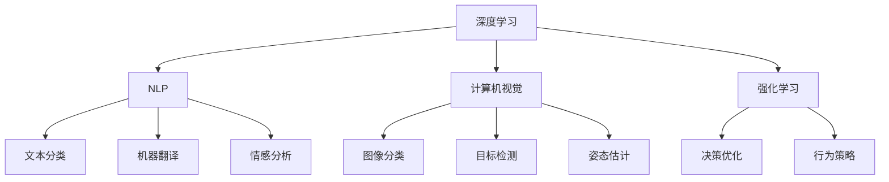

                 

# Andrej Karpathy：人工智能的未来发展趋势

> 关键词：人工智能(AI)、深度学习、机器学习、神经网络、深度学习框架、自动驾驶、计算机视觉、自然语言处理、强化学习、计算机科学

## 1. 背景介绍

### 1.1 问题由来
在过去几十年间，人工智能（AI）领域取得了巨大的进步，特别是在深度学习和机器学习方面。深度学习的核心是神经网络，这种模型通过模拟人类大脑的运作方式，能够从数据中自动学习特征，从而解决复杂问题。特别是，深度学习在计算机视觉和自然语言处理（NLP）领域的应用，如图像识别、语音识别和翻译，已经达到了前所未有的水平。

在计算机视觉领域，深度学习模型已经可以识别和分类图像中的各种物体，甚至能够进行面部识别、目标跟踪等复杂任务。在自然语言处理领域，模型已经能够进行情感分析、机器翻译和文本生成等任务。然而，尽管取得了这些成就，人工智能仍然面临着一些重要的挑战，如数据标注的高成本、模型的可解释性和安全性问题。

Andrej Karpathy，作为深度学习领域的先驱之一，一直以来都在思考和探索AI的未来发展趋势。他的研究成果和见解，对于理解人工智能的未来方向，具有重要的指导意义。

### 1.2 问题核心关键点
Andrej Karpathy认为，人工智能的未来发展将取决于以下几个关键点：

- 数据驱动的深度学习：深度学习模型的性能高度依赖于数据的质量和数量。未来，数据的获取和标注成本将继续是一个重要挑战。
- 可解释性：深度学习模型的“黑盒”特性，使得其决策过程难以解释，这在医疗、金融等领域尤为重要。
- 安全性和鲁棒性：模型可能存在偏见和错误，需要在设计和训练过程中加入安全性考虑。
- 硬件和算力支持：AI的应用场景需要强大的计算资源，硬件的发展将是推动AI前进的关键。

### 1.3 问题研究意义
Andrej Karpathy的研究，对于推动人工智能技术的进一步发展，具有重要意义：

- 帮助学术界和工业界理解深度学习的潜力和限制，指导未来的研究方向。
- 揭示数据驱动的AI技术面临的挑战，为相关领域的专家提供解决方案。
- 为AI技术的部署和安全应用提供理论基础和实践指南。

本文将围绕这些关键点，系统地探讨Andrej Karpathy对人工智能未来发展趋势的见解和建议。

## 2. 核心概念与联系

### 2.1 核心概念概述

为了更好地理解Andrej Karpathy对人工智能未来发展趋势的思考，本节将介绍几个关键的概念：

- 深度学习（Deep Learning）：一种基于神经网络的机器学习方法，能够从大量数据中自动学习特征，适用于处理复杂的数据模式。
- 自然语言处理（NLP）：涉及计算机理解和生成人类语言的技术，包括文本分类、机器翻译、情感分析等任务。
- 计算机视觉（CV）：涉及计算机识别、理解和生成视觉数据的领域，包括图像分类、目标检测、姿态估计等任务。
- 强化学习（RL）：一种通过与环境交互，学习最优决策的机器学习方法。

这些概念之间的逻辑关系可以通过以下Mermaid流程图来展示：



这个流程图展示了一系列的AI相关技术和任务，每个任务又细分为具体的技术问题，如NLP中的情感分析、计算机视觉中的目标检测等。

## 3. 核心算法原理 & 具体操作步骤
### 3.1 算法原理概述

Andrej Karpathy认为，深度学习算法的核心原理是基于神经网络的反向传播算法。该算法通过计算模型输出与真实标签之间的误差，反向传播误差到网络各层，调整网络参数，从而优化模型的性能。

具体来说，反向传播算法包括两个步骤：前向传播和反向传播。前向传播是将输入数据输入模型，计算模型输出。反向传播则是将输出误差通过链式法则，反向传播到网络各层，计算每个参数对误差的贡献，并更新参数值。

### 3.2 算法步骤详解

深度学习的训练过程通常包括以下几个关键步骤：

**Step 1: 数据准备**
- 收集和标注大量数据，确保数据质量和多样性。
- 将数据划分为训练集、验证集和测试集，用于模型训练、调参和评估。

**Step 2: 模型选择**
- 根据任务类型选择适合的深度学习模型，如卷积神经网络（CNN）、循环神经网络（RNN）、变压器（Transformer）等。
- 确定模型架构，包括隐藏层数、神经元数、激活函数等。

**Step 3: 模型训练**
- 使用反向传播算法，通过大量数据训练模型，调整网络参数。
- 选择合适的优化器，如随机梯度下降（SGD）、Adam等，并设置学习率等超参数。
- 定期在验证集上评估模型性能，避免过拟合。

**Step 4: 模型评估和优化**
- 在测试集上评估模型性能，使用准确率、召回率、F1分数等指标进行评估。
- 根据评估结果，调整模型参数和超参数，进行模型优化。

**Step 5: 模型部署和应用**
- 将训练好的模型部署到实际应用场景中，进行推理和预测。
- 监控模型性能，及时更新模型和数据，保持模型的高效性和准确性。

### 3.3 算法优缺点

深度学习算法的优点包括：

- 能够处理高维数据，适用于图像、文本等复杂数据。
- 能够自动学习数据中的特征，无需手动提取。
- 具有较强的泛化能力，能够适应不同的数据分布。

然而，深度学习算法也存在一些缺点：

- 需要大量标注数据，数据获取和标注成本较高。
- 模型结构复杂，训练和推理计算量大。
- 存在过拟合的风险，需要仔细调参和优化。

### 3.4 算法应用领域

深度学习算法在许多领域得到了广泛应用，例如：

- 计算机视觉：如图像分类、目标检测、人脸识别等。
- 自然语言处理：如文本分类、机器翻译、情感分析等。
- 语音识别：如语音转文字、语音合成等。
- 机器人技术：如自动驾驶、机器人控制等。
- 医疗健康：如医学影像分析、疾病预测等。

## 4. 数学模型和公式 & 详细讲解 & 举例说明

### 4.1 数学模型构建

深度学习模型的数学模型通常包括输入、隐藏层、输出和损失函数。下面以一个简单的神经网络为例，介绍其数学模型构建：

设输入为 $x$，隐藏层为 $h$，输出为 $y$，权重为 $W$，偏置为 $b$。神经网络的数学模型可以表示为：

$$
h = f(x \cdot W + b)
$$

$$
y = g(h \cdot W + b)
$$

其中，$f$ 和 $g$ 分别为隐藏层和输出层的激活函数。损失函数通常采用交叉熵损失，定义为：

$$
L(y, \hat{y}) = -\frac{1}{N} \sum_{i=1}^N \sum_{j=1}^C y_i \log \hat{y}_{i,j}
$$

其中，$N$ 为样本数，$C$ 为类别数，$\hat{y}_{i,j}$ 为模型预测的概率分布。

### 4.2 公式推导过程

以一个简单的二分类问题为例，使用sigmoid激活函数，训练神经网络的过程可以表示为：

1. 前向传播：

$$
h = x \cdot W + b
$$

$$
y = \sigma(h)
$$

其中，$\sigma(z) = \frac{1}{1 + e^{-z}}$ 为sigmoid函数。

2. 损失函数计算：

$$
L(y, \hat{y}) = -(y \log \hat{y} + (1 - y) \log (1 - \hat{y}))
$$

3. 反向传播：

$$
\frac{\partial L}{\partial W} = \frac{\partial L}{\partial h} \cdot \frac{\partial h}{\partial W} = (y - \hat{y}) \cdot x^T
$$

$$
\frac{\partial L}{\partial b} = \frac{\partial L}{\partial h} \cdot \frac{\partial h}{\partial b} = y - \hat{y}
$$

通过反向传播算法，可以计算出每个参数对误差的贡献，并更新参数值，从而优化模型。

### 4.3 案例分析与讲解

以图像分类为例，使用卷积神经网络（CNN）进行训练。CNN通过卷积层和池化层提取图像特征，并通过全连接层进行分类。具体步骤如下：

1. 数据准备：收集大量带有标签的图像数据，并进行预处理，如归一化、标准化等。
2. 模型选择：选择适合CNN模型架构，包括卷积层、池化层、全连接层等。
3. 模型训练：使用反向传播算法，训练模型并调整参数。
4. 模型评估：在测试集上评估模型性能，如准确率、召回率等。
5. 模型部署：将训练好的模型部署到实际应用场景中，进行图像分类预测。

## 5. 项目实践：代码实例和详细解释说明

### 5.1 开发环境搭建

在进行深度学习项目实践前，我们需要准备好开发环境。以下是使用Python进行PyTorch开发的环境配置流程：

1. 安装Anaconda：从官网下载并安装Anaconda，用于创建独立的Python环境。

2. 创建并激活虚拟环境：
```bash
conda create -n pytorch-env python=3.8 
conda activate pytorch-env
```

3. 安装PyTorch：根据CUDA版本，从官网获取对应的安装命令。例如：
```bash
conda install pytorch torchvision torchaudio cudatoolkit=11.1 -c pytorch -c conda-forge
```

4. 安装TensorFlow：由Google主导开发的开源深度学习框架，生产部署方便，适合大规模工程应用。同样有丰富的预训练语言模型资源。

5. 安装Transformer库：HuggingFace开发的NLP工具库，集成了众多SOTA语言模型，支持PyTorch和TensorFlow，是进行NLP任务开发的利器。

6. 安装各类工具包：
```bash
pip install numpy pandas scikit-learn matplotlib tqdm jupyter notebook ipython
```

完成上述步骤后，即可在`pytorch-env`环境中开始深度学习实践。

### 5.2 源代码详细实现

这里我们以图像分类任务为例，给出使用PyTorch对CNN模型进行训练的PyTorch代码实现。

首先，定义CNN模型的层结构：

```python
import torch
import torch.nn as nn
import torch.nn.functional as F

class ConvNet(nn.Module):
    def __init__(self):
        super(ConvNet, self).__init__()
        self.conv1 = nn.Conv2d(3, 64, 3, 1)
        self.conv2 = nn.Conv2d(64, 128, 3, 1)
        self.fc1 = nn.Linear(128 * 28 * 28, 1024)
        self.fc2 = nn.Linear(1024, 10)
    
    def forward(self, x):
        x = F.relu(self.conv1(x))
        x = F.max_pool2d(x, 2)
        x = F.relu(self.conv2(x))
        x = F.max_pool2d(x, 2)
        x = x.view(-1, 128 * 28 * 28)
        x = F.relu(self.fc1(x))
        x = self.fc2(x)
        return F.log_softmax(x, dim=1)
```

然后，定义训练和评估函数：

```python
from torch.utils.data import DataLoader
from torchvision.datasets import MNIST
from torchvision.transforms import ToTensor

# 准备数据集
train_dataset = MNIST(root='./data', train=True, transform=ToTensor(), download=True)
test_dataset = MNIST(root='./data', train=False, transform=ToTensor(), download=True)

# 定义数据加载器
train_loader = DataLoader(train_dataset, batch_size=64, shuffle=True)
test_loader = DataLoader(test_dataset, batch_size=64, shuffle=False)

# 定义优化器、学习率和迭代轮数
optimizer = torch.optim.Adam(model.parameters(), lr=0.001)
num_epochs = 10

# 训练函数
def train_epoch(model, loader, optimizer):
    model.train()
    losses = []
    for images, labels in loader:
        images = images.to(device)
        labels = labels.to(device)
        optimizer.zero_grad()
        outputs = model(images)
        loss = F.nll_loss(outputs, labels)
        losses.append(loss.item())
        loss.backward()
        optimizer.step()
    return sum(losses) / len(loader)

# 评估函数
def evaluate(model, loader):
    model.eval()
    correct = 0
    total = 0
    with torch.no_grad():
        for images, labels in loader:
            images = images.to(device)
            labels = labels.to(device)
            outputs = model(images)
            _, predicted = torch.max(outputs.data, 1)
            total += labels.size(0)
            correct += (predicted == labels).sum().item()
    return correct / total

# 训练和评估
device = torch.device('cuda' if torch.cuda.is_available() else 'cpu')
model.to(device)
for epoch in range(num_epochs):
    train_loss = train_epoch(model, train_loader, optimizer)
    test_acc = evaluate(model, test_loader)
    print(f'Epoch {epoch+1}, train loss: {train_loss:.4f}, test accuracy: {test_acc:.4f}')
```

以上就是使用PyTorch对CNN模型进行图像分类任务训练的完整代码实现。可以看到，得益于PyTorch的强大封装，我们可以用相对简洁的代码完成CNN模型的搭建和训练。

### 5.3 代码解读与分析

让我们再详细解读一下关键代码的实现细节：

**ConvNet类**：
- `__init__`方法：定义了模型的层结构，包括卷积层、池化层、全连接层等。
- `forward`方法：定义了模型的前向传播过程。

**train_epoch函数**：
- 在训练集上进行前向传播和反向传播，计算损失函数，更新模型参数。

**evaluate函数**：
- 在测试集上进行前向传播，计算模型预测结果，并计算准确率。

**训练流程**：
- 定义总的迭代轮数和优化器。
- 在每个epoch内，先在训练集上训练，输出平均loss。
- 在验证集上评估，输出测试准确率。
- 重复上述步骤直至训练完成。

可以看到，PyTorch的简洁和高效使得深度学习模型的训练过程变得简单快捷，开发者可以将更多精力放在模型改进和算法优化上。

## 6. 实际应用场景

### 6.1 智能客服系统

基于深度学习的智能客服系统，可以应用于客户咨询解答。传统客服往往需要配备大量人力，高峰期响应缓慢，且一致性和专业性难以保证。而使用深度学习模型进行客服系统构建，能够7x24小时不间断服务，快速响应客户咨询，用自然流畅的语言解答各类常见问题。

在技术实现上，可以收集企业内部的历史客服对话记录，将问题和最佳答复构建成监督数据，在此基础上对预训练深度学习模型进行微调。微调后的模型能够自动理解用户意图，匹配最合适的答案模板进行回复。对于客户提出的新问题，还可以接入检索系统实时搜索相关内容，动态组织生成回答。如此构建的智能客服系统，能大幅提升客户咨询体验和问题解决效率。

### 6.2 金融舆情监测

金融机构需要实时监测市场舆论动向，以便及时应对负面信息传播，规避金融风险。传统的人工监测方式成本高、效率低，难以应对网络时代海量信息爆发的挑战。基于深度学习的文本分类和情感分析技术，为金融舆情监测提供了新的解决方案。

具体而言，可以收集金融领域相关的新闻、报道、评论等文本数据，并对其进行主题标注和情感标注。在此基础上对深度学习模型进行微调，使其能够自动判断文本属于何种主题，情感倾向是正面、中性还是负面。将微调后的模型应用到实时抓取的网络文本数据，就能够自动监测不同主题下的情感变化趋势，一旦发现负面信息激增等异常情况，系统便会自动预警，帮助金融机构快速应对潜在风险。

### 6.3 个性化推荐系统

当前的推荐系统往往只依赖用户的历史行为数据进行物品推荐，无法深入理解用户的真实兴趣偏好。基于深度学习的个性化推荐系统，可以更好地挖掘用户行为背后的语义信息，从而提供更精准、多样的推荐内容。

在实践中，可以收集用户浏览、点击、评论、分享等行为数据，提取和用户交互的物品标题、描述、标签等文本内容。将文本内容作为模型输入，用户的后续行为（如是否点击、购买等）作为监督信号，在此基础上微调深度学习模型。微调后的模型能够从文本内容中准确把握用户的兴趣点。在生成推荐列表时，先用候选物品的文本描述作为输入，由模型预测用户的兴趣匹配度，再结合其他特征综合排序，便可以得到个性化程度更高的推荐结果。

### 6.4 未来应用展望

随着深度学习技术的不断进步，基于深度学习的AI技术将在更多领域得到应用，为传统行业带来变革性影响。

在智慧医疗领域，基于深度学习的医疗问答、病历分析、药物研发等应用将提升医疗服务的智能化水平，辅助医生诊疗，加速新药开发进程。

在智能教育领域，深度学习可应用于作业批改、学情分析、知识推荐等方面，因材施教，促进教育公平，提高教学质量。

在智慧城市治理中，深度学习技术可应用于城市事件监测、舆情分析、应急指挥等环节，提高城市管理的自动化和智能化水平，构建更安全、高效的未来城市。

此外，在企业生产、社会治理、文娱传媒等众多领域，基于深度学习的AI应用也将不断涌现，为经济社会发展注入新的动力。相信随着技术的日益成熟，深度学习范式将成为AI技术落地应用的重要手段，推动人工智能技术向更广阔的领域加速渗透。

## 7. 工具和资源推荐
### 7.1 学习资源推荐

为了帮助开发者系统掌握深度学习的理论基础和实践技巧，这里推荐一些优质的学习资源：

1. 《深度学习》书籍：由Ian Goodfellow、Yoshua Bengio、Aaron Courville所著，全面介绍了深度学习的基本概念和算法。
2. CS231n《卷积神经网络》课程：斯坦福大学开设的深度学习课程，详细讲解了卷积神经网络的原理和应用。
3. CS224n《自然语言处理》课程：斯坦福大学开设的自然语言处理课程，介绍了自然语言处理的基本框架和算法。
4. 《PyTorch教程》：由PyTorch官方文档编写，提供了丰富的实例和示例代码，帮助开发者快速上手。
5. 《TensorFlow教程》：由TensorFlow官方文档编写，提供了详细的TensorFlow使用指南和示例。

通过对这些资源的学习实践，相信你一定能够快速掌握深度学习的精髓，并用于解决实际的AI问题。

### 7.2 开发工具推荐

高效的开发离不开优秀的工具支持。以下是几款用于深度学习开发的常用工具：

1. PyTorch：基于Python的开源深度学习框架，灵活动态的计算图，适合快速迭代研究。大部分深度学习模型都有PyTorch版本的实现。
2. TensorFlow：由Google主导开发的开源深度学习框架，生产部署方便，适合大规模工程应用。同样有丰富的深度学习模型资源。
3. Keras：基于Python的深度学习库，提供了高层次的API，易于上手和实现。
4. Theano：由蒙特利尔大学开发的深度学习库，支持GPU加速，适合进行深度学习算法研究。
5. JAX：由Google开发的深度学习库，提供了自动微分和矢量化的优化，支持高性能计算。

合理利用这些工具，可以显著提升深度学习模型的开发效率，加快创新迭代的步伐。

### 7.3 相关论文推荐

深度学习技术的发展源于学界的持续研究。以下是几篇奠基性的相关论文，推荐阅读：

1. 《ImageNet Classification with Deep Convolutional Neural Networks》：提出卷积神经网络（CNN），开启了计算机视觉领域的深度学习应用。
2. 《Deep Learning》：Ian Goodfellow、Yoshua Bengio、Aaron Courville所著，全面介绍了深度学习的基本原理和应用。
3. 《Convolutional Neural Networks for Visual Recognition》：提出卷积神经网络（CNN），用于图像分类和目标检测等任务。
4. 《Natural Language Processing with Neural Networks》：Yann LeCun等所著，介绍了深度学习在自然语言处理中的应用。
5. 《Attention Is All You Need》：提出Transformer模型，用于机器翻译和自然语言处理。

这些论文代表了大深度学习技术的发展脉络。通过学习这些前沿成果，可以帮助研究者把握学科前进方向，激发更多的创新灵感。

## 8. 总结：未来发展趋势与挑战

### 8.1 总结

本文对Andrej Karpathy对深度学习未来发展趋势的思考进行了全面系统的介绍。首先，阐述了深度学习模型的核心原理和训练过程，明确了深度学习在计算机视觉、自然语言处理等领域的应用前景。其次，从原理到实践，详细讲解了深度学习模型的数学模型构建和训练流程，给出了深度学习模型训练的完整代码实例。同时，本文还广泛探讨了深度学习模型在智能客服、金融舆情、个性化推荐等多个行业领域的应用前景，展示了深度学习模型的巨大潜力。

通过本文的系统梳理，可以看到，深度学习模型在计算机视觉、自然语言处理等领域的应用前景广阔，已经逐渐成为现代AI技术的重要范式。未来，随着深度学习技术的不断进步，基于深度学习的AI技术将在更多领域得到应用，为传统行业带来变革性影响。

### 8.2 未来发展趋势

展望未来，深度学习模型的发展将呈现以下几个趋势：

1. 模型规模持续增大。随着算力成本的下降和数据规模的扩张，深度学习模型的参数量还将持续增长。超大批次的训练和推理计算量将继续增大。
2. 多模态学习：深度学习模型将逐渐从单一模态学习向多模态学习转变，能够处理图像、语音、文本等多种模态数据。
3. 迁移学习：深度学习模型将逐渐从单任务学习向多任务学习转变，能够在多个相关任务上进行迁移学习，提高泛化能力和应用效率。
4. 自动化学习：深度学习模型将逐渐从手工调参向自动化调参转变，通过算法和工具，自动优化模型超参数和结构。
5. 可解释性：深度学习模型将逐渐从黑盒向可解释性转变，通过可视化工具和可解释性技术，提高模型的透明性和可解释性。

### 8.3 面临的挑战

尽管深度学习技术已经取得了瞩目成就，但在迈向更加智能化、普适化应用的过程中，它仍面临着诸多挑战：

1. 数据标注成本高。深度学习模型需要大量标注数据，数据获取和标注成本较高，难以大规模应用。
2. 模型复杂度高。深度学习模型的结构复杂，训练和推理计算量大，硬件资源需求高。
3. 可解释性差。深度学习模型的“黑盒”特性，使得其决策过程难以解释，不利于实际应用。
4. 鲁棒性不足。深度学习模型面对域外数据时，泛化性能往往大打折扣。
5. 安全性问题。深度学习模型可能存在偏见和错误，需要在设计和训练过程中加入安全性考虑。

### 8.4 研究展望

面对深度学习面临的挑战，未来的研究需要在以下几个方面寻求新的突破：

1. 探索无监督学习和半监督学习方法。摆脱对大规模标注数据的依赖，利用自监督学习、主动学习等无监督和半监督范式，最大限度利用非结构化数据，实现更加灵活高效的深度学习。
2. 开发参数高效和计算高效的深度学习范式。开发更加参数高效的深度学习模型，在固定大部分深度学习参数的同时，只更新极少量的任务相关参数。同时优化深度学习模型的计算图，减少前向传播和反向传播的资源消耗，实现更加轻量级、实时性的部署。
3. 引入因果学习和对比学习范式。通过引入因果推断和对比学习思想，增强深度学习模型的泛化能力和鲁棒性，学习更加普适、鲁棒的语言表征。
4. 引入更多先验知识。将符号化的先验知识，如知识图谱、逻辑规则等，与神经网络模型进行巧妙融合，引导深度学习模型的训练过程，提高模型的解释性和准确性。
5. 结合因果分析和博弈论工具。将因果分析方法引入深度学习模型，识别出模型决策的关键特征，增强输出解释的因果性和逻辑性。借助博弈论工具刻画人机交互过程，主动探索并规避模型的脆弱点，提高系统稳定性。

这些研究方向的探索，必将引领深度学习技术的进一步发展，为构建安全、可靠、可解释、可控的智能系统铺平道路。面向未来，深度学习技术还需要与其他人工智能技术进行更深入的融合，如知识表示、因果推理、强化学习等，多路径协同发力，共同推动深度学习技术的进步。

## 9. 附录：常见问题与解答

**Q1：深度学习模型是否适用于所有领域？**

A: 深度学习模型在许多领域得到了广泛应用，如计算机视觉、自然语言处理、语音识别等。但对于一些特定领域，如医疗、法律等，仅仅依靠通用语料预训练的模型可能难以很好地适应。此时需要在特定领域语料上进一步预训练，再进行微调，才能获得理想效果。

**Q2：深度学习模型需要大量标注数据，如何降低数据标注成本？**

A: 可以通过无监督学习和半监督学习方法，利用大量未标注数据进行自监督学习，减少标注成本。同时，采用数据增强、迁移学习等技术，最大化利用已有数据，降低标注需求。

**Q3：深度学习模型的可解释性差，如何解决？**

A: 可以通过可视化工具和可解释性技术，如梯度可视、特征归因等，提高模型的透明性和可解释性。同时，引入因果学习和对比学习范式，增强模型的可解释性。

**Q4：深度学习模型的鲁棒性不足，如何提高？**

A: 可以通过正则化技术、对抗训练等方法，提高模型的泛化能力和鲁棒性。同时，引入因果学习和对比学习范式，增强模型的泛化能力和鲁棒性。

**Q5：深度学习模型的安全性问题，如何解决？**

A: 可以通过引入伦理导向的评估指标，过滤和惩罚有偏见、有害的输出倾向。同时，加强人工干预和审核，建立模型行为的监管机制，确保输出符合人类价值观和伦理道德。

**Q6：如何优化深度学习模型的训练过程？**

A: 可以通过自动化调参、模型裁剪、量化加速等方法，优化深度学习模型的训练过程。同时，引入因果学习和对比学习范式，提高模型的训练效率和效果。

通过本文的系统梳理，可以看到，深度学习技术在计算机视觉、自然语言处理等领域的应用前景广阔，已经逐渐成为现代AI技术的重要范式。未来，随着深度学习技术的不断进步，基于深度学习的AI技术将在更多领域得到应用，为传统行业带来变革性影响。面向未来，深度学习技术还需要与其他人工智能技术进行更深入的融合，如知识表示、因果推理、强化学习等，多路径协同发力，共同推动深度学习技术的进步。

---

作者：禅与计算机程序设计艺术 / Zen and the Art of Computer Programming

